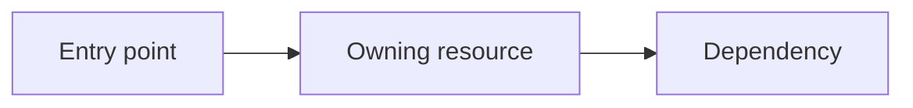
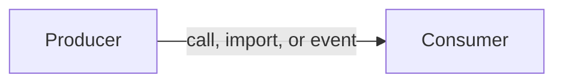
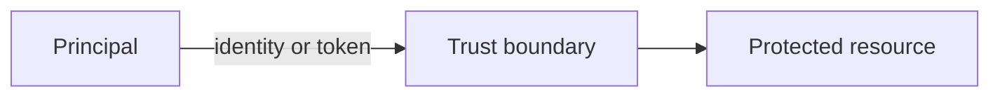

<!-- ───────────────────────────────
  Template:     Architecture
  Template-ID:  architecture
  Generates:    docs/architecture.md
  Description:  Resolved from WebexTools/repo-standards templates/docs/architecture.md
  Library ver:  0.3.0
  Source:       WebexTools/repo-standards@d89a7fe59126ae3ad9bac9ca352aa7f12b4c85dc templates/docs/architecture.md
  Last updated: 2026-08-24
─────────────────────────────── -->

# [Repository name] architecture

Canonical repository-wide architecture. This document owns facts that span
multiple services, packages, modules, applications, or repositories. Link to
the owning service, module, feature, ADR, or native contract instead of
duplicating owner-local detail.

Related context: [specification registry](specs/README.md) ·
[repository agent instructions](../AGENTS.md)

## Applicability

Sections preceded by an `Include if` comment are conditional. Retain a
conditional section only when repository evidence satisfies its condition.
Record `Unresolved` while the evidence or developer answer is still missing;
do not infer an answer from the repository type alone.

| Condition ID                         | Status                        | Evidence or reason | Owned section                       |
| ------------------------------------ | ----------------------------- | ------------------ | ----------------------------------- |
| `repo.owns_datastore`                | Applicable / N/A / Unresolved | `[path or reason]` | Repository data and schema          |
| `repo.holds_client_state`            | Applicable / N/A / Unresolved | `[path or reason]` | Client state model                  |
| `repo.components_interact`           | Applicable / N/A / Unresolved | `[path or reason]` | Dependency and interaction topology |
| `repo.domain_data_across_components` | Applicable / N/A / Unresolved | `[path or reason]` | Object and data ownership           |
| `repo.caches_data`                   | Applicable / N/A / Unresolved | `[path or reason]` | Caching catalog                     |
| `repo.observability_convention`      | Applicable / N/A / Unresolved | `[path or reason]` | Observability patterns              |
| `repo.deploys_to_infra`              | Applicable / N/A / Unresolved | `[path or reason]` | Runtime and infrastructure          |
| `repo.shared_base_libs`              | Applicable / N/A / Unresolved | `[path or reason]` | Shared and base libraries           |
| `repo.is_monorepo`                   | Applicable / N/A / Unresolved | `[path or reason]` | Package map and dependencies        |
| `repo.multi_platform`                | Applicable / N/A / Unresolved | `[path or reason]` | Platform matrix                     |
| `repo.published_package`             | Applicable / N/A / Unresolved | `[path or reason]` | Release and versioning              |
| `repo.embedded_in_host`              | Applicable / N/A / Unresolved | `[path or reason]` | Host integration and theming        |
| `repo.exposes_commands_or_artifacts` | Applicable / N/A / Unresolved | `[path or reason]` | Commands and generated artifacts    |
| `repo.cross_repo_deps_material`      | Applicable / N/A / Unresolved | `[path or reason]` | Cross-repository topology           |
| `repo.security_arch_warranted`       | Applicable / N/A / Unresolved | `[path or reason]` | Security architecture               |

## Design overview

Explain the repository's purpose, architectural shape, boundaries, and the key
decisions that explain why it is organized this way.

## Resource inventory and responsibilities

List the repository resources that own stable behavior. A resource can be a
deployable service, package, application, CLI, module, infrastructure unit, or
other independently owned boundary.

| Resource | Kind                                                    | Responsibility          | Owner          | Source   | Detailed specification |
| -------- | ------------------------------------------------------- | ----------------------- | -------------- | -------- | ---------------------- |
| [name]   | [service, package, app, CLI, module, or infrastructure] | [single responsibility] | [team or role] | `[path]` | `[path or N/A]`        |

## Interaction and execution flows

Show how resources call, import, publish to, or otherwise depend on one
another. Include the representative end-to-end flow and important
failure/recovery branches.

| From       | To         | Interaction or transport                | Purpose  | Failure or compatibility behavior           |
| ---------- | ---------- | --------------------------------------- | -------- | ------------------------------------------- |
| [resource] | [resource] | [call, event, import, file, or command] | [reason] | [timeout, retry, fallback, or version rule] |

## Dependency topology

| Dependency | Type                       | Used by    | Purpose | Version, failure, or fallback policy |
| ---------- | -------------------------- | ---------- | ------- | ------------------------------------ |
| [name]     | Internal / External / Peer | [resource] | [usage] | [policy]                             |

Record cycles, single points of failure, and ordering constraints. Link exact
configuration or package manifests rather than copying dependency versions.

## Public and consumer surfaces

Keep this as a compact catalog. Exact API, event, command, package, file, or
schema definitions remain in their native source and owner specification.

| Surface | Type                                 | Owner      | Consumers   | Compatibility policy                         | Source                           |
| ------- | ------------------------------------ | ---------- | ----------- | -------------------------------------------- | -------------------------------- |
| [name]  | API / Event / SDK / CLI / File / RPC | [resource] | [consumers] | [stability, versioning, or deprecation rule] | `[schema, declaration, or path]` |

<!-- Include if: the repository owns a datastore. [condition-id: repo.owns_datastore] -->

## Repository data and schema

Summarize the repository-owned datastores, schemas, and migration discipline.
Detailed entities and migrations remain with the owning service or module.

| Datastore or schema | Owning resource | Source of truth | Migration and compatibility rule |
| ------------------- | --------------- | --------------- | -------------------------------- |
| [name]              | [resource]      | `[path]`        | [rule]                           |

<!-- Include if: the repository holds client-side or in-memory session state. [condition-id: repo.holds_client_state] -->

## Client state model

Describe repository-wide state slices, ownership, persistence boundaries, and
the events or actions that trigger transitions. Do not describe server-owned
data as client state.

| State or slice | Owner      | Transition triggers | Persistence or reset boundary |
| -------------- | ---------- | ------------------- | ----------------------------- |
| [name]         | [resource] | [events or actions] | [rule]                        |

## Cross-cutting architecture

### Security

- Trust boundaries and identity flow: [boundaries and enforcement points]
- Sensitive surfaces and data classes: [summary and canonical policy links]
- Encryption and secret boundaries: [architectural posture]

### Observability and operations

- Logging and correlation: [repository convention]
- Metrics, traces, and audit signals: [convention and primary links]
- Ownership and operational entry points: [dashboards, alerts, or runbooks]

### Quality attributes

State measurable repository-level expectations in the form that fits this
repository: service SLOs, SDK footprint and compatibility, UI performance and
accessibility, CLI startup/footprint, batch throughput/cost, or another
evidence-backed quality boundary.

<!-- Include if: repository resources call, import, or exchange events with one another. [condition-id: repo.components_interact] -->

## Dependency and interaction topology

Provide a first-class call, import, and event graph when the interaction cannot
be understood safely from the representative flow alone.

| From       | To         | Kind                  | Purpose  | Ordering or failure boundary |
| ---------- | ---------- | --------------------- | -------- | ---------------------------- |
| [resource] | [resource] | Call / Import / Event | [reason] | [guarantee]                  |

<!-- Include if: repository-owned domain data spans multiple resources. [condition-id: repo.domain_data_across_components] -->

## Object and data ownership

Identify the single writer and authorized readers for each cross-resource
domain object. Link owner-local schema and lifecycle detail.

| Object or state | System of record | May write | May read  | Movement or lifecycle |
| --------------- | ---------------- | --------- | --------- | --------------------- |
| [name]          | [resource]       | [writer]  | [readers] | [flow or rule]        |

<!-- Include if: the repository caches data. [condition-id: repo.caches_data] -->

## Caching catalog

| Cache  | Owner      | Backend   | Contents | TTL or bound | Invalidation trigger | Failure behavior |
| ------ | ---------- | --------- | -------- | ------------ | -------------------- | ---------------- |
| [name] | [resource] | [backend] | [data]   | [duration]   | [event or action]    | [fallback]       |

<!-- Include if: the repository has logging, metrics, tracing, or audit conventions worth standardizing. [condition-id: repo.observability_convention] -->

## Observability patterns

| Signal  | Convention or required fields | Propagation or naming rule | Primary evidence |
| ------- | ----------------------------- | -------------------------- | ---------------- |
| Logs    | [format and redaction]        | [correlation rule]         | `[path or link]` |
| Metrics | [key signals]                 | [name and labels]          | `[path or link]` |
| Traces  | [span boundaries]             | [context propagation]      | `[path or link]` |
| Audit   | [audited actions]             | [identity and retention]   | `[path or link]` |

<!-- Include if: the repository deploys to or materially depends on infrastructure. [condition-id: repo.deploys_to_infra] -->

## Runtime and infrastructure

Keep per-service endpoints, flags, limits, and SLO detail in the applicable
[service specification](service.md).

| Resource     | Runtime or deployment shape     | Infrastructure                       | Availability or recovery boundary |
| ------------ | ------------------------------- | ------------------------------------ | --------------------------------- |
| [deployable] | [runtime, process, or topology] | [platform, store, queue, or service] | [HA, recovery, or N/A]            |

<!-- Include if: modules inherit a shared or base library stack. [condition-id: repo.shared_base_libs] -->

## Shared and base libraries

| Library | Inherited responsibility | Consumers       | Version floor | Compatibility rule |
| ------- | ------------------------ | --------------- | ------------- | ------------------ |
| [name]  | [behavior or convention] | [all resources] | [version]     | [rule]             |

<!-- Include if: the repository is a monorepo containing multiple packages. [condition-id: repo.is_monorepo] -->

## Package map and inter-package dependencies

| Package   | Visibility        | Responsibility | Depends on | Consumers   |
| --------- | ----------------- | -------------- | ---------- | ----------- |
| [package] | Public / Internal | [role]         | [packages] | [consumers] |

Record workspace boundaries, prohibited dependency directions, cycles, and
the repository's version-synchronization rule.

<!-- Include if: the repository targets multiple runtime or host platforms. [condition-id: repo.multi_platform] -->

## Platform matrix

| Platform   | Shared versus platform-specific boundary | Entry or build      | Support and compatibility constraints |
| ---------- | ---------------------------------------- | ------------------- | ------------------------------------- |
| [platform] | [split]                                  | `[path or command]` | [constraints]                         |

<!-- Include if: the repository publishes a package or consumer artifact. [condition-id: repo.published_package] -->

## Release and versioning

| Artifact | Publish target | Versioning rule | Deprecation window | Changelog or migration obligation |
| -------- | -------------- | --------------- | ------------------ | --------------------------------- |
| [name]   | [registry]     | [semver policy] | [window]           | [requirement]                     |

<!-- Include if: the repository is embedded in a host application. [condition-id: repo.embedded_in_host] -->

## Host integration and theming

| Host or integration | Mount or entry contract | Required providers or peers | Theming and accessibility constraints |
| ------------------- | ----------------------- | --------------------------- | ------------------------------------- |
| [host]              | [contract]              | [requirements]              | [constraints]                         |

<!-- Include if: the repository exposes commands, generators, or stable file outputs. [condition-id: repo.exposes_commands_or_artifacts] -->

## Commands and generated artifacts

| Command or artifact | Owner      | Inputs                    | Output or side effect | Compatibility boundary |
| ------------------- | ---------- | ------------------------- | --------------------- | ---------------------- |
| [name]              | [resource] | [flags, config, or files] | [output]              | [stability rule]       |

<!-- Include if: cross-repository dependencies materially affect behavior or delivery. [condition-id: repo.cross_repo_deps_material] -->

## Cross-repository topology

| Repository or external system | Relationship                      | Exchanged contract or artifact | Owner          | Sequencing constraint |
| ----------------------------- | --------------------------------- | ------------------------------ | -------------- | --------------------- |
| [name]                        | Consumes / Provides / Coordinates | [contract]                     | [team or role] | [order or N/A]        |

<!-- Include if: trust boundaries or identity flows warrant a dedicated architectural view. [condition-id: repo.security_arch_warranted] -->

## Security architecture

Describe trust boundaries, identity and token flow, encryption boundaries, and
the architectural controls that constrain resource interaction. Link the
authoritative security policy instead of copying governance requirements.

## Domain language

| Term   | Repository-specific meaning | Authoritative source      |
| ------ | --------------------------- | ------------------------- |
| [term] | [precise definition]        | `[type, schema, or path]` |

## References and maintenance

- Decisions: [adr/](adr/)
- Instantiated specifications and routing: [specs/README.md](specs/README.md)
- Repository rules and patterns: [links when available]
- Update this document in the same change that alters repository boundaries,
  resource ownership, cross-resource interaction, or cross-cutting
  architecture.
