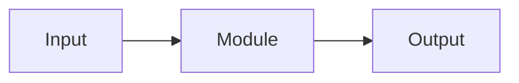
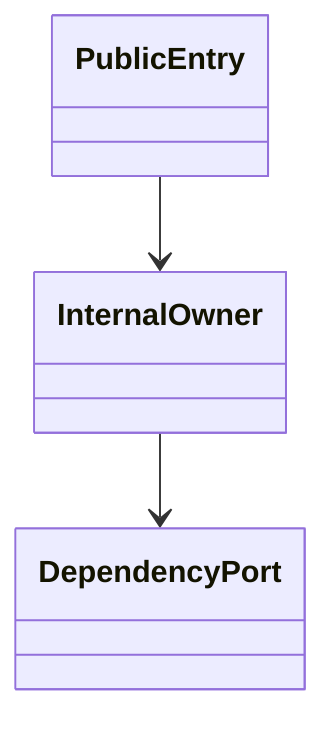
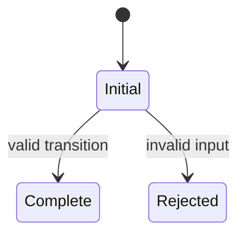

<!-- ───────────────────────────────
  Template:     Module Spec
  Template-ID:  module-spec
  Generates:    <module-path>/docs/README.md
  Description:  Resolved from WebexTools/repo-standards templates/docs/specs/module/README.md
  Library ver:  0.3.0
  Source:       WebexTools/repo-standards@d89a7fe59126ae3ad9bac9ca352aa7f12b4c85dc templates/docs/specs/module/README.md
  Last updated: 2026-08-24
─────────────────────────────── -->

# [Module name]

This source-local document at `<module-path>/docs/README.md` owns the stable
specification for **[module name]**. Ground every claim in repository evidence
and link to the
[repository architecture](../../architecture.md) and applicable
[service specification](../../service.md) instead of repeating broader facts.

Related context: [documentation index](../../index.md) ·
[documentation agent instructions](../../AGENTS.md)

## Metadata

| Field         | Value                                                        |
| ------------- | ------------------------------------------------------------ |
| Owner         | [team or role]                                               |
| Source path   | `[module path]`                                              |
| Resource kind | [module, package, UI component, CLI unit, or other boundary] |
| Status        | Draft / Active / Deprecated                                  |
| Last verified | YYYY-MM-DD at `[commit]`                                     |
| Module id     | `[module-id]`                                                |
| Parent spec   | the parent module's canonical spec path, or `—` when this module has no parent module |
| Doc kind      | Module spec                                                  |
| Coverage score | Pending coverage assessment, or `[percent]%` assessed `YYYY-MM-DD` |
| Validation status | not-run / pass / pass-with-warnings / blocked, validator `[runtime]`, assessed `YYYY-MM-DD` |

## Applicability

Sections preceded by an `Include if` comment are conditional. Retain a
conditional section only when source evidence or a confirmed developer answer
satisfies its condition. Record `Unresolved` instead of guessing.

| Condition ID                         | Status                        | Evidence or reason | Owned section                 |
| ------------------------------------ | ----------------------------- | ------------------ | ----------------------------- |
| `module.has_tiers`                   | Applicable / N/A / Unresolved | `[path or reason]` | Tier                          |
| `module.has_ui`                      | Applicable / N/A / Unresolved | `[path or reason]` | UI use-case flow              |
| `module.crosses_service_boundaries`  | Applicable / N/A / Unresolved | `[path or reason]` | Cross-boundary use-case flow  |
| `module.holds_client_state`          | Applicable / N/A / Unresolved | `[path or reason]` | Client state model            |
| `module.enforces_domain_rules`       | Applicable / N/A / Unresolved | `[path or reason]` | Business rules and invariants |
| `module.is_concurrent_async`         | Applicable / N/A / Unresolved | `[path or reason]` | Concurrency and reactive flow |
| `module.owns_persistence`            | Applicable / N/A / Unresolved | `[path or reason]` | Data, schema, and migration   |
| `module.stateful_transitions`        | Applicable / N/A / Unresolved | `[path or reason]` | State machine                 |
| `module.exposes_wire_protocol`       | Applicable / N/A / Unresolved | `[path or reason]` | Protocol and wire format      |
| `module.ui_multi_screen`             | Applicable / N/A / Unresolved | `[path or reason]` | UI flow                       |
| `module.large_data_model`            | Applicable / N/A / Unresolved | `[path or reason]` | Data model                    |
| `module.returns_caller_errors`       | Applicable / N/A / Unresolved | `[path or reason]` | Caller-visible failure modes  |
| `module.module_specific_conventions` | Applicable / N/A / Unresolved | `[path or reason]` | Module-specific rules         |
| `module.published_package`           | Applicable / N/A / Unresolved | `[path or reason]` | Export stability              |
| `module.embedded_in_host`            | Applicable / N/A / Unresolved | `[path or reason]` | Host integration and theming  |
| `module.has_design_tradeoff`         | Applicable / N/A / Unresolved | `[path or reason]` | Key design trade-off          |
| `module.has_submodules`              | Applicable / N/A / Unresolved | `[path or reason]` | Sub-modules                   |

## Evidence register

List the code, tests, schemas, configuration, and prior decisions used to
verify this specification. Mark unresolved statements as `[NEEDS HUMAN INPUT]`;
do not infer missing behavior.

| Evidence         | What it establishes |
| ---------------- | ------------------- |
| `[path or link]` | [verified fact]     |

## Purpose and boundary

- Responsibility: [what this module owns]
- In scope: [behavior and data owned here]
- Out of scope: [neighboring responsibilities]
- Consumers: [internal or external callers]

<!-- Include if: the repository assigns operational or review tiers to modules. [condition-id: module.has_tiers] -->

## Tier

- Tier: [repository-defined tier]
- Implications: [SLO, review, ownership, or support obligations]
- Evidence: `[policy or configuration path]`

## Structure and key files

| Path     | Responsibility                     |
| -------- | ---------------------------------- |
| `[path]` | [role and why it is authoritative] |

<!-- Include if: this module contains child modules that own their own specifications. [condition-id: module.has_submodules] -->

## Sub-modules

Route each direct child responsibility to its owning module specification.
Name the boundary here, but keep the child's detailed behavior in its own
document so requirements and verification are not duplicated across levels.

| Sub-module            | Responsibility               | Specification                        |
| --------------------- | ---------------------------- | ------------------------------------ |
| `[child module path]` | [responsibility owned there] | `[child module path]/docs/README.md` |

## Public surface

Describe exported APIs, events, commands, files, or UI boundaries. Link exact
schemas or declarations instead of copying them.

| Surface  | Consumer   | Compatibility commitment | Source   |
| -------- | ---------- | ------------------------ | -------- |
| `[name]` | [consumer] | [policy]                 | `[path]` |

## Dependencies

| Dependency            | Why it is required | Failure behavior                    |
| --------------------- | ------------------ | ----------------------------------- |
| `[module or service]` | [reason]           | [timeout, fallback, or propagation] |

## Requirements

Separate source evidence, test/example evidence, assumptions, and gaps so a
future contributor can distinguish verified behavior from approved unknowns.

| ID        | WHAT                                           | WHY                            | Source evidence | Test or example evidence            | Assumptions or gaps | Confidence                        |
| --------- | ---------------------------------------------- | ------------------------------ | --------------- | ----------------------------------- | ------------------- | --------------------------------- |
| `MOD-001` | [observable behavior or compatibility promise] | [reason it must remain stable] | `[source path]` | `[test/example path]` or none found | [gap or none]       | Present / Weak / Approved unknown |

## Design overview

Explain the module’s internal shape, important trade-offs, and ownership of
state. Ground the explanation in source and test paths.

## Data flow and sequence coverage

Name the exact transport or call style. Inventory the major operation groups
before adding diagrams, and include failure, timeout, retry, rejection,
rollback, or recovery behavior where it exists.

| Operation group | Entry and outcome | Diagram or evidence | Failure and recovery coverage |
| --------------- | ----------------- | ------------------- | ----------------------------- |
| [operation]     | [flow]            | `[path or diagram]` | [covered branches]            |

## Class and component relationships

Show the important types or subcomponents and their inheritance, composition,
dependency-injection, or ownership relationships. Avoid an exhaustive class
dump.

## Use cases and flows

| Use case | Actor or caller | Primary steps and outcome     | Failure or boundary behavior | Evidence                  |
| -------- | --------------- | ----------------------------- | ---------------------------- | ------------------------- |
| `UC-001` | [actor]         | [steps and observable result] | [failure/recovery path]      | `[source and test paths]` |

<!-- Include if: the module has a user interface. [condition-id: module.has_ui] -->

### UI use-case flow

For each affected use case, record screens, user actions, loading/empty/error
states, accessibility behavior, and the observable outcome.

<!-- Include if: the module calls another service or crosses an event or network boundary. [condition-id: module.crosses_service_boundaries] -->

### Cross-boundary use-case flow

For each affected use case, record the boundary, transport, ordering,
compatibility, timeout, retry, and recovery behavior.

<!-- Include if: the module holds client-side state. [condition-id: module.holds_client_state] -->

## Client state model

| State or slice | Owner      | Initial state | Transition triggers | Reset or persistence boundary |
| -------------- | ---------- | ------------- | ------------------- | ----------------------------- |
| [name]         | [resource] | [state]       | [events or actions] | [rule]                        |

<!-- Include if: the module enforces domain rules or entity invariants. [condition-id: module.enforces_domain_rules] -->

## Business rules and invariants

| ID        | Invariant                            | WHY         | Enforcement source | Test evidence |
| --------- | ------------------------------------ | ----------- | ------------------ | ------------- |
| `INV-001` | [condition that must always be true] | [rationale] | `[path]`           | `[path]`      |

<!-- Include if: the module is concurrent, asynchronous, reactive, or event-driven. [condition-id: module.is_concurrent_async] -->

## Concurrency and reactive flow

- Execution model: [threads, event loop, workers, subscriptions, or jobs]
- Ordering guarantees: [guarantee and scope]
- Idempotency and retry: [keys, deduplication, retry ownership]
- Shared-state protection: [locking, serialization, immutability, or owner]
- Blocking restrictions: [work that must not block and why]

<!-- Include if: the module owns persisted data and its migrations. [condition-id: module.owns_persistence] -->

## Data, schema, and migration discipline

| Store or schema | Owned entities or keys | Source of truth | Migration and compatibility rule |
| --------------- | ---------------------- | --------------- | -------------------------------- |
| [name]          | [entities]             | `[path]`        | [rule]                           |

Record retention, deletion, backfill, rollback, and cache behavior where they
affect the owned data.

<!-- Include if: the module has non-trivial state transitions. [condition-id: module.stateful_transitions] -->

## State machine

Describe states, transition triggers, guards, terminal states, and rejected
transitions.

<!-- Include if: callers depend on a wire protocol or serialized format. [condition-id: module.exposes_wire_protocol] -->

## Protocol and wire format

| Message or frame | Version | Producer or serializer | Consumer or parser | Compatibility and ordering rule |
| ---------------- | ------- | ---------------------- | ------------------ | ------------------------------- |
| [name]           | [value] | `[path]`               | `[path]`           | [rule]                          |

<!-- Include if: the module owns a multi-screen or multi-state UI flow. [condition-id: module.ui_multi_screen] -->

## UI flow

| Screen or state | Entry condition | User action | Next state | Loading, empty, error, and accessibility behavior |
| --------------- | --------------- | ----------- | ---------- | ------------------------------------------------- |
| [name]          | [condition]     | [action]    | [state]    | [behavior]                                        |

<!-- Include if: the module owns a large or complex data model. [condition-id: module.large_data_model] -->

## Data model

| Entity | Owner      | Relationships | Lifecycle and retention | Compatibility or migration |
| ------ | ---------- | ------------- | ----------------------- | -------------------------- |
| [name] | [resource] | [relations]   | [rules]                 | [rules]                    |

<!-- Include if: the module returns or raises errors callers must handle. [condition-id: module.returns_caller_errors] -->

## Caller-visible failure modes

| Condition   | Signal or result | Caller behavior | Retry or recovery | Evidence |
| ----------- | ---------------- | --------------- | ----------------- | -------- |
| [condition] | [error or code]  | [response]      | [rule]            | `[path]` |

## Pitfalls and constraints

- [A repository-specific mistake to avoid and the evidence for it]
- [A compatibility, performance, or security constraint]

<!-- Include if: the module has conventions beyond repository-wide rules. [condition-id: module.module_specific_conventions] -->

## Module-specific rules

- Do: [required module-specific convention and evidence]
- Do not: [prohibited pattern and consequence]

<!-- Include if: the module is published or consumed as a package. [condition-id: module.published_package] -->

## Export stability

| Export or entry point | Consumer   | Stability | Versioning and deprecation rule | Declaration or API report |
| --------------------- | ---------- | --------- | ------------------------------- | ------------------------- |
| [name]                | [consumer] | [status]  | [rule]                          | `[path]`                  |

<!-- Include if: the module is embedded in a host application. [condition-id: module.embedded_in_host] -->

## Host integration and theming

- Mount or entry contract: [contract]
- Required providers, peers, or host versions: [requirements]
- Theme and design-token contract: [constraints]
- Accessibility and lifecycle obligations: [requirements]

<!-- Include if: the module has a non-obvious design trade-off consumers or maintainers must preserve. [condition-id: module.has_design_tradeoff] -->

## Key design trade-off

| Chosen trade-off | Preserved invariant or benefit | Cost or limitation | Decision evidence |
| ---------------- | ------------------------------ | ------------------ | ----------------- |
| [choice]         | [benefit]                      | [cost]             | `[ADR or path]`   |

## Verification

| Requirement or invariant | Test level                    | Positive evidence | Negative or boundary evidence | Gap                    |
| ------------------------ | ----------------------------- | ----------------- | ----------------------------- | ---------------------- |
| `MOD-001`                | Unit / Integration / Contract | `[path]`          | `[path]` or none found        | [missing case or none] |

Record coverage gaps explicitly and link follow-up work. A module specification
is complete only when its public surface, invariants, failure modes, and test
evidence agree with the implementation.
