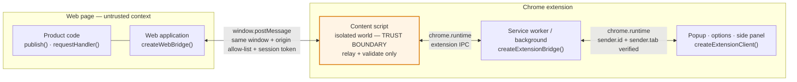
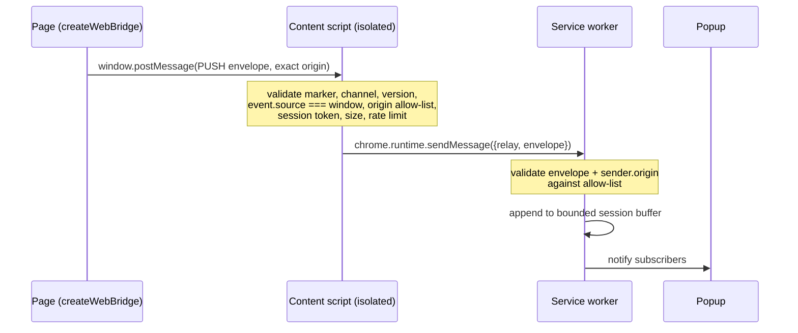
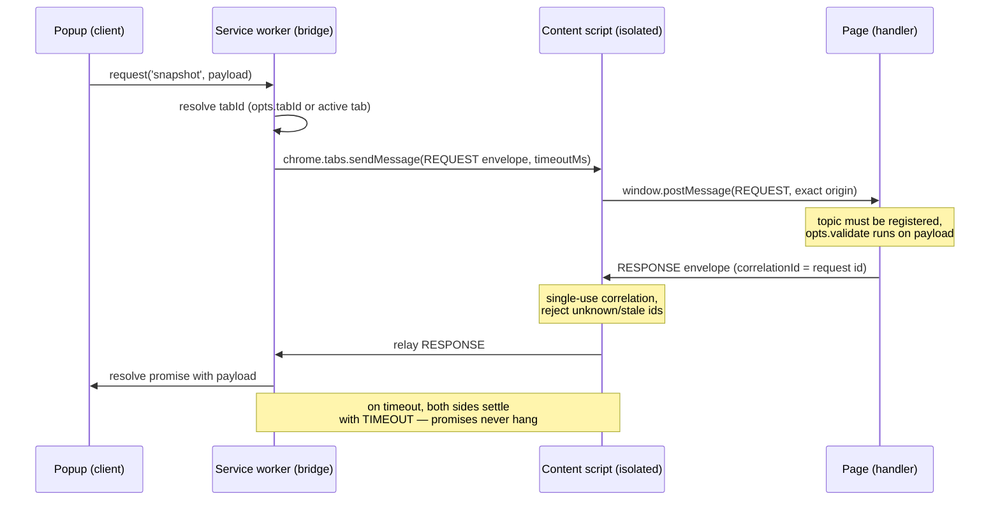

# Intake Spec — `web-extension-bridge`

**A public SDK that bridges a web application and a Chrome extension.**

| Field | Value |
| --- | --- |
| Spec title | `web-extension-bridge` — Web App ⇄ Chrome Extension Bridge SDK |
| Package name | `web-extension-bridge` (public, npm) |
| Status | Draft — pending review |
| Type | New public package + reference samples |
| Owner | TBD |
| Reviewers | TBD (Engineering, Security/AppSec, Release) |
| Prior art | `thousand-eyes-ext-sdk` proof of concept (TE-Bridge) |
| Target quality bar | Production grade — no known security vulnerabilities |

---

## Table of contents

1. [Problem statement](#1-problem-statement)
2. [Goals and non-goals](#2-goals-and-non-goals)
3. [Requirements](#3-requirements)
4. [Public API surface](#4-public-api-surface)
5. [Architecture](#5-architecture)
6. [Wire protocol](#6-wire-protocol)
7. [Connection lifecycle and session binding](#7-connection-lifecycle-and-session-binding)
8. [Security architecture](#8-security-architecture)
9. [Threat model](#9-threat-model)
10. [Error taxonomy](#10-error-taxonomy)
11. [Scalability and performance](#11-scalability-and-performance)
12. [Package layout and distribution](#12-package-layout-and-distribution)
13. [Sample web application](#13-sample-web-application)
14. [Sample Chrome extension](#14-sample-chrome-extension)
15. [Local development and test experience](#15-local-development-and-test-experience)
16. [README deliverable](#16-readme-deliverable)
17. [Test strategy](#17-test-strategy)
18. [Observability](#18-observability)
19. [Supply chain and release](#19-supply-chain-and-release)
20. [Deliverables and acceptance criteria](#20-deliverables-and-acceptance-criteria)
21. [Milestones](#21-milestones)
22. [Risks, open questions and decisions needed](#22-risks-open-questions-and-decisions-needed)
23. [Appendix A — TypeScript definitions](#appendix-a--typescript-definitions)
24. [Appendix B — Production hardening checklist](#appendix-b--production-hardening-checklist)

Throughout this document, **MUST**, **MUST NOT**, **SHOULD** and **MAY** are used in the
RFC 2119 sense. Anything marked **MUST** is an acceptance-blocking requirement.

---

## 1. Problem statement

A web page and a Chrome extension run in different execution contexts with no direct
communication path. A page cannot call `chrome.runtime` APIs, and an extension service
worker cannot reach into a page's JavaScript heap. Today, every team that needs this
integration hand-rolls a `window.postMessage` relay. Those ad-hoc relays repeatedly get
the same things wrong: no origin allow-listing, no envelope validation, `postMessage`
with a `'*'` target origin, unbounded payloads, request promises that hang forever, and
stack traces leaking across the trust boundary.

We need one reusable, audited SDK that owns this channel, so that product teams write
business logic instead of transport plumbing, and so that a single security review
covers every consumer.

## 2. Goals and non-goals

### Goals

- **G1** — Ship a single public npm package, `web-extension-bridge`, that installs into
  both a web application and a Chrome extension and bridges them.
- **G2** — Support **push** (web app → extension) and **on-demand pull**
  (extension → web app, request/response) as first-class primitives.
- **G3** — Be secure by default. Insecure configuration must require explicit,
  loud opt-in, and must be impossible in a production build.
- **G4** — Be scalable: multiple topics, multiple concurrent requests, multiple tabs,
  and multiple independent bridge channels on the same page.
- **G5** — Provide a runnable sample web app and sample MV3 extension, plus a README
  that gets a new developer from clone to a working two-way demo in under five minutes.
- **G6** — Zero runtime dependencies.

### Non-goals

- **NG1** — Firefox/Safari extension support. The design SHOULD avoid Chrome-only
  assumptions where free, but only Chromium MV3 is validated in v1.
- **NG2** — Extension-to-extension or page-to-page messaging.
- **NG3** — A transport for large binary blobs or media streams. Payloads are
  JSON-serialisable and size-capped.
- **NG4** — Defending the page-side data against cross-site scripting **in the host
  page itself**. See [§8.7](#87-explicitly-accepted-risks) — this is an important,
  explicitly documented limit of the design, not an oversight.
- **NG5** — Persistent, guaranteed-delivery messaging. Push is best-effort; durable
  queueing is a possible v2 feature.

## 3. Requirements

### 3.1 Functional

| ID | Requirement | Priority |
| --- | --- | --- |
| **FR1** | The web application MUST be able to send a message to the Chrome extension, addressed by a topic string, with a JSON-serialisable payload. Fire-and-forget. | P0 |
| **FR2** | The Chrome extension MUST be able to invoke an SDK method that fetches a message/value from the web application **on demand**, and await the result as a promise. | P0 |
| **FR3** | The web application MUST be able to register a named handler that produces the value returned for FR2, and that handler MAY be asynchronous. | P0 |
| **FR4** | The web application MUST be able to observe when the extension attaches and detaches. | P0 |
| **FR5** | The extension MUST be able to target a specific tab for FR2, defaulting to the active tab. | P0 |
| **FR6** | Extension UI surfaces (popup, options, side panel) MUST be able to use FR1/FR2 results without duplicating transport logic. | P1 |
| **FR7** | Multiple independent bridges MUST be able to coexist on one page, separated by a `channel` namespace. | P1 |
| **FR8** | Push messages received while no extension UI is open SHOULD be retained for later inspection, within a bounded buffer. | P2 |

### 3.2 Non-functional

| ID | Requirement |
| --- | --- |
| **NFR1** | Zero runtime dependencies. Only `devDependencies` for build and test. |
| **NFR2** | Bundle budget: web entry ≤ 8 KB minified + gzipped; content script ≤ 8 KB; background ≤ 8 KB. |
| **NFR3** | Handshake completes within 500 ms of both sides being present, at the 95th percentile, on a warm page load. |
| **NFR4** | An on-demand request adds ≤ 20 ms of SDK overhead beyond the page handler's own execution time. |
| **NFR5** | ≥ 90% line coverage on `src/core`, ≥ 80% overall. |
| **NFR6** | Ships first-party TypeScript types. Source MAY be JavaScript with JSDoc, or TypeScript — see [§22](#22-risks-open-questions-and-decisions-needed) D2. |
| **NFR7** | Public API documented with generated reference docs and hand-written guides. |
| **NFR8** | Semantic versioning. The wire protocol carries its own independent version number. |

## 4. Public API surface

The API below is normative. Naming follows the intake request exactly; additions are
marked.

### 4.1 Web side

```js
import { createWebBridge } from 'web-extension-bridge/web';

const webBridge = createWebBridge({ allowedOrigins: [location.origin] });

// FR1 — push a message to the extension
webBridge.publish('message', { text: 'Hello extension' });

// FR2/FR3 — answer on-demand requests from the extension
webBridge.requestHandler('snapshot', () => ({ value: readValue() }));

// FR4 — connection lifecycle
webBridge.onConnected(() => console.log('extension attached'));
```

`createWebBridge(options)` returns a `WebBridge`:

| Member | Signature | Notes |
| --- | --- | --- |
| `publish` | `(topic: string, payload?: unknown) => void` | FR1. Throws synchronously on an invalid topic or an oversized/non-serialisable payload — never silently drops. |
| `requestHandler` | `(topic: string, handler: (payload, meta) => unknown \| Promise<unknown>, opts?) => () => void` | FR3. Returns an unregister function. One handler per topic; re-registering the same topic MUST throw unless `opts.replace === true`. `opts.validate` accepts a predicate or schema-validation function applied to the inbound payload before the handler runs. |
| `onConnected` | `(listener: () => void) => () => void` | FR4. Fires immediately if already connected. Returns an unsubscribe function. |
| `onDisconnected` | `(listener: (reason: string) => void) => () => void` | **Addition.** Fires when the peer goes away (tab navigation, extension reload/uninstall). |
| `isConnected` | `boolean` (getter) | **Addition.** |
| `destroy` | `() => void` | **Addition.** Detaches all listeners and handlers; idempotent. Required for SPA teardown and to avoid leaks in tests. |

`WebBridgeOptions`:

| Option | Type | Default | Notes |
| --- | --- | --- | --- |
| `allowedOrigins` | `string[]` | `[location.origin]` | **MUST** be a non-empty array of exact origins. `'*'` is rejected outright — see [§8.2](#82-controls-page-side). |
| `channel` | `string` | `'webex-bridge'` | Must match the extension side. |
| `debug` | `boolean` | `false` | Metadata-only logging; never logs payloads. |
| `maxPayloadBytes` | `number` | `262144` | Clamped to a hard ceiling of 1 MiB. |

### 4.2 Extension side (service worker)

```js
import { createExtensionBridge } from 'web-extension-bridge/extension/background';

const ExtBridge = createExtensionBridge();

// FR1 — receive pushed messages
ExtBridge.subscribe((topic, payload, meta) => { /* pushed messages */ });

// FR2 — pull from the page on demand
const data = await ExtBridge.request('snapshot', { any: 'input' });
```

`createExtensionBridge(options)` returns an `ExtensionBridge`:

| Member | Signature | Notes |
| --- | --- | --- |
| `subscribe` | `(listener: (topic, payload, meta) => void) => () => void` | FR1. `meta` is `{ tabId, url, origin, receivedAt, messageId }`. Returns an unsubscribe function. A listener that throws MUST NOT break delivery to other listeners. |
| `request` | `(topic: string, payload?: unknown, opts?: RequestOptions) => Promise<unknown>` | FR2. Rejects with a coded `BridgeError` (see [§10](#10-error-taxonomy)). |
| `subscribeTopic` | `(topic: string, listener) => () => void` | **Addition.** Topic-filtered form of `subscribe`, so consumers stop writing `if (topic === …)`. |
| `listConnections` | `() => Promise<Connection[]>` | **Addition.** Live view of attached tabs — `{ tabId, origin, url, connectedAt }`. Needed for FR5 and for UI that must pick a target. |
| `getBufferedMessages` | `(opts?) => Promise<BufferedMessage[]>` | **Addition, FR8.** Bounded replay buffer. |

`RequestOptions`: `{ tabId?: number; timeoutMs?: number; signal?: AbortSignal }`.
`timeoutMs` defaults to 5000 and is clamped to `[100, 30000]`.

The extension side MUST expose the same content-script entry point for injection:

```js
// content script — relay only, no product logic
import 'web-extension-bridge/extension/content';
```

### 4.3 Extension UI surfaces (FR6) — addition

An MV3 popup cannot own the bridge, because the bridge lives in the service worker.
Rather than making every consumer hand-write a `chrome.runtime.sendMessage` command
protocol (as the POC did), the SDK provides a thin client:

```js
import { createExtensionClient } from 'web-extension-bridge/extension/client';

const client = createExtensionClient();
const data = await client.request('snapshot', { any: 'input' });
const messages = await client.getBufferedMessages({ limit: 50 });
client.subscribe((topic, payload, meta) => renderRow(topic, payload, meta));
```

The client mirrors the `ExtensionBridge` surface and proxies to the service worker.
The service worker MUST accept these commands only when `sender.id === chrome.runtime.id`
and `sender.tab === undefined` (i.e. from an extension page, not from a content script).

## 5. Architecture

### 5.1 Topology



Three layers, one source of truth:

- **`src/core`** — environment-agnostic. Protocol, envelope construction, validation,
  correlation, rate limiting, logging. No references to `window`, `chrome`, or the DOM.
  This is the layer that carries the security invariants and the bulk of the unit tests.
- **`src/web`** — page-context adapter over `window.postMessage`.
- **`src/extension`** — `content` (relay), `background` (privileged API), `client` (UI proxy).

The content script is the security-critical component: it is the **only** thing that
speaks to the privileged service worker, and it runs in the extension's isolated world,
so page scripts cannot reach into it or monkey-patch its captured references.

### 5.2 Push flow (FR1)



### 5.3 On-demand pull flow (FR2)



## 6. Wire protocol

### 6.1 Envelope

Every message crossing any hop is a versioned, namespaced envelope. The structure is
frozen for protocol v1; additive optional fields require a minor protocol bump, and any
breaking change requires a major bump with both sides refusing mismatches.

| Field | Type | Purpose |
| --- | --- | --- |
| `__webexBridge` | `true` | Marker. Lets each side ignore unrelated `postMessage` traffic cheaply. |
| `v` | `number` | Protocol version. Mismatch ⇒ reject. |
| `channel` | `string` | Namespace (FR7). |
| `kind` | enum | `HELLO`, `HELLO_ACK`, `PUSH`, `REQUEST`, `RESPONSE`, `BYE`. |
| `source` | enum | `'page'` or `'extension'`. Each side ignores its own broadcasts on the shared `window`. |
| `topic` | `string` | Routing key. `^[a-zA-Z0-9._:-]{1,128}$`. |
| `id` | `string` | CSPRNG-generated unique id. |
| `correlationId` | `string \| null` | The `id` this message answers. |
| `session` | `string` | Per-page-load session token from the handshake ([§7](#7-connection-lifecycle-and-session-binding)). |
| `payload` | JSON value | Size-capped, serialisability-checked. |
| `ok` | `boolean \| undefined` | Result flag on `RESPONSE`. |
| `error` | `{ code, message } \| undefined` | Coded, redacted error on `RESPONSE`. |
| `ts` | `number` | Epoch ms. Used for clock-skew rejection. |

### 6.2 Validation rules (normative)

A validator in `src/core` MUST run at **every** hop — page inbound, content-script
inbound from page, content-script inbound from runtime, service-worker inbound. No hop
may trust an upstream hop's validation. Rules:

1. Value is a non-null object carrying the marker.
2. `v` equals the supported protocol version.
3. `channel` matches the configured channel.
4. `kind` is a known enum member.
5. `id` is a string of length 1–128; `correlationId` is `null` or a string ≤ 128.
6. `topic` matches the topic regex.
7. `session` matches the established session token, for every kind except `HELLO`.
8. `ts` is within ±30 s of local time (rejects replayed captures).
9. `id` has not been seen before within the replay window (single-use ids, LRU/TTL cache).
10. `payload` is JSON-serialisable and its UTF-8 byte length ≤ `maxPayloadBytes`.
11. Reserved keys `__proto__`, `constructor` and `prototype` MUST NOT appear as
    envelope keys. Envelope field access MUST go through null-prototype objects or
    `Map`, never a plain-object lookup on attacker-controlled keys.

Validation failures are **dropped silently** at the page and content-script hops (the
page receives unrelated `postMessage` traffic constantly, so logging every miss is noise
and a log-flood vector). Failures at the runtime hops are counted and logged at `warn`
with the reason code but never the payload.

## 7. Connection lifecycle and session binding

The POC used a bare handshake with no session identity, which means a stale bridge
instance, a second injected content script, or a sloppy iframe could all cross-talk.
Production adds a session token:

1. On injection at `document_start`, the content script generates a
   `session` token with `crypto.randomUUID()` and posts `HELLO` to the page.
2. The page's bridge replies `HELLO_ACK`, adopting the token, and marks itself
   connected, firing `onConnected` listeners.
3. If the page bridge initialises *after* the content script, it posts its own `HELLO`;
   the content script replies `HELLO_ACK` carrying the session token. The content script
   also re-announces once after a short delay to cover the race.
4. Every subsequent envelope MUST carry the token. Envelopes with a missing or
   mismatched token are dropped.
5. On page navigation or `pagehide`, the page posts `BYE`; the content script informs
   the service worker, which removes the connection and settles any in-flight requests
   for that tab with `DISCONNECTED`. The extension side fires `onDisconnected`.
6. The service worker MUST also treat `chrome.tabs.onRemoved` and
   `chrome.tabs.onUpdated` (navigation) as disconnect signals, because a page that is
   killed cannot send `BYE`.

**What the session token does and does not do.** It prevents cross-instance and
cross-frame confusion, and it rejects replayed or stale envelopes. It does **not** make
the channel confidential against other scripts running in the same page — see
[§8.7](#87-explicitly-accepted-risks). This distinction MUST be stated plainly in the
README rather than implied to be stronger than it is.

## 8. Security architecture

The bar for this package is production grade with no known vulnerabilities. Security is
therefore specified as a set of enforced invariants with tests, not as advice.

### 8.1 Trust boundaries

| Boundary | Crossing mechanism | Trust posture |
| --- | --- | --- |
| Page ↔ content script | `window.postMessage` | The page is **untrusted** from the extension's point of view. |
| Content script ↔ service worker | `chrome.runtime` / `chrome.tabs` | Content script is semi-trusted; the service worker still validates everything. |
| Extension UI ↔ service worker | `chrome.runtime` | Trusted only after `sender.id` and `sender.tab` checks. |

### 8.2 Controls (page side)

- **Origin allow-listing.** Inbound messages are rejected unless `event.origin` is in
  `allowedOrigins`. The list MUST be a non-empty array of exact origins. A wildcard
  `'*'` MUST be rejected by the constructor — the POC's `'*'` escape hatch is removed.
- **Same-window enforcement.** `event.source !== window` ⇒ reject. Blocks cross-frame
  and cross-window injection.
- **Explicit target origin on send.** Outbound `postMessage` MUST pass the exact origin.
  `'*'` MUST NOT appear as a `targetOrigin` anywhere in the codebase, enforced by lint.
- **Source-tag checks.** The page ignores envelopes tagged `source: 'page'`; the content
  script ignores `source: 'extension'`. Prevents a script from echoing traffic back.
- **Handler isolation.** Registered handlers run inside `try/catch`. Thrown errors are
  converted to a generic coded error. Stack traces, messages and internal object shapes
  MUST NOT cross the boundary.
- **Per-topic payload validation.** `requestHandler(topic, fn, { validate })` runs the
  supplied validator before the handler sees the payload. The README MUST show a schema
  example, because shape-and-size checks alone are not input validation.

### 8.3 Controls (extension side)

- **Isolated world only.** The relay is a content script. The page never reaches the
  service worker directly.
- **No `externally_connectable`.** The extension ID is never advertised to arbitrary
  sites, and arbitrary sites cannot open a port to the extension.
- **Sender verification in the service worker.** Every inbound runtime message MUST be
  checked: `sender.id === chrome.runtime.id`; content-script traffic MUST have a
  `sender.tab` and a `sender.origin` in the configured allow-list; UI traffic MUST have
  no `sender.tab`. Manifest `matches` is a deployment control, not a substitute for a
  runtime check.
- **No `web_accessible_resources`.** The content script MUST be pre-bundled into a
  single classic script so nothing needs to be web-accessible. The POC exposed
  `vendor/te-bridge/*` purely to satisfy a dynamic `import()`; bundling removes that
  entire exposure — an extension resource enumerable from the page is a fingerprinting
  and attack surface. If a future feature genuinely needs one, it MUST be a single named
  file with `use_dynamic_url: true`.
- **Least-privilege manifest.** `permissions` are `["storage"]` only.
  The POC's `tabs` permission is **not required**: `chrome.tabs.query({active: true,
  currentWindow: true})` returns the tab `id` without it, and `sender.tab.url` is
  available via host permissions. `host_permissions` and `content_scripts.matches` MUST
  list exact production origins.
- **Extension page CSP.** `content_security_policy.extension_pages` set to
  `script-src 'self'; object-src 'none'; base-uri 'none'`.
- **Storage hygiene.** The FR8 buffer uses `chrome.storage.session` (never `sync`), with
  a hard cap on entry count and total bytes, and a TTL. It MUST NOT be used for secrets.

### 8.4 Controls (protocol level)

- **Request/response correlation.** Ids are CSPRNG-generated and single-use. A
  `RESPONSE` whose `correlationId` is unknown, already settled, or from a different
  session is dropped, so a stale or forged response cannot resolve a live promise.
- **Mandatory timeouts.** Every request has a timeout, defaulted and clamped. Both the
  content script and the service worker arm their own timer, so a promise cannot hang if
  either side disappears mid-flight.
- **Replay protection.** Clock-skew window plus a seen-id cache.
- **Size caps.** 256 KiB default, 1 MiB hard ceiling, checked before send and on
  receive, measured as UTF-8 bytes.
- **Rate limiting and backpressure.** A token-bucket limiter per `(tabId, topic)` on
  inbound push, plus a cap on concurrent in-flight requests per tab. Excess is rejected
  with `RATE_LIMITED` rather than queued unboundedly. Without this, a hostile or merely
  buggy page can wedge the service worker.
- **Prototype-pollution resistance.** Handler and correlation registries use `Map`;
  any object built from untrusted keys uses `Object.create(null)`; reserved keys are
  rejected during validation.
- **Fail-closed CSPRNG.** If `crypto.randomUUID`/`getRandomValues` is unavailable, the
  SDK MUST throw at construction. The POC's `insecure-${Date.now()}-${Math.random()}`
  fallback MUST be deleted: predictable ids undermine correlation integrity, and a
  silent downgrade is worse than a hard failure.

### 8.5 Controls (code level)

- No `eval`, no `new Function`, no string-argument `setTimeout`/`setInterval`.
- No `innerHTML`/`outerHTML`/`insertAdjacentHTML` anywhere, including samples. UI
  renders exclusively via `textContent` and `createElement`.
- No secrets, tokens, keys or credentials in source, samples, or fixtures.
- ESLint MUST enforce the above as **errors**, with rules for `no-eval`,
  `no-implied-eval`, `no-restricted-properties` (`innerHTML`), and a custom or
  `no-restricted-syntax` rule banning `postMessage(…, '*')`.
- CI MUST run `npm audit --audit-level=high`, a SAST pass, and a secret scan.

### 8.6 On message signing (deliberate design decision)

An HMAC or signature over envelopes is **intentionally not** part of the design, and the
README MUST explain why rather than leaving reviewers to wonder. Both peers would have
to share a key; any key reachable by page JavaScript is also reachable by any other
script in that page, so the signature would authenticate nothing that origin checks and
the isolated-world boundary do not already cover. It would add cost and a false sense of
assurance — security theatre.

If payload **authenticity** genuinely matters (for example, the extension must be
certain a value truly came from the product backend and was not fabricated by an
injected script), the correct design is out-of-band trust: the web application's server
signs the data, and the extension verifies it against the server's public key, treating
the page purely as an untrusted transport. This SHOULD be documented as a recipe.

### 8.7 Explicitly accepted risks

These are inherent to the platform. They MUST be documented prominently in the README so
consumers make informed decisions instead of assuming guarantees that do not exist.

| Accepted risk | Why it cannot be fixed in the SDK | Consumer guidance |
| --- | --- | --- |
| **XSS in the host page** can call `publish()`, invoke registered handlers, and observe bridge traffic on `window`. All same-origin page scripts share one JavaScript world; `window.postMessage` events are delivered to every listener in the page. | The SDK cannot create a confidentiality boundary against code running in the same context. | Treat the page as one trust domain. Fix XSS as the primary control (CSP, encoding, Trusted Types). Never register a handler that exposes data an XSS payload should not reach. |
| **Another installed extension** with host permissions on the same origin can inject a content script and speak the protocol. | Any extension the user grants host access to has at least the privileges of ours. | Requirement FR2 handlers MUST NOT return secrets. Use out-of-band signing ([§8.6](#86-on-message-signing-deliberate-design-decision)) where authenticity matters. |
| **Push is best-effort.** MV3 service workers are ephemeral; a push sent while the worker is spinning up may be dropped. | Platform behaviour. | Use the FR2 pull path for anything that must be correct on read. The bounded buffer mitigates, not solves. |

A `MessageChannel`/`MessagePort` handshake was evaluated as a way to move post-handshake
traffic off the shared `window`. It is **not** proposed as a security control: the port is
transferred over a `window.postMessage` event that every page listener receives, so it can
be raced. It MAY be revisited purely as a noise-reduction optimisation, and if adopted MUST
NOT be described as an isolation boundary.

### 8.8 Localhost testing without weakening the shipped default

Local testing must be smooth, but the POC's approach — `http://localhost/*` baked into
the shipped manifest and a `'*'` origin escape hatch in the SDK — is exactly how
`localhost` ends up in a production build. Instead:

- The SDK ships **no** origin defaults beyond `location.origin` and rejects `'*'`
  unconditionally. There is no development mode inside the library.
- Localhost lives only in the **sample** extension's manifest, which is generated from
  `samples/extension/manifest.template.json` by the sample build. The template makes
  the origin a substituted variable, so the sample cannot be mistaken for a shippable
  manifest.
- The generated sample manifest and the sample's `allowedOrigins` MUST carry a
  `"_comment"` / banner comment stating that these values are for local testing.
- The README MUST include a "before you ship" checklist
  ([Appendix B](#appendix-b--production-hardening-checklist)) covering origin
  replacement, HTTPS, and disabling debug logging.

## 9. Threat model

| # | Threat | Vector | Mitigation |
| --- | --- | --- | --- |
| T1 | Malicious site drives the extension | Untrusted origin loads a page that speaks the protocol | Content script injected only on allow-listed origins; service worker re-checks `sender.origin` at runtime |
| T2 | Cross-frame injection | Hostile iframe or opener posts envelopes | `event.source === window` check; session token binding |
| T3 | Forged/stale response resolves a pull | Attacker posts a `RESPONSE` with a guessed `correlationId` | CSPRNG ids, single-use correlation, session binding, clock-skew and seen-id replay rejection |
| T4 | Service-worker DoS | Page floods pushes or opens unbounded concurrent requests | Token-bucket rate limiting per `(tabId, topic)`, in-flight cap, size caps, bounded buffer |
| T5 | Memory exhaustion | Huge or circular payload | Serialisability check plus UTF-8 byte cap on both send and receive |
| T6 | Information disclosure via errors | Handler throws and leaks internals | Coded, redacted errors only; no stack traces cross the boundary |
| T7 | Extension fingerprinting / resource probing | Page probes `chrome-extension://…` URLs | No `web_accessible_resources`; no `externally_connectable` |
| T8 | Privilege escalation into the service worker | Page tries to reach privileged APIs | Page can only emit protocol envelopes to the relay; relay forwards nothing else; SW exposes no arbitrary command surface |
| T9 | Prototype pollution | Payload/envelope keys like `__proto__` | Reserved-key rejection; `Map` and null-prototype objects |
| T10 | Hanging promises / resource leak | Peer disappears mid-request | Dual timers, disconnect detection via `BYE` + `tabs` events, deterministic settlement |
| T11 | Log-based leakage | Debug logging of sensitive payloads | Debug off by default; metadata-only logging; payload logging is not implementable via public options |
| T12 | Supply-chain compromise | Dependency or publish pipeline | Zero runtime deps, lockfile, `npm ci`, provenance, 2FA, signed tags, SBOM |
| T13 | UI injection in extension pages | Payload rendered into popup DOM | `textContent` only; extension-pages CSP |
| T14 | Rogue peer extension | Another extension with host access speaks the protocol | Documented accepted risk ([§8.7](#87-explicitly-accepted-risks)); no secrets over the bridge; out-of-band signing recipe |

## 10. Error taxonomy

All rejections surface a `BridgeError` with a stable, machine-readable `code`. Codes are
part of the public API contract and MUST NOT change meaning within a major version.

| Code | Raised when | Retriable |
| --- | --- | --- |
| `NOT_CONNECTED` | No bridge attached in the target tab | Yes |
| `NO_TAB` | No active tab could be resolved | Yes |
| `NO_HANDLER` | Page has no handler for the topic | No |
| `TIMEOUT` | Page did not respond in time | Yes |
| `DISCONNECTED` | Peer went away mid-request | Yes |
| `ABORTED` | Caller's `AbortSignal` fired | No |
| `HANDLER_ERROR` | Page handler threw (details redacted) | Maybe |
| `INVALID_PAYLOAD` | Payload failed validation or the size cap | No |
| `INVALID_TOPIC` | Topic failed the charset/length rule | No |
| `RATE_LIMITED` | Limiter rejected the message | Yes, with backoff |
| `PROTOCOL_MISMATCH` | Peer runs an incompatible protocol version | No |
| `INSECURE_CONFIG` | Constructor received a rejected configuration (e.g. `'*'`) | No |
| `CRYPTO_UNAVAILABLE` | No CSPRNG available; SDK refuses to start | No |

## 11. Scalability and performance

- **Topic routing** via `Map` lookups — O(1), no scanning.
- **Concurrent requests** are fully multiplexed by `id`; there is no head-of-line
  blocking, and each request carries its own timer and abort path.
- **Multi-tab** is handled by a connection registry in the service worker keyed by
  `tabId`, surfaced through `listConnections()`.
- **Multi-channel** (FR7) lets independent features share a page without cross-talk.
- **Bounded everything.** Buffers, in-flight maps, seen-id caches and listener sets all
  have caps and eviction. An unbounded `Map` in a long-lived service worker is a leak.
- **MV3 lifecycle.** All service-worker state that must survive worker eviction lives in
  `chrome.storage.session`; listeners are registered at top level, synchronously, so
  the worker can be revived by an incoming event.
- **Tree-shakable** subpath exports so a web consumer never ships extension code.

## 12. Package layout and distribution

```
web-extension-bridge/
├── package.json                     # exports map, no runtime deps
├── README.md                        # the §16 deliverable
├── SECURITY.md · LICENSE · CHANGELOG.md
├── src/
│   ├── core/                        # protocol · validation · correlation ·
│   │                                #   rateLimit · errors · logger  (env-agnostic)
│   ├── web/webBridge.js             # createWebBridge  → 'web-extension-bridge/web'
│   └── extension/
│       ├── content.js               # relay (trust boundary)
│       ├── background.js            # createExtensionBridge
│       └── client.js                # createExtensionClient (popup/options)
├── dist/                            # built ESM + bundled classic content script + .d.ts
├── samples/
│   ├── web-app/                     # index.html · styles.css · app.js  (§13)
│   └── extension/                   # MV3 sample                        (§14)
├── scripts/
│   ├── build.js                     # src → dist
│   └── prepare-samples.js           # dist → samples/*/vendor + manifest templating
└── test/{unit,e2e}/
```

### 12.1 Exports map

```json
{
  "name": "web-extension-bridge",
  "type": "module",
  "sideEffects": ["./dist/extension/content.js"],
  "exports": {
    ".":                             { "types": "./dist/index.d.ts",              "import": "./dist/index.js" },
    "./web":                         { "types": "./dist/web/webBridge.d.ts",      "import": "./dist/web/webBridge.js" },
    "./extension/background":        { "types": "./dist/extension/background.d.ts","import": "./dist/extension/background.js" },
    "./extension/content":           { "types": "./dist/extension/content.d.ts",  "import": "./dist/extension/content.js" },
    "./extension/client":            { "types": "./dist/extension/client.d.ts",   "import": "./dist/extension/client.js" }
  }
}
```

### 12.2 Why samples still vendor the SDK

A Chrome extension can only load files inside its own root, so the sample build copies
`dist/` into `samples/extension/vendor/web-extension-bridge/` and
`samples/web-app/vendor/web-extension-bridge/`. This mirrors what a real consumer's
bundler step does, and it keeps the sample import paths in the intake request
(`./vendor/te-bridge/…`) meaningful. Vendor directories are **generated** and MUST be
git-ignored, so there is exactly one copy of the source under version control.

Real consumers are shown both paths in the README: bundler-based (import from the
package name, let the bundler emit the content script) and copy-based (a `postinstall`
or build step that copies `dist/` into the extension root).

## 13. Sample web application

Plain HTML, CSS and JavaScript — no framework, no build step beyond the vendor copy.

| Element | Behaviour |
| --- | --- |
| Connection pill | "Waiting for extension…" → "Extension attached", driven by `onConnected`/`onDisconnected`. |
| Push composer | Text input + **Publish to extension** → `webBridge.publish('message', { text })`. Shows a local echo log of what was sent. |
| Shared value field | Editable input read by the `snapshot` handler, so a tester can prove the pull returns the value **at request time**, not a stale copy. |
| Requests-served counter | Increments each time the handler runs — visible proof the pull reached the page. |
| Event log | Append-only, `textContent`-rendered, capped at N rows. |
| Error surface | Renders `BridgeError.code` for rejected operations, so failure modes are demonstrable too. |

The sample MUST register at least: `publish('message', …)` for FR1, and
`requestHandler('snapshot', …)` for FR2/FR3, matching the intake request verbatim. It
SHOULD also register a deliberately failing handler and a slow handler, so testers can
observe `HANDLER_ERROR` and `TIMEOUT` behaviour.

## 14. Sample Chrome extension

MV3, minimal and least-privilege.

```
samples/extension/
├── manifest.template.json   # origin as a substituted variable (see §8.8)
├── service-worker.js        # createExtensionBridge() + subscribe() + storage buffer
├── content-script.js        # single bundled file from dist (no dynamic import)
├── popup.html · popup.css · popup.js   # createExtensionClient()
└── vendor/web-extension-bridge/        # generated
```

Popup UI:

- **Pushed messages** list — populated from `getBufferedMessages()` on open and live via
  `subscribe()`; rendered with `textContent`.
- **Get from web app** button → `await client.request('snapshot', { any: 'input' })`,
  rendering the returned value and the round-trip duration.
- **Target tab** selector fed by `listConnections()`, demonstrating FR5.
- **Error display** showing the `code` when a request rejects.

Generated manifest shape:

```jsonc
{
  "manifest_version": 3,
  "name": "web-extension-bridge sample",
  "minimum_chrome_version": "116",
  "permissions": ["storage"],
  "host_permissions": ["http://localhost:5173/*"],
  "background": { "service_worker": "service-worker.js", "type": "module" },
  "content_scripts": [{
    "matches": ["http://localhost:5173/*"],
    "js": ["content-script.js"],
    "run_at": "document_start"
  }],
  "action": { "default_popup": "popup.html" },
  "content_security_policy": {
    "extension_pages": "script-src 'self'; object-src 'none'; base-uri 'none'"
  }
}
```

Note what is absent versus the POC: no `tabs` permission, no `web_accessible_resources`,
no wildcard host match, and an explicit extension-pages CSP.

## 15. Local development and test experience

The target is: clone → one command → load unpacked → both directions demonstrably work.

```bash
npm install
npm run dev          # build SDK → vendor into samples → serve web app on :5173
```

Then:

1. Open `chrome://extensions`, enable **Developer mode**.
2. **Load unpacked** → select `samples/extension/`.
3. Open <http://localhost:5173>. The pill flips to "Extension attached".
4. **FR1:** type a message, click **Publish to extension**, open the popup — the message
   is listed.
5. **FR2:** change **Shared value**, click **Get from web app** in the popup — the popup
   shows the current value and the page's requests-served counter increments.

Supporting scripts:

| Script | Purpose |
| --- | --- |
| `npm run build` | `src` → `dist` |
| `npm run dev` | build + vendor + static server + watch, with rebuild on change |
| `npm run test:unit` | core/web/extension unit tests with mocked platform APIs |
| `npm run test:e2e` | Playwright, real Chromium with the sample extension loaded |
| `npm run lint` / `npm run typecheck` | security-relevant lint rules + types |
| `npm run verify` | lint + typecheck + unit + e2e + audit — the CI gate |

`npm run dev` MUST print the next manual steps (load unpacked path, URL) on start, and
MUST warn when the extension has not attached within a few seconds, with the likely
cause. Watch mode cannot auto-reload an unpacked extension, so after SDK changes the
console MUST remind the developer to click reload in `chrome://extensions`.

## 16. README deliverable

`README.md` in the package root MUST contain, in this order:

1. One-paragraph description and the two requirements it satisfies.
2. Install snippet, and the web/extension quick-start code from
   [§4](#4-public-api-surface) verbatim.
3. Architecture diagram and the push/pull flow explanation.
4. **Test it locally** — prerequisites, `npm run dev`, load-unpacked steps, and the
   exact click-path to demonstrate FR1 and FR2 (mirroring [§15](#15-local-development-and-test-experience)).
5. Troubleshooting table (not attached / wrong tab / stale build / ESM over `file://`).
6. Full API reference with options, defaults, return values and thrown codes.
7. Security architecture: controls, the honest limits from
   [§8.7](#87-explicitly-accepted-risks), and the reasoning in
   [§8.6](#86-on-message-signing-deliberate-design-decision).
8. **Before you ship** checklist ([Appendix B](#appendix-b--production-hardening-checklist)).
9. Browser support, versioning and protocol-compatibility policy, contributing, licence.

Any snippet in the README MUST be covered by an executable test or example so the docs
cannot silently rot.

## 17. Test strategy

| Layer | Tooling | Coverage |
| --- | --- | --- |
| Unit — core | Test runner + fakes | Envelope construction; every validation rule including each rejection reason; replay and clock-skew windows; correlation single-use; rate limiter; size caps; reserved-key rejection; error mapping |
| Unit — web | Simulated `window` message events | Origin allow-list accept/reject; `event.source` rejection; session-token mismatch; handler success/throw/async; `publish` argument validation; `destroy` leaves no listeners |
| Unit — extension | Mocked `chrome.*` | `sender` verification matrix; tab resolution; timeout and abort; disconnect settlement; buffer caps and TTL; UI-client command surface |
| Integration | Both bridges wired through an in-memory relay | Full push and pull flows; concurrent multiplexed requests; version mismatch; multi-channel isolation |
| End-to-end | Playwright, persistent Chromium context with `--load-extension` | The exact README click-path for FR1 and FR2; popup pull reflects a value changed after load; timeout and handler-error paths; multi-tab targeting |
| Security regression | Dedicated suite | One test per threat T1–T14, each asserting the attack is rejected. New threats require a new test before the fix is accepted. |
| Static | ESLint (security rules as errors), typecheck, `npm audit`, secret scan | CI gate |

CI MUST run `npm run verify` on every PR and block merge on failure. The security
regression suite is not optional or allowed to be skipped.

## 18. Observability

- A pluggable logger with `debug`/`info`/`warn`/`error`, defaulting to a no-op except
  for `warn`/`error`.
- Logs carry `{ channel, kind, topic, id, correlationId, tabId, reason }` — **never**
  payloads, and never the session token.
- Optional counters exposed for host-app telemetry: pushes sent/received, requests
  issued, outcomes by error code, drops by validation reason, rate-limit rejections.
  Consumers wire these to their own pipeline; the SDK performs no network I/O of its own
  and MUST NOT phone home.

## 19. Supply chain and release

- Zero runtime dependencies; `devDependencies` pinned via lockfile; `npm ci` in CI.
- No install scripts in the published package.
- `files` allow-list so only `dist`, types, README, LICENSE and SECURITY ship — samples
  and tests are excluded from the tarball.
- Publish with provenance/attestation, from CI, with 2FA enforced and signed tags.
- Generate and attach an SBOM per release.
- `SECURITY.md` with a disclosure contact and response SLA.
- Semantic versioning for the API; the wire protocol version is independent and its
  compatibility policy is documented.

## 20. Deliverables and acceptance criteria

### Deliverables

- **D1** — The `web-extension-bridge` package: `src/core`, `src/web`, `src/extension`,
  exports map, types.
- **D2** — Sample web application (`samples/web-app`).
- **D3** — Sample MV3 Chrome extension (`samples/extension`).
- **D4** — Build and dev tooling (`scripts/`, npm scripts).
- **D5** — `README.md` per [§16](#16-readme-deliverable), plus `SECURITY.md`.
- **D6** — Test suites per [§17](#17-test-strategy) and a CI workflow.

### Acceptance criteria

- **AC1** — FR1 works end to end in the samples: a published message appears in the
  extension popup.
- **AC2** — FR2 works end to end: the popup pulls a value the page produces at request
  time, verified by changing the value after page load.
- **AC3** — A reviewer following only the README reaches a working two-way demo in
  under five minutes on a clean machine.
- **AC4** — Every threat T1–T14 has a passing regression test.
- **AC5** — No `'*'` target origin, no `'*'` allowed origin, no `innerHTML`, no `eval`,
  no `web_accessible_resources`, no `externally_connectable`, and no `tabs` permission
  anywhere in the package or samples. Enforced by lint and CI.
- **AC6** — Coverage meets NFR5; bundle sizes meet NFR2.
- **AC7** — `npm run verify` passes clean, including `npm audit --audit-level=high`.
- **AC8** — Security review signed off, with [Appendix B](#appendix-b--production-hardening-checklist)
  reflected in the README.
- **AC9** — Requests always settle: no code path leaves a promise pending, proven by
  timeout, abort and disconnect tests.
- **AC10** — Published tarball contains only the [§19](#19-supply-chain-and-release)
  allow-list.

## 21. Milestones

| # | Milestone | Contents | Exit criteria |
| --- | --- | --- | --- |
| M1 | Core protocol | `src/core` + unit tests | Validation and correlation rules fully tested |
| M2 | Both bridges | `web`, `extension/{content,background}` | Integration tests green over the in-memory relay |
| M3 | Samples + local DX | D2, D3, D4 | AC1, AC2, AC3 met manually |
| M4 | Hardening | Rate limiting, replay, disconnect, sender checks, `client` | AC4, AC5, AC9 met |
| M5 | Docs + E2E | D5, D6, CI | AC6, AC7 met; Playwright suite green |
| M6 | Release | Provenance, SBOM, `SECURITY.md`, publish | AC8, AC10 met; `v1.0.0` published |

## 22. Risks, open questions and decisions needed

| # | Item | Notes / recommendation |
| --- | --- | --- |
| **D1** | **Package name.** `web-extension-bridge` is unscoped and public. | Confirm npm availability and that an unscoped name is acceptable for a Cisco/ThousandEyes artifact. A scoped name (`@thousandeyes/…`, `@cisco/…`) is materially safer against typosquatting and clarifies ownership. **Decision needed before M1.** |
| **D2** | **Source language.** | Recommend authoring in TypeScript and emitting JS + `.d.ts`, given the security-invariant-heavy validation code. JSDoc-typed JS is acceptable if the toolchain requires it. |
| **D3** | **Repository home.** | This spec lives in `webex-js-sdk`, whose packages are `@webex/*` and Yarn-workspace managed. Decide whether the package is a workspace here or a standalone repo; the layout in [§12](#12-package-layout-and-distribution) assumes standalone and needs adjusting if it becomes a workspace. |
| **D4** | **FR8 buffer semantics.** | Confirm cap, TTL and whether ordering guarantees are required. |
| **D5** | **Cross-browser.** | Confirm NG1: Chromium only for v1, or budget for a WebExtension polyfill abstraction now. |
| **R1** | MV3 service-worker eviction can drop best-effort pushes. | Documented; mitigated by the buffer and by steering correctness-critical reads to the pull path. |
| **R2** | Consumers may ship `localhost` or over-broad host matches. | Mitigated by [§8.8](#88-localhost-testing-without-weakening-the-shipped-default): no dev mode in the library, templated sample manifest, ship checklist. |
| **R3** | Chrome platform changes to MV3 messaging. | Pin `minimum_chrome_version`; keep the platform surface confined to the adapter layers so `core` is unaffected. |
| **R4** | Consumers may assume the bridge is confidential and put secrets on it. | Mitigated by prominent README documentation of [§8.7](#87-explicitly-accepted-risks) and the signing recipe in [§8.6](#86-on-message-signing-deliberate-design-decision). |

## Appendix A — TypeScript definitions

```ts
export type BridgeErrorCode =
  | 'NOT_CONNECTED' | 'NO_TAB' | 'NO_HANDLER' | 'TIMEOUT' | 'DISCONNECTED'
  | 'ABORTED' | 'HANDLER_ERROR' | 'INVALID_PAYLOAD' | 'INVALID_TOPIC'
  | 'RATE_LIMITED' | 'PROTOCOL_MISMATCH' | 'INSECURE_CONFIG' | 'CRYPTO_UNAVAILABLE';

export class BridgeError extends Error {
  readonly code: BridgeErrorCode;
  readonly topic?: string;
}

export type JsonValue =
  | null | boolean | number | string | JsonValue[] | { [k: string]: JsonValue };

export interface WebBridgeOptions {
  /** Non-empty list of exact origins. '*' is rejected. */
  allowedOrigins?: string[];
  channel?: string;
  debug?: boolean;
  maxPayloadBytes?: number;
}

export interface RequestMeta {
  readonly topic: string;
  readonly messageId: string;
  readonly receivedAt: number;
}

export interface HandlerOptions {
  /** Validate the inbound payload before the handler runs. */
  validate?: (payload: unknown) => boolean;
  /** Allow replacing an existing handler for this topic. */
  replace?: boolean;
}

export interface WebBridge {
  publish(topic: string, payload?: JsonValue): void;
  requestHandler(
    topic: string,
    handler: (payload: JsonValue, meta: RequestMeta) => JsonValue | Promise<JsonValue>,
    opts?: HandlerOptions,
  ): () => void;
  onConnected(listener: () => void): () => void;
  onDisconnected(listener: (reason: string) => void): () => void;
  readonly isConnected: boolean;
  destroy(): void;
}

export function createWebBridge(options?: WebBridgeOptions): WebBridge;

export interface PushMeta {
  readonly tabId: number;
  readonly url?: string;
  readonly origin: string;
  readonly receivedAt: number;
  readonly messageId: string;
}

export interface RequestOptions {
  tabId?: number;
  /** Default 5000; clamped to [100, 30000]. */
  timeoutMs?: number;
  signal?: AbortSignal;
}

export interface Connection {
  readonly tabId: number;
  readonly origin: string;
  readonly url?: string;
  readonly connectedAt: number;
}

export interface BufferedMessage {
  readonly topic: string;
  readonly payload: JsonValue;
  readonly meta: PushMeta;
}

export interface ExtensionBridgeOptions {
  channel?: string;
  debug?: boolean;
  defaultTimeoutMs?: number;
  /** Runtime origin allow-list, checked in addition to manifest `matches`. */
  allowedOrigins?: string[];
  buffer?: { maxEntries?: number; ttlMs?: number };
  rateLimit?: { pushesPerSecond?: number; maxInFlightPerTab?: number };
}

export interface ExtensionBridge {
  subscribe(listener: (topic: string, payload: JsonValue, meta: PushMeta) => void): () => void;
  subscribeTopic(
    topic: string,
    listener: (payload: JsonValue, meta: PushMeta) => void,
  ): () => void;
  request<T = JsonValue>(topic: string, payload?: JsonValue, opts?: RequestOptions): Promise<T>;
  listConnections(): Promise<Connection[]>;
  getBufferedMessages(opts?: { topic?: string; limit?: number }): Promise<BufferedMessage[]>;
}

export function createExtensionBridge(options?: ExtensionBridgeOptions): ExtensionBridge;

/** Popup / options / side-panel proxy to the service-worker bridge. */
export function createExtensionClient(options?: { channel?: string }): ExtensionBridge;
```

## Appendix B — Production hardening checklist

To be reproduced in the README as a "before you ship" section.

| Area | Requirement before production |
| --- | --- |
| Origins | Replace every `localhost`/`127.0.0.1` entry in `manifest.json` (`content_scripts.matches`, `host_permissions`) and in `allowedOrigins` with your exact production origins. Never ship `localhost`. |
| Transport | Serve the web application over HTTPS only, with HSTS. |
| Wildcards | No `'*'` in `allowedOrigins` (the SDK rejects it) and no `'*'` `targetOrigin`. Confirm by lint. |
| Extension resources | No `web_accessible_resources`. If unavoidable, a single named file with `use_dynamic_url: true`. |
| Permissions | `permissions` is `["storage"]` or narrower. No `tabs`. No `externally_connectable`. |
| CSP | `extension_pages` CSP set on the extension; a strict CSP (ideally with Trusted Types) on the web app. |
| Logging | `debug: false`. Verify no payloads or tokens reach any log sink. |
| Payload validation | Every `requestHandler` topic validates its payload against a strict schema, and every push topic is validated on receipt. |
| Data classification | No secrets, tokens or credentials traverse the bridge. Where authenticity matters, use server-side signing ([§8.6](#86-on-message-signing-deliberate-design-decision)). |
| Rendering | Extension and web UI render untrusted values with `textContent` only. |
| Limits | Review `maxPayloadBytes`, `defaultTimeoutMs`, rate limits and buffer caps against your workload. |
| Supply chain | `npm ci`, lockfile committed, `npm audit` clean at high severity, SBOM archived, published with provenance. |
