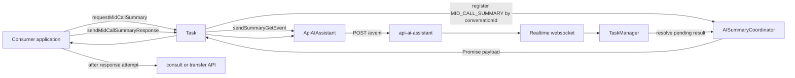
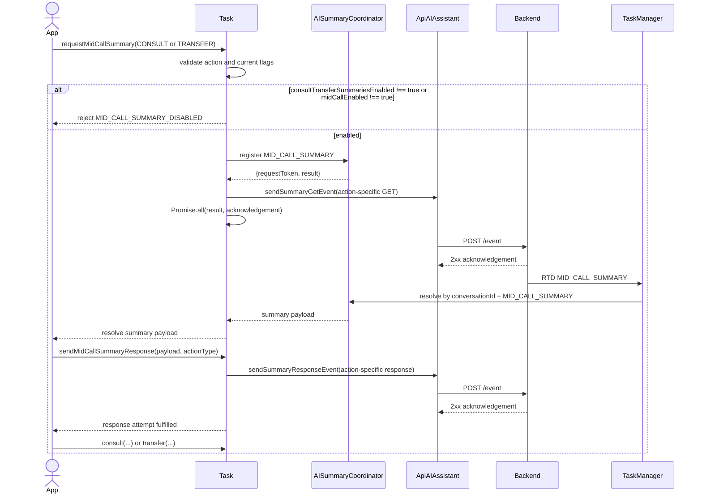

# AI Mid-Call Summary Initiator Flow

This companion view follows the implemented CONSULT and TRANSFER initiator
paths. The authoritative contract is `ai-summary.md`, synchronized to
`design/default/design_spec.md`.

## Component Map



The initiating consumer receives the generated summary through the returned
Promise. There is no public initiator `task:midCallSummary` event in this SDK
slice.

## Happy Path



Consumer sequencing for the handoff is advisory and documentation-only from the
SDK perspective: the application attempts and awaits the summary response before
independently invoking consult or transfer, catches and records response failure,
and still continues the handoff. Unit tests prove event-name selection and
bounded response settlement, not cross-call ordering between public APIs.

## IGNORED Branch

When the feature is enabled (`midCallEnabled === true`) but no summary was ever
requested — for example, the feature flag arrived after the consult/transfer
decision was already made, or the request was never triggered — the application
must send `sendMidCallSummaryResponse` with `state: 'IGNORED'`, `summaryReceived:
false`, `summary: ''`, and all counters at zero before invoking the handoff. The
SDK accepts `IGNORED` in the unavailable branch (`summaryReceived: false`)
alongside `NOT_RECEIVED` and `MID_CALL_CANCELLED`.

## Consumer Recovery Example

This is the authoritative consumer control-flow example for FR-6 recovery
sequencing. It records only bounded response failure metadata, keeps the
handoff call independent of the advisory response attempt, and treats
`MID_CALL_CANCELLED` as the no-handoff branch.

```typescript
import type {
  AISummaryActionType,
  ConsultPayload,
  ITask,
  MidCallSummaryResponsePayload,
  TransferPayLoad
} from '@webex/contact-center';

type BoundedMidCallResponseFailure = {
  actionType: AISummaryActionType;
  errorCode: string;
};

type MidCallHandoffOptions =
  | {
      actionType: 'CONSULT';
      consultPayload: ConsultPayload;
      responsePayload: MidCallSummaryResponsePayload;
      recordSummaryResponseFailure: (
        failure: BoundedMidCallResponseFailure
      ) => void;
    }
  | {
      actionType: 'TRANSFER';
      responsePayload: MidCallSummaryResponsePayload;
      transferPayload: TransferPayLoad;
      recordSummaryResponseFailure: (
        failure: BoundedMidCallResponseFailure
      ) => void;
    };

function getBoundedAISummaryErrorCode(error: unknown): string {
  const data =
    error instanceof Error
      ? (error as Error & {data?: {errorCode?: unknown}}).data
      : undefined;

  return typeof data?.errorCode === 'string'
    ? data.errorCode
    : 'MID_CALL_SUMMARY_RESPONSE_FAILED';
}

export async function completeMidCallHandoff(
  task: ITask,
  options: MidCallHandoffOptions
): Promise<void> {
  const {actionType, responsePayload} = options;

  if (responsePayload.state === 'MID_CALL_CANCELLED') {
    await task.sendMidCallSummaryResponse(responsePayload, actionType);
    return;
  }

  try {
    await task.sendMidCallSummaryResponse(responsePayload, actionType);
  } catch (error) {
    options.recordSummaryResponseFailure({
      actionType,
      errorCode: getBoundedAISummaryErrorCode(error)
    });
  }

  if (actionType === 'CONSULT') {
    await task.consult(options.consultPayload);
    return;
  }

  await task.transfer(options.transferPayload);
}
```

## Contract References

This page owns the initiator and consumer handoff sequence, including the
recovery example above. The canonical contract owns the repeated details:

- [Public Task APIs](./ai-summary.md#public-task-apis) — CONSULT/TRANSFER event
  selection and the no-handoff cancellation branch.
- [Feature Enablement](./ai-summary.md#feature-enablement) — organization and
  interaction gating.
- [Request Coordination](./ai-summary.md#request-coordination) — the shared
  conversation-scoped pending slot, overlap, cleanup, and timeout.
- [Response Payload Rules](./ai-summary.md#response-payload-rules) and
  [Transport](./ai-summary.md#transport) — discriminators, counters,
  timestamps, action-specific response events, and bounded settlement.
- [Metrics And Privacy](./ai-summary.md#metrics-and-privacy) — final outcomes,
  recovery, and sensitive-data exclusions.
