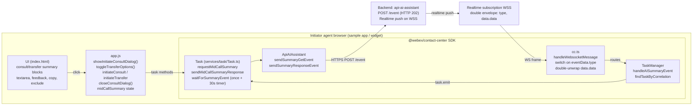
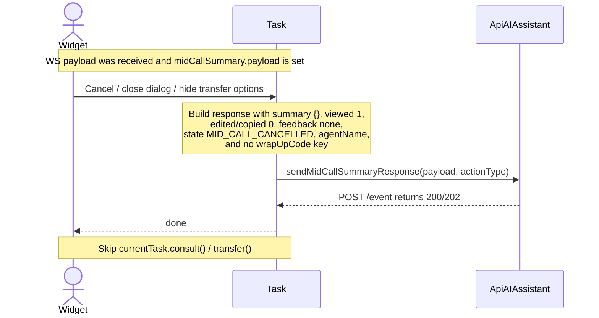
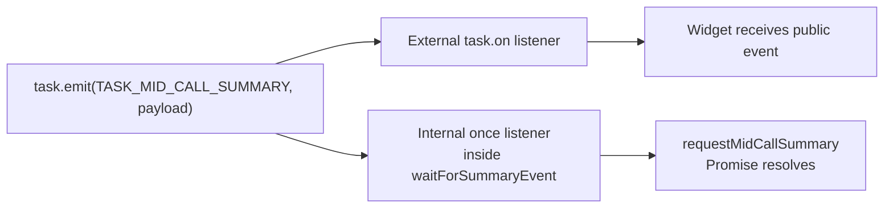

# AI Mid-Call Summary — Initiator Flow Architecture

> Companion to [`ai-summary.md`](./ai-summary.md) (authoritative spec)
> This file is a focused architecture view of what happens on the **initiator
> agent's** side during a mid-call summary, including the **edit / confirm**,
> **cancel**, and **consult / transfer** branches. All semantics are derived
> from `ai-summary.md` §3.1.3, §3.1.4, §5.1.B, §5.2, §6.2, §15.5, §15.7,
> §17.2, §17.3.

## 1. Component map (initiator side)



## 2. Happy path — open dialog → edit → confirm (Consult or Transfer)

```mermaid
sequenceDiagram
  actor Widget
  participant Task
  participant API as ApiAIAssistant
  participant Backend
  participant WS as WS push
  participant CC as cc.ts
  participant TM as TaskManager

  Widget->>Task: requestMidCallSummary(CONSULT or TRANSFER)
  alt consultTransferSummariesEnabled is false
    Task-->>Widget: throw MID_CALL_SUMMARY_DISABLED
  else enabled
    Note over Task: timeEvent(GET_MID_CALL S/F)<br/>attach once listener + 30s timeout<br/>external listeners remain active
    Task->>API: sendSummaryGetEvent(eventName, actionTimeStamp:number)
    API->>Backend: POST /event
    Backend-->>API: HTTP 202
    API-->>Task: trackEvent(GET success); Promise remains pending
    Backend->>WS: MID_CALL_SUMMARY double envelope
    WS->>CC: WS frame
    Note over CC: switch(eventData.type)<br/>double-unwrap data.data
    CC->>TM: handleAISummaryEvent(MID_CALL_SUMMARY, payload)
    Note over TM: findTaskByCorrelation<br/>(conversationId, interactionId)
    TM->>Task: emit TASK_MID_CALL_SUMMARY(payload)
    Note over Task: internal once resolves Promise<br/>external task.on listeners also fire
    Task-->>Widget: summary payload
    Note over Widget: render summary; increment viewed<br/>agent edits, copies, gives feedback,<br/>and may exclude from handoff
    Widget->>Task: sendMidCallSummaryResponse(payload, actionType)
    Note over Task: counters are numbers; agentName required<br/>state DEFAULT or EXCLUDED<br/>wrapUpCode omitted
    Task->>API: sendSummaryResponseEvent(MID_CALL_*_SUMMARY_RESPONSE)
    API->>Backend: POST /event
    Backend-->>API: HTTP 200/202
    API-->>Task: trackEvent(MID_CALL_RESPONSE_SUCCESS or FAILED)
    Task-->>Widget: response completed
    Widget->>Task: consult(...) or transfer(...)
    Note over Widget,Task: Response is sent before the existing consult/transfer API
  end
```

## 3. Cancel branch (initiator dismisses dialog)



Cancel-branch invariants (spec §5.2, §6.2 notes, §17.4 row 4):
- The response IS still sent — backend telemetry stays consistent.
- `state: 'MID_CALL_CANCELLED'`.
- `summary: {}` when no edits were made.
- `numberOfTimesViewed: 1` even on immediate cancel (dialog-open already counted).
- `wrapUpCode` field is **omitted entirely** (mid-call rule, NOT sent as `null`).
- Existing `consult()` / `transfer()` is **not** called.

## 4. Decision table — `state` values the initiator may send

| Branch  | Trigger                                                | `state` on wire       | `summary`                                  | Downstream consult/transfer |
|---------|--------------------------------------------------------|-----------------------|--------------------------------------------|------------------------------|
| Confirm | Click Initiate Consult/Transfer, no Exclude            | `DEFAULT`             | `Partial<MidCallSummarySections>` (or `{}`) | invoked AFTER response       |
| Exclude | Tick "Exclude from handoff", then Initiate             | `EXCLUDED`            | as above                                    | invoked AFTER response       |
| Cancel  | Close dialog / hide transfer fieldset                  | `MID_CALL_CANCELLED`  | `{}`                                        | **skipped**                  |
| Ignored | Agent dismisses summary block but proceeds (reserved)  | `IGNORED`             | `{}`                                        | invoked AFTER response       |

## 5. Wire-shape & redaction reminders (initiator outbound)

```
POST /event  (MID_CALL_CONSULT_SUMMARY_RESPONSE shown)
{
  agentId, orgId, eventType: 'CTI_EVENT',
  eventName: 'MID_CALL_CONSULT_SUMMARY_RESPONSE',     ← variant chosen by actionType
  publishTimestamp: <number>,
  eventDetails: { data: {
    conversationId, interactionId, clientType: 'WxCC',
    action: 'MID_CALL_CONSULT_SUMMARY_RESPONSE',
    actionTimeStamp: <number>,                        ← NUMBER (not string)
    summary: { reasonForTransferOrConsult?, additionalContext?, keyActionsTaken? },
    numberOfTimesViewed: 1,                           ← NUMBERS (not strings)
    numberOfTimesEdited: 0,
    numberOfTimesCopied: 0,
    feedback: 'none' | 'thumbs_up' | 'thumbs_down',
    state:    'DEFAULT' | 'EXCLUDED' | 'MID_CALL_CANCELLED' | 'IGNORED' | 'NOT_RECEIVED',
    agentName: '<required, NEVER log>'
    // wrapUpCode: <KEY OMITTED ENTIRELY>
  }}
}
```

NEVER log: `summary` body, `summaryText`, `agentName`, `adaptiveCard` body,
`editAdaptiveCard` body, `sections` *values*. Loggable: counters, `state`,
`feedback`, IDs, `languageCode`, `resolution`, `areTranscriptsAvailable`,
`adaptiveCardId`, `editAdaptiveCardId`, `sectionsKeys`, `hasSummaryText`
(spec §8.1).

## 6. Promise + event coexistence (§3.1.3, §15.7)



On 30s timeout (`AI_SUMMARY_REQUEST_TIMEOUT_MS`): the internal `once` is
detached and the Promise rejects with `MID_CALL_SUMMARY_TIMEOUT`; late WS
arrivals still fire the public event for any external listeners (no
double-settle).

## 7. Step-by-step walkthrough — Consult initiator

Each step lists: who does it → what happens → which file/method.

### STEP 1 — Agent clicks the "Consult" button

- **Where:** sample app `index.html:214` `<button id="consult">`
- **Handler:** `app.js` → `showInitiateConsultDialog()`
- **What happens in the handler:**
  1. Open the dialog: `initiateConsultDialog.showModal()`
  2. Reset module state:
     ```js
     midCallSummary = {
       actionType: 'CONSULT', payload: null,
       numberOfTimesViewed: 0, numberOfTimesEdited: 0,
       numberOfTimesCopied: 0, feedback: 'none', excluded: false,
     };
     ```
  3. Show the new fieldset `#consult-summary-block` with status text **"Requesting summary…"**
  4. Call the SDK:
     ```js
     const summary = await currentTask.requestMidCallSummary('CONSULT');
     ```

### STEP 2 — SDK validates the feature flag

- **Where:** `Task.requestMidCallSummary(actionType)` in `src/services/task/Task.ts`
- **Check:** `aiFeature.generatedSummaries.consultTransferSummariesEnabled === true`
- **If false:** throw `MID_CALL_SUMMARY_DISABLED` (caller's `await` rejects, no network call).
- **If true:** continue.

### STEP 3 — SDK arms the WS-await race BEFORE making the HTTP call

- Calls private helper `waitForSummaryEvent(TASK_MID_CALL_SUMMARY, 30_000ms, …)`.
- This subscribes a **`once(...)`** listener for the `TASK_MID_CALL_SUMMARY` event AND starts a 30 s timer (`AI_SUMMARY_REQUEST_TIMEOUT_MS`).
- Why subscribe first: if the WS push arrives before our HTTP call returns, we don't want to miss it.
- Why `once`: it does NOT shadow any external `task.on('task:midCallSummary', …)` listeners — those still fire too (multi-session contract, spec §3.1.3).

### STEP 4 — SDK sends the GET event over HTTPS

- **Method called:** `ApiAIAssistant.sendSummaryGetEvent(agentId, interactionId, conversationId, eventName)` in `src/services/ApiAiAssistant.ts`
- **Event name selection:**
  - `'CONSULT'` → `GET_MID_CALL_CONSULT_SUMMARY`
  - `'TRANSFER'` → `GET_MID_CALL_TRANSFER_SUMMARY`
- **Network call:** `POST /event` to `api-ai-assistant.<env>.ciscoccservice.com`
- **Body (spec §6.2):**
  ```json
  {
    "agentId": "<uuid>",
    "orgId": "<uuid>",
    "eventType": "CTI_EVENT",
    "eventName": "GET_MID_CALL_CONSULT_SUMMARY",
    "publishTimestamp": 1779840000000,
    "eventDetails": {
      "data": {
        "interactionId": "<uuid>",
        "conversationId": "<uuid>",
        "clientType": "WxCC",
        "actionTimeStamp": 1779840000000
      }
    }
  }
  ```
- **Backend response:** HTTP **202 Accepted** (no body). This is just the ack — the actual summary will arrive over WebSocket later.
- **Telemetry:** `metricsManager.timeEvent + trackEvent(AI_SUMMARY_GET_MID_CALL_SUCCESS)` on success, `_FAILED` on error.

At this point, `requestMidCallSummary`'s Promise is **still pending** — waiting for the WS frame.

### STEP 5 — Backend pushes the summary on the WebSocket

- **Channel:** `wss://api.<region>.cisco.com/v1/realtime/subscription/Desktop-<uuid>`
- **Frame (double envelope, spec §6.2):**
  ```json
  {
    "type": "MID_CALL_SUMMARY",
    "trackingId": "notifs-data_<uuid>",
    "orgId": "<uuid>",
    "data": {
      "agentId": "<uuid>", "orgId": "<uuid>",
      "notifType": "MID_CALL_SUMMARY",
      "notifDetails": { "actionEvent": "MID_CALL_SUMMARY" },
      "data": {
        "conversationId": "<uuid>",
        "adaptiveCard": { "...": "..." },
        "adaptiveCardId": "<uuid>",
        "editAdaptiveCard": { "...": "..." },
        "editAdaptiveCardId": "<uuid>",
        "languageCode": "en",
        "summaryText": "Reason: …\n\nKey actions: …",
        "resolution": "RESOLVED",
        "areTranscriptsAvailable": true,
        "sections": {
          "reasonForTransferOrConsult": "…",
          "additionalContext": "…",
          "keyActionsTaken": "…"
        },
        "timestamp": 1779840100000
      }
    }
  }
  ```
- **Note the two `data` levels** — outer envelope wraps an inner envelope which holds the actual payload.

### STEP 6 — `cc.ts` routes the WS frame

- **Where:** `cc.handleWebsocketMessage(eventData)` in `src/cc.ts`
- **Top-level switch on `eventData.type`** (spec §15.5):
  ```ts
  case CC_EVENTS.MID_CALL_SUMMARY:
    this.taskManager.handleAISummaryEvent({
      type: 'MID_CALL_SUMMARY',
      data: eventData.data?.data,   // ← double-unwrap to inner payload
    });
    break;
  ```
- The outer envelope fields (`agentId`, `notifType`, `trackingId`) are dropped here — only the inner payload is forwarded to consumers.

### STEP 7 — `TaskManager` finds the right Task and emits

- **Where:** `TaskManager.handleAISummaryEvent({type, data})` in `src/services/task/TaskManager.ts`
- **Lookup:** `findTaskByCorrelation(data.conversationId, data.interactionId)`
  - first tries `taskCollection[interactionId]`
  - falls back to a linear scan keyed by `conversationId` (until backend Q3 is answered)
- **If no task found:** `LoggerProxy.warn(...)` and silently drop.
- **If found:**
  ```ts
  task.emit(TASK_EVENTS.TASK_MID_CALL_SUMMARY, data);
  ```

### STEP 8 — Two listeners fire concurrently

When `task.emit(TASK_MID_CALL_SUMMARY, payload)` runs, BOTH of these fire:

| Listener | Source | Effect |
|---|---|---|
| **Internal `once(…)`** | armed in Step 3 | resolves the Promise from `requestMidCallSummary('CONSULT')` |
| **External `task.on('task:midCallSummary', …)`** | wired by `wireSummaryListeners(task)` in app.js | runs the sample-app handler |

So back in the sample app:

```js
// (a) The Promise resolves
const summary = await currentTask.requestMidCallSummary('CONSULT');
// → updates "Summary ready." status

// (b) The on(...) handler also fires (multi-session contract):
task.on('task:midCallSummary', (payload) => {
  midCallSummary.payload = payload;
  document.getElementById('consult-summary-text').value = renderSummaryText(payload);
  midCallSummary.numberOfTimesViewed += 1;          // ← view counter
  document.getElementById('consult-summary-block').style.display = '';
});
```

`renderSummaryText()` prefers typed `payload.sections`, falling back to `payload.summaryText`. Adaptive cards aren't rendered in the sample.

> **Timeout case:** if no WS frame arrives within 30 s, the `once` listener is detached and the Promise rejects with `MID_CALL_SUMMARY_TIMEOUT`. External `task.on(...)` listeners still fire if a late frame arrives.

### STEP 9 — Agent interacts with the summary block

- Edits text in `<textarea id="consult-summary-text">` — **edit count is computed at submit time** by comparing edited text vs. `renderSummaryText(payload)`, not on each keystroke.
- Click 👍 → `midCallSummary.feedback = 'thumbs_up'`
- Click 👎 → `midCallSummary.feedback = 'thumbs_down'`
- Click "Copy" → `navigator.clipboard.writeText(...)` AND `numberOfTimesCopied += 1`
- Tick "Exclude from handoff" → `midCallSummary.excluded = true`

### STEP 10A — Agent clicks **"Initiate Consult"** (confirm path)

- **Handler:** `initiateConsult()` in `app.js`
- **Sequencing rule (spec §5.2):** RESPONSE FIRST, then existing consult API.

```js
async function initiateConsult() {
  const editedSummary = document.getElementById('consult-summary-text').value;

  if (midCallSummary.payload) {
    if (editedSummary !== renderSummaryText(midCallSummary.payload)) {
      midCallSummary.numberOfTimesEdited += 1;
    }
    // (1) Send the summary response FIRST
    await currentTask.sendMidCallSummaryResponse({
      conversationId: midCallSummary.payload.conversationId,
      interactionId:  currentTask.data.interactionId,
      summary: editedSummary,                          // Partial<MidCallSummarySections>
      numberOfTimesViewed:  midCallSummary.numberOfTimesViewed,
      numberOfTimesEdited:  midCallSummary.numberOfTimesEdited,
      numberOfTimesCopied:  midCallSummary.numberOfTimesCopied,
      feedback:             midCallSummary.feedback,
      state: midCallSummary.excluded ? 'EXCLUDED' : 'DEFAULT',
      agentName:            <agent's display name>,
      // NO wrapUpCode key — OMITTED on mid-call
    }, 'CONSULT');
  }

  // (2) THEN call existing consult API (unchanged)
  await currentTask.consult(consultPayload);
}
```

Inside the SDK, `Task.sendMidCallSummaryResponse(payload, 'CONSULT')` →
`ApiAIAssistant.sendSummaryResponseEvent(agentId, {...payload, eventName: 'MID_CALL_CONSULT_SUMMARY_RESPONSE'})`
→ `POST /event` with body (spec §6.2):

```json
{
  "agentId": "<uuid>", "orgId": "<uuid>",
  "eventType": "CTI_EVENT",
  "eventName": "MID_CALL_CONSULT_SUMMARY_RESPONSE",
  "publishTimestamp": 1779840200000,
  "eventDetails": {
    "data": {
      "conversationId": "<uuid>",
      "interactionId":  "<uuid>",
      "clientType": "WxCC",
      "action": "MID_CALL_CONSULT_SUMMARY_RESPONSE",
      "actionTimeStamp": 1779840200000,
      "summary": { "reasonForTransferOrConsult": "…", "additionalContext": "…", "keyActionsTaken": "…" },
      "numberOfTimesViewed": 1,
      "numberOfTimesEdited": 1,
      "numberOfTimesCopied": 0,
      "feedback": "none",
      "state": "DEFAULT",
      "agentName": "User4 Agent4"
    }
  }
}
```

Wire-contract critical points:
- Counters are **plain numbers** (`1`, not `"1"`).
- `actionTimeStamp` is a **number**.
- `wrapUpCode` key is **OMITTED entirely** (NOT sent as `null`).
- `summary` is always an **object** (`{}` if no edits).

Telemetry: `trackEvent(AI_SUMMARY_MID_CALL_RESPONSE_SUCCESS)` on success.

After this resolves, the existing `currentTask.consult(...)` runs (unchanged WxCC consult API).

### STEP 10B — Agent clicks **Cancel** instead (cancel path)

- **Handler:** `closeConsultDialog()` in `app.js`
- **Sequencing rule (spec §5.2):** still send the response, but DO NOT call `consult()`.

```js
async function closeConsultDialog() {
  initiateConsultDialog.close();
  if (midCallSummary.payload && midCallSummary.actionType === 'CONSULT') {
    await currentTask.sendMidCallSummaryResponse({
      conversationId: midCallSummary.payload.conversationId,
      interactionId:  currentTask.data.interactionId,
      summary: {},                                    // ← empty object (cancel-without-edits)
      numberOfTimesViewed: midCallSummary.numberOfTimesViewed,  // typically 1
      numberOfTimesEdited: 0,
      numberOfTimesCopied: 0,
      feedback: 'none',
      state: 'MID_CALL_CANCELLED',                    // ← KEY DIFFERENCE
      agentName: <agent's display name>,
      // NO wrapUpCode key
    }, 'CONSULT');
  }
  // existing currentTask.consult(...) is NOT called
}
```

Cancel-branch invariants:
- Response IS still sent (backend telemetry consistency).
- `state: 'MID_CALL_CANCELLED'`, `summary: {}`.
- `numberOfTimesViewed: 1` even on immediate cancel (the dialog-open counted).
- Existing consult API is **skipped**.

### Quick mental model

1. **Click Consult** → app.js opens dialog, calls `task.requestMidCallSummary('CONSULT')`.
2. **SDK** arms a `once` WS listener + 30 s timer, then fires `POST /event GET_MID_CALL_CONSULT_SUMMARY` (HTTP 202).
3. **Backend** pushes `MID_CALL_SUMMARY` over WS (double envelope).
4. **`cc.ts`** unwraps two layers, hands inner payload to `TaskManager`.
5. **`TaskManager`** finds the Task by `conversationId`/`interactionId` and emits `task:midCallSummary`.
6. **Both consumers** fire — Promise resolves AND `task.on(...)` listener runs.
7. **Agent edits / votes / copies** — counters tracked in app.js state.
8. **Click Initiate Consult**: response POST first (`MID_CALL_CONSULT_SUMMARY_RESPONSE`, `state: 'DEFAULT' | 'EXCLUDED'`), THEN existing `consult()`.
9. **Click Cancel**: response POST with `state: 'MID_CALL_CANCELLED'`, `summary: {}`; NO `consult()`.

Transfer flow is identical with `'TRANSFER'` actionType swapped in — `GET_MID_CALL_TRANSFER_SUMMARY` and `MID_CALL_TRANSFER_SUMMARY_RESPONSE` event names, and `currentTask.transfer(...)` instead of `consult(...)`.

## 8. Cross-references

- Authoritative spec: [`ai-summary.md`](./ai-summary.md)
  - §3.1.3 `requestMidCallSummary`
  - §3.1.4 `sendMidCallSummaryResponse`
  - §5.1.B mid-call flow
  - §5.2 sequencing & cancel branch
  - §6.2 wire schemas
  - §8.1 redaction rules
  - §15.5 `cc.handleWebsocketMessage` switch
  - §15.7 `Task` public methods + `waitForSummaryEvent`
  - §17.2 / §17.3 sample-app wiring & sequencing
- Companion docs:
  - [`ai-summary-postcall-flow.md`](./ai-summary-postcall-flow.md) — post-call summary
  - [`ai-summary-receiver-flow.md`](./ai-summary-receiver-flow.md) — receiver-side mid-call
