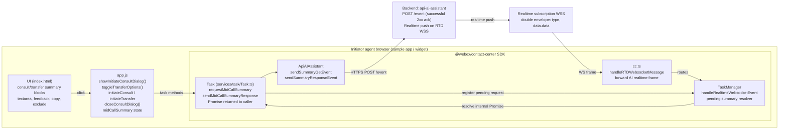
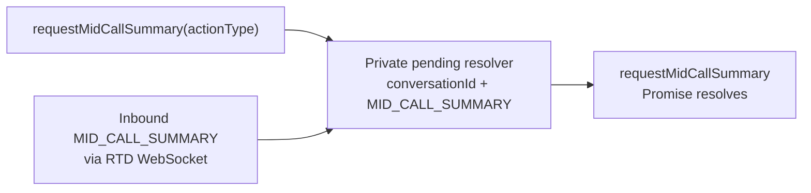

# AI Mid-Call Summary — Initiator Flow Architecture

> Companion to [`ai-summary.md`](./ai-summary.md) (authoritative spec)
> This file is a focused architecture view of what happens on the **initiator
> agent's** side during a mid-call summary, including the **edit / confirm**,
> **cancel**, and **consult / transfer** branches. All semantics are derived
> from `ai-summary.md` §3.1.3, §3.1.4, §5.1.B, §5.2, §6.2, §15.5, §15.7,
> §17.2, §17.3.

## 1. Component map (initiator side)



## 2. Happy path — open dialog → edit → confirm (Consult or Transfer)

```mermaid
sequenceDiagram
  actor Widget
  participant Task
  participant API as ApiAIAssistant
  participant Backend
  participant WS as WS push
  participant CC as cc.ts
  participant TM as TaskManager

  Widget->>Task: requestMidCallSummary(CONSULT or TRANSFER)
  alt organization or interaction mid-call flag is not true
    Task-->>Widget: throw MID_CALL_SUMMARY_DISABLED
  else enabled
    Task->>TM: register pending MID_CALL_SUMMARY<br/>by conversationId; start 30s timeout
    Note over Task,TM: Reject overlapping same-type request<br/>with AI_SUMMARY_REQUEST_ALREADY_PENDING
    Task->>API: sendSummaryGetEvent(eventName, actionTimeStamp:number)
    API->>Backend: POST /event
    Backend-->>API: successful 2xx acknowledgement
    API-->>Task: trackEvent(GET success); Promise remains pending
    Backend->>WS: MID_CALL_SUMMARY double envelope
    WS->>CC: WS frame
    CC->>TM: handleRealtimeWebsocketEvent(frame)
    Note over TM: double-unwrap data.data<br/>match pending request by conversationId and type
    TM-->>Task: resolve pending request with payload
    Task-->>Widget: summary payload
    Note over Widget: render summary; increment viewed<br/>agent edits, copies, gives feedback,<br/>and may exclude from handoff
    Widget->>Task: sendMidCallSummaryResponse(payload, actionType)
    Note over Task: counters are numbers; agentName required<br/>state DEFAULT or EXCLUDED<br/>wrapUpCode omitted
    Task->>API: sendSummaryResponseEvent(MID_CALL_*_SUMMARY_RESPONSE)
    API->>Backend: POST /event
    Backend-->>API: successful 2xx acknowledgement
    API-->>Task: trackEvent(MID_CALL_RESPONSE_SUCCESS or FAILED)
    Task-->>Widget: response attempt completed or rejected
    Widget->>Task: consult(...) or transfer(...)
    Note over Widget,Task: Response is attempted first;<br/>failure is recorded but does not block handoff
  end
```

## 3. Cancel branch (initiator dismisses dialog)

```mermaid
sequenceDiagram
  actor Widget
  participant Task
  participant API as ApiAIAssistant
  Note over Widget,Task: WS payload was received and midCallSummary.payload is set
  Widget->>Task: Cancel / close dialog / hide transfer options
  Note over Task: Preserve received object/string summary and viewed 1;<br/>use empty string and zero counters if not received;<br/>state MID_CALL_CANCELLED; no wrapUpCode key
  Task->>API: sendMidCallSummaryResponse(payload, actionType)
  API-->>Task: POST /event returns successful 2xx
  Task-->>Widget: done
  Note over Widget,Task: Skip currentTask.consult() / transfer()
```

Cancel-branch invariants (spec §5.2, §6.2 notes, §17.4 row 4):
- The response IS still sent — backend telemetry stays consistent.
- `state: 'MID_CALL_CANCELLED'`.
- If a summary was received, its structured-object or plain-text representation is preserved and `numberOfTimesViewed` is `1` after the dialog opens.
- If no summary was received, `summary` is `''` and all interaction counters are `0`.
- `wrapUpCode` field is **omitted entirely** (mid-call rule, NOT sent as `null`).
- Existing `consult()` / `transfer()` is **not** called.

## 4. Decision table — `state` values the initiator may send

| Branch  | Trigger                                                | `state` on wire       | `summary`                                  | Downstream consult/transfer |
|---------|--------------------------------------------------------|-----------------------|--------------------------------------------|------------------------------|
| Confirm | Click Initiate Consult/Transfer, no Exclude            | `DEFAULT`             | structured sections or plain text           | invoked after response attempt |
| Exclude | Tick "Exclude from handoff", then Initiate             | `EXCLUDED`            | as above                                    | invoked AFTER response       |
| Cancel  | Close dialog / hide transfer fieldset                  | `MID_CALL_CANCELLED`  | received representation; `''` if unavailable | **skipped**                 |
| Ignored | Agent dismisses summary block but proceeds (reserved)  | `IGNORED`             | received representation; `''` if unavailable | invoked after response attempt |

## 5. Wire-shape & redaction reminders (initiator outbound)

```
POST /event  (MID_CALL_CONSULT_SUMMARY_RESPONSE shown)
{
  agentId, orgId, eventType: 'CTI_EVENT',
  eventName: 'MID_CALL_CONSULT_SUMMARY_RESPONSE',     ← variant chosen by actionType
  publishTimestamp: <number>,
  eventDetails: { data: {
    conversationId, interactionId, clientType: 'WxCC',
    action: 'MID_CALL_CONSULT_SUMMARY_RESPONSE',
    actionTimeStamp: <number>,                        ← NUMBER (not string)
    summary: { reasonForTransferOrConsult?, additionalContext?, keyActionsTaken? }
             | '<plain-text summary>' | '',
    numberOfTimesViewed: 1,                           ← NUMBERS (not strings)
    numberOfTimesEdited: 0,
    numberOfTimesCopied: 0,
    feedback: 'none' | 'thumbs_up' | 'thumbs_down',
    state:    'DEFAULT' | 'EXCLUDED' | 'MID_CALL_CANCELLED' | 'IGNORED' | 'NOT_RECEIVED',
    agentName: '<required, NEVER log>'
    // wrapUpCode: <KEY OMITTED ENTIRELY>
  }}
}
```

Both identifiers are required on every outbound response, including `NOT_RECEIVED`; `conversationId` must never be replaced with `''`. The SDK derives both fields consistently from the requesting task's correlation data. The receiving-agent correlation rule remains separate and uses the shared inbound `conversationId`.

The application records views, edits, and copies. The SDK forwards those supplied numeric values unchanged; it must not hardcode the viewed count or convert an edit count into a boolean-derived `0`/`1`. Only a no-summary response forces all three counters to `0`.

NEVER log: `summary` body, `summaryText`, `agentName`, `adaptiveCard` body,
`editAdaptiveCard` body, `sections` *values*. Loggable: counters, `state`,
`feedback`, IDs, `languageCode`, `resolution`, `areTranscriptsAvailable`,
`adaptiveCardId`, `editAdaptiveCardId`, `sectionsKeys`, `hasSummaryText`
(spec §8.1).

## 6. Promise-only completion



There is no public initiating-agent `task:midCallSummary` event. On the 30-second timeout (`AI_SUMMARY_REQUEST_TIMEOUT_MS`), the pending resolver is removed and the Promise rejects with `MID_CALL_SUMMARY_TIMEOUT`. A late frame is ignored safely and cannot settle the expired Promise.

## 7. Step-by-step walkthrough — Consult initiator

Each step lists: who does it → what happens → which file/method.

### STEP 1 — Agent clicks the "Consult" button

- **Where:** sample app `index.html:214` `<button id="consult">`
- **Handler:** `app.js` → `showInitiateConsultDialog()`
- **What happens in the handler:**
  1. Open the dialog: `initiateConsultDialog.showModal()`
  2. Reset module state:
     ```js
     midCallSummary = {
       actionType: 'CONSULT', payload: null,
       numberOfTimesViewed: 0, numberOfTimesEdited: 0,
       numberOfTimesCopied: 0, feedback: 'none', excluded: false,
     };
     ```
  3. Show the new fieldset `#consult-summary-block` with status text **"Requesting summary…"**
  4. Call the SDK:
     ```js
     const summary = await currentTask.requestMidCallSummary('CONSULT');
     ```

### STEP 2 — SDK validates the feature flag

- **Where:** `Task.requestMidCallSummary(actionType)` in `src/services/task/Task.ts`
- **Check:** both `aiFeature.generatedSummaries.consultTransferSummariesEnabled === true` and the latest interaction-level `midCallEnabled === true`.
- **If false:** throw `MID_CALL_SUMMARY_DISABLED` (caller's `await` rejects, no network call).
- **If true:** continue.

### STEP 3 — SDK registers the pending request BEFORE making the HTTP call

- Registers a private pending resolver keyed by `conversationId` and `MID_CALL_SUMMARY`, then starts a 30-second timer (`AI_SUMMARY_REQUEST_TIMEOUT_MS`).
- Why register first: if the WS push arrives before our HTTP call returns, we don't want to miss it.
- If another mid-call request is already pending for the same task, reject it with `AI_SUMMARY_REQUEST_ALREADY_PENDING` without sending another backend request.

### STEP 4 — SDK sends the GET event over HTTPS

- **Method called:** `ApiAIAssistant.sendSummaryGetEvent(agentId, interactionId, conversationId, eventName)` in `src/services/ApiAiAssistant.ts`
- **Event name selection:**
  - `'CONSULT'` → `GET_MID_CALL_CONSULT_SUMMARY`
  - `'TRANSFER'` → `GET_MID_CALL_TRANSFER_SUMMARY`
- **Network call:** `POST /event` to `api-ai-assistant.<env>.ciscoccservice.com`
- **Body (spec §6.2):**
  ```json
  {
    "agentId": "<uuid>",
    "orgId": "<uuid>",
    "eventType": "CTI_EVENT",
    "eventName": "GET_MID_CALL_CONSULT_SUMMARY",
    "publishTimestamp": 1779840000000,
    "eventDetails": {
      "data": {
        "interactionId": "<uuid>",
        "conversationId": "<uuid>",
        "clientType": "WxCC",
        "actionTimeStamp": 1779840000000
      }
    }
  }
  ```
- **Backend response:** any successful **2xx** response is only an acknowledgement; the actual summary arrives over the realtime WebSocket later.
- **Telemetry:** `metricsManager.timeEvent + trackEvent(AI_SUMMARY_GET_MID_CALL_SUCCESS)` on success, `_FAILED` on error.

At this point, `requestMidCallSummary`'s Promise is **still pending** — waiting for the WS frame.

### STEP 5 — Backend pushes the summary on the WebSocket

- **Channel:** the existing RTD subscription managed by `rtdWebSocketManager`.
- **Frame (double envelope, spec §6.2):**
  ```json
  {
    "type": "MID_CALL_SUMMARY",
    "trackingId": "notifs-data_<uuid>",
    "orgId": "<uuid>",
    "data": {
      "agentId": "<uuid>", "orgId": "<uuid>",
      "notifType": "MID_CALL_SUMMARY",
      "notifDetails": { "actionEvent": "MID_CALL_SUMMARY" },
      "data": {
        "conversationId": "<uuid>",
        "adaptiveCard": { "...": "..." },
        "adaptiveCardId": "<uuid>",
        "editAdaptiveCard": { "...": "..." },
        "editAdaptiveCardId": "<uuid>",
        "languageCode": "en",
        "summaryText": "Reason: …\n\nKey actions: …",
        "resolution": "RESOLVED",
        "areTranscriptsAvailable": true,
        "sections": {
          "reasonForTransferOrConsult": "…",
          "additionalContext": "…",
          "keyActionsTaken": "…"
        },
        "timestamp": 1779840100000
      }
    }
  }
  ```
- **Note the two `data` levels** — outer envelope wraps an inner envelope which holds the actual payload.

### STEP 6 — `cc.ts` routes the RTD WS frame

- **Where:** `cc.handleRTDWebsocketMessage(event)` in `src/cc.ts`.
- The handler forwards the raw AI realtime frame to `TaskManager.handleRealtimeWebsocketEvent(event)`.
- `TaskManager` parses the double envelope and extracts the inner `data.data` summary payload.

### STEP 7 — `TaskManager` resolves the pending request

- **Where:** `TaskManager.handleRealtimeWebsocketEvent(event)` in `src/services/task/TaskManager.ts`.
- **Lookup:** match the private pending resolver by `data.conversationId` and `MID_CALL_SUMMARY`.
- **Receiver-path distinction:** this step handles the initiating agent's `MID_CALL_SUMMARY`. For `MID_CALL_SUMMARY_RESPONSE_SUBSEQUENT_AGENT`, the receiving task shares the originator's `conversationId`; that `conversationId` is the sole authoritative correlation identifier, with no `interactionId` fallback.
- **If no pending resolver exists:** log metadata-only diagnostics and ignore the late or uncorrelated payload.
- **If found:** clear the timer and pending entry, then resolve `requestMidCallSummary()` with the inner payload.

### STEP 8 — The request Promise settles

Back in the sample app, the Promise is the only initiating-agent completion channel:

```js
const summary = await currentTask.requestMidCallSummary('CONSULT');
midCallSummary.payload = summary;
document.getElementById('consult-summary-text').value = renderSummaryText(summary);
midCallSummary.numberOfTimesViewed += 1;
document.getElementById('consult-summary-block').style.display = '';
```

`renderSummaryText()` prefers typed `payload.sections`, falling back to `payload.summaryText`. Adaptive cards aren't rendered in the sample.

> **Timeout case:** if no WS frame arrives within 30 seconds, the pending resolver is removed and the Promise rejects with `MID_CALL_SUMMARY_TIMEOUT`. A late frame is ignored.

### STEP 9 — Agent interacts with the summary block

- Edits text in `<textarea id="consult-summary-text">` — **edit count is computed at submit time** by comparing edited text vs. `renderSummaryText(payload)`, not on each keystroke.
- Click 👍 → `midCallSummary.feedback = 'thumbs_up'`
- Click 👎 → `midCallSummary.feedback = 'thumbs_down'`
- Click "Copy" → `navigator.clipboard.writeText(...)` AND `numberOfTimesCopied += 1`
- Tick "Exclude from handoff" → `midCallSummary.excluded = true`

### STEP 10A — Agent clicks **"Initiate Consult"** (confirm path)

- **Handler:** `initiateConsult()` in `app.js`
- **Sequencing rule (spec §5.2):** RESPONSE FIRST, then existing consult API.

```js
async function initiateConsult() {
  const editedSummary = document.getElementById('consult-summary-text').value;

  if (midCallSummary.payload) {
    if (editedSummary !== renderSummaryText(midCallSummary.payload)) {
      midCallSummary.numberOfTimesEdited += 1;
    }
    // (1) Attempt the summary response FIRST
    try {
      await currentTask.sendMidCallSummaryResponse({
        conversationId: midCallSummary.payload.conversationId,
        interactionId:  currentTask.data.interactionId,
        summary: editedSummary,                        // string or structured sections
        numberOfTimesViewed:  midCallSummary.numberOfTimesViewed,
        numberOfTimesEdited:  midCallSummary.numberOfTimesEdited,
        numberOfTimesCopied:  midCallSummary.numberOfTimesCopied,
        feedback:             midCallSummary.feedback,
        state: midCallSummary.excluded ? 'EXCLUDED' : 'DEFAULT',
        agentName:            <agent's display name>,
        // NO wrapUpCode key — OMITTED on mid-call
      }, 'CONSULT');
    } catch (error) {
      reportSummaryResponseFailure(error);             // do not block handoff
    }
  }

  // (2) THEN call existing consult API (unchanged)
  await currentTask.consult(consultPayload);
}
```

Inside the SDK, `Task.sendMidCallSummaryResponse(payload, 'CONSULT')` →
`ApiAIAssistant.sendSummaryResponseEvent(agentId, {...payload, eventName: 'MID_CALL_CONSULT_SUMMARY_RESPONSE'})`
→ `POST /event` with body (spec §6.2):

```json
{
  "agentId": "<uuid>", "orgId": "<uuid>",
  "eventType": "CTI_EVENT",
  "eventName": "MID_CALL_CONSULT_SUMMARY_RESPONSE",
  "publishTimestamp": 1779840200000,
  "eventDetails": {
    "data": {
      "conversationId": "<uuid>",
      "interactionId":  "<uuid>",
      "clientType": "WxCC",
      "action": "MID_CALL_CONSULT_SUMMARY_RESPONSE",
      "actionTimeStamp": 1779840200000,
      "summary": { "reasonForTransferOrConsult": "…", "additionalContext": "…", "keyActionsTaken": "…" },
      "numberOfTimesViewed": 1,
      "numberOfTimesEdited": 1,
      "numberOfTimesCopied": 0,
      "feedback": "none",
      "state": "DEFAULT",
      "agentName": "User4 Agent4"
    }
  }
}
```

Wire-contract critical points:
- Counters are **plain numbers** (`1`, not `"1"`).
- Counters are the application's observed values and are forwarded unchanged by the SDK; they are not SDK-generated constants or booleans.
- `actionTimeStamp` is a **number**.
- `wrapUpCode` key is **OMITTED entirely** (NOT sent as `null`).
- `summary` preserves structured sections when present; otherwise it is the final plain-text summary. If no summary was received, it is `''`.

Telemetry: `trackEvent(AI_SUMMARY_MID_CALL_RESPONSE_SUCCESS)` on success.

After the response attempt settles, successfully or unsuccessfully, the existing `currentTask.consult(...)` runs.

### STEP 10B — Agent clicks **Cancel** instead (cancel path)

- **Handler:** `closeConsultDialog()` in `app.js`
- **Sequencing rule (spec §5.2):** still send the response, but DO NOT call `consult()`.

```js
async function closeConsultDialog() {
  initiateConsultDialog.close();
  if (midCallSummary.actionType === 'CONSULT') {
    const hasSummary = Boolean(midCallSummary.payload);
    await currentTask.sendMidCallSummaryResponse({
      conversationId: midCallSummary.payload?.conversationId ?? currentTask.data.interactionId,
      interactionId:  currentTask.data.interactionId,
      summary: hasSummary ? serializeReceivedSummary(midCallSummary.payload) : '',
      numberOfTimesViewed: hasSummary ? midCallSummary.numberOfTimesViewed : 0,
      numberOfTimesEdited: 0,
      numberOfTimesCopied: 0,
      feedback: 'none',
      state: 'MID_CALL_CANCELLED',                    // ← KEY DIFFERENCE
      agentName: <agent's display name>,
      // NO wrapUpCode key
    }, 'CONSULT');
  }
  // existing currentTask.consult(...) is NOT called
}
```

Cancel-branch invariants:
- Response IS still sent (backend telemetry consistency).
- `state: 'MID_CALL_CANCELLED'`; preserve the received summary representation.
- If no summary was received, use `summary: ''` and zero counters.
- Existing consult API is **skipped**.

### Quick mental model

1. **Click Consult** → app.js opens dialog, calls `task.requestMidCallSummary('CONSULT')`.
2. **SDK** registers a private pending resolver + 30-second timer, then fires `POST /event GET_MID_CALL_CONSULT_SUMMARY` (successful 2xx acknowledgement).
3. **Backend** pushes `MID_CALL_SUMMARY` over WS (double envelope).
4. **`cc.ts`** forwards the RTD frame to `TaskManager`.
5. **`TaskManager`** matches the private pending request by `conversationId` and type, then resolves the Promise without emitting a public initiator event.
6. **The requesting consumer** receives the summary exactly once through its Promise.
7. **Agent edits / votes / copies** — counters tracked in app.js state.
8. **Click Initiate Consult**: response POST is attempted first (`MID_CALL_CONSULT_SUMMARY_RESPONSE`, `state: 'DEFAULT' | 'EXCLUDED'`), then existing `consult()` runs even if the response fails.
9. **Click Cancel**: response POST uses `state: 'MID_CALL_CANCELLED'` and the received summary representation; no `consult()`.

Transfer flow is identical with `'TRANSFER'` actionType swapped in — `GET_MID_CALL_TRANSFER_SUMMARY` and `MID_CALL_TRANSFER_SUMMARY_RESPONSE` event names, and `currentTask.transfer(...)` instead of `consult(...)`.

## 8. Cross-references

- Authoritative spec: [`ai-summary.md`](./ai-summary.md)
  - §3.1.3 `requestMidCallSummary`
  - §3.1.4 `sendMidCallSummaryResponse`
  - §5.1.B mid-call flow
  - §5.2 sequencing & cancel branch
  - §6.2 wire schemas
  - §8.1 redaction rules
  - §15.5 `cc.handleRTDWebsocketMessage` forwarding
  - §15.7 `Task` public methods + private pending-request resolver
  - §17.2 / §17.3 sample-app wiring & sequencing
- Companion docs:
  - [`ai-summary-postcall-flow.md`](./ai-summary-postcall-flow.md) — post-call summary
  - [`ai-summary-receiver-flow.md`](./ai-summary-receiver-flow.md) — receiver-side mid-call
