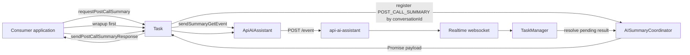
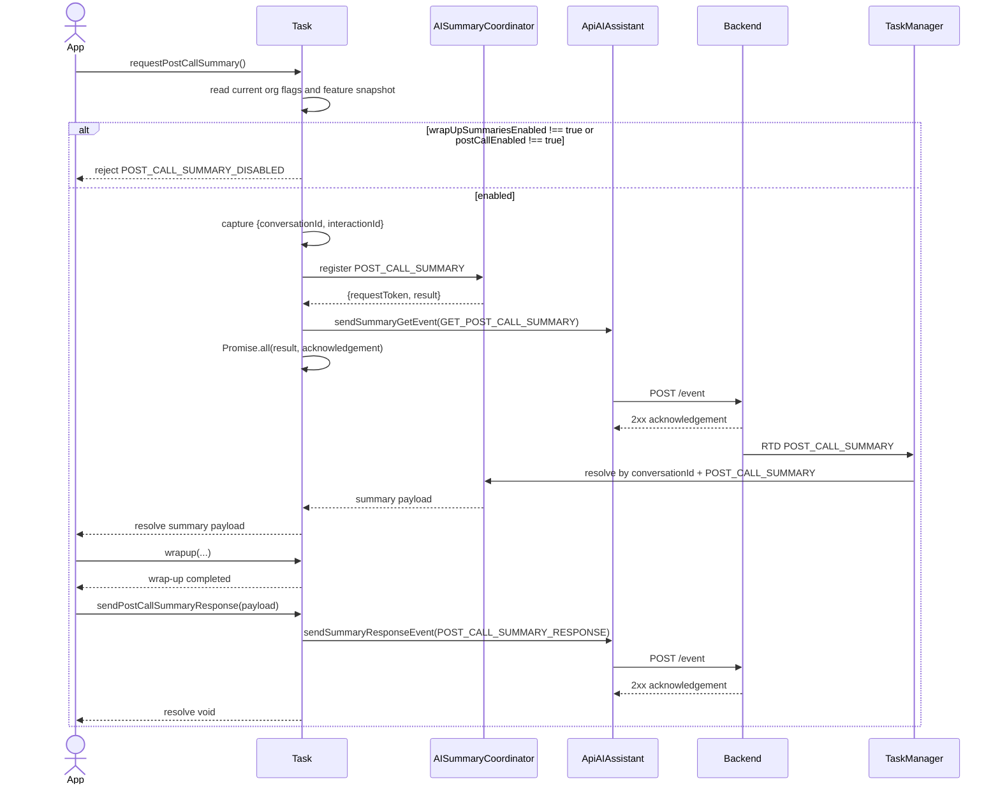

# AI Post-Call Summary Flow

This companion view follows the implemented post-call path. The authoritative
contract is `ai-summary.md`, which is synchronized to
`design/default/design_spec.md`.

## Component Map

There is no public `task:postCallSummary` completion event in this SDK slice.
The initiating consumer receives the summary through the returned Promise.

## Happy Path

The existing wrap-up API runs before the advisory summary response. A summary
request rejection must not block wrap-up.

## IGNORED Branch

When the feature is enabled (`postCallEnabled === true`) but no summary was ever
requested — for example, the feature flag arrived after wrapup was already
initiated — the application must send `sendPostCallSummaryResponse` with `state:
'IGNORED'`, `summary: ''`, all counters at zero, and the actual `wrapUpCode`
before completing wrapup.

## Contract References

This page owns the post-call sequence only. The canonical contract defines the
rules used at each step:

- [Feature Enablement](./ai-summary.md#feature-enablement) — organization and
  interaction gating.
- [Correlation](./ai-summary.md#correlation) and
  [Lifecycle](./ai-summary.md#lifecycle) — request-time identifiers, retained
  response context, and cleanup.
- [Request Coordination](./ai-summary.md#request-coordination) — overlap,
  cancellation tokens, timeout, and ownership.
- [Response Payload Rules](./ai-summary.md#response-payload-rules) and
  [Transport](./ai-summary.md#transport) — response branches, counters,
  timestamps, and wire-key omission.
- [Metrics And Privacy](./ai-summary.md#metrics-and-privacy) — final outcomes,
  recovery, and sensitive-data exclusions.
