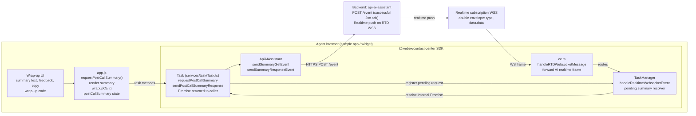
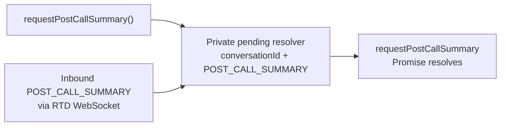

# AI Post-Call Summary — Flow Architecture

> Companion to [`ai-summary.md`](./ai-summary.md) (authoritative spec) and [`ai-summary-initiator-flow.md`](./ai-summary-initiator-flow.md)
> (mid-call initiator flow). This file is a focused architecture view of
> what happens during the **post-call summary** flow on the wrapping-up
> agent's side. All semantics are derived from `ai-summary.md` §3.1.1,
> §3.1.2, §5.1.A, §5.2, §6.2, §15.5, §15.7, §17.2, §17.3.

## 1. Component map (wrap-up side)



## 2. Happy path — task enters wrap-up → edit → submit wrap-up → send response

```mermaid
sequenceDiagram
  actor Widget
  participant Task
  participant API as ApiAIAssistant
  participant Backend
  participant WS as WS push
  participant CC as cc.ts
  participant TM as TaskManager

  Widget->>Task: requestPostCallSummary()
  alt organization or interaction post-call flag is not true
    Task-->>Widget: throw POST_CALL_SUMMARY_DISABLED
  else enabled
    Task->>TM: register pending POST_CALL_SUMMARY<br/>by conversationId; start 30s timeout
    Note over Task,TM: Reject overlapping same-type request<br/>with AI_SUMMARY_REQUEST_ALREADY_PENDING
    Task->>API: sendSummaryGetEvent(GET_POST_CALL_SUMMARY)
    API->>Backend: POST /event
    Backend-->>API: successful 2xx acknowledgement
    API-->>Task: trackEvent(GET success); Promise remains pending
    Backend->>WS: POST_CALL_SUMMARY double envelope
    WS->>CC: WS frame
    CC->>TM: handleRealtimeWebsocketEvent(frame)
    Note over TM: double-unwrap data.data<br/>match pending request by conversationId and type
    TM-->>Task: resolve pending request with payload
    Task-->>Widget: summary payload
    Note over Widget: render summary; increment viewed<br/>agent edits, copies, gives feedback,<br/>and selects wrap-up code
    Widget->>Task: wrapup(...)
    Task-->>Widget: wrap-up completed
    Widget->>Task: sendPostCallSummaryResponse(payload)
    Task->>API: sendSummaryResponseEvent(POST_CALL_SUMMARY_RESPONSE)
    API->>Backend: POST /event
    Backend-->>API: successful 2xx acknowledgement
    API-->>Task: trackEvent(POST_CALL_RESPONSE_SUCCESS or FAILED)
    Task-->>Widget: response completed
    Note over Widget,Task: Existing wrap-up API completes before the summary response is sent
  end
```

## 3. Decision table — `state` values the wrap-up agent may send

| Branch               | Trigger                                             | `state` on wire | `summary`                                   | `wrapUpCode`         |
|----------------------|-----------------------------------------------------|-----------------|---------------------------------------------|----------------------|
| Submit (default)     | Agent submitted wrap-up after seeing summary        | `DEFAULT`       | structured sections or plain text           | required, non-null   |
| Ignored              | Agent dismissed summary block but still wrapped up  | `IGNORED`       | received representation                     | required, non-null   |
| Not received         | WS push timed out / never arrived; agent still wrapped up | `NOT_RECEIVED` | `''` with zero counters                | required, non-null   |

`MID_CALL_CANCELLED` and `EXCLUDED` are **mid-call only** — never sent on a `POST_CALL_SUMMARY_RESPONSE`.

## 4. Wire-shape & redaction reminders (post-call outbound)

```
POST /event  (POST_CALL_SUMMARY_RESPONSE)
{
  agentId, orgId, eventType: 'CTI_EVENT',
  eventName: 'POST_CALL_SUMMARY_RESPONSE',
  publishTimestamp: <number>,
  eventDetails: { data: {
    conversationId, interactionId, clientType: 'WxCC',
    action: 'POST_CALL_SUMMARY_RESPONSE',
    actionTimeStamp: <number>,                        ← NUMBER (not string)
    summary: {                                         ← structured sections when available
      initialContactReason?, additionalContactReasons?,
      additionalContext?, keyActionsTaken?, nextSteps?
    } | '<plain-text summary>' | '',
    numberOfTimesViewed: 1,                           ← NUMBERS (not strings)
    numberOfTimesEdited: 1,
    numberOfTimesCopied: 0,
    feedback: 'none' | 'thumbs_up' | 'thumbs_down',
    state:    'DEFAULT' | 'IGNORED' | 'NOT_RECEIVED',
    wrapUpCode: 'Sale'                                ← REQUIRED non-null string
    // NO agentName key (agentName is mid-call only)
  }}
}
```

Both identifiers are required on every outbound response, including `NOT_RECEIVED`; `conversationId` must never be replaced with `''`. The SDK derives both fields consistently from the requesting task's correlation data.

The application records views, edits, and copies. The SDK forwards those supplied numeric values unchanged; it must not hardcode the viewed count or convert an edit count into a boolean-derived `0`/`1`. Only a no-summary response forces all three counters to `0`.

NEVER log: `summary` body, `summaryText`, `adaptiveCard` body,
`editAdaptiveCard` body, `sections` *values*. Loggable: counters, `state`,
`feedback`, `wrapUpCode`, IDs, `languageCode`, `resolution`,
`areTranscriptsAvailable`, `adaptiveCardId`, `editAdaptiveCardId`,
`sectionsKeys`, `hasSummaryText` (spec §8.1).

## 5. Promise-only completion



There is no public `task:postCallSummary` event. On the 30-second timeout (`AI_SUMMARY_REQUEST_TIMEOUT_MS`), the pending resolver is removed and the Promise rejects with `POST_CALL_SUMMARY_TIMEOUT`. A late frame is ignored safely. If timeout is the outcome, the application sends `state: 'NOT_RECEIVED'`, `summary: ''`, and zero interaction counters after wrap-up succeeds.

## 6. Step-by-step walkthrough — post-call summary

Each step lists: who does it → what happens → which file/method.

### STEP 1 — Task transitions to wrap-up state

- The existing WxCC task state machine moves the task to `WRAPPING_UP`
  (after the call ends and the agent has pressed "End Call" or been
  released, depending on the routing config).
- The sample app's existing UI-controls path detects this; in the new
  surface this hooks into `onWrapupEntry(task)` (spec §17.2 / Phase 5 T5.13).
- **Handler:** `app.js` → `onWrapupEntry(task)`
- **What happens:**
  1. Reset module state:
     ```js
     postCallSummary = {
       payload: null,
       numberOfTimesViewed: 0, numberOfTimesEdited: 0, numberOfTimesCopied: 0,
       feedback: 'none',
     };
     ```
  2. Show `#postcall-summary-block` with status text **"Waiting for summary…"**
  3. Call the SDK:
     ```js
     const summary = await task.requestPostCallSummary();
     ```

### STEP 2 — SDK validates the feature flag

- **Where:** `Task.requestPostCallSummary()` in `src/services/task/Task.ts`
- **Check:** both `aiFeature.generatedSummaries.wrapUpSummariesEnabled === true` and the latest interaction-level `postCallEnabled === true`.
- **If false:** throw `POST_CALL_SUMMARY_DISABLED` (caller's `await` rejects, no network call).
- **If true:** continue.

### STEP 3 — SDK registers the pending request BEFORE making the HTTP call

- Registers a private pending resolver keyed by `conversationId` and `POST_CALL_SUMMARY`, then starts a 30-second timer (`AI_SUMMARY_REQUEST_TIMEOUT_MS`).
- Registering first prevents a race where the realtime push beats the HTTP response.
- If another post-call request is already pending for the same task, reject it with `AI_SUMMARY_REQUEST_ALREADY_PENDING` without sending another backend request.

### STEP 4 — SDK sends the GET event over HTTPS

- **Method called:** `ApiAIAssistant.sendSummaryGetEvent(agentId, interactionId, conversationId, eventName)` in `src/services/ApiAiAssistant.ts`
- **Event name:** `GET_POST_CALL_SUMMARY` (no consult/transfer variants for post-call).
- **Network call:** `POST /event` to `api-ai-assistant.<env>.ciscoccservice.com`
- **Body (spec §6.2):**
  ```json
  {
    "agentId": "<uuid>",
    "orgId": "<uuid>",
    "eventType": "CTI_EVENT",
    "eventName": "GET_POST_CALL_SUMMARY",
    "publishTimestamp": 1779840000000,
    "eventDetails": {
      "data": {
        "interactionId": "<uuid>",
        "conversationId": "<uuid>",
        "clientType": "WxCC",
        "actionTimeStamp": 1779840000000
      }
    }
  }
  ```
- **Backend response:** any successful **2xx** response is only an acknowledgement. The real summary arrives over the realtime WebSocket later.
- **Telemetry:** `metricsManager.timeEvent + trackEvent(AI_SUMMARY_GET_POST_CALL_SUCCESS)` on success, `_FAILED` on error.

`requestPostCallSummary`'s Promise is still pending at this point.

### STEP 5 — Backend pushes the summary on the WebSocket

- **Channel:** the existing RTD subscription managed by `rtdWebSocketManager`.
- **Frame (double envelope, spec §6.2):**
  ```json
  {
    "type": "POST_CALL_SUMMARY",
    "trackingId": "notifs-data_<uuid>",
    "orgId": "<uuid>",
    "data": {
      "agentId": "<uuid>", "orgId": "<uuid>",
      "notifType": "POST_CALL_SUMMARY",
      "notifDetails": { "actionEvent": "POST_CALL_SUMMARY" },
      "data": {
        "conversationId": "<uuid>",
        "adaptiveCard": { "...": "..." },
        "adaptiveCardId": "<uuid>",
        "editAdaptiveCard": { "...": "..." },
        "editAdaptiveCardId": "<uuid>",
        "languageCode": "en",
        "summaryText": "Initial reason: …\n\nNext steps: …",
        "resolution": "RESOLVED",
        "areTranscriptsAvailable": true,
        "sections": {
          "initialContactReason": "…",
          "additionalContactReasons": "…",
          "additionalContext": "…",
          "keyActionsTaken": "…",
          "nextSteps": "…"
        },
        "suggestedWrapUpCodes": [{ "name": "Sale" }, { "name": "Support" }],
        "suggestedWrapUpCodesMessage": "Choose the closest match",
        "timestamp": 1779840100000
      }
    }
  }
  ```
- Two `data` levels — outer envelope wraps inner envelope which holds the actual payload.
- Post-call inner payload differs from mid-call by carrying `suggestedWrapUpCodes` / `suggestedWrapUpCodesMessage` and the post-call `sections` keys (`initialContactReason`, `additionalContactReasons`, `additionalContext`, `keyActionsTaken`, `nextSteps`).

### STEP 6 — `cc.ts` routes the RTD WS frame

- **Where:** `cc.handleRTDWebsocketMessage(event)` in `src/cc.ts`.
- The handler forwards the raw AI realtime frame to `TaskManager.handleRealtimeWebsocketEvent(event)`.
- `TaskManager` parses the double envelope and extracts the inner `data.data` summary payload.

### STEP 7 — `TaskManager` resolves the pending request

- **Where:** `TaskManager.handleRealtimeWebsocketEvent(event)` in `src/services/task/TaskManager.ts`.
- **Lookup:** match the private pending resolver by `data.conversationId` and `POST_CALL_SUMMARY`.
- **If no pending resolver exists:** log metadata-only diagnostics and ignore the late or uncorrelated payload.
- **If found:** clear the timer and pending entry, then resolve `requestPostCallSummary()` with the inner payload.

### STEP 8 — The request Promise settles

The Promise is the only post-call completion channel:

```js
const summary = await task.requestPostCallSummary();
postCallSummary.payload = summary;
document.getElementById('postcall-summary-text').value = renderSummaryText(summary);
postCallSummary.numberOfTimesViewed += 1;
document.getElementById('postcall-summary-block').style.display = '';
// Optional: populate #wrapupCodesDropdown from summary.suggestedWrapUpCodes
```

> **Timeout case:** if no WS frame arrives within 30 seconds, the pending resolver is removed and the Promise rejects with `POST_CALL_SUMMARY_TIMEOUT`. A late frame is ignored. The widget can still proceed with wrap-up and send `state: 'NOT_RECEIVED'`, `summary: ''`, and zero counters.

### STEP 9 — Agent interacts with the summary block

- Edits text in `<textarea id="postcall-summary-text">` — **edit count is computed at submit time** by comparing edited text vs. `renderSummaryText(payload)`, not on each keystroke.
- Click 👍 → `postCallSummary.feedback = 'thumbs_up'`
- Click 👎 → `postCallSummary.feedback = 'thumbs_down'`
- Click "Copy" → `navigator.clipboard.writeText(...)` AND `numberOfTimesCopied += 1`
- Choose a value in `#wrapupCodesDropdown` (separate from summary block; existing UI).

### STEP 10 — Agent clicks **"Wrapup"**

- **Handler:** `wrapupCall()` in `app.js`
- **Sequencing rule (spec §5.2):** WRAP-UP API FIRST, then summary response.

```js
async function wrapupCall() {
  const wrapupReason = wrapupCodesDropdownElm.options[wrapupCodesDropdownElm.selectedIndex].text;
  const auxCodeId    = wrapupCodesDropdownElm.options[wrapupCodesDropdownElm.selectedIndex].value;
  try {
    // (1) Existing wrap-up API FIRST — unchanged
    await currentTask.wrapup({ wrapUpReason: wrapupReason, auxCodeId });
  } catch (error) {
    // Wrap-up failed → DO NOT send summary response.
    handleWrapupFailure(error);
    return;
  }

  // (2) THEN attempt the advisory summary response.
  try {
    if (postCallSummary.payload) {
      const editedSummary = document.getElementById('postcall-summary-text').value;
      if (editedSummary !== renderSummaryText(postCallSummary.payload)) {
        postCallSummary.numberOfTimesEdited += 1;
      }
      await currentTask.sendPostCallSummaryResponse({
        conversationId: postCallSummary.payload.conversationId,
        interactionId:  currentTask.data.interactionId,
        summary: editedSummary,                       // string or structured sections
        numberOfTimesViewed: postCallSummary.numberOfTimesViewed,
        numberOfTimesEdited: postCallSummary.numberOfTimesEdited,
        numberOfTimesCopied: postCallSummary.numberOfTimesCopied,
        feedback: postCallSummary.feedback,
        state: 'DEFAULT',
        wrapUpCode: wrapupReason,                     // REQUIRED non-null string
      });
    } else {
      await currentTask.sendPostCallSummaryResponse({
        conversationId: currentTask.data.interactionId,
        interactionId: currentTask.data.interactionId,
        summary: '',
        numberOfTimesViewed: 0,
        numberOfTimesEdited: 0,
        numberOfTimesCopied: 0,
        feedback: 'none',
        state: 'NOT_RECEIVED',
        wrapUpCode: wrapupReason,
      });
    }
  } catch (error) {
    reportSummaryResponseFailure(error);
  }
}
```

Inside the SDK, `Task.sendPostCallSummaryResponse(payload)` →
`ApiAIAssistant.sendSummaryResponseEvent(agentId, {...payload, eventName: 'POST_CALL_SUMMARY_RESPONSE'})`
→ `POST /event` with the body shown in §4.

If wrap-up fails, the summary response is **NOT** sent — see spec §18.4 row E12.

### Quick mental model

1. **Task → wrap-up state** → app.js calls `task.requestPostCallSummary()`.
2. **SDK** registers a private pending resolver + 30-second timer, then fires `POST /event GET_POST_CALL_SUMMARY` (successful 2xx acknowledgement).
3. **Backend** pushes `POST_CALL_SUMMARY` over WS (double envelope, post-call sections).
4. **`cc.ts`** forwards the RTD frame to `TaskManager`.
5. **`TaskManager`** matches the private pending request by `conversationId` and type, then resolves the Promise without emitting a public post-call event.
6. **The requesting consumer** receives the summary exactly once through its Promise.
7. **Agent edits / votes / copies** + chooses wrap-up code from dropdown.
8. **Click Wrapup**: `currentTask.wrapup(...)` FIRST, THEN `POST_CALL_SUMMARY_RESPONSE` with `state: 'DEFAULT'`, `wrapUpCode: <code>`.
9. **If wrap-up fails**: skip summary response (sequencing rule, telemetry stays consistent).
10. **If WS push times out**: send `state: 'NOT_RECEIVED'`, `summary: ''`, and zero counters after wrap-up succeeds.

## 7. Key differences vs. mid-call flow

| Aspect | Post-call | Mid-call |
|---|---|---|
| Trigger | Task → `WRAPPING_UP` | Agent clicks Consult / Transfer |
| GET event names | `GET_POST_CALL_SUMMARY` | `GET_MID_CALL_CONSULT_SUMMARY` / `GET_MID_CALL_TRANSFER_SUMMARY` |
| Response event names | `POST_CALL_SUMMARY_RESPONSE` | `MID_CALL_CONSULT_SUMMARY_RESPONSE` / `MID_CALL_TRANSFER_SUMMARY_RESPONSE` |
| Sections keys | `initialContactReason`, `additionalContactReasons`, `additionalContext`, `keyActionsTaken`, `nextSteps` | `reasonForTransferOrConsult`, `additionalContext`, `keyActionsTaken` |
| WS push extras | `suggestedWrapUpCodes`, `suggestedWrapUpCodesMessage` | none |
| Sequencing | wrap-up FIRST, then response | response FIRST, then consult/transfer |
| `wrapUpCode` on response | **REQUIRED** non-null string | **OMITTED** entirely (NOT `null`) |
| `agentName` on response | NOT sent | **REQUIRED** |
| Cancel `state` | n/a (no cancel branch) | `MID_CALL_CANCELLED` |
| Disabled-flag error | `POST_CALL_SUMMARY_DISABLED` | `MID_CALL_SUMMARY_DISABLED` |
| Disabled flag | `aiFeature.generatedSummaries.wrapUpSummariesEnabled` | `aiFeature.generatedSummaries.consultTransferSummariesEnabled` |
| Timeout error | `POST_CALL_SUMMARY_TIMEOUT` | `MID_CALL_SUMMARY_TIMEOUT` |

## 8. Cross-references

- Authoritative spec: [`ai-summary.md`](./ai-summary.md)
  - §3.1.1 `requestPostCallSummary`
  - §3.1.2 `sendPostCallSummaryResponse`
  - §5.1.A post-call flow
  - §5.2 sequencing
  - §6.2 wire schemas
  - §8.1 redaction rules
  - §15.5 `cc.handleRTDWebsocketMessage` forwarding
  - §15.7 `Task` public methods + private pending-request resolver
  - §17.2 / §17.3 sample-app wiring & sequencing
- Companion docs:
  - [`ai-summary-initiator-flow.md`](./ai-summary-initiator-flow.md) — mid-call initiator
  - [`ai-summary-receiver-flow.md`](./ai-summary-receiver-flow.md) — receiver-side mid-call
