# AI Mid-Call Summary Receiver Flow

This companion view describes the receiving-agent delivery path for
`MID_CALL_SUMMARY_RESPONSE_SUBSEQUENT_AGENT`. The authoritative contract is
`ai-summary.md`, synchronized to `design/default/design_spec.md`.

## Component Map

```mermaid
flowchart LR
  Backend[api-ai-assistant]
  RTD[Realtime websocket]
  TM[TaskManager]
  Coord[AISummaryCoordinator]
  Task[Receiving Task]
  App[Consumer application]

  Backend -->|push subsequent-agent frame| RTD
  RTD --> TM
  TM -->|validated payload + selected tasks| Coord
  Coord -->|emit task:midCallSummaryForReceivingAgent| Task
  Task --> App
```



This path has no public SDK request method and no outbound response.

## Inbound Event

`MID_CALL_SUMMARY_RESPONSE_SUBSEQUENT_AGENT` is a realtime double-envelope
frame. TaskManager validates and forwards only the inner payload to the selected
Task. The payload includes the shared `conversationId`, optional card metadata,
language/resolution metadata, optional `summaryText`, and optional timestamp.

The event is read-only for the receiving agent:

- no counters
- no feedback
- no state
- no `*_SUMMARY_RESPONSE` call

## Delivery Sequence

1. TaskManager validates the realtime double envelope and derives candidate
   conversation IDs with the shared correlation helper.
2. The coordinator delivers to one unique receiving-task leaf, buffers a zero-
   match payload on its original retention deadline, or drops an ambiguous
   match.
3. Task insertion, update, and removal re-evaluate buffered payloads; full SDK
   cleanup deactivates handling and clears buffers and timers.
4. Delivery emits `task:midCallSummaryForReceivingAgent`; this read-only path
   has no outbound response.

The canonical [Receiving-Agent Delivery](./ai-summary.md#receiving-agent-delivery)
and [Realtime Coordination](./ai-summary.md#realtime-coordination) sections own
the exact lineage selector, replacement-buffer policy, lifecycle behavior, drop
codes, and bounded diagnostic fields.


## Consumer Usage

```typescript
task.on('task:midCallSummaryForReceivingAgent', (payload) => {
  renderReadOnlySummary(payload.adaptiveCard ?? payload.summaryText);
});
```

Applications should treat `summaryText` as fallback display text and sensitive
content. It must not be logged.
