# AI Mid-Call Summary — Receiver-Side Flow Architecture

> Companion to [`ai-summary.md`](./ai-summary.md) (authoritative spec), [`ai-summary-initiator-flow.md`](./ai-summary-initiator-flow.md)
> (mid-call initiator), and
> [`ai-summary-postcall-flow.md`](./ai-summary-postcall-flow.md). This
> file is a focused architecture view of what happens on the **receiving
> agent's** side when an originator agent has consulted/transferred a call
> WITH a mid-call summary attached. Semantics are derived from
> `ai-summary.md` §3.2 (`MidCallSummaryReceivingAgentPayload`), §6.2 inbound
> `MID_CALL_SUMMARY_RESPONSE_SUBSEQUENT_AGENT`, §15.3, §15.5, §17.2 (sample
> listener for `task:midCallSummaryForReceivingAgent`).

## 1. Component map (receiver side)

```mermaid
flowchart LR
  subgraph Browser["Receiving agent browser (sample app / widget)"]
    UI["Consumer-defined UI<br/>inbound summary panel<br/>adaptive card / fallback text"]
    App["app.js<br/>wireSummaryListeners(task)<br/>task.on(midCallSummaryForReceivingAgent)"]
    subgraph SDK["@webex/contact-center SDK"]
      Task["Task (services/task/Task.ts)<br/>receiver is event-driven<br/>no SDK method call"]
      TM["TaskManager<br/>handleRealtimeWebsocketEvent<br/>correlate or buffer by conversationId"]
      CC["cc.ts<br/>handleRTDWebsocketMessage<br/>forward AI realtime frame"]
    end
    App -->|render| UI
    CC -->|routes| TM
    TM -->|task.emit| Task
    Task -->|public task event| App
  end
  Backend["Backend: api-ai-assistant<br/>push-only receiver path"]
  WS["Realtime subscription WSS<br/>double envelope: type, data.data"]
  Backend -->|realtime push| WS
  WS -->|WS frame| CC
```



## 2. Happy path — receiver accepts inbound consult/transfer with summary

```mermaid
sequenceDiagram
  participant Initiator
  participant Backend
  actor Receiver
  participant CC as cc.ts
  participant TM as TaskManager
  participant Task
  participant Widget

  Initiator->>Backend: MID_CALL_CONSULT/TRANSFER_SUMMARY_RESPONSE<br/>state DEFAULT; edited summary
  Backend->>Receiver: Existing consult/transfer workflow routes call
  Receiver->>Task: Accept task
  Note over Task: Receiving Task carries the same<br/>conversationId as the originating Task
  Backend->>CC: WS MID_CALL_SUMMARY_RESPONSE_SUBSEQUENT_AGENT
  CC->>TM: handleRealtimeWebsocketEvent(frame)
  Note over TM: double-unwrap eventData.data.data
  Note over TM: correlate exclusively by<br/>conversationId
  TM->>Task: emit TASK_MID_CALL_SUMMARY_FOR_RECEIVING_AGENT(payload)
  Task->>Widget: task:midCallSummaryForReceivingAgent
  Note over Widget: Log safe delivery metadata and render<br/>adaptiveCard or summaryText
```

## 3. WS payload (inbound only — no outbound counterpart)

`MID_CALL_SUMMARY_RESPONSE_SUBSEQUENT_AGENT` arrives on the realtime channel
in the same double envelope as the other summary events. Inner payload
shape (spec §3.2 `MidCallSummaryReceivingAgentPayload`, §6.2):

```json
{
  "type": "MID_CALL_SUMMARY_RESPONSE_SUBSEQUENT_AGENT",
  "trackingId": "notifs-data_<uuid>",
  "orgId": "<uuid>",
  "data": {
    "agentId": "<uuid>", "orgId": "<uuid>",
    "notifType": "MID_CALL_SUMMARY_RESPONSE_SUBSEQUENT_AGENT",
    "notifDetails": { "actionEvent": "MID_CALL_SUMMARY_RESPONSE_SUBSEQUENT_AGENT" },
    "data": {
      "conversationId": "<originator's conversationId>",
      "adaptiveCard": { "type": "AdaptiveCard", "body": [ ] },
      "adaptiveCardId": "<uuid>",
      "languageCode": "en",
      "resolution": "RESOLVED",
      "summaryText": "View to get more context on the conversation.",
      "timestamp": 1779840300000
    }
  }
}
```

Field notes:

- **`adaptiveCard`** — ready-to-render Adaptive Card content reflecting the
  originator's submitted summary. The SDK forwards it without interpreting
  its schema version.
- **`summaryText`** — backend-provided fallback text. Its length and whether
  it contains a full or abbreviated summary are not SDK guarantees. NEVER log it.
- **No `editAdaptiveCard*`** — receiver cannot edit.
- **No `areTranscriptsAvailable` / `suggestedWrapUpCodes`** — these are
  initiator/post-call fields.

`MID_CALL_SUMMARY_RESPONSE_SUBSEQUENT_AGENT` has **NO outbound counterpart**:
- No `*_RESPONSE` is sent.
- No counters, feedback, or state are tracked.
- The receiving agent's actions on this summary panel are out-of-scope for
  the current spec.

## 4. Step-by-step walkthrough — receiver side

### STEP 1 — Originator submits the mid-call summary response

This is STEP 10A from
[`ai-summary-initiator-flow.md`](./ai-summary-initiator-flow.md):

1. Originator clicks Initiate Consult / Initiate Transfer.
2. SDK sends `MID_CALL_CONSULT_SUMMARY_RESPONSE` (or `_TRANSFER_…`) with
   the agent's edits, `state: 'DEFAULT'` or `'EXCLUDED'`, `agentName`, and
   `numberOfTimesEdited` reflecting the edits.
3. Existing `task.consult(...)` / `task.transfer(...)` is invoked.

### STEP 2 — Backend forwards the call AND the summary

- WxCC's existing consult/transfer routing places the call on the
  receiving agent's queue / direct routing.
- Once the receiving agent accepts the task, the receiver's
  `taskCollection` includes a `Task` carrying the **same** `conversationId`
  as the originating task. This shared value is the authoritative identifier
  for subsequent-agent correlation.
- In parallel, the backend pushes a
  `MID_CALL_SUMMARY_RESPONSE_SUBSEQUENT_AGENT` WS frame onto the
  receiving agent's realtime channel.

### STEP 3 — `cc.ts` routes the RTD WS frame

- **Where:** `cc.handleRTDWebsocketMessage(event)` in `src/cc.ts`.
- The handler forwards the raw frame to `TaskManager.handleRealtimeWebsocketEvent(event)`.
- `TaskManager` parses the double envelope and extracts the inner `data.data` payload.

### STEP 4 — `TaskManager` finds the right Task and emits

- **Where:** `TaskManager.handleRealtimeWebsocketEvent(event)` in
  `src/services/task/TaskManager.ts`
- **Lookup:** correlate using `data.conversationId` exclusively.
  - The receiving task carries the same `conversationId` as the originating
    task.
  - `conversationId` is therefore authoritative for this event.
  - The inbound subsequent-agent payload provides no `interactionId`
    fallback for correlation.
- **If no task is registered yet:** buffer at most the latest payload for
  that `conversationId` for up to 30 seconds. Deliver it as soon as the
  matching task is registered. Clear it after delivery, timeout, task
  cleanup, or SDK deregistration.
- **If the buffer expires:** `LoggerProxy.warn(...)` with metadata only and drop.
- **If found:**
  ```ts
  task.emit(
    TASK_EVENTS.TASK_MID_CALL_SUMMARY_FOR_RECEIVING_AGENT,
    data as MidCallSummaryReceivingAgentPayload
  );
  ```

### STEP 5 — Sample app handler renders the summary

```js
// inside wireSummaryListeners(task)
task.on('task:midCallSummaryForReceivingAgent', (payload) => {
  console.info('[Receiving agent] mid-call summary delivered',
    { conversationId: payload.conversationId });
  // Production widget may render payload.adaptiveCard.
  // A consumer that does not render Adaptive Cards may show
  // payload.summaryText as fallback text.
});
```

The sample app intentionally does no UI rendering for receiver-side
summaries beyond the metadata-only console log. Production widgets choose
between `adaptiveCard` and `summaryText`. (See spec §17.5 "Out of scope for sample app".)

### STEP 6 — No outbound action

- Receiver does NOT send any `*_RESPONSE` event.
- Receiver does NOT increment counters or record feedback.
- The summary is read-only on the receiver side.
- When the receiver eventually wraps up (post-consult / post-transfer
  completion), the **post-call** summary flow runs independently — see
  [`ai-summary-postcall-flow.md`](./ai-summary-postcall-flow.md).

## 5. Quick mental model

1. **Originator's MID_CALL_*_SUMMARY_RESPONSE** carries the edited summary back to the backend.
2. **Backend** routes the call AND pushes `MID_CALL_SUMMARY_RESPONSE_SUBSEQUENT_AGENT` to the receiver.
3. **`cc.ts`** forwards the RTD frame to `TaskManager`, which unwraps the payload.
4. **`TaskManager`** correlates exclusively by the shared `conversationId`, buffering briefly if the receiving task is not registered, then emits `task:midCallSummaryForReceivingAgent`.
5. **Widget / sample app** subscribes via `task.on(...)`, renders `adaptiveCard`.
6. **No outbound response** — receiver is read-only on this event.

## 6. Key differences vs. initiator mid-call flow

| Aspect | Initiator | Receiver |
|---|---|---|
| Trigger | Agent clicks Consult / Transfer | Backend pushes after originator's response |
| SDK method called | `requestMidCallSummary(actionType)` | none — purely event-driven |
| Inbound WS event | `MID_CALL_SUMMARY` | `MID_CALL_SUMMARY_RESPONSE_SUBSEQUENT_AGENT` |
| Consumer completion | `requestMidCallSummary` Promise | `task:midCallSummaryForReceivingAgent` event |
| Payload type | `MidCallSummaryEventPayload` | `MidCallSummaryReceivingAgentPayload` |
| `editAdaptiveCard*` | YES (initiator can edit) | NO (read-only) |
| `summaryText` | backend-provided text | backend-provided fallback text |
| `areTranscriptsAvailable` | YES | NO |
| Outbound `*_RESPONSE` | YES (`MID_CALL_*_SUMMARY_RESPONSE`) | NONE |
| Counters / feedback / state | tracked & sent | not tracked |
| Promise pattern | `requestMidCallSummary` resolves with payload | n/a — `task.on(...)` only |
| Timeout | 30 s pending-request timeout | 30 s buffer only when task registration lags |
| Disabled-flag gate | `consultTransferSummariesEnabled` | n/a — receiver does not gate |

## 7. Cross-references

- Authoritative spec: [`ai-summary.md`](./ai-summary.md)
  - §3.2 `MidCallSummaryReceivingAgentPayload`, `TASK_MID_CALL_SUMMARY_FOR_RECEIVING_AGENT`
  - §6.2 `MID_CALL_SUMMARY_RESPONSE_SUBSEQUENT_AGENT` schema
  - §6.3.1 cross-reference to `AIAssistantTypes.MidCallSummaryResponseSubsequentAgent.data`
  - §15.3 `TaskManager.handleRealtimeWebsocketEvent` routing
  - §15.4 subsequent-agent correlation by the shared `conversationId`
  - §15.5 `cc.handleRTDWebsocketMessage` forwarding
  - §17.2 sample-app listener wiring
  - §17.5 sample-app receiver-side rendering is out of scope
- Companion docs:
  - [`ai-summary-initiator-flow.md`](./ai-summary-initiator-flow.md) — mid-call initiator
  - [`ai-summary-postcall-flow.md`](./ai-summary-postcall-flow.md) — post-call summary
