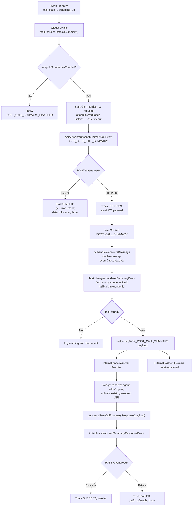
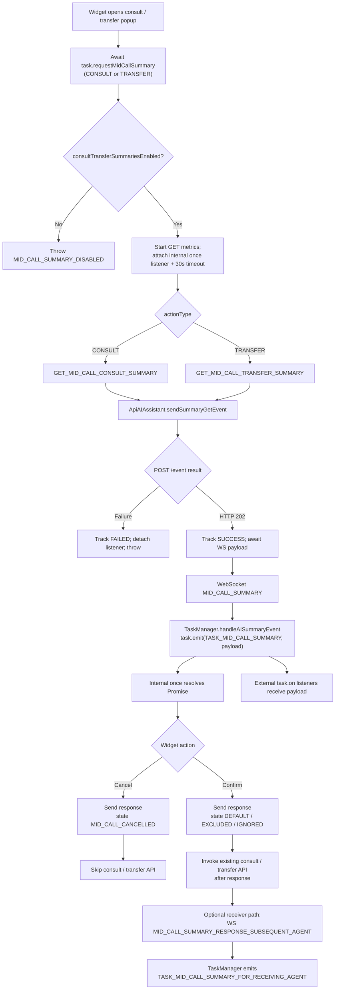
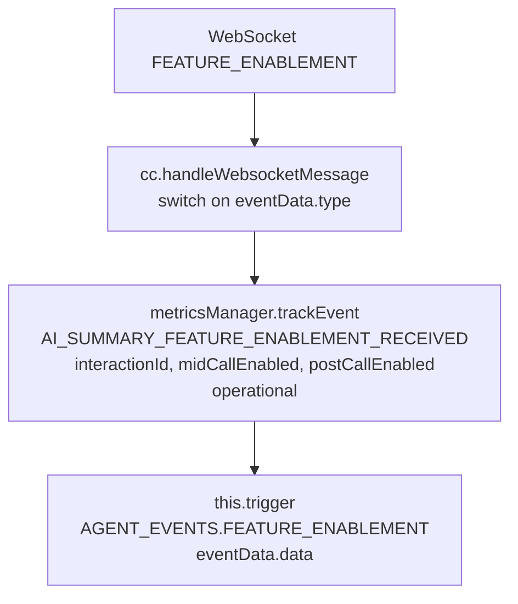

# Spec: AI Post-Call & Mid-Call Summary

## 1. Overview

**Objective:** Give widget developers a deterministic, event-driven SDK surface to surface AI-generated post-call and mid-call summaries to agents, capture their feedback (view/edit/copy/thumbs/state), and submit those signals back through `api-ai-assistant` without altering the existing wrap-up / transfer / consult APIs.

**Scope:**
- In Scope:
  - New per-task public methods on `Task` for requesting post-call and mid-call summaries and for sending the corresponding response payloads.
  - Routing of incoming WebSocket events `FEATURE_ENABLEMENT`, `POST_CALL_SUMMARY`, `MID_CALL_SUMMARY`, `MID_CALL_SUMMARY_RESPONSE_SUBSEQUENT_AGENT` into the SDK event surface.
  - Extension of `AIAssistantEventName` with the four GET/RESPONSE variants the backend requires.
  - Extension of `ApiAIAssistant` to send summary GET/RESPONSE payloads with the full payload shape (`conversationId`, `clientType`, counters, feedback, state, wrapUpCode/agentName).
  - Metrics / logging additions (with PII redaction).
  - Unit tests mirroring all source paths.
- Out of Scope:
  - Widget UI (rendering, edit-flow, thumbs UI) — owned by the consuming widget package.
  - Any change to existing wrap-up, transfer, or consult APIs.
  - Real-time transcripts (already shipped in PR #4794).
  - Backend contract changes (only consumed here).

**Affected modules / files:**

- `src/cc.ts`
  - `handleWebsocketMessage`: add cases for `CC_EVENTS.FEATURE_ENABLEMENT`, `CC_EVENTS.POST_CALL_SUMMARY`, `CC_EVENTS.MID_CALL_SUMMARY`, `CC_EVENTS.MID_CALL_SUMMARY_RESPONSE_SUBSEQUENT_AGENT`. Routes `FEATURE_ENABLEMENT` to a new `cc:featureEnablement` trigger; routes the three task-correlated events into `TaskManager` via a new `handleAISummaryEvent(eventData)` method (fan-out to the right `Task`).
- `src/services/ApiAiAssistant.ts`
  - Add `sendSummaryGetEvent(agentId, interactionId, conversationId, eventName: GetSummaryEventName)` — POST /event with `eventType: 'CTI_EVENT'`, expected response is HTTP 202.
  - Add `sendSummaryResponseEvent(agentId, payload: SummaryResponsePayload)` — POST /event with the full response body (counters, feedback, state, summary, wrapUpCode/agentName).
  - Reuse existing `getBaseUrl()` and metrics/log/error scaffolding.
- `src/services/task/TaskManager.ts`
  - Add `handleAISummaryEvent(eventData: AISummaryEventEnvelope)` — looks up task by `conversationId`/`interactionId` and emits `TASK_EVENTS.TASK_POST_CALL_SUMMARY` / `TASK_EVENTS.TASK_MID_CALL_SUMMARY` / `TASK_EVENTS.TASK_MID_CALL_SUMMARY_FOR_RECEIVING_AGENT` on the correlated `Task` instance.
- `src/services/task/Task.ts`
  - Add public methods: `requestPostCallSummary()`, `sendPostCallSummaryResponse(payload)`, `requestMidCallSummary(actionType: 'CONSULT' | 'TRANSFER')`, `sendMidCallSummaryResponse(payload, actionType)`. All delegate to `apiAIAssistant`.
  - Inject `apiAIAssistant` into `Task` via the existing `TaskManager` → `Task` factory wiring (already passes services down).
- `src/services/task/types.ts`
  - Add `TASK_EVENTS.TASK_POST_CALL_SUMMARY = 'task:postCallSummary'`, `TASK_MID_CALL_SUMMARY = 'task:midCallSummary'`, `TASK_MID_CALL_SUMMARY_FOR_RECEIVING_AGENT = 'task:midCallSummaryForReceivingAgent'`.
  - Add types: `PostCallSummaryEventPayload`, `MidCallSummaryEventPayload`, `MidCallSummaryReceivingAgentPayload`, `PostCallSummaryResponsePayload`, `MidCallSummaryResponsePayload`, `SummaryActionType`, `SummaryFeedback`, `SummaryState`.
- `src/services/agent/types.ts` or `src/services/config/types.ts`
  - Add `CC_AGENT_EVENTS.AGENT_FEATURE_ENABLEMENT = 'AgentFeatureEnablement'`-style constant and matching `AGENT_EVENTS.FEATURE_ENABLEMENT = 'cc:featureEnablement'` (place in agent events because it is agent-scope, not task-scope).
- `src/services/config/types.ts`
  - Add new entries to `CC_EVENTS` (or to a new `CC_AI_SUMMARY_EVENTS` object that is spread into `CC_EVENTS`):
    - `FEATURE_ENABLEMENT: 'FEATURE_ENABLEMENT'`
    - `POST_CALL_SUMMARY: 'POST_CALL_SUMMARY'`
    - `MID_CALL_SUMMARY: 'MID_CALL_SUMMARY'`
    - `MID_CALL_SUMMARY_RESPONSE_SUBSEQUENT_AGENT: 'MID_CALL_SUMMARY_RESPONSE_SUBSEQUENT_AGENT'`
- `src/types.ts`
  - Extend `AIAssistantEventName` with: `GET_MID_CALL_TRANSFER_SUMMARY`, `GET_MID_CALL_CONSULT_SUMMARY`, `MID_CALL_TRANSFER_SUMMARY_RESPONSE`, `MID_CALL_CONSULT_SUMMARY_RESPONSE` (additive — existing entries unchanged).
  - Re-export the new payload types from `services/task/types.ts`.
- `src/constants.ts`
  - Add `METHODS.REQUEST_POST_CALL_SUMMARY`, `SEND_POST_CALL_SUMMARY_RESPONSE`, `REQUEST_MID_CALL_SUMMARY`, `SEND_MID_CALL_SUMMARY_RESPONSE`, `HANDLE_AI_SUMMARY_EVENT`.
- `src/metrics/constants.ts`
  - Add `AI_SUMMARY_GET_POST_CALL_*`, `AI_SUMMARY_GET_MID_CALL_*`, `AI_SUMMARY_POST_CALL_RESPONSE_*`, `AI_SUMMARY_MID_CALL_RESPONSE_*`, `AI_SUMMARY_FEATURE_ENABLEMENT_RECEIVED` (single, no failed pair — receive-only).
- `test/unit/spec/cc.ts` — extend with summary websocket-route tests.
- `test/unit/spec/services/ApiAiAssistant.ts` — add `sendSummaryGetEvent` and `sendSummaryResponseEvent` cases.
- `test/unit/spec/services/task/TaskManager.ts` — add `handleAISummaryEvent` correlation tests.
- `test/unit/spec/services/task/Task.ts` — add public-method tests for the four summary methods.

**Integration Points:**
- Webex HTTP (`webex.request`) for POST /event over `api-ai-assistant.<env>.ciscoccservice.com` (existing transport).
- `webSocketManager` 'message' channel handled in `cc.ts:handleWebsocketMessage` (existing).
- `agentConfig.aiFeature` (already loaded by `config` service) to gate API calls.
- `TaskManager`/`Task` to fan out summary events on the right per-interaction object.
- `MetricsManager` for behavioral + operational telemetry; `LoggerProxy` for structured logging.

## 2. Public API (Contracts Provided)

### 3.1 Public Methods

#### 3.1.1 `task.requestPostCallSummary(): Promise<PostCallSummaryEventPayload>`

```typescript
/**
 * Requests the AI-generated post-call summary for this task.
 *
 * @description
 * Sends `GET_POST_CALL_SUMMARY` to api-ai-assistant, then awaits the
 * corresponding `POST_CALL_SUMMARY` payload over the WebSocket. The returned
 * Promise resolves with the inbound summary payload so the caller can use it
 * directly (`const summary = await task.requestPostCallSummary()`).
 *
 * The `task:postCallSummary` event ALSO fires for every payload received,
 * regardless of whether `requestPostCallSummary` is awaiting it. This keeps
 * other listeners (multi-session widgets, analytics, secondary UI panels)
 * working — promise-style and event-style consumers coexist.
 *
 * @returns {Promise<PostCallSummaryEventPayload>} Resolves with the inbound
 *   summary payload (after double-envelope unwrap) once the matching
 *   `POST_CALL_SUMMARY` arrives. Rejects on HTTP failure, disabled flag, or
 *   if no payload arrives within `AI_SUMMARY_REQUEST_TIMEOUT_MS` (default 30s).
 * @throws {Error} If `aiFeature.generatedSummaries.wrapUpSummariesEnabled` is
 *   false (`POST_CALL_SUMMARY_DISABLED`), or the api-ai-assistant base URL
 *   cannot be resolved, or the GET request fails, or the WS payload never
 *   arrives within the timeout (`POST_CALL_SUMMARY_TIMEOUT`).
 *
 * @fires task:postCallSummary When the summary payload arrives over WebSocket
 *   (always fires, even when a Promise consumer is awaiting).
 *
 * @public
 *
 * @example Promise-style (single-session caller)
 * ```typescript
 * const summary = await task.requestPostCallSummary();
 * render(summary.adaptiveCard);
 * ```
 *
 * @example Event-style (multi-session / passive listener)
 * ```typescript
 * task.on(TASK_EVENTS.TASK_POST_CALL_SUMMARY, (payload) => {
 *   render(payload.adaptiveCard);
 * });
 * await task.requestPostCallSummary(); // also returns the payload
 * ```
 */
public async requestPostCallSummary(): Promise<PostCallSummaryEventPayload>;
```

- Owner: `Task` (per-interaction).
- Validation: `aiFeature.generatedSummaries.wrapUpSummariesEnabled === true`. If false, throw `Error('POST_CALL_SUMMARY_DISABLED')` augmented via `getErrorDetails`.
- Response channel: HTTP 202 acks the GET; the Promise then awaits the matching `POST_CALL_SUMMARY` WS payload and resolves with it.
- **Multi-session rule:** the `task:postCallSummary` event MUST fire on every received payload regardless of whether a Promise is currently awaiting. The Promise is fulfilled by subscribing internally with `once` so external listeners are unaffected.
- **Timeout:** if no WS payload arrives within `AI_SUMMARY_REQUEST_TIMEOUT_MS` (default 30,000 ms), the Promise rejects with `POST_CALL_SUMMARY_TIMEOUT` and the internal `once` listener is removed; subsequent late arrivals still fire the event for other listeners.
- Idempotency: backend-controlled; the SDK sends the request as-is. Repeated calls are allowed — each call gets its own pending Promise tied to the next inbound payload. Agent-desktop fires a fresh `GET_MID_CALL_CONSULT_SUMMARY` every time the consult dialog re-opens on the same `conversationId`, and counter state (`numberOfTimesViewed`) is reset per-dialog-open (not cumulative across the call).

#### 3.1.2 `task.sendPostCallSummaryResponse(payload: PostCallSummaryResponsePayload): Promise<void>`

```typescript
/**
 * Sends the agent's response after the post-call summary has been displayed.
 * Must be called AFTER the existing wrap-up API has been submitted.
 *
 * @param {PostCallSummaryResponsePayload} payload - Response counters, state,
 *   feedback, edited summary, and wrap-up code.
 * @returns {Promise<void>}
 * @throws {Error} If the request fails.
 *
 * @public
 */
public async sendPostCallSummaryResponse(
  payload: PostCallSummaryResponsePayload
): Promise<void>;
```

#### 3.1.3 `task.requestMidCallSummary(actionType: SummaryActionType): Promise<MidCallSummaryEventPayload>`

```typescript
/**
 * Requests the AI-generated mid-call summary for transfer or consult.
 *
 * @description
 * Sends `GET_MID_CALL_CONSULT_SUMMARY` or `GET_MID_CALL_TRANSFER_SUMMARY` to
 * api-ai-assistant, then awaits the matching `MID_CALL_SUMMARY` payload over
 * the WebSocket. The returned Promise resolves with the inbound payload so
 * the caller can use it directly.
 *
 * The `task:midCallSummary` event ALSO fires for every payload received,
 * regardless of whether `requestMidCallSummary` is awaiting it. Multi-session
 * widgets, analytics, and secondary listeners continue to receive the event
 * — promise-style and event-style consumers coexist.
 *
 * @param {SummaryActionType} actionType - 'TRANSFER' or 'CONSULT'.
 * @returns {Promise<MidCallSummaryEventPayload>} Resolves with the inbound
 *   summary payload (after double-envelope unwrap) once the matching
 *   `MID_CALL_SUMMARY` arrives. Rejects on HTTP failure, disabled flag, or
 *   timeout (`MID_CALL_SUMMARY_TIMEOUT`).
 * @throws {Error} If `aiFeature.generatedSummaries.consultTransferSummariesEnabled`
 *   is false (`MID_CALL_SUMMARY_DISABLED`), the GET request fails, or no WS
 *   payload arrives within `AI_SUMMARY_REQUEST_TIMEOUT_MS`.
 *
 * @fires task:midCallSummary When the summary payload arrives over WebSocket
 *   (always fires, even when a Promise consumer is awaiting).
 *
 * @public
 *
 * @example Promise-style
 * ```typescript
 * const summary = await task.requestMidCallSummary('CONSULT');
 * render(summary.adaptiveCard);
 * ```
 *
 * @example Event-style (multi-session)
 * ```typescript
 * task.on(TASK_EVENTS.TASK_MID_CALL_SUMMARY, (payload) => render(payload.adaptiveCard));
 * await task.requestMidCallSummary('CONSULT');
 * ```
 */
public async requestMidCallSummary(
  actionType: SummaryActionType
): Promise<MidCallSummaryEventPayload>;
```

- Maps `actionType` to the AI Assistant event name:
  - `'TRANSFER'` → `AIAssistantEventName.GET_MID_CALL_TRANSFER_SUMMARY`
  - `'CONSULT'` → `AIAssistantEventName.GET_MID_CALL_CONSULT_SUMMARY`
- **Multi-session rule:** the `task:midCallSummary` event MUST fire on every received payload regardless of whether a Promise is currently awaiting. The Promise is fulfilled by an internal `once` listener so external listeners are unaffected.
- **Timeout:** if no WS payload arrives within `AI_SUMMARY_REQUEST_TIMEOUT_MS` (default 30,000 ms), the Promise rejects with `MID_CALL_SUMMARY_TIMEOUT` and the internal `once` listener is detached; late arrivals still fire the public event for other listeners.

#### 3.1.4 `task.sendMidCallSummaryResponse(payload: MidCallSummaryResponsePayload, actionType: SummaryActionType): Promise<void>`

```typescript
/**
 * Sends the agent's response for a mid-call (transfer or consult) summary.
 * Must be called BEFORE invoking the existing transfer/consult API.
 *
 * @param {MidCallSummaryResponsePayload} payload
 * @param {SummaryActionType} actionType
 * @returns {Promise<void>}
 *
 * @public
 */
public async sendMidCallSummaryResponse(
  payload: MidCallSummaryResponsePayload,
  actionType: SummaryActionType
): Promise<void>;
```

- Maps `actionType` to the response event name:
  - `'TRANSFER'` → `AIAssistantEventName.MID_CALL_TRANSFER_SUMMARY_RESPONSE`
  - `'CONSULT'` → `AIAssistantEventName.MID_CALL_CONSULT_SUMMARY_RESPONSE`
- For Cancel, set `payload.state = 'MID_CALL_CANCELLED'` and skip downstream consult/transfer API.

#### 3.1.5 No new method on `cc` — `cc:featureEnablement` is emitted purely from the websocket handler.

### 3.2 Public Types and Constants

All new types are defined in `src/services/task/types.ts` (internal scope) and re-exported from `src/types.ts` (public scope).

```typescript
// src/services/task/types.ts

/** Mid-call summary action type. @public */
export type SummaryActionType = 'CONSULT' | 'TRANSFER';

/** Agent feedback signal. @public */
export type SummaryFeedback = 'thumbs_up' | 'thumbs_down' | 'none';

/**
 * Summary state machine values.
 * - DEFAULT: agent submitted the summary (post-call default behavior)
 * - NOT_RECEIVED: backend never delivered POST_CALL_SUMMARY
 * - IGNORED: agent dismissed without submitting
 * - EXCLUDED: mid-call only — agent excluded the summary from handoff
 * - MID_CALL_CANCELLED: mid-call only — agent cancelled the consult/transfer popup
 * @public
 */
export type SummaryState =
  | 'DEFAULT'
  | 'NOT_RECEIVED'
  | 'IGNORED'
  | 'EXCLUDED'
  | 'MID_CALL_CANCELLED';

/**
 * Edited summary on outgoing *_RESPONSE events. Always an object with the same keys
 * as the inbound `sections` payload. Empty `{}` when no edits. NEVER plain text on the wire.
 *
 * - For MID_CALL_*_SUMMARY_RESPONSE: keys are `MidCallSummarySections`.
 * - For POST_CALL_SUMMARY_RESPONSE:    keys are `PostCallSummarySections`.
 *
 * Sample app/widget MUST map the agent's edits back into the typed sections object.
 * @public
 */
export type SummaryBody = Partial<PostCallSummarySections & MidCallSummarySections>;

/**
 * Incoming FEATURE_ENABLEMENT payload (inner `data.data`).
 *
 * Cross-ref: `@wxcc-desktop/sdk-types/agentx-services/.../ai-assistant-service-types.d.ts`
 * `AIAssistantTypes.FeatureEnablementEvent.data` uses the SAME inner shape and uses
 * `actionTimestamp` (not `timestamp`) — match that on the wire.
 *
 * @public
 */
export type FeatureEnablementPayload = {
  interactionId: string;
  midCallEnabled: boolean;
  postCallEnabled: boolean;
  /** Wire field name is `actionTimestamp` (per agent-desktop sdk-types). */
  actionTimestamp: number;
};

/** Sections object on a POST_CALL_SUMMARY event. @public */
export type PostCallSummarySections = {
  initialContactReason?: string;
  additionalContactReasons?: string;
  additionalContext?: string;
  keyActionsTaken?: string;
  nextSteps?: string;
};

/** Sections object on a MID_CALL_SUMMARY event (consult/transfer). @public */
export type MidCallSummarySections = {
  reasonForTransferOrConsult?: string;
  additionalContext?: string;
  keyActionsTaken?: string;
};

/**
 * Incoming POST_CALL_SUMMARY payload (inner `data.data`, after double-envelope unwrap).
 *
 * Cross-ref: `@wxcc-desktop/sdk-types/.../ai-assistant-service-types.d.ts`
 * `AIAssistantTypes.PostCallSummaryEvent.data` is the source of truth for the wire shape.
 * Required-by-agent-desktop fields: `adaptiveCard`, `adaptiveCardId`, `conversationId`,
 * `languageCode`, `resolution`, `summaryText`, `timestamp`, `areTranscriptsAvailable`.
 * The SDK additionally surfaces `editAdaptiveCard*`, typed `sections`, and wrap-up code
 * suggestions when present.
 *
 * @public
 */
export type PostCallSummaryEventPayload = {
  conversationId: string;
  /** Adaptive-card JSON for read-only display. Forwarded verbatim; do not log body. */
  adaptiveCard: Record<string, unknown>;
  adaptiveCardId: string;
  /** Adaptive-card JSON for the edit form. Forwarded verbatim; do not log body. */
  editAdaptiveCard?: Record<string, unknown>;
  editAdaptiveCardId?: string;
  languageCode: string;
  /**
   * Plain-text rendering of the summary used by agent-desktop for accessibility / fallback.
   * Equivalent to `Object.values(sections).join('\n\n')` when `sections` is present.
   * NEVER log this value (treat as `summary` body for redaction purposes).
   */
  summaryText: string;
  /** Backend-classified resolution label (e.g. "RESOLVED", "ESCALATED"). */
  resolution?: string;
  /** True when full call transcripts are available for this conversation. */
  areTranscriptsAvailable: boolean;
  /** Typed sections — added by the SDK on top of the agent-desktop wire shape when the backend supplies them. */
  sections?: PostCallSummarySections;
  /** Optional suggested wrap-up codes for the dropdown. */
  suggestedWrapUpCodes?: string[];
  suggestedWrapUpCodesMessage?: string;
  timestamp: number;
};

/**
 * Incoming MID_CALL_SUMMARY payload (inner `data.data`, after double-envelope unwrap).
 *
 * Cross-ref: `@wxcc-desktop/sdk-types/.../ai-assistant-service-types.d.ts`
 * `AIAssistantTypes.MidCallSummaryEvent.data` mirrors the post-call shape minus
 * `suggestedWrapUpCodes*`. The SDK adds typed `sections` when present.
 *
 * @public
 */
export type MidCallSummaryEventPayload = {
  conversationId: string;
  adaptiveCard: Record<string, unknown>;
  adaptiveCardId: string;
  editAdaptiveCard?: Record<string, unknown>;
  editAdaptiveCardId?: string;
  languageCode: string;
  /** Plain-text rendering — NEVER log; redact like `summary`. */
  summaryText: string;
  resolution?: string;
  areTranscriptsAvailable: boolean;
  sections?: MidCallSummarySections;
  timestamp: number;
};

/**
 * Incoming MID_CALL_SUMMARY_RESPONSE_SUBSEQUENT_AGENT payload (inner `data.data`).
 *
 * Cross-ref: `@wxcc-desktop/sdk-types/.../ai-assistant-service-types.d.ts`
 * `AIAssistantTypes.MidCallSummaryResponseSubsequentAgent.data` declares the base
 * fields. The wire payload ALSO carries a `sections` object (3 keys) — the SDK
 * surfaces it because agent-desktop sdk-types are stale on this field.
 *
 * Includes the adaptive-card pair so receiving agents can render the originator's
 * edited summary natively. `summaryText` is a short fallback line (~45 chars,
 * e.g. "View to get more context on the conversation.") — NOT the full body.
 *
 * @public
 */
export type MidCallSummaryReceivingAgentPayload = {
  conversationId: string;
  /** Full ready-to-render Adaptive Card v1.6. Forwarded verbatim; do not log body. */
  adaptiveCard: Record<string, unknown>;
  adaptiveCardId: string;
  languageCode: string;
  resolution?: string;
  /** Short fallback line — NEVER log; redact like `summary`. */
  summaryText: string;
  /** Structured backup of the card body — NOT in agent-desktop sdk-types but present on the wire. NEVER log values. */
  sections?: MidCallSummarySections;
  timestamp: number;
};

/**
 * Outgoing POST_CALL_SUMMARY_RESPONSE payload (public SDK shape — caller-facing).
 *
 * Cross-ref: `@wxcc-desktop/sdk-types/.../ai-assistant-service-types.d.ts`
 * `AIAssistantTypes.PostCallSummaryResponseRequest` is the published wire type
 * but is **stale on multiple fields**. Wire truth (matches agent-desktop POSTs):
 *   - The wire wraps the body under `{ orgId, agentId, eventType, eventName,
 *     publishTimestamp, eventDetails: { data: <this payload> } }` —
 *     `ApiAIAssistant.sendSummaryResponseEvent` builds that envelope.
 *   - Counter fields (`numberOfTimesViewed/Edited/Copied`) are sent as
 *     **plain numbers** on the wire (`1`, not `"1"`). Agent-desktop sdk-types
 *     declare them as strings — sdk-types are stale. Do NOT stringify.
 *   - `actionTimeStamp` is a **number** on the wire (not string).
 *   - Agent-desktop sdk-types omit `state`, `wrapUpCode`, and `interactionId`
 *     in `eventDetails.data`. The SDK sends them per backend contract.
 *
 * Wire example (post-build):
 *   { conversationId, interactionId, action: "POST_CALL_SUMMARY_RESPONSE",
 *     actionTimeStamp: 1779840719369, clientType: "WxCC",
 *     summary: {initialContactReason: "ticket booking", ...},
 *     numberOfTimesViewed: 1, numberOfTimesEdited: 1, numberOfTimesCopied: 0,
 *     feedback: "none", state: "DEFAULT", wrapUpCode: "Sale" }
 *
 * @public
 */
export type PostCallSummaryResponsePayload = {
  conversationId: string;
  interactionId: string;
  summary: Partial<PostCallSummarySections>;
  numberOfTimesViewed: number;
  numberOfTimesEdited: number;
  numberOfTimesCopied: number;
  feedback: SummaryFeedback;
  state: SummaryState;
  /** Required (non-null string) on post-call responses; OMITTED entirely on mid-call responses. */
  wrapUpCode: string;
};

/**
 * Outgoing MID_CALL_*_SUMMARY_RESPONSE payload (public SDK shape — caller-facing).
 *
 * Wire shape (initiator):
 *   { conversationId, interactionId, action: "MID_CALL_CONSULT_SUMMARY_RESPONSE",
 *     actionTimeStamp: 1779840719369, clientType: "WxCC",
 *     summary: {reasonForTransferOrConsult: "...", ...},
 *     numberOfTimesViewed: 1, numberOfTimesEdited: 0, numberOfTimesCopied: 0,
 *     feedback: "none", state: "MID_CALL_CANCELLED", agentName: "User4 Agent4" }
 *
 * Notes:
 *   - `wrapUpCode` is **OMITTED** from `eventDetails.data` on mid-call responses
 *     (NOT sent as `null` — sdk-types are wrong on this).
 *   - Counters are **plain numbers** on the wire (not strings).
 *   - `summary` is `{}` on cancel-without-edits.
 *   - `agentName` is always present (sender's display name) — NEVER log.
 * @public
 */
export type MidCallSummaryResponsePayload = {
  conversationId: string;
  interactionId: string;
  summary: Partial<MidCallSummarySections>;
  numberOfTimesViewed: number;
  numberOfTimesEdited: number;
  numberOfTimesCopied: number;
  feedback: SummaryFeedback;
  state: SummaryState;
  /** Sender's display name. Required on the wire. NEVER log per §8.1. */
  agentName: string;
  /** OMITTED entirely on the wire. Field intentionally absent on this type. */
};
```

```typescript
// src/services/task/types.ts (TASK_EVENTS additions — additive, do not reorder)
export enum TASK_EVENTS {
  // ... existing entries unchanged ...
  TASK_POST_CALL_SUMMARY = 'task:postCallSummary',
  TASK_MID_CALL_SUMMARY = 'task:midCallSummary',
  TASK_MID_CALL_SUMMARY_FOR_RECEIVING_AGENT = 'task:midCallSummaryForReceivingAgent',
}
```

```typescript
// src/services/agent/types.ts (AGENT_EVENTS additions)
export enum AGENT_EVENTS {
  // ... existing entries unchanged ...
  FEATURE_ENABLEMENT = 'cc:featureEnablement',
}
```

```typescript
// src/services/config/types.ts (CC_EVENTS additions — split into a new namespace and spread)
export const CC_AI_SUMMARY_EVENTS = {
  FEATURE_ENABLEMENT: 'FEATURE_ENABLEMENT',
  POST_CALL_SUMMARY: 'POST_CALL_SUMMARY',
  MID_CALL_SUMMARY: 'MID_CALL_SUMMARY',
  MID_CALL_SUMMARY_RESPONSE_SUBSEQUENT_AGENT: 'MID_CALL_SUMMARY_RESPONSE_SUBSEQUENT_AGENT',
} as const;

export const CC_EVENTS = {
  ...CC_AGENT_EVENTS,
  ...CC_TASK_EVENTS,
  ...CC_AI_SUMMARY_EVENTS,
} as const;
```

```typescript
// src/types.ts — extend AIAssistantEventName (additive, do not reorder)
export const AIAssistantEventName = {
  GET_TRANSCRIPTS: 'GET_TRANSCRIPTS',
  GET_MID_CALL_SUMMARY: 'GET_MID_CALL_SUMMARY',
  GET_POST_CALL_SUMMARY: 'GET_POST_CALL_SUMMARY',
  MID_CALL_SUMMARY_RESPONSE: 'MID_CALL_SUMMARY_RESPONSE',
  POST_CALL_SUMMARY_RESPONSE: 'POST_CALL_SUMMARY_RESPONSE',
  SUGGESTED_RESPONSES_DIGITAL: 'SUGGESTED_RESPONSES_DIGITAL',
  // additions
  GET_MID_CALL_TRANSFER_SUMMARY: 'GET_MID_CALL_TRANSFER_SUMMARY',
  GET_MID_CALL_CONSULT_SUMMARY: 'GET_MID_CALL_CONSULT_SUMMARY',
  MID_CALL_TRANSFER_SUMMARY_RESPONSE: 'MID_CALL_TRANSFER_SUMMARY_RESPONSE',
  MID_CALL_CONSULT_SUMMARY_RESPONSE: 'MID_CALL_CONSULT_SUMMARY_RESPONSE',
} as const;
```

```typescript
// src/constants.ts (METHODS additions)
export const METHODS = {
  // ...
  REQUEST_POST_CALL_SUMMARY: 'requestPostCallSummary',
  SEND_POST_CALL_SUMMARY_RESPONSE: 'sendPostCallSummaryResponse',
  REQUEST_MID_CALL_SUMMARY: 'requestMidCallSummary',
  SEND_MID_CALL_SUMMARY_RESPONSE: 'sendMidCallSummaryResponse',
  HANDLE_AI_SUMMARY_EVENT: 'handleAISummaryEvent',
} as const;
```

```typescript
// src/metrics/constants.ts (METRIC_EVENT_NAMES additions)
AI_SUMMARY_GET_POST_CALL_SUCCESS: 'AI Summary Get Post Call Success',
AI_SUMMARY_GET_POST_CALL_FAILED: 'AI Summary Get Post Call Failed',
AI_SUMMARY_GET_MID_CALL_SUCCESS: 'AI Summary Get Mid Call Success',
AI_SUMMARY_GET_MID_CALL_FAILED: 'AI Summary Get Mid Call Failed',
AI_SUMMARY_POST_CALL_RESPONSE_SUCCESS: 'AI Summary Post Call Response Success',
AI_SUMMARY_POST_CALL_RESPONSE_FAILED: 'AI Summary Post Call Response Failed',
AI_SUMMARY_MID_CALL_RESPONSE_SUCCESS: 'AI Summary Mid Call Response Success',
AI_SUMMARY_MID_CALL_RESPONSE_FAILED: 'AI Summary Mid Call Response Failed',
AI_SUMMARY_FEATURE_ENABLEMENT_RECEIVED: 'AI Summary Feature Enablement Received',
```

### 3.3 Events

| Event constant | External name | Direction | Owner object | Emit method | Payload type | Trigger | Listener cleanup |
|---|---|---|---|---|---|---|---|
| `CC_EVENTS.FEATURE_ENABLEMENT` | n/a | WS → `cc.handleWebsocketMessage` | n/a | n/a | `FeatureEnablementPayload` | Backend `FEATURE_ENABLEMENT` | n/a |
| `CC_EVENTS.POST_CALL_SUMMARY` | n/a | WS → `cc.handleWebsocketMessage` → `TaskManager.handleAISummaryEvent` | n/a | n/a | `PostCallSummaryEventPayload` | Backend `POST_CALL_SUMMARY` | n/a |
| `CC_EVENTS.MID_CALL_SUMMARY` | n/a | WS → `cc.handleWebsocketMessage` → `TaskManager.handleAISummaryEvent` | n/a | n/a | `MidCallSummaryEventPayload` | Backend `MID_CALL_SUMMARY` | n/a |
| `CC_EVENTS.MID_CALL_SUMMARY_RESPONSE_SUBSEQUENT_AGENT` | n/a | WS → `cc.handleWebsocketMessage` → `TaskManager.handleAISummaryEvent` | n/a | n/a | `MidCallSummaryReceivingAgentPayload` | Backend `MID_CALL_SUMMARY_RESPONSE_SUBSEQUENT_AGENT` | n/a |
| `AGENT_EVENTS.FEATURE_ENABLEMENT` | `cc:featureEnablement` | SDK → consumer | `cc` | `trigger` (with `// @ts-ignore`) | `FeatureEnablementPayload` | switch case in `handleWebsocketMessage` | `cc.deregister` removes WS listener |
| `TASK_EVENTS.TASK_POST_CALL_SUMMARY` | `task:postCallSummary` | SDK → consumer | `Task` instance | `emit` | `PostCallSummaryEventPayload` | `TaskManager.handleAISummaryEvent` after task lookup | `TaskManager.removeTaskFromCollection` (existing path) |
| `TASK_EVENTS.TASK_MID_CALL_SUMMARY` | `task:midCallSummary` | SDK → consumer | `Task` instance | `emit` | `MidCallSummaryEventPayload` | `TaskManager.handleAISummaryEvent` | `TaskManager.removeTaskFromCollection` |
| `TASK_EVENTS.TASK_MID_CALL_SUMMARY_FOR_RECEIVING_AGENT` | `task:midCallSummaryForReceivingAgent` | SDK → consumer | `Task` instance | `emit` | `MidCallSummaryReceivingAgentPayload` | `TaskManager.handleAISummaryEvent` | `TaskManager.removeTaskFromCollection` |

Notes:
- `cc.ts` requires `// @ts-ignore` on `trigger` calls per existing pattern (`patterns/event-driven-patterns.md`).
- ALL four summary/enablement events use the **same** outer top-level `type` discriminator (`FEATURE_ENABLEMENT`, `POST_CALL_SUMMARY`, `MID_CALL_SUMMARY`, `MID_CALL_SUMMARY_RESPONSE_SUBSEQUENT_AGENT`). All four cases therefore land in the **first** switch (`switch (eventData.type)`) of `handleWebsocketMessage`. The previously documented "second switch" plumbing is not used for these events.
- These events arrive on the dedicated realtime WSS channel (`/v1/realtime/subscription/Desktop-<uuid>`) — not the regular notification subscription. Wiring this socket into `webSocketManager` is a prerequisite for routing; see Open Question added to §1.

## 2. Dependencies (Contracts Required)

| Dependency | How used | Failure mode |
|---|---|---|
| `Services` singleton | Already initialized in `cc.ts` | n/a — no new wiring |
| `webex.request` (Webex HTTP) | `ApiAIAssistant.sendSummaryGetEvent` / `sendSummaryResponseEvent` | Reject → `getErrorDetails` → `throw` |
| `webex.internal.services.get(WCC_API_GATEWAY)` | `getBaseUrl` (existing) | Throws `AI_ASSISTANT_BASE_URL_NOT_AVAILABLE` |
| `webex.credentials.getOrgId()` | Included in POST body | n/a |
| `webSocketManager` 'message' | Inbound summary events routed in `cc.handleWebsocketMessage` | Existing handler; no new subscribe needed |
| `TaskManager.taskCollection` | Lookup by `conversationId` (or `interactionId`) for fan-out | If task missing: log warn at `info` level, drop event silently — do not throw |
| `agentConfig.aiFeature.generatedSummaries.wrapUpSummariesEnabled` | Pre-flight check in `requestPostCallSummary` | If false: throw `POST_CALL_SUMMARY_DISABLED` |
| `agentConfig.aiFeature.generatedSummaries.consultTransferSummariesEnabled` | Pre-flight check in `requestMidCallSummary` | If false: throw `MID_CALL_SUMMARY_DISABLED` |
| `MetricsManager` | `timeEvent` + `trackEvent` per call | n/a |
| `LoggerProxy` | Structured logs | n/a |
| `getErrorDetails` | Error augmentation | n/a |

No new backend endpoint is needed — all calls go to the existing `POST /event` on api-ai-assistant.

## 2. Implementation Plan

### 5.1 Step-by-step flow

#### A. Post-call summary flow (per-task)



#### B. Mid-call (consult/transfer) summary flow (per-task)



#### C. FEATURE_ENABLEMENT routing



### 5.2 Concurrency & sequencing

- Per-task state. Each `Task` is independent. Repeated GET requests on the same task are allowed — backend deduplication is out of scope.
- **Sequencing rule (post-call)**: existing wrap-up API MUST run before `sendPostCallSummaryResponse`. The SDK does not enforce this; widgets must follow the documented order. Logged ordering violations are detectable via `interactionId` correlation in MetricsManager.
- **Sequencing rule (mid-call)**: `sendMidCallSummaryResponse` MUST be invoked before the existing transfer/consult API. Widgets enforce; SDK does not block.
- **Cancel branch**: `state: 'MID_CALL_CANCELLED'` short-circuits the downstream consult/transfer API on the widget side. The SDK still sends the response event so backend telemetry is consistent.
- No reactive backpressure; all flows are request/response over Promises.
- Task cleanup (`removeTaskFromCollection`) MUST happen AFTER any pending summary events for that task are processed. Existing wrap-up state-machine flow already handles this — no SDK change needed.

### 5.3 Backward compatibility

- All changes are additive (new methods on `Task`, new event constants, new types, new metric names, new optional `aiFeature.generatedSummaries.*` reads).
- No existing public API is modified.
- No existing event payload changes.
- `AIAssistantEventName` extension is purely additive — existing values unchanged.
- `TASK_EVENTS` and `AGENT_EVENTS` enum extensions are appended; no values reordered.
- Breaking changes: **No**.

## 2. Data

### 6.1 Type Definitions

See §3.2 for full TypeScript definitions and JSDoc requirements.

### 6.2 Request / Response Schemas

#### POST `/event` — GET_POST_CALL_SUMMARY (request)

Host: `api-ai-assistant.<env>.ciscoccservice.com` (resolved via existing `AI_ASSISTANT_BASE_URL_TEMPLATE` + `AI_ASSISTANT_ENV_MAP`).

```json
{
  "agentId": "<uuid>",
  "orgId": "<uuid>",
  "eventType": "CTI_EVENT",
  "eventName": "GET_POST_CALL_SUMMARY",
  "publishTimestamp": 1765903611994,
  "eventDetails": {
    "data": {
      "interactionId": "<uuid>",
      "conversationId": "<uuid>",
      "clientType": "WxCC",
      "actionTimeStamp": 1765903611994
    }
  }
}
```

`actionTimeStamp` is a **number** on the wire (agent-desktop sends it as `number`,
not string). The SDK MUST send it as a number to match.

Expected response: HTTP 202 Accepted (no body required by the SDK).

#### POST `/event` — POST_CALL_SUMMARY_RESPONSE (request)

```json
{
  "orgId": "<uuid>",
  "agentId": "<uuid>",
  "eventType": "CTI_EVENT",
  "eventName": "POST_CALL_SUMMARY_RESPONSE",
  "publishTimestamp": 1779840519728,
  "eventDetails": {
    "data": {
      "conversationId": "<uuid>",
      "interactionId": "<uuid>",
      "clientType": "WxCC",
      "action": "POST_CALL_SUMMARY_RESPONSE",
      "actionTimeStamp": 1779840519728,
      "summary": {
        "additionalContactReasons": "...",
        "additionalContext": "...",
        "initialContactReason": "ticket booking",
        "nextSteps": "..."
      },
      "numberOfTimesViewed": 1,
      "numberOfTimesEdited": 1,
      "numberOfTimesCopied": 0,
      "feedback": "none",
      "state": "DEFAULT",
      "wrapUpCode": "Sale"
    }
  }
}
```

Notes:
- `summary` is always an OBJECT keyed by `PostCallSummarySections` field names. Empty `{}` when no edits.
- **Counter fields** (`numberOfTimesViewed/Edited/Copied`) are sent as **plain numbers** on the wire — `1`, not `"1"`. Agent-desktop sends them as numbers; `AIAssistantTypes.PostCallSummaryResponseRequest` in `@wxcc-desktop/sdk-types` declares them as strings and is **stale**. Do NOT stringify.
- `actionTimeStamp` is a **number** on the wire (not string).
- `wrapUpCode` is a non-null string when post-call is submitted with a wrap-up reason chosen.
- `feedback` allowed values: `'none' | 'thumbs_up' | 'thumbs_down'`.
- Agent-desktop's `PostCallSummaryResponseRequest` does NOT include `state`, `wrapUpCode`, or `interactionId` in its published wire type — those are required by the `api-ai-assistant` backend contract and the SDK sends them. Treat agent-desktop sdk-types as stale on these fields; defer to this spec.

#### POST `/event` — GET_MID_CALL_TRANSFER_SUMMARY / GET_MID_CALL_CONSULT_SUMMARY (request)

Same shape as `GET_POST_CALL_SUMMARY` with the `eventName` swapped.

#### POST `/event` — MID_CALL_TRANSFER_SUMMARY_RESPONSE / MID_CALL_CONSULT_SUMMARY_RESPONSE (request)

```json
{
  "orgId": "<uuid>",
  "agentId": "<uuid>",
  "eventType": "CTI_EVENT",
  "eventName": "MID_CALL_CONSULT_SUMMARY_RESPONSE",
  "publishTimestamp": 1779839984867,
  "eventDetails": {
    "data": {
      "conversationId": "<uuid>",
      "interactionId": "<uuid>",
      "clientType": "WxCC",
      "action": "MID_CALL_CONSULT_SUMMARY_RESPONSE",
      "actionTimeStamp": 1779839984867,
      "summary": {
        "reasonForTransferOrConsult": "...",
        "additionalContext": "...",
        "keyActionsTaken": "..."
      },
      "numberOfTimesViewed": 1,
      "numberOfTimesEdited": 1,
      "numberOfTimesCopied": 0,
      "feedback": "none",
      "state": "DEFAULT",
      "agentName": "User4 Agent4"
    }
  }
}
```

Notes:
- `summary` always object keyed by `MidCallSummarySections`. Empty `{}` on cancel-without-edits (`"summary":{}` is the cancel-no-edits wire shape).
- `agentName` always present (sender's display name) — NEVER log per §8.1.
- `wrapUpCode` is **OMITTED** entirely on mid-call responses (NOT sent as `null`). Agent-desktop POSTs do NOT contain a `wrapUpCode` key in `eventDetails.data` on `MID_CALL_*_SUMMARY_RESPONSE`. Correct behavior is to omit the field, not send `null`.
- Counter fields are **plain numbers** on the wire. Do NOT stringify.
- `actionTimeStamp` is a **number** on the wire.
- `state` allowed values: `'DEFAULT' | 'NOT_RECEIVED' | 'EXCLUDED' | 'IGNORED' | 'MID_CALL_CANCELLED'`.
- `numberOfTimesViewed` increments to 1 the moment the dialog opens — even if cancelled before the summary text arrives. Wire shape is `numberOfTimesViewed: 1` even on `state: MID_CALL_CANCELLED` with `summary: {}`.
- Agent-desktop sdk-types do not publish a dedicated mid-call response type; this shape is derived from agent-desktop's actual POST body and matches the `api-ai-assistant` backend contract.

#### Inbound WebSocket schemas

All summary / enablement events arrive on the **realtime** subscription channel (`wss://api.<region>.cisco.com/v1/realtime/subscription/Desktop-<uuid>`, opened by PR #4794 and routed through `webSocketManager`) wrapped in a **double envelope** — outer `{type, trackingId, orgId, data: {…}}` and inner `data.data` carrying the actual payload. The SDK MUST unwrap two levels before emitting to consumers.

`POST_CALL_SUMMARY`:

```json
{
  "type": "POST_CALL_SUMMARY",
  "trackingId": "notifs-data_<uuid>",
  "orgId": "<uuid>",
  "data": {
    "agentId": "<uuid>",
    "orgId": "<uuid>",
    "notifType": "POST_CALL_SUMMARY",
    "notifDetails": { "actionEvent": "POST_CALL_SUMMARY" },
    "data": {
      "conversationId": "<uuid>",
      "adaptiveCard": { "type": "AdaptiveCard", "version": "1.6", "body": [] },
      "adaptiveCardId": "<uuid>",
      "editAdaptiveCard": { "type": "AdaptiveCard", "version": "1.6", "body": [] },
      "editAdaptiveCardId": "<uuid>",
      "languageCode": "en",
      "summaryText": "Initial reason: …\n\nNext steps: …",
      "resolution": "RESOLVED",
      "areTranscriptsAvailable": true,
      "sections": {
        "initialContactReason": "",
        "additionalContactReasons": "",
        "additionalContext": "",
        "keyActionsTaken": "",
        "nextSteps": ""
      },
      "suggestedWrapUpCodes": [],
      "suggestedWrapUpCodesMessage": "No suggestion available",
      "timestamp": 1779774748251
    }
  }
}
```

Notes:
- `summaryText`, `resolution`, and `areTranscriptsAvailable` come from `AIAssistantTypes.PostCallSummaryEvent.data` in agent-desktop sdk-types and MUST be forwarded verbatim.
- `summaryText` is the plain-text body; treat it as redaction-equivalent to `summary` (NEVER log, never include in metric tags).
- `sections` is added on top of agent-desktop's wire shape when the backend supplies typed sections — use it for editable forms.

`MID_CALL_SUMMARY`: identical envelope (`notifType: 'MID_CALL_SUMMARY'`) and identical inner-data field set as POST_CALL_SUMMARY (including `summaryText`, `resolution`, `areTranscriptsAvailable`) but lacks `suggestedWrapUpCodes` / `suggestedWrapUpCodesMessage`. `sections` keys for mid-call are `{ reasonForTransferOrConsult, additionalContext, keyActionsTaken }` — different from post-call.

`MID_CALL_SUMMARY_RESPONSE_SUBSEQUENT_AGENT`: wire shape per `AIAssistantTypes.MidCallSummaryResponseSubsequentAgent.data` — `{ conversationId, adaptiveCard, adaptiveCardId, languageCode, resolution, summaryText, timestamp }`. The receiving agent's task receives the originator's edited adaptive card so it can be rendered natively.

`FEATURE_ENABLEMENT`:

```json
{
  "type": "FEATURE_ENABLEMENT",
  "trackingId": "notifs-data_<uuid>",
  "orgId": "<uuid>",
  "data": {
    "agentId": "<uuid>",
    "orgId": "<uuid>",
    "notifType": "FEATURE_ENABLEMENT",
    "notifDetails": null,
    "data": {
      "interactionId": "<uuid>",
      "midCallEnabled": true,
      "postCallEnabled": true,
      "actionTimestamp": 1779774710120
    }
  }
}
```

(Field name is `actionTimestamp` per `AIAssistantTypes.FeatureEnablementEvent.data` in agent-desktop sdk-types — NOT `timestamp`.)

Notes:
- `FEATURE_ENABLEMENT` may fire **more than once per interaction** (typical: two within ~1s). Consumers and the SDK must be idempotent — emit each occurrence; do not deduplicate.
- `notifDetails.actionEvent` is the canonical sub-discriminator on the realtime channel and equals the outer `type` for summary events. The SDK can route on either; prefer outer `type` for consistency with §15.5.
- Adaptive-card JSON can be large (~6-10 KB per summary). Do **not** log the card body — log only `adaptiveCardId` / `editAdaptiveCardId` and the `sections` keys (not values).

### 6.3 Mapping

- WS-in payloads use a double envelope (`outer.data.data` is the inner payload). The SDK MUST unwrap two levels and forward only the inner payload to the corresponding `task:*` / `cc:featureEnablement` event. No further field transformation.
- Outer-level fields available for telemetry but NOT forwarded: `trackingId`, `orgId`, `notifType`, `notifDetails.actionEvent`, `agentId`. These are logged at info level for correlation but not exposed on the public payload.
- For sending events, `actionTimeStamp` is set to `Date.now()` (number). The existing `ApiAiAssistant.sendEvent` also sends a number — earlier note about `String(Date.now())` was incorrect.
- For sending events, counter fields (`numberOfTimesViewed/Edited/Copied`) are sent as **plain numbers**. Agent-desktop `@wxcc-desktop/sdk-types` declares them as strings but is stale; do NOT stringify.

#### 6.3.1 Cross-reference vs `@wxcc-desktop/sdk-types`

The SDK's inbound types align field-for-field with the agent-desktop sdk-types in `agentx-services/src/services/types/ai-assistant-service-types.d.ts`. Concrete mapping:

| Agent-desktop type | Spec type | Notes |
|---|---|---|
| `AIAssistantTypes.FeatureEnablementEvent.data` | `FeatureEnablementPayload` | Field is `actionTimestamp` (NOT `timestamp`). |
| `AIAssistantTypes.PostCallSummaryEvent.data` | `PostCallSummaryEventPayload` | Spec extends with `editAdaptiveCard*`, `sections`, `suggestedWrapUpCodes*` when backend supplies them. Required base fields (`adaptiveCard`, `adaptiveCardId`, `conversationId`, `languageCode`, `resolution`, `summaryText`, `timestamp`, `areTranscriptsAvailable`) match exactly. |
| `AIAssistantTypes.MidCallSummaryEvent.data` | `MidCallSummaryEventPayload` | Same base shape as post-call. Spec adds `sections` (mid-call keys) and `editAdaptiveCard*`. No `suggestedWrapUpCodes*`. |
| `AIAssistantTypes.MidCallSummaryResponseSubsequentAgent.data` | `MidCallSummaryReceivingAgentPayload` | Match exact: `{ adaptiveCard, adaptiveCardId, conversationId, languageCode, resolution, summaryText, timestamp }`. |
| `AIAssistantTypes.PostCallSummaryResponseRequest` | `PostCallSummaryResponsePayload` (public) wrapped by `ApiAIAssistant.sendSummaryResponseEvent` into wire shape | Agent-desktop wire type is **stale on multiple fields**: counters are sent as **numbers** (sdk-types says strings); `actionTimeStamp` is a **number**; `state`, `wrapUpCode`, and `interactionId` are sent (sdk-types omit them). SDK matches the actual wire, not sdk-types. |
| (no agent-desktop type) | `MidCallSummaryResponsePayload` | Wire shape: counters as numbers, `actionTimeStamp` as number, `agentName` present, `wrapUpCode` **OMITTED** entirely (NOT `null`). `summary: {}` for cancel-without-edits. |

## 2. Error Handling

### 7.1 Error Matrix

| Scenario | Source | Error class / shape | Metric | SDK behavior | Caller-visible behavior |
|---|---|---|---|---|---|
| `wrapUpSummariesEnabled === false` | local check | `Error('POST_CALL_SUMMARY_DISABLED')` augmented by `getErrorDetails` | `AI_SUMMARY_GET_POST_CALL_FAILED` | no API call | `requestPostCallSummary` rejects |
| `consultTransferSummariesEnabled === false` | local | `Error('MID_CALL_SUMMARY_DISABLED')` augmented | `AI_SUMMARY_GET_MID_CALL_FAILED` | no API call | `requestMidCallSummary` rejects |
| api-ai-assistant base URL unresolved | `getBaseUrl` (existing) | `Error('AI_ASSISTANT_BASE_URL_NOT_AVAILABLE')` augmented | `*_FAILED` | no retry | rejects |
| HTTP 4xx/5xx on POST `/event` | `webex.request` reject | augmented Error | `*_FAILED` | no retry | rejects |
| WS payload not received within `AI_SUMMARY_REQUEST_TIMEOUT_MS` after 202 | `Task.waitForSummaryEvent` timer | `Error('POST_CALL_SUMMARY_TIMEOUT' \| 'MID_CALL_SUMMARY_TIMEOUT')` augmented | `*_FAILED` | detach internal `once` listener; public event still fires if a late payload arrives | promise rejects; external `task.on(...)` subscribers unaffected |
| Inbound WS event for unknown task | `TaskManager.handleAISummaryEvent` | n/a (silent) | none | LoggerProxy.warn + drop | event not emitted |
| Malformed inbound payload | `JSON.parse` already done by `handleWebsocketMessage`; field missing | n/a | none | LoggerProxy.error + drop | event not emitted |
| Sequencing violation (response before GET) | not enforced | n/a | n/a | request still sent | backend may 4xx |

### 7.2 Resilience

- **Timeouts**: rely on default `webex.request` timeout (no explicit override).
- **Retries**: none. Summary events are advisory; retrying could double-record telemetry.
- **Fallbacks**: if FEATURE_ENABLEMENT never arrives, the static `agentConfig.aiFeature` flags still drive the public methods. No-op when both flags are false.

## 2. Observability

### 8.1 Logging

| Site | Level | Module | Method | Fields | NEVER log |
|---|---|---|---|---|---|
| `requestPostCallSummary` entry | info | `'Task'` | `METHODS.REQUEST_POST_CALL_SUMMARY` | `interactionId, conversationId` | `summaryText`, `sections` values |
| `requestMidCallSummary` entry | info | `'Task'` | `METHODS.REQUEST_MID_CALL_SUMMARY` | `interactionId, conversationId, actionType` | `summaryText`, `sections` values |
| `sendPostCallSummaryResponse` entry | info | `'Task'` | `METHODS.SEND_POST_CALL_SUMMARY_RESPONSE` | `interactionId, conversationId, counters, state, feedback, wrapUpCode` | `payload.summary` |
| `sendMidCallSummaryResponse` entry | info | `'Task'` | `METHODS.SEND_MID_CALL_SUMMARY_RESPONSE` | `interactionId, conversationId, counters, state, feedback, actionType` | `payload.summary`, `agentName` |
| Inbound summary received (`POST_CALL_SUMMARY`, `MID_CALL_SUMMARY`, `MID_CALL_SUMMARY_RESPONSE_SUBSEQUENT_AGENT`) | info | `'TaskManager'` | `METHODS.HANDLE_AI_SUMMARY_EVENT` | `eventType, conversationId, languageCode, resolution, areTranscriptsAvailable, adaptiveCardId, editAdaptiveCardId, sectionsKeys, hasSummaryText` | `summaryText`, `sections` values, `adaptiveCard` body, `editAdaptiveCard` body |
| `handleAISummaryEvent` task-not-found | warn | `'TaskManager'` | `METHODS.HANDLE_AI_SUMMARY_EVENT` | `eventType, conversationId` | — |
| Any failure | error | as above | as above | `trackingId, errorMessage` | response body |

### 8.2 Metrics

- Pair every API call with `timeEvent` + `trackEvent`.
- Tag taxonomy:
  - `'behavioral'` + `'operational'` for agent-visible actions (request/send response).
  - `'operational'` only for `AI_SUMMARY_FEATURE_ENABLEMENT_RECEIVED`.
- Use `MetricsManager.getCommonTrackingFieldForAQMResponse` is **not** applicable here (HTTP 202, not AQM); instead include `{agentId, orgId, interactionId, conversationId, eventName}` and (on failure) `{error: errorMessage}` — match the pattern in `ApiAiAssistant.sendEvent` lines 122-138.

### 8.3 Tracing / Correlation

- `interactionId` and `conversationId` are the per-task correlation keys; both must appear in every relevant log line and metric.
- `trackingId` from any HTTP response (when present) is logged but not surfaced on the public events for these flows (the WS payload itself carries timestamp + ids).

## 2. Testing

### 9.1 Test Files to Add / Update

| File | Coverage |
|---|---|
| `test/unit/spec/services/ApiAiAssistant.ts` | `sendSummaryGetEvent`, `sendSummaryResponseEvent` — success, failure, base-url-missing |
| `test/unit/spec/services/task/Task.ts` | `requestPostCallSummary`, `sendPostCallSummaryResponse`, `requestMidCallSummary`, `sendMidCallSummaryResponse` — success / failure / flag-disabled / cancel branch |
| `test/unit/spec/services/task/TaskManager.ts` | `handleAISummaryEvent` — POST_CALL_SUMMARY → emit on right task, MID_CALL_SUMMARY, MID_CALL_SUMMARY_RESPONSE_SUBSEQUENT_AGENT, unknown-task → warn + drop |
| `test/unit/spec/cc.ts` | `handleWebsocketMessage` — FEATURE_ENABLEMENT triggers `cc:featureEnablement`; the three summary types are forwarded to `TaskManager.handleAISummaryEvent` |

### 9.2 Test Strategy

For each test file, follow `patterns/testing-patterns.md`:

- `MockWebex` setup with `cc: ContactCenter`.
- Mock singletons: `Services.getInstance`, `MetricsManager.getInstance`, `TaskManager.getTaskManager`, `LoggerProxy`.
- Assertions: prefer exact `toEqual` over `expect.objectContaining`.

Concrete scenarios:

**Task.requestPostCallSummary**
- Success: stub `apiAIAssistant.sendSummaryGetEvent` to resolve; immediately after, emit `TASK_POST_CALL_SUMMARY` on the task with a fixture payload; assert `timeEvent`, `trackEvent(AI_SUMMARY_GET_POST_CALL_SUCCESS, ...)` with exact fields, and the returned promise resolves with the **exact emitted payload** (`toEqual`).
- Multi-session listener coexists: register an external `task.on(TASK_POST_CALL_SUMMARY, spy)`, run the success path → assert both the awaited promise resolves AND the external `spy` was called once with the same payload.
- Flag disabled: `aiFeature.generatedSummaries.wrapUpSummariesEnabled = false` → assert rejects with `POST_CALL_SUMMARY_DISABLED`, no API call, `trackEvent(AI_SUMMARY_GET_POST_CALL_FAILED, ...)`.
- HTTP failure: API rejects → assert `getErrorDetails` called with `(error, METHODS.REQUEST_POST_CALL_SUMMARY, 'Task')`, rejects, internal listener was detached (re-emit `TASK_POST_CALL_SUMMARY` afterwards → no late resolution).
- Timeout: stub `sendSummaryGetEvent` to resolve, never emit the WS event, advance fake timers past `AI_SUMMARY_REQUEST_TIMEOUT_MS` → assert rejects with `POST_CALL_SUMMARY_TIMEOUT`. Then re-emit the event AFTER the timeout → assert the external `task.on(...)` spy IS still called (event still fires) but the awaited promise stays rejected (not double-settled).

**Task.sendPostCallSummaryResponse**
- Success: assert exact body sent to `apiAIAssistant.sendSummaryResponseEvent`, including counters, feedback, state, wrapUpCode; logger NOT called with `payload.summary`.
- Failure: `getErrorDetails` called, rejects.

**Task.requestMidCallSummary** / **sendMidCallSummaryResponse**
- For each `actionType ∈ {'TRANSFER', 'CONSULT'}`, assert correct GET `eventName` chosen (`GET_MID_CALL_TRANSFER_SUMMARY` vs `GET_MID_CALL_CONSULT_SUMMARY`) and correct response `eventName` (`MID_CALL_TRANSFER_SUMMARY_RESPONSE` vs `MID_CALL_CONSULT_SUMMARY_RESPONSE`).
- Resolve-with-payload: emit `TASK_MID_CALL_SUMMARY` after the GET resolves → awaited promise resolves with the exact payload (`toEqual`).
- Multi-session: external `task.on(TASK_MID_CALL_SUMMARY, spy)` is invoked once with the same payload alongside the promise resolution.
- Timeout: never emit, advance fake timers → rejects with `MID_CALL_SUMMARY_TIMEOUT`; late emission still fires external listeners; promise stays rejected.
- Cancel branch: `state: 'MID_CALL_CANCELLED'` → `sendMidCallSummaryResponse` IS still sent.
- Flag disabled: `requestMidCallSummary` rejects with `MID_CALL_SUMMARY_DISABLED`; no API call.

**TaskManager.handleAISummaryEvent**
- Setup: pre-populate `taskCollection` with a known `Task` mock keyed by `conversationId`.
- For each of POST_CALL_SUMMARY, MID_CALL_SUMMARY, MID_CALL_SUMMARY_RESPONSE_SUBSEQUENT_AGENT: assert `task.emit(TASK_EVENTS.<X>, payload)` is called once with the verbatim WS `data`.
- Unknown task: `LoggerProxy.warn` called; `task.emit` NOT called.

**cc.handleWebsocketMessage**
- Extract handler via `mock.calls`: `mockServicesInstance.webSocketManager.on.mock.calls.find(([e]) => e === 'message')[1]`.
- Send the envelope `{type: 'FEATURE_ENABLEMENT', trackingId, orgId, data: {agentId, orgId, notifType: 'FEATURE_ENABLEMENT', notifDetails: null, data: {interactionId, midCallEnabled: true, postCallEnabled: true, timestamp}}}` → spy on `webex.cc.trigger` and assert it is called with `('cc:featureEnablement', {interactionId, midCallEnabled: true, postCallEnabled: true, timestamp})` (i.e. inner `data.data`, double-unwrapped).
- Send the same envelope twice within 1 second (backend may emit duplicates) → assert `trigger` is invoked exactly twice; SDK does not deduplicate.
- Send `{type: 'POST_CALL_SUMMARY', trackingId, orgId, data: {agentId, orgId, notifType: 'POST_CALL_SUMMARY', notifDetails: {actionEvent: 'POST_CALL_SUMMARY'}, data: {conversationId: 'conv-1', adaptiveCardId: 'a-1', editAdaptiveCardId: 'e-1', languageCode: 'en', sections: {initialContactReason: '', additionalContext: ''}, suggestedWrapUpCodes: [], suggestedWrapUpCodesMessage: 'No suggestion available', timestamp: 1}}}` → assert `mockTaskManager.handleAISummaryEvent` called once with `{type: 'POST_CALL_SUMMARY', data: <inner>}` (double-unwrapped).
- Repeat for `MID_CALL_SUMMARY` (sections keys = `{reasonForTransferOrConsult, additionalContext, keyActionsTaken}`, no `suggestedWrapUpCodes`).
- Same for MID_CALL_SUMMARY and MID_CALL_SUMMARY_RESPONSE_SUBSEQUENT_AGENT.

**ApiAiAssistant**
- `sendSummaryGetEvent`: assert exact `webex.request` body matches §6.2 schema; `actionTimeStamp` is asserted as a **number** (not string); success path tracks `AI_SUMMARY_GET_POST_CALL_SUCCESS` (or MID_CALL); failure path tracks `_FAILED` and calls `getErrorDetails`.
- `sendSummaryResponseEvent`: assert outbound body matches §6.2 — counters as **numbers** (`numberOfTimesViewed: 1`, NOT `"1"`); `actionTimeStamp` as number; on `MID_CALL_*_SUMMARY_RESPONSE` assert `eventDetails.data` does NOT contain a `wrapUpCode` key (use `expect(body.eventDetails.data).not.toHaveProperty('wrapUpCode')`); on `POST_CALL_SUMMARY_RESPONSE` assert `wrapUpCode` is a non-empty string.

**Coverage**: must keep `branches/functions/lines/statements >= 85` per `jest.config.js`.

### 9.3 Manual / integration validation

```bash
yarn workspace @webex/contact-center test:styles
yarn workspace @webex/contact-center test:unit
yarn workspace @webex/contact-center build:src
```

## 2. Operations

### 10.1 Configuration

- No new `CCPluginConfig` keys.
- `agentConfig.aiFeature.generatedSummaries.wrapUpSummariesEnabled` (boolean, optional, default `false`) — already wired by `config` service.
- `agentConfig.aiFeature.generatedSummaries.consultTransferSummariesEnabled` (boolean, optional, default `false`) — already wired.
- No new environment entry in `AI_ASSISTANT_ENV_MAP`.

### 10.2 Rollout

- Feature gating: per-flag rollouts driven from `aiFeature` resource. SDK is a strict no-op when both flags are false (no listeners, no emissions).
- Backwards compatibility: completely additive; no migrations required.
- Rollback plan: revert the SDK PR. Disabling the flags on the backend is also a clean kill-switch — SDK methods reject and websocket events are silently ignored if no consumer subscribes.

### 10.3 Monitoring

- Dashboards on `AI_SUMMARY_GET_POST_CALL_*`, `AI_SUMMARY_GET_MID_CALL_*`, `AI_SUMMARY_*_RESPONSE_*`, `AI_SUMMARY_FEATURE_ENABLEMENT_RECEIVED`.
- Log queries: filter `module in ('Task', 'TaskManager', 'ContactCenter')` and `method in (METHODS.REQUEST_*_SUMMARY, METHODS.SEND_*_SUMMARY_RESPONSE, METHODS.HANDLE_AI_SUMMARY_EVENT)`.
- Alerts: failure-rate ratio > 5% over 15 minutes per metric pair.

## 2. Documentation Updates

- **`src/services/task/ai-docs/AGENTS.md`**: Add Section "AI Summary APIs" with the four `task.*` methods (signature + example), and add the three new TASK_EVENTS to the event catalog.
- **`src/services/task/ai-docs/ARCHITECTURE.md`**: Add a sequence diagram (post-call) and a sequence diagram (mid-call) showing widget → Task → ApiAIAssistant → backend → WS → TaskManager → Task event.
- **`src/services/agent/ai-docs/AGENTS.md`**: Add `AGENT_EVENTS.FEATURE_ENABLEMENT` to event catalog with payload shape.
- **`src/services/core/ai-docs/AGENTS.md`**: Add `ApiAIAssistant.sendSummaryGetEvent` / `sendSummaryResponseEvent` to the API summary.
- **Root `../AGENTS.md`**: No change (task routing/critical rules unchanged).
- **`docs/samples/contact-center/index.html` + `app.js`**: Add UI surfaces for mid-call and post-call summary (see §17). Enables manual demo + smoke testing of the SDK changes.
- **Patterns / templates**: No new pattern is introduced; this spec uses existing event-driven and WebexPlugin patterns.

## 2. References

- Routed template: [`templates/existing-service/feature-enhancement.md`](../templates/existing-service/feature-enhancement.md)
- RULES.md: [`../RULES.md`](../RULES.md)
- Patterns:
  - [`../patterns/typescript-patterns.md`](../patterns/typescript-patterns.md)
  - [`../patterns/event-driven-patterns.md`](../patterns/event-driven-patterns.md)
  - [`../patterns/testing-patterns.md`](../patterns/testing-patterns.md)
- Service docs:
  - [`../../src/services/task/ai-docs/AGENTS.md`](../../src/services/task/ai-docs/AGENTS.md)
  - [`../../src/services/task/ai-docs/ARCHITECTURE.md`](../../src/services/task/ai-docs/ARCHITECTURE.md)
  - [`../../src/services/agent/ai-docs/AGENTS.md`](../../src/services/agent/ai-docs/AGENTS.md)
  - [`../../src/services/core/ai-docs/AGENTS.md`](../../src/services/core/ai-docs/AGENTS.md)
- Closest analog source files:
  - `src/services/ApiAiAssistant.ts` (existing `sendEvent` — same transport)
  - `src/services/task/TaskManager.ts:requestRealTimeTranscripts` (fire-and-forget pattern)
  - `src/cc.ts:handleWebsocketMessage` (switch-routing pattern)
- Related PRs: PR #4794 (AI Assistant transcript foundation).
- Source requirement: `ai-docs/myspec.md`.

## 2. Decisions

### 14.1 ADR-ai-summary-001 — Variant-specific mid-call event names

```yaml
adr_id: ADR-ai-summary-001
date: 2026-05-25
status: proposed
context: |
  The source requirement leaves open whether mid-call summary responses use
  the generic MID_CALL_SUMMARY_RESPONSE event already in AIAssistantEventName,
  or variant-specific MID_CALL_TRANSFER_SUMMARY_RESPONSE / MID_CALL_CONSULT_SUMMARY_RESPONSE
  names. The desktop client implements variant-specific names today.
decision: |
  Add the four variant-specific names additively (GET_MID_CALL_TRANSFER_SUMMARY,
  GET_MID_CALL_CONSULT_SUMMARY, MID_CALL_TRANSFER_SUMMARY_RESPONSE,
  MID_CALL_CONSULT_SUMMARY_RESPONSE) to AIAssistantEventName, and select them
  via the `actionType` parameter on the public Task methods. Keep the generic
  MID_CALL_SUMMARY_RESPONSE in place; if backend confirms it is the only
  required name, remove the variants in a follow-up.
alternatives_considered:
  - Use only the generic MID_CALL_SUMMARY_RESPONSE: rejected — diverges from desktop client behavior and risks backend ambiguity for transfer vs consult telemetry.
  - Branch on actionType inside ApiAIAssistant only: rejected — public Task API is the right boundary for the variant choice (consumers already pass actionType).
consequences: |
  AIAssistantEventName grows by 4 entries (additive, non-breaking).
```

## 2. Implementation Sketches

> Pseudocode that mirrors existing patterns in `ApiAiAssistant.ts`, `cc.ts`, `TaskManager.ts`. Naming, ordering, and error flow MUST be preserved verbatim during implementation.

### 15.1 `ApiAIAssistant.sendSummaryGetEvent`

```typescript
// src/services/ApiAiAssistant.ts

/**
 * Sends a GET_*_SUMMARY request to api-ai-assistant.
 * Resolves on HTTP 202 Accepted; the actual summary arrives over WebSocket.
 *
 * @param agentId - agent UUID
 * @param interactionId - WxCC interaction UUID
 * @param conversationId - AI conversation UUID
 * @param eventName - one of GET_POST_CALL_SUMMARY, GET_MID_CALL_TRANSFER_SUMMARY, GET_MID_CALL_CONSULT_SUMMARY
 * @public
 */
public async sendSummaryGetEvent(
  agentId: string,
  interactionId: string,
  conversationId: string,
  eventName: AIAssistantEventName
): Promise<void> {
  LoggerProxy.info('Sending summary GET event', {
    module: CC_FILE,
    method: METHODS.SEND_SUMMARY_GET_EVENT,
    interactionId,
    conversationId,
    data: {eventName},
  });

  const successMetric = mapGetSuccessMetric(eventName);   // see §15.6
  const failedMetric  = mapGetFailedMetric(eventName);
  this.metricsManager.timeEvent([successMetric, failedMetric]);

  try {
    const baseUrl = this.getBaseUrl();
    const orgId = this.webex.credentials.getOrgId();
    const publishTimestamp = Date.now();
    await this.webex.request({
      uri: `${baseUrl}${AI_ASSISTANT_API_URLS.EVENT}`,
      method: HTTP_METHODS.POST,
      addAuthHeader: true,
      body: {
        agentId,
        orgId,
        eventType: 'CTI_EVENT',
        eventName,
        publishTimestamp,
        eventDetails: {
          data: {
            interactionId,
            conversationId,
            clientType: 'WxCC',
            // actionTimeStamp is a number, not a string
            actionTimeStamp: publishTimestamp,
          },
        },
      },
    });

    this.metricsManager.trackEvent(
      successMetric,
      {agentId, orgId, interactionId, conversationId, eventName},
      ['behavioral', 'operational']
    );
  } catch (error) {
    this.metricsManager.trackEvent(
      failedMetric,
      {
        interactionId,
        conversationId,
        eventName,
        error: error instanceof Error ? error.message : String(error),
      },
      ['behavioral', 'operational']
    );
    const {error: detailedError} = getErrorDetails(error, METHODS.SEND_SUMMARY_GET_EVENT, CC_FILE);
    throw detailedError;
  }
}
```

### 15.2 `ApiAIAssistant.sendSummaryResponseEvent`

```typescript
// src/services/ApiAiAssistant.ts

/**
 * Sends a *_SUMMARY_RESPONSE event with full counters/state/feedback payload.
 * @public
 */
public async sendSummaryResponseEvent(
  agentId: string,
  payload:
    | (PostCallSummaryResponsePayload & {eventName: 'POST_CALL_SUMMARY_RESPONSE'})
    | (MidCallSummaryResponsePayload & {
        eventName:
          | 'MID_CALL_TRANSFER_SUMMARY_RESPONSE'
          | 'MID_CALL_CONSULT_SUMMARY_RESPONSE';
      })
): Promise<void> {
  const {
    eventName, conversationId, interactionId, summary,
    numberOfTimesViewed, numberOfTimesEdited, numberOfTimesCopied,
    ...rest
  } = payload;

  // SECURITY: never log `summary` or `agentName`.
  LoggerProxy.info('Sending summary response event', {
    module: CC_FILE,
    method: METHODS.SEND_SUMMARY_RESPONSE_EVENT,
    interactionId,
    conversationId,
    data: {
      eventName,
      counters: { viewed: numberOfTimesViewed, edited: numberOfTimesEdited, copied: numberOfTimesCopied },
      state: payload.state,
      feedback: payload.feedback,
    },
  });

  const successMetric = mapResponseSuccessMetric(eventName);
  const failedMetric  = mapResponseFailedMetric(eventName);
  this.metricsManager.timeEvent([successMetric, failedMetric]);

  try {
    const baseUrl = this.getBaseUrl();
    const orgId = this.webex.credentials.getOrgId();
    const publishTimestamp = Date.now();
    // Build body. Wire contract:
    //  - actionTimeStamp + counters are NUMBERS (not strings — sdk-types are stale)
    //  - on MID_CALL_*_SUMMARY_RESPONSE the `wrapUpCode` field is OMITTED entirely
    //    (NOT sent as null). Spreading `...rest` only forwards keys the caller set.
    await this.webex.request({
      uri: `${baseUrl}${AI_ASSISTANT_API_URLS.EVENT}`,
      method: HTTP_METHODS.POST,
      addAuthHeader: true,
      body: {
        agentId,
        orgId,
        eventType: 'CTI_EVENT',
        eventName,
        publishTimestamp,
        eventDetails: {
          data: {
            conversationId,
            interactionId,
            clientType: 'WxCC',
            action: eventName,
            actionTimeStamp: publishTimestamp,
            summary,
            numberOfTimesViewed,
            numberOfTimesEdited,
            numberOfTimesCopied,
            ...rest,
          },
        },
      },
    });

    this.metricsManager.trackEvent(
      successMetric,
      {agentId, orgId, interactionId, conversationId, eventName, state: payload.state},
      ['behavioral', 'operational']
    );
  } catch (error) {
    this.metricsManager.trackEvent(
      failedMetric,
      {
        interactionId,
        conversationId,
        eventName,
        error: error instanceof Error ? error.message : String(error),
      },
      ['behavioral', 'operational']
    );
    const {error: detailedError} = getErrorDetails(
      error,
      METHODS.SEND_SUMMARY_RESPONSE_EVENT,
      CC_FILE
    );
    throw detailedError;
  }
}
```

### 15.3 `TaskManager.handleAISummaryEvent`

```typescript
// src/services/task/TaskManager.ts

/**
 * Routes an AI summary websocket event to the correlated Task instance.
 * Drops silently (with a warn log) if no matching task is found.
 * @public
 */
public handleAISummaryEvent(eventData: {
  type:
    | 'POST_CALL_SUMMARY'
    | 'MID_CALL_SUMMARY'
    | 'MID_CALL_SUMMARY_RESPONSE_SUBSEQUENT_AGENT';
  data: {
    type: string;
    conversationId: string;
    interactionId?: string;
    [k: string]: unknown;
  };
}): void {
  const {type, data} = eventData;
  const conversationId = data?.conversationId;
  const interactionId  = data?.interactionId;

  const task = this.findTaskByCorrelation(conversationId, interactionId);   // see §15.4
  if (!task) {
    LoggerProxy.warn('AI summary event for unknown task', {
      module: TASK_MANAGER_FILE,
      method: METHODS.HANDLE_AI_SUMMARY_EVENT,
      data: {type, conversationId, interactionId},
    });
    return;
  }

  switch (type) {
    case 'POST_CALL_SUMMARY':
      task.emit(TASK_EVENTS.TASK_POST_CALL_SUMMARY, data as PostCallSummaryEventPayload);
      break;
    case 'MID_CALL_SUMMARY':
      task.emit(TASK_EVENTS.TASK_MID_CALL_SUMMARY, data as MidCallSummaryEventPayload);
      break;
    case 'MID_CALL_SUMMARY_RESPONSE_SUBSEQUENT_AGENT':
      task.emit(
        TASK_EVENTS.TASK_MID_CALL_SUMMARY_FOR_RECEIVING_AGENT,
        data as MidCallSummaryReceivingAgentPayload
      );
      break;
    default:
      LoggerProxy.error('Unhandled AI summary event type', {
        module: TASK_MANAGER_FILE,
        method: METHODS.HANDLE_AI_SUMMARY_EVENT,
        data: {type},
      });
  }
}
```

### 15.4 Task correlation helper

```typescript
// src/services/task/TaskManager.ts

private findTaskByCorrelation(
  conversationId?: string,
  interactionId?: string
): Task | undefined {
  if (interactionId && this.taskCollection[interactionId]) {
    return this.taskCollection[interactionId];
  }
  if (!conversationId) return undefined;
  // Fallback: linear scan when the inbound event only carries conversationId.
  return Object.values(this.taskCollection).find(
    (t) => t.data?.mediaResourceId === conversationId
        || t.data?.interaction?.callProcessingDetails?.ConversationId === conversationId
  );
}
```

> The exact `Task → conversationId` accessor depends on Open Question #3. If the backend confirms the originating `interactionId` is reused for SUBSEQUENT_AGENT, the linear-scan branch can be deleted.

### 15.5 `cc.handleWebsocketMessage` additions

```typescript
// src/cc.ts (inside handleWebsocketMessage)

// Envelope shape:
//   eventData = { type, trackingId, orgId, data: { agentId, orgId, notifType, notifDetails, data: <inner> } }
// All four summary/enablement events use this double envelope. Unwrap with eventData.data?.data.

// First switch — eventData.type (top-level).
case CC_EVENTS.FEATURE_ENABLEMENT: {
  const inner = eventData.data?.data as FeatureEnablementPayload | undefined;
  this.metricsManager.trackEvent(
    METRIC_EVENT_NAMES.AI_SUMMARY_FEATURE_ENABLEMENT_RECEIVED,
    {
      interactionId:    inner?.interactionId,
      midCallEnabled:   inner?.midCallEnabled,
      postCallEnabled:  inner?.postCallEnabled,
      timestamp:        inner?.timestamp,
    },
    ['operational']
  );
  // @ts-ignore - WebexPlugin trigger typing
  this.trigger(AGENT_EVENTS.FEATURE_ENABLEMENT, inner);
  break;
}

// First switch (continued) — summary events arrive on top-level type
// (outer.type === 'POST_CALL_SUMMARY' / 'MID_CALL_SUMMARY').
case CC_EVENTS.POST_CALL_SUMMARY:
case CC_EVENTS.MID_CALL_SUMMARY:
case CC_EVENTS.MID_CALL_SUMMARY_RESPONSE_SUBSEQUENT_AGENT: {
  this.taskManager.handleAISummaryEvent({
    type: eventData.type as
      | 'POST_CALL_SUMMARY'
      | 'MID_CALL_SUMMARY'
      | 'MID_CALL_SUMMARY_RESPONSE_SUBSEQUENT_AGENT',
    data: eventData.data?.data,   // double-unwrap to inner payload
  });
  break;
}
```

### 15.6 Metric-name selectors

```typescript
// src/services/ApiAiAssistant.ts (file-private helpers)

const GET_SUCCESS: Record<string, string> = {
  GET_POST_CALL_SUMMARY:           METRIC_EVENT_NAMES.AI_SUMMARY_GET_POST_CALL_SUCCESS,
  GET_MID_CALL_TRANSFER_SUMMARY:   METRIC_EVENT_NAMES.AI_SUMMARY_GET_MID_CALL_SUCCESS,
  GET_MID_CALL_CONSULT_SUMMARY:    METRIC_EVENT_NAMES.AI_SUMMARY_GET_MID_CALL_SUCCESS,
};
const GET_FAILED:  Record<string, string> = { /* mirror with _FAILED */ };
const RESP_SUCCESS: Record<string, string> = {
  POST_CALL_SUMMARY_RESPONSE:           METRIC_EVENT_NAMES.AI_SUMMARY_POST_CALL_RESPONSE_SUCCESS,
  MID_CALL_TRANSFER_SUMMARY_RESPONSE:   METRIC_EVENT_NAMES.AI_SUMMARY_MID_CALL_RESPONSE_SUCCESS,
  MID_CALL_CONSULT_SUMMARY_RESPONSE:    METRIC_EVENT_NAMES.AI_SUMMARY_MID_CALL_RESPONSE_SUCCESS,
};
const RESP_FAILED:  Record<string, string> = { /* mirror with _FAILED */ };

const mapGetSuccessMetric      = (n: string) => GET_SUCCESS[n];
const mapGetFailedMetric       = (n: string) => GET_FAILED[n];
const mapResponseSuccessMetric = (n: string) => RESP_SUCCESS[n];
const mapResponseFailedMetric  = (n: string) => RESP_FAILED[n];
```

### 15.7 `Task` public methods

```typescript
// src/services/task/Task.ts

/**
 * Default timeout for awaiting an inbound summary payload over WebSocket
 * after a GET has been accepted. Lives in `src/constants.ts`.
 */
export const AI_SUMMARY_REQUEST_TIMEOUT_MS = 30_000;

/**
 * Race a one-shot listener on the given event against a timeout. Resolves
 * with the inbound payload on first emission; rejects on timeout. The
 * public event continues to fire for any other listeners — this helper
 * uses `once` so it does not block multi-session subscribers.
 */
private waitForSummaryEvent<T>(
  eventName: TASK_EVENTS,
  timeoutMs: number,
  timeoutCode: string,
  method: string
): Promise<T> {
  return new Promise<T>((resolve, reject) => {
    const handler = (payload: T) => {
      clearTimeout(timer);
      resolve(payload);
    };
    const timer = setTimeout(() => {
      this.off(eventName, handler);
      const {error} = getErrorDetails(new Error(timeoutCode), method, 'Task');
      reject(error);
    }, timeoutMs);
    this.once(eventName, handler);
  });
}

public async requestPostCallSummary(): Promise<PostCallSummaryEventPayload> {
  if (!this.aiFeature?.generatedSummaries?.wrapUpSummariesEnabled) {
    const {error} = getErrorDetails(
      new Error('POST_CALL_SUMMARY_DISABLED'),
      METHODS.REQUEST_POST_CALL_SUMMARY,
      'Task'
    );
    throw error;
  }
  // Subscribe BEFORE the GET so we don't miss a fast WS response.
  // Uses `once` — does not interfere with `task.on(...)` subscribers.
  const pending = this.waitForSummaryEvent<PostCallSummaryEventPayload>(
    TASK_EVENTS.TASK_POST_CALL_SUMMARY,
    AI_SUMMARY_REQUEST_TIMEOUT_MS,
    'POST_CALL_SUMMARY_TIMEOUT',
    METHODS.REQUEST_POST_CALL_SUMMARY
  );
  await this.apiAIAssistant.sendSummaryGetEvent(
    this.agentId,
    this.interactionId,
    this.conversationId,
    AIAssistantEventName.GET_POST_CALL_SUMMARY
  );
  return pending;
}

public async sendPostCallSummaryResponse(
  payload: PostCallSummaryResponsePayload
): Promise<void> {
  await this.apiAIAssistant.sendSummaryResponseEvent(this.agentId, {
    ...payload,
    eventName: 'POST_CALL_SUMMARY_RESPONSE',
  });
}

public async requestMidCallSummary(
  actionType: SummaryActionType
): Promise<MidCallSummaryEventPayload> {
  if (!this.aiFeature?.generatedSummaries?.consultTransferSummariesEnabled) {
    const {error} = getErrorDetails(
      new Error('MID_CALL_SUMMARY_DISABLED'),
      METHODS.REQUEST_MID_CALL_SUMMARY,
      'Task'
    );
    throw error;
  }
  const eventName = actionType === 'TRANSFER'
    ? AIAssistantEventName.GET_MID_CALL_TRANSFER_SUMMARY
    : AIAssistantEventName.GET_MID_CALL_CONSULT_SUMMARY;
  const pending = this.waitForSummaryEvent<MidCallSummaryEventPayload>(
    TASK_EVENTS.TASK_MID_CALL_SUMMARY,
    AI_SUMMARY_REQUEST_TIMEOUT_MS,
    'MID_CALL_SUMMARY_TIMEOUT',
    METHODS.REQUEST_MID_CALL_SUMMARY
  );
  await this.apiAIAssistant.sendSummaryGetEvent(
    this.agentId,
    this.interactionId,
    this.conversationId,
    eventName
  );
  return pending;
}

public async sendMidCallSummaryResponse(
  payload: MidCallSummaryResponsePayload,
  actionType: SummaryActionType
): Promise<void> {
  const eventName = actionType === 'TRANSFER'
    ? 'MID_CALL_TRANSFER_SUMMARY_RESPONSE'
    : 'MID_CALL_CONSULT_SUMMARY_RESPONSE';
  // `MidCallSummaryResponsePayload` has no `wrapUpCode` key by design —
  // the wire OMITS `wrapUpCode` on mid-call responses.
  await this.apiAIAssistant.sendSummaryResponseEvent(this.agentId, {
    ...payload,
    eventName,
  });
}
```

### 15.8 Implementation order (DAG)

1. **Constants & types** — `src/types.ts` (`AIAssistantEventName` extension), `src/services/task/types.ts` (TASK_EVENTS + payload types), `src/services/agent/types.ts` (AGENT_EVENTS.FEATURE_ENABLEMENT), `src/services/config/types.ts` (CC_EVENTS additions), `src/constants.ts` (METHODS), `src/metrics/constants.ts` (METRIC_EVENT_NAMES).
2. **Transport** — `ApiAIAssistant.sendSummaryGetEvent`, `sendSummaryResponseEvent`, plus the metric-selector helpers (§15.6).
3. **Routing** — `TaskManager.handleAISummaryEvent` and `findTaskByCorrelation`. Wire `apiAIAssistant` into the `Task` factory call (already present).
4. **Top-level switches** — `cc.handleWebsocketMessage` cases for all four backend types.
5. **Public surface** — four `Task` methods (§15.7).
6. **Tests** — interleave with each step, following §9.
7. **Docs** — update touched `AGENTS.md` / `ARCHITECTURE.md` per §11.

Each step is independently reviewable; later steps fail to compile without the earlier ones, which keeps PRs cohesive.

## 2. Pre-Merge Checklist

- [ ] Build & unit tests green: `yarn workspace @webex/contact-center test:unit` and `build:src`.
- [ ] Static analysis & lint clean: `yarn workspace @webex/contact-center test:styles`, no new `any` types introduced.
- [ ] Backward compatibility verified: all changes additive per §5.3 (no existing public symbol renamed, removed, or reordered).
- [ ] Security / privacy: summary text and `agentName` are NEVER logged (verify per §8.1).
- [ ] Coverage threshold: branches/functions/lines/statements ≥ 85 (`jest.config.js`).
- [ ] Per-task correlation: every log line and metric carries `interactionId` and `conversationId`.
- [ ] Spec drift sync: run the `spec-drift-changed` skill on the changeset; no drift on touched modules.
- [ ] Service-level docs updated per §11 (`task`, `agent`, `core` AGENTS.md and `task` ARCHITECTURE.md).

## 2. Sample App Integration (`docs/samples/contact-center/`)

The single-page sample at `docs/samples/contact-center/` is the manual demo + smoke surface for SDK consumers. It MUST exercise the four new `Task` methods so backend wiring, payload shape, and event ordering can be validated end-to-end without a real widget. The mid-call summary appears alongside the existing destination chooser (queue / agent / dial-number / entry-point); the post-call summary appears in the wrap-up panel alongside the existing wrap-up code dropdown.

### 17.1 UI surfaces to add

#### 17.1.1 Mid-call summary — Consult dialog (`#initiate-consult-dialog`)

Existing markup is in `index.html` lines 229-247 (Consult dialog). Inject — between the `<select id="consult-destination-type">` row and the `<button id="initate-consult">` row — a collapsible block:

```html
<fieldset id="consult-summary-block" style="display: none;">
  <legend>AI Mid-Call Summary (Consult)</legend>
  <div id="consult-summary-status">Requesting summary…</div>
  <textarea id="consult-summary-text" rows="6" placeholder="Summary will appear here. You can edit before transferring/consulting."></textarea>
  <div>
    <button type="button" id="consult-summary-thumbs-up">👍</button>
    <button type="button" id="consult-summary-thumbs-down">👎</button>
    <button type="button" id="consult-summary-copy">Copy</button>
    <label><input type="checkbox" id="consult-summary-exclude" /> Exclude from handoff</label>
  </div>
</fieldset>
```

The Consult button (`<button id="consult">` in `index.html:214`) currently calls `showInitiateConsultDialog()` (`app.js:376`). Update that handler to ALSO call `task.requestMidCallSummary('CONSULT')` immediately after `initiateConsultDialog.showModal()`. The summary block is hidden until `task:midCallSummary` fires.

#### 17.1.2 Mid-call summary — Transfer fieldset (`#transfer-options`)

Existing markup is in `index.html` lines 248-260. Inject — between the destination input and the `<button id="initiate-transfer">` — the same pattern:

```html
<fieldset id="transfer-summary-block" style="display: none;">
  <legend>AI Mid-Call Summary (Transfer)</legend>
  <div id="transfer-summary-status">Requesting summary…</div>
  <textarea id="transfer-summary-text" rows="6" placeholder="Summary will appear here. You can edit before transferring."></textarea>
  <div>
    <button type="button" id="transfer-summary-thumbs-up">👍</button>
    <button type="button" id="transfer-summary-thumbs-down">👎</button>
    <button type="button" id="transfer-summary-copy">Copy</button>
    <label><input type="checkbox" id="transfer-summary-exclude" /> Exclude from handoff</label>
  </div>
</fieldset>
```

The Transfer button (`<button id="transfer">` in `index.html:215`) currently calls `toggleTransferOptions()` (`app.js:836`). Update that handler so when the fieldset is BEING SHOWN (not hidden), it ALSO calls `task.requestMidCallSummary('TRANSFER')`. The summary block is hidden until `task:midCallSummary` fires.

#### 17.1.3 Post-call summary — Wrap-up fieldset

Existing markup is in `index.html` lines 261-269 (`<legend>Task Wrapup</legend>`). Replace the contents with:

```html
<fieldset>
  <legend>Task Wrapup</legend>
  <fieldset id="postcall-summary-block" style="display: none;">
    <legend>AI Post-Call Summary</legend>
    <div id="postcall-summary-status">Waiting for summary…</div>
    <textarea id="postcall-summary-text" rows="8" placeholder="AI-generated summary. Edit before submitting."></textarea>
    <div>
      <button type="button" id="postcall-summary-thumbs-up">👍</button>
      <button type="button" id="postcall-summary-thumbs-down">👎</button>
      <button type="button" id="postcall-summary-copy">Copy</button>
    </div>
  </fieldset>
  <button onclick="wrapupCall()" id="wrapup" class="btn--green" disabled>Wrapup</button>
  <span id="autoWrapupTimer" style="margin-left: 10px; display: none;">
    <span>Auto wrapping task in </span><span class="timer-value">00:00</span>
  </span>
  <select id="wrapupCodesDropdown" disabled>
    <option value="" selected hidden>Select Wrapup Code</option>
  </select>
</fieldset>
```

When a task transitions to wrap-up state (existing flow already triggers UI controls update — see `applyAllControlsFromUIControls`), call `task.requestPostCallSummary()`. When `task:postCallSummary` fires, populate `#postcall-summary-text` with the inner `sections` (joined as text) or the adaptiveCard's text fields. The agent edits/copies/votes; on `wrapupCall()` (existing function `app.js:2743`), the existing wrap-up API runs first, THEN `task.sendPostCallSummaryResponse(payload)` runs after wrap-up resolves (per spec §5.1.A — sequencing).

### 17.2 `app.js` wiring (additive)

Per-task counters and feedback live in module-scope state because the sample currently reuses `currentTask`:

```javascript
// Mid-call summary state (per active mid-call request)
let midCallSummary = {
  actionType: null,           // 'CONSULT' | 'TRANSFER'
  payload: null,              // MidCallSummaryEventPayload from socket
  numberOfTimesViewed: 0,
  numberOfTimesEdited: 0,
  numberOfTimesCopied: 0,
  feedback: 'none',           // 'thumbs_up' | 'thumbs_down' | 'none'
  excluded: false,
};

// Post-call summary state (per task in wrap-up)
let postCallSummary = {
  payload: null,
  numberOfTimesViewed: 0,
  numberOfTimesEdited: 0,
  numberOfTimesCopied: 0,
  feedback: 'none',
};
```

Listener wiring (run once per `currentTask` assignment, alongside existing listeners):

```javascript
function wireSummaryListeners(task) {
  task.on('task:midCallSummary', (payload) => {
    midCallSummary.payload = payload;
    const block = midCallSummary.actionType === 'TRANSFER'
      ? document.getElementById('transfer-summary-block')
      : document.getElementById('consult-summary-block');
    block.style.display = '';
    document.getElementById(
      midCallSummary.actionType === 'TRANSFER' ? 'transfer-summary-text' : 'consult-summary-text'
    ).value = renderSummaryText(payload);
    midCallSummary.numberOfTimesViewed += 1;
  });

  task.on('task:postCallSummary', (payload) => {
    postCallSummary.payload = payload;
    document.getElementById('postcall-summary-block').style.display = '';
    document.getElementById('postcall-summary-text').value = renderSummaryText(payload);
    postCallSummary.numberOfTimesViewed += 1;
  });

  task.on('task:midCallSummaryForReceivingAgent', (payload) => {
    console.info('[Receiving agent] mid-call summary delivered', { conversationId: payload.conversationId });
  });
}

// renderSummaryText: prefer typed `sections` → fall back to backend `summaryText`
// (matches agent-desktop AIAssistantTypes.PostCallSummaryEvent.data.summaryText) → empty.
function renderSummaryText(payload) {
  if (payload?.sections) {
    return Object.entries(payload.sections)
      .filter(([, v]) => typeof v === 'string' && v.trim())
      .map(([k, v]) => `${k}: ${v}`)
      .join('\n\n');
  }
  if (typeof payload?.summaryText === 'string') {
    return payload.summaryText;
  }
  return '';
}
```

`webex.cc` listener for `cc:featureEnablement` (alongside existing listeners):

```javascript
webex.cc.on('cc:featureEnablement', (payload) => {
  console.info('FEATURE_ENABLEMENT received', payload);
  // payload: { interactionId, midCallEnabled, postCallEnabled, timestamp }
  // Optional: gate the Transfer/Consult buttons' availability of summary block
  // based on payload.midCallEnabled, and post-call block on payload.postCallEnabled.
});
```

Updated handlers:

```javascript
// Replace existing showInitiateConsultDialog
async function showInitiateConsultDialog() {
  initiateConsultDialog.showModal();
  midCallSummary = { actionType: 'CONSULT', payload: null, numberOfTimesViewed: 0,
                    numberOfTimesEdited: 0, numberOfTimesCopied: 0, feedback: 'none', excluded: false };
  document.getElementById('consult-summary-block').style.display = '';
  document.getElementById('consult-summary-status').textContent = 'Requesting summary…';
  try {
    // The Promise resolves with the inbound payload. The `task:midCallSummary`
    // event still fires for the listener wired in wireSummaryListeners (which
    // updates UI/counters). Promise + event coexist for multi-session widgets.
    const summary = await currentTask.requestMidCallSummary('CONSULT');
    document.getElementById('consult-summary-status').textContent = 'Summary ready.';
    // Optional fallback — listener already populated state, but if timing matters:
    if (!midCallSummary.payload) midCallSummary.payload = summary;
  } catch (e) {
    document.getElementById('consult-summary-status').textContent = `Summary unavailable: ${e?.message || e}`;
  }
}

// Replace existing toggleTransferOptions
async function toggleTransferOptions() {
  const fieldset = document.getElementById('transfer-options');
  const showing = fieldset.style.display === 'none' || !fieldset.style.display;
  fieldset.style.display = showing ? '' : 'none';
  if (!showing) return;

  midCallSummary = { actionType: 'TRANSFER', payload: null, numberOfTimesViewed: 0,
                    numberOfTimesEdited: 0, numberOfTimesCopied: 0, feedback: 'none', excluded: false };
  document.getElementById('transfer-summary-block').style.display = '';
  document.getElementById('transfer-summary-status').textContent = 'Requesting summary…';
  try {
    const summary = await currentTask.requestMidCallSummary('TRANSFER');
    document.getElementById('transfer-summary-status').textContent = 'Summary ready.';
    if (!midCallSummary.payload) midCallSummary.payload = summary;
  } catch (e) {
    document.getElementById('transfer-summary-status').textContent = `Summary unavailable: ${e?.message || e}`;
  }
}
```

`initiateConsult` and `initiateTransfer` MUST send the response BEFORE invoking the existing consult/transfer API (spec §5.2 mid-call sequencing rule):

```javascript
async function initiateConsult() {
  // … existing destination validation …
  const editedSummary = document.getElementById('consult-summary-text').value;
  if (midCallSummary.payload) {
    if (editedSummary !== renderSummaryText(midCallSummary.payload)) {
      midCallSummary.numberOfTimesEdited += 1;
    }
    await currentTask.sendMidCallSummaryResponse({
      conversationId: midCallSummary.payload.conversationId,
      interactionId: currentTask.data.interactionId,
      summary: editedSummary,
      numberOfTimesViewed:  midCallSummary.numberOfTimesViewed,
      numberOfTimesEdited:  midCallSummary.numberOfTimesEdited,
      numberOfTimesCopied:  midCallSummary.numberOfTimesCopied,
      feedback:             midCallSummary.feedback,
      state: midCallSummary.excluded ? 'EXCLUDED' : 'DEFAULT',
    }, 'CONSULT');
  }
  // … existing currentTask.consult(consultPayload) …
}

async function initiateTransfer() {
  // … existing destination validation …
  const editedSummary = document.getElementById('transfer-summary-text').value;
  if (midCallSummary.payload) {
    if (editedSummary !== renderSummaryText(midCallSummary.payload)) {
      midCallSummary.numberOfTimesEdited += 1;
    }
    await currentTask.sendMidCallSummaryResponse({
      conversationId: midCallSummary.payload.conversationId,
      interactionId: currentTask.data.interactionId,
      summary: editedSummary,
      numberOfTimesViewed:  midCallSummary.numberOfTimesViewed,
      numberOfTimesEdited:  midCallSummary.numberOfTimesEdited,
      numberOfTimesCopied:  midCallSummary.numberOfTimesCopied,
      feedback:             midCallSummary.feedback,
      state: midCallSummary.excluded ? 'EXCLUDED' : 'DEFAULT',
    }, 'TRANSFER');
  }
  // … existing currentTask.transfer(transferPayload) …
}
```

Cancel branches (`closeConsultDialog`, the `transfer-options` hide path) should send `state: 'MID_CALL_CANCELLED'`:

```javascript
async function closeConsultDialog() {
  initiateConsultDialog.close();
  if (midCallSummary.payload && midCallSummary.actionType === 'CONSULT') {
    await currentTask.sendMidCallSummaryResponse({
      conversationId: midCallSummary.payload.conversationId,
      interactionId: currentTask.data.interactionId,
      summary: '',
      numberOfTimesViewed: midCallSummary.numberOfTimesViewed,
      numberOfTimesEdited: midCallSummary.numberOfTimesEdited,
      numberOfTimesCopied: midCallSummary.numberOfTimesCopied,
      feedback: 'none',
      state: 'MID_CALL_CANCELLED',
    }, 'CONSULT');
  }
}
```

Wrap-up flow (post-call summary):

```javascript
// Hook to "task entered wrap-up state" — existing UI controls already detect this.
// On entry, call:
async function onWrapupEntry(task) {
  postCallSummary = { payload: null, numberOfTimesViewed: 0, numberOfTimesEdited: 0,
                      numberOfTimesCopied: 0, feedback: 'none' };
  document.getElementById('postcall-summary-block').style.display = '';
  document.getElementById('postcall-summary-status').textContent = 'Waiting for summary…';
  try {
    // The Promise resolves with the inbound payload. The `task:postCallSummary`
    // event continues to fire for `wireSummaryListeners` (which renders the
    // text + bumps numberOfTimesViewed). Promise + event both work — multi-
    // session widgets can subscribe via the event without losing this caller.
    const summary = await task.requestPostCallSummary();
    document.getElementById('postcall-summary-status').textContent = 'Summary ready.';
    if (!postCallSummary.payload) postCallSummary.payload = summary;
  } catch (e) {
    document.getElementById('postcall-summary-status').textContent = `Summary unavailable: ${e?.message || e}`;
  }
}

// Replace existing wrapupCall to send response AFTER existing wrap-up API succeeds.
async function wrapupCall() {
  const wrapupReason = wrapupCodesDropdownElm.options[wrapupCodesDropdownElm.selectedIndex].text;
  const auxCodeId    = wrapupCodesDropdownElm.options[wrapupCodesDropdownElm.selectedIndex].value;
  try {
    await currentTask.wrapup({ wrapUpReason: wrapupReason, auxCodeId });
    console.info('Call wrapped up successfully');

    if (postCallSummary.payload) {
      const editedSummary = document.getElementById('postcall-summary-text').value;
      if (editedSummary !== renderSummaryText(postCallSummary.payload)) {
        postCallSummary.numberOfTimesEdited += 1;
      }
      await currentTask.sendPostCallSummaryResponse({
        conversationId: postCallSummary.payload.conversationId,
        interactionId:  currentTask.data.interactionId,
        summary:        editedSummary,
        numberOfTimesViewed: postCallSummary.numberOfTimesViewed,
        numberOfTimesEdited: postCallSummary.numberOfTimesEdited,
        numberOfTimesCopied: postCallSummary.numberOfTimesCopied,
        feedback: postCallSummary.feedback,
        state: 'DEFAULT',
        wrapUpCode: wrapupReason,
      });
    }
  } catch (error) {
    console.error('Failed to wrap up the call', error);
  } finally {
    updateTaskList();
  }
}
```

Counter helpers (wire to the new buttons in §17.1):

```javascript
function bindSummaryControls(prefix, stateRef) {
  document.getElementById(`${prefix}-thumbs-up`).addEventListener('click', () => {
    stateRef.feedback = 'thumbs_up';
  });
  document.getElementById(`${prefix}-thumbs-down`).addEventListener('click', () => {
    stateRef.feedback = 'thumbs_down';
  });
  document.getElementById(`${prefix}-copy`).addEventListener('click', () => {
    const ta = document.getElementById(`${prefix}-text`);
    navigator.clipboard.writeText(ta.value);
    stateRef.numberOfTimesCopied += 1;
  });
  const exclude = document.getElementById(`${prefix}-exclude`);
  if (exclude) exclude.addEventListener('change', (e) => {
    stateRef.excluded = e.target.checked;
  });
  document.getElementById(`${prefix}-text`).addEventListener('input', () => {
    // Edit count is tallied at submit time vs. payload baseline; nothing to do here.
  });
}

// Run once at DOMContentLoaded
bindSummaryControls('consult-summary',  midCallSummary);
bindSummaryControls('transfer-summary', midCallSummary);
bindSummaryControls('postcall-summary', postCallSummary);
```

### 17.3 Sequencing rules (sample app must match spec §5.2)

- Mid-call: `sendMidCallSummaryResponse(...)` MUST run BEFORE `currentTask.consult(...)` / `currentTask.transfer(...)`.
- Post-call: `sendPostCallSummaryResponse(...)` MUST run AFTER `currentTask.wrapup(...)` resolves.
- Cancel branch: `sendMidCallSummaryResponse({ ..., state: 'MID_CALL_CANCELLED' }, actionType)` MUST run; downstream consult/transfer API is skipped.

### 17.4 Manual test plan (sample-app)

| # | Scenario | Steps | Expected |
|---|---|---|---|
| 1 | FEATURE_ENABLEMENT | Sign in, accept a voice task | `console.info('FEATURE_ENABLEMENT received', { midCallEnabled, postCallEnabled, … })` fires (may fire more than once per interaction; treat as idempotent) |
| 2 | Mid-call summary on Consult | Click Consult → open dialog | Summary block appears once `task:midCallSummary` arrives, populated from `sections`/adaptiveCard. The `await currentTask.requestMidCallSummary('CONSULT')` Promise also resolves with the same payload. |
| 3 | Mid-call edit + initiate | Edit summary, click Initiate Consult | Network shows MID_CALL_CONSULT_SUMMARY_RESPONSE POST then existing consult API |
| 4 | Mid-call cancel | Click Cancel on consult dialog | MID_CALL_CONSULT_SUMMARY_RESPONSE with `state: 'MID_CALL_CANCELLED'` posted; no consult API |
| 5 | Mid-call exclude | Tick "Exclude from handoff", initiate | Response uses `state: 'EXCLUDED'` |
| 6 | Mid-call summary on Transfer | Click Transfer → fieldset opens | Summary block appears, populated |
| 7 | Mid-call transfer initiate | Click Initiate Transfer | MID_CALL_TRANSFER_SUMMARY_RESPONSE before existing transfer API |
| 8 | Post-call summary | Let call enter wrap-up | Summary block appears in wrap-up panel, populated |
| 9 | Post-call edit + wrap-up | Edit summary, choose wrap-up code, click Wrapup | Existing wrap-up API → THEN POST_CALL_SUMMARY_RESPONSE with `numberOfTimesEdited >= 1` |
| 10 | Counter accuracy | Click Copy twice, thumbs-up once | Response payload has `numberOfTimesCopied: 2`, `feedback: 'thumbs_up'` |
| 11 | Disabled flag | Set `wrapUpSummariesEnabled = false` server-side, enter wrap-up | `requestPostCallSummary` rejects with `POST_CALL_SUMMARY_DISABLED`; status shows error |

### 17.5 Out of scope for sample app

- No adaptive-card rendering — sample uses plain `<textarea>` populated from typed `sections`. Real widgets render the adaptive card.
- No persistence across page reloads.
- No retry on send failure — sample logs and surfaces `error.message` only.

## 2. End-to-End (E2E) Tests

Beyond the unit tests in §9 and the manual smoke plan in §17.4, the feature MUST ship with automated end-to-end coverage that runs against the sample app in `docs/samples/contact-center/` using the existing Playwright harness at the repo root (`playwright.config.ts` + `cc_playwright/`). E2E tests verify the full chain — agent UI → SDK Task method → outbound `POST /event` → backend → inbound WSS frame → SDK event → sample-app handler — that unit tests cannot exercise in isolation.

### 18.1 Goals

- Catch wire-shape regressions: outbound payload field names, types, and required fields.
- Catch sequencing regressions: mid-call response BEFORE consult/transfer; post-call response AFTER wrap-up.
- Catch event-routing regressions: WSS double-unwrap, top-level switch in `cc.handleWebsocketMessage`, correct task targeting.
- Catch redaction regressions: no `summary` body or `agentName` in any captured browser/console log.
- Provide green-light evidence for the Phase 7 pre-merge gates.

### 18.2 Tooling & layout

| Aspect | Choice |
|---|---|
| Runner | `@playwright/test` (already in repo) |
| Config | Reuse root `playwright.config.ts` |
| New suite directory | `cc_playwright/tests/ai-summary-tests.spec.ts` (one file) and `cc_playwright/suites/ai-summary-tests.spec.ts` if grouped under a project |
| New utilities | `cc_playwright/Utils/aiSummaryUtils.ts` — selectors + helpers for the new fieldsets |
| Backend | Real Webex CC org (same projects already configured for `incoming-telephony-task-test`); a stub backend is NOT acceptable for E2E because the WSS frames must round-trip |
| Run | `yarn test:e2e` (already wired in root `package.json`) |
| CI | Add `ai-summary-tests` to the same Playwright project list as the existing CC suites |

### 18.3 Helpers to add (`Utils/aiSummaryUtils.ts`)

```typescript
import {Page, expect} from '@playwright/test';

export async function waitForFeatureEnablement(page: Page) {
  // SDK forwards FEATURE_ENABLEMENT to webex.cc as 'cc:featureEnablement'.
  // Sample app logs it: "FEATURE_ENABLEMENT received {midCallEnabled, postCallEnabled, …}"
  await expect.poll(async () => {
    return page.evaluate(() => (window as any).__lastFeatureEnablement ?? null);
  }, {timeout: 30_000}).not.toBeNull();
}

export async function waitForMidCallSummary(page: Page, kind: 'CONSULT' | 'TRANSFER') {
  const blockId = kind === 'TRANSFER' ? '#transfer-summary-block' : '#consult-summary-block';
  await expect(page.locator(blockId)).toBeVisible({timeout: 20_000});
  await expect(page.locator(`${blockId} textarea`)).not.toHaveValue('', {timeout: 20_000});
}

export async function waitForPostCallSummary(page: Page) {
  await expect(page.locator('#postcall-summary-block')).toBeVisible({timeout: 30_000});
  await expect(page.locator('#postcall-summary-text')).not.toHaveValue('', {timeout: 30_000});
}

// Capture POST /event requests via Playwright route/request listeners.
export function startEventCapture(page: Page) {
  const captured: Array<{eventName: string; body: any}> = [];
  page.on('request', (req) => {
    if (req.method() === 'POST' && req.url().includes('/event')) {
      try {
        const body = JSON.parse(req.postData() ?? '{}');
        captured.push({eventName: body?.payload?.eventName ?? 'UNKNOWN', body});
      } catch {/* ignore */}
    }
  });
  return captured;
}

// Verifies the redaction rule: summary text and agentName never appear in console output.
export function startConsoleSecurityWatcher(page: Page) {
  const violations: string[] = [];
  page.on('console', (msg) => {
    const text = msg.text();
    if (/"summary"\s*:\s*"[^"]+"/i.test(text)) violations.push(`summary leak: ${text.slice(0, 200)}`);
    if (/"agentName"\s*:/i.test(text)) violations.push(`agentName leak: ${text.slice(0, 200)}`);
  });
  return violations;
}
```

### 18.4 Required E2E scenarios

Each scenario runs against a real CC org with `wrapUpSummariesEnabled = true` and `consultTransferSummariesEnabled = true` for the agent's profile. All scenarios verify console redaction (§18.3 watcher must remain empty).

| # | Test name | Setup | Steps | Assertions |
|---|---|---|---|---|
| E1 | `feature_enablement_event_emitted` | Agent signed in, voice task accepted | Wait for FEATURE_ENABLEMENT | `webex.cc.on('cc:featureEnablement')` fires with `{interactionId, midCallEnabled, postCallEnabled, timestamp}`. Idempotent: duplicate firings do NOT cause the SDK to throw. |
| E2 | `consult_summary_request_to_response` | Active voice task | Click Consult → assert summary block visible → edit textarea → click Initiate Consult | Captured POST /event sequence: `GET_MID_CALL_CONSULT_SUMMARY`, then `MID_CALL_CONSULT_SUMMARY_RESPONSE` with `numberOfTimesEdited >= 1`, `state: 'DEFAULT'`, **no `wrapUpCode` key in `eventDetails.data`** (assert `not.toHaveProperty('wrapUpCode')`), counters as **numbers**, `agentName` present. The existing `consult` API call follows AFTER the response. |
| E3 | `transfer_summary_request_to_response` | Active voice task | Click Transfer → assert summary block visible → click Initiate Transfer | Captured POST /event: `GET_MID_CALL_TRANSFER_SUMMARY` then `MID_CALL_TRANSFER_SUMMARY_RESPONSE`. Existing transfer API follows AFTER. |
| E4 | `mid_call_cancel_branch` | Active voice task | Click Consult → wait for summary → click Cancel | `MID_CALL_CONSULT_SUMMARY_RESPONSE` with `state: 'MID_CALL_CANCELLED'` posted; existing consult API NOT called. |
| E5 | `mid_call_excluded_branch` | Active voice task | Click Consult → tick "Exclude from handoff" → Initiate Consult | Response payload `state: 'EXCLUDED'`. |
| E6 | `post_call_summary_request_to_response` | Active voice task | End call → enter wrap-up → wait for summary → edit text → choose wrap-up code → click Wrapup | Captured POST /event: existing wrap-up API → THEN `POST_CALL_SUMMARY_RESPONSE` with `numberOfTimesEdited >= 1`, `wrapUpCode === <chosen code>`, `state: 'DEFAULT'`. |
| E7 | `counter_accuracy` | Active voice task in mid-call summary state | Click Copy 2× then thumbs-up 1× then initiate | Outbound response payload: `numberOfTimesCopied: 2`, `feedback: 'thumbs_up'`, `numberOfTimesViewed >= 1`. |
| E8 | `disabled_flag_post_call` | Server profile with `wrapUpSummariesEnabled=false` | End call → enter wrap-up | `requestPostCallSummary()` rejects with `POST_CALL_SUMMARY_DISABLED`; status text reflects the error; no `GET_POST_CALL_SUMMARY` POST observed. |
| E9 | `disabled_flag_mid_call` | Server profile with `consultTransferSummariesEnabled=false` | Click Consult | `requestMidCallSummary('CONSULT')` rejects with `MID_CALL_SUMMARY_DISABLED`; no `GET_MID_CALL_*_SUMMARY` POST observed. |
| E10 | `wss_double_unwrap_fidelity` | Active voice task | Wait for `task:midCallSummary` then for `task:postCallSummary` | Inner payload received by sample handler matches the inner-most `eventData.data.data` shape (presence of `sections`, `adaptiveCard`, `conversationId`); outer envelope fields (`agentId`, `notifType`, `orgId`) are NOT exposed to consumers. |
| E11 | `redaction_console_audit` | Run alongside E2-E7 | All scenarios above | The `startConsoleSecurityWatcher` violation list must be empty at end of each test. Hard fail if any `summary: "..."` or `agentName: ...` value is logged. |
| E12 | `wrapup_blocked_failure_path` | Real backend rejects wrap-up (use an invalid `auxCodeId`) | Click Wrapup with bad code | Existing wrap-up API errors → `POST_CALL_SUMMARY_RESPONSE` is NOT sent (sequencing rule §5.2). UI surfaces error. |
| E13 | `subsequent_agent_delivery` | Two agents on the same conversation, agent A consults agent B | Agent A initiates consult after editing summary; agent B waits for `task:midCallSummaryForReceivingAgent` | Agent B's task receives the inbound event with `conversationId === agent A's conversationId`; payload contains the edited summary fields per `MidCallSummaryReceivingAgentPayload`. |
| E14 | `promise_and_event_coexist` | Active voice task, two listeners attached: `task.on('task:postCallSummary', spy)` and a parallel `await task.requestPostCallSummary()` | Trigger wrap-up | Both the awaited Promise resolves with the payload AND `spy` is invoked exactly once with the same payload (multi-session contract). Repeat for `task:midCallSummary` + `requestMidCallSummary('CONSULT')`. |
| E15 | `request_summary_timeout` | Block the api-ai-assistant WS push for the test (or use a profile with no backend summary generator) | Call `await task.requestPostCallSummary()` | Promise rejects with `POST_CALL_SUMMARY_TIMEOUT` after `AI_SUMMARY_REQUEST_TIMEOUT_MS`. External `task.on('task:postCallSummary', ...)` subscribers remain attached. |

### 18.5 Patterns the suite MUST follow

- **Use the existing `TestManager`** (`cc_playwright/test-manager.ts`) for browser setup, agent login, and caller orchestration. Do NOT spin up new login flows.
- **Reuse `incomingTaskUtils.createCallTask` / `acceptIncomingTask`** to get to the active voice state.
- **Capture network at the page level**, not via the websocket transport — outbound `POST /event` calls are HTTPS and observable via `page.on('request')`.
- **Never assert on `summary` content** — only on counters, state, feedback, IDs, presence, and metadata. Asserting on summary text would itself be a redaction regression risk if the assertion text is logged on failure.
- **Extend the existing `executeConsultTransfer` workaround pattern** if the new fieldsets surface visibility issues in CI, mirroring `Utils/consultTransferWorkaround.ts`.
- **Tag scenarios** with `@ai-summary` so they can be run in isolation: `yarn playwright test --grep @ai-summary`.

### 18.6 Reporting & gating

- Tests report to the same artifact paths used by the existing suites (HTML report + JSON).
- A failure in any scenario fails the Phase 7 pre-merge gate.
- Flake quarantine is NOT permitted on E11 (redaction) — that test guards a security invariant; if it fails it must block merge until fixed.
