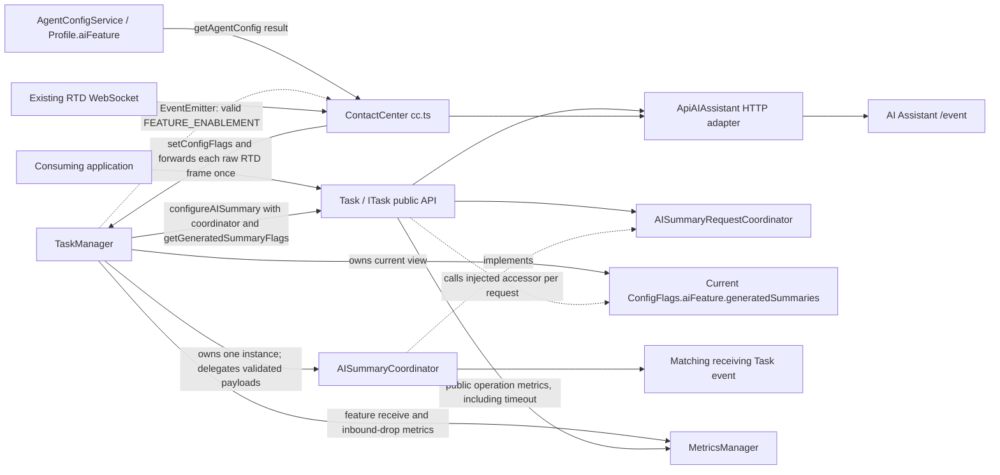
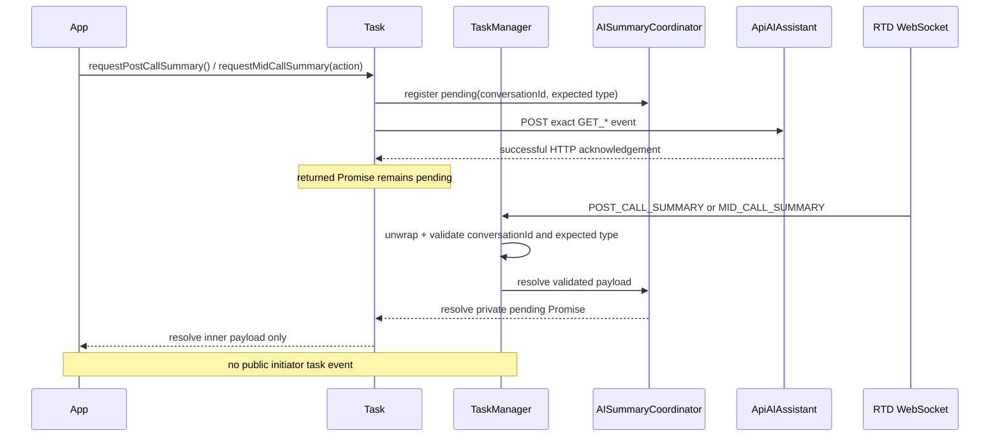

# Contact Center Mid-Call and Post-Call Summary Design

## Overview

This design adds AI-generated post-call and mid-call summary contracts to the existing `@webex/contact-center` workspace. A task initiates post-call or consult/transfer summary generation, the existing AI Assistant HTTP adapter accepts the request, and the existing RTD WebSocket delivers the asynchronous result. Initiator results settle only the request Promise; the receiving-agent result remains the sole new public task event. The existing `wrapup`, `consult`, `transfer`, transcript, suggested-response, task-state, and event contracts are preserved.

The requirement is the target authority. Live source establishes the current state, and the existing `ai-summary*.md` documents are retained only where they agree with it. In particular, this design replaces the prior documents' public initiator-event, organization-only gating, overlapping-request, receiver-fallback, and structured-only response proposals with Promise-only completion, two-level gating, overlap rejection, conversation-only receiver correlation, and structured-or-text fidelity.

Externally visible outcomes are:

- four summary methods implemented once on `Task`, inherited by every SDK-created concrete task, and declared as required members on the SDK-produced `ITask` consumer surface;
- public summary payload/response types and exact backend event constants;
- `cc:featureEnablement` on the contact-center client and `task:midCallSummaryForReceivingAgent` on the matching task;
- deterministic disabled, overlap, transport, timeout, malformed-event, late-event, and cleanup behavior;
- a volatile, per-`conversationId` receiver buffer that retains only the latest subsequent-agent payload for at most `AI_SUMMARY_RECEIVER_BUFFER_RETENTION_MS` (currently 30 seconds), then delivers it when the matching task registers or drops it;
- privacy-safe success and failure metrics for post-call requests, mid-call requests, post-call responses, and mid-call responses, plus one receive metric for every parsed `FEATURE_ENABLEMENT` frame and one bounded inbound-drop metric for malformed, unknown, late, or uncorrelated summary frames.

Constraints and assumptions:

- Node.js 22.14, Yarn 3.4.1, the existing TypeScript/Jest build, and current workspace boundaries remain unchanged.
- `TaskData.interaction.mainInteractionId ?? TaskData.interactionId` is the existing codebase pattern for the stable conversation key. The current task's top-level `interactionId` remains the outbound interaction identifier.
- For the two request operations, a successful AI Assistant HTTP response is an acknowledgement only; a valid matching RTD event is also required to fulfill the public Promise and record request success. The two response operations have no matching RTD result: their public Promises fulfill and their success metrics are recorded on successful HTTP acknowledgement.
- The SDK does not receive a unique backend request ID, and FR-9 correlates an initiator result by the stable `conversationId` plus its inbound summary type. The pending-registry key is therefore `(conversationId, AISummaryInboundType)`, never a task or outbound event name. Tasks sharing `mainInteractionId ?? interactionId` share that slot, so indistinguishable sibling requests are rejected instead of risking wrong-task or multi-task settlement. Only the accepted owner reaches HTTP and installs a resolver. `taskId` is the lifecycle owner guard, while the accepted handle's opaque `requestToken` distinguishes successive registrations by that same owner; neither is correlation key material.
- `CONSULT` and `TRANSFER` both resolve from inbound `MID_CALL_SUMMARY`, so they share one pending slot for a conversation despite using distinct outbound `GET_MID_CALL_CONSULT_SUMMARY` and `GET_MID_CALL_TRANSFER_SUMMARY` names. While either action is pending, the other rejects with `AI_SUMMARY_REQUEST_ALREADY_PENDING`; `POST_CALL_SUMMARY` uses a separate slot.
- A feature snapshot's canonical interaction key is the event's non-empty `interactionId`, which must represent the same top-level identifier returned by the shared AI-summary correlation derivation; the stable `conversationId`/`mainInteractionId` is never substituted. Task outbound methods use throwing `getAISummaryCorrelation(...)`, while TaskManager's AI-summary registry scans and lifecycle paths use non-throwing `tryGetAISummaryCorrelation(...)` and skip invalid task entries with a bounded metadata-only warning.
- No dependency, package, lockfile, schema, persistence, worker, stream, or new SDK configuration key is introduced. The receiver buffer is bounded process-local memory and is cleared on delivery, replacement, expiry, irreducible ambiguity, or a full-session reset. Only a receiver lookup with zero valid conversation matches is buffered. When several local tasks share the conversation, TaskManager deterministically removes initiator/ancestor tasks whose `interactionId` is referenced by another candidate's `interaction.callProcessingDetails.parentInteractionId`; one remaining leaf receives the payload, while zero or multiple leaves are an irreducible ambiguity that is dropped immediately with a distinct metadata-only metric. A buffered payload is re-evaluated through that same rule on task insertion/update/removal. Feature snapshots associated with a registered task are cleared when the final task for their canonical interaction key leaves; a snapshot received before any matching task is bounded by `AI_SUMMARY_FEATURE_ORPHAN_RETENTION_MS`, and is cleared unless a matching task claims it; a full-session reset clears both forms.
- No `AbortSignal` parameter is added because the required public signatures contain none. Transport/base-URL cleanup and lifecycle cancellation are deliberately different. The acknowledgement branch for an accepted request calls owner-and-token-checked `cancelPendingAISummaryRequest(...)`, which clears only that registration's inbound timer and map entry without resolving or rejecting `registration.result`; the public aggregate therefore rejects solely with the original adapter or `AI_ASSISTANT_BASE_URL_NOT_AVAILABLE` error. `AI_SUMMARY_REQUEST_CANCELLED` is reserved for owner-task removal and full-session register/re-establishment/deregistration cleanup, which do settle a live result Promise. The clear-only result Promise has no remaining SDK reference after the aggregate rejects and is garbage-collectible. A late acknowledgement fulfillment/rejection after lifecycle cleanup is consumed, and its stale registration token cannot clear a later same-key request, change the single lifecycle-cancellation outcome, recreate state, emit another final metric, or produce an unhandled rejection. Task collection cleanup is not object destruction: an application-held `Task` retains its injected summary adapter, agent identity, and the post-call `{conversationId, interactionId}` response context captured by a gated request, so `sendPostCallSummaryResponse(...)` remains usable after wrap-up removes the task from TaskManager. Full `ContactCenter.deregister()` still ends the supported operation window.

Non-goals are a widget, visual treatment, Adaptive Card interpretation, summary generation, backend changes, transcript changes, automatic retry/deduplication, or changes to existing handoff and wrap-up APIs. Application sequencing is documented but cannot be enforced across separate SDK calls: the application owns “wrap up, then response” and “response attempt, then consult/transfer.” If a mid-call summary response fails, the application must catch and record that advisory failure and still proceed with the consult or transfer; the response rejection must not block the core handoff.

## Feature Disposition Matrix

| Fix # | Disposition | Reference |
|---|---|---|
| REQ-001 | Out-of-Scope | requirement.md:L3-L4 -> Branch selection is release-workflow metadata and does not change the SDK design. |
| REQ-002 | Out-of-Scope | requirement.md:L7-L17 -> Section 1 is non-normative document-purpose and reference-routing context; it imposes no independently testable SDK obligation. |
| REQ-003 | Out-of-Scope | requirement.md:L18-L27 -> Section 2 is non-normative background/problem framing; its normative goals and requirements are dispositioned separately below. |
| G-1 | Addressed | requirement.md:L31-L35 -> Change: Consumer sequencing and response semantics |
| G-2 | Addressed | requirement.md:L37-L41 -> Change: Consumer sequencing and response semantics |
| G-3 | Addressed | requirement.md:L43-L47 -> Component: Realtime coordination, correlation, and receiver delivery |
| G-4 | Addressed | requirement.md:L49-L53 -> Component: Public contracts and task API owns the two request-Promise return types/methods and the receiving-agent task-event contract; Component: Realtime coordination, correlation, and receiver delivery owns validated inbound settlement without an initiator event and delivery of the push-only payload to the uniquely matched receiving task. `define-ai-summary-contracts`, `expose-task-summary-apis`, and `coordinate-summary-realtime-state` implement those respective slices. |
| G-5 | Addressed | requirement.md:L55-L59 -> Component: Public contracts and task API plus Change: Cross-cutting safeguards and verification; `define-ai-summary-contracts` owns a root-barrel contract test at `test/unit/spec/index.ts` whose explicit frozen pre-feature export set must remain present alongside the enumerated new public symbols. The expected baseline is not derived from the file under test, so removing or renaming an existing `src/index.ts` export fails the focused gate even when `build:src` remains green. |
| REQ-004 | Addressed | requirement.md:L61-L70 -> Change: Cross-cutting safeguards and verification |
| REQ-005 | Addressed | requirement.md:L72-L77 -> Component: Public contracts and task API |
| REQ-006 | Addressed | requirement.md:L78-L78 -> Component: Realtime coordination, correlation, and receiver delivery |
| REQ-007 | Addressed | requirement.md:L79-L79 -> Component: Feature enablement and SDK lifecycle |
| REQ-008 | Addressed | requirement.md:L80-L80 -> Component: Feature enablement and SDK lifecycle |
| REQ-009 | Addressed | requirement.md:L81-L81 -> Component: Realtime coordination, correlation, and receiver delivery |
| REQ-010 | Addressed | requirement.md:L82-L82 -> Shared failure ownership: Component: Public contracts and task API owns disabled outcomes and propagation through the public Promise; Component: AI Assistant transport and outbound serialization owns missing-base-URL, HTTP-failure, and bounded-acknowledgement outcomes; Component: Realtime coordination, correlation, and receiver delivery owns the `AI_SUMMARY_REQUEST_TIMEOUT_MS` inbound timeout plus malformed, unknown-task, uncorrelated, and late-event isolation; Change: Cross-cutting safeguards and verification owns the integrated regression gate. |
| REQ-011 | Addressed | requirement.md:L83-L83 -> Component: Public contracts and task API |
| REQ-012 | Addressed | requirement.md:L84-L84 -> Component: Realtime coordination, correlation, and receiver delivery; `define-ai-summary-contracts` declares the exact `MID_CALL_SUMMARY_RESPONSE_SUBSEQUENT_AGENT` inbound event and `coordinate-summary-realtime-state` recognizes, correlates, and delivers it. |
| REQ-013 | Addressed | requirement.md:L85-L85 -> Component: Public contracts and task API |
| REQ-014 | Out-of-Scope | requirement.md:L87-L89 -> The SDK exposes domain data only; a production widget and its visual design belong to consuming applications. |
| REQ-015 | Out-of-Scope | requirement.md:L90-L90 -> Existing `wrapup`, `consult`, and `transfer` APIs are preserved and only sequenced by the consumer. |
| REQ-016 | Out-of-Scope | requirement.md:L91-L91 -> Backend endpoints and backend business logic are external system responsibilities. |
| REQ-017 | Out-of-Scope | requirement.md:L92-L92 -> Summary generation remains an AI Assistant backend responsibility. |
| REQ-018 | Out-of-Scope | requirement.md:L93-L93 -> Adaptive Card rendering and interpretation remain consumer responsibilities. |
| REQ-019 | Out-of-Scope | requirement.md:L94-L94 -> Existing real-time transcript behavior is explicitly preserved. |
| REQ-020 | Out-of-Scope | requirement.md:L95-L95 -> No SDK retry loop or backend deduplication behavior is added. |
| REQ-021 | Addressed | requirement.md:L97-L104 -> Component: Public contracts and task API |
| REQ-022 | Addressed | requirement.md:L105-L105 -> Component: Public contracts and task API |
| REQ-023 | Addressed | requirement.md:L106-L106 -> Component: Public contracts and task API |
| REQ-024 | Addressed | requirement.md:L107-L107 -> Component: Public contracts and task API |
| REQ-025 | Addressed | requirement.md:L108-L108 -> Component: Public contracts and task API |
| REQ-026 | Addressed | requirement.md:L110-L110 -> Component: Feature enablement and SDK lifecycle |
| REQ-027 | Addressed | requirement.md:L112-L116 -> Component: Feature enablement and SDK lifecycle |
| REQ-028 | Addressed | requirement.md:L117-L117 -> Component: Realtime coordination, correlation, and receiver delivery |
| REQ-029 | Addressed | requirement.md:L119-L119 -> Component: Realtime coordination, correlation, and receiver delivery |
| REQ-030 | Addressed | requirement.md:L121-L125 -> Component: AI Assistant transport and outbound serialization |
| REQ-031 | Addressed | requirement.md:L126-L126 -> Component: AI Assistant transport and outbound serialization |
| REQ-032 | Addressed | requirement.md:L127-L127 -> Component: AI Assistant transport and outbound serialization |
| REQ-033 | Addressed | requirement.md:L128-L128 -> Component: AI Assistant transport and outbound serialization |
| REQ-034 | Addressed | requirement.md:L129-L129 -> Component: AI Assistant transport and outbound serialization |
| REQ-035 | Addressed | requirement.md:L130-L130 -> Component: AI Assistant transport and outbound serialization |
| REQ-036 | Addressed | requirement.md:L132-L134 -> Component: Feature enablement and SDK lifecycle |
| REQ-037 | Addressed | requirement.md:L135-L135 -> Component: Realtime coordination, correlation, and receiver delivery |
| REQ-038 | Addressed | requirement.md:L136-L136 -> Component: Realtime coordination, correlation, and receiver delivery |
| REQ-039 | Addressed | requirement.md:L137-L139 -> Component: Realtime coordination, correlation, and receiver delivery |
| FR-1 | Addressed | requirement.md:L143-L153 -> Component: Feature enablement and SDK lifecycle owns organization-flag propagation and public re-emission; Component: Realtime coordination, correlation, and receiver delivery owns `FEATURE_ENABLEMENT` parsing plus raw `postCallEnabled`/`midCallEnabled` tri-state storage under the canonical top-level task interaction key, active-task lifecycle eviction, and orphan retention through `AI_SUMMARY_FEATURE_ORPHAN_RETENTION_MS`; Component: Public contracts and task API owns the exact-`true` two-level request-time gate and no-backend disabled outcome. A frame key never falls back to `mainInteractionId`/conversation correlation, and an absent interaction flag remains `undefined`, is tagged as `absent` in the valid-frame metric, and gates as disabled. Change: Consumer sequencing and response semantics names `cc:featureEnablement` and its latest per-interaction `postCallEnabled`/`midCallEnabled` values as the application-visible discovery signal, while documenting that an unchecked request remains safe because the authoritative SDK gate rejects disabled without backend work. `wire-contact-center-summary-lifecycle`, `coordinate-summary-realtime-state`, `expose-task-summary-apis`, and `synchronize-summary-documentation-and-verify` implement those respective slices. |
| FR-2 | Addressed | requirement.md:L155-L164 -> Component: Public contracts and task API owns the enabled request method, register-before-send composition, and public Promise contract; Component: AI Assistant transport and outbound serialization owns the exact `GET_POST_CALL_SUMMARY` HTTP request/acknowledgement boundary; Component: Realtime coordination, correlation, and receiver delivery owns matching inbound association and settlement. |
| FR-3 | Addressed | requirement.md:L166-L180 -> Component: Public contracts and task API plus Component: AI Assistant transport and outbound serialization own the structured-or-text/empty response shapes, finite non-negative numeric counters, bounded feedback/state, non-empty post-call `wrapUpCode`, and optional finite non-negative numeric `actionTimeStamp`/`publishTimestamp` fields. `Task` validates and whitelists caller-supplied timestamps, and the adapter preserves the two values independently while using one captured `Date.now()` value only for either field the caller omitted. After the exact request gate and agent/correlation validation pass, `Task` captures an immutable `{conversationId, interactionId}` post-call response context and retains it with the injected adapter and agent identity across wrap-up-driven TaskManager cleanup; the response path needs no live registry, feature snapshot, or coordinator entry. `define-ai-summary-contracts`, `add-ai-summary-transport`, and `expose-task-summary-apis` implement those contracts. Change: Consumer sequencing and response semantics owns the documented application rule to complete wrap-up before sending the post-call response, through `expose-task-summary-apis` and `synchronize-summary-documentation-and-verify`. |
| FR-4 | Addressed | requirement.md:L182-L191 -> Component: Public contracts and task API owns action selection, the enabled request method, register-before-send composition, and the public Promise contract; Component: AI Assistant transport and outbound serialization owns the exact consult/transfer GET HTTP request/acknowledgement boundary; Component: Realtime coordination, correlation, and receiver delivery owns matching inbound association and settlement. |
| FR-5 | Addressed | requirement.md:L193-L209 -> Component: Public contracts and task API plus Component: AI Assistant transport and outbound serialization; both mid-call response branches accept optional finite non-negative numeric `actionTimeStamp` and `publishTimestamp`, `Task` forwards supplied values through its whitelist, and the adapter preserves them independently with a single captured `Date.now()` fallback applied only to omitted fields. Every body layer is constructed field-by-field without spreading a caller object, and strict key assertions prove that mid-call bodies have no `wrapUpCode` key and post-call bodies have no `agentName` key, including no key whose value is `undefined`. |
| FR-6 | Addressed | requirement.md:L211-L215 -> Change: Consumer sequencing and response semantics owns the documentation-only application rule to attempt and await the advisory response before calling consult/transfer and to continue the handoff after a caught response failure. Because those are separate application-invoked SDK calls, their relative invocation order is outside the SDK automated-test boundary. Component: Public contracts and task API plus Component: AI Assistant transport and outbound serialization own the testable SDK slice: exact CONSULT/TRANSFER request- and response-event selection and the 20-second bounded response acknowledgement. |
| FR-7 | Addressed | requirement.md:L217-L236 -> Component: Public contracts and task API plus Change: Consumer sequencing and response semantics; the component owns the explicit `summaryReceived: true | false` mid-call discriminator and closed cancel/exclude response-state validation, while the change owns the rule that `MID_CALL_CANCELLED` must not invoke consult/transfer, that exclusion preserves the summary representation, that the first dialog open is reported as viewed `1`, and that edited/copied remain `0` unless the application observed those actions. The empty-summary/literal-zero rule remains scoped to the no-summary branch. |
| FR-8 | Addressed | requirement.md:L238-L248 -> Component: Realtime coordination, correlation, and receiver delivery owns conversation matching, deterministic local-lineage disambiguation, latest-only buffering only when no valid task is registered, delivery, replacement, expiry, and irreducible-ambiguity isolation. For multiple same-conversation tasks, TaskManager removes every initiator/ancestor whose `interactionId` appears as another candidate's `interaction.callProcessingDetails.parentInteractionId`; exactly one remaining leaf is the receiving task. Zero or multiple leaves are never resolved by registry order: the payload is dropped immediately with one metadata-only `AI_SUMMARY_INBOUND_EVENT_DROPPED` metric using `dropReason: 'ambiguous-receiver'`. A zero-match payload is buffered and re-evaluated through the same selector after task insertion/update/removal; buffer expiry separately emits one drop metric using `dropReason: 'receiver-buffer-expired'`. Component: Feature enablement and SDK lifecycle owns only the full-session `ContactCenter.register()`/connection-re-establishment reset and unconditional `ContactCenter.deregister()` cleanup handoffs to `TaskManager.clearAISummaryState()`. All buffer removal still goes through the coordinator's common timed-entry helper. |
| FR-9 | Addressed | requirement.md:L250-L256 -> Component: Realtime coordination, correlation, and receiver delivery; `tryGetAISummaryCorrelation()` non-throwingly returns distinct `{conversationId, interactionId}` values derived from `mainInteractionId ?? interactionId` and top-level `interactionId`, or `undefined` for an empty identifier. `getAISummaryCorrelation()` wraps that derivation and throws the named correlation error only for task-initiated request validation. Receiver selection uses inbound `conversationId` plus local task lineage only, never an unavailable inbound interaction ID or registry order. An irreducibly ambiguous receiver set and a subsequent-agent buffer expiry are separate terminal outcomes with exactly one metadata-only drop metric each (`ambiguous-receiver` and `receiver-buffer-expired`, respectively), and neither exposes summary/card/agent-name content. |
| FR-10 | Addressed | requirement.md:L258-L264 -> Component: Realtime coordination, correlation, and receiver delivery plus Component: Feature enablement and SDK lifecycle; the existing root-exported `CC_TASK_EVENTS.POST_CALL_SUMMARY`/`.MID_CALL_SUMMARY` members remain the authoritative shared wire-value definitions and are deprecated only as emitted-event names. `CC_AI_SUMMARY_EVENTS` derives those two members rather than repeating their literals; neither value is emitted, while only the two Requirement Section 6.2 events are subscribable additions. |
| FR-11 | Addressed | requirement.md:L266-L275 -> Component: Realtime coordination, correlation, and receiver delivery plus Component: AI Assistant transport and outbound serialization; the coordinator arms `AI_SUMMARY_REQUEST_TIMEOUT_MS` when atomic registration inserts a pending entry, while the adapter independently bounds acknowledgement at `AI_SUMMARY_HTTP_TIMEOUT_MS`. Each accepted handle carries an opaque `requestToken`, and Task attaches `registration.result` to `Promise.all(...)` while wrapping the acknowledgement branch with a rejection handler. A base-URL, HTTP, or HTTP-timeout rejection calls `cancelPendingAISummaryRequest(...)` with the owner and token; only the exact live registration has its timer and entry cleared, and its result Promise is deliberately not settled. Rethrowing the same acknowledgement error makes that adapter/base-URL error the sole public outcome and admits an immediate retry. Inbound timeout still rejects with the flow timeout code. Owner-task removal and full-session cleanup alone reject live results with `AI_SUMMARY_REQUEST_CANCELLED` while keyed, then delete before reactions. Resolution, timeout, transport clear, task cleanup, and SDK cleanup leave no live SDK timer or pending entry; no SDK-held Promise or rejection is abandoned. |
| FR-12 | Addressed | requirement.md:L277-L281 -> Component: Realtime coordination, correlation, and receiver delivery; because FR-9 supplies no inbound task/request identifier, the pending key is `(conversationId, inbound summary type)`, not `taskId`, `requestToken`, action, or outbound event. `POST_CALL_SUMMARY` and `MID_CALL_SUMMARY` are separate slots; CONSULT and TRANSFER share the latter, so TRANSFER rejects `AI_SUMMARY_REQUEST_ALREADY_PENDING` while CONSULT is pending. `taskId` guards lifecycle ownership and the opaque token identifies one accepted registration for clear-only transport cleanup. Change: Consumer sequencing keeps overlap advisory to core flow. |
| DR-1 | Addressed | requirement.md:L285-L291 -> Component: Public contracts and task API derives non-empty `conversationId` and `interactionId` from the requesting Task for every outbound request and response, including `NOT_RECEIVED`; unavailable-value sentinels never replace either identifier. Component: AI Assistant transport and outbound serialization validates every required identifier and the method-specific event-name allowlist before constructing an HTTP request, and its async methods reject with package-internal `AI_SUMMARY_TRANSPORT_ERROR_CODES.VALIDATION_FAILED` rather than throwing synchronously. |
| DR-2 | Addressed | requirement.md:L293-L300 -> Component: Public contracts and task API owns the response discriminated unions and restricts literal empty/zero unavailable values to the summary body and `numberOfTimesViewed`, `numberOfTimesEdited`, and `numberOfTimesCopied`; SDK-derived correlation identifiers remain populated on every response. |
| DR-3 | Addressed | requirement.md:L302-L308 -> Component: AI Assistant transport and outbound serialization |
| DR-4 | Addressed | requirement.md:L310-L318 -> Component: Public contracts and task API |
| DR-5 | Addressed | requirement.md:L320-L324 -> Component: Realtime coordination, correlation, and receiver delivery |
| REQ-040 | Addressed | requirement.md:L326-L330 -> Component: Public contracts and task API |
| REQ-041 | Addressed | requirement.md:L331-L331 -> Component: Public contracts and task API |
| REQ-042 | Addressed | requirement.md:L332-L332 -> Component: AI Assistant transport and outbound serialization; empty `agentId`, `orgId`, `interactionId`, or `conversationId` and an out-of-union event name all produce the named Promise rejection before `webex.request`. |
| REQ-043 | Addressed | requirement.md:L333-L333 -> Component: AI Assistant transport and outbound serialization |
| REQ-044 | Addressed | requirement.md:L334-L334 -> Component: Realtime coordination, correlation, and receiver delivery |
| REQ-045 | Addressed | requirement.md:L335-L335 -> Component: Realtime coordination, correlation, and receiver delivery; atomic async registration rejects overlap through its awaited Promise before Task starts HTTP or replaces the first resolver. The key uses the only safe inbound correlation domain `(conversationId, inbound type)`, so the same rule conservatively covers indistinguishable sibling tasks as documented under FR-12/AC-8. |
| REQ-046 | Addressed | requirement.md:L336-L336 -> Component: Realtime coordination, correlation, and receiver delivery |
| REQ-047 | Addressed | requirement.md:L337-L337 -> Component: Realtime coordination, correlation, and receiver delivery |
| REQ-048 | Addressed | requirement.md:L338-L338 -> Component: Realtime coordination, correlation, and receiver delivery |
| REQ-049 | Addressed | requirement.md:L338-L338 -> Component: Public contracts and task API; `define-ai-summary-contracts` keeps the pre-feature root export set and adds only the approved symbols. The retained outbound `AIAssistantEventName.GET_MID_CALL_SUMMARY` and `.MID_CALL_SUMMARY_RESPONSE` members remain exported solely for compatibility and receive exact `@deprecated` JSDoc directing CONSULT/TRANSFER callers to `GET_MID_CALL_CONSULT_SUMMARY`/`GET_MID_CALL_TRANSFER_SUMMARY` and `MID_CALL_CONSULT_SUMMARY_RESPONSE`/`MID_CALL_TRANSFER_SUMMARY_RESPONSE`, respectively. Its `test/unit/spec/index.ts` compiler-API gate verifies those tags and resolves references to the two declaration symbols across production `src/**/*.ts`, failing if any SDK code path references either legacy member. `expose-task-summary-apis` owns additive Task methods and public-surface compatibility tests, while the cross-cutting verification task confirms that existing symbols and behavior remain unchanged. |
| PR-1 | Addressed | requirement.md:L344-L354 -> Component: Public contracts and task API, Component: AI Assistant transport and outbound serialization, Component: Realtime coordination, correlation, and receiver delivery, Component: Feature enablement and SDK lifecycle, plus Change: Cross-cutting safeguards and verification; `expose-task-summary-apis` enforces privacy-safe Task logs/metrics, `add-ai-summary-transport` replaces every rejected HTTP object with a fresh safe-field projection before `getErrorDetails` or logging, `coordinate-summary-realtime-state` enforces the inbound boundary, `wire-contact-center-summary-lifecycle` covers ContactCenter-observed cleanup and late branches, and `synchronize-summary-documentation-and-verify` audits all four. Section keys are never diagnostic metadata, and the five privacy suites use a unique human-authored section-key sentinel plus a distinct section-value sentinel. |
| PR-2 | Addressed | requirement.md:L356-L368 -> Component: Public contracts and task API, Component: AI Assistant transport and outbound serialization, Component: Realtime coordination, correlation, and receiver delivery, plus Change: Cross-cutting safeguards and verification; `coordinate-summary-realtime-state` makes TaskManager the owner of the classified feature-receive and bounded inbound-drop metrics, `expose-task-summary-apis` makes Task the sole owner of one final metric per public operation (including timeout failures after coordinator rejection), with request success gated by both HTTP acknowledgement and matching RTD resolution, response success gated only by HTTP acknowledgement because response operations have no RTD result, and response failures covering local validation/configuration/base-URL rejection before HTTP as well as transport rejection, `add-ai-summary-transport` enforces the adapter's no-duplicate-metric boundary, and `synchronize-summary-documentation-and-verify` runs the integrated metric regression gate. Task computes duration from a method-local per-invocation start rather than the singleton manager's event-name timer, so an overlap failure cannot clobber a still-pending request's duration. The feature-receive metric is a normal receive-path emission for every valid frame, including repeats, rather than a failure event. |
| PR-3 | Addressed | requirement.md:L370-L374 -> Component: AI Assistant transport and outbound serialization owns the bounded HTTP acknowledgement and timer cleanup; Component: Realtime coordination, correlation, and receiver delivery uses non-throwing per-task correlation reads for every AI-summary TaskManager registry scan, skips an invalid task entry with bounded metadata-only diagnostics, and drops invalid, late, and uncorrelated input without escaping the RTD callback or entering normal task handling; Change: Cross-cutting safeguards and verification owns the integrated isolation regression. Change: Consumer sequencing and response semantics consumes that isolation contract by stating that disabled, base-URL, HTTP transport, timeout, and overlap request rejections cannot block wrap-up, consult, or transfer; the caught advisory-response failure rule remains dispositioned under FR-6. |
| REQ-050 | Addressed | requirement.md:L376-L378 -> Component: Public contracts and task API plus Component: AI Assistant transport and outbound serialization plus Change: Cross-cutting safeguards and verification; public payload types remain additive, while package-internal `AISummaryPendingRegistration`, `AISummaryResponseTransportPayload`, `SummaryResponseTimestamps`, `AI_ASSISTANT_CLIENT_TYPE`, `AI_SUMMARY_DURATION_MS`, `AI_SUMMARY_REQUEST_TIMEOUT_MS`, `AI_SUMMARY_RECEIVER_BUFFER_RETENTION_MS`, `AI_SUMMARY_FEATURE_ORPHAN_RETENTION_MS`, `AI_SUMMARY_REQUEST_CANCELLED`, `AI_SUMMARY_HTTP_TIMEOUT_MS`, and `AI_SUMMARY_TRANSPORT_ERROR_CODES` are explicitly omitted from the `src/index.ts` export list so they do not become supported package-root contracts. |
| REQ-051 | Addressed | requirement.md:L379-L379 -> Change: Cross-cutting safeguards and verification |
| REQ-052 | Addressed | requirement.md:L380-L380 -> Change: Cross-cutting safeguards and verification |
| REQ-053 | Addressed | requirement.md:L381-L381 -> Change: Cross-cutting safeguards and verification |
| REQ-054 | Addressed | requirement.md:L382-L382 -> Component: Feature enablement and SDK lifecycle |
| REQ-055 | Addressed | requirement.md:L383-L385 -> Component: Feature enablement and SDK lifecycle; `wire-contact-center-summary-lifecycle` owns the two independent organization kill switches and the `cc.ts` regression proving that disabling both leaves existing SDK workflows operational. Its deregistration regression also settles pending coordinator work before socket teardown and proves a later in-flight HTTP fulfillment or rejection is consumed without resettlement, state recreation, an extra final metric, or an unhandled rejection. |
| REQ-056 | Addressed | requirement.md:L387-L398 -> Component: Public contracts and task API plus Component: AI Assistant transport and outbound serialization plus Component: Realtime coordination, correlation, and receiver delivery; `define-ai-summary-contracts` owns the root-exported six-value `AI_SUMMARY_ERROR_CODES` contract, `expose-task-summary-apis` owns disabled/base-URL/overlap rejection behavior, `add-ai-summary-transport` owns package-internal validation/HTTP-failure/HTTP-timeout codes and sanitized propagation, and `coordinate-summary-realtime-state` owns the distinct inbound-result timeout, unknown-task, malformed-event, and late-event behavior. The transport-only codes do not enlarge the six-value package-root contract. `synchronize-summary-documentation-and-verify` is only the final regression gate. |
| REQ-057 | Addressed | requirement.md:L400-L401 -> Change: Cross-cutting safeguards and verification |
| AC-1 | Addressed | requirement.md:L402-L408 -> `expose-task-summary-apis` (`test/unit/spec/services/task/Task.ts` and `test/unit/spec/services/task/TaskManager.ts`) owns the post-call public API, Promise-only outcome, payload validation, immutable request-time `{conversationId, interactionId}` capture, and successful response invocation from the same application-held Task after wrap-up-driven collection cleanup; `coordinate-summary-realtime-state` (`test/unit/spec/services/task/AISummaryCoordinator.ts` and `test/unit/spec/services/task/TaskManager.ts`) owns matching inbound association, typed settlement, and no initiator emit; `add-ai-summary-transport` (`test/unit/spec/services/ApiAiAssistant.ts`) owns only the outbound request/response serialization portion; `synchronize-summary-documentation-and-verify` owns the wrap-up-first example and final regression gate. |
| AC-2 | Addressed | requirement.md:L410-L412 -> `expose-task-summary-apis` (`test/unit/spec/services/task/Task.ts`) and `add-ai-summary-transport` (`test/unit/spec/services/ApiAiAssistant.ts`) own the SDK-testable CONSULT slice: the typed public Promise and exact `GET_MID_CALL_CONSULT_SUMMARY`/`MID_CALL_CONSULT_SUMMARY_RESPONSE` selection. `coordinate-summary-realtime-state` (`test/unit/spec/services/task/AISummaryCoordinator.ts` and `test/unit/spec/services/task/TaskManager.ts`) owns matching typed inbound settlement and no initiator emit. The clause requiring the application to attempt the response before it invokes `consult(...)`, and to continue after a caught response rejection, is documentation-only and outside the SDK automated-test boundary because the calls are independent; `synchronize-summary-documentation-and-verify` owns that documented disposition and the final regression gate. |
| AC-3 | Addressed | requirement.md:L414-L416 -> `expose-task-summary-apis` (`test/unit/spec/services/task/Task.ts`) and `add-ai-summary-transport` (`test/unit/spec/services/ApiAiAssistant.ts`) own the SDK-testable TRANSFER slice: the typed public Promise and exact `GET_MID_CALL_TRANSFER_SUMMARY`/`MID_CALL_TRANSFER_SUMMARY_RESPONSE` selection. `coordinate-summary-realtime-state` (`test/unit/spec/services/task/AISummaryCoordinator.ts` and `test/unit/spec/services/task/TaskManager.ts`) owns matching typed inbound settlement and no initiator emit. The clause requiring the application to attempt the response before it invokes `transfer(...)`, and to continue after a caught response rejection, is documentation-only and outside the SDK automated-test boundary because the calls are independent; `synchronize-summary-documentation-and-verify` owns that documented disposition and the final regression gate. |
| AC-4 | Addressed | requirement.md:L418-L420 -> `expose-task-summary-apis` (`test/unit/spec/services/task/Task.ts`) owns cancellation validation, received-before-display viewed `0`, first-open viewed `1` with edited/copied `0` absent those actions, the separate no-summary empty/literal-zero branch, and the executable consumer-harness assertion that `MID_CALL_CANCELLED` sends its response while neither `consult(...)` nor `transfer(...)` is invoked. `add-ai-summary-transport` (`test/unit/spec/services/ApiAiAssistant.ts`) owns exact cancellation serialization; `synchronize-summary-documentation-and-verify` mirrors the verified cancel branch and runs the final regression gate. |
| AC-5 | Addressed | requirement.md:L422-L424 -> `coordinate-summary-realtime-state` owns conversation-only initial matching, deterministic local parent/child lineage selection, unique-leaf delivery independent of registry order, zero-match latest-only buffering/re-flush, and separate irreducible-ambiguity versus expiry drops. `TaskManager.ts` tests cover parent+child and chained leaves, sibling/missing/cyclic ambiguity with exact `ambiguous-receiver`, and `receiver-buffer-expired`; coordinator tests cover clearing, callbacks, timers, privacy, and cleanup. `synchronize-summary-documentation-and-verify` runs the final regression gate. |
| AC-6 | Addressed | requirement.md:L426-L428 -> `expose-task-summary-apis` (`test/unit/spec/services/task/Task.ts`) owns two-level disabled rejection/no-HTTP assertions and proves each invocation calls the injected `getGeneratedSummaryFlags()` accessor, `coordinate-summary-realtime-state` (`test/unit/spec/services/task/AISummaryCoordinator.ts` and `test/unit/spec/services/task/TaskManager.ts`) owns the current profile-derived accessor view plus latest `interactionFeatureEnablement` state under the canonical top-level interaction key, explicitly including the no-matching-per-interaction-event lookup returning `undefined`, active-task cleanup, and orphan expiry through `AI_SUMMARY_FEATURE_ORPHAN_RETENTION_MS`, and `wire-contact-center-summary-lifecycle` (`test/unit/spec/cc.ts`) owns `getAgentConfig()`/`setConfigFlags(...)` propagation, `cc:featureEnablement` forwarding, and independent organization-flag behavior. Together the `TaskManager.ts` missing-entry assertion and `Task.ts` disabled assertion prove that no per-interaction event behaves as disabled and performs no HTTP. `synchronize-summary-documentation-and-verify` documents that consumers discover the per-interaction values from that client event, an unchecked call safely rejects without backend work, and a disabled rejection produces no summary response or core-flow blockage. |
| AC-7 | Addressed | requirement.md:L430-L432 -> `coordinate-summary-realtime-state` (`test/unit/spec/services/task/AISummaryCoordinator.ts` and `test/unit/spec/services/task/TaskManager.ts`) owns exact root-exported timeout codes, explicit request/buffer arm points, shared-duration fake-timer behavior, common cleanup, and late-event inbound-drop assertions, while `expose-task-summary-apis` (`test/unit/spec/services/task/Task.ts`) owns propagation and exactly one timeout failure metric through the public Promise; `synchronize-summary-documentation-and-verify` runs the final regression gate. |
| AC-8 | Addressed | requirement.md:L434-L436 -> `coordinate-summary-realtime-state` owns the exact `(conversationId, inbound summary type)` key, first-entry preservation, and atomic overlap rejection. `POST_CALL_SUMMARY` is independent from `MID_CALL_SUMMARY`; CONSULT and TRANSFER share the `MID_CALL_SUMMARY` slot, so TRANSFER while CONSULT is pending rejects before token/result creation, timer, HTTP, or cancellation. Sibling tasks share the same conversation/type domain. `expose-task-summary-apis` owns public propagation, sequential retry, and per-invocation operation timing: the rejected overlap emits its own failure metric before the still-pending first request's later final metric and cannot restart or consume the first duration. Synchronization runs the final gate. |
| AC-9 | Addressed | requirement.md:L438-L440 -> `coordinate-summary-realtime-state` owns malformed/unknown/uncorrelated isolation plus deterministic receiver disambiguation. Irreducible ambiguity emits/delivers nothing and records exactly one bounded `ambiguous-receiver` drop; zero-match buffer expiry separately records `receiver-buffer-expired`. Non-throwing invalid-task scans and later valid-event continuity remain asserted. |
| AC-10 | Addressed | requirement.md:L442-L444 -> The privacy-bearing Jest targets are explicitly `test/unit/spec/services/task/Task.ts`, `test/unit/spec/services/task/AISummaryCoordinator.ts`, `test/unit/spec/services/task/TaskManager.ts`, `test/unit/spec/services/ApiAiAssistant.ts`, and `test/unit/spec/cc.ts`. Each target asserts that its success and failure logger/metric spy arguments omit sentinel summary, human-authored section-key, section-value, Adaptive Card, and agent-display-name values; the adapter case additionally rejects an error carrying the serialized request body through nested properties. `synchronize-summary-documentation-and-verify` runs the final regression gate. |
| AC-11 | Addressed | requirement.md:L446-L448 -> `define-ai-summary-contracts` preserves the frozen pre-feature package-root set, verifies exact action-specific `@deprecated` JSDoc on retained `GET_MID_CALL_SUMMARY` and `MID_CALL_SUMMARY_RESPONSE`, and rejects any production `src/**/*.ts` reference resolving to either declaration symbol. Focused existing-behavior tests and the final complete unit/style/build gate preserve compatibility. |

## Current State and Reuse Analysis

The implementation stays inside `packages/@webex/contact-center`. The following decisions are grounded in the inspected source rather than the repository code map.

| Current surface | Evidence and existing behavior | Classification | Target decision |
|---|---|---|---|
| `src/services/ApiAiAssistant.ts` | `ApiAIAssistant` already owns AI Assistant URL resolution, authenticated `webex.request` calls, organization lookup, error augmentation, and generic transcript/suggestion events. The existing core `TIMEOUT_REQ = 20_000` is the package policy for an individual HTTP request. | Extend | Reuse `getBaseUrl()`, credentials, `/event`, `HTTP_METHODS.POST`, `TIMEOUT_REQ`, and error conventions; add summary-specific serializers because generic `sendEvent()` emits a string timestamp and lacks the required double identifier/response fields. Both summary methods call one private `buildSummaryEventEnvelope(...)` constructor, then one private bounded-post helper that clears its timer and converts the original HTTP rejection into a fresh safe-field projection before error augmentation. |
| `src/services/core/Utils.ts`, `src/services/core/GlobalTypes.ts`, `src/constants.ts`, and `src/index.ts` | `getErrorDetails()` returns a standard `Error` with a backward-compatible `data` field, while `generateTaskErrorObject()` returns the typed `AugmentedError` form; callers throw or reject with those values. `Err.Message`/`Err.Details` remain package-internal, and the public barrel exposes no stable error-identifier registry today. | Reuse and extend | Keep the existing augmented-`Error` shape rather than introduce a summary-only error class. Declare `AI_SUMMARY_ERROR_CODES` in `src/constants.ts` with the six exact consumer identifiers `POST_CALL_SUMMARY_DISABLED`, `MID_CALL_SUMMARY_DISABLED`, `AI_ASSISTANT_BASE_URL_NOT_AVAILABLE`, `POST_CALL_SUMMARY_TIMEOUT`, `MID_CALL_SUMMARY_TIMEOUT`, and `AI_SUMMARY_REQUEST_ALREADY_PENDING`, re-export that const object from `src/index.ts`, and set both `error.message` and `error.data.errorCode` to the selected value so consumers have one stable public matching contract. In the same file, declare package-internal `AI_ASSISTANT_CLIENT_TYPE = 'WxCC' as const` for the summary envelope builder and deliberately omit it from `src/index.ts`. |
| `src/services/task/Task.ts` and `src/services/task/types.ts` | `Task` is the shared base for voice, WebRTC, and digital tasks; `ITask` is the public contract. Existing wrap-up/consult/transfer methods are independent Promises, and removing a Task from TaskManager's collection does not destroy an application-held object or erase its `data`. | Extend | Declare the package-internal `AISummaryRequestCoordinator` and `GeneratedSummaryFlagsAccessor` contracts in `src/services/task/types.ts` and add the four public APIs once on `Task`/`ITask`. `Task` receives the adapter, live organization-flag accessor, and narrow coordinator contract only through package-internal `configureAISummary(...)` immediately after factory creation; it never imports `TaskManager`, the concrete coordinator, or the config service. Every request calls `getGeneratedSummaryFlags()` before combining that current organization value with the coordinator's latest interaction snapshot. A post-call request that passes gating and agent/correlation validation captures a Task-private immutable `{conversationId, interactionId}` response context; TaskManager cleanup must not clear that context, the agent identity, or the injected adapter, and the post-call response path must not require a live coordinator entry, feature snapshot, or registry lookup. Every existing subclass inherits the APIs without constructor or behavior duplication, and existing call-control methods remain untouched. |
| `src/services/task/TaskManager.ts` | Owns the task registry, current `ConfigFlags` view populated by `ContactCenter.setConfigFlags(...)`, parses RTD frames, maps `data.data.conversationId` to tasks for transcripts/suggestions, and controls task cleanup. The current source is already 978 lines and its unit spec is 2,481 lines. | Extend | Preserve registry, config propagation, RTD parsing, task matching, and transcript/suggestion dispatch. Compose one `AISummaryCoordinator` for the TaskManager lifetime and configure every factory-created Task with that same instance plus the bound `getGeneratedSummaryFlags` accessor before listener setup or registry insertion. Validate and classify summary frames, then delegate resolver, feature-state, buffer, timer, and summary-cleanup transitions to the coordinator. Individual task removal performs owner/final-key cleanup and re-flushes a receiver buffer against the post-removal registry; the full-session lifecycle facade unconditionally clears every receiver entry through the shared timed-entry path when a registration starts/re-establishes or the SDK deregisters. |
| `src/services/task/AISummaryCoordinator.ts` and `src/services/task/constants.ts` | No focused summary-state owner exists today; putting three maps and three distinct timer/lifecycle policies directly in the already-large TaskManager would mix state-machine-like Promise/buffer policy with raw-frame and task-registry orchestration. | Add | Implement the narrow `AISummaryRequestCoordinator` dependency consumed by `Task`, own all volatile summary maps/timers, and define the package-internal source-module exports `AI_SUMMARY_DURATION_MS = 30_000`, `AI_SUMMARY_REQUEST_TIMEOUT_MS`, `AI_SUMMARY_RECEIVER_BUFFER_RETENTION_MS`, `AI_SUMMARY_FEATURE_ORPHAN_RETENTION_MS`, and lifecycle-only `AI_SUMMARY_REQUEST_CANCELLED = 'AI_SUMMARY_REQUEST_CANCELLED'`. Each accepted entry stores an opaque request token. One private `removeTimedEntry` path clears required/optional timers; resolve, inbound timeout, owner-task cleanup, and full-session cleanup settle while keyed and delete before reactions, while token-checked base-URL/HTTP cleanup calls it without a settlement callback. Receiver buffering occurs only for zero matches; a unique lineage leaf delivers, and irreducible ambiguity clears/drops with a bounded TaskManager-owned metric callback distinct from expiry. The coordinator exposes package-internal validated-input methods for direct tests; it does not parse JSON, select registry candidates, or import metrics. |
| `src/services/task/TaskUtils.ts` | Existing helpers repeatedly prefer `mainInteractionId` and otherwise use `interactionId` as the stable call identity. | Extend | Add exported source-module helpers `tryGetAISummaryCorrelation()` and `getAISummaryCorrelation()` over one derivation. Both return distinct `{conversationId, interactionId}` values when valid; the `try` variant returns `undefined` for an empty identifier and is used by TaskManager's AI-summary registry scans/lifecycle paths, while the throwing variant converts that result into `AI_SUMMARY_CORRELATION_NOT_AVAILABLE` only for Task outbound API validation. This prevents one malformed registered task from escaping an RTD callback while ensuring a consulted/transferred task never copies the conversation key into both outbound fields. |
| `src/cc.ts` | Creates the AI adapter and TaskManager, forwards RTD messages, connects RTD only for transcripts/suggestions, re-triggers public events, and owns registration/deregistration. | Extend | Include either generated-summary organization switch in RTD connection criteria, forward feature enablement, invoke TaskManager's full summary-cleanup facade before every registration/connection re-establishment, and invoke it unconditionally from deregistration cleanup even when an earlier teardown step fails; that facade reaches the same coordinator timed-entry cleanup used by task removal. Add no root method. |
| `src/services/config/index.ts`, `src/services/config/types.ts`, `src/services/agent/types.ts`, and `src/cc.ts` | `AgentConfigService.getAgentConfig()` obtains the organization AI resource through `getAIFeatureFlags(orgId)`, stores it as `Profile.aiFeature`, and `ContactCenter` already copies that profile value into `TaskManager.setConfigFlags(...)`. `AIFeatureFlags.generatedSummaries` exposes optional `wrapUpSummariesEnabled` and `consultTransferSummariesEnabled`. Raw `POST_CALL_SUMMARY` and `MID_CALL_SUMMARY` names already exist in `CC_TASK_EVENTS`, which is root-exported and spread into the public `CC_EVENTS` object despite its internal JSDoc. | Preserve and extend | Keep the existing profile/config propagation as the source of both independent organization kill switches. Add only the package-internal `TaskManager.getGeneratedSummaryFlags` accessor over its current `configFlags?.aiFeature?.generatedSummaries` view and inject that accessor into each Task; do not add a config key or make Task fetch profile data. Retain `CC_TASK_EVENTS.POST_CALL_SUMMARY` and `.MID_CALL_SUMMARY` as deprecated inbound aliases, make `CC_AI_SUMMARY_EVENTS` the single source of their strings, and expose only `cc:featureEnablement` and `task:midCallSummaryForReceivingAgent` as new public emissions. |
| `src/types.ts`, `src/services/agent/types.ts`, `src/services/task/types.ts`, `src/index.ts` | Runtime const-object/enums plus explicit public-barrel exports are the package convention. Existing generic mid-call constants are already published internally. | Extend | Add exact consult/transfer constants without removing generic values, add the two public events, and explicitly export all public summary contracts from `src/index.ts`. Keep `AISummaryResponseTransportPayload` and `SummaryResponseTimestamps` available only to package-internal imports and absent from the package-root export list. |
| `src/metrics/MetricsManager.ts` and `src/metrics/constants.ts` | Singleton metrics manager supports timed named events and filters unsupported metadata values. | Preserve and extend | Reuse the manager unchanged. Task owns exactly one final success/failure metric for each public operation, including timeout failure after its coordinator Promise rejects. TaskManager owns `AI_SUMMARY_FEATURE_ENABLEMENT_RECEIVED` and `AI_SUMMARY_INBOUND_EVENT_DROPPED` for classified receive and malformed/unknown/late-or-uncorrelated routing outcomes, respectively; neither owner emits the other's metric. |
| `./ai-summary.md`<br>`./ai-summary-postcall-flow.md`<br>`./ai-summary-initiator-flow.md`<br>`./ai-summary-receiver-flow.md`<br>`packages/@webex/contact-center/src/services/task/ai-docs/AGENTS.md`<br>`packages/@webex/contact-center/src/services/task/ai-docs/ARCHITECTURE.md`<br>`packages/@webex/contact-center/src/services/agent/ai-docs/AGENTS.md`<br>`packages/@webex/contact-center/src/services/agent/ai-docs/ARCHITECTURE.md`<br>`packages/@webex/contact-center/src/metrics/ai-docs/AGENTS.md`<br>`packages/@webex/contact-center/src/metrics/ai-docs/ARCHITECTURE.md` | They contain useful transport shapes, flow evidence, and service guidance, but portions still propose public initiator events, organization-only gating, fallback receiver correlation, overlapping requests, structured-only assumptions, adapter-generated-only response timestamps, duplicated summary envelopes, or an inline `WxCC` client type. | Synchronize during implementation | Until synchronized, this design is authoritative and those conflicting subjects are non-normative. The DAG task `synchronize-summary-documentation-and-verify` must update all ten exact repo-relative paths in the implementation change: preserve valid wire shapes, response sequencing, double-envelope handling, privacy rules, and service guidance while replacing the conflicting guidance before the final regression gate. |
| Existing task lifecycle, state machine, transcript, suggested response, WebRTC, and contact APIs | These paths are operational and separately tested. | Preserve | No source or public behavior is removed. Summary failures never enter the task state machine or alter core call-control outcomes. |

Provenance: this is the first canonical design artifact for this requirement; no earlier design spec or `.sdd/manifest.json` existed at authoring time. The requirement-linked `ai-summary*.md` files remain unchanged source context during this design-phase task, but their enumerated conflicting subjects are non-normative until the explicitly scheduled implementation task synchronizes them.

Reuse follows DRY/KISS/SOLID as follows:

- The existing AI HTTP adapter remains the only dependency on Webex request/credentials.
- `ApiAIAssistant.buildSummaryEventEnvelope(...)` is the sole constructor for the common summary request/response envelope; its discriminated input permits only a GET branch with no response additions or a response branch whose fields are selected from `AISummaryResponseTransportPayload`. It constructs each object level field-by-field and never spreads a caller object, so an absent flow field cannot survive as an `undefined`-valued key. Both public adapter methods call it, and no second summary-envelope literal is maintained.
- One private adapter helper owns the single `webex.request` attempt, the package's existing `AI_SUMMARY_HTTP_TIMEOUT_MS` bound, timer cleanup, and safe error projection for both summary methods. This avoids duplicate timeout/error branches and keeps the independent `AI_SUMMARY_REQUEST_TIMEOUT_MS` inbound-result and `AI_SUMMARY_RECEIVER_BUFFER_RETENTION_MS` policies in `AISummaryCoordinator`.
- The existing Task base remains the only public task API implementation point.
- TaskManager remains the only owner of task registration, raw RTD parsing, payload classification, and selection of candidate receiving tasks.
- `AISummaryRequestCoordinator` and `GeneratedSummaryFlagsAccessor` are declared in `src/services/task/types.ts`; `Task` stores only those contracts, never a `TaskManager` or config-service reference. TaskManager owns one concrete `AISummaryCoordinator` for its lifetime and injects the shared instance plus its bound `getGeneratedSummaryFlags` accessor through `Task.configureAISummary(...)` at every task-creation path before the Task becomes observable. The accessor reads the current profile-derived `ConfigFlags` view for every request, while the coordinator owns only validated summary state transitions: feature snapshots, pending resolvers, receiver buffering, the three timer/lifecycle policies, and scoped/full cleanup. Separately, `Task` owns a two-string immutable post-call response context captured from the validated request correlation; registry/coordinator cleanup cannot invalidate it, and it carries no timer, listener, transport body, or summary content.
- The coordinator is a justified extraction rather than a second orchestration layer: TaskManager is already 978 source lines with a 2,481-line unit spec, while the new timeout, overlap, replacement, expiry, and owner-cleanup matrix has a cohesive direct fake-timer test seam. `AISummaryService.ts` would still duplicate `ApiAIAssistant`, and a summary state machine would still incorrectly couple advisory summary state to core task lifecycle.

## Target Architecture and Package Layout

The live declaration, named export, and default export all use the exact class symbol `ApiAIAssistant`; its exact case-sensitive module path is `packages/@webex/contact-center/src/services/ApiAiAssistant.ts`. The filename's `ApiAiAssistant` casing does not rename the symbol. Component and type references use the exported-symbol spelling, while source and test paths use the filesystem spelling.

Dependency direction remains acyclic:



The dotted `TaskManager` -> `ContactCenter` arrow is a runtime EventEmitter notification, not a reverse module dependency: TaskManager emits the shared `AGENT_EVENTS.FEATURE_ENABLEMENT` contract without importing or calling `ContactCenter`, and `cc.ts` owns the named subscription and public re-trigger. Static construction/import direction therefore remains `ContactCenter` -> `TaskManager`, so this notification path creates no module-level cycle.

Layer responsibilities and handoffs:

| Layer | Owns | Must not own |
|---|---|---|
| Consumer application | visual presentation, editing/copy/view observations, wrap-up/consult/transfer ordering, final `agentName` and wrap-up code selection | transport envelopes, correlation maps, timeout timers |
| `Task` | public signatures, runtime argument validation including optional response timestamps, two-level gating by calling injected `getGeneratedSummaryFlags()` for the current organization value and reading the coordinator's latest interaction value, correlation derivation, immutable post-call response-correlation retention across collection cleanup, response transport through the retained adapter, and exactly one final public-operation metric, including timeout failure after coordinator rejection | config/profile fetching or storage, inbound receive/drop metrics, task registry, WebSocket parsing, UI state, consult/transfer invocation |
| `TaskManager` | task registry, current profile-derived `ConfigFlags` view and bound `getGeneratedSummaryFlags` accessor, lifecycle ownership of its one coordinator and the FR-11 request, FR-8 receiver-buffer, and orphan-feature timer policies, canonical interaction-key candidate/presence checks, raw RTD parsing and payload validation, transcript/suggestion routing, receiving-task candidate selection, internal `AGENT_EVENTS.FEATURE_ENABLEMENT` EventEmitter notification, `AI_SUMMARY_FEATURE_ENABLEMENT_RECEIVED` plus `AI_SUMMARY_INBOUND_EVENT_DROPPED` emission, delegation to the coordinator, and the SDK/task cleanup facade | direct summary maps/timer handles or parallel `setTimeout`/`clearTimeout` branches, HTTP body construction, summary rewriting, core task transitions, duplicate public-operation metrics |
| `AISummaryCoordinator` | direct timer-handle and state ownership: latest feature state keyed only by top-level interaction ID, token-identified pending Promise state, exact validated event-type correlation, zero-match receiver buffer, an FR-11 request timer armed with accepted insertion, an FR-8 expiry timer armed/rearmed only with zero-match buffer insertion/replacement, an orphan-feature timer cleared when a matching task claims the snapshot, common `removeTimedEntry` cleanup, settle-while-keyed/delete-before-reactions ordering for resolution/timeout/lifecycle cancellation, and clear-without-settlement ordering for base-URL/HTTP failure | raw RTD parsing, task registry ownership or lineage selection, HTTP serialization, direct metric emission, core task transitions |
| `ApiAIAssistant` | base URL, auth/org lookup, adapter-input validation, response timestamp fallback, field-by-field request/response wire serialization through one private `buildSummaryEventEnvelope(...)`, a shared 20-second HTTP guard, and safe error projection before diagnostics | task lookup, feature gating, public event delivery, duplicate envelope/timeout branches, logging original HTTP errors or bodies |
| Agent configuration / organization-flag source | `AgentConfigService.getAIFeatureFlags(orgId)` feeding `Profile.aiFeature`, propagation through `ContactCenter` to `TaskManager.setConfigFlags(...)`, and the current `ConfigFlags.aiFeature.generatedSummaries` view returned by `getGeneratedSummaryFlags()` | per-interaction feature snapshots, request gating decisions, summary timers, transport |
| `ContactCenter` | agent-profile loading, propagation through `TaskManager.setConfigFlags(...)`, RTD connection lifecycle, single raw-frame forwarding handoff, named subscription to TaskManager's feature notification, and public client re-trigger as `cc:featureEnablement` | new summary request methods or payload mutation |

Producer/consumer contracts:

- `AgentConfigService.getAgentConfig()` fetches `getAIFeatureFlags(orgId)` into `Profile.aiFeature`; `ContactCenter` supplies it to `TaskManager.setConfigFlags(...)`. TaskManager injects a bound `getGeneratedSummaryFlags` accessor, and every `Task.request*` call reads that live organization view before combining it with `AISummaryRequestCoordinator.getFeatureEnablement(...)`.
- An enabled `Task.request*` awaits atomic registration before transport. An accepted handle contains a fresh opaque `requestToken` plus the exact long-lived result Promise; overlap rejects before either is constructed, so HTTP cannot start. The coordinator later resolves/rejects only that result, while the token is used solely to prevent an old acknowledgement failure from clearing a newer same-owner registration.
- After the post-call gate and agent/correlation validation succeed, `Task` copies the derived `conversationId` and top-level `interactionId` into a Task-private readonly response context before registration/HTTP can reject. The context contains no summary payload and is replaced only by a later gated post-call request on that Task. `sendPostCallSummaryResponse(...)` uses those captured identifiers plus the retained `agentId` and `ApiAIAssistant` reference; it does not read TaskManager's registry, the coordinator's pending/feature state, or the live gating accessor. Removing the task from TaskManager after wrap-up therefore cancels only still-pending coordinator work and cannot tear down a later post-call response. A full SDK deregistration remains outside this guarantee, so the application sends the response before calling `ContactCenter.deregister()`.
- Immediately after accepted registration, `Task` starts the HTTP acknowledgement and immediately attaches a rejection handler to that acknowledgement before composing it with `registration.result` in `Promise.all(...)`. The handler calls `cancelPendingAISummaryRequest(taskId, conversationId, inboundType, registration.requestToken)`. On an exact owner-and-token match, the coordinator calls `removeTimedEntry(...)` without a settlement callback, clearing the inbound timer and deleting the entry while leaving `registration.result` unsettled; a missing entry, different owner, or stale token is a no-op. The handler then rethrows the same base-URL/adapter error, so it is the sole aggregate/public rejection, state is clean before caller observation, and an immediate explicit retry is admitted. Because `Promise.all` already attached to the result branch, that now-unreferenced unresolved Promise creates no unhandled rejection and becomes garbage-collectible after the aggregate unwinds. Inbound timeout and lifecycle cleanup remain separate settling paths. A late rejection from an old acknowledgement cannot clear a newer same-key registration because tokens differ.
- `cc.handleRTDWebsocketMessage` forwards the raw frame once; TaskManager performs the only JSON/double-envelope parse and delegates validated summary payloads to `AISummaryCoordinator`.
- During an active registration, TaskManager classifies and metrics every `FEATURE_ENABLEMENT` frame, emits one bounded inbound-drop metric for each malformed, unknown, late, or uncorrelated summary frame, then calls `AISummaryCoordinator.setFeatureEnablement(payload, hasRegisteredTask)` for each valid feature payload before emitting `AGENT_EVENTS.FEATURE_ENABLEMENT` through its EventEmitter. Writer presence scans use `tryGetAISummaryCorrelation(task.data)?.interactionId`, skip invalid registered-task entries with a bounded metadata-only warning, and never throw out of the RTD callback. Task gating through `getFeatureEnablement(...)` uses the interaction ID produced by throwing `getAISummaryCorrelation(...)` inside the task-initiated request path. Registration retention and final-task cleanup use the non-throwing variant; an event value is never compared with the conversation key. A snapshot with no registered match expires after `AI_SUMMARY_FEATURE_ORPHAN_RETENTION_MS` unless task registration calls `retainFeatureEnablementForTask(interactionId)` first. `incomingTaskListener()` removes the same named `cc.ts` feature handler before adding it, so listener installation is idempotent without deduplicating inbound frames.
- On a valid subsequent-agent payload, TaskManager uses `tryGetAISummaryCorrelation(...)` per registry entry, skips and metadata-only warns for invalid entries, and collects every valid same-conversation task. With multiple matches it applies one deterministic lineage selector: build the set of candidate `interaction.callProcessingDetails.parentInteractionId` values, remove candidates whose own `interactionId` appears in that set, and use the result only when exactly one leaf remains. A sole original match or sole lineage leaf is supplied for delivery; zero original matches is supplied for buffering; zero or multiple leaves preserve an explicit ambiguous set so the coordinator clears any old buffer, emits no task event, and reports `ambiguous-receiver` exactly once through TaskManager's bounded drop-metric callback. Registry order is never a tie-breaker, and no inbound interaction ID is consulted.
- TaskManager centralizes every lifecycle-triggered buffer retry in `flushReceivingSummaryForTask(task)`. The helper derives the triggering task's conversation key non-throwingly, recomputes all current valid same-conversation tasks, applies the identical lineage selector, and invokes `AISummaryCoordinator.flushReceivingSummary(...)`. After insertion/update it runs only after the incoming/hydrate lifecycle event so application listeners can attach. One selected receiver clears the buffer/timer before one emit; zero matches retain the existing buffer/deadline; an irreducibly ambiguous set clears the buffer/timer without delivery and reports the separate ambiguity metric.
- Individual task removal/deregistration derives both keys before deletion, removes the task from the registry, performs owner-only pending-request lifecycle cancellation, and re-runs the same receiver selector against the post-removal registry for any zero-match buffered payload. A unique leaf then delivers, zero matches retains, and irreducible ambiguity drops with its own metric; per-task cleanup never routes by registry order. Feature state clears only when no remaining valid task has the same canonical interaction key. A full-session boundary is different: at every `ContactCenter.register()` attempt, before connection re-establishment, and in unconditional `ContactCenter.deregister()` cleanup, `TaskManager.clearAISummaryState()` deactivates inbound handling, rejects each still-live request result with `AI_SUMMARY_REQUEST_CANCELLED` while keyed, deletes it before reactions, and removes every buffer, feature entry, and timer. That lifecycle code is the only producer of `AI_SUMMARY_REQUEST_CANCELLED`; base-URL/HTTP cleanup never settles a result. A queued classified frame after full cleanup is a bounded `sdk-deregistered` drop, and the next `setConfigFlags(...)` reactivates a clean lifecycle.
- `Task.send*Response` passes a validated consumer payload, including either independently supplied optional response timestamp, plus SDK-derived identifiers to `ApiAIAssistant`; the adapter constructs the wire body field-by-field from the event-specific whitelist, supplies one captured `Date.now()` value only for each omitted timestamp, and settles within the 20-second HTTP bound so a caught advisory failure cannot hold consult/transfer indefinitely.

File actions:

| Action | Exact files | Responsibility |
|---|---|---|
| Modify | `packages/@webex/contact-center/src/types.ts`, `src/constants.ts`, `src/index.ts`, `src/services/task/constants.ts` | exact backend constants, API/task method names, timeout constants, and lifecycle-cancellation code; retain `GET_MID_CALL_SUMMARY` and `MID_CALL_SUMMARY_RESPONSE` only with exact action-specific `@deprecated` replacements and no production SDK references; declare the six-value root `AI_SUMMARY_ERROR_CODES`; declare package-internal lifecycle-only `AI_SUMMARY_REQUEST_CANCELLED`, `AI_ASSISTANT_CLIENT_TYPE`, and transport payload helpers; omit package-internal additions from the root barrel |
| Modify | `packages/@webex/contact-center/src/services/config/types.ts`, `src/services/agent/types.ts`, `src/services/task/types.ts` | raw inbound names, public events, payloads, response unions with optional numeric action/publish timestamps, coordinator and organization-flag accessor contracts, `ITask` methods |
| Modify | `packages/@webex/contact-center/src/services/task/TaskUtils.ts`, `src/services/task/Task.ts`, `src/services/task/TaskManager.ts` | throwing/non-throwing correlation helpers, public APIs, live organization-flag access, exception-safe raw inbound routing, task-candidate selection, coordinator composition/delegation, inbound metric ownership |
| Add | `packages/@webex/contact-center/src/services/task/AISummaryCoordinator.ts` | focused owner for feature snapshots, pending resolvers, receiver buffering, timers, and scoped/full summary cleanup |
| Modify | `packages/@webex/contact-center/src/services/ApiAiAssistant.ts`, `src/cc.ts`, `src/metrics/constants.ts` | wire adapter, lifecycle/public forwarding, metrics names |
| Add test | `packages/@webex/contact-center/test/unit/spec/services/task/AISummaryCoordinator.ts` | direct fake-timer, overlap, resolution, buffering, feature-state, privacy, and cleanup coverage without RTD envelopes |
| Modify tests | `packages/@webex/contact-center/test/unit/spec/services/ApiAiAssistant.ts`, `services/task/Task.ts`, `services/task/TaskManager.ts`, `services/task/TaskUtils.ts`, `cc.ts` | focused contract, handled HTTP-cancellation settlement, ambiguity re-flush on task removal, enablement store/read/replace/evict/full-clear behavior, raw-frame routing, correlation, privacy, composition, and regression coverage |
| Synchronize during implementation | `./ai-summary.md`<br>`./ai-summary-postcall-flow.md`<br>`./ai-summary-initiator-flow.md`<br>`./ai-summary-receiver-flow.md`<br>`packages/@webex/contact-center/src/services/task/ai-docs/AGENTS.md`<br>`packages/@webex/contact-center/src/services/task/ai-docs/ARCHITECTURE.md`<br>`packages/@webex/contact-center/src/services/agent/ai-docs/AGENTS.md`<br>`packages/@webex/contact-center/src/services/agent/ai-docs/ARCHITECTURE.md`<br>`packages/@webex/contact-center/src/metrics/ai-docs/AGENTS.md`<br>`packages/@webex/contact-center/src/metrics/ai-docs/ARCHITECTURE.md` | eliminate conflicting guidance and preserve valid implementation references in every enumerated document |
| Remove | None | The feature is additive; stale statements are revised in place rather than files or public symbols being deleted. |

`package.json`, `yarn.lock`, TypeScript/Jest/Babel configuration, state-machine files, task subclasses, sample applications, browser assets, and backend schemas remain unchanged.

The published type output does change: the existing `package.json` `types` export points at generated `dist/types/index.d.ts`, and `build:src` must emit the four required summary methods on `ITask` plus the enumerated public payload/event types from the root barrel. The package-internal registration/transport/helper types, client-type constant, coordinator duration/timeout/cancellation constants, HTTP timeout alias, and transport error-code object are deliberately not named root exports. This needs no package manifest, export-map, compiler, bundler, or dependency change, but it is an intentional addition to the public declaration surface and is verified by the source build and type-level tests described below.

## Component: Public contracts and task API

Requirements covered: G-1, G-2, G-4, G-5, REQ-005, REQ-010, REQ-011, REQ-013, REQ-021, REQ-022, REQ-023, REQ-024, REQ-025, FR-1, FR-2, FR-3, FR-4, FR-5, FR-7, DR-1, DR-2, DR-4, REQ-040, REQ-041, REQ-049, REQ-050, REQ-056, PR-1, PR-2, AC-1, AC-2, AC-3, AC-4, AC-6, AC-7, AC-8, AC-10, and AC-11. Corresponding DAG tasks: `define-ai-summary-contracts` and `expose-task-summary-apis`. For shared G-4/FR-2/FR-4/REQ-010/AC rows, this component owns the public types, Task method selection, gating, Promise composition/propagation, validation, and response invocation; it does not claim inbound parser/settlement, adapter serialization, or consumer-owned sequencing.

### Files and symbols

- Extend `packages/@webex/contact-center/src/services/config/types.ts` with `CC_AI_SUMMARY_EVENTS`, deriving its shared post-call and mid-call members from the existing `CC_TASK_EVENTS` values and merging `CC_EVENTS` in the exact order `CC_AGENT_EVENTS`, `CC_TASK_EVENTS`, then `CC_AI_SUMMARY_EVENTS`; retain the existing optional `AIFeatureFlags['generatedSummaries']` members `wrapUpSummariesEnabled` and `consultTransferSummariesEnabled`. `GeneratedSummaryFlagsAccessor` reuses that organization-config type without introducing a new SDK configuration key.
- Extend `packages/@webex/contact-center/src/services/task/types.ts` with all domain payloads below, `AISummaryRequestCoordinator`, the four `ITask` methods, and `TASK_EVENTS.TASK_MID_CALL_SUMMARY_FOR_RECEIVING_AGENT = 'task:midCallSummaryForReceivingAgent'`.
- Extend `packages/@webex/contact-center/src/types.ts` with the six exact summary request/response members on `AIAssistantEventName`. Retain `GET_MID_CALL_SUMMARY` only as `/** @deprecated Use GET_MID_CALL_CONSULT_SUMMARY for CONSULT or GET_MID_CALL_TRANSFER_SUMMARY for TRANSFER. */` and retain `MID_CALL_SUMMARY_RESPONSE` only as `/** @deprecated Use MID_CALL_CONSULT_SUMMARY_RESPONSE for CONSULT or MID_CALL_TRANSFER_SUMMARY_RESPONSE for TRANSFER. */`. No new SDK production path may reference either legacy member; all transport aliases and payload discriminants derive only from the six exact members.
- Extend `packages/@webex/contact-center/src/services/task/constants.ts` with `METHODS.REQUEST_POST_CALL_SUMMARY`, `SEND_POST_CALL_SUMMARY_RESPONSE`, `REQUEST_MID_CALL_SUMMARY`, `SEND_MID_CALL_SUMMARY_RESPONSE`, `HANDLE_AI_SUMMARY_EVENT`, and `CLEAR_AI_SUMMARY_STATE`, plus the exact package-internal source-module duration and cancellation exports shown below. Request, receiver, and pre-task feature code import their semantic aliases and never inline `30_000` or consume the base value directly. Extend root `packages/@webex/contact-center/src/constants.ts` with the adapter method names `METHODS.SEND_SUMMARY_GET_EVENT` and `METHODS.SEND_SUMMARY_RESPONSE_EVENT`, the six-entry `AI_SUMMARY_ERROR_CODES` object, and package-internal `AI_ASSISTANT_CLIENT_TYPE = 'WxCC' as const`, matching the existing Task/API constant split while providing one cross-layer error contract and one source for the summary wire client type.
- Extend `packages/@webex/contact-center/src/index.ts` to re-export exactly these new or extended public summary symbols: `AISummaryActionType`, `AISummaryFeedback`, `PostCallSummaryState`, `MidCallSummaryState`, `PostCallSummarySections`, `MidCallSummarySections`, `SummaryCounters`, `PostCallSummaryEventPayload`, `MidCallSummaryEventPayload`, `MidCallSummaryReceivingAgentPayload`, `FeatureEnablementEventPayload`, `PostCallSummaryResponsePayload`, `MidCallSummaryResponsePayload`, `AIAssistantEventName`, `TASK_EVENTS`, `AGENT_EVENTS`, `CC_AI_SUMMARY_EVENTS`, and `AI_SUMMARY_ERROR_CODES`. Keep `AISummaryInboundType`, `AISummaryPayloadByInboundType`, `AISummaryTimeoutCodeByInboundType`, `AISummaryPendingRegistration`, `AISummaryRequestCoordinator`, `GeneratedSummaryFlagsAccessor`, `SummaryResponseTimestamps`, `PostCallReceivedResponse`, `PostCallNotReceivedResponse`, `MidCallReceivedResponse`, `MidCallUnavailableResponse`, `AISummaryResponseTransportPayload`, `AI_ASSISTANT_CLIENT_TYPE`, `AI_SUMMARY_DURATION_MS`, `AI_SUMMARY_REQUEST_TIMEOUT_MS`, `AI_SUMMARY_RECEIVER_BUFFER_RETENTION_MS`, `AI_SUMMARY_FEATURE_ORPHAN_RETENTION_MS`, `AI_SUMMARY_REQUEST_CANCELLED`, `AI_SUMMARY_HTTP_TIMEOUT_MS`, and `AI_SUMMARY_TRANSPORT_ERROR_CODES` package-internal and do not re-export them from `src/index.ts`. No root-client method or public error class is added.
- Add `packages/@webex/contact-center/test/unit/spec/index.ts` as the root-barrel compatibility contract. Using the workspace's existing TypeScript compiler API, resolve named exports and assert a literal frozen list of every pre-feature export plus every approved addition. Inspect the two legacy `AIAssistantEventName` property declarations for the exact `@deprecated` replacement text, then use symbol identity to scan production `src/**/*.ts` references (excluding the declaration nodes themselves) and fail on any reference to `GET_MID_CALL_SUMMARY` or `MID_CALL_SUMMARY_RESPONSE`, including aliased/property/element/destructured access. Also assert package-internal symbols remain absent. The baseline and prohibition list are literal fixtures, never snapshots or sets generated from the current source.
- Modify `packages/@webex/contact-center/src/services/task/Task.ts` once; `Voice`, `WebRTC`, and `Digital` inherit the methods unchanged.
- Add focused cases to `packages/@webex/contact-center/test/unit/spec/services/task/Task.ts`; no new test file is needed because the configured Jest target already discovers it.

The timeout and cancellation contract in `packages/@webex/contact-center/src/services/task/constants.ts` is exact and exported from that source module for the coordinator and focused tests:

```ts
export const AI_SUMMARY_DURATION_MS = 30_000;
export const AI_SUMMARY_REQUEST_TIMEOUT_MS = AI_SUMMARY_DURATION_MS;
export const AI_SUMMARY_RECEIVER_BUFFER_RETENTION_MS = AI_SUMMARY_DURATION_MS;
export const AI_SUMMARY_FEATURE_ORPHAN_RETENTION_MS = AI_SUMMARY_DURATION_MS;
export const AI_SUMMARY_REQUEST_CANCELLED = 'AI_SUMMARY_REQUEST_CANCELLED' as const;
```

`AI_SUMMARY_DURATION_MS` is the only numeric literal. Production call sites and fake-timer assertions select the semantic constant for their policy. `AI_SUMMARY_REQUEST_CANCELLED` is reserved for explicit lifecycle cancellation of a live result by owner-task removal or full-session register/re-establishment/deregistration cleanup. Base-URL, HTTP-status/network, and transport-timeout failure call token-checked pending cleanup without settling and must never use this code. The constant remains package-internal and does not enlarge the six-value public `AI_SUMMARY_ERROR_CODES` object; none of these five source-module exports is a package-root export.

### Public data model

The public type names and field contracts are:

```ts
export type AISummaryActionType = 'CONSULT' | 'TRANSFER';
export type AISummaryFeedback = 'none' | 'thumbs_up' | 'thumbs_down';
export type PostCallSummaryState = 'DEFAULT' | 'IGNORED' | 'NOT_RECEIVED';
export type MidCallSummaryState =
  | 'DEFAULT'
  | 'EXCLUDED'
  | 'IGNORED'
  | 'MID_CALL_CANCELLED'
  | 'NOT_RECEIVED';

export type PostCallSummarySections = {
  initialContactReason?: string;
  additionalContactReasons?: string;
  additionalContext?: string;
  keyActionsTaken?: string;
  nextSteps?: string;
};

export type MidCallSummarySections = {
  reasonForTransferOrConsult?: string;
  additionalContext?: string;
  keyActionsTaken?: string;
};

export type SummaryCounters = {
  numberOfTimesViewed: number;
  numberOfTimesEdited: number;
  numberOfTimesCopied: number;
};

export type PostCallSummaryEventPayload = {
  conversationId: string;
  adaptiveCard?: Record<string, unknown>;
  adaptiveCardId?: string;
  editAdaptiveCard?: Record<string, unknown>;
  editAdaptiveCardId?: string;
  languageCode?: string;
  summaryText?: string;
  resolution?: string;
  areTranscriptsAvailable?: boolean;
  sections?: PostCallSummarySections;
  suggestedWrapUpCodes?: Array<{name: string; [key: string]: unknown}>;
  suggestedWrapUpCodesMessage?: string;
  timestamp?: number;
  [key: string]: unknown;
};

export type MidCallSummaryEventPayload = {
  conversationId: string;
  adaptiveCard?: Record<string, unknown>;
  adaptiveCardId?: string;
  editAdaptiveCard?: Record<string, unknown>;
  editAdaptiveCardId?: string;
  languageCode?: string;
  summaryText?: string;
  resolution?: string;
  areTranscriptsAvailable?: boolean;
  sections?: MidCallSummarySections;
  timestamp?: number;
  [key: string]: unknown;
};

export type MidCallSummaryReceivingAgentPayload = {
  conversationId: string;
  adaptiveCard?: Record<string, unknown>;
  adaptiveCardId?: string;
  languageCode?: string;
  resolution?: string;
  summaryText?: string;
  timestamp?: number;
  [key: string]: unknown;
};

export type FeatureEnablementEventPayload = {
  interactionId: string;
  midCallEnabled?: boolean;
  postCallEnabled?: boolean;
  actionTimeStamp?: number;
  [key: string]: unknown;
};
```

The two per-interaction gating fields are named exactly `postCallEnabled` and `midCallEnabled`. Each is independently optional and, when present, must be a boolean. TaskManager and `AISummaryCoordinator` retain the original payload, so each stored flag has the raw tri-state `true | false | undefined`; neither layer coerces absence to `false`. The matching Task request gate permits only `=== true`, which makes both explicit `false` and absent `undefined` disabled. `FeatureEnablementEventPayload.actionTimeStamp` preserves the backend wire field's exact capital-`S` spelling; no alternate casing is accepted. The string-key extension retains unknown backend domain fields at the type boundary. At runtime, TaskManager validates and delegates the original inner payload object, and `AISummaryCoordinator` stores or emits that same object; neither projects it through these types or strips unknown fields. `null`, an array, a missing/empty correlation identifier, or a non-object inner payload is malformed and is dropped.

Consumer response types intentionally exclude `agentId`, `orgId`, `interactionId`, and `conversationId`; those correlation fields remain SDK-derived so a caller cannot mismatch them, implementing DR-1. `Task` derives and supplies non-empty `conversationId` and `interactionId` for every request and response branch, including post-call `NOT_RECEIVED` and mid-call `summaryReceived: false`; neither identifier is ever replaced by an unavailable-value sentinel. The response types intentionally support optional numeric `actionTimeStamp` and `publishTimestamp` on every response branch so an application can preserve when it observed/finalized an agent action and when it published the response. The two values are independent and are forwarded unchanged. For additive compatibility, either may be omitted; the adapter captures one `Date.now()` fallback per response call and uses it only for each missing field. Any supplied timestamp must be a finite, non-negative number. Mid-call response types continue to exclude `wrapUpCode` so TypeScript rejects that invalid combination.

```ts
type SummaryResponseTimestamps = {
  actionTimeStamp?: number;
  publishTimestamp?: number;
};

type PostCallReceivedResponse = SummaryCounters & SummaryResponseTimestamps & {
  summary: PostCallSummarySections | string;
  feedback: AISummaryFeedback;
  state: Exclude<PostCallSummaryState, 'NOT_RECEIVED'>;
  wrapUpCode: string;
};

type PostCallNotReceivedResponse = SummaryResponseTimestamps & {
  summary: '';
  numberOfTimesViewed: 0;
  numberOfTimesEdited: 0;
  numberOfTimesCopied: 0;
  feedback: AISummaryFeedback;
  state: Extract<PostCallSummaryState, 'NOT_RECEIVED'>;
  wrapUpCode: string;
};

export type PostCallSummaryResponsePayload =
  | PostCallReceivedResponse
  | PostCallNotReceivedResponse;

type MidCallReceivedResponse = SummaryCounters & SummaryResponseTimestamps & {
  summaryReceived: true;
  summary: MidCallSummarySections | string;
  feedback: AISummaryFeedback;
  state: Exclude<MidCallSummaryState, 'NOT_RECEIVED'>;
  agentName: string;
};

type MidCallUnavailableResponse = SummaryResponseTimestamps & {
  summaryReceived: false;
  summary: '';
  numberOfTimesViewed: 0;
  numberOfTimesEdited: 0;
  numberOfTimesCopied: 0;
  feedback: AISummaryFeedback;
  state: Extract<MidCallSummaryState, 'NOT_RECEIVED' | 'MID_CALL_CANCELLED'>;
  agentName: string;
};

export type MidCallSummaryResponsePayload =
  | MidCallReceivedResponse
  | MidCallUnavailableResponse;
```

All counters and any supplied timestamps are finite, non-negative numbers and are forwarded unchanged; they are not parsed, stringified, clamped, hardcoded, or collapsed to booleans. The no-summary union encodes literal zero counter values but does not prohibit either optional timestamp. `summaryReceived` is the required mid-call-only discriminant: `true` selects the received branch and `false` selects the unavailable branch even when `state` is `MID_CALL_CANCELLED`. It is consumed by Task validation and omitted from the whitelisted transport payload. Structured summary fields remain optional strings, a plain-text summary remains a string, and an unavailable summary is exactly `''`; `null`/`undefined` are invalid. `wrapUpCode` and `agentName` must be non-empty strings but are serialized without trimming or rewriting. `feedback` and state use the exact closed vocabularies above.

### Public and internal signatures

```ts
export interface ITask extends IEventEmitter {
  requestPostCallSummary(): Promise<PostCallSummaryEventPayload>;
  sendPostCallSummaryResponse(payload: PostCallSummaryResponsePayload): Promise<void>;
  requestMidCallSummary(actionType: AISummaryActionType): Promise<MidCallSummaryEventPayload>;
  sendMidCallSummaryResponse(
    payload: MidCallSummaryResponsePayload,
    actionType: AISummaryActionType
  ): Promise<void>;
}

export type AISummaryInboundType = 'POST_CALL_SUMMARY' | 'MID_CALL_SUMMARY';

export type AISummaryPayloadByInboundType = {
  POST_CALL_SUMMARY: PostCallSummaryEventPayload;
  MID_CALL_SUMMARY: MidCallSummaryEventPayload;
};

export type AISummaryTimeoutCodeByInboundType = {
  POST_CALL_SUMMARY: 'POST_CALL_SUMMARY_TIMEOUT';
  MID_CALL_SUMMARY: 'MID_CALL_SUMMARY_TIMEOUT';
};

export type AISummaryPendingRegistration<T extends AISummaryInboundType> = Readonly<{
  requestToken: symbol;
  result: Promise<AISummaryPayloadByInboundType[T]>;
}>;

export interface AISummaryRequestCoordinator {
  getFeatureEnablement(interactionId: string): FeatureEnablementEventPayload | undefined;
  /**
   * Atomically checks and inserts a pending entry. The returned registration
   * Promise rejects with AI_SUMMARY_REQUEST_ALREADY_PENDING when occupied;
   * an accepted handle contains a fresh opaque requestToken plus the
   * long-lived inbound-result Promise.
   */
  registerPendingAISummaryRequest<T extends AISummaryInboundType>(
    taskId: string,
    conversationId: string,
    eventType: T,
    timeoutCode: AISummaryTimeoutCodeByInboundType[T]
  ): Promise<AISummaryPendingRegistration<T>>;
  /** Clears only the exact accepted registration after acknowledgement failure;
   * it never resolves or rejects registration.result. */
  cancelPendingAISummaryRequest<T extends AISummaryInboundType>(
    taskId: string,
    conversationId: string,
    eventType: T,
    requestToken: symbol
  ): void;
}
```

The event literal controls both the timeout code and the accepted handle's result type. Each accepted handle also contains a fresh opaque `requestToken: symbol`; the pending entry stores the same token, and only Task passes it back for base-URL/HTTP cleanup. A post-call registration therefore returns `Promise<AISummaryPendingRegistration<'POST_CALL_SUMMARY'>>` whose `result` is `Promise<PostCallSummaryEventPayload>`, while the mid-call result is `Promise<MidCallSummaryEventPayload>`; Task supplies no generic type argument and performs no assertion. `registerPendingAISummaryRequest(...)` is `async` so every failure is a Promise rejection, but it contains no internal `await`: overlap check, token/result construction, map insertion, and timer arm remain one run-to-completion operation. The package-internal mapping and registration types are source-module exports only so Task and coordinator share this relationship without duplication; none is a package-root contract.

The six Requirement Section 9 identifiers are declared once and published as values, not as a new error subclass:

```ts
export const AI_SUMMARY_ERROR_CODES = {
  POST_CALL_SUMMARY_DISABLED: 'POST_CALL_SUMMARY_DISABLED',
  MID_CALL_SUMMARY_DISABLED: 'MID_CALL_SUMMARY_DISABLED',
  AI_ASSISTANT_BASE_URL_NOT_AVAILABLE: 'AI_ASSISTANT_BASE_URL_NOT_AVAILABLE',
  POST_CALL_SUMMARY_TIMEOUT: 'POST_CALL_SUMMARY_TIMEOUT',
  MID_CALL_SUMMARY_TIMEOUT: 'MID_CALL_SUMMARY_TIMEOUT',
  AI_SUMMARY_REQUEST_ALREADY_PENDING: 'AI_SUMMARY_REQUEST_ALREADY_PENDING',
} as const;
```

`packages/@webex/contact-center/src/constants.ts` owns that object and `packages/@webex/contact-center/src/index.ts` re-exports it. Each corresponding local rejection is a standard `Error` following the package's augmented-error convention: its canonical `message` is the selected exported value and `data.errorCode` mirrors the same value. Consumers match against `AI_SUMMARY_ERROR_CODES`, not a duplicated string, constructor identity, or log text. `getErrorDetails()` continues to translate remote HTTP failures; the locally detected missing-base-URL case uses the public code above. The package does not expose `Err.Message`, `Err.Details`, or a new summary error class.

`ITask` is an SDK-produced output contract, not an application extension point. In the live package, only the SDK-owned abstract `Task` implements it, all concrete instances originate in the internal `TaskFactory`, and no public API accepts a consumer-supplied `ITask` implementation. The four members are therefore required rather than optional so applications consuming an SDK task get the exact callable signatures without feature-method existence checks; `Voice`, `WebRTC`, and `Digital` inherit the same runtime implementation from `Task`.

This is runtime- and source-additive for the supported consumption model, but adding required members to the exported interface is still observable in TypeScript structural typing. A downstream project that chose to implement all of `ITask`, or declared a complete hand-written `ITask` mock, must add the four methods when compiling against the new declarations. That unsupported implementation pattern is not covered by G-5's no-migration promise because the SDK never consumes such objects. Repository tests, published examples, and recommended downstream test doubles must use an SDK-created task or a purpose-scoped `Pick<ITask, ...>`/`Partial<ITask>` instead of claiming to implement the complete SDK-owned interface; this shields existing behavior-focused doubles from future capability additions.

`Task.configureAISummary` is package-internal and is not added to `ITask` or `src/index.ts`:

```ts
type GeneratedSummaryFlagsAccessor = () =>
  AIFeatureFlags['generatedSummaries'] | undefined;

type PostCallSummaryResponseContext = Readonly<{
  conversationId: string;
  interactionId: string;
}>;

public configureAISummary(
  apiAIAssistant: Pick<ApiAIAssistant, 'sendSummaryGetEvent' | 'sendSummaryResponseEvent'>,
  coordinator: AISummaryRequestCoordinator,
  getGeneratedSummaryFlags: GeneratedSummaryFlagsAccessor
): void;
```

`PostCallSummaryResponseContext` and the corresponding optional private Task field are source-local implementation details, not exports from `types.ts` or `src/index.ts`. TaskManager constructs one `AISummaryCoordinator` for its own lifetime and declares the bound package-internal accessor `private readonly getGeneratedSummaryFlags: GeneratedSummaryFlagsAccessor = () => this.configFlags?.aiFeature?.generatedSummaries`. Immediately after every `TaskFactory.createTask(...)` call and before `setupTaskListeners(...)` or `taskCollection` insertion, it invokes `configureAISummary(...)` with the shared coordinator and that accessor. `Task` retains the injected adapter, accessor, coordinator interface, agent identity, and response context for as long as the application retains that Task object. Calling the accessor at request time observes the current `ConfigFlags` object after any later `setConfigFlags(...)` call, rather than freezing the flags present when the Task was created; `wrapUpSummariesEnabled` and `consultTransferSummariesEnabled` therefore remain live kill switches for Tasks created before an organization-configuration refresh. This avoids changing `Voice`, `WebRTC`, and `Digital` constructors or exposing TaskManager, the config service, or the concrete coordinator publicly. A defensive call on an unconfigured Task rejects `AI_SUMMARY_NOT_INITIALIZED` without touching the backend.

### Request control flow and state

For `requestPostCallSummary()`:

1. For this invocation, derive `{interactionId, conversationId}` once with `getAISummaryCorrelation(task.data)`, call the injected `getGeneratedSummaryFlags()` accessor, and read its current `wrapUpSummariesEnabled` value; do not use a value captured by `configureAISummary(...)`. Then read the latest `coordinator.getFeatureEnablement(interactionId)?.postCallEnabled` with that canonical top-level interaction key. Both flags must be exactly `true`; otherwise reject with augmented `POST_CALL_SUMMARY_DISABLED` and create no pending entry or timer and do no backend work. Missing profile/config state is therefore disabled, and no Task imports or fetches agent configuration directly.
2. Require the configured `agentId`, then copy the already-derived `conversationId` and `interactionId` into the Task-private readonly post-call response context before registration or HTTP. Disabled/correlation/agent failures occur before this capture. Registration overlap, HTTP transport failure, inbound-result timeout, and subsequent task collection cleanup do not clear it, so the application may still send an applicable advisory response after wrap-up; consumer sequencing deliberately suppresses a response for disabled or missing-base-URL outcomes.
3. Assign `const registration = await registerPendingAISummaryRequest(taskId, conversationId, 'POST_CALL_SUMMARY', 'POST_CALL_SUMMARY_TIMEOUT')` before HTTP. The literal arguments infer an `AISummaryPendingRegistration<'POST_CALL_SUMMARY'>` with a fresh opaque `requestToken` and a `Promise<PostCallSummaryEventPayload>` result, without a type argument or cast. The logical key is `(conversationId, 'POST_CALL_SUMMARY')`; `taskId` is the lifecycle owner guard, and `requestToken` identifies this exact registration, but neither is part of the key. An occupied key rejects with augmented `AI_SUMMARY_REQUEST_ALREADY_PENDING` before result/token construction, insertion, timer arm, or HTTP.
4. Start `sendSummaryGetEvent(..., GET_POST_CALL_SUMMARY)` and immediately wrap that acknowledgement Promise with a rejection handler that calls `cancelPendingAISummaryRequest(taskId, conversationId, 'POST_CALL_SUMMARY', registration.requestToken)` and then rethrows the identical error. Compose the wrapped acknowledgement with `registration.result` using `Promise.all(...)`; both branches have handlers before either callback can run. On an exact live owner/token match, cancellation clears only the coordinator entry and `AI_SUMMARY_REQUEST_TIMEOUT_MS` timer and does not settle `registration.result`. Thus a missing base URL, HTTP status/network failure, or `AI_SUMMARY_HTTP_TIMEOUT_MS` rejection is the aggregate's sole error, while a timely acknowledgement leaves the inbound timer/result responsible for completion.
5. Return only the summary element on success. If the wrapped acknowledgement rejects first, its clear-only callback finishes synchronously before the identical base-URL/adapter error reaches the public request Promise; immediate same-key retry therefore sees clean state. The unresolved result Promise is no longer stored by the coordinator and becomes unreachable after the settled aggregate unwinds. If inbound timeout or lifecycle cleanup rejects first, its settling path remains the public outcome; any later acknowledgement rejection is consumed by the already-attached handler, whose owner/token check is absent or stale and cannot clear a later registration. Overlap fails before an accepted handle, starts no HTTP, and invokes no cancellation.

`requestMidCallSummary(actionType)` calls `getGeneratedSummaryFlags()` for the current organization value on every invocation and requires `consultTransferSummariesEnabled === true`; it separately reads the coordinator's latest per-interaction snapshot through the same canonical `interactionId` already returned by `getAISummaryCorrelation(...)` and requires `midCallEnabled === true`. If either exact flag is missing or false, it rejects augmented `MID_CALL_SUMMARY_DISABLED` before registration, timer creation, or HTTP. It then performs steps 2-5 above with the same awaited accepted-registration handle, pending type `MID_CALL_SUMMARY`, timeout `MID_CALL_SUMMARY_TIMEOUT`, and exact action mapping `CONSULT -> GET_MID_CALL_CONSULT_SUMMARY`, `TRANSFER -> GET_MID_CALL_TRANSFER_SUMMARY`. The literal pending type infers a handle whose `result` is `Promise<MidCallSummaryEventPayload>` without a type argument or assertion. Any other runtime action value rejects `AI_SUMMARY_INVALID_ACTION_TYPE` before registration or HTTP. Consult and transfer contend for the same pending key because both await `MID_CALL_SUMMARY`, while a simultaneous post-call request uses an independent key.

Promise callbacks run through the normal JavaScript microtask queue. Timer callbacks and WebSocket handlers are separate event-loop tasks; registering first prevents a fast push from being lost. Settling terminal paths—resolution, inbound timeout, owner-task cleanup, and full-session cleanup—clear the timer, invoke `resolve`/`reject` while the map key is occupied, then delete before reactions. Base-URL/HTTP cancellation is intentionally non-settling: it validates owner plus opaque token, clears/deletes synchronously, and rethrows the original acknowledgement error. Overlap before settlement still sees the occupied key, while any caller continuation after an observed terminal outcome sees clean state. There is no public abort signal or subscription to remove.

### Response control flow and validation

Both response APIs synchronously validate the runtime object inside their async method and therefore expose failures as rejected Promises. Validation rejects `AI_SUMMARY_INVALID_RESPONSE_PAYLOAD` before HTTP when the object is null/array, a counter or supplied `actionTimeStamp`/`publishTimestamp` is non-finite or negative, summary representation is invalid, feedback/state is outside its allowlist, required string is empty, or a no-summary branch has nonzero counters. Mid-call validation first requires `summaryReceived` to be exactly `true` or `false`: `true` applies the received rules, while `false` requires state `NOT_RECEIVED` or `MID_CALL_CANCELLED`, `summary: ''`, and all three literal-zero counters. Missing/non-boolean discriminants and branch-inconsistent fields reject before transport, so `MID_CALL_CANCELLED` can never satisfy both runtime branches. A mid-call payload containing an own `wrapUpCode` property is rejected even from untyped JavaScript; it is never silently serialized as `null`.

For a received `MID_CALL_CANCELLED` summary, `summaryReceived` is `true` and all three supplied counters must be finite and non-negative observations. `numberOfTimesViewed: 0` is valid only when cancellation arrives before the application opens the dialog; on the first dialog open, the application-owned counter is exactly `numberOfTimesViewed: 1`. `numberOfTimesEdited` and `numberOfTimesCopied` remain `0` unless the corresponding action actually occurred. The SDK validates numeric shape but cannot infer those UI observations. For a cancelled or `NOT_RECEIVED` flow without a summary, `summaryReceived` is `false` and `summary` plus all counters must match the separate literal empty/zero branch.

After validation, Task selects the response event (`POST_CALL_SUMMARY_RESPONSE`, `MID_CALL_CONSULT_SUMMARY_RESPONSE`, or `MID_CALL_TRANSFER_SUMMARY_RESPONSE`). Post-call reads the retained request-time `{conversationId, interactionId}` context when present; a direct response call made without a prior gated request retains the existing behavior of deriving those identifiers from the still-held Task data. Mid-call derives them from current Task data because its response is attempted before consult/transfer cleanup. Task passes a new whitelisted internal object to the retained adapter, preserving either supplied timestamp independently; it never spreads the caller payload into the transport envelope. The post-call response does not consult feature state or register pending coordinator work. It resolves `void` only after the bounded HTTP call succeeds and otherwise rejects within 20 seconds with the adapter's detailed, privacy-safe error.

### Failure, configuration, security, compatibility, and lifecycle

- Missing organization or per-interaction flags are disabled, never “unknown enabled.” Task reads the organization side only through injected `getGeneratedSummaryFlags()` at invocation time; the accessor reads TaskManager's current profile-derived `ConfigFlags` view, while the coordinator remains the sole source of the latest interaction side.
- A missing/unknown base URL uses the exact augmented `AI_SUMMARY_ERROR_CODES.AI_ASSISTANT_BASE_URL_NOT_AVAILABLE` contract. Adapter validation, sanitized HTTP failure, and HTTP timeout propagate the package-internal `AI_SUMMARY_TRANSPORT_ERROR_CODES.VALIDATION_FAILED`, `.HTTP_REQUEST_FAILED`, and `.TIMEOUT` values in both `Error.message` and `data.errorCode`; Task records only that bounded code in its final metric. There is no retry.
- Task logs and metrics include only operation/event name, identifiers allowed by existing policy, action type, numeric counters, state, feedback, card identifiers, and error code. Summary/card/section keys/section values and `agentName` are never passed to logging or metrics.
- Wrap-up/task cleanup may remove the TaskManager registry entry, clear feature state, and cancel still-pending request resolvers, but it must not mutate the application-held Task's private post-call response context, configured `agentId`, or injected adapter. Consequently, successful wrap-up followed by collection removal still permits `sendPostCallSummaryResponse(...)`; no TaskManager lookup or coordinator state is required. This guarantee lasts only while the ContactCenter registration remains active and does not authorize calls after `ContactCenter.deregister()`.
- Public additions preserve supported consumer compatibility: SDK-created tasks gain methods and existing methods/events remain unchanged. The generic outbound `GET_MID_CALL_SUMMARY` and `MID_CALL_SUMMARY_RESPONSE` members remain exported only as exact action-specific `@deprecated` compatibility members, and the compiler-API gate forbids production SDK references. The generated `ITask` declaration gains four required members; full structural implementations/mocks outside the supported output-only model need four stubs or must narrow their test type with `Pick`/`Partial`.
- Storage/schema migration: Not applicable - all state is in-memory and bounded to task/SDK lifetime.
- Worker/process/stream lifecycle: Not applicable - the package uses the existing browser/Node event loop and RTD socket.

### Named tests

`Task.ts` unit scenarios: enabled post/mid happy paths; exact action mapping, including `CONSULT` selecting `GET_MID_CALL_CONSULT_SUMMARY`/`MID_CALL_CONSULT_SUMMARY_RESPONSE` and `TRANSFER` selecting `GET_MID_CALL_TRANSFER_SUMMARY`/`MID_CALL_TRANSFER_SUMMARY_RESPONSE`; atomic register-before-send; accepted handle token/result typing; and pending CONSULT followed by TRANSFER rejecting `AI_SUMMARY_REQUEST_ALREADY_PENDING` from the shared `(conversationId, MID_CALL_SUMMARY)` slot before a second HTTP call or cancellation. Base-URL, HTTP status/network, and fake-timer HTTP-timeout cases wrap only the acknowledgement branch: they pass owner plus `requestToken`, clear the exact timer/entry without settling `registration.result`, preserve the identical adapter/base-URL error as the public outcome, expose clean state before caller catch, and admit immediate retry. Tests prove `AI_SUMMARY_REQUEST_CANCELLED` is absent from those outcomes and appears only for owner-task/full-session lifecycle cleanup. A late old HTTP rejection after lifecycle cancellation cannot clear a newer same-key token or resettle/emit another metric. Table-driven response-operation metric cases cover `AI_SUMMARY_INVALID_RESPONSE_PAYLOAD`, `AI_SUMMARY_INVALID_ACTION_TYPE` where applicable, `AI_SUMMARY_NOT_INITIALIZED`, `AI_SUMMARY_CORRELATION_NOT_AVAILABLE`, `AI_ASSISTANT_BASE_URL_NOT_AVAILABLE`, and each package-internal transport code before or during HTTP, with exactly one failed event carrying only the bounded `failureCode`. The overlap metric regression advances fake time and proves method-local `duration_ms`: the second call emits its own failure first without any `timeEvent` call, while the accepted first request remains pending and later emits its own final metric from its original start. Existing gating, response context, payload validation, timestamp/counter, timeout/late-event, metrics/privacy—including distinct human-authored section-key and section-value sentinels—and SDK-side action/event selection remain required. No Task test claims relative invocation order for a confirmed CONSULT/TRANSFER flow; the separate test-local `MID_CALL_CANCELLED` consumer case remains AC-4 evidence that neither handoff is invoked.

## Component: AI Assistant transport and outbound serialization

Requirements covered: REQ-010, REQ-030, REQ-031, REQ-032, REQ-033, REQ-034, REQ-035, FR-2, FR-3, FR-4, FR-5, FR-6, DR-1, DR-3, REQ-042, REQ-043, REQ-056, PR-1, PR-2, PR-3, AC-1, AC-4, and AC-10. Corresponding DAG task: `add-ai-summary-transport`. For the shared request requirements, this component owns only exact outbound serialization and bounded HTTP acknowledgement; Task and realtime coordination own public-Promise selection and inbound settlement. The response-before-handoff rule is an application-owned documentation obligation, not an adapter or SDK automated-test claim.

### Files, responsibilities, and signatures

Modify `packages/@webex/contact-center/src/services/ApiAiAssistant.ts` and its existing test `packages/@webex/contact-center/test/unit/spec/services/ApiAiAssistant.ts`. Reuse private `getBaseUrl()`, `this.webex.credentials.getOrgId()`, `AI_ASSISTANT_API_URLS.EVENT`, `HTTP_METHODS.POST`, `addAuthHeader: true`, the existing `TIMEOUT_REQ = 20_000` individual-request policy, `getErrorDetails`, and package-internal `AI_ASSISTANT_CLIENT_TYPE` declared by `define-ai-summary-contracts` in `packages/@webex/contact-center/src/constants.ts`. Do not route summary calls through generic `sendEvent()` because its current `actionTimeStamp` is a string and its shape has no `conversationId`, top-level `publishTimestamp`, or response fields. This module owns the package-internal timeout/error constants, two directional aliases, discriminated builder input, and one bounded-post helper below. It derives event names from the `AIAssistantEventName` const object owned by `packages/@webex/contact-center/src/types.ts`; no adapter-local backend event string or client-type literal is independently declared.

```ts
export const AI_SUMMARY_HTTP_TIMEOUT_MS = TIMEOUT_REQ;

export const AI_SUMMARY_TRANSPORT_ERROR_CODES = {
  VALIDATION_FAILED: 'AI_SUMMARY_TRANSPORT_VALIDATION_FAILED',
  HTTP_REQUEST_FAILED: 'AI_SUMMARY_HTTP_REQUEST_FAILED',
  TIMEOUT: 'AI_SUMMARY_TRANSPORT_TIMEOUT',
} as const;

type SummaryGetEventName =
  | typeof AIAssistantEventName.GET_POST_CALL_SUMMARY
  | typeof AIAssistantEventName.GET_MID_CALL_CONSULT_SUMMARY
  | typeof AIAssistantEventName.GET_MID_CALL_TRANSFER_SUMMARY;

type SummaryResponseEventName =
  | typeof AIAssistantEventName.POST_CALL_SUMMARY_RESPONSE
  | typeof AIAssistantEventName.MID_CALL_CONSULT_SUMMARY_RESPONSE
  | typeof AIAssistantEventName.MID_CALL_TRANSFER_SUMMARY_RESPONSE;

type SummaryEnvelopeInput =
  | {
      kind: 'get';
      agentId: string;
      orgId: string;
      interactionId: string;
      conversationId: string;
      eventName: SummaryGetEventName;
      publishTimestamp: number;
      actionTimeStamp: number;
    }
  | {
      kind: 'response';
      agentId: string;
      orgId: string;
      payload: AISummaryResponseTransportPayload;
      publishTimestamp: number;
      actionTimeStamp: number;
    };

private buildSummaryEventEnvelope(
  input: SummaryEnvelopeInput
): Record<string, unknown>;

public async sendSummaryGetEvent(
  agentId: string,
  interactionId: string,
  conversationId: string,
  eventName: SummaryGetEventName
): Promise<void>;

public async sendSummaryResponseEvent(
  agentId: string,
  payload: AISummaryResponseTransportPayload
): Promise<void>;
```

`AI_SUMMARY_HTTP_TIMEOUT_MS` is a semantic alias over the existing core `TIMEOUT_REQ` value, so the adapter does not introduce another literal or a runtime setting. `AI_SUMMARY_TRANSPORT_ERROR_CODES` and that alias are package-internal source-module exports for implementation and focused tests only; neither is re-exported from `packages/@webex/contact-center/src/index.ts`, and they do not enlarge the six-value public `AI_SUMMARY_ERROR_CODES` contract. Every adapter-owned rejection is an augmented `Error` whose `message` and `data.errorCode` both equal the selected constant.

`AISummaryResponseTransportPayload` is a package-internal discriminated union in `src/types.ts`: it is exported from that source module only so package implementation modules can import it, and it must not appear in the explicit export list in `packages/@webex/contact-center/src/index.ts`. It is therefore not a supported named package-root type or a compatibility commitment under REQ-050. Its `eventName` discriminants use `typeof AIAssistantEventName.POST_CALL_SUMMARY_RESPONSE`, `typeof AIAssistantEventName.MID_CALL_CONSULT_SUMMARY_RESPONSE`, and `typeof AIAssistantEventName.MID_CALL_TRANSFER_SUMMARY_RESPONSE`, never repeated string literals. Every member has identifiers plus optional finite non-negative numeric `actionTimeStamp` and `publishTimestamp`. The post-call member also has summary, counters, feedback, post-call state, and a required `wrapUpCode`; the two mid-call members have summary, counters, feedback, mid-call state, and `agentName`, with no `wrapUpCode` field. The public mid-call `summaryReceived` discriminator is validation-only and is not a member of this transport union. Renaming or removing any contract constant therefore fails the dependent transport types at compile time instead of leaving a stale wire literal.

`buildSummaryEventEnvelope(...)` is the only constructor for the shared summary envelope. Both public methods call it after resolving identifiers and timestamps. Its `kind: 'get'` branch permits no response fields; its `kind: 'response'` branch switches on the payload's exact `eventName` discriminant and explicitly selects the permitted post-call or mid-call fields. The HTTP body, `eventDetails`, `eventDetails.data`, and response additions are each constructed field-by-field from that whitelist: no caller object or partially populated additions object is spread at any level. The helper alone writes `agentId`, `orgId`, `eventType`, `eventName`, `publishTimestamp`, `interactionId`, `conversationId`, `clientType`, and `actionTimeStamp`; the response branch additionally writes `action: eventName` and its flow-specific whitelist. This makes key absence normative, keeps request and response serialization on one envelope implementation, and leaves generic `sendEvent()` unchanged.

### Wire contract

Both methods validate non-empty `agentId`, `orgId`, `interactionId`, and `conversationId`, and validate the runtime `eventName` against the exact three-member allowlist for that method; TypeScript's union is not treated as sufficient for untyped JavaScript. `sendSummaryGetEvent(...)` captures one `const now = Date.now()` and passes it to the builder for both request timestamps. `sendSummaryResponseEvent(...)` validates any supplied timestamps as finite non-negative numbers, captures one `const fallbackNow = Date.now()`, and resolves `publishTimestamp = payload.publishTimestamp ?? fallbackNow` and `actionTimeStamp = payload.actionTimeStamp ?? fallbackNow`. Thus two supplied values remain independent, one supplied value is preserved while only the omitted field falls back, and an older caller that supplies neither receives the same numeric fallback in both positions.

```ts
{
  agentId,
  orgId,
  eventType: AIAssistantEventType.CTI_EVENT,
  eventName,
  publishTimestamp,
  eventDetails: {
    data: {
      interactionId,
      conversationId,
      clientType: AI_ASSISTANT_CLIENT_TYPE,
      actionTimeStamp,
      // response only: action: eventName and whitelisted response fields
    }
  }
}
```

The request body has no summary fields. A response adds `action: eventName`, `summary`, the three number counters, `feedback`, `state`, and exactly one flow-specific field: post-call `wrapUpCode` or mid-call `agentName`. Each body is assembled field-by-field from the applicable whitelist, with no spread of the caller payload or any caller-derived partial object. Caller timestamps are consumed as envelope metadata and are not copied among the response additions. The SDK-only `summaryReceived` discriminator is absent. A mid-call body has no `wrapUpCode` key, and a post-call body has no `agentName` key; an own key whose value is `undefined` violates this contract just as a populated key does. The adapter does not inspect, flatten, normalize, or rewrite a structured/text summary, and it does not stringify numbers. The HTTP response body is ignored, and any successful bounded `webex.request` completion is treated as acknowledgement; the request Promise still waits on `AISummaryCoordinator` for the validated inbound event delegated by TaskManager.

### Control flow and failures

1. Inside the `async` public method, resolve `orgId`, then validate every required identifier, the method-specific event-name allowlist, and any response timestamps. Any failure returns a rejected Promise with `AI_SUMMARY_TRANSPORT_ERROR_CODES.VALIDATION_FAILED`; neither public call throws synchronously, resolves a base URL, constructs a request body, starts a timer, nor calls `webex.request` for invalid input.
2. Resolve the existing environment-specific base URL; a missing/unknown gateway rejects `AI_ASSISTANT_BASE_URL_NOT_AVAILABLE` before `webex.request`. Resolve the per-flow timestamps and call the one private `buildSummaryEventEnvelope(...)` with its discriminated, whitelisted input.
3. Pass the completed body and a separately constructed safe diagnostic context to one private bounded-post helper. It calls `webex.request` exactly once with `timeout: AI_SUMMARY_HTTP_TIMEOUT_MS`, and races that Promise with one SDK guard timer for the same duration. The request option bounds the live HTTP implementation; the guard makes the consumer-visible Promise settle even when a test double or injected request Promise never resolves. The race attaches a rejection handler to the HTTP Promise immediately, and the helper clears its guard timer in `finally` on success, HTTP rejection, or timeout. There is no retry.
4. Resolve `void` on acknowledgement. If the guard fires, or the request rejects with the exact recognized `ETIMEDOUT` code, reject an augmented `AI_SUMMARY_TRANSPORT_ERROR_CODES.TIMEOUT` error. A late settlement cannot resettle the public Promise or become an unhandled rejection.
5. For any other HTTP rejection, do not pass the caught value to `getErrorDetails`, a logger, or metrics. Read only an allowlisted finite numeric top-level `statusCode` when present, discard the original object, and construct a fresh safe failure containing `AI_SUMMARY_TRANSPORT_ERROR_CODES.HTTP_REQUEST_FAILED`, the adapter method name, the already validated event name, and policy-permitted `agentId`, `orgId`, `interactionId`, and `conversationId`. Pass only that projection to `getErrorDetails`, then set the returned error's `data.errorCode` and optional numeric `data.statusCode`; never copy or stringify the original `message`, `stack`, `request`, `options`, `body`, `response`, `details`, or `cause`. Task owns the one operation-level success/failure metric, so transport acknowledgement and eventual request completion are not double-counted.

The fresh value passed to `getErrorDetails` has the exact bounded shape `{statusCode?: number, details: {data: {reason: 'AI_SUMMARY_HTTP_REQUEST_FAILED', methodName, eventName, agentId, orgId, interactionId, conversationId}}}` and is constructed field-by-field. `statusCode` is omitted unless the caught value's top-level property is finite and numeric. No property of the caught object is retained by reference, and no dynamic backend reason becomes the returned `Error.message` or `data.errorCode`.

Serialization has no persistence mapping. Authorization and authentication remain the existing Webex auth header. The body and the original HTTP error are sensitive containers and must never be passed to diagnostics. Adapter logger/metric/error-detail context is restricted to the fresh safe projection above; in particular it omits `summary`, structured section keys or values, Adaptive Card bodies, `agentName`, arbitrary backend content, and every nested request/response object even when the HTTP client attaches the serialized outgoing body to its rejection.

Configuration reuses `WCC_API_GATEWAY`, `AI_ASSISTANT_ENV_MAP`, `AI_ASSISTANT_BASE_URL_TEMPLATE`, `AI_ASSISTANT_API_URLS.EVENT`, and the existing core `TIMEOUT_REQ`; the wire-visible client type comes only from package-internal `AI_ASSISTANT_CLIENT_TYPE`, which `define-ai-summary-contracts` adds to `src/constants.ts` without a root-barrel export. No new endpoint, runtime configuration, or dependency is introduced. Compatibility is additive because generic `sendEvent()` and existing transcript/suggestion methods retain their signatures and serialization, while response timestamps are optional. Each summary call owns at most one HTTP Promise and one guard timer; the helper clears the timer in `finally`, the request option bounds the underlying HTTP work, and no listener, stream, retained response body, or retry is introduced. Observability is owned by the Task-level operation metric, with adapter diagnostics limited to safe request metadata and bounded error codes.

### Named tests

`ApiAiAssistant.ts` unit scenarios: exact GET body for each of three request event names; exact response body for post-call and both mid-call variants; the request path reuses one fake-clock number in both positions; response paths preserve distinct caller-supplied numeric action/publish timestamps, preserve one supplied value while applying the fake-clock fallback only to the omitted field, and reuse one fallback for both fields when neither is supplied; invalid response timestamps reject before HTTP; counters greater than one remain unchanged; and structured object/plain text/empty string remain unchanged. Every complete request object uses `toStrictEqual`, and flow-specific absence also uses `not.toHaveProperty` against `eventDetails.data`: mid-call has neither `wrapUpCode` nor `summaryReceived`, and post-call has no `agentName`, so an `undefined`-valued own key cannot pass.

Named failure/resource cases are table-driven: empty `agentId`, derived `orgId`, `interactionId`, or `conversationId`, plus an out-of-union GET or response event name, returns a Promise (never a synchronous throw) that rejects with exact `AI_SUMMARY_TRANSPORT_ERROR_CODES.VALIDATION_FAILED` message/`data.errorCode` and makes no HTTP attempt; missing base URL retains its exact public code; success resolves `void`; and every HTTP path makes exactly one `webex.request` attempt with `timeout: AI_SUMMARY_HTTP_TIMEOUT_MS`, explicitly verifying the FR-12 no-automatic-retry rule. With fake timers, a never-settling `webex.request` makes both `sendSummaryGetEvent` and `sendSummaryResponseEvent` reject at the exact bound with `AI_SUMMARY_TRANSPORT_ERROR_CODES.TIMEOUT`, then leaves no guard timer. A privacy regression makes `webex.request` reject an object whose `message`, `request.body`, `options.body`, `response.body`, and `cause` carry unique serialized summary/human-authored-section-key/section-value/Adaptive-Card/`agentName` sentinels; assertions prove the resulting error and every logger and metric spy argument contain none of them and expose only the bounded request-failure code, optional numeric status, method/event, and safe identifiers. Every public serialization case exercises the same private `buildSummaryEventEnvelope(...)`, and both public methods exercise the same bounded-post helper; shared-field parity assertions prevent envelope, timeout, and failure-sanitization behavior from diverging. These adapter-boundary contract tests evidence only the outbound-serialization portion of AC-1, the cancellation-serialization portion of AC-4, the adapter privacy boundary of AC-10, and exact CONSULT/TRANSFER request/response wire-name selection for the SDK-side portions of FR-6/AC-2/AC-3. They do not establish application invocation order; typed inbound assertions remain in `AISummaryCoordinator.ts`/`TaskManager.ts`, while `synchronize-summary-documentation-and-verify` owns the documentation-only response-before-consult/transfer disposition.

## Component: Realtime coordination, correlation, and receiver delivery

Requirements covered: G-3, G-4, REQ-006, REQ-009, REQ-010, REQ-012, REQ-028, REQ-029, REQ-037, REQ-038, REQ-039, FR-1, FR-2, FR-4, FR-8, FR-9, FR-10, FR-11, FR-12, DR-5, REQ-044, REQ-045, REQ-046, REQ-047, REQ-048, REQ-056, PR-1, PR-2, PR-3, AC-1, AC-2, AC-3, AC-5, AC-6, AC-7, AC-8, AC-9, AC-10, and AC-11. Corresponding DAG tasks: `define-ai-summary-contracts` for the receiver-event contract and `coordinate-summary-realtime-state` for recognition, correlation, delivery, metrics, resilience, and privacy-safe failure handling. For shared rows, this component owns the inbound/state slice only: typed settlement and no initiator emit for G-4, FR-2, FR-4, and AC-1 through AC-3; interaction snapshots for FR-1/AC-6; inbound timeout, overlap, malformed/unknown/late isolation, cleanup, and bounded diagnostics for REQ-010, REQ-056, PR-1 through PR-3, AC-7 through AC-10, and AC-11. Public method semantics, HTTP serialization, consumer sequencing, and final cross-cutting verification remain with the separately named components and DAG tasks in the Feature Disposition Matrix.

### Files, exact state, and methods

Modify `packages/@webex/contact-center/src/services/task/TaskUtils.ts` and its test to add:

```ts
export function tryGetAISummaryCorrelation(data: TaskData): {
  conversationId: string;
  interactionId: string;
} | undefined;

export function getAISummaryCorrelation(data: TaskData): {
  conversationId: string;
  interactionId: string;
};
```

`tryGetAISummaryCorrelation(...)` performs the one shared derivation: `conversationId: data.interaction?.mainInteractionId ?? data.interactionId` and `interactionId: data.interactionId`. It validates both identifiers and returns `undefined`, never throws, when either is empty. `getAISummaryCorrelation(...)` calls that non-throwing primitive and throws `AI_SUMMARY_CORRELATION_NOT_AVAILABLE` only when it receives `undefined`; async public Task outbound API paths use this throwing variant so the failure becomes their rejected Promise. TaskManager uses only the `try` variant for AI-summary registry scans, AI-summary task insertion/update hooks, and summary cleanup. It skips an invalid task entry, warns with bounded fields `{reason: 'invalid-task-correlation', scanContext, taskId}` only, and continues the socket/lifecycle callback; `scanContext` is a closed TaskManager-owned value and the warning contains no caught exception or payload. These fields remain distinct when `mainInteractionId` differs from the top-level identifier, and this pair is the only task-side mapping. Receiver lookup compares the inbound `conversationId` only against a successfully derived task conversation key; it never reads an inbound `interactionId` or substitutes one when the payload lacks `conversationId`.

Add `packages/@webex/contact-center/src/services/task/AISummaryCoordinator.ts` and its focused unit test. The package-internal `AISummaryCoordinator` implements the narrow `AISummaryRequestCoordinator` consumed by `Task` and owns these in-memory structures:

```ts
type PendingAISummaryRequest<T extends AISummaryInboundType> = {
  requestToken: symbol;
  taskId: string;
  conversationId: string;
  eventType: T;
  timeoutId: ReturnType<typeof setTimeout>;
  resolve: (payload: AISummaryPayloadByInboundType[T]) => void;
  reject: (error: Error) => void;
};

type PendingAISummaryRequestMaps = {
  [T in AISummaryInboundType]: Map<string, PendingAISummaryRequest<T>>;
};

type BufferedReceivingSummary = {
  payload: MidCallSummaryReceivingAgentPayload;
  timeoutId: ReturnType<typeof setTimeout>;
};

type InteractionFeatureEnablementEntry = {
  payload: FeatureEnablementEventPayload;
  timeoutId?: ReturnType<typeof setTimeout>;
};

private pendingAISummaryRequests: PendingAISummaryRequestMaps;
private receivingSummaryBuffer: Map<string, BufferedReceivingSummary>;
private interactionFeatureEnablement: Map<string, InteractionFeatureEnablementEntry>;
```

All three bounded policies read semantic aliases from `src/services/task/constants.ts`: accepted request entries use `AI_SUMMARY_REQUEST_TIMEOUT_MS`, zero-match receiver buffers use `AI_SUMMARY_RECEIVER_BUFFER_RETENTION_MS`, and orphan feature snapshots use `AI_SUMMARY_FEATURE_ORPHAN_RETENTION_MS`; all three alias one `AI_SUMMARY_DURATION_MS = 30_000` literal. Package-internal `AI_SUMMARY_REQUEST_CANCELLED` is lifecycle-only. The FR-11 timer is armed with accepted insertion; resolution/inbound timeout/owner-task/full-session cleanup settle while keyed, whereas exact-token base-URL/HTTP cleanup clears the timer and entry without settlement. Receiver expiry is armed only when `routeReceivingSummary(...)` receives zero candidates. Replacement clears the old zero-match entry first; a direct unique delivery or irreducible ambiguity creates no timer. Expiry clears the buffer and invokes TaskManager's bounded drop callback with `receiver-buffer-expired`. Feature snapshots without a registered canonical interaction key receive the orphan timer; matching task registration promotes them to task-lifecycle state.

The logical pending key is `(conversationId, eventType)`, represented as one conversation-keyed map per inbound `POST_CALL_SUMMARY` or `MID_CALL_SUMMARY` type. This key intentionally excludes `taskId`, outbound event name, and action: CONSULT and TRANSFER both expect `MID_CALL_SUMMARY`, so a TRANSFER registration while CONSULT is pending on the same conversation rejects `AI_SUMMARY_REQUEST_ALREADY_PENDING`; post-call uses the separate `POST_CALL_SUMMARY` map. Each accepted entry stores both lifecycle owner `taskId` and a fresh `requestToken`. `cancelPendingAISummaryRequest(taskId, conversationId, eventType, requestToken)` is exclusively the base-URL/HTTP-failure cleanup path: missing key, owner mismatch, or stale token is a no-op; an exact match calls `removeTimedEntry(...)` without a settlement callback, clearing its timer and deleting the entry but neither resolving nor rejecting `registration.result`. Task's acknowledgement handler then rethrows the unchanged adapter/base-URL error. Per-task and full-session cleanup instead use their own settle-while-keyed lifecycle paths and exact `AI_SUMMARY_REQUEST_CANCELLED`. Atomic async registration has no internal `await`: it rejects overlap before token/result creation or atomically constructs both, inserts, arms, and returns the handle.

Receiver-buffer keys are `conversationId`; replacing an existing entry clears its old timer through the shared timed-entry removal helper and retains only the latest payload. Feature keys use one deliberately different domain: `payload.interactionId` is the canonical top-level interaction key, equal to the valid shared correlation result's `interactionId` and `task.data.interactionId`, never `conversationId` or `mainInteractionId`. TaskManager uses `tryGetAISummaryCorrelation(...)` for registered-task presence, registration, and removal scans; Task uses `getAISummaryCorrelation(...)` in the task-initiated request path before calling `getFeatureEnablement(...)`. A backend frame whose `interactionId` does not identify that top-level task interaction has no matching feature state and therefore leaves requests safely disabled rather than falling back to conversation correlation.

The complete public/package-internal coordinator inventory is below. The first three methods implement the narrow `AISummaryRequestCoordinator` used by `Task`; every remaining method is called by TaskManager with typed, already-validated inputs:

```ts
public getFeatureEnablement(
  interactionId: string
): FeatureEnablementEventPayload | undefined;
public async registerPendingAISummaryRequest<T extends AISummaryInboundType>(
  taskId: string,
  conversationId: string,
  eventType: T,
  timeoutCode: AISummaryTimeoutCodeByInboundType[T]
): Promise<AISummaryPendingRegistration<T>>;
public cancelPendingAISummaryRequest<T extends AISummaryInboundType>(
  taskId: string,
  conversationId: string,
  eventType: T,
  requestToken: symbol
): void;
public setFeatureEnablement(
  payload: FeatureEnablementEventPayload,
  hasRegisteredTask: boolean
): void;
public retainFeatureEnablementForTask(interactionId: string): void;
public clearFeatureEnablement(interactionId: string): void;
public resolvePendingAISummaryRequest<T extends AISummaryInboundType>(
  conversationId: string,
  eventType: T,
  payload: AISummaryPayloadByInboundType[T]
): 'resolved' | 'not-found';
public routeReceivingSummary(
  payload: MidCallSummaryReceivingAgentPayload,
  matchingTasks: ReadonlyArray<Pick<ITask, 'data' | 'emit'>>
): 'delivered' | 'buffered' | 'dropped-ambiguous';
public flushReceivingSummary(
  conversationId: string,
  matchingTasks: ReadonlyArray<Pick<ITask, 'data' | 'emit'>>
): 'delivered' | 'retained' | 'dropped-ambiguous' | 'not-found';
public clearTaskAISummaryState(taskId: string, conversationId: string): void;
public clearAISummaryState(): void;
```

`setFeatureEnablement(...)` first removes any prior entry/timer for `payload.interactionId`, then stores the latest raw tri-state payload, using an orphan timer only without a registered matching task. The type-indexed pending maps let resolution pass the exact payload type directly to `registration.result`; resolution clears its timer, settles while keyed, then deletes. Receiver methods consume TaskManager's already-disambiguated candidate list. `routeReceivingSummary(...)` delivers for one candidate, buffers/replaces only for zero, and for more than one clears any old buffer then invokes the injected bounded drop callback once with `ambiguous-receiver` and returns `dropped-ambiguous`. `flushReceivingSummary(...)` applies the same outcomes to an existing buffer: one delivers, zero retains its original deadline, and more than one clears/drops with that ambiguity callback. Buffer expiry first clears the entry/timer, then invokes the same callback with `receiver-buffer-expired`. The callback carries only the fixed receiver event type and closed reason; TaskManager owns the actual `AI_SUMMARY_INBOUND_EVENT_DROPPED` metric.

The coordinator has one private generic `removeTimedEntry<T extends {timeoutId?: ReturnType<typeof setTimeout>}>(entries: Map<string, T>, key: string, settleWhilePresent?: (entry: T) => void): T | undefined` helper. It reads while present, clears a timer once, optionally settles synchronously while the key remains occupied, then deletes and returns the entry. Resolution, inbound timeout, owner-task cleanup, and full-session cleanup pass a settlement callback. Exact-token base-URL/HTTP cancellation deliberately omits it, making that path clear-only; the removed result Promise is no longer SDK-held. Receiver replacement/delivery/ambiguity/expiry and feature replacement/promotion/expiry also omit settlement and perform their bounded callback/emission only after deletion. No other code pairs map deletion with `clearTimeout`.

`clearAISummaryState` iterates both pending maps, receiver buffers, and feature entries through the common helper. It rejects every still-live post-call/mid-call result with exact `AI_SUMMARY_REQUEST_CANCELLED` while keyed, deletes before reactions, and clears all other state/timers. `clearTaskAISummaryState` does the same only for entries whose `taskId` matches the removed owner; sibling owners remain untouched. These are lifecycle cancellation paths and are the only users of `AI_SUMMARY_REQUEST_CANCELLED`. Per-task removal does not blindly delete a receiver buffer: TaskManager re-runs the deterministic lineage selector after registry deletion; a unique leaf delivers, zero matches retains, and irreducible ambiguity clears/drops. Feature cleanup remains keyed by top-level `interactionId`, and unscoped full-session boundaries drop all receiver state without re-flush.

Modify `packages/@webex/contact-center/src/services/task/TaskManager.ts` and its test to compose one private `AISummaryCoordinator`. TaskManager remains the raw RTD parser, task-registry and inbound-metric owner. It supplies the coordinator a callback restricted to `ambiguous-receiver | receiver-buffer-expired`, which emits exactly one metadata-only `AI_SUMMARY_INBOUND_EVENT_DROPPED` record for the fixed subsequent-agent event. Add private `selectReceivingSummaryTasks(conversationId): ReadonlyArray<Pick<ITask, 'data' | 'emit'>>`: collect all valid same-conversation tasks; return zero or one unchanged; for multiple, build the set of non-empty local `interaction.callProcessingDetails.parentInteractionId` values and remove every candidate whose own `interactionId` is in that set; return the sole leaf only when exactly one remains, otherwise return the original multi-candidate set as explicit ambiguity. Add `flushReceivingSummaryForTask(...)` to re-run that selector after lifecycle changes. Registry order is never used. Invalid task correlations are skipped with bounded metadata. TaskManager still exposes `clearAISummaryState()`, composes managed Tasks through `configureAISummary(...)`, and preserves existing transcript/suggestion behavior.

### RTD parse and dispatch flow

`handleRealtimeWebsocketEvent(event: string): void` remains the only RTD parser:

1. Parse JSON inside `try/catch` and classify the raw event against `CC_AI_SUMMARY_EVENTS` plus the two existing AI event types. Classification happens before inner-payload validation. Once a parsed frame is classified as `FEATURE_ENABLEMENT`, validate it and then emit exactly one receive metric for that classification with the resulting `validationOutcome`; a missing/invalid feature identifier is therefore counted once but still dropped. For a summary frame that is unparseable, has an unknown/unclassifiable type, lacks the double-envelope `frame.data.data`, or lacks a required identifier, TaskManager emits `AI_SUMMARY_INBOUND_EVENT_DROPPED` once with only a bounded `dropReason` (`unparseable`, `malformed-envelope`, `unknown-event`, or `invalid-payload` as applicable), logs only bounded type/tracking/correlation metadata, and returns. An invalid `FEATURE_ENABLEMENT` payload uses its classified receive metric with `validationOutcome: 'invalid'` and does not also emit the drop metric.
2. For a classified `FEATURE_ENABLEMENT` frame, validate the inner object and its non-empty `interactionId`; validate `postCallEnabled` and `midCallEnabled` independently as either absent or boolean. Treat `interactionId` only as the canonical top-level task interaction key. For a consult/transfer child, the frame is expected to carry that child's `TaskData.interactionId`, even when `mainInteractionId` supplies a different conversation key. Determine `hasRegisteredTask` by comparing the frame key with `tryGetAISummaryCorrelation(task.data)?.interactionId` for each current registry entry; skip an `undefined` entry after the bounded metadata-only warning instead of throwing. Then call `aiSummaryCoordinator.setFeatureEnablement(innerPayload, hasRegisteredTask)` before emitting the same validated payload through TaskManager's EventEmitter as `AGENT_EVENTS.FEATURE_ENABLEMENT`. This TaskManager parser is the only writer path into `interactionFeatureEnablement`; `Task.requestPostCallSummary()` and `Task.requestMidCallSummary()` derive the identical top-level key with the throwing helper and read through `getFeatureEnablement(interactionId)`. A frame carrying only the conversation/`mainInteractionId`, or any other nonmatching interaction ID, does not fall back to conversation lookup; it creates no enabled snapshot for the Task, so the request remains disabled. Invalid feature input neither changes the map nor emits the event.
3. Preserve the existing `REAL_TIME_TRANSCRIPTION` and `SUGGESTED_RESPONSE` dispatch paths and payload shape.
4. For `POST_CALL_SUMMARY` or initiator `MID_CALL_SUMMARY`, narrow the literal event type, read the inner payload's `conversationId`, and call the corresponding generic `aiSummaryCoordinator.resolvePendingAISummaryRequest(...)`. The event literal selects the matching `AISummaryPayloadByInboundType` member, so the coordinator clears the exact entry's timer, resolves it with the original typed inner payload without an assertion while its key remains occupied, and deletes the key before returning. Do not emit a task event.
5. If the coordinator returns `not-found`, treat the frame as late or uncorrelated: emit `AI_SUMMARY_INBOUND_EVENT_DROPPED` once with `dropReason: 'late-or-uncorrelated'`, warn with metadata only, and return without settling any Promise or task.
6. For `MID_CALL_SUMMARY_RESPONSE_SUBSEQUENT_AGENT`, validate the inbound `conversationId`, scan registered tasks with non-throwing `tryGetAISummaryCorrelation(...)`, and collect every defined same-conversation match. Skip invalid tasks with bounded `{reason: 'invalid-task-correlation', scanContext: 'receiver-candidate-scan', taskId}` metadata. Never read an inbound interaction ID, call the throwing helper, log payload/exception text, or let one malformed task escape the callback.
7. Pass the complete match set through `selectReceivingSummaryTasks(...)`. Zero candidates means the receiver task is not registered; one original match or one deterministic lineage leaf is the receiver; more than one returned candidate means no unique leaf exists. Pass the payload plus that result to `routeReceivingSummary(...)`, which respectively buffers, delivers, or clears/drops with the `ambiguous-receiver` callback. A registry-order first match is forbidden.
8. After each normal task insertion/update, promote matching feature state before lifecycle exposure, synchronously emit the incoming/hydrate event so listeners can attach, then call `flushReceivingSummaryForTask(task)`. The helper recomputes the full conversation match set and the same lineage selection. One receiver clears/delivers once, zero retains the zero-match buffer, and irreducible ambiguity clears/drops with its distinct metric.
9. On individual task removal/deregistration, derive correlation before registry deletion, remove the task, run owner-only lifecycle cancellation, then call `flushReceivingSummaryForTask(removedTask)` against the post-removal registry. It applies the same one/zero/ambiguous outcomes. Only a full-session boundary bypasses re-flush and clears all receiver state.



```mermaid
sequenceDiagram
  participant RTD as RTD WebSocket
  participant TM as TaskManager
  participant C as AISummaryCoordinator
  participant Task
  participant App
  RTD->>TM: MID_CALL_SUMMARY_RESPONSE_SUBSEQUENT_AGENT
  TM->>TM: unwrap + validate + collect conversation matches
  TM->>TM: select unique local lineage leaf
  alt no matching task
    TM->>C: route payload + zero candidates
    C->>C: replace latest buffer + arm retention timer
    alt lifecycle change before timeout
      TM->>TM: recompute matches + lineage leaf
      alt one receiver
        TM->>C: flush with one candidate
        C->>C: clear buffer/timer
        C->>Task: emit payload once
        Task->>App: push inner payload
      else still no task
        C->>C: retain original buffer/deadline
      else irreducibly ambiguous
        C->>C: clear buffer/timer; emit no task event
        C-->>TM: drop callback(ambiguous-receiver)
      end
    else timer expires
      C->>C: clear buffer/timer
      C-->>TM: drop callback(receiver-buffer-expired)
    end
  else one original match or unique leaf
    TM->>C: route payload + one receiver
    C->>Task: emit task:midCallSummaryForReceivingAgent(payload)
    Task->>App: push inner payload
  else irreducibly ambiguous
    TM->>C: route payload + explicit multi-candidate set
    C->>C: clear prior buffer; emit no task event
    C-->>TM: drop callback(ambiguous-receiver)
  end
```

### Failure, concurrency, cleanup, and compatibility

- A pending timer clears its handle, rejects with the exact flow timeout code while its key remains occupied, and deletes that key before returning. A late frame in an active lifecycle subsequently sees no key and is ignored as `late-or-uncorrelated`; after full cleanup, every classified late AI-summary frame is instead dropped once as `sdk-deregistered` before it can recreate state.
- A second registration for the same `(conversationId, inbound summary type)` rejects its awaited registration Promise with `AI_SUMMARY_REQUEST_ALREADY_PENDING` and leaves the first entry untouched. `POST_CALL_SUMMARY` and `MID_CALL_SUMMARY` are separate types; CONSULT and TRANSFER are the same `MID_CALL_SUMMARY` type, so a TRANSFER attempt while CONSULT is pending rejects before token/result creation, timer arm, HTTP, or cancellation. The rule also covers sibling tasks sharing the conversation.
- A new request after resolve, inbound rejection/timeout, exact-token HTTP clear, or lifecycle cleanup creates a fresh token/entry. `cancelPendingAISummaryRequest(...)` validates key, owner, and token, clears the matching timer/entry without settling, and returns before Task rethrows the original base-URL/adapter error. `AI_SUMMARY_REQUEST_CANCELLED` is produced only by owner-task or full-session lifecycle cleanup.
- JavaScript's run-to-completion semantics make each map check/update and terminal sequence atomic relative to other socket/timer callbacks. Keeping the key through the exact resolver/rejector call preserves overlap rejection until terminal settlement; deleting it later in the same stack, before queued Promise reactions run, makes a retry from an observed resolution/rejection deterministic.
- Multiple same-conversation tasks are privacy-sensitive but are not automatically dropped: TaskManager first removes local initiator/ancestor candidates referenced as another candidate's parent and delivers to one unique leaf. If zero or multiple leaves remain, the coordinator emits to none, clears any old buffer, and reports exactly one metadata-only `ambiguous-receiver` drop. Only zero original matches are buffered; expiry is a separate `receiver-buffer-expired` drop.
- Malformed, unknown, expired, or uncorrelated frames never throw out of the WebSocket callback and never enter the task state machine. The same exception-safety guarantee applies when a valid frame scans a malformed registered task: `tryGetAISummaryCorrelation(...)` returns `undefined`, TaskManager skips that entry with a bounded metadata-only warning, and the rest of receiver/feature dispatch continues.
- Receiver payloads are cleared after delivery, replacement, irreducible ambiguity, expiry, or full-session reset. Individual task lifecycle changes re-run the lineage selector for an existing zero-match buffer: unique leaf delivers, zero retains, ambiguity clears/drops. Full registration/re-establishment/deregistration cleanup rejects live request results with `AI_SUMMARY_REQUEST_CANCELLED`, removes every request/buffer/feature entry and timer, and activates the late-frame `sdk-deregistered` guard. Feature snapshots retain the distinct top-level interaction-key policy.
- Existing transcript/suggestion event names, direct task dispatch, and socket behavior are regression-tested and unchanged.
- Security/observability: all warnings use bounded event/correlation metadata; raw frames and summary/card/section-key/section-value/agent-name content are never logged or tagged.
- Persistence/storage/schema: Not applicable - all maps are process-local and bounded by explicit timers/lifecycle; in particular, feature events that never acquire a registered task expire after `AI_SUMMARY_FEATURE_ORPHAN_RETENTION_MS` rather than accumulating for the SDK lifetime.
- Retry/recovery: there is no automatic retry; recovery is a later explicit consumer request. Every terminal path deletes its entry before the caller can observe Promise settlement, so an immediate explicit retry from the caller's `await`/`catch` is later for this purpose and cannot inherit stale pending state.

### Named tests

`TaskUtils.ts`: main-interaction conversation key, top-level fallback, distinct interaction/conversation fields, `tryGetAISummaryCorrelation(...)` returning `undefined` without throwing for each empty-identifier case, and `getAISummaryCorrelation(...)` throwing the exact named error for the same inputs.

`AISummaryCoordinator.ts`: typed post/mid resolution; separate inbound-type maps; Promise-only CONSULT/TRANSFER and cross-task overlap; fresh request tokens; non-owner and stale-token cancellation no-ops; exact-token base-URL/HTTP cancellation clearing timer/key without invoking resolve/reject; immediate retry; and lifecycle owner/full cleanup rejecting exact `AI_SUMMARY_REQUEST_CANCELLED` while keyed before deletion. Tests instrument settlement to prove transport clear never settles, lifecycle paths do, and a late old-token cancellation cannot clear a newer same-key registration. Receiver cases cover one-candidate delivery, zero-only latest buffering, expiry callback `receiver-buffer-expired`, explicit multi-candidate clear/drop callback `ambiguous-receiver`, full cleanup, privacy-safe callback arguments including human-authored section-key and section-value sentinels, and no stale timers. Feature and duration-alias cases remain as specified. These direct tests cover AC-5, AC-7, AC-8, and the inbound state slice without claiming Task selection or parsing.

`TaskManager.ts`: raw JSON/double-envelope validation; exact initiator delegation and no public initiator emit; conversation-only initial matching with no inbound-interaction fallback; deterministic local-lineage selection using candidate `interactionId` and `interaction.callProcessingDetails.parentInteractionId`; unique child/leaf delivery for parent+child and three-leg chains independent of registry order; sibling leaves and missing/cyclic lineage producing no event and exactly one `ambiguous-receiver` drop; zero-match buffering followed by insertion/update/removal re-flush through the same selector; and separate `receiver-buffer-expired` metric when no receiver arrives. Invalid registered-task correlation is skipped without throwing and cannot prevent a sole valid receiver. Tests assert each ambiguity/expiry outcome emits exactly one `AI_SUMMARY_INBOUND_EVENT_DROPPED` with only the fixed event type/reason and no summary or human-authored section-key/section-value sentinel content. Existing feature metrics/state, inactive lifecycle, coordinator composition, wrap-up response retention, transcript/suggestion routing, and regressions remain covered.

## Component: Feature enablement and SDK lifecycle

Requirements covered: REQ-007, REQ-008, REQ-026, REQ-027, REQ-036, FR-1, FR-8 (full-session reset handoff only), FR-10, PR-1, PR-2, REQ-049, REQ-054, REQ-055, AC-6, AC-10, and AC-11. Corresponding DAG tasks: `define-ai-summary-contracts`, `coordinate-summary-realtime-state`, and `wire-contact-center-summary-lifecycle`. This section does not claim FR-8 matching, buffering, uniqueness re-flush, delivery, or timeout behavior, and it claims no FR-9 correlation obligation; those remain solely in Component: Realtime coordination, correlation, and receiver delivery as routed by the Feature Disposition Matrix.

The three-task ownership split is normative. `define-ai-summary-contracts` owns `services/config/types.ts`, `services/agent/types.ts`, `src/index.ts`, the root `test/unit/spec/index.ts` export-baseline contract, the `services/config/index.ts` event-contract assertions, and the source build. `coordinate-summary-realtime-state` owns `TaskManager`, `AISummaryCoordinator`, their feature parsing/state/lifecycle behavior, and the named `TaskManager.ts`/`AISummaryCoordinator.ts` unit targets. `wire-contact-center-summary-lifecycle` owns only `src/cc.ts`, `cc.ts` tests, the ContactCenter listener/RTD predicate, and the register/re-establish/deregister full-session reset calls. Verification of this section's owned files is the union of those three DAG acceptances; no constants, barrel export, TaskManager behavior, or TaskManager test is implicitly assigned to the `cc.ts`-only lifecycle task. The request-side `=== true` read is implemented and tested by `expose-task-summary-apis` in Component: Public contracts and task API; it is restated below only to define the feature-map reader contract.

### Constants, files, and public behavior

In `packages/@webex/contact-center/src/services/config/types.ts`, keep the existing `CC_TASK_EVENTS.POST_CALL_SUMMARY` and `CC_TASK_EVENTS.MID_CALL_SUMMARY` literal definitions unchanged and use them as the single value source for those two existing wire names. Declare and merge the summary classification group exactly as follows (comments/deprecation annotations may follow repository style, but the member expressions and spread order are normative):

```ts
export const CC_AI_SUMMARY_EVENTS = {
  FEATURE_ENABLEMENT: 'FEATURE_ENABLEMENT',
  POST_CALL_SUMMARY: CC_TASK_EVENTS.POST_CALL_SUMMARY,
  MID_CALL_SUMMARY: CC_TASK_EVENTS.MID_CALL_SUMMARY,
  MID_CALL_SUMMARY_RESPONSE_SUBSEQUENT_AGENT: 'MID_CALL_SUMMARY_RESPONSE_SUBSEQUENT_AGENT',
} as const;

export const CC_EVENTS = {
  ...CC_AGENT_EVENTS,
  ...CC_TASK_EVENTS,
  ...CC_AI_SUMMARY_EVENTS,
} as const;
```

`CC_AI_SUMMARY_EVENTS` therefore introduces literals only for its two new raw-frame discriminators and derives the two duplicated members from `CC_TASK_EVENTS`; there is never a second post-call or mid-call literal to drift. `CC_EVENTS` always spreads agent events first, task events second, and the AI-summary classification group last. The last group cannot silently change the shared values because those members reference the task-event values. Keep the two `CC_TASK_EVENTS` members root-exported for additive compatibility and mark them deprecated as emitted-event names only. TaskManager never emits either value through a Task, and ContactCenter never re-triggers either value. Consumers can retain existing constant property access, but the only new subscribable public events are `AGENT_EVENTS.FEATURE_ENABLEMENT = 'cc:featureEnablement'` and `TASK_EVENTS.TASK_MID_CALL_SUMMARY_FOR_RECEIVING_AGENT = 'task:midCallSummaryForReceivingAgent'`, as required by FR-10 and Requirement Section 6.2. Export `CC_AI_SUMMARY_EVENTS` from `src/index.ts` for raw-frame classification without representing it as an emitted-event registry.

In `packages/@webex/contact-center/src/services/agent/types.ts`, add `AGENT_EVENTS.FEATURE_ENABLEMENT = 'cc:featureEnablement'`. In `TaskManager`, every parsed frame identified as `FEATURE_ENABLEMENT` records `AI_SUMMARY_FEATURE_ENABLEMENT_RECEIVED` exactly once. Classification occurs before payload validation, and the single metric is emitted after validation supplies `validationOutcome`; this includes valid, repeated, and payload-invalid feature frames. An unparseable frame or a parsed frame whose event type cannot be identified is not classifiable and is not counted as feature enablement. This is a normal receive-path counter, not a failure metric: every valid frame emits once, and every repeated valid frame is independently emitted and forwarded. The metric contains the bounded event name and `validationOutcome`. For a valid payload it also records both exact tags, `postCallEnabled` and `midCallEnabled`: a present flag is its validated boolean value and an absent flag is the bounded string `'absent'`, never `undefined`. An invalid payload records only its bounded validation code after classification; arbitrary invalid fields are never copied into telemetry.

After that observation, every valid feature frame:

1. requires a non-empty inner `interactionId`; accepts each exact flag `postCallEnabled` and `midCallEnabled` only when it is absent or boolean; and treats `interactionId` as the canonical top-level `TaskData.interactionId`, never `mainInteractionId`/`conversationId`;
2. is delegated unchanged to `AISummaryCoordinator.setFeatureEnablement(payload, hasRegisteredTask)`, where TaskManager computes presence only by comparing the payload key with each defined `tryGetAISummaryCorrelation(task.data)?.interactionId` result; an invalid registered task is skipped with bounded metadata rather than throwing, the latest original payload replaces the prior entry and timer for that key without coercing an absent flag, and an unmatched entry receives the `AI_SUMMARY_FEATURE_ORPHAN_RETENTION_MS` timer;
3. emits `AGENT_EVENTS.FEATURE_ENABLEMENT` internally every time, even if identical to the prior event.

An invalid feature payload is counted with `validationOutcome: 'invalid'` and a bounded validation code, then dropped without changing the gating snapshot or emitting `AGENT_EVENTS.FEATURE_ENABLEMENT`/`cc:featureEnablement`. For valid input, the map preserves `postCallEnabled` and `midCallEnabled` independently as `true`, `false`, or absent/`undefined`. `Task.requestPostCallSummary()` reads only `getFeatureEnablement(taskInteractionId)?.postCallEnabled === true`; `Task.requestMidCallSummary()` reads only `.midCallEnabled === true`. Neither request consults the other flag, coerces absence, or retries with the conversation key. If the frame key differs from the Task's top-level interaction ID—including when it instead equals a consult/transfer child's `mainInteractionId`—the lookup misses and the corresponding request remains disabled. If no task has the valid payload's canonical interaction key, the coordinator retains it only for `AI_SUMMARY_FEATURE_ORPHAN_RETENTION_MS`; a matching task insertion calls `retainFeatureEnablementForTask(interactionId)` before lifecycle exposure and removes that timer. Active snapshots remain until the final task with that exact top-level interaction key is removed or `clearAISummaryState()` runs. Repeated pre-task events replace and rearm one timer rather than accumulating entries or timers.

In `packages/@webex/contact-center/src/cc.ts`, add the named arrow handler:

```ts
private handleFeatureEnablement = (payload: FeatureEnablementEventPayload): void => {
  // @ts-expect-error - existing ContactCenter trigger typing convention
  this.trigger(AGENT_EVENTS.FEATURE_ENABLEMENT, payload);
};
```

`incomingTaskListener()` makes this subscription idempotent: it calls `taskManager.off(AGENT_EVENTS.FEATURE_ENABLEMENT, this.handleFeatureEnablement)` immediately before the matching `taskManager.on(...)` call. Repeated `incomingTaskListener()` invocations therefore leave exactly one copy of the same named handler while preserving FR-1's rule that every distinct inbound frame, including an identical repeated payload, is forwarded once. At the start of every `register()` attempt, including connection re-establishment without a completed prior `deregister()`, `ContactCenter` calls `taskManager.clearAISummaryState()` before applying the newly fetched profile with `taskManager.setConfigFlags(...)` and before accepting new summary frames. This clears the prior session's gating snapshots, pending registry, buffered receiver payload, and all associated timers; the subsequent `setConfigFlags(...)` reactivates handling for only the new registration. `deregister()` places summary cleanup in an unconditional `finally`: it removes the same named handler, calls `taskManager.clearAISummaryState()`, and then closes/removes the RTD socket listener, so an earlier teardown rejection cannot skip the clear. No anonymous public listener is introduced, so cleanup is deterministic. Every post-call or mid-call request Promise still pending at either full-session boundary rejects with exact `AI_SUMMARY_REQUEST_CANCELLED`; its request timer is cleared, receiver buffers and their timers are dropped, and a queued classified AI-summary frame that reaches TaskManager after the clear produces only the bounded `sdk-deregistered` diagnostic.

### Configuration and RTD lifecycle

The organization source is the existing registration path: `AgentConfigService.getAgentConfig()` calls `getAIFeatureFlags(orgId)`, `parseAgentConfigs(...)` places the selected resource in `Profile.aiFeature`, and `ContactCenter.connectWebsocket()` passes that value in `ConfigFlags.aiFeature` to `TaskManager.setConfigFlags(...)`. The full-session clear runs before this profile/config application on every registration or connection re-establishment. TaskManager's bound `getGeneratedSummaryFlags()` accessor returns `this.configFlags?.aiFeature?.generatedSummaries`; Task calls it for each new request. Consequently, a later registration/profile refresh that calls `setConfigFlags(...)` both reactivates AI-summary handling after the reset and updates the kill-switch view used by already-created Tasks without a config-service import or duplicated flag cache.

The existing RTD connection predicate uses optional chaining across every intermediate organization-config object and strict boolean comparisons. It becomes true only under this shape:

```ts
const shouldConnectRTD =
  this.agentConfig?.aiFeature?.realtimeTranscripts?.enable === true ||
  this.agentConfig?.aiFeature?.suggestedResponses?.enable === true ||
  this.agentConfig?.aiFeature?.generatedSummaries?.wrapUpSummariesEnabled === true ||
  this.agentConfig?.aiFeature?.generatedSummaries?.consultTransferSummariesEnabled === true;
```

The two generated-summary flags are independent kill switches. `aiFeature`, `generatedSummaries`, either feature-family object, and any leaf flag may be absent; absence evaluates to `false` without throwing, does not connect RTD on its own, and disables the corresponding request. If both summary flags are disabled but a pre-existing AI RTD feature is enabled, that existing feature still controls the socket. If all four are disabled or absent, core registration and task sockets/workflows continue and no AI RTD connection is added.

Interaction flags and receiver payloads are not persisted between registrations. Every `register()` attempt and connection re-establishment resets all AI-summary state before new configuration or frames are accepted, even when the prior session ended abnormally or never reached `deregister()`. Repeated feature events within one active registration are forwarded and overwrite only the gating snapshot under their canonical top-level interaction key. Orphan snapshots expire after `AI_SUMMARY_FEATURE_ORPHAN_RETENTION_MS`; task-bound snapshots are removed with the final matching task; the unconditional deregistration `finally` clears all remaining entries, buffered payloads, pending requests, and timers even when an earlier teardown operation fails. Task response APIs remain usable for cancellation/`NOT_RECEIVED` reporting even if a later feature event disables a new request; gating applies only to `request*Summary()`.

Failure isolation: RTD connection failures retain existing logged registration behavior; summary APIs then time out or fail without affecting the primary contact-center socket. Feature-event parse failures are metadata-only drops; a parsed frame already classified as feature enablement is still counted once even when its payload fails validation. There is no new root API, configuration key, schema, storage, permission, or dependency.

### Named tests

`services/config/index.ts`: `CC_AI_SUMMARY_EVENTS.POST_CALL_SUMMARY` and `.MID_CALL_SUMMARY` are exactly the corresponding existing `CC_TASK_EVENTS` values; the group owns the exact two new literals; and `CC_EVENTS` exposes the agent/task/summary members produced by the normative `CC_AGENT_EVENTS` -> `CC_TASK_EVENTS` -> `CC_AI_SUMMARY_EVENTS` spread order without a divergent shared value.

`cc.ts`: `getAgentConfig()` profile flags propagated through `TaskManager.setConfigFlags(...)`; every registration and connection re-establishment clears prior AI-summary gating/pending/buffer/timer state before that new config reactivates handling; RTD connection for each summary organization switch independently; optional-chained strict-true checks preserve the existing transcript/suggestion predicates; separate configurations with `aiFeature` absent and with `aiFeature.generatedSummaries` absent complete registration without throwing and do not connect summary-driven RTD; no connection when all AI switches are false/missing; repeated `incomingTaskListener()` invocations leave exactly one `handleFeatureEnablement` subscription, so each subsequent inbound frame triggers `cc:featureEnablement` exactly once while distinct repeated frames are still each forwarded; handler removed on deregister; a registration without a preceding deregistration and an explicit connection re-establishment cannot expose stale feature or receiver state; pending post-call and mid-call Promises reject `AI_SUMMARY_REQUEST_CANCELLED`, their timers and the receiver buffer are cleared before socket shutdown, a queued post-clear summary frame is metadata-only, and later fulfillment/rejection of an already in-flight request HTTP branch cannot resettle the public Promise, recreate state, add a final metric, or become unhandled. Success, cleanup-failure, queued-frame, and late-HTTP cases use unique summary/human-authored-section-key/section-value/Adaptive-Card/agent-name sentinels and assert that every ContactCenter-observed logger and metric spy argument omits them; a forced earlier deregistration failure still reaches the cleanup `finally`; existing register/deregister/task events remain unchanged.

`AISummaryCoordinator.ts`: latest feature values replace prior values under the top-level interaction key; the original payload preserves independent `true | false | undefined` values without coercion; missing values remain disabled at the reader; interaction isolation; `AI_SUMMARY_FEATURE_ORPHAN_RETENTION_MS` unmatched-entry expiry/replacement; matching-task promotion without payload loss; final-task scoped cleanup; full cleanup; and no stale feature timer.

`TaskManager.ts`: `getGeneratedSummaryFlags()` returns the latest `setConfigFlags(...)` view; before any matching feature event, the task's canonical `interactionFeatureEnablement` lookup is absent/`undefined`; the first valid feature frame is stored and readable under its canonical key; present `postCallEnabled`/`midCallEnabled` metric tags retain their boolean values while either missing tag is exactly `'absent'`; a later differing frame replaces the readable value (latest event wins); an identical repeated frame is still delegated and emitted without deduplication; final matching-task removal evicts that key; and `clearAISummaryState()` evicts every active/orphan key and orphan timer. TaskManager writer/registration/removal scans use the non-throwing correlation result while the Task gating reader uses the throwing result in its request Promise, and both derive the same top-level `TaskData.interactionId` rather than the conversation key. A consult/transfer child whose `mainInteractionId` differs proves that only a frame keyed by the child task's own top-level `interactionId` enables it; a frame keyed by `mainInteractionId` is not used as fallback and leaves gating disabled. Invalid registered tasks are skipped without escaping the callback; every classified invalid payload metrics once without delegation/forwarding; unparseable/unclassifiable frames do not increment the feature metric but do produce their applicable bounded inbound-drop metric; and malformed input is isolated. Together with `Task.ts`'s disabled/no-HTTP assertion and `cc.ts`, these cover FR-1, PR-2, PR-3, REQ-055, AC-6, AC-9, AC-10, and AC-11.

## Change: Consumer sequencing and response semantics

Requirements covered: G-1, G-2, FR-3, FR-6, and FR-7. Corresponding DAG tasks: `define-ai-summary-contracts`, `add-ai-summary-transport`, `expose-task-summary-apis`, and `synchronize-summary-documentation-and-verify`. This change consumes but does not own FR-5 and DR-3 from Component: AI Assistant transport and outbound serialization; DR-2 and DR-4 from Component: Public contracts and task API; and AC-1 through AC-4 plus PR-3 from Change: Cross-cutting safeguards and verification and their implementing component sections. Those requirements remain covered only at their Feature Disposition Matrix destinations.

This change defines a caller contract; it does not modify `Task.wrapup`, `Task.consult`, or `Task.transfer` and cannot atomically combine independently invoked APIs. The ContactCenter client's `cc:featureEnablement` event is the only consumer-visible enablement discovery signal. Applications subscribe to it, retain the latest payload by its top-level `interactionId`, and use `postCallEnabled`/`midCallEnabled` to show or hide the corresponding affordance. The Task request remains the authoritative two-level gate because it also reads the organization flag; calling without a cached event or pre-check is safe and rejects with the documented disabled error without registering state or calling the backend.

For FR-3, this change owns only the consumer-visible sequencing rule: an application completes wrap-up before attempting the post-call summary response. The structured-or-text/empty payload unions, numeric-counter and bounded-vocabulary validation, non-empty post-call `wrapUpCode`, optional numeric action/publish timestamps, and whitelisted wire shape are enforcing SDK obligations owned by the public-contract, Task API, and transport components rather than by consumer sequencing.

Implementation reuses `packages/@webex/contact-center/src/services/task/Task.ts` methods `wrapup`, `consult`, and `transfer` unchanged and adds only the four complete public signatures already specified on `Task`/`ITask`: `requestPostCallSummary(): Promise<PostCallSummaryEventPayload>`, `sendPostCallSummaryResponse(payload: PostCallSummaryResponsePayload): Promise<void>`, `requestMidCallSummary(actionType: AISummaryActionType): Promise<MidCallSummaryEventPayload>`, and `sendMidCallSummaryResponse(payload: MidCallSummaryResponsePayload, actionType: AISummaryActionType): Promise<void>`. It updates `packages/@webex/contact-center/test/unit/spec/services/task/Task.ts`, the existing TaskManager composition test, and the documentation paths enumerated under Design authority, users, and externally visible boundary; no new or removed source/test/UI file or public symbol is justified. `Task` owns validation/transport invocation and a private post-call response context, while the consuming application remains the caller of the existing core transaction.

The field-level contract is the `PostCallSummaryResponsePayload` and `MidCallSummaryResponsePayload` discriminated unions in Component: Public contracts and task API. They have no persistence mapping, accept structured objects or strings, and use the explicit mid-call `summaryReceived` boolean. Only the unavailable/no-summary branches use the literal empty string for the `summary` body and literal zero for `numberOfTimesViewed`, `numberOfTimesEdited`, and `numberOfTimesCopied`; those sentinel rules do not apply to identifiers. `Task` always derives non-empty `conversationId` and `interactionId` from the requesting task's correlation data and populates both on every outbound request and response, including `NOT_RECEIVED` and `summaryReceived: false`, before adapter validation and serialization. For post-call, it also captures those two strings in a private readonly response context after the exact enablement and agent/correlation checks pass and before registration/HTTP. Wrap-up-driven TaskManager removal clears coordinator/feature/registry state but must leave that context, the configured agent identity, and the injected adapter on the application-held Task; `sendPostCallSummaryResponse(...)` therefore remains usable without a registry lookup after successful wrap-up. The guarantee ends at full `ContactCenter.deregister()`. The payloads accept independent optional finite non-negative numeric `actionTimeStamp` and `publishTimestamp` values and serialize through the whitelisted internal adapter union without the SDK-only discriminator. A caller may preserve both observed values; the adapter's single-call clock is only the backward-compatible fallback for omissions. Sequencing introduces no configuration beyond request gating and owns no timer, subscription, or abort handle.

Post-call application flow:

1. Subscribe to `cc:featureEnablement`, cache the latest payload for this Task's top-level `interactionId`, and use `postCallEnabled === true` as the per-interaction UI signal. The SDK still combines it with the current organization `wrapUpSummariesEnabled` flag. If the application calls without pre-checking, `requestPostCallSummary()` safely rejects `POST_CALL_SUMMARY_DISABLED` without a pending entry, timer, or backend call.
2. Await `requestPostCallSummary()` when desired and let the agent review/edit/copy/rate a resolved result. `POST_CALL_SUMMARY_TIMEOUT` may instead lead to a valid `NOT_RECEIVED` response payload.
3. Classify any request rejection before continuing the core flow: `POST_CALL_SUMMARY_DISABLED` and `AI_ASSISTANT_BASE_URL_NOT_AVAILABLE` produce no summary response; an HTTP transport rejection or `AI_SUMMARY_REQUEST_ALREADY_PENDING` leaves the advisory response optional when the application has a valid response state; and an inbound-result timeout may use `NOT_RECEIVED`. None of these request rejections may prevent the application from attempting wrap-up.
4. Await the existing `task.wrapup({wrapUpReason, auxCodeId})` on the same application-held Task.
5. Only after wrap-up succeeds, and only when the outcome above leaves a summary response applicable, await `sendPostCallSummaryResponse(...)` with the selected non-null wrap-up code. TaskManager collection cleanup caused by wrap-up cannot invalidate this call: it uses the request-time retained `{conversationId, interactionId}`, agent identity, and adapter rather than live registry/coordinator/feature state. If wrap-up rejects, do not call the summary response API. A later summary-response failure is advisory and does not undo successful wrap-up.

Mid-call application flow:

1. Subscribe to `cc:featureEnablement`, cache the latest payload for this Task's top-level `interactionId`, and use `midCallEnabled === true` as the per-interaction UI signal. The SDK still combines it with the current organization `consultTransferSummariesEnabled` flag. An unchecked `requestMidCallSummary(...)` remains safe: disabled or missing state rejects `MID_CALL_SUMMARY_DISABLED` without a pending entry, timer, or backend call.
2. Await `requestMidCallSummary('CONSULT' | 'TRANSFER')` when desired and collect the final response state/counters when it resolves.
3. Classify a request rejection before the handoff decision: `MID_CALL_SUMMARY_DISABLED` and `AI_ASSISTANT_BASE_URL_NOT_AVAILABLE` produce no summary response; an HTTP transport rejection or `AI_SUMMARY_REQUEST_ALREADY_PENDING` leaves the advisory response optional when the application has a valid response state; and `MID_CALL_SUMMARY_TIMEOUT` may be represented as `NOT_RECEIVED` if the application continues. When an optional response is attempted, preserve the response-before-handoff order and catch its failure. No request rejection or advisory response rejection may prevent a desired consult or transfer.
4. On confirmed `DEFAULT`, `EXCLUDED`, `IGNORED`, or continuing `NOT_RECEIVED`, attempt and await `sendMidCallSummaryResponse(...)` first. Catch and record its failure, then call the existing `consult` or `transfer` regardless.
5. On `MID_CALL_CANCELLED`, send the response but do not invoke consult/transfer. With a received structured/text representation, set `summaryReceived: true`; use viewed `0` only if cancellation preceded display, set viewed to exactly `1` on the first dialog open, and keep edited/copied at `0` unless those actions actually occurred. Set `summaryReceived: false` only for the separate empty-summary branch, where all three counters are literal `0`.
6. Never add `wrapUpCode` to mid-call payloads. The initiating display name is required but never logged.

The SDK owns no UI observation state and never fabricates view/edit/copy counts. Exclusion does not erase the summary field; it communicates the business state while preserving the representation. `IGNORED`, `EXCLUDED`, `MID_CALL_CANCELLED`, and `NOT_RECEIVED` remain distinct wire outcomes.

Failure and recovery are intentionally asymmetric: post-call summary response is contingent on successful wrap-up; mid-call summary response failure must not block the core handoff. Request rejection is also advisory to the core transaction: disabled/base-URL outcomes suppress a summary response, transport/overlap outcomes leave it optional, and inbound-result timeouts permit the documented `NOT_RECEIVED` representation. No transaction, rollback, automatic retry, or backend deduplication is introduced. Documentation and examples must show `try/catch` boundaries that preserve this behavior.

Storage/schema/configuration: Not applicable - sequencing is application control flow and the SDK sends advisory events only. Security/observability follow the redaction and per-operation metric rules in Cross-Cutting Concerns. The FR-6/AC-2/AC-3 rule that an application attempts and awaits `sendMidCallSummaryResponse(...)` before independently invoking `consult(...)` or `transfer(...)` is documentation-only and outside the SDK automated-test boundary; the SDK cannot observe or enforce relative ordering across those separate calls. The repository-native `services/task/Task.ts` Jest target verifies the SDK-side action-to-request/response event-name selection, `services/ApiAiAssistant.ts` verifies the corresponding wire names and bounded response outcome, and `synchronize-summary-documentation-and-verify` verifies that consumer examples retain the required `try/catch` and continue-to-handoff flow. The separate test-local `MID_CALL_CANCELLED` case remains AC-4 evidence for the no-handoff branch. Fenced examples remain illustrative rather than executable acceptance evidence.

## Change: Cross-cutting safeguards and verification

Requirements covered: G-5, REQ-004, REQ-010, REQ-049, PR-1, PR-2, PR-3, REQ-050, REQ-051, REQ-052, REQ-053, REQ-055, REQ-056, REQ-057, AC-1, AC-2, AC-3, AC-4, AC-5, AC-6, AC-7, AC-8, AC-9, AC-10, and AC-11. Corresponding DAG tasks: `define-ai-summary-contracts`, `add-ai-summary-transport`, `coordinate-summary-realtime-state`, `expose-task-summary-apis`, `wire-contact-center-summary-lifecycle`, and `synchronize-summary-documentation-and-verify`.

### Design authority, users, and externally visible boundary

The matrix labels `requirement.md` Section 1 (REQ-002) and Section 2 (REQ-003) Out-of-Scope because they are non-normative document-purpose/reference-routing and background/problem framing, not independently testable obligations. They remain useful context, but coverage begins with the separately dispositioned goals and requirements. REQ-004 keeps visual decisions with contact-center applications while the SDK supplies stable agent, receiver, administrator, operations, and backend contracts. G-5 requires the supported consumer contract to remain additive under the SDK-produced-task compatibility boundary described above. The concrete public surface remains exactly the four `ITask` Promise methods, the subscribable `AGENT_EVENTS.FEATURE_ENABLEMENT` and `TASK_EVENTS.TASK_MID_CALL_SUMMARY_FOR_RECEIVING_AGENT` events, and the types/constants explicitly exported through `packages/@webex/contact-center/src/index.ts`, including the public response payloads with optional timestamps, `AI_SUMMARY_ERROR_CODES`, and raw-discriminator group `CC_AI_SUMMARY_EVENTS`. Package-internal `AISummaryPendingRegistration`, `AISummaryResponseTransportPayload`, `SummaryResponseTimestamps`, `AI_ASSISTANT_CLIENT_TYPE`, `AI_SUMMARY_DURATION_MS`, `AI_SUMMARY_REQUEST_TIMEOUT_MS`, `AI_SUMMARY_RECEIVER_BUFFER_RETENTION_MS`, `AI_SUMMARY_FEATURE_ORPHAN_RETENTION_MS`, `AI_SUMMARY_REQUEST_CANCELLED`, `AI_SUMMARY_HTTP_TIMEOUT_MS`, and `AI_SUMMARY_TRANSPORT_ERROR_CODES` are deliberately absent from that barrel and are not supported package-root contracts. The retained `CC_TASK_EVENTS.POST_CALL_SUMMARY`/`.MID_CALL_SUMMARY` members are public constants and the single shared value sources for their corresponding `CC_AI_SUMMARY_EVENTS` members, but are explicitly not emitted events. No `ContactCenter` root method, UI component, task-state transition, or replacement API is added.

Implementation uses the exact files and symbols enumerated by the component sections: `src/services/task/Task.ts` owns the four async APIs, response timestamp validation/forwarding, live organization-flag accessor calls, disabled/base-URL/overlap propagation, Task-private post-call response-correlation retention across collection cleanup, and one final metric with a method-local per-invocation duration per public operation; the new package-internal `src/services/task/AISummaryCoordinator.ts` directly owns typed correlation state, all request/receiver/orphan-feature timer handles and arm/clear mechanics, buffering, timeout, and late-event outcomes; `src/services/task/TaskManager.ts` owns the current profile-derived config view/accessor, coordinator lifecycle, canonical interaction-key presence/cleanup checks, raw RTD parsing, malformed/unknown isolation, inbound metric emission, and task-registry integration without disposing of application-held Task response state; `src/services/ApiAiAssistant.ts` owns response timestamp fallback, field-by-field HTTP serialization, the shared 20-second HTTP guard, and safe failure projection through one private envelope builder and one private bounded-post helper; `src/cc.ts` owns profile/config propagation, client event/socket lifecycle, and the independent kill-switch regression; and `src/metrics/constants.ts` plus the unchanged `MetricsManager` own exact metric names/submission; AI-summary Task methods do not use the manager's event-name-keyed `timeEvent` state. Their focused tests are the concrete REQ-056 and AC-1 through AC-11 evidence. Only after those implementing tasks, `synchronize-summary-documentation-and-verify` updates exactly `./ai-summary.md`, `./ai-summary-postcall-flow.md`, `./ai-summary-initiator-flow.md`, `./ai-summary-receiver-flow.md`, `packages/@webex/contact-center/src/services/task/ai-docs/AGENTS.md`, `packages/@webex/contact-center/src/services/task/ai-docs/ARCHITECTURE.md`, `packages/@webex/contact-center/src/services/agent/ai-docs/AGENTS.md`, `packages/@webex/contact-center/src/services/agent/ai-docs/ARCHITECTURE.md`, `packages/@webex/contact-center/src/metrics/ai-docs/AGENTS.md`, and `packages/@webex/contact-center/src/metrics/ai-docs/ARCHITECTURE.md`, then runs the full regression gate. This design section is the complete documentation scope; no DAG cross-load is needed to discover it, and documentation is not the implementation owner. No removed source/test, configuration, migration, package, lockfile, or UI file is justified.

### Data, control-flow, and failure safeguards

REQ-010 and PR-3 are enforced by the ownership boundary: Task and adapter validation reject before unsafe work, the adapter bounds every HTTP attempt, TaskManager contains invalid RTD input, and applications retain control of core handoff. For an accepted request, only the acknowledgement branch owns base-URL/HTTP cleanup: its rejection handler calls owner-and-token-checked `cancelPendingAISummaryRequest(...)`, which clears the exact timer/entry without settling the coordinator result, then rethrows the unchanged error. That adapter/base-URL error is therefore the sole public outcome and state is clean before caller observation. Inbound timeout and lifecycle cleanup are independent settling paths. A stale acknowledgement token cannot clear a later retry. The no-retry policy still permits a later explicit consumer call.

The public field models and signatures are the discriminated payload unions in Component: Public contracts and task API. Persistence mapping is Not applicable: state is bounded in-memory records/timers plus one Task-local two-string response context. Serialization is field-by-field and omits flow-invalid own keys. Pending request transitions are explicit: accepted -> resolved/inbound-timeout/lifecycle-cancelled settles while keyed then deletes; accepted -> base-URL/HTTP-failed clears timer/key without settling the result because the acknowledgement error settles the aggregate; overlap never inserts. Receiver transitions are zero-match buffered -> delivered/replaced/expired/cleared, or immediate unique-lineage delivery/irreducible-ambiguity drop. Receiver deletion precedes event emission/drop callbacks.

### Security, observability, compatibility, and lifecycle

PR-1 prohibits summary/card/section-key/section-value/agent-name content in diagnostics. PR-2 assigns Task final operation metrics and TaskManager all bounded inbound receive/drop metrics. In addition to malformed, unknown, late, and uncorrelated frames, irreducible receiver ambiguity and receiver-buffer expiry each produce exactly one `AI_SUMMARY_INBOUND_EVENT_DROPPED` with distinct closed reasons and no payload content. Request success still requires HTTP plus matching RTD; response success requires HTTP only, while every response validation/configuration/base-URL/transport rejection emits the matching failed operation metric with a bounded code. Task derives duration from a method-local start for each invocation, so overlaps cannot share timing state. Valid feature frames, including repeats, emit the normal receive counter once each; classified invalid frames remain counted once with an invalid validation outcome.

REQ-049 is enforced where the public surface is declared: the two retained outbound legacy members remain present but carry exact action-specific `@deprecated` JSDoc. The `test/unit/spec/index.ts` TypeScript-compiler gate verifies those tag texts and resolves symbol references across production `src/**/*.ts`, failing any SDK use of `GET_MID_CALL_SUMMARY` or `MID_CALL_SUMMARY_RESPONSE` outside their declaration nodes. The same gate preserves the frozen pre-feature export list, approved additions, and internal-export exclusions. Documentation synchronization must use only the exact consult/transfer variants.

REQ-050, REQ-051, REQ-052, REQ-053, and REQ-055 preserve existing runtime/package/configuration behavior. Full-session register/re-establishment/deregister cleanup settles live results with lifecycle-only `AI_SUMMARY_REQUEST_CANCELLED` and clears owned state. Because both aggregate branches have handlers, a late HTTP settlement is consumed; its old token finds no matching entry and cannot clear a new request, change the lifecycle outcome, recreate state, emit another metric, or become unhandled. Ordinary collection cleanup still preserves an application-held Task's post-call response context; full deregistration ends that guarantee.

### Acceptance mapping

REQ-057 requires the complete contact-center unit suite. Each acceptance criterion is tied to a runnable existing test target and a concrete observation:

| Criterion | Required automated evidence |
|---|---|
| AC-1 | `services/task/Task.ts`, `services/task/AISummaryCoordinator.ts`, `services/task/TaskManager.ts`, and `services/ApiAiAssistant.ts`: post-call Promise-only happy path, structured/text response, numeric counters, state, feedback, wrap-up code, independent caller timestamp preservation, omitted-timestamp fallback, request-time `{conversationId, interactionId}` capture, and response transport from the same application-held Task after wrap-up-driven collection/coordinator/feature cleanup. |
| AC-2 | `services/task/Task.ts` and `services/ApiAiAssistant.ts`: exact CONSULT request/response event-name selection (`GET_MID_CALL_CONSULT_SUMMARY` and `MID_CALL_CONSULT_SUMMARY_RESPONSE`); `services/task/AISummaryCoordinator.ts` and `services/task/TaskManager.ts`: typed inbound Promise completion and no public initiator emit. The requirement that the application attempts the response before independently invoking `consult(...)`, including continuing after a caught response rejection, is documentation-only and outside the SDK automated-test boundary. |
| AC-3 | `services/task/Task.ts` and `services/ApiAiAssistant.ts`: exact TRANSFER request/response event-name selection (`GET_MID_CALL_TRANSFER_SUMMARY` and `MID_CALL_TRANSFER_SUMMARY_RESPONSE`); `services/task/AISummaryCoordinator.ts` and `services/task/TaskManager.ts`: typed inbound Promise completion and no public initiator emit. The requirement that the application attempts the response before independently invoking `transfer(...)`, including continuing after a caught response rejection, is documentation-only and outside the SDK automated-test boundary. |
| AC-4 | `services/task/Task.ts` and `services/ApiAiAssistant.ts`: explicitly discriminated `summaryReceived: true | false` `MID_CALL_CANCELLED` payloads, received-before-display viewed `0`, exact first-open viewed `1` with edited/copied `0` unless those actions occurred, separate literal-zero unavailable-branch counters, strict serialization/key assertions proving no `summaryReceived` or `wrapUpCode` own key (including `undefined`), and an executable `services/task/Task.ts` cancel-flow assertion that sends the response while neither consult nor transfer is invoked. |
| AC-5 | `services/task/AISummaryCoordinator.ts`, `services/task/TaskManager.ts`, and `services/task/TaskUtils.ts`: conversation-only initial matching; deterministic local parent/child lineage selection; unique leaf delivery for parent+child and chained tasks independent of registry order; zero-match latest-only buffering/re-flush; irreducible sibling/missing/cyclic lineage ambiguity producing no task event and one `ambiguous-receiver` drop; separate expiry producing one `receiver-buffer-expired` drop; sentinel-free callback/metric arguments; and full cleanup. |
| AC-6 | `services/task/Task.ts`, `services/task/AISummaryCoordinator.ts`, `services/task/TaskManager.ts`, and `cc.ts`: false/missing organization or interaction flags reject without an outbound request; `TaskManager.ts` explicitly owns the no-matching-event `interactionFeatureEnablement` lookup returning `undefined`, and `Task.ts` owns the resulting disabled/no-HTTP branch; independent RTD flag behavior. |
| AC-7 | `services/task/AISummaryCoordinator.ts`, `services/task/TaskManager.ts`, and `services/task/Task.ts`: exact timeout codes, map/timer cleanup, late-event drop, and public-Promise propagation under fake timers. |
| AC-8 | `services/task/AISummaryCoordinator.ts` and `services/task/Task.ts`: the pending key is exactly `(conversationId, inbound summary type)`. `POST_CALL_SUMMARY` and `MID_CALL_SUMMARY` are separate slots, but CONSULT and TRANSFER both use `MID_CALL_SUMMARY`; therefore a TRANSFER call while CONSULT is pending rejects `AI_SUMMARY_REQUEST_ALREADY_PENDING` before token/result creation, timer arm, HTTP, or cancellation, while the first entry remains intact. Same-conversation sibling tasks obey the same rule, and sequential calls after cleanup are admitted. The Task metric regression uses fake time to prove the overlap failure emits first with its own duration, makes no `timeEvent` call, and leaves the accepted request to emit its later final metric from the original start. |
| AC-9 | `services/task/TaskManager.ts` and `services/task/AISummaryCoordinator.ts`: malformed, unknown, uncorrelated, late, and irreducibly ambiguous inputs settle/emit nothing and do not interrupt later valid events; ambiguity and receiver expiry have separate bounded metric reasons. |
| AC-10 | `test/unit/spec/services/task/Task.ts`, `test/unit/spec/services/task/AISummaryCoordinator.ts`, `test/unit/spec/services/task/TaskManager.ts`, `test/unit/spec/services/ApiAiAssistant.ts`, and `test/unit/spec/cc.ts`: sentinel summary/card/human-authored-section-key/section-value/agent-name values are absent from every logger and metric spy argument on success and failure, including when the HTTP rejection carries the serialized outgoing body in nested error properties and when full-session cleanup consumes a late HTTP branch. |
| AC-11 | `test/unit/spec/index.ts` preserves every frozen pre-feature export, verifies the two retained outbound legacy members' exact `@deprecated` replacement text, and rejects any production SDK reference to either declaration symbol; focused behavior tests plus full `test:unit`, `test:style`, and `build:src` preserve existing runtime/build behavior. |

There is no browser/component/accessibility test target because this repository change produces no UI. The SDK tests cover the typed state/error inputs required by a consuming UI; consumer screen reader and browser verification is specified separately in UX Evidence and Productionization. The final DAG node runs `nvm use 22.14 && yarn workspace @webex/contact-center test:unit && yarn workspace @webex/contact-center test:style && yarn workspace @webex/contact-center build:src` after every implementation node.

## UX Evidence and Productionization

The deterministic UX manifest was inspected exactly as provided:

| Source | Observed evidence | Retained / productionized |
|---|---|---|
| `requirementVersion/latest.md` | SDK-only task methods/events and consumer-owned review, edit, copy, feedback, `DEFAULT`/accept, disabled, timeout, cancel, exclude, ignored, not-received, and receiver-display states. It explicitly excludes a production widget and visual prescription. | The SDK exposes enough typed state and deterministic errors for a consumer to render those journeys; no visual hierarchy or style is invented. |
| `figma_requested: false`; `figma_urls: []`; `figma_mcp: {}` | No Figma file, page, frame/node, component, variable, annotation, prototype connection, constraint, or asset was supplied. | No Figma-derived claim or asset appears in this design. |
| `local_references: []`; `modes: []` | No screenshot, wireframe, clickable prototype, coded UX reference, or responsive mode was supplied. | No screenshot/prototype productionization or visual-fidelity target is possible or required. |

Consumer UX responsibilities remain outside this repository change: present a loading state while the Promise is pending; render the post-call or mid-call summary control unavailable before a request whenever the latest `cc:featureEnablement` payload for that interaction does not set the corresponding `postCallEnabled` or `midCallEnabled` flag to exactly `true`, or the corresponding organization kill switch (`wrapUpSummariesEnabled` or `consultTransferSummariesEnabled`) is not exactly `true`; and treat `POST_CALL_SUMMARY_DISABLED` or `MID_CALL_SUMMARY_DISABLED` rejection as a defensive fallback for stale state or event/request races rather than as the feature-discovery mechanism. Consumers also own editable structured-or-text content; the `DEFAULT` accept/proceed path; cancel/exclude/ignored choices; a read-only receiver view; overflow/localization handling for backend text/cards; and the response observations passed to the SDK. Those observations must be real numeric counts forwarded verbatim, never a hardcoded viewed count or a boolean-derived `0`/`1`: before a received cancel dialog is displayed, `numberOfTimesViewed` may be `0`; once that dialog has been opened, it is exactly `1`; and `numberOfTimesEdited` and `numberOfTimesCopied` remain `0` unless the corresponding actions occurred. When no summary is received after the inbound-result timeout, the consumer sends the unavailable `NOT_RECEIVED` response with `summary: ''`, all three counters set to literal `0`, and `summaryReceived: false` for the mid-call branch.

The following accessibility items are non-binding consumer integration guidance, not visual requirements or SDK DOM contracts: a production UI should use semantic controls, labeled regions/dialogs, logical keyboard order, visible focus, focus return after cancel/confirm, polite status announcements, contrast-compliant styles, reduced-motion behavior, and untruncated accessible text. Screen reader behavior should announce loading, received, accepted/proceeding, disabled, timeout, error, exclusion, cancellation, and receiver-delivery status without reading sensitive summary content unless the user navigates into the summary region; updates should use an appropriately scoped `aria-live` region, and dialogs should return focus to the invoking control.

Browser/component journey, automated accessibility, responsive, and visual screenshot tests are Not applicable - this change creates no DOM, component, style, asset, or production sample. SDK-boundary coverage is traceable through the [Acceptance mapping](#acceptance-mapping) for AC-1 through AC-11 and the concrete targets and scenarios in the [Test Strategy](#test-strategy); it does not claim browser, accessibility, responsive, or visual coverage. No Figma MCP call was appropriate because the manifest contains no Figma request or URL.

## Cross-Cutting Concerns

### Configuration and rollout

`wrapUpSummariesEnabled` and `consultTransferSummariesEnabled` remain optional members of the existing `AIFeatureFlags.generatedSummaries` object; no schema or SDK config key is added. `AgentConfigService.getAIFeatureFlags(orgId)` feeds `Profile.aiFeature`, `ContactCenter` propagates it through `TaskManager.setConfigFlags(...)`, and Task's injected `getGeneratedSummaryFlags()` reads the current view at request time. An organization flag is necessary but not sufficient: the relevant latest interaction flag must also be exactly `true`. This supports independent rollout and kill switches. Disabling both summary flags removes summary-driven RTD connectivity when no other AI RTD feature needs it and leaves all primary WebSocket/task flows operational.

Rollout is additive for SDK-created task consumers. Existing `GET_MID_CALL_SUMMARY` and `MID_CALL_SUMMARY_RESPONSE` exports remain for source compatibility but are explicitly `@deprecated`: CONSULT/TRANSFER code must use `GET_MID_CALL_CONSULT_SUMMARY`/`GET_MID_CALL_TRANSFER_SUMMARY` and `MID_CALL_CONSULT_SUMMARY_RESPONSE`/`MID_CALL_TRANSFER_SUMMARY_RESPONSE`, respectively. No new SDK production path may reference the retained members, enforced by the compiler-API unit gate. Existing public events/payloads remain unchanged; no runtime migration, data backfill, persistence, dependency, or lockfile change is required. Generated declarations add the four required `ITask` methods under the documented output-interface compatibility boundary.

### Error contract and failure isolation

| Condition | Promise/event outcome | Internal cleanup and recovery |
|---|---|---|
| Post-call disabled/missing flag | `requestPostCallSummary()` rejects `POST_CALL_SUMMARY_DISABLED` | no pending entry, timer, or HTTP call |
| Mid-call disabled/missing flag | `requestMidCallSummary()` rejects `MID_CALL_SUMMARY_DISABLED` | no pending entry, timer, or HTTP call |
| Invalid action/payload | rejects `AI_SUMMARY_INVALID_ACTION_TYPE` or `AI_SUMMARY_INVALID_RESPONSE_PAYLOAD` | no HTTP call; existing request state is untouched |
| Unconfigured task/missing task correlation | rejects `AI_SUMMARY_NOT_INITIALIZED` or `AI_SUMMARY_CORRELATION_NOT_AVAILABLE` | no pending entry, timer, or HTTP call |
| Empty transport identifier or out-of-union transport event name | async adapter rejects `AI_SUMMARY_TRANSPORT_ERROR_CODES.VALIDATION_FAILED`; it never throws synchronously | no body/HTTP/adapter timer; a request API's already-accepted registration is owner/token-cleared without result settlement by the wrapped acknowledgement handler; a response API has no coordinator state |
| Missing/unknown AI base URL after accepted registration | public Task Promise rejects only `AI_ASSISTANT_BASE_URL_NOT_AVAILABLE` | acknowledgement rejection handler passes owner + request token; exact entry/timer is cleared without settling `registration.result`; stale/mismatched token is a no-op; identical base-URL error is rethrown after cleanup |
| HTTP status/network failure | request/response API rejects sanitized `AI_SUMMARY_TRANSPORT_ERROR_CODES.HTTP_REQUEST_FAILED`, with optional numeric status only | original error/body discarded; request API clears the exact owner/token entry and timer without settling its result, then propagates the same sanitized adapter error; response API has no coordinator state |
| 20-second HTTP transport timeout | both adapter methods reject `AI_SUMMARY_TRANSPORT_ERROR_CODES.TIMEOUT` | adapter guard clears; request API clears exact owner/token inbound state without settling, then propagates timeout; immediate explicit retry is admitted and advisory handoff can continue |
| `AI_SUMMARY_REQUEST_TIMEOUT_MS` request timeout | rejects `POST_CALL_SUMMARY_TIMEOUT` or `MID_CALL_SUMMARY_TIMEOUT`; awaiting Task emits its single request-failure metric with that bounded code | timer cleared, result rejected while the key remains occupied, then key deleted before the Task Promise reaction; TaskManager emits no duplicate operation metric and an immediate explicit retry is admitted |
| Same inbound-summary-type overlap at key `(conversationId, POST_CALL_SUMMARY | MID_CALL_SUMMARY)` | awaited registration rejects `AI_SUMMARY_REQUEST_ALREADY_PENDING`; specifically, TRANSFER rejects while CONSULT is pending because both map to `MID_CALL_SUMMARY` | first resolver/timer/token/key and first invocation's method-local metric start remain unchanged; the second call emits its own failed metric with `AI_SUMMARY_REQUEST_ALREADY_PENDING` and its own duration before the still-pending first call's later final metric; no second result, coordinator timer, HTTP call, cancellation, or `timeEvent` occurs; post-call remains an independent slot |
| Owner-task or full-session cleanup while pending | live public Task Promise rejects lifecycle-only `AI_SUMMARY_REQUEST_CANCELLED` | timer clears; result rejects while owner-matched/all-SDK key remains present; key deletes before reactions; this code is never used for base-URL/HTTP failure |
| Malformed/unknown/uncorrelated/late initiator event | no Promise or public event settles | TaskManager emits one metadata-only `AI_SUMMARY_INBOUND_EVENT_DROPPED` with a bounded reason, then drops |
| Missing receiver task (zero valid conversation matches) | no immediate event | keep only the latest payload for at most `AI_SUMMARY_RECEIVER_BUFFER_RETENTION_MS`; re-run deterministic lineage selection on task lifecycle changes |
| Multiple receiver matches after deterministic lineage selection | no task event | clear any buffered entry/timer; drop immediately; emit exactly one metadata-only `AI_SUMMARY_INBOUND_EVENT_DROPPED` with `dropReason: 'ambiguous-receiver'` |
| Receiver buffer expiry after continued zero matches | no task event | clear entry/timer; emit exactly one metadata-only `AI_SUMMARY_INBOUND_EVENT_DROPPED` with `dropReason: 'receiver-buffer-expired'`; no arbitrary delivery |

Consumer recovery is explicit for both request flows: disabled and missing-base-URL request rejections produce no summary response; HTTP transport and overlap rejections leave an advisory response optional; and an inbound-result timeout may be represented with the applicable `NOT_RECEIVED` branch. Every request rejection still yields control to the application and must not block wrap-up, consult, or transfer. Summary failures never throw out of RTD callbacks, enter the task state machine, close the primary socket, undo wrap-up, or block consult/transfer after the consumer catches the advisory response failure. There is exactly one outbound HTTP attempt. A consumer may explicitly start a new sequential request only after prior state is cleared.

### Concurrency and resource lifecycle

The SDK remains single-process and event-loop driven. Pending, buffer, and feature-map transitions execute synchronously within a callback; Promise settlement changes state synchronously, but its reactions run later as microtasks. Await-registration-before-send, timer-clear/settle-while-keyed/delete-before-reactions, and replace-with-timer-clear define race behavior. Request, receiver, and orphan-feature call sites use distinct semantic aliases backed by the single `AI_SUMMARY_DURATION_MS = 30_000` value, so the three required coordinator bounds cannot drift through duplicated literals. Separately, `AI_SUMMARY_HTTP_TIMEOUT_MS` aliases the existing `TIMEOUT_REQ = 20_000` HTTP policy; it is not coupled to summary-generation, receiver-retention, or orphan-feature duration. Every coordinator map removal/timeout clear goes through its one timed-entry helper, while the adapter clears its per-call HTTP guard in its bounded-post helper's `finally` block.

Resources are owned and cleared as follows:

- `TaskManager` is the lifecycle owner of its single `AISummaryCoordinator` and is accountable for invoking scoped/full cleanup for the FR-11 request, FR-8 receiver-buffer, and orphan-feature timer policies. `AISummaryCoordinator` is the sole direct resource owner: it holds every summary resolver, feature snapshot, receiver buffer, and timer handle; TaskManager has no parallel collection, duration literal, or timer-clear branch.
- `registerPendingAISummaryRequest(...)` arms the FR-11 timer only on accepted insertion. Zero-candidate `routeReceivingSummary(...)` alone arms/rearms the receiver timer; unique delivery and irreducible ambiguity do not. Feature orphan timing remains keyed to registered canonical interaction presence. The common helper settles pending entries only for resolution, inbound timeout, and lifecycle cleanup; token-checked base-URL/HTTP clear and receiver/feature removal omit the settlement callback.
- Each `ApiAIAssistant` summary call owns one 20-second guard timer only while its single HTTP attempt is pending. The same helper is used by GET and response methods, passes the timeout option to the core request, attaches the late-rejection handler before awaiting, and clears the guard in `finally` for success, failure, or timeout.
- Base-URL, HTTP status/network, or HTTP-timeout rejection is handled on the acknowledgement branch and calls `cancelPendingAISummaryRequest(taskId, conversationId, inboundType, requestToken)`. Exact key + owner + token clears the timer/entry without resolving or rejecting `registration.result`; mismatch/stale token is a no-op. The same error object is rethrown only after cleanup, so no competing `AI_SUMMARY_REQUEST_CANCELLED` settlement exists. That code is reserved for task/full-session lifecycle cleanup.
- Inbound resolution, timeout, and overlap logic never replace a live resolver; the key remains occupied through resolver settlement and is removed before any Promise continuation runs.
- `removeTaskFromCollection` derives correlation non-throwingly, removes the task, performs owner-only lifecycle cancellation, then re-runs the complete receiver lineage selector for an existing zero-match buffer. A unique leaf delivers, zero retains, and irreducible ambiguity clears/drops; it never chooses registry order or removes a sibling owner's request. Feature cleanup remains top-level-interaction keyed. Invalid correlation skips only unavailable keyed work while normal removal completes.
- TaskManager removal and wrap-up cleanup do not dispose of an application-held Task. They must not clear its private post-call response context, configured agent identity, or injected `ApiAIAssistant` reference. The response context is only two immutable identifiers, owns no timer/listener/payload, and becomes collectible with the Task. `sendPostCallSummaryResponse(...)` can therefore settle through the bounded adapter after collection cleanup without consulting the removed registry entry or cleared coordinator/feature state; this post-wrap-up guarantee does not extend beyond full SDK deregistration;
- `cc.deregister` invokes TaskManager's full-cleanup facade, which uses that same helper to settle each request while keyed and then remove every request, receiver, and feature entry before removing/closing RTD listeners;
- WebRTC/media listeners and all existing task cleanup continue independently.

No public `AbortSignal` is added. Workers, subprocesses, streams, database connections, and subscriptions beyond the existing named EventEmitter/RTD listeners are Not applicable. The existing core request timeout bounds live HTTP work, and the adapter guard independently bounds the returned Promise when a request implementation ignores that option.

### Privacy and security

Summary text, every structured section key and value, Adaptive Card/edit-card bodies, and `agentName` are treated as sensitive at every layer. The implementation must not pass the outbound request body, inbound payload, raw malformed frame, original HTTP error, or those values to `LoggerProxy`, `MetricsManager`, `getErrorDetails` context, or string interpolation. An HTTP error may contain request/options/response/body/cause references, so the adapter extracts only a finite numeric top-level status when present and creates a new safe object from known method/event names and policy-permitted identifiers; it never forwards, spreads, stringifies, or interpolates the caught value. Tests place one unique secret in a human-authored section-key position and another in its section value, and include a rejection that carries the serialized outgoing body through several error properties; they assert their absence from the returned error and every logger/metric spy argument on success and failure paths.

Allowed diagnostics are bounded event/operation names, permitted correlation IDs, tracking/card IDs, boolean enablement, counters, state, feedback, action type, and bounded error codes. Do not log arbitrary backend error bodies. Existing Webex authentication, authorization header, service discovery, and in-memory access boundaries are reused; there is no new permission, secret, credential, content cache, or persistence surface.

### Observability

Add these exact `METRIC_EVENT_NAMES` values in `src/metrics/constants.ts` and emit them through the existing singleton manager using only the `operational` taxonomy:

```ts
AI_SUMMARY_GET_POST_CALL_SUCCESS: 'AI Summary Get Post Call Success',
AI_SUMMARY_GET_POST_CALL_FAILED: 'AI Summary Get Post Call Failed',
AI_SUMMARY_GET_MID_CALL_SUCCESS: 'AI Summary Get Mid Call Success',
AI_SUMMARY_GET_MID_CALL_FAILED: 'AI Summary Get Mid Call Failed',
AI_SUMMARY_POST_CALL_RESPONSE_SUCCESS: 'AI Summary Post Call Response Success',
AI_SUMMARY_POST_CALL_RESPONSE_FAILED: 'AI Summary Post Call Response Failed',
AI_SUMMARY_MID_CALL_RESPONSE_SUCCESS: 'AI Summary Mid Call Response Success',
AI_SUMMARY_MID_CALL_RESPONSE_FAILED: 'AI Summary Mid Call Response Failed',
AI_SUMMARY_FEATURE_ENABLEMENT_RECEIVED: 'AI Summary Feature Enablement Received',
AI_SUMMARY_INBOUND_EVENT_DROPPED: 'AI Summary Inbound Event Dropped',
```

| Public Task operation | Success emission | Failure emission |
|---|---|---|
| post-call request Promise | `AI_SUMMARY_GET_POST_CALL_SUCCESS` after matching inbound resolution | `AI_SUMMARY_GET_POST_CALL_FAILED` on disabled, overlap, base URL, HTTP, timeout, validation/configuration, or cleanup rejection |
| mid-call request Promise | `AI_SUMMARY_GET_MID_CALL_SUCCESS` after matching inbound resolution | `AI_SUMMARY_GET_MID_CALL_FAILED` on the analogous failures |
| post-call response operation | `AI_SUMMARY_POST_CALL_RESPONSE_SUCCESS` after the bounded HTTP acknowledgement | `AI_SUMMARY_POST_CALL_RESPONSE_FAILED` on pre-HTTP `AI_SUMMARY_INVALID_RESPONSE_PAYLOAD`, `AI_SUMMARY_NOT_INITIALIZED`, `AI_SUMMARY_CORRELATION_NOT_AVAILABLE`, or `AI_ASSISTANT_BASE_URL_NOT_AVAILABLE`, and on `AI_SUMMARY_TRANSPORT_ERROR_CODES.VALIDATION_FAILED`, `.HTTP_REQUEST_FAILED`, or `.TIMEOUT` |
| mid-call response operation | `AI_SUMMARY_MID_CALL_RESPONSE_SUCCESS` after the bounded HTTP acknowledgement | `AI_SUMMARY_MID_CALL_RESPONSE_FAILED` on pre-HTTP `AI_SUMMARY_INVALID_ACTION_TYPE`, `AI_SUMMARY_INVALID_RESPONSE_PAYLOAD`, `AI_SUMMARY_NOT_INITIALIZED`, `AI_SUMMARY_CORRELATION_NOT_AVAILABLE`, or `AI_ASSISTANT_BASE_URL_NOT_AVAILABLE`, and on `AI_SUMMARY_TRANSPORT_ERROR_CODES.VALIDATION_FAILED`, `.HTTP_REQUEST_FAILED`, or `.TIMEOUT` |

| Non-request/response signal | Emission rule |
|---|---|
| valid parsed `FEATURE_ENABLEMENT` frame | Emit the normal receive-path `AI_SUMMARY_FEATURE_ENABLEMENT_RECEIVED` counter exactly once for every valid frame; repeated valid frames each emit and are forwarded |
| classified but payload-invalid `FEATURE_ENABLEMENT` frame | Emit `AI_SUMMARY_FEATURE_ENABLEMENT_RECEIVED` once with bounded `validationOutcome: 'invalid'` for rollout validation visibility; this is not a request/response failure emission and the payload is not forwarded |
| discarded summary frame or receiver terminal drop | Emit `AI_SUMMARY_INBOUND_EVENT_DROPPED` exactly once for malformed, unknown, invalid, late/uncorrelated, sdk-deregistered, irreducibly ambiguous receiver, or receiver-buffer-expired outcome, with a closed bounded reason |

Every public Task summary method captures a method-local `operationStartedAt = Date.now()` before local validation and calls `trackEvent` exactly once on its final outcome with `duration_ms: Math.max(0, Date.now() - operationStartedAt)`. AI-summary operations never call `timeEvent`: the existing singleton manager keys `runningEvents` by metric event name and cannot safely represent concurrent invocations, whereas the local timestamp is private to one call. For `requestPostCallSummary(...)` and `requestMidCallSummary(...)`, “success” means the public Promise received its matching RTD summary after HTTP acknowledgement, not merely that HTTP acknowledged the request. For `sendPostCallSummaryResponse(...)` and `sendMidCallSummaryResponse(...)`, “success” means the bounded HTTP acknowledgement fulfilled; these response operations have no RTD result and never wait for one. Every response rejection named in the table emits its matching `AI_SUMMARY_*_RESPONSE_FAILED` event exactly once, including failures before `webex.request`, with `failureCode` selected from that closed set and no arbitrary error text.

When the coordinator rejects for FR-11 timeout, the awaiting Task records the appropriate `AI_SUMMARY_GET_*_FAILED` outcome once with `POST_CALL_SUMMARY_TIMEOUT` or `MID_CALL_SUMMARY_TIMEOUT`; neither TaskManager nor the coordinator duplicates that operation metric. On same-key overlap, the rejected second invocation emits `trackEvent` without any preceding `timeEvent`, using its own local duration and bounded `AI_SUMMARY_REQUEST_ALREADY_PENDING` code. That failure is emitted while the accepted first request remains pending; the first request's original local start is unchanged, and its later success or failure emits its own duration and final metric. Timeout, overlap, and disabled outcomes therefore remain distinguishable without shared timing state; operation type/action is explicit, and content is absent. The adapter likewise emits no second summary operation metric.

The feature receive metric is a normal receive-path emission and has no success/failure twin. TaskManager classifies a parsed `FEATURE_ENABLEMENT` frame before inspecting its inner payload, then emits exactly one metric after validation with bounded `validationOutcome: 'valid' | 'invalid'`. A valid frame includes the exact `postCallEnabled` and `midCallEnabled` metric tags: each tag is the validated boolean when present and the literal bounded value `'absent'` when the corresponding payload field is missing; neither tag is ever `undefined`. Invalid frames add only a bounded validation code and no unvalidated flag value. An unparseable frame or a frame whose type cannot be identified is excluded from the feature metric because it cannot be attributed to feature enablement. Invalid feature payloads are counted for PR-2 rollout visibility but are not stored, used for gating, or forwarded, while every valid repeat is both counted and forwarded as required by FR-1.

TaskManager emits `AI_SUMMARY_INBOUND_EVENT_DROPPED` with `dropReason` restricted to `unparseable`, `malformed-envelope`, `unknown-event`, `invalid-payload`, `late-or-uncorrelated`, `sdk-deregistered`, `ambiguous-receiver`, or `receiver-buffer-expired`. The coordinator's receiver-drop callback can supply only the final two fixed values and no payload; TaskManager remains metric owner. Ambiguity clears/drops immediately after deterministic selection, whereas expiry occurs only after a zero-match buffer reaches its bound, so they never share one terminal row or metric emission. Invalid feature payloads remain counted only by the feature metric.

### Compatibility, migration, and ownership

- Public TypeScript additions plus `AI_SUMMARY_ERROR_CODES` and `CC_AI_SUMMARY_EVENTS` use the existing root barrel; named helpers remain internal. Existing `CC_TASK_EVENTS` summary members remain deprecated emitted-event aliases and are never emitted. Separately, outbound `AIAssistantEventName.GET_MID_CALL_SUMMARY` and `.MID_CALL_SUMMARY_RESPONSE` remain only as action-specific `@deprecated` compatibility exports, with production SDK references forbidden by `test/unit/spec/index.ts`.
- `ITask` remains an SDK-produced output interface: the package accepts no downstream implementation. Its four required methods appear in generated `dist/types/index.d.ts`, making the type-surface addition explicit; full structural mocks use `Pick`/`Partial` or provide four stubs, while consumers of SDK-created tasks require no migration.
- JavaScript consumers receive runtime allowlist validation instead of unsafe default selection.
- Existing task subclass constructors, TaskFactory public shape, contact endpoints, RTD transcript/suggestion payloads, event strings, and task state transitions are unchanged.
- Existing wrap-up/consult/transfer behavior is not wrapped or reordered by the SDK. The application remains the sequencing owner.
- Source documentation is updated in the same implementation change so stale public-event/fallback examples do not remain guidance.
- Persistence/schema migration and rollback scripts are Not applicable. Operational rollback is disabling the independent existing organization flags; no code/data migration is needed.

## Test Strategy

Requirement coverage is explicit: `REQ-057`; `FR-1`, `FR-2`, `FR-3`, `FR-4`, `FR-5`, `FR-6`, `FR-7`, `FR-8`, `FR-9`, `FR-10`, `FR-11`, and `FR-12`; `DR-1`, `DR-2`, `DR-3`, `DR-4`, and `DR-5`; `PR-1`, `PR-2`, and `PR-3`; plus `AC-1` through `AC-11`. The requirement-to-test table below names the owning unit-test bullet and observation for every FR/DR/PR identifier; the earlier Acceptance mapping does the same for every AC. The application-invocation-order clauses of `FR-6`, `AC-2`, and `AC-3` are explicitly documentation-only rather than untraceably claimed as SDK automation. The test style follows the existing contact-center Jest suite and uses fake timers driven by `AI_SUMMARY_HTTP_TIMEOUT_MS`, `AI_SUMMARY_REQUEST_TIMEOUT_MS`, `AI_SUMMARY_RECEIVER_BUFFER_RETENTION_MS`, and `AI_SUMMARY_FEATURE_ORPHAN_RETENTION_MS`; tests do not duplicate their numeric values. No test depends on a live AI backend.

### Unit tests

- `test/unit/spec/services/task/Task.ts`: all four methods, gating/action mapping, atomic registration, and exact inbound-type overlap including CONSULT then TRANSFER with one HTTP call. Action cases assert `CONSULT` selects `GET_MID_CALL_CONSULT_SUMMARY`/`MID_CALL_CONSULT_SUMMARY_RESPONSE` and `TRANSFER` selects `GET_MID_CALL_TRANSFER_SUMMARY`/`MID_CALL_TRANSFER_SUMMARY_RESPONSE`; they do not claim relative invocation order for the separate confirmed-handoff API calls, while the distinct test-local `MID_CALL_CANCELLED` case asserts neither handoff is invoked. Base-URL, HTTP status/network, and fake-timer transport-timeout cases pass owner/token, clear the coordinator timer/entry without settling `registration.result`, preserve the exact adapter/base-URL public error, expose no `AI_SUMMARY_REQUEST_CANCELLED`, and admit immediate retry. Lifecycle cleanup separately proves exact cancellation. A late old-token HTTP rejection cannot clear a newer request or change a prior lifecycle result. `MetricsManager.trackEvent` spies cover all four public-operation PR-2 categories—post-call request, mid-call request, post-call response, and mid-call response—with one exact success or failure event per invocation, request success withheld until matching RTD resolution, response success on HTTP acknowledgement, and fake-timer request-timeout failures recorded once. Response failures table-drive every pre-HTTP rejection code—`AI_SUMMARY_INVALID_RESPONSE_PAYLOAD`, `AI_SUMMARY_INVALID_ACTION_TYPE` where applicable, `AI_SUMMARY_NOT_INITIALIZED`, `AI_SUMMARY_CORRELATION_NOT_AVAILABLE`, and `AI_ASSISTANT_BASE_URL_NOT_AVAILABLE`—plus package-internal transport failures, asserting one matching failed event with bounded `failureCode` and no HTTP for local cases. Fake-timer overlap tests prove the second failure is emitted first with its own method-local `duration_ms`, makes no `timeEvent` call, and leaves the first request pending to emit its later final metric with duration from its original start. Existing response-context, validation, timestamps/counters, timeout, and privacy—including distinct human-authored section-key and section-value sentinels—remain required.
- `test/unit/spec/index.ts`: preserve the literal frozen pre-feature plus approved export set and internal exclusions; assert exact `@deprecated` JSDoc on the two legacy outbound members; resolve their declaration symbols with the TypeScript checker and fail any production `src/**/*.ts` reference outside the declaration nodes, including alias/property/element/destructuring forms.
- `test/unit/spec/services/config/index.ts`: exact identity between each shared `CC_AI_SUMMARY_EVENTS` member and its existing `CC_TASK_EVENTS` source, exact new raw discriminator values, and all members exposed by the normative `CC_AGENT_EVENTS` -> `CC_TASK_EVENTS` -> `CC_AI_SUMMARY_EVENTS` merge.
- `test/unit/spec/services/task/AISummaryCoordinator.ts`: independent inbound slots; CONSULT/TRANSFER shared-slot overlap; fresh tokens; non-owner/stale-token no-op; exact-token transport clear with zero resolver/rejector calls; lifecycle-only `AI_SUMMARY_REQUEST_CANCELLED`; timeout/resolution ordering; retry; and old-token-vs-new-registration safety. Receiver tests distinguish one delivery, zero-only buffering, immediate `ambiguous-receiver` clear/drop, and `receiver-buffer-expired` timeout callback, with exact single callbacks, no summary or human-authored section-key/section-value sentinel content, and no stale timers. Feature/duration/full-cleanup coverage remains.
- `test/unit/spec/services/task/TaskManager.ts`: parser/delegation and initiator isolation; exact inner-domain-payload delivery with no transport-envelope fields forwarded; conversation match followed by deterministic parent/child leaf selection; parent+child and three-leg chains deliver the unique leaf independent of registry order; sibling leaves and missing/cyclic lineage emit no task event; and zero-match buffering re-flushes on insertion/update/removal. `MetricsManager.trackEvent` spies assert `AI_SUMMARY_FEATURE_ENABLEMENT_RECEIVED` once for each valid frame, each identical valid repeat, and each classified payload-invalid frame with the bounded validation outcome. Separate metric cases assert exactly one `AI_SUMMARY_INBOUND_EVENT_DROPPED` for each `unparseable`, `malformed-envelope`, `unknown-event`, `invalid-payload`, `late-or-uncorrelated`, `sdk-deregistered`, `ambiguous-receiver`, and fake-timer `receiver-buffer-expired` path, with no sensitive tags; the FR-11 request-timeout composition asserts Task owns the single `AI_SUMMARY_GET_*_FAILED` event and TaskManager/coordinator emit no duplicate operation metric. Invalid task correlation remains exception-safe. Existing feature state, inactive lifecycle, coordinator composition, response retention, privacy—including distinct human-authored section-key and section-value sentinels—transcript, and suggestion regressions remain.
- `test/unit/spec/services/task/TaskUtils.ts`: exact `{conversationId, interactionId}` shape, main-interaction conversation derivation, unchanged top-level outbound interaction identifier when the two differ, fallback derivation, non-throwing `undefined` results from `tryGetAISummaryCorrelation(...)`, and exact empty-value rejection from `getAISummaryCorrelation(...)`.
- `test/unit/spec/services/ApiAiAssistant.ts`: `toStrictEqual` wire bodies for all six outbound names through the shared private builder, including the exact CONSULT/TRANSFER request and response names; `not.toHaveProperty` proof for `summaryReceived`, mid-call `wrapUpCode`, and post-call `agentName`; distinct conversation/interaction fields; named `AI_ASSISTANT_CLIENT_TYPE`; request-clock reuse; independent supplied response timestamps; one-field and two-field fallback behavior; invalid timestamp rejection; numeric fields; Promise-only validation rejection with no HTTP for every empty identifier and out-of-union event name; exactly one `webex.request` attempt carrying the 20-second timeout and no automatic retry on success, HTTP failure, or timeout; fake-timer settlement of never-resolving GET and response HTTP promises with no stale guard; exact exported base-URL and package-internal transport codes; and an error-with-serialized-body privacy regression whose payload contains distinct human-authored section-key and section-value sentinels and proves both absent across returned error/logger/metric spies.
- `test/unit/spec/cc.ts`: profile AI flags propagated through `TaskManager.setConfigFlags(...)`; each registration and connection re-establishment clearing prior-session feature snapshots, pending requests, receiver payloads, and timers before the new config reactivates handling, including a fresh `register()` without a preceding `deregister()`; strict-true, fully optional-chained summary-controlled RTD connection with separate absent-`aiFeature` and absent-`generatedSummaries` registration regressions; feature-event forwarding; repeated `incomingTaskListener()` invocation followed by one inbound frame producing exactly one `cc:featureEnablement` trigger; distinct repeated frames still forwarded once each; proof that initiator aliases are never re-triggered; named-listener cleanup; deregistration rejecting pending post-call and mid-call Promises with `AI_SUMMARY_REQUEST_CANCELLED`, clearing their timers and receiver state before RTD shutdown, making queued late summary input metadata-only, and discarding later fulfillment/rejection of the already in-flight HTTP branch without resolver/map recreation, a second final metric, or an unhandled rejection; unique summary/human-authored-section-key/section-value/Adaptive-Card/agent-name sentinels absent from every logger and metric spy argument in success, cleanup-failure, queued-frame, and late-HTTP cases; a forced failure before teardown still executing that clear in `finally`; and existing event/register behavior.

Together, the `MetricsManager.trackEvent` spies in `Task.ts` cover the four PR-2 success/failure operation categories, and those in `TaskManager.ts` cover the fifth category, feature-enablement received, plus the bounded coordinator/drop signals. `ApiAiAssistant.ts` and `AISummaryCoordinator.ts` assert that neither lower layer duplicates Task-owned operation metrics. `MetricsManager` itself remains an unchanged shared utility, and the two `src/metrics/ai-docs/*` DAG files are documentation synchronization rather than a reason to invent a separate source-unit target.

| Requirement | Owning unit-test bullet(s) and named evidence |
|---|---|
| FR-1 | `TaskManager.ts`: strict two-level raw flag state, missing-as-disabled input, every valid/repeated feature frame delegated and metered without deduplication; `Task.ts`: strict request gate/no HTTP; `cc.ts`: every repeated frame forwarded once. |
| FR-2 | `Task.ts`: post-call gating, register-before-send, acknowledgement-plus-RTD Promise; `AISummaryCoordinator.ts`/`TaskManager.ts`: typed `POST_CALL_SUMMARY` settlement; `ApiAiAssistant.ts`: exact `GET_POST_CALL_SUMMARY` request. |
| FR-3 | `Task.ts`: post-call structured/text response, counters/vocabulary, retained correlation context and post-wrap-up response; `ApiAiAssistant.ts`: field-by-field response serialization and independent timestamps. |
| FR-4 | `Task.ts`: CONSULT/TRANSFER request selection and public Promise; `AISummaryCoordinator.ts`/`TaskManager.ts`: typed `MID_CALL_SUMMARY` settlement; `ApiAiAssistant.ts`: exact consult/transfer GET bodies. |
| FR-5 | `Task.ts`: response action selection, branches, counters, feedback/state, agent name, and timestamp validation; `ApiAiAssistant.ts`: exact consult/transfer response bodies, numeric fields, and absent `wrapUpCode`. |
| FR-6 | `Task.ts` and `ApiAiAssistant.ts`: exact CONSULT/TRANSFER request- and response-event selection plus bounded response rejection. Response-before-handoff and continue-after-catch ordering is documentation-only and outside the SDK automated-test boundary. |
| FR-7 | `Task.ts`: discriminated cancel/exclude/ignored/not-received validation and counter branches plus the test-local `MID_CALL_CANCELLED` no-handoff case; `ApiAiAssistant.ts`: exact cancellation response serialization with no `wrapUpCode`. Other application sequencing remains documented consumer behavior. |
| FR-8 | `TaskManager.ts`/`AISummaryCoordinator.ts`: conversation routing, unique-leaf selection, latest-only zero-match buffer, delivery, expiry, ambiguity, and cleanup. |
| FR-9 | `TaskUtils.ts`: exact correlation derivation and empty-value behavior; `TaskManager.ts`/`AISummaryCoordinator.ts`: typed pending correlation, receiver matching, uncorrelated/late isolation. |
| FR-10 | `index.ts`/`services/config/index.ts`: retained aliases and event identities; `TaskManager.ts`/`cc.ts`: initiator values are never publicly emitted while the receiver event remains independent. |
| FR-11 | `AISummaryCoordinator.ts`: exact timers, timeout codes, cleanup, and late-event safety; `Task.ts`: public rejection and single timeout metric; `cc.ts`: lifecycle cancellation/late HTTP isolation. |
| FR-12 | `AISummaryCoordinator.ts`/`Task.ts`: same-slot overlap rejects before a second HTTP call and later sequential requests succeed; `ApiAiAssistant.ts`: exactly one transport attempt and no automatic retry. |
| DR-1 | `Task.ts`: non-empty task-derived `conversationId`/`interactionId` on every branch including `NOT_RECEIVED`; `ApiAiAssistant.ts`: required-identifier validation and distinct wire fields. |
| DR-2 | `Task.ts`: structured/text/no-summary discriminated branches and scoped empty/zero sentinels; `ApiAiAssistant.ts`: representation preserved without collapsing identifiers. |
| DR-3 | `Task.ts`: finite numeric counter/timestamp validation and unchanged forwarding; `ApiAiAssistant.ts`: strict numeric wire bodies and independent timestamp fallback. |
| DR-4 | `Task.ts`: exact feedback allowlist rejection/acceptance; `index.ts`: public payload/type contract remains additive. |
| DR-5 | `TaskManager.ts`: the emitted/settled value equals the validated inner summary domain payload, summary content is unchanged, and transport-envelope fields are absent. |
| PR-1 | The required privacy spies in `Task.ts`, `AISummaryCoordinator.ts`, `TaskManager.ts`, `ApiAiAssistant.ts`, and `cc.ts` prove all summary/card/agent-name and distinct human-authored section-key/value sentinels are absent from logs and metrics. |
| PR-2 | `Task.ts`: post-call request, mid-call request, post-call response, and mid-call response success/failure metrics; `TaskManager.ts`: feature-enable received plus bounded inbound-drop metrics and no duplicate timeout operation metric. |
| PR-3 | `Task.ts`/`ApiAiAssistant.ts`: bounded, caught request/response failures; `AISummaryCoordinator.ts`/`TaskManager.ts`/`cc.ts`: invalid, late, uncorrelated, timeout, and lifecycle paths cannot escape callbacks or interrupt core task handling. |

All repeated event/action/flag cases should be table-driven. Timer cases use `jest.useFakeTimers()` and explicitly restore real timers. Privacy spies are required in exactly `test/unit/spec/services/task/Task.ts`, `test/unit/spec/services/task/AISummaryCoordinator.ts`, `test/unit/spec/services/task/TaskManager.ts`, `test/unit/spec/services/ApiAiAssistant.ts`, and `test/unit/spec/cc.ts`; each uses distinct sentinel summary, human-authored section-key, section-value, Adaptive Card, and agent-name content to prove no sensitive payload reaches `LoggerProxy` or `MetricsManager`. `test/unit/spec/services/task/TaskUtils.ts`, `test/unit/spec/services/config/index.ts`, and `test/unit/spec/index.ts` are correlation or public-contract targets with no summary logger/metric path and do not substitute for any of those five privacy assertions.

### Contract and integration tests

The adapter unit suite is the HTTP serialization, validation, privacy, and bounded-resource contract test: it asserts the complete `webex.request` object rather than a subset match, every GET/response case reaches the same private `buildSummaryEventEnvelope(...)`, and both methods reach the same bounded-post helper through a public method. `AISummaryCoordinator.ts` is the direct state/timer contract test. Task plus TaskManager integration cases compose the real coordinator and use the real EventEmitter/Promise/timer control flow with mocked HTTP, while `cc.ts` tests exercise TaskManager-to-client event forwarding and RTD lifecycle. A live backend integration test is Not applicable solely because CI has no deterministic AI Assistant generation service.

### Type, build, and public API checks

`test/unit/spec/index.ts` is the additive package-root and retained-legacy gate: it preserves the frozen pre-feature plus approved export set, excludes internals, verifies exact action-specific `@deprecated` JSDoc on `GET_MID_CALL_SUMMARY` and `MID_CALL_SUMMARY_RESPONSE`, and rejects any production reference resolving to either declaration symbol. The source build then verifies `ITask`, discriminated payloads, coordinator token/registration types, and generated public declarations. Type fixtures retain the documented valid/invalid payload and timestamp coverage; package-internal symbols remain absent. No compiler, bundler, manifest, lockfile, or dependency change is expected.

### Concurrency and boundary tests

Named boundary cases cover fast RTD push, HTTP bound, exact-token clear without coordinator settlement, late old-token HTTP rejection after lifecycle cleanup and after a newer same-key registration, inbound timeout races, CONSULT/TRANSFER same-slot overlap, independent post/mid slots, zero-match receiver buffering, unique parent/child and chained-leaf delivery, irreducible sibling/missing/cyclic-lineage ambiguity, distinct buffer expiry, invalid task correlation, feature replacement/expiry, and full cleanup. Assertions require one public terminal outcome/delivery, no unhandled rejection, no registry-order routing, no stale timer/map, and exact separate ambiguity/expiry metric reasons.

### Browser, component, accessibility, responsive, and visual tests

Not applicable - no UI component, DOM, style, browser asset, or supplied visual reference is changed. The typed/error journeys that a consumer UI needs are covered at the SDK boundary. Existing browser/task suites remain regression coverage but no new screenshot/snapshot-only test is added.

### Acceptance commands

Focused tasks use repository-standard targets relative to `test/unit/spec`:

```bash
nvm use 22.14 && yarn workspace @webex/contact-center test:unit --targets index.ts
nvm use 22.14 && yarn workspace @webex/contact-center test:unit --targets services/config/index.ts
nvm use 22.14 && yarn workspace @webex/contact-center test:unit --targets services/ApiAiAssistant.ts
nvm use 22.14 && yarn workspace @webex/contact-center test:unit --targets services/task/Task.ts
nvm use 22.14 && yarn workspace @webex/contact-center test:unit --targets services/task/AISummaryCoordinator.ts
nvm use 22.14 && yarn workspace @webex/contact-center test:unit --targets services/task/TaskManager.ts
nvm use 22.14 && yarn workspace @webex/contact-center test:unit --targets services/task/TaskUtils.ts
nvm use 22.14 && yarn workspace @webex/contact-center test:unit --targets cc.ts
```

Final acceptance is:

```bash
nvm use 22.14 && yarn workspace @webex/contact-center test:unit && yarn workspace @webex/contact-center test:style && yarn workspace @webex/contact-center build:src
```

The full unit run is mandatory for compatibility with task lifecycle, wrap-up, consult, transfer, events, and transcripts.

## Implementation DAG Summary

The authoritative machine-readable tasks are in `implementation_dag.json`.

| Task | Depends on | Why this order | Primary requirement trace |
|---|---|---|---|
| `define-ai-summary-contracts` | none | Establish exact public/internal event, type, method, metric, error, and client-type boundaries, plus the frozen pre-feature root-export compatibility baseline, before producers and consumers compile against them. | G-4, G-5, REQ-012, REQ-013, REQ-021 through REQ-039, FR-3, FR-5, FR-10, REQ-049, REQ-050, REQ-056, DR-3, DR-4, AC-11 |
| `add-ai-summary-transport` | contracts | The adapter needs exact discriminants and internal wire types; it then owns field-by-field serialization, Promise-only input rejection, sanitized HTTP failures, and the shared bounded HTTP outcome. | REQ-010, FR-2 through FR-6, DR-1, REQ-042, REQ-043, REQ-056, PR-1 through PR-3, AC-1, AC-4, AC-10 |
| `coordinate-summary-realtime-state` | contracts | The focused coordinator and RTD adapter need payload/event types but can be built independently of HTTP. | G-3, G-4, REQ-010, REQ-012, FR-1, FR-2, FR-4, FR-8 through FR-12, DR-5, REQ-044 through REQ-048, REQ-056, PR-1 through PR-3, AC-1 through AC-3, AC-5 through AC-11 |
| `expose-task-summary-apis` | contracts, transport, coordination | Task methods compose the established adapter and coordinator contracts, retain the post-call response correlation/adapter across collection cleanup, enforce the response/counter branches, verify cleanup-before-public-rejection retry behavior, and test exact CONSULT/TRANSFER request- and response-event selection. Application-owned response-before-handoff sequencing remains documentation-only in the synchronization task. | G-1, G-2, G-4, REQ-010, FR-1 through FR-7, DR-1 through DR-4, REQ-049, REQ-056, PR-1, PR-2, AC-1 through AC-4, AC-6 through AC-8, AC-10, AC-11 |
| `wire-contact-center-summary-lifecycle` | contracts, coordination, task APIs | Client event/lifecycle wiring is safe after TaskManager and Task behavior are defined; its focused lifecycle cases also close the ContactCenter-observed privacy boundary for cleanup and late branches. | REQ-007, REQ-026, REQ-027, REQ-036, FR-1, FR-8 (full-session reset handoff only), FR-10, PR-1, REQ-049, REQ-054, REQ-055, AC-6, AC-10, AC-11 |
| `synchronize-summary-documentation-and-verify` | all implementation tasks | Replace the enumerated non-normative conflicting subjects in the four root `ai-summary*.md` references and the six exact task/agent/metrics `ai-docs` paths listed in Design authority, users, and externally visible boundary, including enablement discovery, every request-rejection branch, post-wrap-up response viability, and exact cancel-counter guidance, then run the complete regression/build gate. Until this task lands, this design—not the conflicting reference passages—governs implementation; documentation is not the implementation owner for REQ-056 or any AC. | REQ-057 and final regression for AC-1 through AC-11 |

The DAG has two parallelizable roots after contracts: transport and coordination. Task APIs join them; client lifecycle wiring follows the coordinator; documentation/full verification is last. There are no database, build-system, dependency, UI, migration, or removal nodes because those surfaces do not change.
