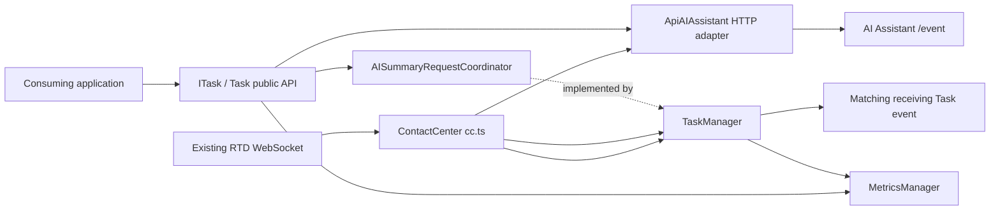
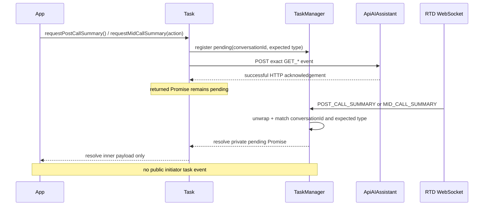
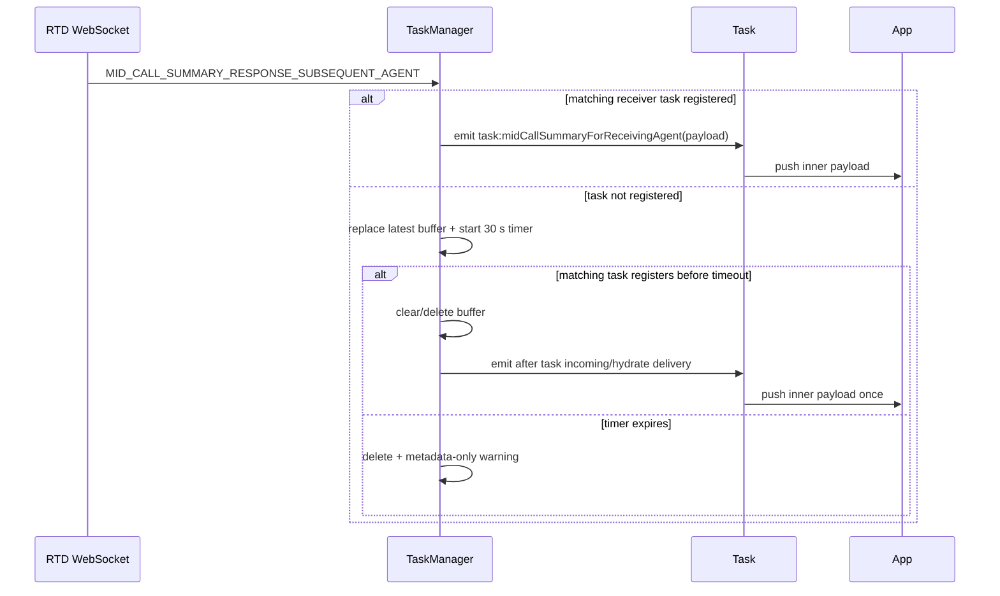

# Contact Center Mid-Call and Post-Call Summary Design

## Overview

This design adds AI-generated post-call and mid-call summary contracts to the existing `@webex/contact-center` workspace. A task initiates post-call or consult/transfer summary generation, the existing AI Assistant HTTP adapter accepts the request, and the existing RTD WebSocket delivers the asynchronous result. Initiator results settle only the request Promise; the receiving-agent result remains the sole new public task event. The existing `wrapup`, `consult`, `transfer`, transcript, suggested-response, task-state, and event contracts are preserved.

The requirement is the target authority. Live source establishes the current state, and the existing `ai-summary*.md` documents are retained only where they agree with it. In particular, this design replaces the prior documents' public initiator-event, organization-only gating, overlapping-request, receiver-fallback, and structured-only response proposals with Promise-only completion, two-level gating, overlap rejection, conversation-only receiver correlation, and structured-or-text fidelity.

Externally visible outcomes are:

- four summary methods implemented once on `Task`, inherited by every SDK-created concrete task, and declared as required members on the SDK-produced `ITask` consumer surface;
- public summary payload/response types and exact backend event constants;
- `cc:featureEnablement` on the contact-center client and `task:midCallSummaryForReceivingAgent` on the matching task;
- deterministic disabled, overlap, transport, timeout, malformed-event, late-event, and cleanup behavior;
- a volatile, per-`conversationId` receiver buffer that retains only the latest subsequent-agent payload for at most 30 seconds, then delivers it when the matching task registers or drops it;
- privacy-safe success and failure metrics for post-call requests, mid-call requests, post-call responses, and mid-call responses, plus one receive metric for every parsed `FEATURE_ENABLEMENT` frame, including repeated and payload-invalid frames.

Constraints and assumptions:

- Node.js 22.14, Yarn 3.4.1, the existing TypeScript/Jest build, and current workspace boundaries remain unchanged.
- `TaskData.interaction.mainInteractionId ?? TaskData.interactionId` is the existing codebase pattern for the stable conversation key. The current task's top-level `interactionId` remains the outbound interaction identifier.
- A successful AI Assistant HTTP response is an acknowledgement only. A valid matching RTD event is required to fulfill a request Promise.
- The SDK does not receive a unique backend request ID, and FR-9 correlates an initiator result by the stable `conversationId` plus its inbound summary type. The pending-registry key is therefore the tuple `(conversationId, AISummaryInboundType)`, not a task or outbound request-event name. Tasks whose `mainInteractionId ?? interactionId` values produce the same conversation key share the slot. This conversation scope is an intentional, documented divergence from FR-12/AC-8's per-task wording. Each entry still records its owning task ID, and request failure or task cleanup removes the entry only when that owner matches, so a sibling task cannot clear a live resolver.
- `CONSULT` and `TRANSFER` both resolve from inbound `MID_CALL_SUMMARY`, so they share one pending slot for a conversation despite using distinct outbound `GET_MID_CALL_CONSULT_SUMMARY` and `GET_MID_CALL_TRANSFER_SUMMARY` names. While either action is pending, the other rejects with `AI_SUMMARY_REQUEST_ALREADY_PENDING`; `POST_CALL_SUMMARY` uses a separate slot.
- No dependency, package, lockfile, schema, persistence, worker, stream, or new SDK configuration key is introduced. The receiver buffer is bounded, process-local memory rather than persistence and is cleared on delivery, replacement, expiry, task cleanup, or SDK deregistration.
- No `AbortSignal` parameter is added because the required public signatures contain none. Cancellation is internal and occurs on HTTP failure, timeout, task cleanup, or SDK deregistration.

Non-goals are a widget, visual treatment, Adaptive Card interpretation, summary generation, backend changes, transcript changes, automatic retry/deduplication, or changes to existing handoff and wrap-up APIs. Application sequencing is documented but cannot be enforced across separate SDK calls: the application owns “wrap up, then response” and “response attempt, then consult/transfer.” If a mid-call summary response fails, the application must catch and record that advisory failure and still proceed with the consult or transfer; the response rejection must not block the core handoff.

## Feature Disposition Matrix

| Fix # | Disposition | Reference |
|---|---|---|
| REQ-001 | Out-of-Scope | requirement.md:L3-L4 -> Branch selection is release-workflow metadata and does not change the SDK design. |
| REQ-002 | Out-of-Scope | requirement.md:L7-L17 -> Section 1 is non-normative document-purpose and reference-routing context; it imposes no independently testable SDK obligation. |
| REQ-003 | Out-of-Scope | requirement.md:L18-L27 -> Section 2 is non-normative background/problem framing; its normative goals and requirements are dispositioned separately below. |
| G-1 | Addressed | requirement.md:L31-L35 -> Change: Consumer sequencing and response semantics |
| G-2 | Addressed | requirement.md:L37-L41 -> Change: Consumer sequencing and response semantics |
| G-3 | Addressed | requirement.md:L43-L47 -> Component: Realtime coordination, correlation, and receiver delivery |
| G-4 | Addressed | requirement.md:L49-L53 -> Component: Public contracts and task API |
| G-5 | Addressed | requirement.md:L55-L59 -> Change: Cross-cutting safeguards and verification |
| REQ-004 | Addressed | requirement.md:L61-L70 -> Change: Cross-cutting safeguards and verification |
| REQ-005 | Addressed | requirement.md:L72-L77 -> Component: Public contracts and task API |
| REQ-006 | Addressed | requirement.md:L78-L78 -> Component: Realtime coordination, correlation, and receiver delivery |
| REQ-007 | Addressed | requirement.md:L79-L79 -> Component: Feature enablement and SDK lifecycle |
| REQ-008 | Addressed | requirement.md:L80-L80 -> Component: Feature enablement and SDK lifecycle |
| REQ-009 | Addressed | requirement.md:L81-L81 -> Component: Realtime coordination, correlation, and receiver delivery |
| REQ-010 | Addressed | requirement.md:L82-L82 -> Component: Realtime coordination, correlation, and receiver delivery |
| REQ-011 | Addressed | requirement.md:L83-L83 -> Component: Public contracts and task API |
| REQ-012 | Addressed | requirement.md:L84-L84 -> Change: Cross-cutting safeguards and verification |
| REQ-013 | Addressed | requirement.md:L85-L85 -> Component: Public contracts and task API |
| REQ-014 | Out-of-Scope | requirement.md:L87-L89 -> The SDK exposes domain data only; a production widget and its visual design belong to consuming applications. |
| REQ-015 | Out-of-Scope | requirement.md:L90-L90 -> Existing `wrapup`, `consult`, and `transfer` APIs are preserved and only sequenced by the consumer. |
| REQ-016 | Out-of-Scope | requirement.md:L91-L91 -> Backend endpoints and backend business logic are external system responsibilities. |
| REQ-017 | Out-of-Scope | requirement.md:L92-L92 -> Summary generation remains an AI Assistant backend responsibility. |
| REQ-018 | Out-of-Scope | requirement.md:L93-L93 -> Adaptive Card rendering and interpretation remain consumer responsibilities. |
| REQ-019 | Out-of-Scope | requirement.md:L94-L94 -> Existing real-time transcript behavior is explicitly preserved. |
| REQ-020 | Out-of-Scope | requirement.md:L95-L95 -> No SDK retry loop or backend deduplication behavior is added. |
| REQ-021 | Addressed | requirement.md:L97-L104 -> Component: Public contracts and task API |
| REQ-022 | Addressed | requirement.md:L105-L105 -> Component: Public contracts and task API |
| REQ-023 | Addressed | requirement.md:L106-L106 -> Component: Public contracts and task API |
| REQ-024 | Addressed | requirement.md:L107-L107 -> Component: Public contracts and task API |
| REQ-025 | Addressed | requirement.md:L108-L108 -> Component: Public contracts and task API |
| REQ-026 | Addressed | requirement.md:L110-L110 -> Component: Feature enablement and SDK lifecycle |
| REQ-027 | Addressed | requirement.md:L112-L116 -> Component: Feature enablement and SDK lifecycle |
| REQ-028 | Addressed | requirement.md:L117-L117 -> Component: Realtime coordination, correlation, and receiver delivery |
| REQ-029 | Addressed | requirement.md:L119-L119 -> Component: Realtime coordination, correlation, and receiver delivery |
| REQ-030 | Addressed | requirement.md:L121-L125 -> Component: AI Assistant transport and outbound serialization |
| REQ-031 | Addressed | requirement.md:L126-L126 -> Component: AI Assistant transport and outbound serialization |
| REQ-032 | Addressed | requirement.md:L127-L127 -> Component: AI Assistant transport and outbound serialization |
| REQ-033 | Addressed | requirement.md:L128-L128 -> Component: AI Assistant transport and outbound serialization |
| REQ-034 | Addressed | requirement.md:L129-L129 -> Component: AI Assistant transport and outbound serialization |
| REQ-035 | Addressed | requirement.md:L130-L130 -> Component: AI Assistant transport and outbound serialization |
| REQ-036 | Addressed | requirement.md:L132-L134 -> Component: Feature enablement and SDK lifecycle |
| REQ-037 | Addressed | requirement.md:L135-L135 -> Component: Realtime coordination, correlation, and receiver delivery |
| REQ-038 | Addressed | requirement.md:L136-L136 -> Component: Realtime coordination, correlation, and receiver delivery |
| REQ-039 | Addressed | requirement.md:L137-L139 -> Component: Realtime coordination, correlation, and receiver delivery |
| FR-1 | Addressed | requirement.md:L143-L153 -> Component: Feature enablement and SDK lifecycle |
| FR-2 | Addressed | requirement.md:L155-L164 -> Component: Public contracts and task API |
| FR-3 | Addressed | requirement.md:L166-L180 -> Change: Consumer sequencing and response semantics |
| FR-4 | Addressed | requirement.md:L182-L191 -> Component: Public contracts and task API |
| FR-5 | Addressed | requirement.md:L193-L209 -> Component: AI Assistant transport and outbound serialization |
| FR-6 | Addressed | requirement.md:L211-L215 -> Change: Consumer sequencing and response semantics |
| FR-7 | Addressed | requirement.md:L217-L236 -> Change: Consumer sequencing and response semantics |
| FR-8 | Addressed | requirement.md:L238-L248 -> Component: Realtime coordination, correlation, and receiver delivery |
| FR-9 | Addressed | requirement.md:L250-L256 -> Component: Realtime coordination, correlation, and receiver delivery |
| FR-10 | Addressed | requirement.md:L258-L264 -> Component: Realtime coordination, correlation, and receiver delivery |
| FR-11 | Addressed | requirement.md:L266-L275 -> Component: Realtime coordination, correlation, and receiver delivery |
| FR-12 | Addressed | requirement.md:L277-L281 -> Component: Realtime coordination, correlation, and receiver delivery; documented divergence: because FR-9 supplies no task/request identifier for inbound correlation, the pending key is `(conversationId, inbound summary type)` rather than per task, with task ID retained only as a cleanup ownership guard. |
| DR-1 | Addressed | requirement.md:L285-L291 -> Component: AI Assistant transport and outbound serialization |
| DR-2 | Addressed | requirement.md:L293-L300 -> Component: Public contracts and task API |
| DR-3 | Addressed | requirement.md:L302-L308 -> Component: AI Assistant transport and outbound serialization |
| DR-4 | Addressed | requirement.md:L310-L318 -> Component: Public contracts and task API |
| DR-5 | Addressed | requirement.md:L320-L324 -> Component: Realtime coordination, correlation, and receiver delivery |
| REQ-040 | Addressed | requirement.md:L326-L330 -> Component: Public contracts and task API |
| REQ-041 | Addressed | requirement.md:L331-L331 -> Component: Public contracts and task API |
| REQ-042 | Addressed | requirement.md:L332-L332 -> Component: AI Assistant transport and outbound serialization |
| REQ-043 | Addressed | requirement.md:L333-L333 -> Component: AI Assistant transport and outbound serialization |
| REQ-044 | Addressed | requirement.md:L334-L334 -> Component: Realtime coordination, correlation, and receiver delivery |
| REQ-045 | Addressed | requirement.md:L335-L335 -> Component: Realtime coordination, correlation, and receiver delivery |
| REQ-046 | Addressed | requirement.md:L336-L336 -> Component: Realtime coordination, correlation, and receiver delivery |
| REQ-047 | Addressed | requirement.md:L337-L337 -> Component: Realtime coordination, correlation, and receiver delivery |
| REQ-048 | Addressed | requirement.md:L338-L338 -> Component: Realtime coordination, correlation, and receiver delivery |
| REQ-049 | Addressed | requirement.md:L340-L340 -> Change: Cross-cutting safeguards and verification |
| PR-1 | Addressed | requirement.md:L344-L354 -> Change: Cross-cutting safeguards and verification |
| PR-2 | Addressed | requirement.md:L356-L368 -> Change: Cross-cutting safeguards and verification |
| PR-3 | Addressed | requirement.md:L370-L374 -> Change: Cross-cutting safeguards and verification |
| REQ-050 | Addressed | requirement.md:L376-L378 -> Change: Cross-cutting safeguards and verification |
| REQ-051 | Addressed | requirement.md:L379-L379 -> Change: Cross-cutting safeguards and verification |
| REQ-052 | Addressed | requirement.md:L380-L380 -> Change: Cross-cutting safeguards and verification |
| REQ-053 | Addressed | requirement.md:L381-L381 -> Change: Cross-cutting safeguards and verification |
| REQ-054 | Addressed | requirement.md:L382-L382 -> Component: Feature enablement and SDK lifecycle |
| REQ-055 | Addressed | requirement.md:L383-L385 -> Change: Cross-cutting safeguards and verification |
| REQ-056 | Addressed | requirement.md:L387-L398 -> Change: Cross-cutting safeguards and verification |
| REQ-057 | Addressed | requirement.md:L400-L401 -> Change: Cross-cutting safeguards and verification |
| AC-1 | Addressed | requirement.md:L402-L408 -> Change: Cross-cutting safeguards and verification |
| AC-2 | Addressed | requirement.md:L410-L412 -> Change: Cross-cutting safeguards and verification |
| AC-3 | Addressed | requirement.md:L414-L416 -> Change: Cross-cutting safeguards and verification |
| AC-4 | Addressed | requirement.md:L418-L420 -> Change: Cross-cutting safeguards and verification |
| AC-5 | Addressed | requirement.md:L422-L424 -> Change: Cross-cutting safeguards and verification |
| AC-6 | Addressed | requirement.md:L426-L428 -> Change: Cross-cutting safeguards and verification |
| AC-7 | Addressed | requirement.md:L430-L432 -> Change: Cross-cutting safeguards and verification |
| AC-8 | Addressed | requirement.md:L434-L436 -> Component: Realtime coordination, correlation, and receiver delivery; documented divergence: overlap is conversation-scoped rather than per task, and `CONSULT`/`TRANSFER` cross-action requests reject while their shared inbound `MID_CALL_SUMMARY` slot is occupied. |
| AC-9 | Addressed | requirement.md:L438-L440 -> Change: Cross-cutting safeguards and verification |
| AC-10 | Addressed | requirement.md:L442-L444 -> Change: Cross-cutting safeguards and verification |
| AC-11 | Addressed | requirement.md:L446-L448 -> Change: Cross-cutting safeguards and verification |

## Current State and Reuse Analysis

The implementation stays inside `packages/@webex/contact-center`. The following decisions are grounded in the inspected source rather than the repository code map.

| Current surface | Evidence and existing behavior | Classification | Target decision |
|---|---|---|---|
| `src/services/ApiAiAssistant.ts` | `ApiAIAssistant` already owns AI Assistant URL resolution, authenticated `webex.request` calls, organization lookup, error augmentation, and generic transcript/suggestion events. | Extend | Reuse `getBaseUrl()`, credentials, `/event`, `HTTP_METHODS.POST`, and error conventions; add summary-specific serializers because generic `sendEvent()` emits a string timestamp and lacks the required double identifier/response fields. |
| `src/services/task/Task.ts` and `src/services/task/types.ts` | `Task` is the shared base for voice, WebRTC, and digital tasks; `ITask` is the public contract. Existing wrap-up/consult/transfer methods are independent Promises. | Extend | Add the four APIs once on `Task`/`ITask`, so every existing subclass inherits them without constructor or behavior duplication. Existing call-control methods remain untouched. |
| `src/services/task/TaskManager.ts` | Owns the task registry, parses RTD frames, maps `data.data.conversationId` to tasks for transcripts/suggestions, and controls task cleanup. | Extend | Own latest interaction enablement, private pending resolvers, exact event-type correlation, the receiver buffer, and summary cleanup. Preserve transcript/suggestion dispatch. |
| `src/services/task/TaskUtils.ts` | Existing helpers repeatedly prefer `mainInteractionId` and otherwise use `interactionId` as the stable call identity. | Extend | Add one exported `getAISummaryCorrelation()` helper and reuse it from Task and TaskManager; do not duplicate correlation rules. |
| `src/cc.ts` | Creates the AI adapter and TaskManager, forwards RTD messages, connects RTD only for transcripts/suggestions, re-triggers public events, and owns deregistration. | Extend | Include either generated-summary organization switch in RTD connection criteria, forward feature enablement, and clear summary resources on deregistration. Add no root method. |
| `src/services/config/types.ts` | `AIFeatureFlags.generatedSummaries` already exposes optional `wrapUpSummariesEnabled` and `consultTransferSummariesEnabled`; raw `POST_CALL_SUMMARY` and `MID_CALL_SUMMARY` names already exist in `CC_TASK_EVENTS`. | Preserve and extend | Keep both optional switches, add a cohesive RTD summary-event constant group, retain existing string values, and add feature/subsequent-agent names. No new config key. |
| `src/types.ts`, `src/services/agent/types.ts`, `src/services/task/types.ts`, `src/index.ts` | Runtime const-object/enums plus explicit public-barrel exports are the package convention. Existing generic mid-call constants are already published internally. | Extend | Add exact consult/transfer constants without removing generic values, add the two public events, and explicitly export all public summary contracts from `src/index.ts`. |
| `src/metrics/MetricsManager.ts` and `src/metrics/constants.ts` | Singleton metrics manager supports timed named events and filters unsupported metadata values. | Preserve and extend | Reuse the manager unchanged; add named operational metric constants and emit metadata-only fields. |
| `ai-summary.md` and the three `ai-summary-*-flow.md` files | They contain useful transport shapes and flow evidence, but `ai-summary.md` still proposes public initiator events, organization-only gating, fallback receiver correlation, overlapping requests, and structured-only assumptions. | Replace only conflicting decisions | Keep valid wire shapes, response sequencing, double-envelope handling, and privacy rules. Update conflicting content to this requirement rather than preserving stale compatibility. |
| Existing task lifecycle, state machine, transcript, suggested response, WebRTC, and contact APIs | These paths are operational and separately tested. | Preserve | No source or public behavior is removed. Summary failures never enter the task state machine or alter core call-control outcomes. |

There is no prior `design/default/design_spec.md`, no `.sdd/manifest.json`, and no canonical design artifact to reconcile. The requirement-linked `ai-summary*.md` files are protected as source context for future implementation, not overwritten by this design-phase task.

Reuse follows DRY/KISS/SOLID as follows:

- The existing AI HTTP adapter remains the only dependency on Webex request/credentials.
- The existing Task base remains the only public task API implementation point.
- TaskManager remains the only owner of task registration and inbound RTD correlation.
- A concrete internal coordinator interface is introduced only as the dependency seam between `Task` and `TaskManager`; no factory/service layer is added.
- No new source file is justified: `AISummaryService.ts` would duplicate `ApiAIAssistant`, an `AISummaryCoordinator.ts` would split TaskManager's existing registry/RTD ownership, and a summary state machine would incorrectly couple advisory summary state to core task lifecycle.

## Target Architecture and Package Layout

Dependency direction remains acyclic:



Layer responsibilities and handoffs:

| Layer | Owns | Must not own |
|---|---|---|
| Consumer application | visual presentation, editing/copy/view observations, wrap-up/consult/transfer ordering, final `agentName` and wrap-up code selection | transport envelopes, correlation maps, timeout timers |
| `Task` | public signatures, runtime argument validation, two-level gating, correlation derivation, outbound operation metrics | task registry, WebSocket parsing, UI state, consult/transfer invocation |
| `TaskManager` | latest feature state, pending Promise state, RTD parsing/correlation, receiver buffer, lifecycle cleanup | HTTP body construction, summary rewriting, core task transitions |
| `ApiAIAssistant` | base URL, auth/org lookup, exact request/response wire serialization | task lookup, feature gating, public event delivery |
| `ContactCenter` | RTD connection lifecycle and public client feature event | new summary request methods or payload mutation |

Producer/consumer contracts:

- `Task.request*` registers with `TaskManager` before asking `ApiAIAssistant` to send; TaskManager resolves/rejects that exact Promise.
- `cc.handleRTDWebsocketMessage` forwards the raw frame once; TaskManager performs the only JSON/double-envelope parse.
- TaskManager emits every valid `FEATURE_ENABLEMENT` internally; `cc.ts` re-triggers it as `cc:featureEnablement` without deduplication.
- TaskManager emits the unwrapped subsequent-agent payload only on the task whose derived conversation key matches the inbound `conversationId`.
- `Task.send*Response` passes a validated consumer payload plus SDK-derived identifiers to `ApiAIAssistant`; the adapter whitelists the wire fields.

File actions:

| Action | Exact files | Responsibility |
|---|---|---|
| Modify | `packages/@webex/contact-center/src/types.ts`, `src/constants.ts`, `src/index.ts`, `src/services/task/constants.ts` | exact backend constants, API/task method names, timeout constants, public exports |
| Modify | `packages/@webex/contact-center/src/services/config/types.ts`, `src/services/agent/types.ts`, `src/services/task/types.ts` | raw inbound names, public events, payloads, response unions, coordinator contract, `ITask` methods |
| Modify | `packages/@webex/contact-center/src/services/task/TaskUtils.ts`, `src/services/task/Task.ts`, `src/services/task/TaskManager.ts` | correlation helper, public APIs, pending state, inbound routing, receiver buffer |
| Modify | `packages/@webex/contact-center/src/services/ApiAiAssistant.ts`, `src/cc.ts`, `src/metrics/constants.ts` | wire adapter, lifecycle/public forwarding, metrics names |
| Modify tests | `packages/@webex/contact-center/test/unit/spec/services/ApiAiAssistant.ts`, `services/task/Task.ts`, `services/task/TaskManager.ts`, `services/task/TaskUtils.ts`, `cc.ts` | focused contract, timer, correlation, privacy, and regression coverage |
| Synchronize during implementation | `ai-summary.md`, `ai-summary-postcall-flow.md`, `ai-summary-initiator-flow.md`, `ai-summary-receiver-flow.md`, task/agent/metrics `ai-docs` listed in the DAG | eliminate conflicting guidance and preserve valid implementation references |
| Add | None | Existing modules already have each required responsibility. |
| Remove | None | The feature is additive; stale statements are revised in place rather than files or public symbols being deleted. |

`package.json`, `yarn.lock`, TypeScript/Jest/Babel configuration, state-machine files, task subclasses, sample applications, browser assets, and backend schemas remain unchanged.

The published type output does change: the existing `package.json` `types` export points at generated `dist/types/index.d.ts`, and `build:src` must emit the four required summary methods on `ITask` plus the new payload/event types from the root barrel. This needs no package manifest, export-map, compiler, bundler, or dependency change, but it is an intentional addition to the public declaration surface and is verified by the source build and type-level tests described below.

## Component: Public contracts and task API

Requirements covered: G-1, G-2, G-4, G-5, REQ-005, REQ-011, REQ-013, REQ-021, REQ-022, REQ-023, REQ-024, REQ-025, FR-1, FR-2, FR-3, FR-4, FR-5, FR-10, FR-11, FR-12, DR-1, DR-2, DR-3, DR-4, REQ-040, REQ-041, REQ-042, REQ-043, REQ-044, and REQ-045. Corresponding DAG tasks: `define-ai-summary-contracts` and `expose-task-summary-apis`.

### Files and symbols

- Extend `packages/@webex/contact-center/src/services/task/types.ts` with all domain payloads below, `AISummaryRequestCoordinator`, the four `ITask` methods, and `TASK_EVENTS.TASK_MID_CALL_SUMMARY_FOR_RECEIVING_AGENT = 'task:midCallSummaryForReceivingAgent'`.
- Extend `packages/@webex/contact-center/src/types.ts` with the six exact summary request/response names while retaining the existing generic names for additive compatibility.
- Extend `packages/@webex/contact-center/src/services/task/constants.ts` with `METHODS.REQUEST_POST_CALL_SUMMARY`, `SEND_POST_CALL_SUMMARY_RESPONSE`, `REQUEST_MID_CALL_SUMMARY`, `SEND_MID_CALL_SUMMARY_RESPONSE`, `HANDLE_AI_SUMMARY_EVENT`, and `CLEAR_AI_SUMMARY_STATE`, plus `AI_SUMMARY_REQUEST_TIMEOUT_MS = 30_000` and `AI_SUMMARY_RECEIVER_BUFFER_TIMEOUT_MS = 30_000`. Extend root `packages/@webex/contact-center/src/constants.ts` only with the adapter method names `METHODS.SEND_SUMMARY_GET_EVENT` and `METHODS.SEND_SUMMARY_RESPONSE_EVENT`, matching the existing split between Task and API constants.
- Extend `packages/@webex/contact-center/src/index.ts` to export the public payload/state/action/feedback types, `AIAssistantEventName`, `TASK_EVENTS`, and `AGENT_EVENTS`. No root-client method is added.
- Modify `packages/@webex/contact-center/src/services/task/Task.ts` once; `Voice`, `WebRTC`, and `Digital` inherit the methods unchanged.
- Add focused cases to `packages/@webex/contact-center/test/unit/spec/services/task/Task.ts`; no new test file is needed because the configured Jest target already discovers it.

### Public data model

The public type names and field contracts are:

```ts
export type AISummaryActionType = 'CONSULT' | 'TRANSFER';
export type AISummaryFeedback = 'none' | 'thumbs_up' | 'thumbs_down';
export type PostCallSummaryState = 'DEFAULT' | 'IGNORED' | 'NOT_RECEIVED';
export type MidCallSummaryState =
  | 'DEFAULT'
  | 'EXCLUDED'
  | 'IGNORED'
  | 'MID_CALL_CANCELLED'
  | 'NOT_RECEIVED';

export type PostCallSummarySections = {
  initialContactReason?: string;
  additionalContactReasons?: string;
  additionalContext?: string;
  keyActionsTaken?: string;
  nextSteps?: string;
};

export type MidCallSummarySections = {
  reasonForTransferOrConsult?: string;
  additionalContext?: string;
  keyActionsTaken?: string;
};

export type SummaryCounters = {
  numberOfTimesViewed: number;
  numberOfTimesEdited: number;
  numberOfTimesCopied: number;
};

export type PostCallSummaryEventPayload = {
  conversationId: string;
  adaptiveCard?: Record<string, unknown>;
  adaptiveCardId?: string;
  editAdaptiveCard?: Record<string, unknown>;
  editAdaptiveCardId?: string;
  languageCode?: string;
  summaryText?: string;
  resolution?: string;
  areTranscriptsAvailable?: boolean;
  sections?: PostCallSummarySections;
  suggestedWrapUpCodes?: Array<{name: string; [key: string]: unknown}>;
  suggestedWrapUpCodesMessage?: string;
  timestamp?: number;
  [key: string]: unknown;
};

export type MidCallSummaryEventPayload = {
  conversationId: string;
  adaptiveCard?: Record<string, unknown>;
  adaptiveCardId?: string;
  editAdaptiveCard?: Record<string, unknown>;
  editAdaptiveCardId?: string;
  languageCode?: string;
  summaryText?: string;
  resolution?: string;
  areTranscriptsAvailable?: boolean;
  sections?: MidCallSummarySections;
  timestamp?: number;
  [key: string]: unknown;
};

export type MidCallSummaryReceivingAgentPayload = {
  conversationId: string;
  adaptiveCard?: Record<string, unknown>;
  adaptiveCardId?: string;
  languageCode?: string;
  resolution?: string;
  summaryText?: string;
  timestamp?: number;
  [key: string]: unknown;
};

export type FeatureEnablementEventPayload = {
  interactionId: string;
  midCallEnabled?: boolean;
  postCallEnabled?: boolean;
  actionTimestamp?: number;
  [key: string]: unknown;
};
```

Optional inbound fields reflect backend evolution and the requirement that missing per-interaction values behave as disabled. The string-key extension retains unknown backend domain fields at the type boundary. At runtime, TaskManager forwards the original inner payload object; it does not project the object through these types or strip unknown fields. `null`, an array, a missing/empty correlation identifier, or a non-object inner payload is malformed and is dropped.

Consumer response types intentionally exclude `agentId`, `orgId`, `interactionId`, `conversationId`, `publishTimestamp`, and `actionTimeStamp`. Those are transport fields derived by the SDK, preventing mismatched caller-provided correlation and implementing DR-1. They also exclude `wrapUpCode` from the mid-call shape so TypeScript rejects that invalid combination.

```ts
type PostCallReceivedResponse = SummaryCounters & {
  summary: PostCallSummarySections | string;
  feedback: AISummaryFeedback;
  state: 'DEFAULT' | 'IGNORED';
  wrapUpCode: string;
};

type PostCallNotReceivedResponse = {
  summary: '';
  numberOfTimesViewed: 0;
  numberOfTimesEdited: 0;
  numberOfTimesCopied: 0;
  feedback: AISummaryFeedback;
  state: 'NOT_RECEIVED';
  wrapUpCode: string;
};

export type PostCallSummaryResponsePayload =
  | PostCallReceivedResponse
  | PostCallNotReceivedResponse;

type MidCallReceivedResponse = SummaryCounters & {
  summary: MidCallSummarySections | string;
  feedback: AISummaryFeedback;
  state: 'DEFAULT' | 'EXCLUDED' | 'IGNORED' | 'MID_CALL_CANCELLED';
  agentName: string;
};

type MidCallUnavailableResponse = {
  summary: '';
  numberOfTimesViewed: 0;
  numberOfTimesEdited: 0;
  numberOfTimesCopied: 0;
  feedback: AISummaryFeedback;
  state: 'NOT_RECEIVED' | 'MID_CALL_CANCELLED';
  agentName: string;
};

export type MidCallSummaryResponsePayload =
  | MidCallReceivedResponse
  | MidCallUnavailableResponse;
```

All counters are finite, non-negative numbers and are forwarded unchanged; they are not parsed, stringified, clamped, hardcoded, or collapsed to booleans. The no-summary union encodes literal zero values. Structured summary fields remain optional strings, a plain-text summary remains a string, and an unavailable summary is exactly `''`; `null`/`undefined` are invalid. `wrapUpCode` and `agentName` must be non-empty strings but are serialized without trimming or rewriting. `feedback` and state use the exact closed vocabularies above.

### Public and internal signatures

```ts
export interface ITask extends IEventEmitter {
  requestPostCallSummary(): Promise<PostCallSummaryEventPayload>;
  sendPostCallSummaryResponse(payload: PostCallSummaryResponsePayload): Promise<void>;
  requestMidCallSummary(actionType: AISummaryActionType): Promise<MidCallSummaryEventPayload>;
  sendMidCallSummaryResponse(
    payload: MidCallSummaryResponsePayload,
    actionType: AISummaryActionType
  ): Promise<void>;
}

export type AISummaryInboundType = 'POST_CALL_SUMMARY' | 'MID_CALL_SUMMARY';

export interface AISummaryRequestCoordinator {
  getFeatureEnablement(interactionId: string): FeatureEnablementEventPayload | undefined;
  registerPendingAISummaryRequest<T>(
    taskId: string,
    conversationId: string,
    eventType: AISummaryInboundType,
    timeoutCode: 'POST_CALL_SUMMARY_TIMEOUT' | 'MID_CALL_SUMMARY_TIMEOUT'
  ): Promise<T>;
  cancelPendingAISummaryRequest(
    taskId: string,
    conversationId: string,
    eventType: AISummaryInboundType
  ): void;
}
```

`ITask` is an SDK-produced output contract, not an application extension point. In the live package, only the SDK-owned abstract `Task` implements it, all concrete instances originate in the internal `TaskFactory`, and no public API accepts a consumer-supplied `ITask` implementation. The four members are therefore required rather than optional so applications consuming an SDK task get the exact callable signatures without feature-method existence checks; `Voice`, `WebRTC`, and `Digital` inherit the same runtime implementation from `Task`.

This is runtime- and source-additive for the supported consumption model, but adding required members to the exported interface is still observable in TypeScript structural typing. A downstream project that chose to implement all of `ITask`, or declared a complete hand-written `ITask` mock, must add the four methods when compiling against the new declarations. That unsupported implementation pattern is not covered by G-5's no-migration promise because the SDK never consumes such objects. Repository tests, published examples, and recommended downstream test doubles must use an SDK-created task or a purpose-scoped `Pick<ITask, ...>`/`Partial<ITask>` instead of claiming to implement the complete SDK-owned interface; this shields existing behavior-focused doubles from future capability additions.

`Task.configureAISummary` is package-internal and is not added to `ITask` or `src/index.ts`:

```ts
public configureAISummary(
  apiAIAssistant: Pick<ApiAIAssistant, 'sendSummaryGetEvent' | 'sendSummaryResponseEvent'>,
  coordinator: AISummaryRequestCoordinator,
  generatedSummaries?: AIFeatureFlags['generatedSummaries']
): void;
```

TaskManager invokes it for every newly managed task. This avoids changing `Voice`, `WebRTC`, and `Digital` constructors or exposing TaskManager publicly. A defensive call on an unconfigured Task rejects `AI_SUMMARY_NOT_INITIALIZED` without touching the backend.

### Request control flow and state

For `requestPostCallSummary()`:

1. Read organization `generatedSummaries.wrapUpSummariesEnabled` captured at task configuration and the latest `coordinator.getFeatureEnablement(task.data.interactionId)?.postCallEnabled`. Both must be exactly `true`; otherwise reject with augmented `POST_CALL_SUMMARY_DISABLED` and do no backend work.
2. Derive `{interactionId, conversationId}` with `getAISummaryCorrelation(task.data)` and require the configured `agentId`.
3. Call `registerPendingAISummaryRequest(taskId, conversationId, 'POST_CALL_SUMMARY', 'POST_CALL_SUMMARY_TIMEOUT')` before HTTP. The key is `(conversationId, 'POST_CALL_SUMMARY')`; `taskId` is stored as the entry owner but is not part of the key. A same-key pending entry throws/rejects `AI_SUMMARY_REQUEST_ALREADY_PENDING`; therefore the HTTP method is never called for overlap.
4. Start `sendSummaryGetEvent(..., GET_POST_CALL_SUMMARY)` and await it together with the already-registered pending Promise using `Promise.all([acknowledgementPromise, summaryPromise])`. This attaches rejection handlers to both immediately, returns only after HTTP acknowledgement and inbound resolution, permits a push to win the race without being lost, and lets the 30-second timer reject even if HTTP is still outstanding.
5. On either rejection, synchronously call `cancelPendingAISummaryRequest(taskId, conversationId, eventType)` and rethrow the first detailed error. TaskManager deletes the entry/timer only if its stored owner equals `taskId`; a timeout entry is already absent, and a task whose overlap registration was rejected cannot cancel the sibling owner's live entry. The still-running HTTP Promise has the handler installed by `Promise.all`, so it cannot create an unhandled rejection. On success, return only the summary element. Only TaskManager can resolve it from a matching inbound event.

`requestMidCallSummary(actionType)` uses the same steps with the two mid-call flags, the single pending type `MID_CALL_SUMMARY`, timeout `MID_CALL_SUMMARY_TIMEOUT`, and exact action mapping `CONSULT -> GET_MID_CALL_CONSULT_SUMMARY`, `TRANSFER -> GET_MID_CALL_TRANSFER_SUMMARY`. Any other runtime value rejects `AI_SUMMARY_INVALID_ACTION_TYPE` before registration or HTTP. Consult and transfer requests therefore overlap with each other because both await the same inbound type, while a simultaneous post-call request uses an independent key.

Promise callbacks run through the normal JavaScript microtask queue. Timer callbacks and WebSocket handlers are separate event-loop tasks; registering first prevents a fast push from being lost. Map deletion occurs before `resolve`/`reject`, making reentrant sequential calls legal. There is no public abort signal or subscription to remove.

### Response control flow and validation

Both response APIs synchronously validate the runtime object inside their async method and therefore expose failures as rejected Promises. Validation rejects `AI_SUMMARY_INVALID_RESPONSE_PAYLOAD` before HTTP when the object is null/array, a counter is non-finite/negative, summary representation is invalid, feedback/state is outside its allowlist, required string is empty, or a no-summary branch has nonzero counters. A mid-call payload containing an own `wrapUpCode` property is rejected even from untyped JavaScript; it is never silently serialized as `null`.

For a received `MID_CALL_CANCELLED` summary, `numberOfTimesViewed` must be at least `1`; edited/copied values remain the supplied non-negative counts. For a cancelled or `NOT_RECEIVED` flow without a summary, `summary` and all counters must match the literal empty/zero branch. The SDK does not infer whether the application displayed, edited, or copied content.

After validation, Task derives identifiers and selects the response event (`POST_CALL_SUMMARY_RESPONSE`, `MID_CALL_CONSULT_SUMMARY_RESPONSE`, or `MID_CALL_TRANSFER_SUMMARY_RESPONSE`). It passes a new whitelisted internal object to the adapter; it never spreads the caller payload into the transport envelope. It resolves `void` only after the HTTP call succeeds and rejects with the adapter's detailed error otherwise.

### Failure, configuration, security, compatibility, and lifecycle

- Missing organization or per-interaction flags are disabled, never “unknown enabled.”
- Base URL and HTTP failures retain `ApiAIAssistant` error translation. There is no retry.
- Task logs and metrics include only operation/event name, identifiers allowed by existing policy, action type, numeric counters, state, feedback, card identifiers, and error code. Summary/card/section values and `agentName` are never passed to logging or metrics.
- Public additions preserve supported consumer compatibility: SDK-created tasks gain methods and existing generic AI event constants, methods, and events remain unchanged. The generated `ITask` declaration gains four required members; full structural implementations/mocks outside the supported output-only model need four stubs or must narrow their test type with `Pick`/`Partial` as described above.
- Storage/schema migration: Not applicable - all state is in-memory and bounded to task/SDK lifetime.
- Worker/process/stream lifecycle: Not applicable - the package uses the existing browser/Node event loop and RTD socket.

### Named tests

`Task.ts` unit scenarios: post-call/mid-call enabled happy paths; missing organization flag; false/missing interaction flag; invalid action; exact consult/transfer event selection; registration before HTTP; owner ID passed on HTTP cleanup; transport rejection propagation; structured/text/empty response preservation; numeric counter pass-through including values greater than one; invalid numeric strings/NaN/negative values; feedback/state allowlists; required wrap-up code/agent name; mid-call `wrapUpCode` rejection; cancellation with and without a received summary; pending `CONSULT` followed by `TRANSFER` rejecting before a second HTTP call; no public initiator event; and sequential request after settlement. These cover AC-1 through AC-4, AC-6, and the task side of AC-7/AC-8.

## Component: AI Assistant transport and outbound serialization

Requirements covered: REQ-030, REQ-031, REQ-032, REQ-033, REQ-034, REQ-035, FR-2, FR-3, FR-4, FR-5, DR-1, DR-3, REQ-042, REQ-043, PR-1, and PR-2. Corresponding DAG task: `add-ai-summary-transport`.

### Files, responsibilities, and signatures

Modify `packages/@webex/contact-center/src/services/ApiAiAssistant.ts` and its existing test `packages/@webex/contact-center/test/unit/spec/services/ApiAiAssistant.ts`. Reuse private `getBaseUrl()`, `this.webex.credentials.getOrgId()`, `AI_ASSISTANT_API_URLS.EVENT`, `HTTP_METHODS.POST`, `addAuthHeader: true`, and `getErrorDetails`. Do not route summary calls through generic `sendEvent()` because its current `actionTimeStamp` is a string and its shape has no `conversationId`, top-level `publishTimestamp`, or response fields.

```ts
type SummaryGetEventName =
  | 'GET_POST_CALL_SUMMARY'
  | 'GET_MID_CALL_CONSULT_SUMMARY'
  | 'GET_MID_CALL_TRANSFER_SUMMARY';

type SummaryResponseEventName =
  | 'POST_CALL_SUMMARY_RESPONSE'
  | 'MID_CALL_CONSULT_SUMMARY_RESPONSE'
  | 'MID_CALL_TRANSFER_SUMMARY_RESPONSE';

public async sendSummaryGetEvent(
  agentId: string,
  interactionId: string,
  conversationId: string,
  eventName: SummaryGetEventName
): Promise<void>;

public async sendSummaryResponseEvent(
  agentId: string,
  payload: AISummaryResponseTransportPayload
): Promise<void>;
```

`AISummaryResponseTransportPayload` is an internal discriminated union in `src/types.ts`: the post-call member has `eventName: 'POST_CALL_SUMMARY_RESPONSE'`, identifiers, summary, counters, feedback, post-call state, and a required `wrapUpCode`; the two mid-call members have their variant event name, identifiers, summary, counters, feedback, mid-call state, and `agentName`, with no `wrapUpCode` field.

### Wire contract

Both methods validate non-empty `agentId`, `orgId`, `interactionId`, and `conversationId`. A request captures one `const now = Date.now()` and uses that number for both `publishTimestamp` and `actionTimeStamp`.

```ts
{
  agentId,
  orgId,
  eventType: AIAssistantEventType.CTI_EVENT,
  eventName,
  publishTimestamp: now,
  eventDetails: {
    data: {
      interactionId,
      conversationId,
      clientType: 'WxCC',
      actionTimeStamp: now,
      // response only: action: eventName and whitelisted response fields
    }
  }
}
```

The request body has no summary fields. A response adds `action: eventName`, `summary`, the three number counters, `feedback`, `state`, and exactly one flow-specific field: post-call `wrapUpCode` or mid-call `agentName`. `undefined` fields are not intentionally serialized. The adapter does not inspect, flatten, normalize, or rewrite a structured/text summary. It does not stringify numbers. The HTTP response body is ignored, and any successful `webex.request` completion is treated as acknowledgement; the request Promise still waits on TaskManager.

### Control flow and failures

1. Resolve the existing environment-specific base URL; missing/unknown gateway rejects `AI_ASSISTANT_BASE_URL_NOT_AVAILABLE` before `webex.request`.
2. Resolve `orgId`, validate all identifiers and the event-name union, and construct a new whitelisted body.
3. POST once to `${baseUrl}${AI_ASSISTANT_API_URLS.EVENT}`. Do not auto-retry any status/network failure.
4. Resolve `void` on success. On failure, use `getErrorDetails(error, methodName, CC_FILE)` and rethrow; Task owns the one operation-level success/failure metric so transport acknowledgement and eventual request completion are not double-counted.

Serialization has no persistence mapping. Authorization and authentication remain the existing Webex auth header. The adapter's logger context must omit the request body, `summary`, structured section values, Adaptive Card bodies, and `agentName`; safe identifiers and `eventName` are sufficient.

Configuration reuses `WCC_API_GATEWAY`, `AI_ASSISTANT_ENV_MAP`, `AI_ASSISTANT_BASE_URL_TEMPLATE`, and `AI_ASSISTANT_API_URLS.EVENT`; no new endpoint/configuration/dependency is introduced. Compatibility is additive because generic `sendEvent()` and existing transcript/suggestion methods retain their signatures and serialization. Resource lifecycle is limited to one awaited `webex.request` Promise; the adapter owns no timer, listener, stream, or retained response body. Observability is owned by the Task-level operation metric, with adapter logs limited to safe request metadata.

### Named tests

`ApiAiAssistant.ts` unit scenarios: exact GET body for each of three request event names; exact response body for post-call and both mid-call variants; one numeric timestamp reused in both positions under fake time; counters greater than one unchanged; structured object/plain text/empty string unchanged; mid-call body has no `wrapUpCode` key; post-call body has no `agentName`; successful response resolves `void`; missing base URL and request rejection propagate; only one HTTP attempt; and logger/metric spies receive none of the forbidden content. These are contract tests at the adapter boundary and support AC-1 through AC-4 and AC-10.

## Component: Realtime coordination, correlation, and receiver delivery

Requirements covered: G-3, G-4, REQ-006, REQ-009, REQ-010, REQ-028, REQ-029, REQ-037, REQ-038, REQ-039, FR-1, FR-2, FR-4, FR-8, FR-9, FR-10, FR-11, FR-12, DR-5, REQ-044, REQ-045, REQ-046, REQ-047, REQ-048, PR-2, and PR-3. Corresponding DAG task: `coordinate-summary-realtime-state`.

### Files, exact state, and methods

Modify `packages/@webex/contact-center/src/services/task/TaskUtils.ts` and its test to add:

```ts
export function getAISummaryCorrelation(data: TaskData): {
  interactionId: string;
  conversationId: string;
};
```

It returns `interactionId: data.interactionId` and `conversationId: data.interaction?.mainInteractionId ?? data.interactionId`, throwing `AI_SUMMARY_CORRELATION_NOT_AVAILABLE` for an empty value; an async public Task method exposes that throw as a rejected Promise. This is the only task-side mapping. Receiver lookup compares the inbound `conversationId` only against this derived task conversation key; it never reads an inbound `interactionId` or substitutes one when the payload lacks `conversationId`.

Modify `packages/@webex/contact-center/src/services/task/TaskManager.ts` and its test. TaskManager implements `AISummaryRequestCoordinator` and adds these in-memory structures:

```ts
type PendingAISummaryRequest = {
  taskId: string;
  conversationId: string;
  eventType: 'POST_CALL_SUMMARY' | 'MID_CALL_SUMMARY';
  timeoutId: ReturnType<typeof setTimeout>;
  resolve: (payload: unknown) => void;
  reject: (error: Error) => void;
};

type BufferedReceivingSummary = {
  payload: MidCallSummaryReceivingAgentPayload;
  timeoutId: ReturnType<typeof setTimeout>;
};

private pendingAISummaryRequests: Map<string, PendingAISummaryRequest>;
private receivingSummaryBuffer: Map<string, BufferedReceivingSummary>;
private interactionFeatureEnablement: Map<string, FeatureEnablementEventPayload>;
```

Pending keys are `${conversationId}:${eventType}` because the inbound FR-9 correlation envelope contains no task ID or unique request ID. The key intentionally excludes `taskId`: consult and transfer overlap because both expect `MID_CALL_SUMMARY`, post-call remains independent, and distinct task objects derived to the same conversation also contend for the relevant slot. This is the explicit implementation divergence from FR-12/AC-8's per-task wording recorded in the Feature Disposition Matrix. The stored `taskId` is an ownership guard: `cancelPendingAISummaryRequest(taskId, conversationId, eventType)` is a no-op unless the current entry's owner matches. `registerPendingAISummaryRequest` is implemented as a non-`async` method: it checks the map and throws the augmented overlap error synchronously before constructing/inserting a Promise, guaranteeing the caller cannot start HTTP for a rejected overlap. Receiver-buffer keys are `conversationId`; replacing an existing entry clears its old timer and retains only the latest payload. Feature keys are the event's `interactionId`.

Public/package-internal coordinator methods are the interface methods defined above plus:

```ts
public clearAISummaryState(reason = 'AI_SUMMARY_REQUEST_CANCELLED'): void;
```

`clearAISummaryState` clears every timer and map and rejects still-pending Promises with an augmented cancellation error. `removeTaskFromCollection(task)` rejects/deletes a pending entry only when `entry.taskId === task.data.interactionId`; it must not delete solely because the task derives the same `conversationId` as the map key. It then performs the existing scoped feature/buffer cleanup. Thus cleanup of a sibling task sharing the conversation cannot strand the requesting task's Promise, while cleanup of the owning task leaves no Promise pending. Full SDK cleanup remains intentionally unscoped.

TaskManager makes its constructor-required `apiAIAssistant` field non-optional and adds `private createManagedTask(taskData: TaskData): Task`, a wrapper around the existing `TaskFactory.createTask(...)`; it then calls `task.configureAISummary(this.apiAIAssistant, this, generatedSummaryFlags)`. All existing TaskFactory call sites in TaskManager use this wrapper. `TaskFactory` and concrete subclass constructors remain unchanged.

### RTD parse and dispatch flow

`handleRealtimeWebsocketEvent(event: string): void` remains the only RTD parser:

1. Parse JSON inside `try/catch`. Once a parsed frame can be classified as `FEATURE_ENABLEMENT`, record its receive metric before validating the inner payload; a missing/invalid feature identifier is therefore counted once but still dropped. Reject a non-object frame, unknown or unclassifiable type, missing double-envelope `frame.data.data`, or missing required identifier as malformed; log only type/tracking/correlation metadata and return.
2. Preserve the existing `REAL_TIME_TRANSCRIPTION` and `SUGGESTED_RESPONSE` dispatch paths and payload shape.
3. For `POST_CALL_SUMMARY` or initiator `MID_CALL_SUMMARY`, read the inner payload's `conversationId`, find the exact pending key, delete it and clear its timer before resolving with the original inner payload. Do not emit a task event.
4. If no pending entry exists, treat it as late or uncorrelated: warn with metadata only and return without settling any Promise or task.
5. For `MID_CALL_SUMMARY_RESPONSE_SUBSEQUENT_AGENT`, search registered tasks for exactly one whose `getAISummaryCorrelation(task.data).conversationId` equals the inbound `conversationId`. Do not consult any inbound `interactionId`.
6. If a matching task exists, emit `TASK_EVENTS.TASK_MID_CALL_SUMMARY_FOR_RECEIVING_AGENT` with the original inner payload. If none exists, place/replace the bounded buffer entry and start its 30-second timer.
7. After each normal task lifecycle event has inserted/updated a task and synchronously emitted its incoming/hydrate event, call `flushReceivingSummaryForTask(task)`. This ordering lets the application attach a task listener before a buffered payload is emitted. Delivery deletes/clears the buffer first, then emits once.





### Failure, concurrency, cleanup, and compatibility

- A pending timer removes its own key before rejecting with the exact flow timeout code. A late frame sees no key and is ignored.
- A second same-key registration rejects `AI_SUMMARY_REQUEST_ALREADY_PENDING` without overwriting the resolver/timer; this includes `CONSULT` versus `TRANSFER` and a different task sharing the conversation, and the first request remains live.
- A new request after resolve, reject, timeout, HTTP cancellation, or cleanup creates a fresh entry.
- JavaScript's run-to-completion semantics make each map check/update atomic relative to other socket/timer callbacks. Delete-before-settle prevents reentrant overlap failures.
- An ambiguous duplicate task conversation key is privacy-sensitive: emit to none, warn metadata-only, and buffer until ambiguity disappears or timeout rather than choosing the first task.
- Malformed, unknown, expired, or uncorrelated frames never throw out of the WebSocket callback and never enter the task state machine.
- Receiver payloads are cleared after delivery, expiry, task cleanup, or deregistration. Pending timers receive owner-checked task/request cleanup and unscoped full-SDK cleanup.
- Existing transcript/suggestion event names, direct task dispatch, and socket behavior are regression-tested and unchanged.
- Security/observability: all warnings use bounded event/correlation metadata; raw frames and summary/card/agent-name content are never logged or tagged.
- Persistence/storage/schema: Not applicable - all maps are process-local and bounded by explicit timers/lifecycle.
- Retry/recovery: no retry; recovery is a later explicit consumer request after the prior entry settles.

### Named tests

`TaskUtils.ts`: main-interaction conversation key, top-level fallback, distinct interaction/conversation fields, and empty identifier rejection.

`TaskManager.ts`: post-call and mid-call exact Promise resolution; wrong event type/conversation isolation; no public initiator emit; independent post/mid pending keys; `CONSULT`/`TRANSFER` cross-action overlap; same-conversation overlap across distinct task IDs preserving the first resolver; non-owner cancellation/task cleanup leaving that resolver and timer live; owner cleanup rejecting it; timeout errors under fake timers; late event ignored; sequential retry; malformed JSON/envelope/payload; unknown event; uncorrelated event; valid/repeated/payload-invalid feature receive metrics; no metric for unparseable/unclassifiable frames; no state change or forwarding for invalid feature payloads; receiver direct delivery; no inbound-interaction fallback; buffer-latest replacement; delivery after task listener availability; buffer expiry; duplicate-task ambiguity; full deregistration cleanup; and transcript/suggestion regression. These cover PR-2, AC-5, AC-7, AC-8, AC-9, and the correlation half of AC-1 through AC-3.

## Component: Feature enablement and SDK lifecycle

Requirements covered: REQ-007, REQ-008, REQ-026, REQ-027, REQ-036, FR-1, FR-8, FR-9, PR-2, and REQ-054. Corresponding DAG tasks: `coordinate-summary-realtime-state` and `wire-contact-center-summary-lifecycle`.

### Constants, files, and public behavior

In `packages/@webex/contact-center/src/services/config/types.ts`, add a `CC_AI_SUMMARY_EVENTS` const object with `FEATURE_ENABLEMENT`, `POST_CALL_SUMMARY`, `MID_CALL_SUMMARY`, and `MID_CALL_SUMMARY_RESPONSE_SUBSEQUENT_AGENT`, and spread it into `CC_EVENTS`. Keep the existing `CC_TASK_EVENTS.POST_CALL_SUMMARY` and `CC_TASK_EVENTS.MID_CALL_SUMMARY` keys in place for compatibility; the duplicate entries in the new cohesive group have the same values and do not remove or rename the old property access. Export the new group from `src/index.ts`.

In `packages/@webex/contact-center/src/services/agent/types.ts`, add `AGENT_EVENTS.FEATURE_ENABLEMENT = 'cc:featureEnablement'`. In `TaskManager`, every parsed frame identified as `FEATURE_ENABLEMENT` records `AI_SUMMARY_FEATURE_ENABLEMENT_RECEIVED` exactly once before payload validation. This includes valid, repeated, and payload-invalid feature frames; an unparseable frame or a parsed frame whose event type cannot be identified is not classifiable and is not counted as feature enablement. The metric contains the bounded event name and `validationOutcome`; validated identifiers/booleans may be added only after validation, and arbitrary invalid fields are never copied into telemetry.

After that observation, every valid feature frame:

1. requires a non-empty inner `interactionId` but permits either boolean to be absent;
2. replaces the latest map value for that interaction;
3. emits `AGENT_EVENTS.FEATURE_ENABLEMENT` internally every time, even if identical to the prior event.

An invalid feature payload is counted with `validationOutcome: 'invalid'` and a bounded validation code, then dropped without changing the gating snapshot or emitting `AGENT_EVENTS.FEATURE_ENABLEMENT`/`cc:featureEnablement`.

In `packages/@webex/contact-center/src/cc.ts`, add the named arrow handler:

```ts
private handleFeatureEnablement = (payload: FeatureEnablementEventPayload): void => {
  // @ts-ignore - existing ContactCenter trigger typing convention
  this.trigger(AGENT_EVENTS.FEATURE_ENABLEMENT, payload);
};
```

`incomingTaskListener()` subscribes TaskManager to that handler. `deregister()` removes the same named handler and calls `taskManager.clearAISummaryState()` before closing/removing the RTD socket listener. No anonymous public listener is introduced, so cleanup is deterministic.

### Configuration and RTD lifecycle

The existing RTD connection predicate becomes true when any of these is exactly true:

- `aiFeature.realtimeTranscripts.enable`;
- `aiFeature.suggestedResponses.enable`;
- `aiFeature.generatedSummaries.wrapUpSummariesEnabled`;
- `aiFeature.generatedSummaries.consultTransferSummariesEnabled`.

The two generated-summary flags are independent kill switches. Missing flags do not connect RTD on their own and disable the corresponding request. If both summary flags are disabled but a pre-existing AI RTD feature is enabled, that existing feature still controls the socket. If all four are disabled, core task sockets/workflows continue and no AI RTD connection is added.

Interaction flags are not persisted between registrations. Repeated feature events are forwarded and overwrite only the gating snapshot. Task response APIs remain usable for cancellation/`NOT_RECEIVED` reporting even if a later feature event disables a new request; gating applies only to `request*Summary()`.

Failure isolation: RTD connection failures retain existing logged registration behavior; summary APIs then time out or fail without affecting the primary contact-center socket. Feature-event parse failures are metadata-only drops; a parsed frame already classified as feature enablement is still counted once even when its payload fails validation. There is no new root API, configuration key, schema, storage, permission, or dependency.

### Named tests

`cc.ts`: RTD connection for each summary organization switch independently; no connection when all AI switches are false/missing; existing transcript/suggestion predicates unchanged; every repeated feature event re-triggered as `cc:featureEnablement`; handler removed on deregister; summary state cleared before socket shutdown; and existing register/deregister/task events unchanged.

`TaskManager.ts`: latest feature values replace prior values, missing values remain disabled, repeated values still emit/metric, every classified invalid feature payload metrics once without forwarding or mutating state, unparseable/unclassifiable frames do not increment the feature metric, interaction isolation, malformed event drop, and feature map cleanup. These cover FR-1, PR-2, AC-6, AC-10, and AC-11.

## Change: Consumer sequencing and response semantics

Requirements covered: G-1, G-2, FR-3, FR-5, FR-6, FR-7, DR-2, DR-3, DR-4, AC-1, AC-2, AC-3, and AC-4. Corresponding DAG tasks: `expose-task-summary-apis` and `synchronize-summary-documentation-and-verify`.

This change defines a caller contract; it does not modify `Task.wrapup`, `Task.consult`, or `Task.transfer` and cannot atomically combine independently invoked APIs.

Implementation reuses `packages/@webex/contact-center/src/services/task/Task.ts` methods `wrapup`, `consult`, and `transfer` unchanged and adds only the four complete signatures already specified on `Task`/`ITask`: `requestPostCallSummary(): Promise<PostCallSummaryEventPayload>`, `sendPostCallSummaryResponse(payload: PostCallSummaryResponsePayload): Promise<void>`, `requestMidCallSummary(actionType: AISummaryActionType): Promise<MidCallSummaryEventPayload>`, and `sendMidCallSummaryResponse(payload: MidCallSummaryResponsePayload, actionType: AISummaryActionType): Promise<void>`. It updates `packages/@webex/contact-center/test/unit/spec/services/task/Task.ts` and the four root `ai-summary*.md` references; no new or removed source/test/UI file or symbol is justified. `Task` owns validation/transport invocation, while the consuming application remains the caller of the existing core transaction.

The field-level contract is the `PostCallSummaryResponsePayload` and `MidCallSummaryResponsePayload` discriminated unions in Component: Public contracts and task API. They have no persistence mapping, accept structured objects or strings, use literal empty/zero unavailable values, and serialize through the whitelisted internal adapter union. Configuration is Not applicable - sequencing does not introduce a flag beyond request gating. Resource lifecycle is limited to awaiting each existing Promise; no timer, subscription, or abort handle is owned by the consumer-sequencing layer.

Post-call application flow:

1. Await `requestPostCallSummary()` and let the agent review/edit/copy/rate the result. A timeout may instead lead to a valid `NOT_RECEIVED` response payload.
2. Await the existing `task.wrapup({wrapUpReason, auxCodeId})`.
3. Only after wrap-up succeeds, await `sendPostCallSummaryResponse(...)` with the selected non-null wrap-up code. If wrap-up rejects, do not call the summary response API. A later summary-response failure is advisory and does not undo successful wrap-up.

Mid-call application flow:

1. Await `requestMidCallSummary('CONSULT' | 'TRANSFER')`, if enabled/desired, and collect the final response state/counters.
2. On confirmed `DEFAULT`, `EXCLUDED`, `IGNORED`, or continuing `NOT_RECEIVED`, attempt and await `sendMidCallSummaryResponse(...)` first. Catch and record its failure, then call the existing `consult` or `transfer` regardless.
3. On `MID_CALL_CANCELLED`, send the response but do not invoke consult/transfer. Preserve a received structured/text representation and a viewed count of at least one; otherwise use empty summary and zero counters.
4. Never add `wrapUpCode` to mid-call payloads. The initiating display name is required but never logged.

The SDK owns no UI observation state and never fabricates view/edit/copy counts. Exclusion does not erase the summary field; it communicates the business state while preserving the representation. `IGNORED`, `EXCLUDED`, `MID_CALL_CANCELLED`, and `NOT_RECEIVED` remain distinct wire outcomes.

Failure and recovery are intentionally asymmetric: post-call summary response is contingent on successful wrap-up; mid-call summary response failure must not block the core handoff. No transaction, rollback, automatic retry, or backend deduplication is introduced. Documentation and examples must show `try/catch` boundaries that preserve this behavior.

Storage/schema/configuration: Not applicable - sequencing is application control flow and the SDK sends advisory events only. Security/observability follow the redaction and per-operation metric rules in Cross-Cutting Concerns. Tests are the named Task/adapter sequencing payload tests plus documentation examples validated by the full unit/build gate.

## Change: Cross-cutting safeguards and verification

Requirements covered: G-5, REQ-004, REQ-010, REQ-012, REQ-049, PR-1, PR-2, PR-3, REQ-050, REQ-051, REQ-052, REQ-053, REQ-055, REQ-056, REQ-057, AC-1, AC-2, AC-3, AC-4, AC-5, AC-6, AC-7, AC-8, AC-9, AC-10, and AC-11. Corresponding DAG tasks: `define-ai-summary-contracts`, `add-ai-summary-transport`, `coordinate-summary-realtime-state`, `expose-task-summary-apis`, `wire-contact-center-summary-lifecycle`, and `synchronize-summary-documentation-and-verify`.

### Design authority, users, and externally visible boundary

The matrix labels `requirement.md` Section 1 (REQ-002) and Section 2 (REQ-003) Out-of-Scope because they are non-normative document-purpose/reference-routing and background/problem framing, not independently testable obligations. They remain useful context, but coverage begins with the separately dispositioned goals and requirements. REQ-004 keeps visual decisions with contact-center applications while the SDK supplies stable agent, receiver, administrator, operations, and backend contracts. G-5 requires the supported consumer contract to remain additive under the SDK-produced-task compatibility boundary described above. The concrete public surface remains exactly the four `ITask` Promise methods, `AGENT_EVENTS.FEATURE_ENABLEMENT`, `TASK_EVENTS.TASK_MID_CALL_SUMMARY_FOR_RECEIVING_AGENT`, and the types/constants exported through `packages/@webex/contact-center/src/index.ts`. No `ContactCenter` root method, UI component, task-state transition, or replacement API is added.

Implementation reuses the exact files and symbols enumerated by the component sections: `src/services/task/Task.ts` owns the four async APIs; `src/services/task/TaskManager.ts` owns correlation and bounded state; `src/services/ApiAiAssistant.ts` owns HTTP serialization; `src/cc.ts` owns client event/socket lifecycle; `src/metrics/constants.ts` and the unchanged `MetricsManager` own operation names/emission; and the existing unit targets under `test/unit/spec` own verification. REQ-056 is implemented by synchronizing `ai-summary.md`, `ai-summary-postcall-flow.md`, `ai-summary-initiator-flow.md`, `ai-summary-receiver-flow.md`, and the routed task/agent/metrics `ai-docs` listed in `implementation_dag.json`. No new or removed source, test, configuration, migration, package, lockfile, or UI file is justified.

### Data, control-flow, and failure safeguards

REQ-010 and PR-3 are enforced by the ownership boundary: Task validation rejects before transport; TaskManager catches and drops invalid RTD input; summary failures never enter the existing task state machine; and applications continue core handoff after a caught mid-call response failure. REQ-049 prohibits automatic retry, so each API invocation makes at most one HTTP attempt and a later attempt requires a new explicit consumer call after prior state cleanup.

The public field models and signatures are the discriminated payload unions in Component: Public contracts and task API. Persistence mapping is Not applicable - state consists only of keyed in-memory resolver/feature/buffer records and 30-second timers. Serialization is the whitelisted `CTI_EVENT` body in Component: AI Assistant transport and outbound serialization. `null`/`undefined` summary representations are invalid; unavailable summaries use `''` and literal zero counters; timestamps/counters remain numbers; and mid-call serialization has no `wrapUpCode` property. State transitions are limited to pending -> resolved, rejected, timed out, or cancelled and buffered -> delivered, expired, replaced, or cleared. Map deletion precedes Promise settlement/event delivery so repeated calls cannot inherit stale state.

### Security, observability, compatibility, and lifecycle

REQ-012 and PR-1 prohibit summary text, section values, Adaptive Card bodies, and initiating `agentName` from logs or metrics. Allowed fields are bounded operation/event names, policy-permitted identifiers, boolean enablement, numeric counters, state, feedback, action type, card IDs, section-key names, and bounded failure codes. PR-2 adds exactly the four success/failure operation pairs and one feature-event receive counter defined in Cross-Cutting Concerns; request success is recorded only after the matching RTD result resolves the public Promise, while the feature counter records every parsed frame classified as `FEATURE_ENABLEMENT` before payload validation. Raw envelopes, response bodies, arbitrary invalid fields, and arbitrary exception text are not telemetry attributes.

REQ-050, REQ-051, REQ-052, REQ-053, and REQ-055 preserve all existing event strings, payloads, wrap-up/consult/transfer/transcript behavior, package/build contracts, and configuration schema. The two existing generated-summary organization flags remain independent kill switches. With both false, summary requests reject locally and core contact-center behavior remains operational. Configuration migration, database/storage migration, worker/process management, and `AbortSignal` support are Not applicable - no such surface is introduced. Task cleanup and `cc.deregister()` clear all owned timers/maps/listeners as specified by the lifecycle component.

### Acceptance mapping

REQ-057 requires the complete contact-center unit suite. Each acceptance criterion is tied to a runnable existing test target and a concrete observation:

| Criterion | Required automated evidence |
|---|---|
| AC-1 | `services/task/Task.ts`, `services/task/TaskManager.ts`, and `services/ApiAiAssistant.ts`: post-call Promise-only happy path, structured/text response, numeric counters, state, feedback, and wrap-up code. |
| AC-2 | The same targets: `CONSULT` request/response event selection, initiator Promise-only completion, and documented response-before-consult boundary. |
| AC-3 | The same targets: `TRANSFER` request/response event selection, initiator Promise-only completion, and documented response-before-transfer boundary. |
| AC-4 | `services/task/Task.ts`: received and unavailable `MID_CALL_CANCELLED` payloads, zero-value rules, no `wrapUpCode`, and no SDK call to consult/transfer. |
| AC-5 | `services/task/TaskManager.ts` and `services/task/TaskUtils.ts`: conversation-only receiving-task match, latest-only 30-second buffering, delivery, expiry, ambiguity, and cleanup. |
| AC-6 | `services/task/Task.ts` and `cc.ts`: false/missing organization or interaction flags reject without an outbound request; independent RTD flag behavior. |
| AC-7 | `services/task/TaskManager.ts`: exact timeout codes, map/timer cleanup, and late-event drop under fake timers. |
| AC-8 | `services/task/TaskManager.ts` and `services/task/Task.ts`: conversation-plus-inbound-type overlap rejection, including pending `CONSULT` followed by `TRANSFER` and distinct tasks sharing a conversation; no second HTTP call; non-owner cleanup cannot remove the first resolver; and a later sequential request is allowed. |
| AC-9 | `services/task/TaskManager.ts`: malformed, unknown, uncorrelated, and ambiguous events settle/emit nothing and do not interrupt later valid events. |
| AC-10 | all five focused targets: sentinel summary/card/section/agent-name values are absent from every logger and metric spy argument on success and failure. |
| AC-11 | full `test:unit`, `test:style`, and `build:src`: existing task lifecycle, wrap-up, consult, transfer, event, transcript, type, and build behavior remains green. |

There is no browser/component/accessibility test target because this repository change produces no UI. The SDK tests cover the typed state/error inputs required by a consuming UI; consumer screen reader and browser verification is specified separately in UX Evidence and Productionization. The final DAG node runs `nvm use 22.14 && yarn workspace @webex/contact-center test:unit && yarn workspace @webex/contact-center test:style && yarn workspace @webex/contact-center build:src` after every implementation node.

## UX Evidence and Productionization

The deterministic UX manifest was inspected exactly as provided:

| Source | Observed evidence | Retained / productionized |
|---|---|---|
| `/Users/rsarika/dev/Cypher/webex-js-sdk/requirementVersion/latest.md` | SDK-only task methods/events and consumer-owned review, edit, copy, feedback, disabled, timeout, cancel, exclude, ignored, not-received, and receiver-display states. It explicitly excludes a production widget and visual prescription. | The SDK exposes enough typed state and deterministic errors for a consumer to render those journeys; no visual hierarchy or style is invented. |
| `figma_requested: false`; `figma_urls: []`; `figma_mcp: {}` | No Figma file, page, frame/node, component, variable, annotation, prototype connection, constraint, or asset was supplied. | No Figma-derived claim or asset appears in this design. |
| `local_references: []`; `modes: []` | No screenshot, wireframe, clickable prototype, coded UX reference, or responsive mode was supplied. | No screenshot/prototype productionization or visual-fidelity target is possible or required. |

Consumer UX responsibilities remain outside this repository change: present a loading state while the Promise is pending; disabled/timeout/failure states from the documented errors; editable structured-or-text content; feedback/copy/view observations; cancel/exclude/ignored choices; a read-only receiver view; and overflow/localization handling for backend text/cards. A production UI should use semantic controls, labeled regions/dialogs, logical keyboard order, visible focus, focus return after cancel/confirm, polite status announcements, contrast-compliant styles, reduced-motion behavior, and untruncated accessible text. Screen reader behavior must announce loading, received, disabled, timeout, error, exclusion, cancellation, and receiver-delivery status without reading sensitive summary content unless the user navigates into the summary region; updates use an appropriately scoped `aria-live` region and dialogs return focus to the invoking control. Those are integration expectations, not SDK DOM contracts.

Browser/component journey, automated accessibility, responsive, and visual screenshot tests are Not applicable - this change creates no DOM, component, style, asset, or production sample. The SDK Jest tests instead verify every state/error payload that such a UI consumes. No Figma MCP call was appropriate because the manifest contains no Figma request or URL.

## Cross-Cutting Concerns

### Configuration and rollout

`wrapUpSummariesEnabled` and `consultTransferSummariesEnabled` remain optional members of the existing `AIFeatureFlags.generatedSummaries` object; no schema or SDK config key is added. An organization flag is necessary but not sufficient: the relevant latest interaction flag must also be exactly `true`. This supports independent rollout and kill switches. Disabling both summary flags removes summary-driven RTD connectivity when no other AI RTD feature needs it and leaves all primary WebSocket/task flows operational.

Rollout is additive for the supported model in which applications consume SDK-created task objects. Existing `GET_MID_CALL_SUMMARY` and `MID_CALL_SUMMARY_RESPONSE` constants are retained even though new Task APIs use only the exact consult/transfer variants. Existing public events and payloads are unchanged. No runtime consumer migration, data backfill, feature-state persistence, package dependency, or lockfile edit is required. The generated root declaration intentionally adds four required `ITask` methods; a project that structurally implements the complete output-only interface must add stubs or narrow its test double to `Pick`/`Partial`, while ordinary consumers require no source change.

### Error contract and failure isolation

| Condition | Promise/event outcome | Internal cleanup and recovery |
|---|---|---|
| Post-call disabled/missing flag | `requestPostCallSummary()` rejects `POST_CALL_SUMMARY_DISABLED` | no pending entry, timer, or HTTP call |
| Mid-call disabled/missing flag | `requestMidCallSummary()` rejects `MID_CALL_SUMMARY_DISABLED` | no pending entry, timer, or HTTP call |
| Invalid action/payload | rejects `AI_SUMMARY_INVALID_ACTION_TYPE` or `AI_SUMMARY_INVALID_RESPONSE_PAYLOAD` | no HTTP call; existing request state is untouched |
| Unconfigured task/missing task correlation | rejects `AI_SUMMARY_NOT_INITIALIZED` or `AI_SUMMARY_CORRELATION_NOT_AVAILABLE` | no pending entry, timer, or HTTP call |
| Missing/unknown AI base URL | rejects `AI_ASSISTANT_BASE_URL_NOT_AVAILABLE` | pending request/timer cancelled |
| HTTP failure | request/response API rejects the augmented adapter error | request pending state cancelled; no retry |
| 30-second request timeout | rejects `POST_CALL_SUMMARY_TIMEOUT` or `MID_CALL_SUMMARY_TIMEOUT` | pending entry/timer deleted before reject |
| Same inbound-type overlap, including `CONSULT` versus `TRANSFER` or sibling tasks on one conversation | second request rejects `AI_SUMMARY_REQUEST_ALREADY_PENDING` | first resolver/timer remains unchanged; owner-checked cleanup; no second HTTP call |
| Task/SDK cleanup while pending | rejects `AI_SUMMARY_REQUEST_CANCELLED` | all matching timers/maps cleared |
| Malformed/unknown/uncorrelated/late initiator event | no Promise or public event settles | metadata-only diagnostic and drop |
| Missing receiver task | no immediate event | keep latest payload for that conversation for at most 30 seconds |
| Receiver buffer expiry/ambiguous tasks | no event | clear entry; metadata-only warning; no arbitrary delivery |

Summary failures never throw out of RTD callbacks, enter the task state machine, close the primary socket, undo wrap-up, or block consult/transfer after the consumer catches the advisory response failure. There is exactly one outbound HTTP attempt. A consumer may explicitly start a new sequential request only after prior state is cleared.

### Concurrency and resource lifecycle

The SDK remains single-process and event-loop driven. Pending and buffer map transitions execute synchronously within a callback; Promise resolution runs later as a microtask. Register-before-send, clear-before-settle, and replace-with-timer-clear define race behavior. Request and receiver timers use separate named 30-second constants so later policy changes do not accidentally couple the lifetimes.

Resources are owned and cleared as follows:

- TaskManager owns every resolver and timer.
- HTTP rejection asks TaskManager to cancel only the matching request, supplying the requesting task ID; a key match with a different owner is a no-op.
- inbound resolution, timeout, and overlap logic never replace a live resolver;
- `removeTaskFromCollection` clears a pending entry only when its stored task owner matches the removed task, never merely because a sibling derives the same conversation key;
- `cc.deregister` invokes full cleanup before removing/closing RTD listeners;
- WebRTC/media listeners and all existing task cleanup continue independently.

`AbortSignal`, workers, subprocesses, streams, database connections, and subscriptions beyond the existing named EventEmitter/RTD listeners are Not applicable - the required API contains no such resource.

### Privacy and security

Summary text, every structured section value, Adaptive Card/edit-card bodies, and `agentName` are treated as sensitive at every layer. The implementation must not pass the outbound request body, inbound payload, raw malformed frame, or those values to `LoggerProxy`, `MetricsManager`, `getErrorDetails` context, or string interpolation. Tests use unique sentinel secrets and assert their absence from every logger/metric spy argument on success and failure paths.

Allowed diagnostics are bounded event/operation names, permitted correlation IDs, tracking/card IDs, boolean enablement, counters, state, feedback, action type, a list of section keys, and bounded error codes. Do not log arbitrary backend error bodies. Existing Webex authentication, authorization header, service discovery, and in-memory access boundaries are reused; there is no new permission, secret, credential, content cache, or persistence surface.

### Observability

Add these exact `METRIC_EVENT_NAMES` values in `src/metrics/constants.ts` and emit them through the existing singleton manager using only the `operational` taxonomy:

```ts
AI_SUMMARY_GET_POST_CALL_SUCCESS: 'AI Summary Get Post Call Success',
AI_SUMMARY_GET_POST_CALL_FAILED: 'AI Summary Get Post Call Failed',
AI_SUMMARY_GET_MID_CALL_SUCCESS: 'AI Summary Get Mid Call Success',
AI_SUMMARY_GET_MID_CALL_FAILED: 'AI Summary Get Mid Call Failed',
AI_SUMMARY_POST_CALL_RESPONSE_SUCCESS: 'AI Summary Post Call Response Success',
AI_SUMMARY_POST_CALL_RESPONSE_FAILED: 'AI Summary Post Call Response Failed',
AI_SUMMARY_MID_CALL_RESPONSE_SUCCESS: 'AI Summary Mid Call Response Success',
AI_SUMMARY_MID_CALL_RESPONSE_FAILED: 'AI Summary Mid Call Response Failed',
AI_SUMMARY_FEATURE_ENABLEMENT_RECEIVED: 'AI Summary Feature Enablement Received',
```

| Operation | Success | Failure / event |
|---|---|---|
| post-call request Promise | `AI_SUMMARY_GET_POST_CALL_SUCCESS` after matching inbound resolution | `AI_SUMMARY_GET_POST_CALL_FAILED` on disabled, overlap, base URL, HTTP, timeout, validation/configuration, or cleanup rejection |
| mid-call request Promise | `AI_SUMMARY_GET_MID_CALL_SUCCESS` after matching inbound resolution | `AI_SUMMARY_GET_MID_CALL_FAILED` on the analogous failures |
| post-call response HTTP | `AI_SUMMARY_POST_CALL_RESPONSE_SUCCESS` | `AI_SUMMARY_POST_CALL_RESPONSE_FAILED` |
| mid-call response HTTP | `AI_SUMMARY_MID_CALL_RESPONSE_SUCCESS` | `AI_SUMMARY_MID_CALL_RESPONSE_FAILED` |
| parsed `FEATURE_ENABLEMENT` frame | Not applicable - it is not a request/response pair | `AI_SUMMARY_FEATURE_ENABLEMENT_RECEIVED` once for every classified frame, including repeats and payload-invalid frames |

Each Task method calls `timeEvent` once before local validation and `trackEvent` exactly once on its final outcome. Request “success” means the public Promise received its summary, not merely HTTP acknowledgement. The adapter therefore does not emit a second summary operation metric. Timeout, overlap, and disabled outcomes remain distinguishable via a bounded `failureCode`; operation type/action is explicit, and content is absent.

The feature receive metric has no success/failure twin. TaskManager emits it immediately after a parsed frame is identified as `FEATURE_ENABLEMENT`, with bounded `validationOutcome: 'valid' | 'invalid'`; valid frames may add validated interaction/boolean metadata, while invalid frames add only a bounded validation code. An unparseable frame or a frame whose type cannot be identified is excluded because it cannot be attributed to feature enablement. Invalid feature payloads are counted for PR-2 rollout visibility but are not stored, used for gating, or forwarded, while every valid repeat is both counted and forwarded as required by FR-1.

### Compatibility, migration, and ownership

- TypeScript additions are exported from the package's existing `src/index.ts`; no deep import is required.
- `ITask` remains an SDK-produced output interface: the package accepts no downstream implementation. Its four required methods appear in generated `dist/types/index.d.ts`, making the type-surface addition explicit; full structural mocks use `Pick`/`Partial` or provide four stubs, while consumers of SDK-created tasks require no migration.
- JavaScript consumers receive runtime allowlist validation instead of unsafe default selection.
- Existing task subclass constructors, TaskFactory public shape, contact endpoints, RTD transcript/suggestion payloads, event strings, and task state transitions are unchanged.
- Existing wrap-up/consult/transfer behavior is not wrapped or reordered by the SDK. The application remains the sequencing owner.
- Source documentation is updated in the same implementation change so stale public-event/fallback examples do not remain guidance.
- Persistence/schema migration and rollback scripts are Not applicable. Operational rollback is disabling the independent existing organization flags; no code/data migration is needed.

## Test Strategy

Requirement coverage: REQ-057 and AC-1 through AC-11, plus the named scenarios in every component. The test style follows the existing contact-center Jest suite and uses fake timers for all 30-second boundaries. No test depends on a live AI backend.

### Unit tests

- `test/unit/spec/services/task/Task.ts`: all four signatures; exact gating combinations; exact action mapping; register-before-send; Promise-only behavior; pending `CONSULT` then `TRANSFER` cross-action rejection with no second HTTP call; validation; numeric counter pass-through; response-state unions; HTTP/error propagation with owner ID supplied for cancellation; cancellation and no-summary rules; metrics/redaction.
- `test/unit/spec/services/task/TaskManager.ts`: double-envelope parsing; exact type/conversation matching; no initiator event; independent post/mid slots; `CONSULT`/`TRANSFER` shared-slot and same-conversation cross-task overlap; first resolver retention; non-owner cancellation/task cleanup no-op; owner cleanup; sequential requests; timer and late-event behavior; receiver direct/buffered/latest-only delivery; authoritative conversation matching; ambiguity; full cleanup; feature snapshots/repeats; one receive metric for each valid/repeated/payload-invalid feature frame; no feature metric for unparseable/unclassifiable frames; invalid feature no-forward/no-gating behavior; malformed/unknown isolation; transcript/suggestion regression.
- `test/unit/spec/services/task/TaskUtils.ts`: stable identifier derivation and invalid zero values.
- `test/unit/spec/services/ApiAiAssistant.ts`: exact wire bodies for all six outbound names, numeric fields, field omission, one request attempt, base URL/HTTP errors, and privacy spies.
- `test/unit/spec/cc.ts`: summary-controlled RTD connection, feature-event forwarding, named-listener cleanup, deregistration cleanup, and existing event/register behavior.

All repeated event/action/flag cases should be table-driven. Timer cases use `jest.useFakeTimers()` and explicitly restore real timers. Logger and MetricsManager spies use sentinel content values to prove no sensitive payload reaches either collaborator.

### Contract and integration tests

The adapter unit suite is the HTTP serialization contract test: it asserts the complete `webex.request` object rather than a subset match. Task plus TaskManager tests form an in-process integration seam using the real EventEmitter/Promise/timer control flow and mocked HTTP. `cc.ts` tests exercise TaskManager-to-client event forwarding and RTD lifecycle. A live backend integration test is Not applicable - CI has no deterministic AI Assistant generation service, and automatic retries are prohibited.

### Type, build, and public API checks

`yarn workspace @webex/contact-center build:src` must compile `ITask`, discriminated response unions, internal coordinator dependencies, and barrel exports, then emit the required task methods and new public types through the existing `dist/types/index.d.ts` entry. Type fixtures/examples in the existing tests must prove valid structured/text/empty shapes compile, invalid action/state/feedback/wrap-up combinations fail where the repository's current type-test convention permits, and behavior-focused task doubles use `Pick<ITask, ...>`/`Partial<ITask>` rather than complete structural implementations. No compiler, bundler, package manifest, export-map, or lockfile change is expected.

### Concurrency and boundary tests

Named cases cover a push before HTTP acknowledgement, timeout and inbound event scheduled at the boundary, `CONSULT` and `TRANSFER` calls in one tick, same-conversation calls from distinct tasks, simultaneous post/mid calls, non-owner versus owner cleanup, late delivery after cleanup, two receiver pushes before task registration, task registration before buffer expiry, expiry before registration, and duplicate matching tasks. Assertions verify exactly one terminal settlement/delivery, that non-owner cleanup preserves the live entry, and that owner/full cleanup clears all applicable timers/maps.

### Browser, component, accessibility, responsive, and visual tests

Not applicable - no UI component, DOM, style, browser asset, or supplied visual reference is changed. The typed/error journeys that a consumer UI needs are covered at the SDK boundary. Existing browser/task suites remain regression coverage but no new screenshot/snapshot-only test is added.

### Acceptance commands

Focused tasks use repository-standard targets relative to `test/unit/spec`:

```bash
nvm use 22.14 && yarn workspace @webex/contact-center test:unit --targets services/ApiAiAssistant.ts
nvm use 22.14 && yarn workspace @webex/contact-center test:unit --targets services/task/Task.ts
nvm use 22.14 && yarn workspace @webex/contact-center test:unit --targets services/task/TaskManager.ts
nvm use 22.14 && yarn workspace @webex/contact-center test:unit --targets services/task/TaskUtils.ts
nvm use 22.14 && yarn workspace @webex/contact-center test:unit --targets cc.ts
```

Final acceptance is:

```bash
nvm use 22.14 && yarn workspace @webex/contact-center test:unit && yarn workspace @webex/contact-center test:style && yarn workspace @webex/contact-center build:src
```

The full unit run is mandatory for compatibility with task lifecycle, wrap-up, consult, transfer, events, and transcripts.

## Implementation DAG Summary

The authoritative machine-readable tasks are in `implementation_dag.json`.

| Task | Depends on | Why this order | Primary requirement trace |
|---|---|---|---|
| `define-ai-summary-contracts` | none | Establish exact event/type/method/metric names before producers and consumers compile against them. | G-4, REQ-013, REQ-021 through REQ-039, DR-3, DR-4 |
| `add-ai-summary-transport` | contracts | The adapter needs exact discriminants and internal wire types. | FR-2 through FR-5, DR-1, REQ-042, REQ-043, PR-1 |
| `coordinate-summary-realtime-state` | contracts | Pending/buffer maps and RTD routing need payload/event types but can be built independently of HTTP. | G-3, FR-1, FR-8 through FR-12, DR-5, REQ-044 through REQ-048, PR-2 |
| `expose-task-summary-apis` | contracts, transport, coordination | Task methods compose the established adapter and coordinator contracts. | G-1, G-2, FR-1 through FR-7, DR-1 through DR-4 |
| `wire-contact-center-summary-lifecycle` | contracts, coordination, task APIs | Client event/lifecycle wiring is safe after TaskManager and Task behavior are defined. | REQ-007, REQ-026, REQ-027, REQ-036, FR-1, REQ-054 |
| `synchronize-summary-documentation-and-verify` | all implementation tasks | Documentation must reflect final symbols/behavior, then the complete regression/build gate validates the integrated feature. | REQ-056, REQ-057, AC-1 through AC-11 |

The DAG has two parallelizable roots after contracts: transport and coordination. Task APIs join them; client lifecycle wiring follows the coordinator; documentation/full verification is last. There are no database, build-system, dependency, UI, migration, or removal nodes because those surfaces do not change.
