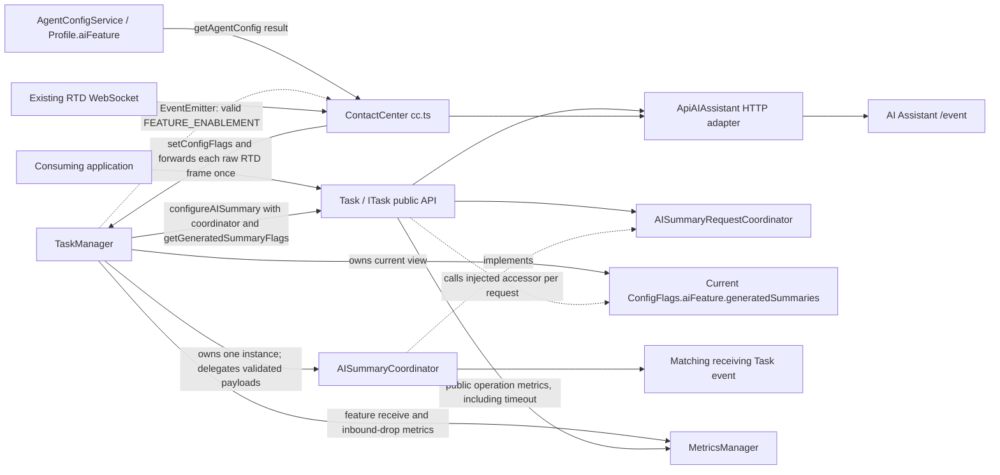
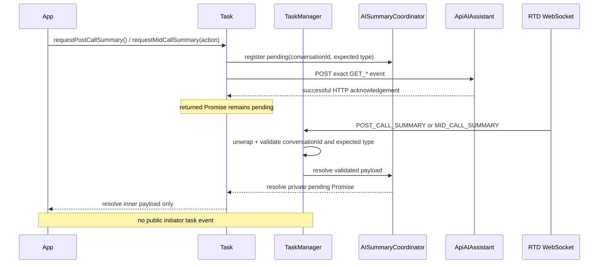
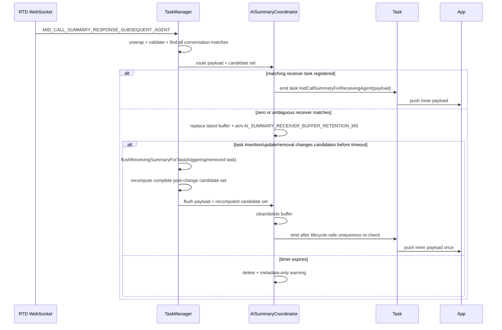

# Contact Center Mid-Call and Post-Call Summary Design

## Overview

This design adds AI-generated post-call and mid-call summary contracts to the existing `@webex/contact-center` workspace. A task initiates post-call or consult/transfer summary generation, the existing AI Assistant HTTP adapter accepts the request, and the existing RTD WebSocket delivers the asynchronous result. Initiator results settle only the request Promise; the receiving-agent result remains the sole new public task event. The existing `wrapup`, `consult`, `transfer`, transcript, suggested-response, task-state, and event contracts are preserved.

The requirement is the target authority. Live source establishes the current state, and the existing `ai-summary*.md` documents are retained only where they agree with it. In particular, this design replaces the prior documents' public initiator-event, organization-only gating, overlapping-request, receiver-fallback, and structured-only response proposals with Promise-only completion, two-level gating, overlap rejection, conversation-only receiver correlation, and structured-or-text fidelity.

Externally visible outcomes are:

- four summary methods implemented once on `Task`, inherited by every SDK-created concrete task, and declared as required members on the SDK-produced `ITask` consumer surface;
- public summary payload/response types and exact backend event constants;
- `cc:featureEnablement` on the contact-center client and `task:midCallSummaryForReceivingAgent` on the matching task;
- deterministic disabled, overlap, transport, timeout, malformed-event, late-event, and cleanup behavior;
- a volatile, per-`conversationId` receiver buffer that retains only the latest subsequent-agent payload for at most `AI_SUMMARY_RECEIVER_BUFFER_RETENTION_MS` (currently 30 seconds), then delivers it when the matching task registers or drops it;
- privacy-safe success and failure metrics for post-call requests, mid-call requests, post-call responses, and mid-call responses, plus one receive metric for every parsed `FEATURE_ENABLEMENT` frame and one bounded inbound-drop metric for malformed, unknown, late, or uncorrelated summary frames.

Constraints and assumptions:

- Node.js 22.14, Yarn 3.4.1, the existing TypeScript/Jest build, and current workspace boundaries remain unchanged.
- `TaskData.interaction.mainInteractionId ?? TaskData.interactionId` is the existing codebase pattern for the stable conversation key. The current task's top-level `interactionId` remains the outbound interaction identifier.
- A successful AI Assistant HTTP response is an acknowledgement only. A valid matching RTD event is required to fulfill a request Promise.
- The SDK does not receive a unique backend request ID, and FR-9 correlates an initiator result by the stable `conversationId` plus its inbound summary type. The pending-registry key is therefore the tuple `(conversationId, AISummaryInboundType)`, not a task or outbound request-event name. Tasks whose `mainInteractionId ?? interactionId` values produce the same conversation key share the slot: allowing one pending entry per task would leave an inbound response impossible to attribute safely and could settle the wrong task or multiple tasks. Cross-task rejection for that shared correlation domain is therefore the intended, requirement-compliant conservative interpretation of FR-12/AC-8: each individual task is protected from same-type overlap, and indistinguishable sibling requests are also rejected rather than being accepted unsafely. Only the accepted slot owner reaches HTTP and installs a result resolver, so an inbound frame cannot choose between task-owned resolvers or satisfy a resolver installed by a rejected sibling. `taskId` is not part of correlation, but it is not dead signature data: each entry records it as the ownership token, and request failure or task cleanup removes the entry only when that owner matches, so a sibling task cannot clear a live resolver.
- `CONSULT` and `TRANSFER` both resolve from inbound `MID_CALL_SUMMARY`, so they share one pending slot for a conversation despite using distinct outbound `GET_MID_CALL_CONSULT_SUMMARY` and `GET_MID_CALL_TRANSFER_SUMMARY` names. While either action is pending, the other rejects with `AI_SUMMARY_REQUEST_ALREADY_PENDING`; `POST_CALL_SUMMARY` uses a separate slot.
- A feature snapshot's canonical interaction key is the event's non-empty `interactionId`, which must represent the same top-level identifier returned by the shared AI-summary correlation derivation; the stable `conversationId`/`mainInteractionId` is never substituted. Task outbound methods use throwing `getAISummaryCorrelation(...)`, while TaskManager's AI-summary registry scans and lifecycle paths use non-throwing `tryGetAISummaryCorrelation(...)` and skip invalid task entries with a bounded metadata-only warning.
- No dependency, package, lockfile, schema, persistence, worker, stream, or new SDK configuration key is introduced. The receiver buffer is bounded, process-local memory rather than persistence and is cleared on delivery, replacement, expiry, or full SDK deregistration. Individual task removal instead re-evaluates the current candidate set so a formerly ambiguous buffer can deliver to one remaining task; zero or multiple candidates retain it to the existing timeout. Feature snapshots associated with a registered task are cleared when the final task for their canonical interaction key leaves; a snapshot received before any matching task is bounded by `AI_SUMMARY_FEATURE_ORPHAN_RETENTION_MS`, and is cleared unless a matching task claims it; full SDK cleanup clears both forms.
- No `AbortSignal` parameter is added because the required public signatures contain none. Cancellation is internal and occurs on HTTP failure, timeout, task cleanup, or SDK deregistration.

Non-goals are a widget, visual treatment, Adaptive Card interpretation, summary generation, backend changes, transcript changes, automatic retry/deduplication, or changes to existing handoff and wrap-up APIs. Application sequencing is documented but cannot be enforced across separate SDK calls: the application owns “wrap up, then response” and “response attempt, then consult/transfer.” If a mid-call summary response fails, the application must catch and record that advisory failure and still proceed with the consult or transfer; the response rejection must not block the core handoff.

## Feature Disposition Matrix

| Fix # | Disposition | Reference |
|---|---|---|
| REQ-001 | Out-of-Scope | requirement.md:L3-L4 -> Branch selection is release-workflow metadata and does not change the SDK design. |
| REQ-002 | Out-of-Scope | requirement.md:L7-L17 -> Section 1 is non-normative document-purpose and reference-routing context; it imposes no independently testable SDK obligation. |
| REQ-003 | Out-of-Scope | requirement.md:L18-L27 -> Section 2 is non-normative background/problem framing; its normative goals and requirements are dispositioned separately below. |
| G-1 | Addressed | requirement.md:L31-L35 -> Change: Consumer sequencing and response semantics |
| G-2 | Addressed | requirement.md:L37-L41 -> Change: Consumer sequencing and response semantics |
| G-3 | Addressed | requirement.md:L43-L47 -> Component: Realtime coordination, correlation, and receiver delivery |
| G-4 | Addressed | requirement.md:L49-L53 -> Component: Public contracts and task API owns the two request-Promise return types/methods and the receiving-agent task-event contract; Component: Realtime coordination, correlation, and receiver delivery owns validated inbound settlement without an initiator event and delivery of the push-only payload to the uniquely matched receiving task. `define-ai-summary-contracts`, `expose-task-summary-apis`, and `coordinate-summary-realtime-state` implement those respective slices. |
| G-5 | Addressed | requirement.md:L55-L59 -> Change: Cross-cutting safeguards and verification |
| REQ-004 | Addressed | requirement.md:L61-L70 -> Change: Cross-cutting safeguards and verification |
| REQ-005 | Addressed | requirement.md:L72-L77 -> Component: Public contracts and task API |
| REQ-006 | Addressed | requirement.md:L78-L78 -> Component: Realtime coordination, correlation, and receiver delivery |
| REQ-007 | Addressed | requirement.md:L79-L79 -> Component: Feature enablement and SDK lifecycle |
| REQ-008 | Addressed | requirement.md:L80-L80 -> Component: Feature enablement and SDK lifecycle |
| REQ-009 | Addressed | requirement.md:L81-L81 -> Component: Realtime coordination, correlation, and receiver delivery |
| REQ-010 | Addressed | requirement.md:L82-L82 -> Shared failure ownership: Component: Public contracts and task API owns disabled outcomes and propagation through the public Promise; Component: AI Assistant transport and outbound serialization owns missing-base-URL, HTTP-failure, and bounded-acknowledgement outcomes; Component: Realtime coordination, correlation, and receiver delivery owns the `AI_SUMMARY_REQUEST_TIMEOUT_MS` inbound timeout plus malformed, unknown-task, uncorrelated, and late-event isolation; Change: Cross-cutting safeguards and verification owns the integrated regression gate. |
| REQ-011 | Addressed | requirement.md:L83-L83 -> Component: Public contracts and task API |
| REQ-012 | Addressed | requirement.md:L84-L84 -> Component: Realtime coordination, correlation, and receiver delivery; `define-ai-summary-contracts` declares the exact `MID_CALL_SUMMARY_RESPONSE_SUBSEQUENT_AGENT` inbound event and `coordinate-summary-realtime-state` recognizes, correlates, and delivers it. |
| REQ-013 | Addressed | requirement.md:L85-L85 -> Component: Public contracts and task API |
| REQ-014 | Out-of-Scope | requirement.md:L87-L89 -> The SDK exposes domain data only; a production widget and its visual design belong to consuming applications. |
| REQ-015 | Out-of-Scope | requirement.md:L90-L90 -> Existing `wrapup`, `consult`, and `transfer` APIs are preserved and only sequenced by the consumer. |
| REQ-016 | Out-of-Scope | requirement.md:L91-L91 -> Backend endpoints and backend business logic are external system responsibilities. |
| REQ-017 | Out-of-Scope | requirement.md:L92-L92 -> Summary generation remains an AI Assistant backend responsibility. |
| REQ-018 | Out-of-Scope | requirement.md:L93-L93 -> Adaptive Card rendering and interpretation remain consumer responsibilities. |
| REQ-019 | Out-of-Scope | requirement.md:L94-L94 -> Existing real-time transcript behavior is explicitly preserved. |
| REQ-020 | Out-of-Scope | requirement.md:L95-L95 -> No SDK retry loop or backend deduplication behavior is added. |
| REQ-021 | Addressed | requirement.md:L97-L104 -> Component: Public contracts and task API |
| REQ-022 | Addressed | requirement.md:L105-L105 -> Component: Public contracts and task API |
| REQ-023 | Addressed | requirement.md:L106-L106 -> Component: Public contracts and task API |
| REQ-024 | Addressed | requirement.md:L107-L107 -> Component: Public contracts and task API |
| REQ-025 | Addressed | requirement.md:L108-L108 -> Component: Public contracts and task API |
| REQ-026 | Addressed | requirement.md:L110-L110 -> Component: Feature enablement and SDK lifecycle |
| REQ-027 | Addressed | requirement.md:L112-L116 -> Component: Feature enablement and SDK lifecycle |
| REQ-028 | Addressed | requirement.md:L117-L117 -> Component: Realtime coordination, correlation, and receiver delivery |
| REQ-029 | Addressed | requirement.md:L119-L119 -> Component: Realtime coordination, correlation, and receiver delivery |
| REQ-030 | Addressed | requirement.md:L121-L125 -> Component: AI Assistant transport and outbound serialization |
| REQ-031 | Addressed | requirement.md:L126-L126 -> Component: AI Assistant transport and outbound serialization |
| REQ-032 | Addressed | requirement.md:L127-L127 -> Component: AI Assistant transport and outbound serialization |
| REQ-033 | Addressed | requirement.md:L128-L128 -> Component: AI Assistant transport and outbound serialization |
| REQ-034 | Addressed | requirement.md:L129-L129 -> Component: AI Assistant transport and outbound serialization |
| REQ-035 | Addressed | requirement.md:L130-L130 -> Component: AI Assistant transport and outbound serialization |
| REQ-036 | Addressed | requirement.md:L132-L134 -> Component: Feature enablement and SDK lifecycle |
| REQ-037 | Addressed | requirement.md:L135-L135 -> Component: Realtime coordination, correlation, and receiver delivery |
| REQ-038 | Addressed | requirement.md:L136-L136 -> Component: Realtime coordination, correlation, and receiver delivery |
| REQ-039 | Addressed | requirement.md:L137-L139 -> Component: Realtime coordination, correlation, and receiver delivery |
| FR-1 | Addressed | requirement.md:L143-L153 -> Component: Feature enablement and SDK lifecycle owns organization-flag propagation and public re-emission; Component: Realtime coordination, correlation, and receiver delivery owns `FEATURE_ENABLEMENT` parsing plus latest-state storage under the canonical top-level interaction key, active-task lifecycle eviction, and orphan retention through `AI_SUMMARY_FEATURE_ORPHAN_RETENTION_MS`; Component: Public contracts and task API owns the two-level request-time gate and no-backend disabled outcome. `wire-contact-center-summary-lifecycle`, `coordinate-summary-realtime-state`, and `expose-task-summary-apis` implement those respective slices. |
| FR-2 | Addressed | requirement.md:L155-L164 -> Component: Public contracts and task API owns the enabled request method, register-before-send composition, and public Promise contract; Component: AI Assistant transport and outbound serialization owns the exact `GET_POST_CALL_SUMMARY` HTTP request/acknowledgement boundary; Component: Realtime coordination, correlation, and receiver delivery owns matching inbound association and settlement. |
| FR-3 | Addressed | requirement.md:L166-L180 -> Component: Public contracts and task API plus Component: AI Assistant transport and outbound serialization own the structured-or-text/empty response shapes, finite non-negative numeric counters, bounded feedback/state, non-empty post-call `wrapUpCode`, and optional finite non-negative numeric `actionTimeStamp`/`publishTimestamp` fields. `Task` validates and whitelists caller-supplied timestamps, and the adapter preserves the two values independently while using one captured `Date.now()` value only for either field the caller omitted; `define-ai-summary-contracts`, `add-ai-summary-transport`, and `expose-task-summary-apis` implement those contracts. Change: Consumer sequencing and response semantics owns only the documented application rule to complete wrap-up before sending the post-call response, through `expose-task-summary-apis` and `synchronize-summary-documentation-and-verify`. |
| FR-4 | Addressed | requirement.md:L182-L191 -> Component: Public contracts and task API owns action selection, the enabled request method, register-before-send composition, and the public Promise contract; Component: AI Assistant transport and outbound serialization owns the exact consult/transfer GET HTTP request/acknowledgement boundary; Component: Realtime coordination, correlation, and receiver delivery owns matching inbound association and settlement. |
| FR-5 | Addressed | requirement.md:L193-L209 -> Component: Public contracts and task API plus Component: AI Assistant transport and outbound serialization; both mid-call response branches accept optional finite non-negative numeric `actionTimeStamp` and `publishTimestamp`, `Task` forwards supplied values through its whitelist, and the adapter preserves them independently with a single captured `Date.now()` fallback applied only to omitted fields. Every body layer is constructed field-by-field without spreading a caller object, and strict key assertions prove that mid-call bodies have no `wrapUpCode` key and post-call bodies have no `agentName` key, including no key whose value is `undefined`. |
| FR-6 | Addressed | requirement.md:L211-L215 -> Change: Consumer sequencing and response semantics plus Component: AI Assistant transport and outbound serialization; the consumer still attempts the advisory response before consult/transfer, while the adapter's 20-second HTTP bound guarantees that a stalled acknowledgement settles so the caught response failure cannot block the core handoff indefinitely. |
| FR-7 | Addressed | requirement.md:L217-L236 -> Component: Public contracts and task API plus Change: Consumer sequencing and response semantics; the component owns the explicit `summaryReceived: true | false` mid-call discriminator and closed cancel/exclude response-state validation, while the change owns the rule that `MID_CALL_CANCELLED` must not invoke consult/transfer and that exclusion preserves the summary representation. |
| FR-8 | Addressed | requirement.md:L238-L248 -> Component: Realtime coordination, correlation, and receiver delivery owns conversation matching, latest-only buffering, uniqueness re-evaluation, delivery, replacement, and expiry. The coordinator arms `AI_SUMMARY_RECEIVER_BUFFER_RETENTION_MS` only when `routeReceivingSummary(...)` retains/replaces a payload without exactly one matching task. TaskManager's `flushReceivingSummaryForTask(...)` recomputes the complete valid candidate set after normal task registration/update and again after individual task removal/deregistration; exactly one remaining match delivers, while zero or multiple matches retain the buffer until another re-flush trigger or timeout. Component: Feature enablement and SDK lifecycle owns only the full-SDK `ContactCenter.deregister()` -> `TaskManager.clearAISummaryState()` cleanup handoff. All actual buffer removal still goes through the coordinator's common timed-entry helper. |
| FR-9 | Addressed | requirement.md:L250-L256 -> Component: Realtime coordination, correlation, and receiver delivery; `tryGetAISummaryCorrelation()` non-throwingly returns the distinct `{conversationId, interactionId}` values derived from `mainInteractionId ?? interactionId` and top-level `interactionId`, respectively, or `undefined` for an empty identifier. `getAISummaryCorrelation()` wraps that derivation and throws the named correlation error only for task-initiated request validation. |
| FR-10 | Addressed | requirement.md:L258-L264 -> Component: Realtime coordination, correlation, and receiver delivery plus Component: Feature enablement and SDK lifecycle; legacy root-exported `CC_TASK_EVENTS` initiator names remain deprecated inbound aliases for compatibility but are never emitted, while only the two Requirement Section 6.2 events are subscribable additions. |
| FR-11 | Addressed | requirement.md:L266-L275 -> Component: Realtime coordination, correlation, and receiver delivery plus Component: AI Assistant transport and outbound serialization; the coordinator arms the `AI_SUMMARY_REQUEST_TIMEOUT_MS` inbound-result timer when `registerPendingAISummaryRequest(...)` accepts and inserts a pending entry, while the adapter independently bounds the HTTP acknowledgement at `AI_SUMMARY_HTTP_TIMEOUT_MS`. Task attaches a rejection handler to `registration.result` through `Promise.all(...)` before either branch can settle. If the HTTP send rejects or reaches its bound, Task calls the named owner-checked `cancelPendingAISummaryRequest(...)`; the coordinator deletes the key, clears its inbound timer, and rejects the handled result Promise with the package-internal `AI_SUMMARY_REQUEST_CANCELLED` code before Task propagates the original adapter error. Resolution, cancellation, either timeout, task cleanup, and SDK cleanup leave no live SDK timer, pending entry, pending Promise, or unhandled rejection. |
| FR-12 | Addressed | requirement.md:L277-L281 -> Component: Realtime coordination, correlation, and receiver delivery; requirement-compliant conservative scope: because FR-9 supplies no task/request identifier for inbound correlation, the pending key is `(conversationId, inbound summary type)` rather than `taskId`. The rule still rejects every same-type overlap for a task and additionally rejects an indistinguishable sibling-task request sharing that correlation domain, preventing one inbound result from settling the wrong task or multiple tasks. Task ID remains a required registration/cancellation argument solely as the cleanup ownership guard. |
| DR-1 | Addressed | requirement.md:L285-L291 -> Component: AI Assistant transport and outbound serialization; both async adapter methods validate every required identifier and their method-specific event-name allowlist before constructing an HTTP request, and reject with package-internal `AI_SUMMARY_TRANSPORT_ERROR_CODES.VALIDATION_FAILED` rather than throwing synchronously. |
| DR-2 | Addressed | requirement.md:L293-L300 -> Component: Public contracts and task API |
| DR-3 | Addressed | requirement.md:L302-L308 -> Component: AI Assistant transport and outbound serialization |
| DR-4 | Addressed | requirement.md:L310-L318 -> Component: Public contracts and task API |
| DR-5 | Addressed | requirement.md:L320-L324 -> Component: Realtime coordination, correlation, and receiver delivery |
| REQ-040 | Addressed | requirement.md:L326-L330 -> Component: Public contracts and task API |
| REQ-041 | Addressed | requirement.md:L331-L331 -> Component: Public contracts and task API |
| REQ-042 | Addressed | requirement.md:L332-L332 -> Component: AI Assistant transport and outbound serialization; empty `agentId`, `orgId`, `interactionId`, or `conversationId` and an out-of-union event name all produce the named Promise rejection before `webex.request`. |
| REQ-043 | Addressed | requirement.md:L333-L333 -> Component: AI Assistant transport and outbound serialization |
| REQ-044 | Addressed | requirement.md:L334-L334 -> Component: Realtime coordination, correlation, and receiver delivery |
| REQ-045 | Addressed | requirement.md:L335-L335 -> Component: Realtime coordination, correlation, and receiver delivery; atomic async registration rejects overlap through its awaited Promise before Task starts HTTP or replaces the first resolver. The key uses the only safe inbound correlation domain `(conversationId, inbound type)`, so the same rule conservatively covers indistinguishable sibling tasks as documented under FR-12/AC-8. |
| REQ-046 | Addressed | requirement.md:L336-L336 -> Component: Realtime coordination, correlation, and receiver delivery |
| REQ-047 | Addressed | requirement.md:L337-L337 -> Component: Realtime coordination, correlation, and receiver delivery |
| REQ-048 | Addressed | requirement.md:L338-L338 -> Component: Realtime coordination, correlation, and receiver delivery |
| REQ-049 | Addressed | requirement.md:L340-L340 -> Component: Public contracts and task API; `define-ai-summary-contracts` owns additive declarations/exports, including public error codes and deprecated `CC_TASK_EVENTS` aliases, and `expose-task-summary-apis` owns additive Task methods and public-surface compatibility tests, while the cross-cutting verification task confirms that existing symbols and behavior remain unchanged. |
| PR-1 | Addressed | requirement.md:L344-L354 -> Component: Public contracts and task API, Component: AI Assistant transport and outbound serialization, Component: Realtime coordination, correlation, and receiver delivery, plus Change: Cross-cutting safeguards and verification; `expose-task-summary-apis` enforces privacy-safe Task logs/metrics, `add-ai-summary-transport` replaces every rejected HTTP object with a fresh safe-field projection before `getErrorDetails` or logging, `coordinate-summary-realtime-state` enforces the inbound boundary, and `synchronize-summary-documentation-and-verify` audits all three. |
| PR-2 | Addressed | requirement.md:L356-L368 -> Component: Public contracts and task API, Component: AI Assistant transport and outbound serialization, Component: Realtime coordination, correlation, and receiver delivery, plus Change: Cross-cutting safeguards and verification; `coordinate-summary-realtime-state` makes TaskManager the owner of the classified feature-receive and bounded inbound-drop metrics, `expose-task-summary-apis` makes Task the sole owner of one final metric per public operation (including timeout failures after coordinator rejection), `add-ai-summary-transport` enforces the adapter's no-duplicate-metric boundary, and `synchronize-summary-documentation-and-verify` runs the integrated metric regression gate. |
| PR-3 | Addressed | requirement.md:L370-L374 -> Component: AI Assistant transport and outbound serialization owns the bounded HTTP acknowledgement and timer cleanup; Component: Realtime coordination, correlation, and receiver delivery uses non-throwing per-task correlation reads for every AI-summary TaskManager registry scan, skips an invalid task entry with bounded metadata-only diagnostics, and drops invalid, late, and uncorrelated input without escaping the RTD callback or entering normal task handling; Change: Consumer sequencing and response semantics requires a caught advisory response failure not to block consult/transfer; Change: Cross-cutting safeguards and verification owns the integrated isolation regression. |
| REQ-050 | Addressed | requirement.md:L376-L378 -> Component: Public contracts and task API plus Component: AI Assistant transport and outbound serialization plus Change: Cross-cutting safeguards and verification; public payload types remain additive, while package-internal `AISummaryPendingRegistration`, `AISummaryResponseTransportPayload`, `SummaryResponseTimestamps`, `AI_ASSISTANT_CLIENT_TYPE`, `AI_SUMMARY_DURATION_MS`, `AI_SUMMARY_REQUEST_TIMEOUT_MS`, `AI_SUMMARY_RECEIVER_BUFFER_RETENTION_MS`, `AI_SUMMARY_FEATURE_ORPHAN_RETENTION_MS`, `AI_SUMMARY_REQUEST_CANCELLED`, `AI_SUMMARY_HTTP_TIMEOUT_MS`, and `AI_SUMMARY_TRANSPORT_ERROR_CODES` are explicitly omitted from the `src/index.ts` export list so they do not become supported package-root contracts. |
| REQ-051 | Addressed | requirement.md:L379-L379 -> Change: Cross-cutting safeguards and verification |
| REQ-052 | Addressed | requirement.md:L380-L380 -> Change: Cross-cutting safeguards and verification |
| REQ-053 | Addressed | requirement.md:L381-L381 -> Change: Cross-cutting safeguards and verification |
| REQ-054 | Addressed | requirement.md:L382-L382 -> Component: Feature enablement and SDK lifecycle |
| REQ-055 | Addressed | requirement.md:L383-L385 -> Component: Feature enablement and SDK lifecycle; `wire-contact-center-summary-lifecycle` owns the two independent organization kill switches and the `cc.ts` regression proving that disabling both leaves existing SDK workflows operational. |
| REQ-056 | Addressed | requirement.md:L387-L398 -> Component: Public contracts and task API plus Component: AI Assistant transport and outbound serialization plus Component: Realtime coordination, correlation, and receiver delivery; `define-ai-summary-contracts` owns the root-exported six-value `AI_SUMMARY_ERROR_CODES` contract, `expose-task-summary-apis` owns disabled/base-URL/overlap rejection behavior, `add-ai-summary-transport` owns package-internal validation/HTTP-failure/HTTP-timeout codes and sanitized propagation, and `coordinate-summary-realtime-state` owns the distinct inbound-result timeout, unknown-task, malformed-event, and late-event behavior. The transport-only codes do not enlarge the six-value package-root contract. `synchronize-summary-documentation-and-verify` is only the final regression gate. |
| REQ-057 | Addressed | requirement.md:L400-L401 -> Change: Cross-cutting safeguards and verification |
| AC-1 | Addressed | requirement.md:L402-L408 -> `expose-task-summary-apis` (`test/unit/spec/services/task/Task.ts`) owns the post-call public API, Promise-only outcome, payload validation, and response invocation; `coordinate-summary-realtime-state` (`test/unit/spec/services/task/AISummaryCoordinator.ts` and `test/unit/spec/services/task/TaskManager.ts`) owns matching inbound association, typed settlement, and no initiator emit; `add-ai-summary-transport` (`test/unit/spec/services/ApiAiAssistant.ts`) owns only the outbound request/response serialization portion; `synchronize-summary-documentation-and-verify` owns the wrap-up-first example and final regression gate. |
| AC-2 | Addressed | requirement.md:L410-L412 -> `expose-task-summary-apis` (`test/unit/spec/services/task/Task.ts`) owns `CONSULT` selection, the typed public Promise, and the response call; `coordinate-summary-realtime-state` (`test/unit/spec/services/task/AISummaryCoordinator.ts` and `test/unit/spec/services/task/TaskManager.ts`) owns matching typed inbound settlement and no initiator emit; `synchronize-summary-documentation-and-verify` owns the documented response-attempt-before-consult boundary and final regression gate. The adapter's consult wire cases support FR-4/FR-5 but are not standalone AC-2 evidence. |
| AC-3 | Addressed | requirement.md:L414-L416 -> `expose-task-summary-apis` (`test/unit/spec/services/task/Task.ts`) owns `TRANSFER` selection, the typed public Promise, and the response call; `coordinate-summary-realtime-state` (`test/unit/spec/services/task/AISummaryCoordinator.ts` and `test/unit/spec/services/task/TaskManager.ts`) owns matching typed inbound settlement and no initiator emit; `synchronize-summary-documentation-and-verify` owns the documented response-attempt-before-transfer boundary and final regression gate. The adapter's transfer wire cases support FR-4/FR-5 but are not standalone AC-3 evidence. |
| AC-4 | Addressed | requirement.md:L418-L420 -> `expose-task-summary-apis` (`test/unit/spec/services/task/Task.ts`) owns cancellation validation and the no-consult/no-transfer assertion, while `add-ai-summary-transport` (`test/unit/spec/services/ApiAiAssistant.ts`) owns exact cancellation serialization; `synchronize-summary-documentation-and-verify` runs the final regression gate. |
| AC-5 | Addressed | requirement.md:L422-L424 -> `coordinate-summary-realtime-state` owns the assertions in `test/unit/spec/services/task/AISummaryCoordinator.ts`, `test/unit/spec/services/task/TaskManager.ts`, and `test/unit/spec/services/task/TaskUtils.ts` for authoritative conversation matching, direct delivery, latest-only buffering through `AI_SUMMARY_RECEIVER_BUFFER_RETENTION_MS`, insertion/update and individual-removal uniqueness re-flush, delivery when ambiguity disappears, zero/multiple-candidate retention, expiry, and cleanup; `synchronize-summary-documentation-and-verify` runs the final regression gate. |
| AC-6 | Addressed | requirement.md:L426-L428 -> `expose-task-summary-apis` (`test/unit/spec/services/task/Task.ts`) owns two-level disabled rejection/no-HTTP assertions and proves each invocation calls the injected `getGeneratedSummaryFlags()` accessor, `coordinate-summary-realtime-state` (`test/unit/spec/services/task/AISummaryCoordinator.ts` and `test/unit/spec/services/task/TaskManager.ts`) owns the current profile-derived accessor view plus latest interaction-flag state under the canonical top-level interaction key, including active-task cleanup and orphan expiry through `AI_SUMMARY_FEATURE_ORPHAN_RETENTION_MS`, and `wire-contact-center-summary-lifecycle` (`test/unit/spec/cc.ts`) owns `getAgentConfig()`/`setConfigFlags(...)` propagation and independent organization-flag behavior; `synchronize-summary-documentation-and-verify` runs the final regression gate. |
| AC-7 | Addressed | requirement.md:L430-L432 -> `coordinate-summary-realtime-state` (`test/unit/spec/services/task/AISummaryCoordinator.ts` and `test/unit/spec/services/task/TaskManager.ts`) owns exact root-exported timeout codes, explicit request/buffer arm points, shared-duration fake-timer behavior, common cleanup, and late-event inbound-drop assertions, while `expose-task-summary-apis` (`test/unit/spec/services/task/Task.ts`) owns propagation and exactly one timeout failure metric through the public Promise; `synchronize-summary-documentation-and-verify` runs the final regression gate. |
| AC-8 | Addressed | requirement.md:L434-L436 -> `coordinate-summary-realtime-state` (`test/unit/spec/services/task/AISummaryCoordinator.ts`) owns the exact root-exported overlap code, first-resolver preservation, and requirement-compliant conservative conversation-scoped overlap, and `expose-task-summary-apis` (`test/unit/spec/services/task/Task.ts`) owns awaited registration rejection before any second HTTP call; `synchronize-summary-documentation-and-verify` runs the final regression gate. `CONSULT`, `TRANSFER`, and sibling tasks sharing an indistinguishable conversation/type correlation domain share the slot. |
| AC-9 | Addressed | requirement.md:L438-L440 -> `coordinate-summary-realtime-state` owns malformed/unknown/uncorrelated parsing, non-throwing registry-scan correlation when a registered task has an empty identifier, one bounded `AI_SUMMARY_INBOUND_EVENT_DROPPED` assertion per discarded frame in `test/unit/spec/services/task/TaskManager.ts`, and no-settlement/no-delivery state assertions in `test/unit/spec/services/task/AISummaryCoordinator.ts`; `synchronize-summary-documentation-and-verify` runs the final regression gate. |
| AC-10 | Addressed | requirement.md:L442-L444 -> `add-ai-summary-transport` (`test/unit/spec/services/ApiAiAssistant.ts`) rejects an HTTP error carrying the serialized request body and proves no sentinel from that body reaches logger or metric spies, `coordinate-summary-realtime-state` (`test/unit/spec/services/task/AISummaryCoordinator.ts` and `test/unit/spec/services/task/TaskManager.ts`) and `expose-task-summary-apis` (`test/unit/spec/services/task/Task.ts`) own the other privacy-sentinel assertions, and `synchronize-summary-documentation-and-verify` runs the final regression gate. |
| AC-11 | Addressed | requirement.md:L446-L448 -> `expose-task-summary-apis` (`test/unit/spec/services/task/Task.ts`), `coordinate-summary-realtime-state` (`test/unit/spec/services/task/TaskManager.ts`), and `wire-contact-center-summary-lifecycle` (`test/unit/spec/cc.ts`) own focused existing-behavior regressions; `synchronize-summary-documentation-and-verify` then runs the complete existing `test:unit`, `test:style`, and `build:src` gate. |

## Current State and Reuse Analysis

The implementation stays inside `packages/@webex/contact-center`. The following decisions are grounded in the inspected source rather than the repository code map.

| Current surface | Evidence and existing behavior | Classification | Target decision |
|---|---|---|---|
| `src/services/ApiAiAssistant.ts` | `ApiAIAssistant` already owns AI Assistant URL resolution, authenticated `webex.request` calls, organization lookup, error augmentation, and generic transcript/suggestion events. The existing core `TIMEOUT_REQ = 20_000` is the package policy for an individual HTTP request. | Extend | Reuse `getBaseUrl()`, credentials, `/event`, `HTTP_METHODS.POST`, `TIMEOUT_REQ`, and error conventions; add summary-specific serializers because generic `sendEvent()` emits a string timestamp and lacks the required double identifier/response fields. Both summary methods call one private `buildSummaryEventEnvelope(...)` constructor, then one private bounded-post helper that clears its timer and converts the original HTTP rejection into a fresh safe-field projection before error augmentation. |
| `src/services/core/Utils.ts`, `src/services/core/GlobalTypes.ts`, `src/constants.ts`, and `src/index.ts` | `getErrorDetails()` returns a standard `Error` with a backward-compatible `data` field, while `generateTaskErrorObject()` returns the typed `AugmentedError` form; callers throw or reject with those values. `Err.Message`/`Err.Details` remain package-internal, and the public barrel exposes no stable error-identifier registry today. | Reuse and extend | Keep the existing augmented-`Error` shape rather than introduce a summary-only error class. Declare `AI_SUMMARY_ERROR_CODES` in `src/constants.ts` with the six exact consumer identifiers `POST_CALL_SUMMARY_DISABLED`, `MID_CALL_SUMMARY_DISABLED`, `AI_ASSISTANT_BASE_URL_NOT_AVAILABLE`, `POST_CALL_SUMMARY_TIMEOUT`, `MID_CALL_SUMMARY_TIMEOUT`, and `AI_SUMMARY_REQUEST_ALREADY_PENDING`, re-export that const object from `src/index.ts`, and set both `error.message` and `error.data.errorCode` to the selected value so consumers have one stable public matching contract. In the same file, declare package-internal `AI_ASSISTANT_CLIENT_TYPE = 'WxCC' as const` for the summary envelope builder and deliberately omit it from `src/index.ts`. |
| `src/services/task/Task.ts` and `src/services/task/types.ts` | `Task` is the shared base for voice, WebRTC, and digital tasks; `ITask` is the public contract. Existing wrap-up/consult/transfer methods are independent Promises. | Extend | Declare the package-internal `AISummaryRequestCoordinator` and `GeneratedSummaryFlagsAccessor` contracts in `src/services/task/types.ts` and add the four public APIs once on `Task`/`ITask`. `Task` receives the adapter, live organization-flag accessor, and narrow coordinator contract only through package-internal `configureAISummary(...)` immediately after factory creation; it never imports `TaskManager`, the concrete coordinator, or the config service. Every request calls `getGeneratedSummaryFlags()` before combining that current organization value with the coordinator's latest interaction snapshot. Every existing subclass inherits the APIs without constructor or behavior duplication, and existing call-control methods remain untouched. |
| `src/services/task/TaskManager.ts` | Owns the task registry, current `ConfigFlags` view populated by `ContactCenter.setConfigFlags(...)`, parses RTD frames, maps `data.data.conversationId` to tasks for transcripts/suggestions, and controls task cleanup. The current source is already 978 lines and its unit spec is 2,481 lines. | Extend | Preserve registry, config propagation, RTD parsing, task matching, and transcript/suggestion dispatch. Compose one `AISummaryCoordinator` for the TaskManager lifetime and configure every factory-created Task with that same instance plus the bound `getGeneratedSummaryFlags` accessor before listener setup or registry insertion. Validate and classify summary frames, then delegate resolver, feature-state, buffer, timer, and summary-cleanup transitions to the coordinator. Individual task removal performs owner/final-key cleanup and re-flushes a receiver buffer against the post-removal registry; the SDK-deregistration facade alone unconditionally clears every receiver entry through the shared timed-entry path. |
| `src/services/task/AISummaryCoordinator.ts` and `src/services/task/constants.ts` | No focused summary-state owner exists today; putting three maps and three distinct timer/lifecycle policies directly in the already-large TaskManager would mix state-machine-like Promise/buffer policy with raw-frame and task-registry orchestration. | Add | Implement the narrow `AISummaryRequestCoordinator` dependency consumed by `Task`, own all volatile summary maps/timers, and define the package-internal source-module exports `AI_SUMMARY_DURATION_MS = 30_000`, `AI_SUMMARY_REQUEST_TIMEOUT_MS`, `AI_SUMMARY_RECEIVER_BUFFER_RETENTION_MS`, `AI_SUMMARY_FEATURE_ORPHAN_RETENTION_MS`, and `AI_SUMMARY_REQUEST_CANCELLED = 'AI_SUMMARY_REQUEST_CANCELLED'`, with each semantic duration alias referencing the single duration value. Accepted requests and receiver buffers always carry their named timer; feature snapshots carry the named orphan timer only until a matching registered task claims them, then remain bounded by that task lifecycle. One private `removeTimedEntry` path clears required or optional timers before request resolution/cancellation, receiver delivery/replacement/expiry, feature replacement/promotion/final-task cleanup, and full SDK deregistration. The coordinator exposes package-internal validated-input methods for direct tests; it does not parse JSON or own the task registry. |
| `src/services/task/TaskUtils.ts` | Existing helpers repeatedly prefer `mainInteractionId` and otherwise use `interactionId` as the stable call identity. | Extend | Add exported source-module helpers `tryGetAISummaryCorrelation()` and `getAISummaryCorrelation()` over one derivation. Both return distinct `{conversationId, interactionId}` values when valid; the `try` variant returns `undefined` for an empty identifier and is used by TaskManager's AI-summary registry scans/lifecycle paths, while the throwing variant converts that result into `AI_SUMMARY_CORRELATION_NOT_AVAILABLE` only for Task outbound API validation. This prevents one malformed registered task from escaping an RTD callback while ensuring a consulted/transferred task never copies the conversation key into both outbound fields. |
| `src/cc.ts` | Creates the AI adapter and TaskManager, forwards RTD messages, connects RTD only for transcripts/suggestions, re-triggers public events, and owns deregistration. | Extend | Include either generated-summary organization switch in RTD connection criteria, forward feature enablement, and invoke TaskManager's full summary-cleanup facade on deregistration; that facade reaches the same coordinator timed-entry cleanup used by task removal. Add no root method. |
| `src/services/config/index.ts`, `src/services/config/types.ts`, `src/services/agent/types.ts`, and `src/cc.ts` | `AgentConfigService.getAgentConfig()` obtains the organization AI resource through `getAIFeatureFlags(orgId)`, stores it as `Profile.aiFeature`, and `ContactCenter` already copies that profile value into `TaskManager.setConfigFlags(...)`. `AIFeatureFlags.generatedSummaries` exposes optional `wrapUpSummariesEnabled` and `consultTransferSummariesEnabled`. Raw `POST_CALL_SUMMARY` and `MID_CALL_SUMMARY` names already exist in `CC_TASK_EVENTS`, which is root-exported and spread into the public `CC_EVENTS` object despite its internal JSDoc. | Preserve and extend | Keep the existing profile/config propagation as the source of both independent organization kill switches. Add only the package-internal `TaskManager.getGeneratedSummaryFlags` accessor over its current `configFlags?.aiFeature?.generatedSummaries` view and inject that accessor into each Task; do not add a config key or make Task fetch profile data. Retain `CC_TASK_EVENTS.POST_CALL_SUMMARY` and `.MID_CALL_SUMMARY` as deprecated inbound aliases, make `CC_AI_SUMMARY_EVENTS` the single source of their strings, and expose only `cc:featureEnablement` and `task:midCallSummaryForReceivingAgent` as new public emissions. |
| `src/types.ts`, `src/services/agent/types.ts`, `src/services/task/types.ts`, `src/index.ts` | Runtime const-object/enums plus explicit public-barrel exports are the package convention. Existing generic mid-call constants are already published internally. | Extend | Add exact consult/transfer constants without removing generic values, add the two public events, and explicitly export all public summary contracts from `src/index.ts`. Keep `AISummaryResponseTransportPayload` and `SummaryResponseTimestamps` available only to package-internal imports and absent from the package-root export list. |
| `src/metrics/MetricsManager.ts` and `src/metrics/constants.ts` | Singleton metrics manager supports timed named events and filters unsupported metadata values. | Preserve and extend | Reuse the manager unchanged. Task owns exactly one final success/failure metric for each public operation, including timeout failure after its coordinator Promise rejects. TaskManager owns `AI_SUMMARY_FEATURE_ENABLEMENT_RECEIVED` and `AI_SUMMARY_INBOUND_EVENT_DROPPED` for classified receive and malformed/unknown/late-or-uncorrelated routing outcomes, respectively; neither owner emits the other's metric. |
| `./ai-summary.md`<br>`./ai-summary-postcall-flow.md`<br>`./ai-summary-initiator-flow.md`<br>`./ai-summary-receiver-flow.md`<br>`packages/@webex/contact-center/src/services/task/ai-docs/AGENTS.md`<br>`packages/@webex/contact-center/src/services/task/ai-docs/ARCHITECTURE.md`<br>`packages/@webex/contact-center/src/services/agent/ai-docs/AGENTS.md`<br>`packages/@webex/contact-center/src/services/agent/ai-docs/ARCHITECTURE.md`<br>`packages/@webex/contact-center/src/metrics/ai-docs/AGENTS.md`<br>`packages/@webex/contact-center/src/metrics/ai-docs/ARCHITECTURE.md` | They contain useful transport shapes, flow evidence, and service guidance, but portions still propose public initiator events, organization-only gating, fallback receiver correlation, overlapping requests, structured-only assumptions, adapter-generated-only response timestamps, duplicated summary envelopes, or an inline `WxCC` client type. | Synchronize during implementation | Until synchronized, this design is authoritative and those conflicting subjects are non-normative. The DAG task `synchronize-summary-documentation-and-verify` must update all ten exact repo-relative paths in the implementation change: preserve valid wire shapes, response sequencing, double-envelope handling, privacy rules, and service guidance while replacing the conflicting guidance before the final regression gate. |
| Existing task lifecycle, state machine, transcript, suggested response, WebRTC, and contact APIs | These paths are operational and separately tested. | Preserve | No source or public behavior is removed. Summary failures never enter the task state machine or alter core call-control outcomes. |

Provenance: this is the first canonical design artifact for this requirement; no earlier design spec or `.sdd/manifest.json` existed at authoring time. The requirement-linked `ai-summary*.md` files remain unchanged source context during this design-phase task, but their enumerated conflicting subjects are non-normative until the explicitly scheduled implementation task synchronizes them.

Reuse follows DRY/KISS/SOLID as follows:

- The existing AI HTTP adapter remains the only dependency on Webex request/credentials.
- `ApiAIAssistant.buildSummaryEventEnvelope(...)` is the sole constructor for the common summary request/response envelope; its discriminated input permits only a GET branch with no response additions or a response branch whose fields are selected from `AISummaryResponseTransportPayload`. It constructs each object level field-by-field and never spreads a caller object, so an absent flow field cannot survive as an `undefined`-valued key. Both public adapter methods call it, and no second summary-envelope literal is maintained.
- One private adapter helper owns the single `webex.request` attempt, the package's existing `AI_SUMMARY_HTTP_TIMEOUT_MS` bound, timer cleanup, and safe error projection for both summary methods. This avoids duplicate timeout/error branches and keeps the independent `AI_SUMMARY_REQUEST_TIMEOUT_MS` inbound-result and `AI_SUMMARY_RECEIVER_BUFFER_RETENTION_MS` policies in `AISummaryCoordinator`.
- The existing Task base remains the only public task API implementation point.
- TaskManager remains the only owner of task registration, raw RTD parsing, payload classification, and selection of candidate receiving tasks.
- `AISummaryRequestCoordinator` and `GeneratedSummaryFlagsAccessor` are declared in `src/services/task/types.ts`; `Task` stores only those contracts, never a `TaskManager` or config-service reference. TaskManager owns one concrete `AISummaryCoordinator` for its lifetime and injects the shared instance plus its bound `getGeneratedSummaryFlags` accessor through `Task.configureAISummary(...)` at every task-creation path before the Task becomes observable. The accessor reads the current profile-derived `ConfigFlags` view for every request, while the coordinator owns only validated summary state transitions: feature snapshots, pending resolvers, receiver buffering, the three timer/lifecycle policies, and scoped/full cleanup.
- The coordinator is a justified extraction rather than a second orchestration layer: TaskManager is already 978 source lines with a 2,481-line unit spec, while the new timeout, overlap, replacement, expiry, and owner-cleanup matrix has a cohesive direct fake-timer test seam. `AISummaryService.ts` would still duplicate `ApiAIAssistant`, and a summary state machine would still incorrectly couple advisory summary state to core task lifecycle.

## Target Architecture and Package Layout

The live declaration, named export, and default export all use the exact class symbol `ApiAIAssistant`; its exact case-sensitive module path is `packages/@webex/contact-center/src/services/ApiAiAssistant.ts`. The filename's `ApiAiAssistant` casing does not rename the symbol. Component and type references use the exported-symbol spelling, while source and test paths use the filesystem spelling.

Dependency direction remains acyclic:



The dotted `TaskManager` -> `ContactCenter` arrow is a runtime EventEmitter notification, not a reverse module dependency: TaskManager emits the shared `AGENT_EVENTS.FEATURE_ENABLEMENT` contract without importing or calling `ContactCenter`, and `cc.ts` owns the named subscription and public re-trigger. Static construction/import direction therefore remains `ContactCenter` -> `TaskManager`, so this notification path creates no module-level cycle.

Layer responsibilities and handoffs:

| Layer | Owns | Must not own |
|---|---|---|
| Consumer application | visual presentation, editing/copy/view observations, wrap-up/consult/transfer ordering, final `agentName` and wrap-up code selection | transport envelopes, correlation maps, timeout timers |
| `Task` | public signatures, runtime argument validation including optional response timestamps, two-level gating by calling injected `getGeneratedSummaryFlags()` for the current organization value and reading the coordinator's latest interaction value, correlation derivation, and exactly one final public-operation metric, including timeout failure after coordinator rejection | config/profile fetching or storage, inbound receive/drop metrics, task registry, WebSocket parsing, UI state, consult/transfer invocation |
| `TaskManager` | task registry, current profile-derived `ConfigFlags` view and bound `getGeneratedSummaryFlags` accessor, lifecycle ownership of its one coordinator and the FR-11 request, FR-8 receiver-buffer, and orphan-feature timer policies, canonical interaction-key candidate/presence checks, raw RTD parsing and payload validation, transcript/suggestion routing, receiving-task candidate selection, internal `AGENT_EVENTS.FEATURE_ENABLEMENT` EventEmitter notification, `AI_SUMMARY_FEATURE_ENABLEMENT_RECEIVED` plus `AI_SUMMARY_INBOUND_EVENT_DROPPED` emission, delegation to the coordinator, and the SDK/task cleanup facade | direct summary maps/timer handles or parallel `setTimeout`/`clearTimeout` branches, HTTP body construction, summary rewriting, core task transitions, duplicate public-operation metrics |
| `AISummaryCoordinator` | direct timer-handle and state ownership: latest feature state keyed only by top-level interaction ID, pending Promise state, exact validated event-type correlation, receiver buffer, an FR-11 request timer armed with accepted pending insertion, an FR-8 expiry timer armed/rearmed with receiver-buffer insertion/replacement, an orphan-feature timer cleared when a matching task claims the snapshot, and common `removeTimedEntry` clearing before request settlement, receiver delivery/replacement/expiry, feature final-task cleanup, or full SDK cleanup | raw RTD parsing, task registry ownership, HTTP serialization, direct metric emission, core task transitions |
| `ApiAIAssistant` | base URL, auth/org lookup, adapter-input validation, response timestamp fallback, field-by-field request/response wire serialization through one private `buildSummaryEventEnvelope(...)`, a shared 20-second HTTP guard, and safe error projection before diagnostics | task lookup, feature gating, public event delivery, duplicate envelope/timeout branches, logging original HTTP errors or bodies |
| Agent configuration / organization-flag source | `AgentConfigService.getAIFeatureFlags(orgId)` feeding `Profile.aiFeature`, propagation through `ContactCenter` to `TaskManager.setConfigFlags(...)`, and the current `ConfigFlags.aiFeature.generatedSummaries` view returned by `getGeneratedSummaryFlags()` | per-interaction feature snapshots, request gating decisions, summary timers, transport |
| `ContactCenter` | agent-profile loading, propagation through `TaskManager.setConfigFlags(...)`, RTD connection lifecycle, single raw-frame forwarding handoff, named subscription to TaskManager's feature notification, and public client re-trigger as `cc:featureEnablement` | new summary request methods or payload mutation |

Producer/consumer contracts:

- `AgentConfigService.getAgentConfig()` fetches `getAIFeatureFlags(orgId)` into `Profile.aiFeature`; `ContactCenter` supplies it to `TaskManager.setConfigFlags(...)`. TaskManager injects a bound `getGeneratedSummaryFlags` accessor, and every `Task.request*` call reads that live organization view before combining it with `AISummaryRequestCoordinator.getFeatureEnablement(...)`.
- An enabled `Task.request*` awaits its injected `AISummaryRequestCoordinator`'s atomic registration Promise before asking `ApiAIAssistant` to send. Accepted registration returns a handle containing the exact long-lived result Promise; overlap rejects the registration Promise, so HTTP cannot start, and the concrete `AISummaryCoordinator` later resolves/rejects only the handle's result.
- Immediately after accepted registration, `Task` starts the HTTP acknowledgement and passes both it and `registration.result` to one `Promise.all(...)`; this attaches fulfillment/rejection handlers to the long-lived coordinator Promise before Task yields. If the `ApiAIAssistant` HTTP send rejects or reaches `AI_SUMMARY_HTTP_TIMEOUT_MS`, `Task` synchronously calls the named `cancelPendingAISummaryRequest(taskId, conversationId, inboundType)` on the injected coordinator before rejecting its public request Promise with that original adapter error. On an owner match, the coordinator removes the entry through `removeTimedEntry(...)`, thereby deleting the key and clearing `AI_SUMMARY_REQUEST_TIMEOUT_MS`, then rejects `registration.result` with an augmented error whose `message` and `data.errorCode` are exactly package-internal `AI_SUMMARY_REQUEST_CANCELLED`. The already-attached `Promise.all` rejection handler consumes that secondary settlement, so no failed send leaves a stale timer, forever-pending Promise, or unhandled rejection. A missing entry or different owner is a no-op.
- `cc.handleRTDWebsocketMessage` forwards the raw frame once; TaskManager performs the only JSON/double-envelope parse and delegates validated summary payloads to `AISummaryCoordinator`.
- TaskManager classifies and metrics every `FEATURE_ENABLEMENT` frame, emits one bounded inbound-drop metric for each malformed, unknown, late, or uncorrelated summary frame, then calls `AISummaryCoordinator.setFeatureEnablement(payload, hasRegisteredTask)` for each valid feature payload before emitting `AGENT_EVENTS.FEATURE_ENABLEMENT` through its EventEmitter. Writer presence scans use `tryGetAISummaryCorrelation(task.data)?.interactionId`, skip invalid registered-task entries with a bounded metadata-only warning, and never throw out of the RTD callback. Task gating through `getFeatureEnablement(...)` uses the interaction ID produced by throwing `getAISummaryCorrelation(...)` inside the task-initiated request path. Registration retention and final-task cleanup use the non-throwing variant; an event value is never compared with the conversation key. A snapshot with no registered match expires after `AI_SUMMARY_FEATURE_ORPHAN_RETENTION_MS` unless task registration calls `retainFeatureEnablementForTask(interactionId)` first. The named `cc.ts` listener still re-triggers every valid payload without deduplication.
- On a valid subsequent-agent payload, TaskManager uses `tryGetAISummaryCorrelation(...)` per registry entry, skips and metadata-only warns for an invalid entry, and supplies the complete set of valid conversation-matching task candidates. `AISummaryCoordinator` emits the unwrapped payload only for exactly one match; with no registered match (or an ambiguous set), it replaces the per-conversation buffer with the latest payload and arms/rearms `AI_SUMMARY_RECEIVER_BUFFER_RETENTION_MS`.
- TaskManager centralizes every lifecycle-triggered buffer retry in `flushReceivingSummaryForTask(task)`. The helper derives the task's conversation key with `tryGetAISummaryCorrelation(...)`, recomputes the complete valid candidate set from the registry at call time, and then invokes `AISummaryCoordinator.flushReceivingSummary(conversationId, matchingTasks)`. It never assumes the triggering task is unique. After TaskManager inserts or updates a task, it calls `retainFeatureEnablementForTask(interactionId)` before lifecycle exposure, synchronously emits the incoming/hydrate event so listeners can attach, and then calls this helper. Exactly one current match makes the coordinator remove the buffer and clear its timer before emitting once; zero or multiple matches retain it.
- Individual task removal/deregistration derives both keys before deletion, removes the task from the registry, performs owner-only pending-request cleanup, and then calls `flushReceivingSummaryForTask(removedTask)` against the post-removal registry. This explicit re-flush makes an ambiguity transition from two matches to one immediately deliverable; if zero or multiple candidates remain, the buffer and timer stay live for another lifecycle change or expiry. Per-task cleanup therefore does not blindly delete the conversation buffer. It clears the feature entry only when no remaining valid task has the same canonical interaction key. An invalid removed task logs bounded metadata and skips only unavailable keyed work. Full SDK `ContactCenter.deregister()` is different: it invokes `TaskManager.clearAISummaryState()` before RTD listener/socket shutdown and unconditionally drops every remaining request, receiver buffer, feature entry, and timer through the coordinator's common timed-entry removal path.
- `Task.send*Response` passes a validated consumer payload, including either independently supplied optional response timestamp, plus SDK-derived identifiers to `ApiAIAssistant`; the adapter constructs the wire body field-by-field from the event-specific whitelist, supplies one captured `Date.now()` value only for each omitted timestamp, and settles within the 20-second HTTP bound so a caught advisory failure cannot hold consult/transfer indefinitely.

File actions:

| Action | Exact files | Responsibility |
|---|---|---|
| Modify | `packages/@webex/contact-center/src/types.ts`, `src/constants.ts`, `src/index.ts`, `src/services/task/constants.ts` | exact backend constants, API/task method names, timeout constants, and coordinator-cancellation code; declare `AI_SUMMARY_ERROR_CODES` once in `packages/@webex/contact-center/src/constants.ts` with `POST_CALL_SUMMARY_DISABLED`, `MID_CALL_SUMMARY_DISABLED`, `AI_ASSISTANT_BASE_URL_NOT_AVAILABLE`, `POST_CALL_SUMMARY_TIMEOUT`, `MID_CALL_SUMMARY_TIMEOUT`, and `AI_SUMMARY_REQUEST_ALREADY_PENDING`, and re-export `AI_SUMMARY_ERROR_CODES` from `packages/@webex/contact-center/src/index.ts` as the stable consumer contract rather than inlining those rejection strings; declare `AI_SUMMARY_REQUEST_CANCELLED = 'AI_SUMMARY_REQUEST_CANCELLED' as const` in `src/services/task/constants.ts` and declare `AI_ASSISTANT_CLIENT_TYPE = 'WxCC' as const` and `AISummaryResponseTransportPayload` for package-internal use only; omit all three package-internal additions from the root barrel |
| Modify | `packages/@webex/contact-center/src/services/config/types.ts`, `src/services/agent/types.ts`, `src/services/task/types.ts` | raw inbound names, public events, payloads, response unions with optional numeric action/publish timestamps, coordinator and organization-flag accessor contracts, `ITask` methods |
| Modify | `packages/@webex/contact-center/src/services/task/TaskUtils.ts`, `src/services/task/Task.ts`, `src/services/task/TaskManager.ts` | throwing/non-throwing correlation helpers, public APIs, live organization-flag access, exception-safe raw inbound routing, task-candidate selection, coordinator composition/delegation, inbound metric ownership |
| Add | `packages/@webex/contact-center/src/services/task/AISummaryCoordinator.ts` | focused owner for feature snapshots, pending resolvers, receiver buffering, timers, and scoped/full summary cleanup |
| Modify | `packages/@webex/contact-center/src/services/ApiAiAssistant.ts`, `src/cc.ts`, `src/metrics/constants.ts` | wire adapter, lifecycle/public forwarding, metrics names |
| Add test | `packages/@webex/contact-center/test/unit/spec/services/task/AISummaryCoordinator.ts` | direct fake-timer, overlap, resolution, buffering, feature-state, privacy, and cleanup coverage without RTD envelopes |
| Modify tests | `packages/@webex/contact-center/test/unit/spec/services/ApiAiAssistant.ts`, `services/task/Task.ts`, `services/task/TaskManager.ts`, `services/task/TaskUtils.ts`, `cc.ts` | focused contract, handled HTTP-cancellation settlement, ambiguity re-flush on task removal, enablement store/read/replace/evict/full-clear behavior, raw-frame routing, correlation, privacy, composition, and regression coverage |
| Synchronize during implementation | `./ai-summary.md`<br>`./ai-summary-postcall-flow.md`<br>`./ai-summary-initiator-flow.md`<br>`./ai-summary-receiver-flow.md`<br>`packages/@webex/contact-center/src/services/task/ai-docs/AGENTS.md`<br>`packages/@webex/contact-center/src/services/task/ai-docs/ARCHITECTURE.md`<br>`packages/@webex/contact-center/src/services/agent/ai-docs/AGENTS.md`<br>`packages/@webex/contact-center/src/services/agent/ai-docs/ARCHITECTURE.md`<br>`packages/@webex/contact-center/src/metrics/ai-docs/AGENTS.md`<br>`packages/@webex/contact-center/src/metrics/ai-docs/ARCHITECTURE.md` | eliminate conflicting guidance and preserve valid implementation references in every enumerated document |
| Remove | None | The feature is additive; stale statements are revised in place rather than files or public symbols being deleted. |

`package.json`, `yarn.lock`, TypeScript/Jest/Babel configuration, state-machine files, task subclasses, sample applications, browser assets, and backend schemas remain unchanged.

The published type output does change: the existing `package.json` `types` export points at generated `dist/types/index.d.ts`, and `build:src` must emit the four required summary methods on `ITask` plus the enumerated public payload/event types from the root barrel. The package-internal registration/transport/helper types, client-type constant, coordinator duration/timeout/cancellation constants, HTTP timeout alias, and transport error-code object are deliberately not named root exports. This needs no package manifest, export-map, compiler, bundler, or dependency change, but it is an intentional addition to the public declaration surface and is verified by the source build and type-level tests described below.

## Component: Public contracts and task API

Requirements covered: G-1, G-2, G-4, G-5, REQ-005, REQ-010, REQ-011, REQ-013, REQ-021, REQ-022, REQ-023, REQ-024, REQ-025, FR-1, FR-2, FR-3, FR-4, FR-5, FR-7, DR-1, DR-2, DR-4, REQ-040, REQ-041, REQ-049, REQ-050, REQ-056, PR-1, PR-2, AC-1, AC-2, AC-3, AC-4, AC-6, AC-7, AC-8, AC-10, and AC-11. Corresponding DAG tasks: `define-ai-summary-contracts` and `expose-task-summary-apis`. For shared G-4/FR-2/FR-4/REQ-010/AC rows, this component owns the public types, Task method selection, gating, Promise composition/propagation, validation, and response invocation; it does not claim inbound parser/settlement, adapter serialization, or consumer-owned sequencing.

### Files and symbols

- Extend `packages/@webex/contact-center/src/services/config/types.ts` with `CC_AI_SUMMARY_EVENTS` while retaining the existing optional `AIFeatureFlags['generatedSummaries']` members `wrapUpSummariesEnabled` and `consultTransferSummariesEnabled`; `GeneratedSummaryFlagsAccessor` reuses that organization-config type without introducing a new SDK configuration key.
- Extend `packages/@webex/contact-center/src/services/task/types.ts` with all domain payloads below, `AISummaryRequestCoordinator`, the four `ITask` methods, and `TASK_EVENTS.TASK_MID_CALL_SUMMARY_FOR_RECEIVING_AGENT = 'task:midCallSummaryForReceivingAgent'`.
- Extend `packages/@webex/contact-center/src/types.ts` with the six exact summary request/response members on the `AIAssistantEventName` const object while retaining the existing generic names for additive compatibility. That const object is the sole value source for the six outbound backend event names; transport aliases and payload discriminants derive their value types from its members.
- Extend `packages/@webex/contact-center/src/services/task/constants.ts` with `METHODS.REQUEST_POST_CALL_SUMMARY`, `SEND_POST_CALL_SUMMARY_RESPONSE`, `REQUEST_MID_CALL_SUMMARY`, `SEND_MID_CALL_SUMMARY_RESPONSE`, `HANDLE_AI_SUMMARY_EVENT`, and `CLEAR_AI_SUMMARY_STATE`, plus the exact package-internal source-module duration and cancellation exports shown below. Request, receiver, and pre-task feature code import their semantic aliases and never inline `30_000` or consume the base value directly. Extend root `packages/@webex/contact-center/src/constants.ts` with the adapter method names `METHODS.SEND_SUMMARY_GET_EVENT` and `METHODS.SEND_SUMMARY_RESPONSE_EVENT`, the six-entry `AI_SUMMARY_ERROR_CODES` object, and package-internal `AI_ASSISTANT_CLIENT_TYPE = 'WxCC' as const`, matching the existing Task/API constant split while providing one cross-layer error contract and one source for the summary wire client type.
- Extend `packages/@webex/contact-center/src/index.ts` to re-export exactly these new or extended public summary symbols: `AISummaryActionType`, `AISummaryFeedback`, `PostCallSummaryState`, `MidCallSummaryState`, `PostCallSummarySections`, `MidCallSummarySections`, `SummaryCounters`, `PostCallSummaryEventPayload`, `MidCallSummaryEventPayload`, `MidCallSummaryReceivingAgentPayload`, `FeatureEnablementEventPayload`, `PostCallSummaryResponsePayload`, `MidCallSummaryResponsePayload`, `AIAssistantEventName`, `TASK_EVENTS`, `AGENT_EVENTS`, `CC_AI_SUMMARY_EVENTS`, and `AI_SUMMARY_ERROR_CODES`. Keep `AISummaryInboundType`, `AISummaryPayloadByInboundType`, `AISummaryTimeoutCodeByInboundType`, `AISummaryPendingRegistration`, `AISummaryRequestCoordinator`, `GeneratedSummaryFlagsAccessor`, `SummaryResponseTimestamps`, `PostCallReceivedResponse`, `PostCallNotReceivedResponse`, `MidCallReceivedResponse`, `MidCallUnavailableResponse`, `AISummaryResponseTransportPayload`, `AI_ASSISTANT_CLIENT_TYPE`, `AI_SUMMARY_DURATION_MS`, `AI_SUMMARY_REQUEST_TIMEOUT_MS`, `AI_SUMMARY_RECEIVER_BUFFER_RETENTION_MS`, `AI_SUMMARY_FEATURE_ORPHAN_RETENTION_MS`, `AI_SUMMARY_REQUEST_CANCELLED`, `AI_SUMMARY_HTTP_TIMEOUT_MS`, and `AI_SUMMARY_TRANSPORT_ERROR_CODES` package-internal and do not re-export them from `src/index.ts`. No root-client method or public error class is added.
- Modify `packages/@webex/contact-center/src/services/task/Task.ts` once; `Voice`, `WebRTC`, and `Digital` inherit the methods unchanged.
- Add focused cases to `packages/@webex/contact-center/test/unit/spec/services/task/Task.ts`; no new test file is needed because the configured Jest target already discovers it.

The timeout and cancellation contract in `packages/@webex/contact-center/src/services/task/constants.ts` is exact and exported from that source module for the coordinator and focused tests:

```ts
export const AI_SUMMARY_DURATION_MS = 30_000;
export const AI_SUMMARY_REQUEST_TIMEOUT_MS = AI_SUMMARY_DURATION_MS;
export const AI_SUMMARY_RECEIVER_BUFFER_RETENTION_MS = AI_SUMMARY_DURATION_MS;
export const AI_SUMMARY_FEATURE_ORPHAN_RETENTION_MS = AI_SUMMARY_DURATION_MS;
export const AI_SUMMARY_REQUEST_CANCELLED = 'AI_SUMMARY_REQUEST_CANCELLED' as const;
```

`AI_SUMMARY_DURATION_MS` is the only numeric literal. Production call sites and fake-timer assertions select the semantic constant for their policy. `AI_SUMMARY_REQUEST_CANCELLED` is the one package-internal coordinator cancellation code used for HTTP-failure, owner-task, and SDK cleanup settlement; it does not enlarge the six-value public `AI_SUMMARY_ERROR_CODES` object. None of these five source-module exports is a package-root export.

### Public data model

The public type names and field contracts are:

```ts
export type AISummaryActionType = 'CONSULT' | 'TRANSFER';
export type AISummaryFeedback = 'none' | 'thumbs_up' | 'thumbs_down';
export type PostCallSummaryState = 'DEFAULT' | 'IGNORED' | 'NOT_RECEIVED';
export type MidCallSummaryState =
  | 'DEFAULT'
  | 'EXCLUDED'
  | 'IGNORED'
  | 'MID_CALL_CANCELLED'
  | 'NOT_RECEIVED';

export type PostCallSummarySections = {
  initialContactReason?: string;
  additionalContactReasons?: string;
  additionalContext?: string;
  keyActionsTaken?: string;
  nextSteps?: string;
};

export type MidCallSummarySections = {
  reasonForTransferOrConsult?: string;
  additionalContext?: string;
  keyActionsTaken?: string;
};

export type SummaryCounters = {
  numberOfTimesViewed: number;
  numberOfTimesEdited: number;
  numberOfTimesCopied: number;
};

export type PostCallSummaryEventPayload = {
  conversationId: string;
  adaptiveCard?: Record<string, unknown>;
  adaptiveCardId?: string;
  editAdaptiveCard?: Record<string, unknown>;
  editAdaptiveCardId?: string;
  languageCode?: string;
  summaryText?: string;
  resolution?: string;
  areTranscriptsAvailable?: boolean;
  sections?: PostCallSummarySections;
  suggestedWrapUpCodes?: Array<{name: string; [key: string]: unknown}>;
  suggestedWrapUpCodesMessage?: string;
  timestamp?: number;
  [key: string]: unknown;
};

export type MidCallSummaryEventPayload = {
  conversationId: string;
  adaptiveCard?: Record<string, unknown>;
  adaptiveCardId?: string;
  editAdaptiveCard?: Record<string, unknown>;
  editAdaptiveCardId?: string;
  languageCode?: string;
  summaryText?: string;
  resolution?: string;
  areTranscriptsAvailable?: boolean;
  sections?: MidCallSummarySections;
  timestamp?: number;
  [key: string]: unknown;
};

export type MidCallSummaryReceivingAgentPayload = {
  conversationId: string;
  adaptiveCard?: Record<string, unknown>;
  adaptiveCardId?: string;
  languageCode?: string;
  resolution?: string;
  summaryText?: string;
  timestamp?: number;
  [key: string]: unknown;
};

export type FeatureEnablementEventPayload = {
  interactionId: string;
  midCallEnabled?: boolean;
  postCallEnabled?: boolean;
  actionTimeStamp?: number;
  [key: string]: unknown;
};
```

Optional inbound fields reflect backend evolution and the requirement that missing per-interaction values behave as disabled. `FeatureEnablementEventPayload.actionTimeStamp` preserves the backend wire field's exact capital-`S` spelling; no alternate casing is accepted. The string-key extension retains unknown backend domain fields at the type boundary. At runtime, TaskManager validates and delegates the original inner payload object, and `AISummaryCoordinator` settles or emits that same object; neither projects it through these types or strips unknown fields. `null`, an array, a missing/empty correlation identifier, or a non-object inner payload is malformed and is dropped.

Consumer response types intentionally exclude `agentId`, `orgId`, `interactionId`, and `conversationId`; those correlation fields remain SDK-derived so a caller cannot mismatch them, implementing DR-1. They intentionally support optional numeric `actionTimeStamp` and `publishTimestamp` on every response branch so an application can preserve when it observed/finalized an agent action and when it published the response. The two values are independent and are forwarded unchanged. For additive compatibility, either may be omitted; the adapter captures one `Date.now()` fallback per response call and uses it only for each missing field. Any supplied timestamp must be a finite, non-negative number. Mid-call response types continue to exclude `wrapUpCode` so TypeScript rejects that invalid combination.

```ts
type SummaryResponseTimestamps = {
  actionTimeStamp?: number;
  publishTimestamp?: number;
};

type PostCallReceivedResponse = SummaryCounters & SummaryResponseTimestamps & {
  summary: PostCallSummarySections | string;
  feedback: AISummaryFeedback;
  state: Exclude<PostCallSummaryState, 'NOT_RECEIVED'>;
  wrapUpCode: string;
};

type PostCallNotReceivedResponse = SummaryResponseTimestamps & {
  summary: '';
  numberOfTimesViewed: 0;
  numberOfTimesEdited: 0;
  numberOfTimesCopied: 0;
  feedback: AISummaryFeedback;
  state: Extract<PostCallSummaryState, 'NOT_RECEIVED'>;
  wrapUpCode: string;
};

export type PostCallSummaryResponsePayload =
  | PostCallReceivedResponse
  | PostCallNotReceivedResponse;

type MidCallReceivedResponse = SummaryCounters & SummaryResponseTimestamps & {
  summaryReceived: true;
  summary: MidCallSummarySections | string;
  feedback: AISummaryFeedback;
  state: Exclude<MidCallSummaryState, 'NOT_RECEIVED'>;
  agentName: string;
};

type MidCallUnavailableResponse = SummaryResponseTimestamps & {
  summaryReceived: false;
  summary: '';
  numberOfTimesViewed: 0;
  numberOfTimesEdited: 0;
  numberOfTimesCopied: 0;
  feedback: AISummaryFeedback;
  state: Extract<MidCallSummaryState, 'NOT_RECEIVED' | 'MID_CALL_CANCELLED'>;
  agentName: string;
};

export type MidCallSummaryResponsePayload =
  | MidCallReceivedResponse
  | MidCallUnavailableResponse;
```

All counters and any supplied timestamps are finite, non-negative numbers and are forwarded unchanged; they are not parsed, stringified, clamped, hardcoded, or collapsed to booleans. The no-summary union encodes literal zero counter values but does not prohibit either optional timestamp. `summaryReceived` is the required mid-call-only discriminant: `true` selects the received branch and `false` selects the unavailable branch even when `state` is `MID_CALL_CANCELLED`. It is consumed by Task validation and omitted from the whitelisted transport payload. Structured summary fields remain optional strings, a plain-text summary remains a string, and an unavailable summary is exactly `''`; `null`/`undefined` are invalid. `wrapUpCode` and `agentName` must be non-empty strings but are serialized without trimming or rewriting. `feedback` and state use the exact closed vocabularies above.

### Public and internal signatures

```ts
export interface ITask extends IEventEmitter {
  requestPostCallSummary(): Promise<PostCallSummaryEventPayload>;
  sendPostCallSummaryResponse(payload: PostCallSummaryResponsePayload): Promise<void>;
  requestMidCallSummary(actionType: AISummaryActionType): Promise<MidCallSummaryEventPayload>;
  sendMidCallSummaryResponse(
    payload: MidCallSummaryResponsePayload,
    actionType: AISummaryActionType
  ): Promise<void>;
}

export type AISummaryInboundType = 'POST_CALL_SUMMARY' | 'MID_CALL_SUMMARY';

export type AISummaryPayloadByInboundType = {
  POST_CALL_SUMMARY: PostCallSummaryEventPayload;
  MID_CALL_SUMMARY: MidCallSummaryEventPayload;
};

export type AISummaryTimeoutCodeByInboundType = {
  POST_CALL_SUMMARY: 'POST_CALL_SUMMARY_TIMEOUT';
  MID_CALL_SUMMARY: 'MID_CALL_SUMMARY_TIMEOUT';
};

export type AISummaryPendingRegistration<T extends AISummaryInboundType> = Readonly<{
  result: Promise<AISummaryPayloadByInboundType[T]>;
}>;

export interface AISummaryRequestCoordinator {
  getFeatureEnablement(interactionId: string): FeatureEnablementEventPayload | undefined;
  /**
   * Atomically checks and inserts a pending entry. The returned registration
   * Promise rejects with AI_SUMMARY_REQUEST_ALREADY_PENDING when occupied;
   * an accepted handle contains the long-lived inbound-result Promise.
   */
  registerPendingAISummaryRequest<T extends AISummaryInboundType>(
    taskId: string,
    conversationId: string,
    eventType: T,
    timeoutCode: AISummaryTimeoutCodeByInboundType[T]
  ): Promise<AISummaryPendingRegistration<T>>;
  cancelPendingAISummaryRequest<T extends AISummaryInboundType>(
    taskId: string,
    conversationId: string,
    eventType: T
  ): void;
}
```

The event literal controls both the timeout code and the accepted handle's result type. A post-call registration therefore returns `Promise<AISummaryPendingRegistration<'POST_CALL_SUMMARY'>>` whose `result` is `Promise<PostCallSummaryEventPayload>`, while the mid-call result is `Promise<MidCallSummaryEventPayload>`; Task supplies no generic type argument and performs no assertion. `registerPendingAISummaryRequest(...)` is `async` so every failure is a Promise rejection, but it contains no internal `await`: the overlap check, result-Promise construction, map insertion, and timer arm remain one run-to-completion operation. The package-internal mapping and registration types are source-module exports only so `Task` and `AISummaryCoordinator` share this relationship without duplicating it; none is a package-root contract.

The six Requirement Section 9 identifiers are declared once and published as values, not as a new error subclass:

```ts
export const AI_SUMMARY_ERROR_CODES = {
  POST_CALL_SUMMARY_DISABLED: 'POST_CALL_SUMMARY_DISABLED',
  MID_CALL_SUMMARY_DISABLED: 'MID_CALL_SUMMARY_DISABLED',
  AI_ASSISTANT_BASE_URL_NOT_AVAILABLE: 'AI_ASSISTANT_BASE_URL_NOT_AVAILABLE',
  POST_CALL_SUMMARY_TIMEOUT: 'POST_CALL_SUMMARY_TIMEOUT',
  MID_CALL_SUMMARY_TIMEOUT: 'MID_CALL_SUMMARY_TIMEOUT',
  AI_SUMMARY_REQUEST_ALREADY_PENDING: 'AI_SUMMARY_REQUEST_ALREADY_PENDING',
} as const;
```

`packages/@webex/contact-center/src/constants.ts` owns that object and `packages/@webex/contact-center/src/index.ts` re-exports it. Each corresponding local rejection is a standard `Error` following the package's augmented-error convention: its canonical `message` is the selected exported value and `data.errorCode` mirrors the same value. Consumers match against `AI_SUMMARY_ERROR_CODES`, not a duplicated string, constructor identity, or log text. `getErrorDetails()` continues to translate remote HTTP failures; the locally detected missing-base-URL case uses the public code above. The package does not expose `Err.Message`, `Err.Details`, or a new summary error class.

`ITask` is an SDK-produced output contract, not an application extension point. In the live package, only the SDK-owned abstract `Task` implements it, all concrete instances originate in the internal `TaskFactory`, and no public API accepts a consumer-supplied `ITask` implementation. The four members are therefore required rather than optional so applications consuming an SDK task get the exact callable signatures without feature-method existence checks; `Voice`, `WebRTC`, and `Digital` inherit the same runtime implementation from `Task`.

This is runtime- and source-additive for the supported consumption model, but adding required members to the exported interface is still observable in TypeScript structural typing. A downstream project that chose to implement all of `ITask`, or declared a complete hand-written `ITask` mock, must add the four methods when compiling against the new declarations. That unsupported implementation pattern is not covered by G-5's no-migration promise because the SDK never consumes such objects. Repository tests, published examples, and recommended downstream test doubles must use an SDK-created task or a purpose-scoped `Pick<ITask, ...>`/`Partial<ITask>` instead of claiming to implement the complete SDK-owned interface; this shields existing behavior-focused doubles from future capability additions.

`Task.configureAISummary` is package-internal and is not added to `ITask` or `src/index.ts`:

```ts
type GeneratedSummaryFlagsAccessor = () =>
  AIFeatureFlags['generatedSummaries'] | undefined;

public configureAISummary(
  apiAIAssistant: Pick<ApiAIAssistant, 'sendSummaryGetEvent' | 'sendSummaryResponseEvent'>,
  coordinator: AISummaryRequestCoordinator,
  getGeneratedSummaryFlags: GeneratedSummaryFlagsAccessor
): void;
```

TaskManager constructs one `AISummaryCoordinator` for its own lifetime and declares the bound package-internal accessor `private readonly getGeneratedSummaryFlags: GeneratedSummaryFlagsAccessor = () => this.configFlags?.aiFeature?.generatedSummaries`. Immediately after every `TaskFactory.createTask(...)` call and before `setupTaskListeners(...)` or `taskCollection` insertion, it invokes `configureAISummary(...)` with the shared coordinator and that accessor. `Task` retains the injected adapter, accessor, and coordinator interface for that Task's lifetime. Calling the accessor at request time observes the current `ConfigFlags` object after any later `setConfigFlags(...)` call, rather than freezing the flags present when the Task was created; `wrapUpSummariesEnabled` and `consultTransferSummariesEnabled` therefore remain live kill switches for Tasks created before an organization-configuration refresh. This avoids changing `Voice`, `WebRTC`, and `Digital` constructors or exposing TaskManager, the config service, or the concrete coordinator publicly. A defensive call on an unconfigured Task rejects `AI_SUMMARY_NOT_INITIALIZED` without touching the backend.

### Request control flow and state

For `requestPostCallSummary()`:

1. For this invocation, derive `{interactionId, conversationId}` once with `getAISummaryCorrelation(task.data)`, call the injected `getGeneratedSummaryFlags()` accessor, and read its current `wrapUpSummariesEnabled` value; do not use a value captured by `configureAISummary(...)`. Then read the latest `coordinator.getFeatureEnablement(interactionId)?.postCallEnabled` with that canonical top-level interaction key. Both flags must be exactly `true`; otherwise reject with augmented `POST_CALL_SUMMARY_DISABLED` and create no pending entry or timer and do no backend work. Missing profile/config state is therefore disabled, and no Task imports or fetches agent configuration directly.
2. Require the configured `agentId` and use the already-derived correlation values for registration and transport.
3. Initialize a call-local `registrationAccepted = false`, then assign `const registration = await registerPendingAISummaryRequest(taskId, conversationId, 'POST_CALL_SUMMARY', 'POST_CALL_SUMMARY_TIMEOUT')` before HTTP. The literal arguments infer an `AISummaryPendingRegistration<'POST_CALL_SUMMARY'>`, whose `result` is `Promise<PostCallSummaryEventPayload>`; Task supplies no type argument or cast. The logical key is `(conversationId, 'POST_CALL_SUMMARY')`; `taskId` is stored as the entry owner but is not part of the key. If that key is occupied, the awaited registration rejects with augmented `AI_SUMMARY_REQUEST_ALREADY_PENDING` without creating an inbound-result Promise, inserting an entry, or arming a timer. Only after the accepted handle is returned does Task set `registrationAccepted = true`, so an overlap rejection cannot reach the HTTP method.
4. Start `sendSummaryGetEvent(..., GET_POST_CALL_SUMMARY)` and immediately await it together with `registration.result` using `Promise.all([acknowledgementPromise, registration.result])`. Task never abandons or separately exposes the returned result Promise: `Promise.all` installs fulfillment/rejection handlers on both inputs before either callback can run, returns only after HTTP acknowledgement and inbound resolution, and permits a push to win the race without being lost. The adapter's independent `AI_SUMMARY_HTTP_TIMEOUT_MS` bound rejects a stalled acknowledgement and triggers owner cancellation; after a timely acknowledgement, `AI_SUMMARY_REQUEST_TIMEOUT_MS` remains responsible for a missing inbound result.
5. If an error escapes, synchronously call the named coordinator method `cancelPendingAISummaryRequest(taskId, conversationId, eventType)` only when this call's local `registrationAccepted` flag is `true`, then rethrow the first detailed error. On an owner-matched live entry, cancellation uses `removeTimedEntry(...)` to delete the key and clear its timer before rejecting `registration.result` with an augmented error whose `message` and `data.errorCode` are exactly package-internal `AI_SUMMARY_REQUEST_CANCELLED`. When HTTP acknowledgement rejected first, the handler that `Promise.all` already attached to `registration.result` consumes this secondary rejection even though the aggregate Promise is settled, so cancellation cannot create an unhandled rejection. Timeout or lifecycle rejection finds its entry already absent; a missing/different-owner cancellation is a no-op. An overlap rejection leaves `registrationAccepted = false`, performs no cancellation even when both calls use the same `taskId`, and leaves the first request's resolver/timer unchanged. The still-running HTTP Promise likewise retains the handler installed by `Promise.all`. On success, return only the summary element. Only the coordinator can resolve it after TaskManager delegates a validated matching inbound event.

`requestMidCallSummary(actionType)` calls `getGeneratedSummaryFlags()` for the current organization value on every invocation and requires `consultTransferSummariesEnabled === true`; it separately reads the coordinator's latest per-interaction snapshot through the same canonical `interactionId` already returned by `getAISummaryCorrelation(...)` and requires `midCallEnabled === true`. If either exact flag is missing or false, it rejects augmented `MID_CALL_SUMMARY_DISABLED` before registration, timer creation, or HTTP. It then performs steps 2-5 above with the same awaited accepted-registration handle, pending type `MID_CALL_SUMMARY`, timeout `MID_CALL_SUMMARY_TIMEOUT`, and exact action mapping `CONSULT -> GET_MID_CALL_CONSULT_SUMMARY`, `TRANSFER -> GET_MID_CALL_TRANSFER_SUMMARY`. The literal pending type infers a handle whose `result` is `Promise<MidCallSummaryEventPayload>` without a type argument or assertion. Any other runtime action value rejects `AI_SUMMARY_INVALID_ACTION_TYPE` before registration or HTTP. Consult and transfer contend for the same pending key because both await `MID_CALL_SUMMARY`, while a simultaneous post-call request uses an independent key.

Promise callbacks run through the normal JavaScript microtask queue. Timer callbacks and WebSocket handlers are separate event-loop tasks; registering first prevents a fast push from being lost. Map deletion occurs before `resolve`/`reject`, making reentrant sequential calls legal. There is no public abort signal or subscription to remove.

### Response control flow and validation

Both response APIs synchronously validate the runtime object inside their async method and therefore expose failures as rejected Promises. Validation rejects `AI_SUMMARY_INVALID_RESPONSE_PAYLOAD` before HTTP when the object is null/array, a counter or supplied `actionTimeStamp`/`publishTimestamp` is non-finite or negative, summary representation is invalid, feedback/state is outside its allowlist, required string is empty, or a no-summary branch has nonzero counters. Mid-call validation first requires `summaryReceived` to be exactly `true` or `false`: `true` applies the received rules, while `false` requires state `NOT_RECEIVED` or `MID_CALL_CANCELLED`, `summary: ''`, and all three literal-zero counters. Missing/non-boolean discriminants and branch-inconsistent fields reject before transport, so `MID_CALL_CANCELLED` can never satisfy both runtime branches. A mid-call payload containing an own `wrapUpCode` property is rejected even from untyped JavaScript; it is never silently serialized as `null`.

For a received `MID_CALL_CANCELLED` summary, `summaryReceived` is `true` and all three supplied counters need only be finite and non-negative; in particular, `numberOfTimesViewed: 0` is valid when cancellation arrives before the application opens the dialog. A consumer that knows it displayed the dialog reports `numberOfTimesViewed: 1` on the first view as FR-7 expects, but the SDK does not infer or enforce display, edit, or copy activity. For a cancelled or `NOT_RECEIVED` flow without a summary, `summaryReceived` is `false` and `summary` plus all counters must match the literal empty/zero branch.

After validation, Task derives identifiers and selects the response event (`POST_CALL_SUMMARY_RESPONSE`, `MID_CALL_CONSULT_SUMMARY_RESPONSE`, or `MID_CALL_TRANSFER_SUMMARY_RESPONSE`). It passes a new whitelisted internal object to the adapter, preserving either supplied timestamp independently; it never spreads the caller payload into the transport envelope. It resolves `void` only after the bounded HTTP call succeeds and otherwise rejects within 20 seconds with the adapter's detailed, privacy-safe error.

### Failure, configuration, security, compatibility, and lifecycle

- Missing organization or per-interaction flags are disabled, never “unknown enabled.” Task reads the organization side only through injected `getGeneratedSummaryFlags()` at invocation time; the accessor reads TaskManager's current profile-derived `ConfigFlags` view, while the coordinator remains the sole source of the latest interaction side.
- A missing/unknown base URL uses the exact augmented `AI_SUMMARY_ERROR_CODES.AI_ASSISTANT_BASE_URL_NOT_AVAILABLE` contract. Adapter validation, sanitized HTTP failure, and HTTP timeout propagate the package-internal `AI_SUMMARY_TRANSPORT_ERROR_CODES.VALIDATION_FAILED`, `.HTTP_REQUEST_FAILED`, and `.TIMEOUT` values in both `Error.message` and `data.errorCode`; Task records only that bounded code in its final metric. There is no retry.
- Task logs and metrics include only operation/event name, identifiers allowed by existing policy, action type, numeric counters, state, feedback, card identifiers, and error code. Summary/card/section values and `agentName` are never passed to logging or metrics.
- Public additions preserve supported consumer compatibility: SDK-created tasks gain methods and existing generic AI event constants, methods, and events remain unchanged. The generated `ITask` declaration gains four required members; full structural implementations/mocks outside the supported output-only model need four stubs or must narrow their test type with `Pick`/`Partial` as described above.
- Storage/schema migration: Not applicable - all state is in-memory and bounded to task/SDK lifetime.
- Worker/process/stream lifecycle: Not applicable - the package uses the existing browser/Node event loop and RTD socket.

### Named tests

`Task.ts` unit scenarios: post-call/mid-call enabled happy paths; canonical feature reads using the top-level `interactionId` from `getAISummaryCorrelation(...)`; `getGeneratedSummaryFlags()` called for every request and a later accessor value observed by an already-created Task; missing/false organization flag; false/missing interaction flag; exact `AI_SUMMARY_ERROR_CODES` message/`data.errorCode` assertions for both disabled outcomes and overlap; invalid action; exact consult/transfer event selection; awaited registration acceptance before HTTP; proof that `registration.result` has a rejection handler before HTTP can settle; owner ID passed on HTTP cleanup; an HTTP rejection whose owner cancellation deletes the entry, clears its timer, rejects the handled coordinator Promise with exact package-internal `AI_SUMMARY_REQUEST_CANCELLED`, preserves the original adapter error as the public rejection, and produces no unhandled rejection; exact package-internal transport validation/request-failure/timeout propagation with only the bounded `data.errorCode` mapped into the final metric; fake-timer rejection of the public post-call and mid-call Task Promises with exact `POST_CALL_SUMMARY_TIMEOUT` and `MID_CALL_SUMMARY_TIMEOUT` message/`data.errorCode` values; a matching late event after each timeout that cannot resettle the Task Promise or emit a second final operation metric; structured/text/empty response preservation; mid-call `summaryReceived: true | false` branch selection plus missing/non-boolean/inconsistent discriminator rejection; a received `MID_CALL_CANCELLED` payload with `numberOfTimesViewed: 0`; numeric counter pass-through including values greater than one; independent optional `actionTimeStamp`/`publishTimestamp` pass-through in every response branch; invalid numeric strings/NaN/infinite/negative counter or timestamp values; feedback/state allowlists; required wrap-up code/agent name; mid-call `wrapUpCode` rejection; cancellation with and without a received summary; omission of the SDK-only discriminator from the adapter payload; pending `CONSULT` followed by `TRANSFER` receiving the exact Promise rejection `AI_SUMMARY_REQUEST_ALREADY_PENDING` from the awaited registration while the first result Promise/timer remains pending, the backend method is still called only once, and the overlap path makes no cancellation call; no public initiator event; sequential request after settlement; exactly one final metric per outcome; and sentinel summary/card/section/agent-name values absent from every Task logger and metric spy argument on every success and failure path. These cover AC-1 through AC-4, AC-6, the Task side of AC-7/AC-8, and the Task boundary of AC-10.

## Component: AI Assistant transport and outbound serialization

Requirements covered: REQ-010, REQ-030, REQ-031, REQ-032, REQ-033, REQ-034, REQ-035, FR-2, FR-3, FR-4, FR-5, FR-6, DR-1, DR-3, REQ-042, REQ-043, REQ-056, PR-1, PR-2, PR-3, AC-1, AC-4, and AC-10. Corresponding DAG task: `add-ai-summary-transport`. For the shared request requirements, this component owns only exact outbound serialization and bounded HTTP acknowledgement; Task and realtime coordination own public-Promise selection and inbound settlement, and consumer sequencing owns the response-before-handoff rule.

### Files, responsibilities, and signatures

Modify `packages/@webex/contact-center/src/services/ApiAiAssistant.ts` and its existing test `packages/@webex/contact-center/test/unit/spec/services/ApiAiAssistant.ts`. Reuse private `getBaseUrl()`, `this.webex.credentials.getOrgId()`, `AI_ASSISTANT_API_URLS.EVENT`, `HTTP_METHODS.POST`, `addAuthHeader: true`, the existing `TIMEOUT_REQ = 20_000` individual-request policy, `getErrorDetails`, and package-internal `AI_ASSISTANT_CLIENT_TYPE` declared by `define-ai-summary-contracts` in `packages/@webex/contact-center/src/constants.ts`. Do not route summary calls through generic `sendEvent()` because its current `actionTimeStamp` is a string and its shape has no `conversationId`, top-level `publishTimestamp`, or response fields. This module owns the package-internal timeout/error constants, two directional aliases, discriminated builder input, and one bounded-post helper below. It derives event names from the `AIAssistantEventName` const object owned by `packages/@webex/contact-center/src/types.ts`; no adapter-local backend event string or client-type literal is independently declared.

```ts
export const AI_SUMMARY_HTTP_TIMEOUT_MS = TIMEOUT_REQ;

export const AI_SUMMARY_TRANSPORT_ERROR_CODES = {
  VALIDATION_FAILED: 'AI_SUMMARY_TRANSPORT_VALIDATION_FAILED',
  HTTP_REQUEST_FAILED: 'AI_SUMMARY_HTTP_REQUEST_FAILED',
  TIMEOUT: 'AI_SUMMARY_TRANSPORT_TIMEOUT',
} as const;

type SummaryGetEventName =
  | typeof AIAssistantEventName.GET_POST_CALL_SUMMARY
  | typeof AIAssistantEventName.GET_MID_CALL_CONSULT_SUMMARY
  | typeof AIAssistantEventName.GET_MID_CALL_TRANSFER_SUMMARY;

type SummaryResponseEventName =
  | typeof AIAssistantEventName.POST_CALL_SUMMARY_RESPONSE
  | typeof AIAssistantEventName.MID_CALL_CONSULT_SUMMARY_RESPONSE
  | typeof AIAssistantEventName.MID_CALL_TRANSFER_SUMMARY_RESPONSE;

type SummaryEnvelopeInput =
  | {
      kind: 'get';
      agentId: string;
      orgId: string;
      interactionId: string;
      conversationId: string;
      eventName: SummaryGetEventName;
      publishTimestamp: number;
      actionTimeStamp: number;
    }
  | {
      kind: 'response';
      agentId: string;
      orgId: string;
      payload: AISummaryResponseTransportPayload;
      publishTimestamp: number;
      actionTimeStamp: number;
    };

private buildSummaryEventEnvelope(
  input: SummaryEnvelopeInput
): Record<string, unknown>;

public async sendSummaryGetEvent(
  agentId: string,
  interactionId: string,
  conversationId: string,
  eventName: SummaryGetEventName
): Promise<void>;

public async sendSummaryResponseEvent(
  agentId: string,
  payload: AISummaryResponseTransportPayload
): Promise<void>;
```

`AI_SUMMARY_HTTP_TIMEOUT_MS` is a semantic alias over the existing core `TIMEOUT_REQ` value, so the adapter does not introduce another literal or a runtime setting. `AI_SUMMARY_TRANSPORT_ERROR_CODES` and that alias are package-internal source-module exports for implementation and focused tests only; neither is re-exported from `packages/@webex/contact-center/src/index.ts`, and they do not enlarge the six-value public `AI_SUMMARY_ERROR_CODES` contract. Every adapter-owned rejection is an augmented `Error` whose `message` and `data.errorCode` both equal the selected constant.

`AISummaryResponseTransportPayload` is a package-internal discriminated union in `src/types.ts`: it is exported from that source module only so package implementation modules can import it, and it must not appear in the explicit export list in `packages/@webex/contact-center/src/index.ts`. It is therefore not a supported named package-root type or a compatibility commitment under REQ-050. Its `eventName` discriminants use `typeof AIAssistantEventName.POST_CALL_SUMMARY_RESPONSE`, `typeof AIAssistantEventName.MID_CALL_CONSULT_SUMMARY_RESPONSE`, and `typeof AIAssistantEventName.MID_CALL_TRANSFER_SUMMARY_RESPONSE`, never repeated string literals. Every member has identifiers plus optional finite non-negative numeric `actionTimeStamp` and `publishTimestamp`. The post-call member also has summary, counters, feedback, post-call state, and a required `wrapUpCode`; the two mid-call members have summary, counters, feedback, mid-call state, and `agentName`, with no `wrapUpCode` field. The public mid-call `summaryReceived` discriminator is validation-only and is not a member of this transport union. Renaming or removing any contract constant therefore fails the dependent transport types at compile time instead of leaving a stale wire literal.

`buildSummaryEventEnvelope(...)` is the only constructor for the shared summary envelope. Both public methods call it after resolving identifiers and timestamps. Its `kind: 'get'` branch permits no response fields; its `kind: 'response'` branch switches on the payload's exact `eventName` discriminant and explicitly selects the permitted post-call or mid-call fields. The HTTP body, `eventDetails`, `eventDetails.data`, and response additions are each constructed field-by-field from that whitelist: no caller object or partially populated additions object is spread at any level. The helper alone writes `agentId`, `orgId`, `eventType`, `eventName`, `publishTimestamp`, `interactionId`, `conversationId`, `clientType`, and `actionTimeStamp`; the response branch additionally writes `action: eventName` and its flow-specific whitelist. This makes key absence normative, keeps request and response serialization on one envelope implementation, and leaves generic `sendEvent()` unchanged.

### Wire contract

Both methods validate non-empty `agentId`, `orgId`, `interactionId`, and `conversationId`, and validate the runtime `eventName` against the exact three-member allowlist for that method; TypeScript's union is not treated as sufficient for untyped JavaScript. `sendSummaryGetEvent(...)` captures one `const now = Date.now()` and passes it to the builder for both request timestamps. `sendSummaryResponseEvent(...)` validates any supplied timestamps as finite non-negative numbers, captures one `const fallbackNow = Date.now()`, and resolves `publishTimestamp = payload.publishTimestamp ?? fallbackNow` and `actionTimeStamp = payload.actionTimeStamp ?? fallbackNow`. Thus two supplied values remain independent, one supplied value is preserved while only the omitted field falls back, and an older caller that supplies neither receives the same numeric fallback in both positions.

```ts
{
  agentId,
  orgId,
  eventType: AIAssistantEventType.CTI_EVENT,
  eventName,
  publishTimestamp,
  eventDetails: {
    data: {
      interactionId,
      conversationId,
      clientType: AI_ASSISTANT_CLIENT_TYPE,
      actionTimeStamp,
      // response only: action: eventName and whitelisted response fields
    }
  }
}
```

The request body has no summary fields. A response adds `action: eventName`, `summary`, the three number counters, `feedback`, `state`, and exactly one flow-specific field: post-call `wrapUpCode` or mid-call `agentName`. Each body is assembled field-by-field from the applicable whitelist, with no spread of the caller payload or any caller-derived partial object. Caller timestamps are consumed as envelope metadata and are not copied among the response additions. The SDK-only `summaryReceived` discriminator is absent. A mid-call body has no `wrapUpCode` key, and a post-call body has no `agentName` key; an own key whose value is `undefined` violates this contract just as a populated key does. The adapter does not inspect, flatten, normalize, or rewrite a structured/text summary, and it does not stringify numbers. The HTTP response body is ignored, and any successful bounded `webex.request` completion is treated as acknowledgement; the request Promise still waits on `AISummaryCoordinator` for the validated inbound event delegated by TaskManager.

### Control flow and failures

1. Inside the `async` public method, resolve `orgId`, then validate every required identifier, the method-specific event-name allowlist, and any response timestamps. Any failure returns a rejected Promise with `AI_SUMMARY_TRANSPORT_ERROR_CODES.VALIDATION_FAILED`; neither public call throws synchronously, resolves a base URL, constructs a request body, starts a timer, nor calls `webex.request` for invalid input.
2. Resolve the existing environment-specific base URL; a missing/unknown gateway rejects `AI_ASSISTANT_BASE_URL_NOT_AVAILABLE` before `webex.request`. Resolve the per-flow timestamps and call the one private `buildSummaryEventEnvelope(...)` with its discriminated, whitelisted input.
3. Pass the completed body and a separately constructed safe diagnostic context to one private bounded-post helper. It calls `webex.request` exactly once with `timeout: AI_SUMMARY_HTTP_TIMEOUT_MS`, and races that Promise with one SDK guard timer for the same duration. The request option bounds the live HTTP implementation; the guard makes the consumer-visible Promise settle even when a test double or injected request Promise never resolves. The race attaches a rejection handler to the HTTP Promise immediately, and the helper clears its guard timer in `finally` on success, HTTP rejection, or timeout. There is no retry.
4. Resolve `void` on acknowledgement. If the guard fires, or the request rejects with the exact recognized `ETIMEDOUT` code, reject an augmented `AI_SUMMARY_TRANSPORT_ERROR_CODES.TIMEOUT` error. A late settlement cannot resettle the public Promise or become an unhandled rejection.
5. For any other HTTP rejection, do not pass the caught value to `getErrorDetails`, a logger, or metrics. Read only an allowlisted finite numeric top-level `statusCode` when present, discard the original object, and construct a fresh safe failure containing `AI_SUMMARY_TRANSPORT_ERROR_CODES.HTTP_REQUEST_FAILED`, the adapter method name, the already validated event name, and policy-permitted `agentId`, `orgId`, `interactionId`, and `conversationId`. Pass only that projection to `getErrorDetails`, then set the returned error's `data.errorCode` and optional numeric `data.statusCode`; never copy or stringify the original `message`, `stack`, `request`, `options`, `body`, `response`, `details`, or `cause`. Task owns the one operation-level success/failure metric, so transport acknowledgement and eventual request completion are not double-counted.

The fresh value passed to `getErrorDetails` has the exact bounded shape `{statusCode?: number, details: {data: {reason: 'AI_SUMMARY_HTTP_REQUEST_FAILED', methodName, eventName, agentId, orgId, interactionId, conversationId}}}` and is constructed field-by-field. `statusCode` is omitted unless the caught value's top-level property is finite and numeric. No property of the caught object is retained by reference, and no dynamic backend reason becomes the returned `Error.message` or `data.errorCode`.

Serialization has no persistence mapping. Authorization and authentication remain the existing Webex auth header. The body and the original HTTP error are sensitive containers and must never be passed to diagnostics. Adapter logger/metric/error-detail context is restricted to the fresh safe projection above; in particular it omits `summary`, structured section values, Adaptive Card bodies, `agentName`, arbitrary backend content, and every nested request/response object even when the HTTP client attaches the serialized outgoing body to its rejection.

Configuration reuses `WCC_API_GATEWAY`, `AI_ASSISTANT_ENV_MAP`, `AI_ASSISTANT_BASE_URL_TEMPLATE`, `AI_ASSISTANT_API_URLS.EVENT`, and the existing core `TIMEOUT_REQ`; the wire-visible client type comes only from package-internal `AI_ASSISTANT_CLIENT_TYPE`, which `define-ai-summary-contracts` adds to `src/constants.ts` without a root-barrel export. No new endpoint, runtime configuration, or dependency is introduced. Compatibility is additive because generic `sendEvent()` and existing transcript/suggestion methods retain their signatures and serialization, while response timestamps are optional. Each summary call owns at most one HTTP Promise and one guard timer; the helper clears the timer in `finally`, the request option bounds the underlying HTTP work, and no listener, stream, retained response body, or retry is introduced. Observability is owned by the Task-level operation metric, with adapter diagnostics limited to safe request metadata and bounded error codes.

### Named tests

`ApiAiAssistant.ts` unit scenarios: exact GET body for each of three request event names; exact response body for post-call and both mid-call variants; the request path reuses one fake-clock number in both positions; response paths preserve distinct caller-supplied numeric action/publish timestamps, preserve one supplied value while applying the fake-clock fallback only to the omitted field, and reuse one fallback for both fields when neither is supplied; invalid response timestamps reject before HTTP; counters greater than one remain unchanged; and structured object/plain text/empty string remain unchanged. Every complete request object uses `toStrictEqual`, and flow-specific absence also uses `not.toHaveProperty` against `eventDetails.data`: mid-call has neither `wrapUpCode` nor `summaryReceived`, and post-call has no `agentName`, so an `undefined`-valued own key cannot pass.

Named failure/resource cases are table-driven: empty `agentId`, derived `orgId`, `interactionId`, or `conversationId`, plus an out-of-union GET or response event name, returns a Promise (never a synchronous throw) that rejects with exact `AI_SUMMARY_TRANSPORT_ERROR_CODES.VALIDATION_FAILED` message/`data.errorCode` and makes no HTTP attempt; missing base URL retains its exact public code; success resolves `void`; and every HTTP path attempts once with `timeout: AI_SUMMARY_HTTP_TIMEOUT_MS`. With fake timers, a never-settling `webex.request` makes both `sendSummaryGetEvent` and `sendSummaryResponseEvent` reject at the exact bound with `AI_SUMMARY_TRANSPORT_ERROR_CODES.TIMEOUT`, then leaves no guard timer. A privacy regression makes `webex.request` reject an object whose `message`, `request.body`, `options.body`, `response.body`, and `cause` carry unique serialized summary/section/Adaptive-Card/`agentName` sentinels; assertions prove the resulting error and every logger and metric spy argument contain none of them and expose only the bounded request-failure code, optional numeric status, method/event, and safe identifiers. Every public serialization case exercises the same private `buildSummaryEventEnvelope(...)`, and both public methods exercise the same bounded-post helper; shared-field parity assertions prevent envelope, timeout, and failure-sanitization behavior from diverging. These adapter-boundary contract tests evidence only the outbound-serialization portion of AC-1, the cancellation-serialization portion of AC-4, and the adapter privacy boundary of AC-10. They do not establish AC-2 or AC-3 Promise resolution or response-before-consult/transfer sequencing; `Task.ts`, `AISummaryCoordinator.ts`, `TaskManager.ts`, and the consumer-sequencing verification own those assertions.

## Component: Realtime coordination, correlation, and receiver delivery

Requirements covered: G-3, G-4, REQ-006, REQ-009, REQ-010, REQ-012, REQ-028, REQ-029, REQ-037, REQ-038, REQ-039, FR-1, FR-2, FR-4, FR-8, FR-9, FR-10, FR-11, FR-12, DR-5, REQ-044, REQ-045, REQ-046, REQ-047, REQ-048, REQ-056, PR-1, PR-2, PR-3, AC-1, AC-2, AC-3, AC-5, AC-6, AC-7, AC-8, AC-9, AC-10, and AC-11. Corresponding DAG tasks: `define-ai-summary-contracts` for the receiver-event contract and `coordinate-summary-realtime-state` for recognition, correlation, delivery, metrics, resilience, and privacy-safe failure handling. For shared rows, this component owns the inbound/state slice only: typed settlement and no initiator emit for G-4, FR-2, FR-4, and AC-1 through AC-3; interaction snapshots for FR-1/AC-6; inbound timeout, overlap, malformed/unknown/late isolation, cleanup, and bounded diagnostics for REQ-010, REQ-056, PR-1 through PR-3, AC-7 through AC-10, and AC-11. Public method semantics, HTTP serialization, consumer sequencing, and final cross-cutting verification remain with the separately named components and DAG tasks in the Feature Disposition Matrix.

### Files, exact state, and methods

Modify `packages/@webex/contact-center/src/services/task/TaskUtils.ts` and its test to add:

```ts
export function tryGetAISummaryCorrelation(data: TaskData): {
  conversationId: string;
  interactionId: string;
} | undefined;

export function getAISummaryCorrelation(data: TaskData): {
  conversationId: string;
  interactionId: string;
};
```

`tryGetAISummaryCorrelation(...)` performs the one shared derivation: `conversationId: data.interaction?.mainInteractionId ?? data.interactionId` and `interactionId: data.interactionId`. It validates both identifiers and returns `undefined`, never throws, when either is empty. `getAISummaryCorrelation(...)` calls that non-throwing primitive and throws `AI_SUMMARY_CORRELATION_NOT_AVAILABLE` only when it receives `undefined`; async public Task outbound API paths use this throwing variant so the failure becomes their rejected Promise. TaskManager uses only the `try` variant for AI-summary registry scans, AI-summary task insertion/update hooks, and summary cleanup. It skips an invalid task entry, warns with bounded fields `{reason: 'invalid-task-correlation', scanContext, taskId}` only, and continues the socket/lifecycle callback; `scanContext` is a closed TaskManager-owned value and the warning contains no caught exception or payload. These fields remain distinct when `mainInteractionId` differs from the top-level identifier, and this pair is the only task-side mapping. Receiver lookup compares the inbound `conversationId` only against a successfully derived task conversation key; it never reads an inbound `interactionId` or substitutes one when the payload lacks `conversationId`.

Add `packages/@webex/contact-center/src/services/task/AISummaryCoordinator.ts` and its focused unit test. The package-internal `AISummaryCoordinator` implements the narrow `AISummaryRequestCoordinator` consumed by `Task` and owns these in-memory structures:

```ts
type PendingAISummaryRequest<T extends AISummaryInboundType> = {
  taskId: string;
  conversationId: string;
  eventType: T;
  timeoutId: ReturnType<typeof setTimeout>;
  resolve: (payload: AISummaryPayloadByInboundType[T]) => void;
  reject: (error: Error) => void;
};

type PendingAISummaryRequestMaps = {
  [T in AISummaryInboundType]: Map<string, PendingAISummaryRequest<T>>;
};

type BufferedReceivingSummary = {
  payload: MidCallSummaryReceivingAgentPayload;
  timeoutId: ReturnType<typeof setTimeout>;
};

type InteractionFeatureEnablementEntry = {
  payload: FeatureEnablementEventPayload;
  timeoutId?: ReturnType<typeof setTimeout>;
};

private pendingAISummaryRequests: PendingAISummaryRequestMaps;
private receivingSummaryBuffer: Map<string, BufferedReceivingSummary>;
private interactionFeatureEnablement: Map<string, InteractionFeatureEnablementEntry>;
```

All three bounded policies read semantic aliases from `src/services/task/constants.ts`: request timers use `AI_SUMMARY_REQUEST_TIMEOUT_MS`, receiver buffers use `AI_SUMMARY_RECEIVER_BUFFER_RETENTION_MS`, orphan feature snapshots use `AI_SUMMARY_FEATURE_ORPHAN_RETENTION_MS`, and all three aliases resolve to the one `AI_SUMMARY_DURATION_MS = 30_000` literal. The same source module defines package-internal `AI_SUMMARY_REQUEST_CANCELLED = 'AI_SUMMARY_REQUEST_CANCELLED'` as the exact cleanup rejection code. The FR-11 request timer is armed only after the overlap check succeeds, as part of inserting the accepted pending entry; its callback removes that entry before rejecting it. The FR-8 receiver expiry timer is armed only when `routeReceivingSummary(...)` has zero or multiple matching tasks and inserts the latest payload; replacement first clears/removes the prior entry and then arms the replacement. Direct receiver delivery creates no buffer timer. A feature snapshot is inserted without a timer when TaskManager already has a task with its canonical interaction key; otherwise it receives the orphan timer. Registration of a matching task removes/reinserts the entry without that timer, after which final-task removal or SDK cleanup bounds its lifetime. This preserves meaningful names and explicit arm points without maintaining independent numeric literals; intentionally changing one policy later requires an explicit design/requirement update.

The logical pending key is `(conversationId, eventType)` because the inbound FR-9 correlation envelope contains no task ID or unique request ID. `PendingAISummaryRequestMaps` represents that composite key as one conversation-keyed map per inbound type; this preserves the generic relationship between each entry's discriminant, resolver payload, and timeout code instead of erasing it in one heterogeneous map. The key intentionally excludes `taskId`: consult and transfer overlap because both expect `MID_CALL_SUMMARY`, post-call remains independent, and distinct task objects derived to the same conversation also contend for the relevant slot. Permitting one live entry per task would create multiple indistinguishable candidates for a single inbound result, so conversation-scoped exclusivity prevents wrong-task or multi-task settlement and is the requirement-compliant conservative FR-12/AC-8 behavior recorded in the Feature Disposition Matrix. Only the accepted owner installs a resolver and sends the backend request; a rejected sibling installs neither, so the single inbound frame has exactly one live destination. The required `taskId` registration argument is stored as the ownership token rather than key material. `cancelPendingAISummaryRequest(taskId, conversationId, eventType)` is the named HTTP-failure cancellation path: a missing entry or owner mismatch is a no-op; an owner match calls `removeTimedEntry(...)` first to delete the key and clear the timer, then rejects the removed entry's result Promise with an augmented error whose `message` and `data.errorCode` equal `AI_SUMMARY_REQUEST_CANCELLED`. Per-task cleanup uses the same owner-checked settlement. `registerPendingAISummaryRequest` is an `async` generic method with no internal `await`: it indexes the map with `eventType`, rejects its registration Promise with the augmented overlap error before constructing an inbound-result Promise when occupied, or atomically constructs that result Promise, inserts its entry, arms its timer, and resolves with `AISummaryPendingRegistration<T>`. Task awaits this acceptance before HTTP, attaches `registration.result` to `Promise.all(...)` before yielding, and invokes cancellation only for failures after an accepted handle; it never abandons the result Promise or invokes cancellation for overlap, including overlap from the same owning Task.

Receiver-buffer keys are `conversationId`; replacing an existing entry clears its old timer through the shared timed-entry removal helper and retains only the latest payload. Feature keys use one deliberately different domain: `payload.interactionId` is the canonical top-level interaction key, equal to the valid shared correlation result's `interactionId` and `task.data.interactionId`, never `conversationId` or `mainInteractionId`. TaskManager uses `tryGetAISummaryCorrelation(...)` for registered-task presence, registration, and removal scans; Task uses `getAISummaryCorrelation(...)` in the task-initiated request path before calling `getFeatureEnablement(...)`. A backend frame whose `interactionId` does not identify that top-level task interaction has no matching feature state and therefore leaves requests safely disabled rather than falling back to conversation correlation.

The complete public/package-internal coordinator inventory is below. The first three methods implement the narrow `AISummaryRequestCoordinator` used by `Task`; every remaining method is called by TaskManager with typed, already-validated inputs:

```ts
public getFeatureEnablement(
  interactionId: string
): FeatureEnablementEventPayload | undefined;
public async registerPendingAISummaryRequest<T extends AISummaryInboundType>(
  taskId: string,
  conversationId: string,
  eventType: T,
  timeoutCode: AISummaryTimeoutCodeByInboundType[T]
): Promise<AISummaryPendingRegistration<T>>;
public cancelPendingAISummaryRequest<T extends AISummaryInboundType>(
  taskId: string,
  conversationId: string,
  eventType: T
): void;
public setFeatureEnablement(
  payload: FeatureEnablementEventPayload,
  hasRegisteredTask: boolean
): void;
public retainFeatureEnablementForTask(interactionId: string): void;
public clearFeatureEnablement(interactionId: string): void;
public resolvePendingAISummaryRequest<T extends AISummaryInboundType>(
  conversationId: string,
  eventType: T,
  payload: AISummaryPayloadByInboundType[T]
): 'resolved' | 'not-found';
public routeReceivingSummary(
  payload: MidCallSummaryReceivingAgentPayload,
  matchingTasks: ReadonlyArray<Pick<ITask, 'data' | 'emit'>>
): 'delivered' | 'buffered';
public flushReceivingSummary(
  conversationId: string,
  matchingTasks: ReadonlyArray<Pick<ITask, 'data' | 'emit'>>
): 'delivered' | 'retained' | 'not-found';
public clearTaskAISummaryState(taskId: string, conversationId: string): void;
public clearAISummaryState(): void;
```

`setFeatureEnablement(...)` first removes any prior entry and timer for `payload.interactionId`, then stores the latest payload without a timer when `hasRegisteredTask` is true or arms `AI_SUMMARY_FEATURE_ORPHAN_RETENTION_MS` when false. `getFeatureEnablement(...)` returns the entry's payload to Task through `AISummaryRequestCoordinator`; missing/expired entries remain disabled. `retainFeatureEnablementForTask(...)` is a no-op when absent and otherwise removes/reinserts the same payload without its orphan timer. `clearFeatureEnablement(...)` removes the canonical-key entry and timer. The type-indexed pending maps let `resolvePendingAISummaryRequest(...)` pass its payload directly to the matching resolver with no assertion, and Task call sites receive the corresponding concrete payload Promise through `registration.result` without a cast. That boundary makes feature gating/retention, overlap rejection, resolver settlement, timeout, latest-only replacement, buffer expiry/delivery, ambiguity, and cleanup directly testable with fake timers without entering TaskManager's RTD parser. `routeReceivingSummary` emits only when `matchingTasks` has exactly one member; zero or multiple candidates retain the latest bounded payload. `flushReceivingSummary` re-evaluates the candidate set supplied from TaskManager's current registry on every call; it clears the entry/timer and emits only for exactly one candidate, while zero or multiple candidates retain the existing entry and its original expiry deadline.

The coordinator has one private generic `removeTimedEntry<T extends {timeoutId?: ReturnType<typeof setTimeout>}>(entries: Map<string, T>, key: string): T | undefined` helper for all three maps. It deletes the entry, calls `clearTimeout(entry.timeoutId)` exactly once when a handle is present, and returns the removed entry when the caller must resolve, reject, deliver, or reinsert it. Request resolution, named HTTP-error cancellation, timeout rejection, owner-task cleanup, and SDK cleanup clear the FR-11 timer through this helper before settlement; every cancellation rejects the removed result Promise with exact `AI_SUMMARY_REQUEST_CANCELLED`. Receiver replacement, delivery from `routeReceivingSummary(...)` or `flushReceivingSummary(...)`, expiry, and full SDK cleanup clear the FR-8 timer through the same helper before replacement, emission, or drop. Individual task removal instead preserves the buffer long enough for a post-removal uniqueness re-check. Feature replacement, orphan promotion/expiry, final-task cleanup, and SDK cleanup use the helper for the optional orphan timer. No other path directly pairs map deletion with `clearTimeout`.

`clearAISummaryState` iterates both type-indexed pending maps, the receiver map, and every feature entry through that helper, then rejects each removed pending result Promise with an augmented `AI_SUMMARY_REQUEST_CANCELLED` error. `clearTaskAISummaryState` selects each pending map by its inbound type and uses the same helper to reject/delete an entry only when `entry.taskId === taskId`; it must not delete solely because another task derives the same `conversationId` as the map key. It deliberately does not delete the conversation's receiver buffer: after registry removal, TaskManager re-runs uniqueness and lets `flushReceivingSummary(...)` deliver to one remaining match or retain for zero/multiple matches. Thus cleanup of a sibling task sharing the conversation cannot strand the requesting task's Promise or make a buffered receiver payload unreachable, while cleanup of the owning task leaves no pending Promise or request timer. Feature cleanup is intentionally separate because its key is `interactionId`: `removeTaskFromCollection` calls `clearFeatureEnablement(interactionId)` only after registry removal proves no remaining task has that same canonical interaction key. Full `cc.deregister()` invokes TaskManager's unscoped facade and drops all receiver state rather than re-flushing during shutdown.

Modify `packages/@webex/contact-center/src/services/task/TaskManager.ts` and its test to compose one private `AISummaryCoordinator`. TaskManager remains the raw RTD parser and task-registry owner, holds the current profile-derived `ConfigFlags` set by `ContactCenter`, derives exact receiving-task candidates and canonical interaction-key presence, and delegates only validated state transitions. It exposes `clearAISummaryState()` as the lifecycle facade for `cc.ts` and adds `private flushReceivingSummaryForTask(task: Pick<ITask, 'data'>): void` as the sole lifecycle re-flush helper. That helper derives the conversation key non-throwingly, recomputes all current valid matching tasks, and delegates the complete set to `aiSummaryCoordinator.flushReceivingSummary(...)`; it never treats the triggering task as proof of uniqueness. Every AI-summary TaskManager registry scan calls `tryGetAISummaryCorrelation(data)` independently for each task; an `undefined` result excludes only that task and produces the bounded `{reason: 'invalid-task-correlation', scanContext, taskId}` warning without arbitrary exception text or payload content. `removeTaskFromCollection` derives `{conversationId, interactionId}` before deletion, removes the task regardless, performs owner-only pending cleanup, calls `flushReceivingSummaryForTask(removedTask)` against the post-removal registry, and clears the feature entry only when the remaining valid registry entries contain no matching canonical interaction key. Existing transcript/suggested-response lookup stays unchanged. TaskManager makes its constructor-required `apiAIAssistant` field non-optional and adds `private createManagedTask(taskData: TaskData): Task`, a wrapper around the existing `TaskFactory.createTask(...)`; it then calls `task.configureAISummary(this.apiAIAssistant, this.aiSummaryCoordinator, this.getGeneratedSummaryFlags)`. All existing TaskFactory call sites in TaskManager use this wrapper. `TaskFactory` and concrete subclass constructors remain unchanged.

### RTD parse and dispatch flow

`handleRealtimeWebsocketEvent(event: string): void` remains the only RTD parser:

1. Parse JSON inside `try/catch` and classify the raw event against `CC_AI_SUMMARY_EVENTS` plus the two existing AI event types. Once a parsed frame can be classified as `FEATURE_ENABLEMENT`, record its receive metric before validating the inner payload; a missing/invalid feature identifier is therefore counted once but still dropped. For a summary frame that is unparseable, has an unknown/unclassifiable type, lacks the double-envelope `frame.data.data`, or lacks a required identifier, TaskManager emits `AI_SUMMARY_INBOUND_EVENT_DROPPED` once with only a bounded `dropReason` (`unparseable`, `malformed-envelope`, `unknown-event`, or `invalid-payload` as applicable), logs only bounded type/tracking/correlation metadata, and returns. An invalid `FEATURE_ENABLEMENT` payload uses its classified receive metric with `validationOutcome: 'invalid'` and does not also emit the drop metric.
2. For a classified `FEATURE_ENABLEMENT` frame, validate the inner object, its non-empty `interactionId`, and any present enablement fields. Treat that field only as the canonical top-level interaction key. Determine `hasRegisteredTask` by comparing it with `tryGetAISummaryCorrelation(task.data)?.interactionId` for each current registry entry; skip an `undefined` entry after the bounded metadata-only warning instead of throwing. Then call `aiSummaryCoordinator.setFeatureEnablement(innerPayload, hasRegisteredTask)` before emitting the same validated payload through TaskManager's EventEmitter as `AGENT_EVENTS.FEATURE_ENABLEMENT`. This TaskManager parser is the only writer path into `interactionFeatureEnablement`; `Task.requestPostCallSummary()` and `Task.requestMidCallSummary()` derive the identical key with the throwing helper and read through `getFeatureEnablement(interactionId)`. Invalid feature input neither changes the map nor emits the event.
3. Preserve the existing `REAL_TIME_TRANSCRIPTION` and `SUGGESTED_RESPONSE` dispatch paths and payload shape.
4. For `POST_CALL_SUMMARY` or initiator `MID_CALL_SUMMARY`, narrow the literal event type, read the inner payload's `conversationId`, and call the corresponding generic `aiSummaryCoordinator.resolvePendingAISummaryRequest(...)`. The event literal selects the matching `AISummaryPayloadByInboundType` member, so the coordinator removes the exact entry, clears its timer through the shared timed-entry helper, and resolves with the original typed inner payload without an assertion. Do not emit a task event.
5. If the coordinator returns `not-found`, treat the frame as late or uncorrelated: emit `AI_SUMMARY_INBOUND_EVENT_DROPPED` once with `dropReason: 'late-or-uncorrelated'`, warn with metadata only, and return without settling any Promise or task.
6. For `MID_CALL_SUMMARY_RESPONSE_SUBSEQUENT_AGENT`, search registered tasks with one non-throwing `tryGetAISummaryCorrelation(task.data)` call per task. Include a task only when the result is defined and its `conversationId` equals the inbound `conversationId`; skip each invalid task with `{reason: 'invalid-task-correlation', scanContext: 'receiver-candidate-scan', taskId}` and continue scanning. Do not consult any inbound `interactionId`, call the throwing helper, include payload/exception text in the warning, or allow one malformed registered task to escape the WebSocket callback.
7. Pass the validated payload and complete valid candidate set to `aiSummaryCoordinator.routeReceivingSummary(...)`. The coordinator emits to the sole match or replaces the buffer and arms `AI_SUMMARY_RECEIVER_BUFFER_RETENTION_MS` when there are zero or multiple matches.
8. After each normal task insertion/update, derive its correlation once with `tryGetAISummaryCorrelation(...)`. When valid, call `aiSummaryCoordinator.retainFeatureEnablementForTask(interactionId)` before the task's incoming/hydrate event becomes externally observable; this promotes a matching orphan snapshot to task-lifecycle state and clears its timer. When invalid, warn with bounded metadata, skip only AI-summary promotion/flush, and continue the existing lifecycle event. After synchronously emitting that lifecycle event for a valid result, call `flushReceivingSummaryForTask(task)`. The helper re-derives the conversation key and recomputes all current candidates through the same non-throwing scan before delegating to `aiSummaryCoordinator.flushReceivingSummary(...)`. This ordering lets the application attach a task listener before a buffered receiver payload is emitted. Delivery deletes/clears the buffer first, then emits once; zero or multiple matches retain it.
9. On individual task removal/deregistration, derive correlation before registry deletion, remove the task, run owner-only pending cleanup, and call `flushReceivingSummaryForTask(removedTask)` after deletion. The helper therefore observes the remaining candidate set: an ambiguity that has disappeared delivers immediately to the sole remaining task, while zero or multiple matches retain the buffer until another insertion/update/removal trigger or expiry. Only full SDK deregistration bypasses re-flush and clears all receiver state through `clearAISummaryState()`.





### Failure, concurrency, cleanup, and compatibility

- A pending timer removes its own key before rejecting with the exact flow timeout code. A late frame sees no key and is ignored.
- A second same-key registration rejects its awaited registration Promise with `AI_SUMMARY_REQUEST_ALREADY_PENDING` without overwriting the resolver/timer; this includes `CONSULT` versus `TRANSFER` and a different task sharing the conversation. Because Task awaits registration acceptance, the rejected call neither starts HTTP nor invokes cancellation, so the first request remains live even when both calls belong to the same Task.
- A new request after resolve, reject, timeout, named HTTP cancellation, or cleanup creates a fresh entry. `cancelPendingAISummaryRequest(...)` deletes the owner-matched key, clears its timer, and rejects the already-handled result Promise with exact `AI_SUMMARY_REQUEST_CANCELLED` before Task propagates the HTTP error.
- JavaScript's run-to-completion semantics make each map check/update atomic relative to other socket/timer callbacks. Delete-before-settle prevents reentrant overlap failures.
- An ambiguous duplicate task conversation key is privacy-sensitive: emit to none, warn metadata-only, and buffer rather than choosing the first task. `flushReceivingSummaryForTask(...)` re-evaluates uniqueness from the complete current registry after every relevant insertion/update and individual removal/deregistration; if ambiguity disappears it delivers immediately to the sole match, otherwise the entry remains until another re-flush trigger or timeout.
- Malformed, unknown, expired, or uncorrelated frames never throw out of the WebSocket callback and never enter the task state machine. The same exception-safety guarantee applies when a valid frame scans a malformed registered task: `tryGetAISummaryCorrelation(...)` returns `undefined`, TaskManager skips that entry with a bounded metadata-only warning, and the rest of receiver/feature dispatch continues.
- Receiver payloads are cleared after delivery, replacement, expiry, or full SDK deregistration. Individual task removal does not blindly clear a buffer: it re-flushes against the post-removal candidate set, which either delivers to one remaining task or retains for zero/multiple matches. Pending timers receive owner-checked task/request cleanup and unscoped full-SDK cleanup. Feature snapshots use the top-level interaction key throughout: unmatched snapshots expire through `AI_SUMMARY_FEATURE_ORPHAN_RETENTION_MS`, matching task registration removes the orphan timer, final matching-task removal clears lifecycle state, and full deregistration clears both forms.
- Existing transcript/suggestion event names, direct task dispatch, and socket behavior are regression-tested and unchanged.
- Security/observability: all warnings use bounded event/correlation metadata; raw frames and summary/card/agent-name content are never logged or tagged.
- Persistence/storage/schema: Not applicable - all maps are process-local and bounded by explicit timers/lifecycle; in particular, feature events that never acquire a registered task expire after `AI_SUMMARY_FEATURE_ORPHAN_RETENTION_MS` rather than accumulating for the SDK lifetime.
- Retry/recovery: no retry; recovery is a later explicit consumer request after the prior entry settles.

### Named tests

`TaskUtils.ts`: main-interaction conversation key, top-level fallback, distinct interaction/conversation fields, `tryGetAISummaryCorrelation(...)` returning `undefined` without throwing for each empty-identifier case, and `getAISummaryCorrelation(...)` throwing the exact named error for the same inputs.

`AISummaryCoordinator.ts`: post-call and mid-call exact `registration.result` resolution with compile-time concrete payload inference and no caller assertion; wrong event type/conversation isolation; independent post/mid pending maps; Promise-only `CONSULT`/`TRANSFER` cross-action overlap rejection before HTTP; same-conversation overlap across distinct task IDs preserving the first resolver; non-owner cancellation/scoped cleanup leaving that resolver and timer live; named owner cancellation deleting the key, clearing the timer, and rejecting an attached result handler with exact package-internal `AI_SUMMARY_REQUEST_CANCELLED`; owner cleanup using the same settlement; exact exported timeout/overlap error codes under fake timers; late-event no-op; sequential retry; latest feature replacement under the top-level interaction key; getter isolation; active-task retention; unmatched-feature expiry; final-task and full cleanup; receiver direct delivery; buffer-latest replacement; delivery, retention under ambiguity, removal-triggered re-flush with one remaining candidate, retention with zero/multiple remaining candidates, expiry, and full cleanup. Fake-timer assertions import and advance `AI_SUMMARY_REQUEST_TIMEOUT_MS` for accepted pending insertion, `AI_SUMMARY_RECEIVER_BUFFER_RETENTION_MS` for buffer insertion/replacement, and `AI_SUMMARY_FEATURE_ORPHAN_RETENTION_MS` only for an orphan snapshot; they also prove each semantic export equals `AI_SUMMARY_DURATION_MS`, accepted task retention clears the orphan timer, direct receiver delivery/overlap/active feature storage arm no timer, and resolution, cancellation, timeout, replacement, promotion, delivery, expiry, scoped cleanup, and full cleanup leave no stale timer or unsettled handled request Promise. These tests call the typed coordinator methods directly and cover AC-5, AC-7, AC-8, and the inbound state/correlation slice of AC-1 through AC-3, AC-6, and AC-9; they do not claim Task method selection, adapter serialization, or consumer sequencing.

`TaskManager.ts`: raw JSON/double-envelope validation; exact delegation for initiator and receiver event types; no public initiator emit through either legacy `CC_TASK_EVENTS` alias; authoritative conversation-only candidate selection; delivery after task listener availability; no inbound-interaction fallback; duplicate-task candidate forwarding; insertion/update re-flush; and individual removal/deregistration re-flush after registry deletion, including two duplicate matches becoming one and delivering before timeout plus zero/multiple post-removal candidates retaining the original buffer/timer. A registered task with an empty `interactionId` proves the receiver and feature registry scans do not throw out of `handleRealtimeWebsocketEvent(...)`, emit only `{reason: 'invalid-task-correlation', scanContext, taskId}`, skip that task, still deliver to a sole valid peer candidate, and buffer through `AI_SUMMARY_RECEIVER_BUFFER_RETENTION_MS` when no valid candidate remains. Also cover malformed/unknown/uncorrelated/late-event isolation; exactly one bounded `AI_SUMMARY_INBOUND_EVENT_DROPPED` metric for each such discarded summary frame; valid/repeated/payload-invalid feature receive metrics; first valid feature payload stored and readable under the canonical top-level interaction key; a later differing payload replacing the readable value (latest event wins); an identical repeated payload still being delegated and emitted without deduplication; task insertion promoting that same key before lifecycle exposure; final matching-task removal evicting the key; `clearAISummaryState()` evicting all feature keys and orphan timers; no feature-receive metric for unparseable/unclassifiable frames and no duplicate inbound-drop metric for classified invalid feature frames; no forwarding/delegation for invalid feature payloads; current `setConfigFlags(...)` view returned by the bound `getGeneratedSummaryFlags` accessor to both existing and newly created Tasks; coordinator composition/owner-scoped and full cleanup; and transcript/suggestion regression. These cover REQ-056, PR-2, PR-3, AC-5, AC-6, AC-9, AC-10, AC-11, and the RTD integration half of AC-1 through AC-3 and AC-7.

## Component: Feature enablement and SDK lifecycle

Requirements covered: REQ-007, REQ-008, REQ-026, REQ-027, REQ-036, FR-1, FR-8 (full-SDK deregistration cleanup handoff only), FR-10, PR-2, REQ-049, REQ-054, REQ-055, AC-6, and AC-11. Corresponding DAG tasks: `define-ai-summary-contracts`, `coordinate-summary-realtime-state`, and `wire-contact-center-summary-lifecycle`. This section does not claim FR-8 matching, buffering, uniqueness re-flush, delivery, or timeout behavior, and it claims no FR-9 correlation obligation; those remain solely in Component: Realtime coordination, correlation, and receiver delivery as routed by the Feature Disposition Matrix.

### Constants, files, and public behavior

In `packages/@webex/contact-center/src/services/config/types.ts`, declare `CC_AI_SUMMARY_EVENTS` with `FEATURE_ENABLEMENT`, `POST_CALL_SUMMARY`, `MID_CALL_SUMMARY`, and `MID_CALL_SUMMARY_RESPONSE_SUBSEQUENT_AGENT`, and spread it into `CC_EVENTS`. This group is the single source of the raw RTD strings. Keep the root-exported `CC_TASK_EVENTS.POST_CALL_SUMMARY` and `CC_TASK_EVENTS.MID_CALL_SUMMARY` properties for additive compatibility, mark them deprecated, and assign them from `CC_AI_SUMMARY_EVENTS.POST_CALL_SUMMARY`/`.MID_CALL_SUMMARY` instead of repeating string literals. They are legacy inbound-discriminator aliases only: TaskManager never emits either value through a Task, and ContactCenter never re-triggers either value. Therefore consumers can retain existing constant property access, but the only new subscribable public events are `AGENT_EVENTS.FEATURE_ENABLEMENT = 'cc:featureEnablement'` and `TASK_EVENTS.TASK_MID_CALL_SUMMARY_FOR_RECEIVING_AGENT = 'task:midCallSummaryForReceivingAgent'`, as required by FR-10 and Requirement Section 6.2. Export `CC_AI_SUMMARY_EVENTS` from `src/index.ts` for raw-frame classification without representing it as an emitted-event registry.

In `packages/@webex/contact-center/src/services/agent/types.ts`, add `AGENT_EVENTS.FEATURE_ENABLEMENT = 'cc:featureEnablement'`. In `TaskManager`, every parsed frame identified as `FEATURE_ENABLEMENT` records `AI_SUMMARY_FEATURE_ENABLEMENT_RECEIVED` exactly once before payload validation. This includes valid, repeated, and payload-invalid feature frames; an unparseable frame or a parsed frame whose event type cannot be identified is not classifiable and is not counted as feature enablement. The metric contains the bounded event name and `validationOutcome`; validated identifiers/booleans may be added only after validation, and arbitrary invalid fields are never copied into telemetry.

After that observation, every valid feature frame:

1. requires a non-empty inner `interactionId` but permits either boolean to be absent; this field is the canonical top-level task interaction key, not `mainInteractionId`/`conversationId`;
2. is delegated to `AISummaryCoordinator.setFeatureEnablement(payload, hasRegisteredTask)`, where TaskManager computes presence only by comparing the payload key with each defined `tryGetAISummaryCorrelation(task.data)?.interactionId` result; an invalid registered task is skipped with bounded metadata rather than throwing, the latest value replaces the prior entry and timer for that key, and an unmatched entry receives the `AI_SUMMARY_FEATURE_ORPHAN_RETENTION_MS` timer;
3. emits `AGENT_EVENTS.FEATURE_ENABLEMENT` internally every time, even if identical to the prior event.

An invalid feature payload is counted with `validationOutcome: 'invalid'` and a bounded validation code, then dropped without changing the gating snapshot or emitting `AGENT_EVENTS.FEATURE_ENABLEMENT`/`cc:featureEnablement`. If no task has the valid payload's canonical interaction key, the coordinator retains it only for `AI_SUMMARY_FEATURE_ORPHAN_RETENTION_MS`; a matching task insertion calls `retainFeatureEnablementForTask(interactionId)` before lifecycle exposure and removes that timer. Active snapshots remain until the final task with that exact top-level interaction key is removed or `clearAISummaryState()` runs. Repeated pre-task events replace and rearm one timer rather than accumulating entries or timers.

In `packages/@webex/contact-center/src/cc.ts`, add the named arrow handler:

```ts
private handleFeatureEnablement = (payload: FeatureEnablementEventPayload): void => {
  // @ts-ignore - existing ContactCenter trigger typing convention
  this.trigger(AGENT_EVENTS.FEATURE_ENABLEMENT, payload);
};
```

`incomingTaskListener()` subscribes TaskManager to that handler. `deregister()` removes the same named handler and calls `taskManager.clearAISummaryState()` before closing/removing the RTD socket listener. No anonymous public listener is introduced, so cleanup is deterministic.

### Configuration and RTD lifecycle

The organization source is the existing registration path: `AgentConfigService.getAgentConfig()` calls `getAIFeatureFlags(orgId)`, `parseAgentConfigs(...)` places the selected resource in `Profile.aiFeature`, and `ContactCenter.connectWebsocket()` passes that value in `ConfigFlags.aiFeature` to `TaskManager.setConfigFlags(...)`. TaskManager's bound `getGeneratedSummaryFlags()` accessor returns `this.configFlags?.aiFeature?.generatedSummaries`; Task calls it for each new request. Consequently, a later registration/profile refresh that calls `setConfigFlags(...)` updates the kill-switch view used by already-created Tasks without a config-service import or duplicated flag cache.

The existing RTD connection predicate becomes true when any of these is exactly true:

- `aiFeature.realtimeTranscripts.enable`;
- `aiFeature.suggestedResponses.enable`;
- `aiFeature.generatedSummaries.wrapUpSummariesEnabled`;
- `aiFeature.generatedSummaries.consultTransferSummariesEnabled`.

The two generated-summary flags are independent kill switches. Missing flags do not connect RTD on their own and disable the corresponding request. If both summary flags are disabled but a pre-existing AI RTD feature is enabled, that existing feature still controls the socket. If all four are disabled, core task sockets/workflows continue and no AI RTD connection is added.

Interaction flags are not persisted between registrations. Repeated feature events are forwarded and overwrite only the gating snapshot under their canonical top-level interaction key. Orphan snapshots expire after `AI_SUMMARY_FEATURE_ORPHAN_RETENTION_MS`; task-bound snapshots are removed with the final matching task; SDK deregistration clears all remaining entries and timers. Task response APIs remain usable for cancellation/`NOT_RECEIVED` reporting even if a later feature event disables a new request; gating applies only to `request*Summary()`.

Failure isolation: RTD connection failures retain existing logged registration behavior; summary APIs then time out or fail without affecting the primary contact-center socket. Feature-event parse failures are metadata-only drops; a parsed frame already classified as feature enablement is still counted once even when its payload fails validation. There is no new root API, configuration key, schema, storage, permission, or dependency.

### Named tests

`cc.ts`: `getAgentConfig()` profile flags propagated through `TaskManager.setConfigFlags(...)`; RTD connection for each summary organization switch independently; no connection when all AI switches are false/missing; existing transcript/suggestion predicates unchanged; every repeated feature event re-triggered as `cc:featureEnablement`; handler removed on deregister; summary state cleared before socket shutdown; and existing register/deregister/task events unchanged.

`AISummaryCoordinator.ts`: latest feature values replace prior values under the top-level interaction key, missing values remain disabled, interaction isolation, `AI_SUMMARY_FEATURE_ORPHAN_RETENTION_MS` unmatched-entry expiry/replacement, matching-task promotion without payload loss, final-task scoped cleanup, full cleanup, and no stale feature timer.

`TaskManager.ts`: `getGeneratedSummaryFlags()` returns the latest `setConfigFlags(...)` view; the first valid feature frame is stored and readable under its canonical key; a later differing frame replaces the readable value (latest event wins); an identical repeated frame is still delegated and emitted without deduplication; final matching-task removal evicts that key; and `clearAISummaryState()` evicts every active/orphan key and orphan timer. TaskManager writer/registration/removal scans use the non-throwing correlation result while the Task gating reader uses the throwing result in its request Promise, and both derive the same top-level interaction ID rather than the conversation key; invalid registered tasks are skipped without escaping the callback; every classified invalid payload metrics once without delegation/forwarding; unparseable/unclassifiable frames do not increment the feature metric but do produce their applicable bounded inbound-drop metric; and malformed input is isolated. Together with `Task.ts` and `cc.ts`, these cover FR-1, PR-2, PR-3, REQ-055, AC-6, AC-9, AC-10, and AC-11.

## Change: Consumer sequencing and response semantics

Requirements covered: G-1, G-2, FR-3, FR-5, FR-6, FR-7, DR-2, DR-3, DR-4, PR-3, AC-1, AC-2, AC-3, and AC-4. Corresponding DAG tasks: `expose-task-summary-apis` and `synchronize-summary-documentation-and-verify`.

This change defines a caller contract; it does not modify `Task.wrapup`, `Task.consult`, or `Task.transfer` and cannot atomically combine independently invoked APIs.

For FR-3, this change owns only the consumer-visible sequencing rule: an application completes wrap-up before attempting the post-call summary response. The structured-or-text/empty payload unions, numeric-counter and bounded-vocabulary validation, non-empty post-call `wrapUpCode`, optional numeric action/publish timestamps, and whitelisted wire shape are enforcing SDK obligations owned by the public-contract, Task API, and transport components rather than by consumer sequencing.

Implementation reuses `packages/@webex/contact-center/src/services/task/Task.ts` methods `wrapup`, `consult`, and `transfer` unchanged and adds only the four complete signatures already specified on `Task`/`ITask`: `requestPostCallSummary(): Promise<PostCallSummaryEventPayload>`, `sendPostCallSummaryResponse(payload: PostCallSummaryResponsePayload): Promise<void>`, `requestMidCallSummary(actionType: AISummaryActionType): Promise<MidCallSummaryEventPayload>`, and `sendMidCallSummaryResponse(payload: MidCallSummaryResponsePayload, actionType: AISummaryActionType): Promise<void>`. It updates `packages/@webex/contact-center/test/unit/spec/services/task/Task.ts` and the four root `ai-summary*.md` references; no new or removed source/test/UI file or symbol is justified. `Task` owns validation/transport invocation, while the consuming application remains the caller of the existing core transaction.

The field-level contract is the `PostCallSummaryResponsePayload` and `MidCallSummaryResponsePayload` discriminated unions in Component: Public contracts and task API. They have no persistence mapping, accept structured objects or strings, use the explicit mid-call `summaryReceived` boolean plus literal empty/zero unavailable values, accept independent optional finite non-negative numeric `actionTimeStamp` and `publishTimestamp` values, and serialize through the whitelisted internal adapter union without the SDK-only discriminator. A caller may preserve both observed values; the adapter's single-call clock is only the backward-compatible fallback for omissions. Configuration is Not applicable - sequencing does not introduce a flag beyond request gating. Resource lifecycle is limited to awaiting each existing Promise; no timer, subscription, or abort handle is owned by the consumer-sequencing layer.

Post-call application flow:

1. Await `requestPostCallSummary()` and let the agent review/edit/copy/rate the result. A timeout may instead lead to a valid `NOT_RECEIVED` response payload.
2. Await the existing `task.wrapup({wrapUpReason, auxCodeId})`.
3. Only after wrap-up succeeds, await `sendPostCallSummaryResponse(...)` with the selected non-null wrap-up code. If wrap-up rejects, do not call the summary response API. A later summary-response failure is advisory and does not undo successful wrap-up.

Mid-call application flow:

1. Await `requestMidCallSummary('CONSULT' | 'TRANSFER')`, if enabled/desired, and collect the final response state/counters.
2. On confirmed `DEFAULT`, `EXCLUDED`, `IGNORED`, or continuing `NOT_RECEIVED`, attempt and await `sendMidCallSummaryResponse(...)` first. Catch and record its failure, then call the existing `consult` or `transfer` regardless.
3. On `MID_CALL_CANCELLED`, send the response but do not invoke consult/transfer. Set `summaryReceived: true` when preserving a received structured/text representation and report finite non-negative counters; a zero viewed count is valid when cancellation preceded display, while a consumer that did display the dialog reports the first view as `1`. Set `summaryReceived: false` only for the empty-summary, literal-zero-counter branch.
4. Never add `wrapUpCode` to mid-call payloads. The initiating display name is required but never logged.

The SDK owns no UI observation state and never fabricates view/edit/copy counts. Exclusion does not erase the summary field; it communicates the business state while preserving the representation. `IGNORED`, `EXCLUDED`, `MID_CALL_CANCELLED`, and `NOT_RECEIVED` remain distinct wire outcomes.

Failure and recovery are intentionally asymmetric: post-call summary response is contingent on successful wrap-up; mid-call summary response failure must not block the core handoff. No transaction, rollback, automatic retry, or backend deduplication is introduced. Documentation and examples must show `try/catch` boundaries that preserve this behavior.

Storage/schema/configuration: Not applicable - sequencing is application control flow and the SDK sends advisory events only. Security/observability follow the redaction and per-operation metric rules in Cross-Cutting Concerns. Tests are the named Task/adapter sequencing payload tests plus documentation examples validated by the full unit/build gate.

## Change: Cross-cutting safeguards and verification

Requirements covered: G-5, REQ-004, REQ-010, REQ-049, PR-1, PR-2, PR-3, REQ-050, REQ-051, REQ-052, REQ-053, REQ-055, REQ-056, REQ-057, AC-1, AC-2, AC-3, AC-4, AC-5, AC-6, AC-7, AC-8, AC-9, AC-10, and AC-11. Corresponding DAG tasks: `define-ai-summary-contracts`, `add-ai-summary-transport`, `coordinate-summary-realtime-state`, `expose-task-summary-apis`, `wire-contact-center-summary-lifecycle`, and `synchronize-summary-documentation-and-verify`.

### Design authority, users, and externally visible boundary

The matrix labels `requirement.md` Section 1 (REQ-002) and Section 2 (REQ-003) Out-of-Scope because they are non-normative document-purpose/reference-routing and background/problem framing, not independently testable obligations. They remain useful context, but coverage begins with the separately dispositioned goals and requirements. REQ-004 keeps visual decisions with contact-center applications while the SDK supplies stable agent, receiver, administrator, operations, and backend contracts. G-5 requires the supported consumer contract to remain additive under the SDK-produced-task compatibility boundary described above. The concrete public surface remains exactly the four `ITask` Promise methods, the subscribable `AGENT_EVENTS.FEATURE_ENABLEMENT` and `TASK_EVENTS.TASK_MID_CALL_SUMMARY_FOR_RECEIVING_AGENT` events, and the types/constants explicitly exported through `packages/@webex/contact-center/src/index.ts`, including the public response payloads with optional timestamps, `AI_SUMMARY_ERROR_CODES`, and raw-discriminator group `CC_AI_SUMMARY_EVENTS`. Package-internal `AISummaryPendingRegistration`, `AISummaryResponseTransportPayload`, `SummaryResponseTimestamps`, `AI_ASSISTANT_CLIENT_TYPE`, `AI_SUMMARY_DURATION_MS`, `AI_SUMMARY_REQUEST_TIMEOUT_MS`, `AI_SUMMARY_RECEIVER_BUFFER_RETENTION_MS`, `AI_SUMMARY_FEATURE_ORPHAN_RETENTION_MS`, `AI_SUMMARY_REQUEST_CANCELLED`, `AI_SUMMARY_HTTP_TIMEOUT_MS`, and `AI_SUMMARY_TRANSPORT_ERROR_CODES` are deliberately absent from that barrel and are not supported package-root contracts. The retained `CC_TASK_EVENTS.POST_CALL_SUMMARY`/`.MID_CALL_SUMMARY` aliases are public constants for compatibility but are explicitly not emitted events. No `ContactCenter` root method, UI component, task-state transition, or replacement API is added.

Implementation uses the exact files and symbols enumerated by the component sections: `src/services/task/Task.ts` owns the four async APIs, response timestamp validation/forwarding, live organization-flag accessor calls, disabled/base-URL/overlap propagation, and one final metric per public operation; the new package-internal `src/services/task/AISummaryCoordinator.ts` directly owns typed correlation state, all request/receiver/orphan-feature timer handles and arm/clear mechanics, buffering, timeout, and late-event outcomes; `src/services/task/TaskManager.ts` owns the current profile-derived config view/accessor, coordinator lifecycle, canonical interaction-key presence/cleanup checks, raw RTD parsing, malformed/unknown isolation, inbound metric emission, and task-registry integration; `src/services/ApiAiAssistant.ts` owns response timestamp fallback, field-by-field HTTP serialization, the shared 20-second HTTP guard, and safe failure projection through one private envelope builder and one private bounded-post helper; `src/cc.ts` owns profile/config propagation, client event/socket lifecycle, and the independent kill-switch regression; and `src/metrics/constants.ts` plus the unchanged `MetricsManager` own exact metric names/submission. Their focused tests are the concrete REQ-056 and AC-1 through AC-11 evidence. `synchronize-summary-documentation-and-verify` updates the four summary references and routed ai-docs only after those implementing tasks, then runs the full regression gate; documentation is not the implementation owner. No removed source/test, configuration, migration, package, lockfile, or UI file is justified.

### Data, control-flow, and failure safeguards

REQ-010 and PR-3 are enforced by the ownership boundary: Task validation rejects before transport; the adapter validates again at its JS boundary and settles every HTTP attempt within `AI_SUMMARY_HTTP_TIMEOUT_MS`; TaskManager catches and drops invalid RTD input and uses `tryGetAISummaryCorrelation(...)` so a malformed registered task is skipped rather than escaping an AI-summary registry scan; summary failures never enter the existing task state machine; and applications continue core handoff after a caught mid-call response failure. The no-retry constraint is enforced by making at most one HTTP attempt per API invocation; a later attempt requires a new explicit consumer call after prior state cleanup.

The public field models and signatures are the discriminated payload unions in Component: Public contracts and task API. Persistence mapping is Not applicable - state consists only of keyed in-memory resolver/feature/buffer records and bounded timers. Serialization is the field-by-field whitelisted `CTI_EVENT` body in Component: AI Assistant transport and outbound serialization; no caller object is spread into any body layer. `null`/`undefined` summary representations are invalid; unavailable mid-call summaries require `summaryReceived: false`, `''`, and literal zero counters, while `summaryReceived: true` selects the received rules; counters and supplied timestamps remain finite non-negative numbers; distinct caller-supplied action/publish timestamps are preserved, with one captured adapter clock used only for omissions; and mid-call serialization has neither a `wrapUpCode` nor `summaryReceived` own property, even with value `undefined`. State transitions are limited to pending -> resolved, rejected, timed out, or cancelled and buffered -> delivered, expired, replaced, or cleared. Map deletion precedes Promise settlement/event delivery so repeated calls cannot inherit stale state.

### Security, observability, compatibility, and lifecycle

PR-1 prohibits summary text, section values, Adaptive Card bodies, and initiating `agentName` from logs or metrics. Allowed fields are bounded operation/event names, policy-permitted identifiers, boolean enablement, numeric counters, state, feedback, action type, card IDs, section-key names, and bounded failure/drop codes. An HTTP client's rejection is never itself a diagnostic argument because it may retain the outgoing body; the adapter copies only an allowlisted numeric status into a fresh bounded failure object before `getErrorDetails` or logging. PR-2 adds the four success/failure operation pairs and feature-event receive counter defined in Cross-Cutting Concerns; the design also assigns TaskManager one bounded inbound-drop metric so malformed, unknown, late, and uncorrelated handling cannot disappear from observability. Request success is recorded only after the matching RTD result resolves the public Promise, timeout failure is recorded once by the awaiting Task, and the feature counter records every parsed frame classified as `FEATURE_ENABLEMENT` before payload validation. Raw envelopes, response bodies, arbitrary invalid fields, original error objects, and arbitrary exception text are not telemetry attributes.

REQ-049 is enforced where the public surface is declared and exposed: `define-ai-summary-contracts` adds only the enumerated public event/type/constant/metric exports while keeping the named transport helpers internal, and `expose-task-summary-apis` only adds inherited Task methods while retaining existing APIs, event values, and generated declarations. The final cross-cutting regression gate verifies those additive boundaries; documentation alone is not the implementation owner.

REQ-050, REQ-051, REQ-052, REQ-053, and REQ-055 preserve all existing event strings, payloads, wrap-up/consult/transfer/transcript behavior, package/build contracts, and configuration schema. The two existing generated-summary organization flags remain independent kill switches. `getGeneratedSummaryFlags()` reads them from TaskManager's current `ConfigFlags` view for every request; with both false, summary requests reject locally and core contact-center behavior remains operational. Configuration migration, database/storage migration, worker/process management, and `AbortSignal` support are Not applicable - no such surface is introduced. Task cleanup and `cc.deregister()` clear all owned timers/maps/listeners as specified by the lifecycle component.

### Acceptance mapping

REQ-057 requires the complete contact-center unit suite. Each acceptance criterion is tied to a runnable existing test target and a concrete observation:

| Criterion | Required automated evidence |
|---|---|
| AC-1 | `services/task/Task.ts`, `services/task/AISummaryCoordinator.ts`, `services/task/TaskManager.ts`, and `services/ApiAiAssistant.ts`: post-call Promise-only happy path, structured/text response, numeric counters, state, feedback, wrap-up code, independent caller timestamp preservation, and omitted-timestamp fallback. |
| AC-2 | `services/task/Task.ts`, `services/task/AISummaryCoordinator.ts`, and `services/task/TaskManager.ts`: `CONSULT` request/response selection at the Task boundary, typed inbound Promise completion, and no public initiator emit; the synchronized consumer example verifies that the response is attempted before the application invokes consult. General adapter serialization and its 20-second bound remain FR-4/FR-5/FR-6/PR-3 evidence rather than standalone AC-2 coverage. |
| AC-3 | `services/task/Task.ts`, `services/task/AISummaryCoordinator.ts`, and `services/task/TaskManager.ts`: `TRANSFER` request/response selection at the Task boundary, typed inbound Promise completion, and no public initiator emit; the synchronized consumer example verifies that the response is attempted before the application invokes transfer. General adapter serialization and its 20-second bound remain FR-4/FR-5/FR-6/PR-3 evidence rather than standalone AC-3 coverage. |
| AC-4 | `services/task/Task.ts` and `services/ApiAiAssistant.ts`: explicitly discriminated `summaryReceived: true | false` `MID_CALL_CANCELLED` payloads, finite non-negative received-branch counters including viewed `0`, literal-zero unavailable-branch counters, strict serialization/key assertions proving no `summaryReceived` or `wrapUpCode` own key (including `undefined`), and no SDK call to consult/transfer. |
| AC-5 | `services/task/AISummaryCoordinator.ts`, `services/task/TaskManager.ts`, and `services/task/TaskUtils.ts`: conversation-only receiving-task match, latest-only buffering through `AI_SUMMARY_RECEIVER_BUFFER_RETENTION_MS`, uniqueness re-flush after insertion/update and individual removal/deregistration, delivery when ambiguity disappears, retention for zero/multiple candidates, expiry, and full cleanup. |
| AC-6 | `services/task/Task.ts`, `services/task/AISummaryCoordinator.ts`, `services/task/TaskManager.ts`, and `cc.ts`: false/missing organization or interaction flags reject without an outbound request; independent RTD flag behavior. |
| AC-7 | `services/task/AISummaryCoordinator.ts`, `services/task/TaskManager.ts`, and `services/task/Task.ts`: exact timeout codes, map/timer cleanup, late-event drop, and public-Promise propagation under fake timers. |
| AC-8 | `services/task/AISummaryCoordinator.ts` and `services/task/Task.ts`: Promise-only conversation-plus-inbound-type overlap rejection from awaited atomic registration, including pending `CONSULT` followed by `TRANSFER` and distinct tasks sharing a conversation; no second HTTP call or overlap-path cancellation, including for the same Task owner; the first resolver/timer remains live; and a later sequential request is allowed. |
| AC-9 | `services/task/TaskManager.ts` and `services/task/AISummaryCoordinator.ts`: malformed, unknown, uncorrelated, and ambiguous events settle/emit nothing and do not interrupt later valid events. |
| AC-10 | `services/task/Task.ts`, `services/task/AISummaryCoordinator.ts`, `services/task/TaskManager.ts`, and `services/ApiAiAssistant.ts`: sentinel summary/card/section/agent-name values are absent from every logger and metric spy argument on success and failure, including when the HTTP rejection carries the serialized outgoing body in nested error properties. |
| AC-11 | focused existing-behavior cases in `services/task/Task.ts`, `services/task/TaskManager.ts`, and `cc.ts`, followed by full `test:unit`, `test:style`, and `build:src`: task lifecycle, wrap-up, consult, transfer, event, transcript, type, and build behavior remains green. |

There is no browser/component/accessibility test target because this repository change produces no UI. The SDK tests cover the typed state/error inputs required by a consuming UI; consumer screen reader and browser verification is specified separately in UX Evidence and Productionization. The final DAG node runs `nvm use 22.14 && yarn workspace @webex/contact-center test:unit && yarn workspace @webex/contact-center test:style && yarn workspace @webex/contact-center build:src` after every implementation node.

## UX Evidence and Productionization

The deterministic UX manifest was inspected exactly as provided:

| Source | Observed evidence | Retained / productionized |
|---|---|---|
| `/Users/rsarika/dev/Cypher/webex-js-sdk/requirementVersion/latest.md` | SDK-only task methods/events and consumer-owned review, edit, copy, feedback, disabled, timeout, cancel, exclude, ignored, not-received, and receiver-display states. It explicitly excludes a production widget and visual prescription. | The SDK exposes enough typed state and deterministic errors for a consumer to render those journeys; no visual hierarchy or style is invented. |
| `figma_requested: false`; `figma_urls: []`; `figma_mcp: {}` | No Figma file, page, frame/node, component, variable, annotation, prototype connection, constraint, or asset was supplied. | No Figma-derived claim or asset appears in this design. |
| `local_references: []`; `modes: []` | No screenshot, wireframe, clickable prototype, coded UX reference, or responsive mode was supplied. | No screenshot/prototype productionization or visual-fidelity target is possible or required. |

Consumer UX responsibilities remain outside this repository change: present a loading state while the Promise is pending; disabled/timeout/failure states from the documented errors; editable structured-or-text content; feedback/copy/view observations; cancel/exclude/ignored choices; a read-only receiver view; and overflow/localization handling for backend text/cards. A production UI should use semantic controls, labeled regions/dialogs, logical keyboard order, visible focus, focus return after cancel/confirm, polite status announcements, contrast-compliant styles, reduced-motion behavior, and untruncated accessible text. Screen reader behavior must announce loading, received, disabled, timeout, error, exclusion, cancellation, and receiver-delivery status without reading sensitive summary content unless the user navigates into the summary region; updates use an appropriately scoped `aria-live` region and dialogs return focus to the invoking control. Those are integration expectations, not SDK DOM contracts.

Browser/component journey, automated accessibility, responsive, and visual screenshot tests are Not applicable - this change creates no DOM, component, style, asset, or production sample. The SDK Jest tests instead verify every state/error payload that such a UI consumes. No Figma MCP call was appropriate because the manifest contains no Figma request or URL.

## Cross-Cutting Concerns

### Configuration and rollout

`wrapUpSummariesEnabled` and `consultTransferSummariesEnabled` remain optional members of the existing `AIFeatureFlags.generatedSummaries` object; no schema or SDK config key is added. `AgentConfigService.getAIFeatureFlags(orgId)` feeds `Profile.aiFeature`, `ContactCenter` propagates it through `TaskManager.setConfigFlags(...)`, and Task's injected `getGeneratedSummaryFlags()` reads the current view at request time. An organization flag is necessary but not sufficient: the relevant latest interaction flag must also be exactly `true`. This supports independent rollout and kill switches. Disabling both summary flags removes summary-driven RTD connectivity when no other AI RTD feature needs it and leaves all primary WebSocket/task flows operational.

Rollout is additive for the supported model in which applications consume SDK-created task objects. Existing `GET_MID_CALL_SUMMARY` and `MID_CALL_SUMMARY_RESPONSE` constants are retained even though new Task APIs use only the exact consult/transfer variants. Existing public events and payloads are unchanged. No runtime consumer migration, data backfill, feature-state persistence, package dependency, or lockfile edit is required. The generated root declaration intentionally adds four required `ITask` methods; a project that structurally implements the complete output-only interface must add stubs or narrow its test double to `Pick`/`Partial`, while ordinary consumers require no source change.

### Error contract and failure isolation

| Condition | Promise/event outcome | Internal cleanup and recovery |
|---|---|---|
| Post-call disabled/missing flag | `requestPostCallSummary()` rejects `POST_CALL_SUMMARY_DISABLED` | no pending entry, timer, or HTTP call |
| Mid-call disabled/missing flag | `requestMidCallSummary()` rejects `MID_CALL_SUMMARY_DISABLED` | no pending entry, timer, or HTTP call |
| Invalid action/payload | rejects `AI_SUMMARY_INVALID_ACTION_TYPE` or `AI_SUMMARY_INVALID_RESPONSE_PAYLOAD` | no HTTP call; existing request state is untouched |
| Unconfigured task/missing task correlation | rejects `AI_SUMMARY_NOT_INITIALIZED` or `AI_SUMMARY_CORRELATION_NOT_AVAILABLE` | no pending entry, timer, or HTTP call |
| Empty transport identifier or out-of-union transport event name | the async adapter method rejects `AI_SUMMARY_TRANSPORT_ERROR_CODES.VALIDATION_FAILED`; it never throws synchronously | no body, HTTP call, or adapter timer is created |
| Missing/unknown AI base URL after accepted registration | public Task Promise rejects `AI_ASSISTANT_BASE_URL_NOT_AVAILABLE` | `cancelPendingAISummaryRequest(...)` deletes the owner-matched key, clears the inbound timer, and rejects the already-handled `registration.result` with package-internal `AI_SUMMARY_REQUEST_CANCELLED` |
| HTTP status/network failure | request/response API rejects sanitized `AI_SUMMARY_TRANSPORT_ERROR_CODES.HTTP_REQUEST_FAILED`, with optional numeric status only | original error/body discarded before diagnostics; for a request API, named owner cancellation deletes/clears/rejects the handled coordinator result with `AI_SUMMARY_REQUEST_CANCELLED`; no retry |
| 20-second HTTP transport timeout | both adapter methods reject `AI_SUMMARY_TRANSPORT_ERROR_CODES.TIMEOUT` | adapter guard timer cleared; for a request API, named owner cancellation deletes/clears/rejects the handled coordinator result with `AI_SUMMARY_REQUEST_CANCELLED`; advisory response caller can continue core handoff |
| `AI_SUMMARY_REQUEST_TIMEOUT_MS` request timeout | rejects `POST_CALL_SUMMARY_TIMEOUT` or `MID_CALL_SUMMARY_TIMEOUT`; awaiting Task emits its single request-failure metric with that bounded code | pending entry/timer deleted before reject; TaskManager emits no duplicate operation metric |
| Same inbound-type overlap, including `CONSULT` versus `TRANSFER` or sibling tasks on one conversation | the awaited coordinator registration rejects with `AI_SUMMARY_REQUEST_ALREADY_PENDING` | first resolver/timer remains unchanged; overlap path performs no cancellation even for the same owner; Task has not started a second HTTP call |
| Task/SDK cleanup while pending | the attached `registration.result` handler observes exact package-internal `AI_SUMMARY_REQUEST_CANCELLED`, and the public Task Promise rejects the same code unless an earlier HTTP error already settled it | all owner-matched/all-SDK pending keys and timers cleared before rejection; no Promise remains pending or unhandled |
| Malformed/unknown/uncorrelated/late initiator event | no Promise or public event settles | TaskManager emits one metadata-only `AI_SUMMARY_INBOUND_EVENT_DROPPED` with a bounded reason, then drops |
| Missing receiver task | no immediate event | keep latest payload for that conversation for at most `AI_SUMMARY_RECEIVER_BUFFER_RETENTION_MS` |
| Ambiguous receiver tasks | no immediate event | retain the latest entry/timer; after insertion/update or individual removal/deregistration, `flushReceivingSummaryForTask(...)` recomputes uniqueness and delivers only if exactly one match remains |
| Receiver buffer expiry | no event | clear entry/timer; metadata-only warning; no arbitrary delivery |

Summary failures never throw out of RTD callbacks, enter the task state machine, close the primary socket, undo wrap-up, or block consult/transfer after the consumer catches the advisory response failure. There is exactly one outbound HTTP attempt. A consumer may explicitly start a new sequential request only after prior state is cleared.

### Concurrency and resource lifecycle

The SDK remains single-process and event-loop driven. Pending, buffer, and feature-map transitions execute synchronously within a callback; Promise resolution/rejection runs later as a microtask. Await-registration-before-send, clear-before-settle, and replace-with-timer-clear define race behavior. Request, receiver, and orphan-feature call sites use distinct semantic aliases backed by the single `AI_SUMMARY_DURATION_MS = 30_000` value, so the three required coordinator bounds cannot drift through duplicated literals. Separately, `AI_SUMMARY_HTTP_TIMEOUT_MS` aliases the existing `TIMEOUT_REQ = 20_000` HTTP policy; it is not coupled to summary-generation, receiver-retention, or orphan-feature duration. Every coordinator map removal/timeout clear goes through its one timed-entry helper, while the adapter clears its per-call HTTP guard in its bounded-post helper's `finally` block.

Resources are owned and cleared as follows:

- `TaskManager` is the lifecycle owner of its single `AISummaryCoordinator` and is accountable for invoking scoped/full cleanup for the FR-11 request, FR-8 receiver-buffer, and orphan-feature timer policies. `AISummaryCoordinator` is the sole direct resource owner: it holds every summary resolver, feature snapshot, receiver buffer, and timer handle; TaskManager has no parallel collection, duration literal, or timer-clear branch.
- `registerPendingAISummaryRequest(...)` arms the FR-11 timer only with accepted map insertion. `routeReceivingSummary(...)` arms the FR-8 timer only with buffer insertion/replacement. `setFeatureEnablement(...)` arms the orphan timer only when no registered task has the canonical top-level interaction key; matching task registration promotes the entry through `retainFeatureEnablementForTask(...)`, while final matching-task removal clears it through `clearFeatureEnablement(...)`. The coordinator's `removeTimedEntry(...)` clears the applicable required/optional timer before request settlement/cancellation/timeout, receiver replacement/delivery/expiry, feature replacement/promotion/expiry, or full SDK cleanup. Individual task removal retains a receiver buffer while `flushReceivingSummaryForTask(...)` recomputes post-removal uniqueness.
- Each `ApiAIAssistant` summary call owns one 20-second guard timer only while its single HTTP attempt is pending. The same helper is used by GET and response methods, passes the timeout option to the core request, attaches the late-rejection handler before awaiting, and clears the guard in `finally` for success, failure, or timeout.
- HTTP rejection or transport timeout asks the named `cancelPendingAISummaryRequest(...)` method to cancel only the matching request, supplying the requesting task ID; a key match with a different owner is a no-op. On a match, it deletes the key and clears the timer before rejecting `registration.result` with exact `AI_SUMMARY_REQUEST_CANCELLED`; the initiating Task has already attached that result Promise to `Promise.all(...)`, so the secondary rejection is handled even when the HTTP branch settled the aggregate first.
- inbound resolution, timeout, and overlap logic never replace a live resolver;
- `removeTaskFromCollection` derives both correlation keys through `tryGetAISummaryCorrelation(...)`; when defined it removes the task, delegates pending cleanup—which clears/rejects an entry only when its stored task owner matches—then calls `flushReceivingSummaryForTask(removedTask)` so the post-removal candidate set can deliver a previously ambiguous buffer to one remaining task or retain it for zero/multiple matches. It clears the feature entry by top-level interaction ID only after no remaining valid task shares that key. When correlation is undefined it logs bounded metadata, skips only unavailable keyed cleanup/re-flush, and still completes normal task removal; it never throws, uses the conversation key for feature cleanup, removes a sibling owner's pending entry, or blindly deletes the receiver buffer;
- `cc.deregister` invokes TaskManager's full-cleanup facade, which uses that same helper for every request, receiver, and feature entry before removing/closing RTD listeners;
- WebRTC/media listeners and all existing task cleanup continue independently.

No public `AbortSignal` is added. Workers, subprocesses, streams, database connections, and subscriptions beyond the existing named EventEmitter/RTD listeners are Not applicable. The existing core request timeout bounds live HTTP work, and the adapter guard independently bounds the returned Promise when a request implementation ignores that option.

### Privacy and security

Summary text, every structured section value, Adaptive Card/edit-card bodies, and `agentName` are treated as sensitive at every layer. The implementation must not pass the outbound request body, inbound payload, raw malformed frame, original HTTP error, or those values to `LoggerProxy`, `MetricsManager`, `getErrorDetails` context, or string interpolation. An HTTP error may contain request/options/response/body/cause references, so the adapter extracts only a finite numeric top-level status when present and creates a new safe object from known method/event names and policy-permitted identifiers; it never forwards, spreads, stringifies, or interpolates the caught value. Tests use unique sentinel secrets, including a rejection that carries the serialized outgoing body through several error properties, and assert their absence from the returned error and every logger/metric spy argument on success and failure paths.

Allowed diagnostics are bounded event/operation names, permitted correlation IDs, tracking/card IDs, boolean enablement, counters, state, feedback, action type, a list of section keys, and bounded error codes. Do not log arbitrary backend error bodies. Existing Webex authentication, authorization header, service discovery, and in-memory access boundaries are reused; there is no new permission, secret, credential, content cache, or persistence surface.

### Observability

Add these exact `METRIC_EVENT_NAMES` values in `src/metrics/constants.ts` and emit them through the existing singleton manager using only the `operational` taxonomy:

```ts
AI_SUMMARY_GET_POST_CALL_SUCCESS: 'AI Summary Get Post Call Success',
AI_SUMMARY_GET_POST_CALL_FAILED: 'AI Summary Get Post Call Failed',
AI_SUMMARY_GET_MID_CALL_SUCCESS: 'AI Summary Get Mid Call Success',
AI_SUMMARY_GET_MID_CALL_FAILED: 'AI Summary Get Mid Call Failed',
AI_SUMMARY_POST_CALL_RESPONSE_SUCCESS: 'AI Summary Post Call Response Success',
AI_SUMMARY_POST_CALL_RESPONSE_FAILED: 'AI Summary Post Call Response Failed',
AI_SUMMARY_MID_CALL_RESPONSE_SUCCESS: 'AI Summary Mid Call Response Success',
AI_SUMMARY_MID_CALL_RESPONSE_FAILED: 'AI Summary Mid Call Response Failed',
AI_SUMMARY_FEATURE_ENABLEMENT_RECEIVED: 'AI Summary Feature Enablement Received',
AI_SUMMARY_INBOUND_EVENT_DROPPED: 'AI Summary Inbound Event Dropped',
```

| Operation | Success | Failure / event |
|---|---|---|
| post-call request Promise | `AI_SUMMARY_GET_POST_CALL_SUCCESS` after matching inbound resolution | `AI_SUMMARY_GET_POST_CALL_FAILED` on disabled, overlap, base URL, HTTP, timeout, validation/configuration, or cleanup rejection |
| mid-call request Promise | `AI_SUMMARY_GET_MID_CALL_SUCCESS` after matching inbound resolution | `AI_SUMMARY_GET_MID_CALL_FAILED` on the analogous failures |
| post-call response HTTP | `AI_SUMMARY_POST_CALL_RESPONSE_SUCCESS` | `AI_SUMMARY_POST_CALL_RESPONSE_FAILED` |
| mid-call response HTTP | `AI_SUMMARY_MID_CALL_RESPONSE_SUCCESS` | `AI_SUMMARY_MID_CALL_RESPONSE_FAILED` |
| parsed `FEATURE_ENABLEMENT` frame | Not applicable - it is not a request/response pair | `AI_SUMMARY_FEATURE_ENABLEMENT_RECEIVED` once for every classified frame, including repeats and payload-invalid frames |
| discarded summary frame | Not applicable - it is an inbound routing outcome | `AI_SUMMARY_INBOUND_EVENT_DROPPED` once for each malformed, unknown, late, or uncorrelated frame, with a bounded reason only |

Each Task method calls `timeEvent` once before local validation and `trackEvent` exactly once on its final outcome. Request “success” means the public Promise received its summary, not merely HTTP acknowledgement. When the coordinator rejects for FR-11 timeout, the awaiting Task records the appropriate `AI_SUMMARY_GET_*_FAILED` outcome once with `POST_CALL_SUMMARY_TIMEOUT` or `MID_CALL_SUMMARY_TIMEOUT`; neither TaskManager nor the coordinator duplicates that operation metric. Timeout, overlap, and disabled outcomes remain distinguishable via a bounded `failureCode`; operation type/action is explicit, and content is absent. The adapter likewise emits no second summary operation metric.

The feature receive metric has no success/failure twin. TaskManager emits it immediately after a parsed frame is identified as `FEATURE_ENABLEMENT`, with bounded `validationOutcome: 'valid' | 'invalid'`; valid frames may add validated interaction/boolean metadata, while invalid frames add only a bounded validation code. An unparseable frame or a frame whose type cannot be identified is excluded from the feature metric because it cannot be attributed to feature enablement. Invalid feature payloads are counted for PR-2 rollout visibility but are not stored, used for gating, or forwarded, while every valid repeat is both counted and forwarded as required by FR-1.

TaskManager separately emits `AI_SUMMARY_INBOUND_EVENT_DROPPED` for discarded summary routing outcomes with `dropReason` restricted to `unparseable`, `malformed-envelope`, `unknown-event`, `invalid-payload`, or `late-or-uncorrelated`. It may include only already-validated bounded event/correlation metadata. A classified invalid feature payload emits only its feature-receive metric, so the two inbound counters never double-count one frame. This split is why both labeled diagram edges to `MetricsManager` remain: Task owns final public-operation outcomes, while TaskManager owns inbound receive/drop outcomes.

### Compatibility, migration, and ownership

- Public TypeScript additions plus `AI_SUMMARY_ERROR_CODES` and `CC_AI_SUMMARY_EVENTS` are exported from the package's existing `src/index.ts`; no deep import is required. `AISummaryResponseTransportPayload`, `SummaryResponseTimestamps`, `AI_ASSISTANT_CLIENT_TYPE`, `AI_SUMMARY_HTTP_TIMEOUT_MS`, and `AI_SUMMARY_TRANSPORT_ERROR_CODES` are package-internal implementation details and are explicitly not re-exported. The legacy `CC_TASK_EVENTS` summary aliases remain accessible but deprecated and never emitted.
- `ITask` remains an SDK-produced output interface: the package accepts no downstream implementation. Its four required methods appear in generated `dist/types/index.d.ts`, making the type-surface addition explicit; full structural mocks use `Pick`/`Partial` or provide four stubs, while consumers of SDK-created tasks require no migration.
- JavaScript consumers receive runtime allowlist validation instead of unsafe default selection.
- Existing task subclass constructors, TaskFactory public shape, contact endpoints, RTD transcript/suggestion payloads, event strings, and task state transitions are unchanged.
- Existing wrap-up/consult/transfer behavior is not wrapped or reordered by the SDK. The application remains the sequencing owner.
- Source documentation is updated in the same implementation change so stale public-event/fallback examples do not remain guidance.
- Persistence/schema migration and rollback scripts are Not applicable. Operational rollback is disabling the independent existing organization flags; no code/data migration is needed.

## Test Strategy

Requirement coverage: REQ-057 and AC-1 through AC-11, plus the named scenarios in every component. The test style follows the existing contact-center Jest suite and uses fake timers driven by `AI_SUMMARY_HTTP_TIMEOUT_MS`, `AI_SUMMARY_REQUEST_TIMEOUT_MS`, `AI_SUMMARY_RECEIVER_BUFFER_RETENTION_MS`, and `AI_SUMMARY_FEATURE_ORPHAN_RETENTION_MS`; tests do not duplicate their numeric values. No test depends on a live AI backend.

### Unit tests

- `test/unit/spec/services/task/Task.ts`: all four signatures; exact gating combinations through a per-invocation `getGeneratedSummaryFlags()` accessor and exported disabled error codes; observation of an updated accessor value by an existing Task; exact action mapping; register-before-send; Promise-only behavior; immediate attachment of `registration.result` to `Promise.all(...)`; HTTP failure/timeout owner cancellation that deletes the coordinator entry, clears its timer, settles the handled result with exact package-internal `AI_SUMMARY_REQUEST_CANCELLED`, preserves the original adapter error as the public outcome, and causes no unhandled rejection; pending `CONSULT` then `TRANSFER` exact exported overlap code while the backend remains called once, no cancellation is invoked, and the first Promise/timer stays pending; validation; numeric counter pass-through including a received cancelled summary with viewed `0`; independent optional action/publish timestamp pass-through plus rejection of string, NaN, infinite, or negative timestamps before transport; `summaryReceived: true | false` response-state branches and rejection of missing/non-boolean/inconsistent discriminants; cancellation and no-summary rules; omission of `summaryReceived` from transport; fake-timer propagation of exact post-call and mid-call timeout message/`data.errorCode` values through the public Task Promise; a matching late event after timeout that cannot resettle the Promise or add another final operation metric; exactly one metric per outcome; and sentinel summary/card/section/agent-name values absent from every Task logger and metric spy argument across success and failure paths.
- `test/unit/spec/services/task/AISummaryCoordinator.ts`: direct typed-method tests for independent post/mid slots; Promise-only `CONSULT`/`TRANSFER` shared-slot and same-conversation cross-task overlap rejection from awaited registration; first resolver retention; exact exported overlap and post/mid timeout codes; non-owner cancellation no-op; named owner cancellation and owner/full cleanup deleting the key, clearing the timer, and rejecting an attached handler with exact package-internal `AI_SUMMARY_REQUEST_CANCELLED`; sequential requests; fake-timer timeout/late-event behavior using `AI_SUMMARY_REQUEST_TIMEOUT_MS`; buffer expiry/replacement using `AI_SUMMARY_RECEIVER_BUFFER_RETENTION_MS`; orphan-feature expiry/replacement using `AI_SUMMARY_FEATURE_ORPHAN_RETENTION_MS`; equality of all three aliases to `AI_SUMMARY_DURATION_MS`; request timer armed only on accepted pending insertion; buffer timer armed only on insertion/replacement; orphan-feature timer armed only without a canonical-key task, replaced/rearmed by a later event, removed on matching-task promotion, and expired when never claimed; active feature state cleared on final-task/full cleanup; direct delivery/overlap/active feature storage arm no timer; no stale timer after every removal path; receiver direct/buffered/latest-only delivery; ambiguity retention; one-candidate delivery and zero/multiple-candidate retention when re-flushed after removal; privacy; and full cleanup.
- `test/unit/spec/services/task/TaskManager.ts`: current `setConfigFlags(...)` view exposed by the bound `getGeneratedSummaryFlags` accessor; double-envelope parsing; exact initiator delegation; no initiator emission through the new group or retained `CC_TASK_EVENTS` aliases; authoritative conversation candidate selection; receiver delegation/flush after listener availability; insertion/update and post-removal re-flush with uniqueness recomputed from the current registry, including ambiguous-two-to-sole-one delivery before expiry and zero/multiple retention; registered-task empty-identifier cases proving `tryGetAISummaryCorrelation(...)` skips the invalid entry without throwing, preserves delivery to a sole valid peer, buffers when no valid candidate remains, and emits only bounded metadata; one receive metric for each valid/repeated/payload-invalid feature frame; first valid feature store/read, differing-event latest replacement, identical-event non-deduplicated delegation/emission, final-task eviction, and `clearAISummaryState()` full feature-map/timer eviction; no feature metric for unparseable/unclassifiable frames; invalid feature no-forward/no-state behavior; exactly one bounded inbound-drop metric for each malformed/unknown/uncorrelated/late summary frame without double-counting invalid feature frames; coordinator composition/owner-scoped/full cleanup; and transcript/suggestion regression.
- `test/unit/spec/services/task/TaskUtils.ts`: exact `{conversationId, interactionId}` shape, main-interaction conversation derivation, unchanged top-level outbound interaction identifier when the two differ, fallback derivation, non-throwing `undefined` results from `tryGetAISummaryCorrelation(...)`, and exact empty-value rejection from `getAISummaryCorrelation(...)`.
- `test/unit/spec/services/ApiAiAssistant.ts`: `toStrictEqual` wire bodies for all six outbound names through the shared private builder; `not.toHaveProperty` proof for `summaryReceived`, mid-call `wrapUpCode`, and post-call `agentName`; distinct conversation/interaction fields; named `AI_ASSISTANT_CLIENT_TYPE`; request-clock reuse; independent supplied response timestamps; one-field and two-field fallback behavior; invalid timestamp rejection; numeric fields; Promise-only validation rejection with no HTTP for every empty identifier and out-of-union event name; one request attempt carrying the 20-second timeout; fake-timer settlement of never-resolving GET and response HTTP promises with no stale guard; exact exported base-URL and package-internal transport codes; and an error-with-serialized-body privacy regression across returned error/logger/metric spies.
- `test/unit/spec/cc.ts`: profile AI flags propagated through `TaskManager.setConfigFlags(...)`, summary-controlled RTD connection, feature-event forwarding, proof that initiator aliases are never re-triggered, named-listener cleanup, deregistration through the coordinator's full timed-entry cleanup, and existing event/register behavior.

All repeated event/action/flag cases should be table-driven. Timer cases use `jest.useFakeTimers()` and explicitly restore real timers. Logger and MetricsManager spies use sentinel content values to prove no sensitive payload reaches either collaborator.

### Contract and integration tests

The adapter unit suite is the HTTP serialization, validation, privacy, and bounded-resource contract test: it asserts the complete `webex.request` object rather than a subset match, every GET/response case reaches the same private `buildSummaryEventEnvelope(...)`, and both methods reach the same bounded-post helper through a public method. `AISummaryCoordinator.ts` is the direct state/timer contract test. Task plus TaskManager integration cases compose the real coordinator and use the real EventEmitter/Promise/timer control flow with mocked HTTP, while `cc.ts` tests exercise TaskManager-to-client event forwarding and RTD lifecycle. A live backend integration test is Not applicable - CI has no deterministic AI Assistant generation service, and automatic retries are prohibited.

### Type, build, and public API checks

`yarn workspace @webex/contact-center build:src` must compile `ITask`, discriminated response unions, the package-internal coordinator, `AISummaryPendingRegistration`, and `GeneratedSummaryFlagsAccessor` dependencies, and barrel exports, then emit the required task methods, new public types, `CC_AI_SUMMARY_EVENTS`, and `AI_SUMMARY_ERROR_CODES` through the existing `dist/types/index.d.ts` entry. Type fixtures/examples in the existing tests must prove valid structured/text/empty shapes and optional numeric response timestamps compile, `summaryReceived` narrows the two mid-call branches, invalid/missing discriminator and action/state/feedback/wrap-up/timestamp combinations fail where the repository's current type-test convention permits, the six public error identifiers are reachable without a deep import, and behavior-focused task doubles use `Pick<ITask, ...>`/`Partial<ITask>` rather than complete structural implementations. `AISummaryPendingRegistration`, `AISummaryResponseTransportPayload`, `SummaryResponseTimestamps`, `AI_ASSISTANT_CLIENT_TYPE`, `AI_SUMMARY_DURATION_MS`, `AI_SUMMARY_REQUEST_TIMEOUT_MS`, `AI_SUMMARY_RECEIVER_BUFFER_RETENTION_MS`, `AI_SUMMARY_FEATURE_ORPHAN_RETENTION_MS`, `AI_SUMMARY_REQUEST_CANCELLED`, `AI_SUMMARY_HTTP_TIMEOUT_MS`, `AI_SUMMARY_TRANSPORT_ERROR_CODES`, and the accessor remain package-internal and are not named root exports. No compiler, bundler, package manifest, export-map, or lockfile change is expected.

### Concurrency and boundary tests

Named cases cover a push before HTTP acknowledgement, a never-settling HTTP Promise at `AI_SUMMARY_HTTP_TIMEOUT_MS` for both methods, HTTP rejection followed by named coordinator cancellation of an already-handled result Promise, timeout and inbound event scheduled at `AI_SUMMARY_REQUEST_TIMEOUT_MS`, receiver delivery/expiry at `AI_SUMMARY_RECEIVER_BUFFER_RETENTION_MS`, orphan feature promotion/expiry at `AI_SUMMARY_FEATURE_ORPHAN_RETENTION_MS`, `CONSULT` and `TRANSFER` calls in one tick, same-conversation calls from distinct tasks, simultaneous post/mid calls, non-owner versus owner cleanup, late delivery after cleanup, two receiver pushes before task registration, task registration before buffer expiry, duplicate task removal before buffer expiry, expiry before registration, an invalid registered-task correlation beside a valid candidate, duplicate matching tasks, feature latest-event replacement/repeated-event forwarding, final-task feature eviction, and full feature-map cleanup. Assertions verify exactly one terminal settlement/delivery, no unhandled rejection, no exception escapes an AI-summary TaskManager registry scan, non-owner cleanup preserves the live entry, ambiguity disappearance triggers delivery, and adapter/coordinator resolution, cancellation rejection, replacement, owner cleanup, and full cleanup clear every applicable timer/map through the common observable behavior with `jest.getTimerCount()` returning the expected count.

### Browser, component, accessibility, responsive, and visual tests

Not applicable - no UI component, DOM, style, browser asset, or supplied visual reference is changed. The typed/error journeys that a consumer UI needs are covered at the SDK boundary. Existing browser/task suites remain regression coverage but no new screenshot/snapshot-only test is added.

### Acceptance commands

Focused tasks use repository-standard targets relative to `test/unit/spec`:

```bash
nvm use 22.14 && yarn workspace @webex/contact-center test:unit --targets services/ApiAiAssistant.ts
nvm use 22.14 && yarn workspace @webex/contact-center test:unit --targets services/task/Task.ts
nvm use 22.14 && yarn workspace @webex/contact-center test:unit --targets services/task/AISummaryCoordinator.ts
nvm use 22.14 && yarn workspace @webex/contact-center test:unit --targets services/task/TaskManager.ts
nvm use 22.14 && yarn workspace @webex/contact-center test:unit --targets services/task/TaskUtils.ts
nvm use 22.14 && yarn workspace @webex/contact-center test:unit --targets cc.ts
```

Final acceptance is:

```bash
nvm use 22.14 && yarn workspace @webex/contact-center test:unit && yarn workspace @webex/contact-center test:style && yarn workspace @webex/contact-center build:src
```

The full unit run is mandatory for compatibility with task lifecycle, wrap-up, consult, transfer, events, and transcripts.

## Implementation DAG Summary

The authoritative machine-readable tasks are in `implementation_dag.json`.

| Task | Depends on | Why this order | Primary requirement trace |
|---|---|---|---|
| `define-ai-summary-contracts` | none | Establish exact public/internal event, type, method, metric, error, and client-type boundaries before producers and consumers compile against them. | G-4, REQ-012, REQ-013, REQ-021 through REQ-039, FR-3, FR-5, FR-10, REQ-049, REQ-050, REQ-056, DR-3, DR-4 |
| `add-ai-summary-transport` | contracts | The adapter needs exact discriminants and internal wire types; it then owns field-by-field serialization, Promise-only input rejection, sanitized HTTP failures, and the shared bounded HTTP outcome. | REQ-010, FR-2 through FR-6, DR-1, REQ-042, REQ-043, REQ-056, PR-1 through PR-3, AC-1, AC-4, AC-10 |
| `coordinate-summary-realtime-state` | contracts | The focused coordinator and RTD adapter need payload/event types but can be built independently of HTTP. | G-3, G-4, REQ-010, REQ-012, FR-1, FR-2, FR-4, FR-8 through FR-12, DR-5, REQ-044 through REQ-048, REQ-056, PR-1 through PR-3, AC-1 through AC-3, AC-5 through AC-11 |
| `expose-task-summary-apis` | contracts, transport, coordination | Task methods compose the established adapter and coordinator contracts. | G-1, G-2, G-4, REQ-010, FR-1 through FR-7, DR-1 through DR-4, REQ-049, REQ-056, PR-1, PR-2, AC-1 through AC-4, AC-6 through AC-8, AC-10, AC-11 |
| `wire-contact-center-summary-lifecycle` | contracts, coordination, task APIs | Client event/lifecycle wiring is safe after TaskManager and Task behavior are defined. | REQ-007, REQ-026, REQ-027, REQ-036, FR-1, FR-8 (full-SDK deregistration cleanup handoff only), FR-10, REQ-049, REQ-054, REQ-055, AC-6, AC-11 |
| `synchronize-summary-documentation-and-verify` | all implementation tasks | Replace the enumerated non-normative conflicting subjects in all four `ai-summary*.md` references with the final symbols/behavior, then run the complete regression/build gate. Until this task lands, this design—not the conflicting reference passages—governs implementation; documentation is not the implementation owner for REQ-056 or any AC. | REQ-057 and final regression for AC-1 through AC-11 |

The DAG has two parallelizable roots after contracts: transport and coordination. Task APIs join them; client lifecycle wiring follows the coordinator; documentation/full verification is last. There are no database, build-system, dependency, UI, migration, or removal nodes because those surfaces do not change.
