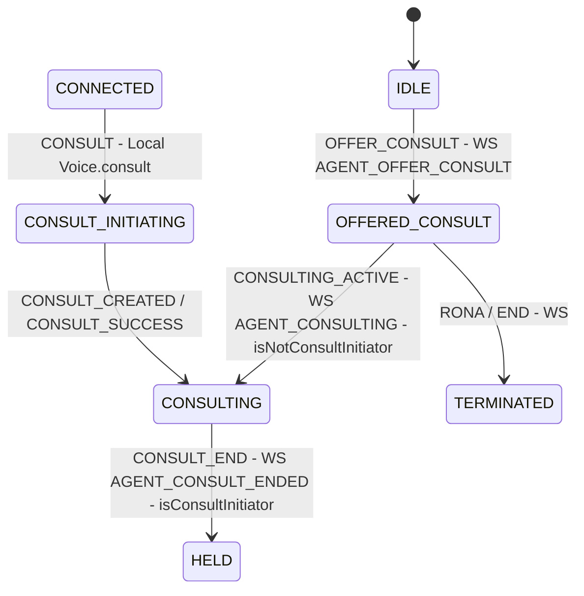

# Task State Machine Flow (Contact Center)

This document explains event origins, consult roles, and all state transitions in the task state machine.

## Event Origins (Local vs WebSocket)

Origin uses:

- WS: CC_EVENTS.* WebSocket event mapped in `packages/@webex/contact-center/src/services/task/TaskManager.ts`
- Local: Voice.* method sends TaskEvent directly

| TaskEvent                   | Origin     | Source                                                                                                                                                            |
| --------------------------- | ---------- | ----------------------------------------------------------------------------------------------------------------------------------------------------------------- |
| TASK_INCOMING               | WS         | CC_EVENTS.AGENT_CONTACT_RESERVED                                                                                                                                  |
| TASK_OFFERED                | WS         | CC_EVENTS.AGENT_OFFER_CONTACT                                                                                                                                     |
| OFFER_CONSULT               | WS         | CC_EVENTS.AGENT_OFFER_CONSULT                                                                                                                                     |
| HYDRATE                     | WS         | CC_EVENTS.AGENT_CONTACT                                                                                                                                           |
| ASSIGN                      | WS         | CC_EVENTS.AGENT_CONTACT_ASSIGNED                                                                                                                                  |
| HOLD_INITIATED              | Local      | Voice.holdResume()                                                                                                                                                |
| UNHOLD_INITIATED            | Local      | Voice.holdResume()                                                                                                                                                |
| HOLD_SUCCESS                | WS + Local | CC_EVENTS.AGENT_CONTACT_HELD; Voice.holdResume()                                                                                                                  |
| UNHOLD_SUCCESS              | WS + Local | CC_EVENTS.AGENT_CONTACT_UNHELD; Voice.holdResume()                                                                                                                |
| HOLD_FAILED                 | Local      | Voice.holdResume()                                                                                                                                                |
| UNHOLD_FAILED               | Local      | Voice.holdResume()                                                                                                                                                |
| CONSULT                     | Local      | Voice.consult()                                                                                                                                                   |
| CONSULT_SUCCESS             | Local      | Voice.consult()                                                                                                                                                   |
| CONSULT_CREATED             | WS         | CC_EVENTS.AGENT_CONSULT_CREATED                                                                                                                                   |
| CONSULTING_ACTIVE           | WS         | CC_EVENTS.AGENT_CONSULTING                                                                                                                                        |
| CONSULT_END                 | WS         | CC_EVENTS.AGENT_CONSULT_ENDED                                                                                                                                     |
| CONSULT_FAILED              | WS + Local | CC_EVENTS.AGENT_CONSULT_FAILED, CC_EVENTS.AGENT_CTQ_FAILED; Voice.consult()                                                                                       |
| MERGE_TO_CONFERENCE         | Local      | Voice.consultConference()                                                                                                                                         |
| CONFERENCE_START            | WS + Local | CC_EVENTS.AGENT_CONSULT_CONFERENCED, CC_EVENTS.PARTICIPANT_JOINED_CONFERENCE; Voice.consultConference()                                                           |
| CONFERENCE_FAILED           | WS + Local | CC_EVENTS.AGENT_CONSULT_CONFERENCE_FAILED; Voice.consultConference()                                                                                              |
| CONFERENCE_END              | WS         | CC_EVENTS.AGENT_CONSULT_CONFERENCE_ENDED                                                                                                                          |
| TRANSFER_CONFERENCE         | Local      | Voice.transferConference()                                                                                                                                        |
| TRANSFER_CONFERENCE_SUCCESS | WS + Local | CC_EVENTS.AGENT_CONFERENCE_TRANSFERRED; Voice.transferConference()                                                                                                |
| TRANSFER_CONFERENCE_FAILED  | Local      | Voice.transferConference()                                                                                                                                        |
| PARTICIPANT_LEAVE           | WS         | CC_EVENTS.PARTICIPANT_LEFT_CONFERENCE                                                                                                                             |
| EXIT_CONFERENCE             | Local      | Voice.exitConference()                                                                                                                                            |
| EXIT_CONFERENCE_SUCCESS     | Local      | Voice.exitConference()                                                                                                                                            |
| EXIT_CONFERENCE_FAILED      | Local      | Voice.exitConference()                                                                                                                                            |
| RECORDING_STARTED           | WS         | CC_EVENTS.CONTACT_RECORDING_STARTED                                                                                                                               |
| PAUSE_RECORDING             | WS         | CC_EVENTS.CONTACT_RECORDING_PAUSED                                                                                                                                |
| RESUME_RECORDING            | WS         | CC_EVENTS.CONTACT_RECORDING_RESUMED                                                                                                                               |
| TRANSFER_SUCCESS            | WS         | CC_EVENTS.AGENT_BLIND_TRANSFERRED, CC_EVENTS.AGENT_CONSULT_TRANSFERRED, CC_EVENTS.AGENT_VTEAM_TRANSFERRED                                                         |
| TRANSFER_FAILED             | WS         | CC_EVENTS.AGENT_BLIND_TRANSFER_FAILED, CC_EVENTS.AGENT_VTEAM_TRANSFER_FAILED, CC_EVENTS.AGENT_CONSULT_TRANSFER_FAILED, CC_EVENTS.AGENT_CONFERENCE_TRANSFER_FAILED |
| WRAPUP_COMPLETE             | WS         | CC_EVENTS.AGENT_WRAPPEDUP                                                                                                                                         |
| END                         | WS         | CC_EVENTS.AGENT_WRAPUP                                                                                                                                            |
| RONA                        | WS         | CC_EVENTS.AGENT_CONTACT_OFFER_RONA                                                                                                                                |
| CONTACT_ENDED               | WS         | CC_EVENTS.CONTACT_ENDED                                                                                                                                           |
| ASSIGN_FAILED               | WS         | CC_EVENTS.AGENT_CONTACT_ASSIGN_FAILED                                                                                                                             |
| INVITE_FAILED               | WS         | CC_EVENTS.AGENT_INVITE_FAILED                                                                                                                                     |
| OUTBOUND_FAILED             | WS         | CC_EVENTS.AGENT_OUTBOUND_FAILED                                                                                                                                   |
| CTQ_CANCEL                  | WS         | CC_EVENTS.AGENT_CTQ_CANCELLED                                                                                                                                     |
| CTQ_CANCEL_FAILED           | WS         | CC_EVENTS.AGENT_CTQ_CANCEL_FAILED                                                                                                                                 |

## Consult Roles (Initiator vs Receiver)

Initiator:

- The agent who clicks Consult (Voice.consult()).
- Sets context via setConsultInitiator and setConsultDestination.
- Drives CONSULT_INITIATING -> CONSULTING, then may MERGE_TO_CONFERENCE or TRANSFER.

Receiver:

- The agent who gets a consult offer (OFFER_CONSULT).
- Enters OFFERED_CONSULT while the consult is ringing.
- Moves to CONSULTING on CONSULTING_ACTIVE.

Consult role flow (focused view):

## Transition Catalog (Per State)

Notes:

- guard: TaskStateMachine guard name
- actions: transition actions (context updates + emits)

### Global (no state change)

| Event              | Origin                        | Actions                                       |
| ------------------ | ----------------------------- | --------------------------------------------- |
| RECORDING_STARTED  | WS: CONTACT_RECORDING_STARTED | updateTaskData, emitTaskRecordingStarted      |
| HYDRATE (non-IDLE) | WS: AGENT_CONTACT             | updateTaskData, emitTaskHydrate               |
| CTQ_CANCEL         | WS: AGENT_CTQ_CANCELLED       | updateTaskData, emitTaskConsultQueueCancelled |
| CTQ_CANCEL_FAILED  | WS: AGENT_CTQ_CANCEL_FAILED   | updateTaskData, emitTaskConsultQueueFailed    |

### IDLE

| Event         | Origin                     | Guard                        | Target          | Actions                                    |
| ------------- | -------------------------- | ---------------------------- | --------------- | ------------------------------------------ |
| HYDRATE       | WS: AGENT_CONTACT          | isInteractionTerminated      | WRAPPING_UP     | updateTaskData, markEnded, emitTaskHydrate |
| HYDRATE       | WS: AGENT_CONTACT          | isInteractionConsulting      | CONSULTING      | updateTaskData, emitTaskHydrate            |
| HYDRATE       | WS: AGENT_CONTACT          | isInteractionHeld            | HELD            | updateTaskData, emitTaskHydrate            |
| HYDRATE       | WS: AGENT_CONTACT          | isInteractionConnected       | CONNECTED       | updateTaskData, emitTaskHydrate            |
| HYDRATE       | WS: AGENT_CONTACT          | isConferencingByParticipants | CONFERENCING    | updateTaskData, emitTaskHydrate            |
| HYDRATE       | WS: AGENT_CONTACT          | default                      | IDLE            | updateTaskData, emitTaskHydrate            |
| TASK_INCOMING | WS: AGENT_CONTACT_RESERVED | -                            | OFFERED         | initializeTask, emitTaskIncoming           |
| OFFER_CONSULT | WS: AGENT_OFFER_CONSULT    | -                            | OFFERED_CONSULT | initializeTask, emitTaskOfferConsult       |

### OFFERED

| Event           | Origin                          | Guard | Target          | Actions                                   |
| --------------- | ------------------------------- | ----- | --------------- | ----------------------------------------- |
| TASK_OFFERED    | WS: AGENT_OFFER_CONTACT         | -     | OFFERED         | updateTaskData, emitTaskOfferContact      |
| ASSIGN          | WS: AGENT_CONTACT_ASSIGNED      | -     | CONNECTED       | updateTaskData, emitTaskAssigned          |
| RONA            | WS: AGENT_CONTACT_OFFER_RONA    | -     | TERMINATED      | updateTaskData, markEnded, emitTaskReject |
| END             | WS: AGENT_WRAPUP                | -     | TERMINATED      | updateTaskData, markEnded, emitTaskEnd    |
| ASSIGN_FAILED   | WS: AGENT_CONTACT_ASSIGN_FAILED | -     | TERMINATED      | updateTaskData, markEnded, emitTaskReject |
| INVITE_FAILED   | WS: AGENT_INVITE_FAILED         | -     | TERMINATED      | updateTaskData, markEnded, emitTaskReject |
| OUTBOUND_FAILED | WS: AGENT_OUTBOUND_FAILED       | -     | TERMINATED      | updateTaskData, markEnded, emitTaskReject |
| OFFER_CONSULT   | WS: AGENT_OFFER_CONSULT         | -     | OFFERED_CONSULT | updateTaskData, emitTaskOfferConsult      |

### OFFERED_CONSULT

| Event             | Origin                       | Guard                 | Target     | Actions                                                                            |
| ----------------- | ---------------------------- | --------------------- | ---------- | ---------------------------------------------------------------------------------- |
| CONSULTING_ACTIVE | WS: AGENT_CONSULTING         | isNotConsultInitiator | CONSULTING | updateTaskData, setConsultAgentJoined, emitTaskConsultAccepted, emitTaskConsulting |
| RONA              | WS: AGENT_CONTACT_OFFER_RONA | -                     | TERMINATED | updateTaskData, markEnded, emitTaskReject                                          |
| END               | WS: AGENT_WRAPUP             | -                     | TERMINATED | updateTaskData, markEnded, emitTaskEnd                                             |

### CONNECTED

| Event            | Origin                        | Guard                         | Target             | Actions                                                     |
| ---------------- | ----------------------------- | ----------------------------- | ------------------ | ----------------------------------------------------------- |
| ASSIGN           | WS: AGENT_CONTACT_ASSIGNED    | -                             | CONNECTED          | updateTaskData, emitTaskAssigned                            |
| HOLD_INITIATED   | Local: Voice.holdResume()     | -                             | HOLD_INITIATING    | setHoldInitiated                                            |
| HOLD_SUCCESS     | WS or Local                   | -                             | HELD               | updateTaskData, setHoldState, emitTaskHold                  |
| HOLD_FAILED      | Local: Voice.holdResume()     | -                             | CONNECTED          | updateTaskData                                              |
| CONSULT          | Local: Voice.consult()        | -                             | CONSULT_INITIATING | setConsultInitiator, setConsultDestination                  |
| CONSULT_CREATED  | WS: AGENT_CONSULT_CREATED     | notInConferenceFromEvent      | CONSULTING         | updateTaskData, setConsultInitiator, emitTaskConsultCreated |
| CONSULT_CREATED  | WS: AGENT_CONSULT_CREATED     | default                       | CONNECTED          | updateTaskData                                              |
| TRANSFER_SUCCESS | WS transfer                   | shouldWrapUpOrIsInitiator     | WRAPPING_UP        | updateTaskData, markEnded, emitTaskWrapup, finalizeTransfer |
| TRANSFER_SUCCESS | WS transfer                   | default                       | CONNECTED          | updateTaskData, clearConsultState, finalizeTransfer         |
| TRANSFER_FAILED  | WS transfer                   | -                             | CONNECTED          | updateTaskData, finalizeTransfer                            |
| CONTACT_ENDED    | WS: CONTACT_ENDED             | conferenceInProgressFromEvent | CONFERENCING       | updateTaskData, emitTaskConferenceStart                     |
| CONTACT_ENDED    | WS: CONTACT_ENDED             | shouldWrapUp                  | WRAPPING_UP        | updateTaskData, markEnded, emitTaskWrapup                   |
| CONTACT_ENDED    | WS: CONTACT_ENDED             | default                       | TERMINATED         | updateTaskData, markEnded, emitTaskEnd                      |
| END              | WS: AGENT_WRAPUP              | -                             | WRAPPING_UP        | updateTaskData, markEnded, emitTaskWrapup                   |
| PAUSE_RECORDING  | WS: CONTACT_RECORDING_PAUSED  | -                             | CONNECTED          | updateTaskData, setRecordingState, emitTaskRecordingPaused  |
| RESUME_RECORDING | WS: CONTACT_RECORDING_RESUMED | -                             | CONNECTED          | updateTaskData, setRecordingState, emitTaskRecordingResumed |

### HOLD_INITIATING

| Event        | Origin                    | Guard | Target    | Actions                                    |
| ------------ | ------------------------- | ----- | --------- | ------------------------------------------ |
| HOLD_SUCCESS | WS or Local               | -     | HELD      | updateTaskData, setHoldState, emitTaskHold |
| HOLD_FAILED  | Local: Voice.holdResume() | -     | CONNECTED | updateTaskData                             |

### HELD

| Event            | Origin                    | Guard                         | Target             | Actions                                                     |
| ---------------- | ------------------------- | ----------------------------- | ------------------ | ----------------------------------------------------------- |
| UNHOLD_INITIATED | Local: Voice.holdResume() | -                             | RESUME_INITIATING  | -                                                           |
| UNHOLD_SUCCESS   | WS or Local               | -                             | CONNECTED          | updateTaskData, setHoldState, emitTaskResume                |
| UNHOLD_FAILED    | Local: Voice.holdResume() | -                             | HELD               | updateTaskData                                              |
| CONSULT          | Local: Voice.consult()    | -                             | CONSULT_INITIATING | setConsultInitiator, setConsultDestination                  |
| TRANSFER_SUCCESS | WS transfer               | shouldWrapUpOrIsInitiator     | WRAPPING_UP        | updateTaskData, markEnded, emitTaskWrapup, finalizeTransfer |
| TRANSFER_SUCCESS | WS transfer               | default                       | CONNECTED          | updateTaskData, clearConsultState, finalizeTransfer         |
| TRANSFER_FAILED  | WS transfer               | -                             | HELD               | updateTaskData, finalizeTransfer                            |
| CONTACT_ENDED    | WS: CONTACT_ENDED         | conferenceInProgressFromEvent | CONFERENCING       | updateTaskData, emitTaskConferenceStart                     |
| CONTACT_ENDED    | WS: CONTACT_ENDED         | shouldWrapUp                  | WRAPPING_UP        | updateTaskData, markEnded, emitTaskWrapup                   |
| CONTACT_ENDED    | WS: CONTACT_ENDED         | default                       | TERMINATED         | updateTaskData, markEnded, emitTaskEnd                      |
| END              | WS: AGENT_WRAPUP          | -                             | WRAPPING_UP        | updateTaskData, markEnded, emitTaskWrapup                   |

### RESUME_INITIATING

| Event          | Origin                    | Guard | Target    | Actions                                      |
| -------------- | ------------------------- | ----- | --------- | -------------------------------------------- |
| UNHOLD_SUCCESS | WS or Local               | -     | CONNECTED | updateTaskData, setHoldState, emitTaskResume |
| UNHOLD_FAILED  | Local: Voice.holdResume() | -     | HELD      | -                                            |

### CONSULT_INITIATING

| Event           | Origin                    | Guard                             | Target             | Actions                                                     |
| --------------- | ------------------------- | --------------------------------- | ------------------ | ----------------------------------------------------------- |
| HOLD_SUCCESS    | WS or Local               | -                                 | CONSULT_INITIATING | updateTaskData                                              |
| HOLD_FAILED     | Local: Voice.holdResume() | -                                 | CONNECTED          | updateTaskData, handleConsultFailed                         |
| CONSULT_CREATED | WS: AGENT_CONSULT_CREATED | isConsultingAgentOrBeingConsulted | CONSULTING         | updateTaskData, setConsultInitiator, emitTaskConsultCreated |
| CONSULT_CREATED | WS: AGENT_CONSULT_CREATED | default                           | CONSULT_INITIATING | updateTaskData                                              |
| CONSULT_SUCCESS | Local: Voice.consult()    | -                                 | CONSULTING         | updateTaskData, setConsultInitiator                         |
| CONSULT_FAILED  | WS or Local               | isConsultQueueFlow                | CONNECTED          | updateTaskData, handleConsultFailed                         |
| CONSULT_FAILED  | WS or Local               | conferenceActiveInEventOrContext  | CONFERENCING       | updateTaskData, handleConsultFailed                         |
| CONSULT_FAILED  | WS or Local               | serverReportsHeld                 | HELD               | updateTaskData, handleConsultFailed                         |
| CONSULT_FAILED  | WS or Local               | serverReportsConsulting           | CONSULTING         | updateTaskData, handleConsultFailed                         |
| CONSULT_FAILED  | WS or Local               | default                           | CONNECTED          | updateTaskData, handleConsultFailed                         |
| CTQ_CANCEL      | WS: AGENT_CTQ_CANCELLED   | isConsultQueueFlow                | CONNECTED          | updateTaskData, clearConsultState                           |
| CTQ_CANCEL      | WS: AGENT_CTQ_CANCELLED   | serverReportsHeld                 | HELD               | updateTaskData, clearConsultState                           |
| CTQ_CANCEL      | WS: AGENT_CTQ_CANCELLED   | serverReportsConsulting           | CONSULTING         | updateTaskData, clearConsultState                           |
| CTQ_CANCEL      | WS: AGENT_CTQ_CANCELLED   | default                           | CONNECTED          | updateTaskData, clearConsultState                           |

### CONSULTING

| Event                       | Origin                            | Guard                            | Target          | Actions                                                                                       |
| --------------------------- | --------------------------------- | -------------------------------- | --------------- | --------------------------------------------------------------------------------------------- |
| CONSULTING_ACTIVE           | WS: AGENT_CONSULTING              | -                                | CONSULTING      | updateTaskData, setConsultAgentJoined, emitTaskConsulting                                     |
| CONSULT_END                 | WS: AGENT_CONSULT_ENDED           | isInitiatorAndConferenceActive   | CONFERENCING    | updateTaskData, clearConsultState, emitTaskConsultEnd                                         |
| CONSULT_END                 | WS: AGENT_CONSULT_ENDED           | isConsultInitiator               | HELD            | updateTaskData, clearConsultState, emitTaskConsultEnd                                         |
| CONSULT_END                 | WS: AGENT_CONSULT_ENDED           | default                          | TERMINATED      | updateTaskData, clearResources                                                                |
| HOLD_SUCCESS                | WS or Local                       | -                                | CONSULTING      | updateTaskData, setHoldState, setConsultCallHeld                                              |
| UNHOLD_SUCCESS              | WS or Local                       | -                                | CONSULTING      | updateTaskData, setHoldState, clearConsultCallHeld                                            |
| TRANSFER_SUCCESS            | WS transfer                       | shouldWrapUpOrIsInitiator        | WRAPPING_UP     | updateTaskData, markEnded, emitTaskWrapup, finalizeTransfer                                   |
| TRANSFER_SUCCESS            | WS transfer                       | default                          | CONNECTED       | updateTaskData, clearConsultState, finalizeTransfer                                           |
| TRANSFER_FAILED             | WS transfer                       | -                                | CONSULTING      | updateTaskData, finalizeTransfer                                                              |
| TRANSFER_CONFERENCE         | Local: Voice.transferConference() | -                                | CONSULTING      | handleTransferInit, emitTaskTransferConference                                                |
| TRANSFER_CONFERENCE_SUCCESS | WS or Local                       | shouldWrapUp                     | WRAPPING_UP     | updateTaskData, markEnded, clearConsultState, handleTransferConferenceSuccess, emitTaskWrapup |
| TRANSFER_CONFERENCE_SUCCESS | WS or Local                       | conferenceActiveInEventOrContext | CONFERENCING    | updateTaskData, clearConsultState, handleTransferConferenceSuccess                            |
| TRANSFER_CONFERENCE_SUCCESS | WS or Local                       | default                          | CONNECTED       | updateTaskData, clearConsultState, handleTransferConferenceSuccess                            |
| TRANSFER_CONFERENCE_FAILED  | Local: Voice.transferConference() | -                                | CONSULTING      | handleTransferConferenceFailed                                                                |
| ASSIGN                      | WS: AGENT_CONTACT_ASSIGNED        | -                                | CONNECTED       | updateTaskData, emitTaskAssigned                                                              |
| CONTACT_ENDED               | WS: CONTACT_ENDED                 | -                                | WRAPPING_UP     | updateTaskData, markEnded, clearConsultState, emitTaskWrapup                                  |
| END                         | WS: AGENT_WRAPUP                  | -                                | WRAPPING_UP     | updateTaskData, markEnded, clearConsultState, emitTaskWrapup                                  |
| MERGE_TO_CONFERENCE         | Local: Voice.consultConference()  | -                                | CONF_INITIATING | handleConferenceInit                                                                          |
| CONFERENCE_START            | WS or Local                       | -                                | CONFERENCING    | handleConferenceStarted, clearConsultState                                                    |
| CONFERENCE_FAILED           | WS or Local                       | -                                | CONSULTING      | handleConferenceFailed                                                                        |

### CONF_INITIATING

| Event             | Origin      | Guard | Target       | Actions                 |
| ----------------- | ----------- | ----- | ------------ | ----------------------- |
| CONFERENCE_START  | WS or Local | -     | CONFERENCING | handleConferenceStarted |
| CONFERENCE_FAILED | WS or Local | -     | CONSULTING   | handleConferenceFailed  |

### CONFERENCING

| Event                       | Origin                             | Guard                                       | Target             | Actions                                                                                                    |
| --------------------------- | ---------------------------------- | ------------------------------------------- | ------------------ | ---------------------------------------------------------------------------------------------------------- |
| CONSULT                     | Local: Voice.consult()             | -                                           | CONSULT_INITIATING | setConsultInitiator, setConsultDestination                                                                 |
| CONSULT_CREATED             | WS: AGENT_CONSULT_CREATED          | didInitiateConsult                          | CONSULTING         | updateTaskData, emitTaskConsultCreated                                                                     |
| CONSULT_CREATED             | WS: AGENT_CONSULT_CREATED          | default                                     | CONFERENCING       | updateTaskData                                                                                             |
| PARTICIPANT_LEAVE           | WS: PARTICIPANT_LEFT_CONFERENCE    | shouldDowngradeConference                   | CONNECTED          | updateTaskData, handleParticipantLeft, clearConsultState, emitTaskParticipantLeft, emitTaskConferenceEnded |
| PARTICIPANT_LEAVE           | WS: PARTICIPANT_LEFT_CONFERENCE    | default                                     | CONFERENCING       | updateTaskData, handleParticipantLeft, emitTaskParticipantLeft                                             |
| EXIT_CONFERENCE             | Local: Voice.exitConference()      | -                                           | CONFERENCING       | setExitingConference, emitTaskExitConference                                                               |
| EXIT_CONFERENCE_SUCCESS     | Local: Voice.exitConference()      | conferenceActiveAndNotWrappingAndNotExiting | CONFERENCING       | updateTaskData, handleExitConferenceSuccess                                                                |
| EXIT_CONFERENCE_SUCCESS     | Local: Voice.exitConference()      | shouldWrapUp                                | WRAPPING_UP        | updateTaskData, markEnded, clearConsultState, handleExitConferenceSuccess, emitTaskWrapup                  |
| EXIT_CONFERENCE_SUCCESS     | Local: Voice.exitConference()      | isExitingConference                         | TERMINATED         | updateTaskData, markEnded, clearConsultState, handleExitConferenceSuccess, emitTaskEnd                     |
| EXIT_CONFERENCE_SUCCESS     | Local: Voice.exitConference()      | shouldDowngradeConference                   | CONNECTED          | updateTaskData, clearConsultState, handleExitConferenceSuccess, emitTaskConferenceEnded                    |
| EXIT_CONFERENCE_SUCCESS     | Local: Voice.exitConference()      | default                                     | CONFERENCING       | updateTaskData, handleExitConferenceSuccess                                                                |
| EXIT_CONFERENCE_FAILED      | Local: Voice.exitConference()      | -                                           | CONFERENCING       | handleExitConferenceFailed                                                                                 |
| TRANSFER_CONFERENCE         | Local: Voice.transferConference()  | -                                           | CONFERENCING       | handleTransferInit, emitTaskTransferConference                                                             |
| TRANSFER_CONFERENCE_SUCCESS | WS or Local                        | conferenceActiveAndNotWrapping              | CONFERENCING       | updateTaskData, handleTransferConferenceSuccess                                                            |
| TRANSFER_CONFERENCE_SUCCESS | WS or Local                        | shouldWrapUp                                | WRAPPING_UP        | updateTaskData, markEnded, clearConsultState, handleTransferConferenceSuccess, emitTaskWrapup              |
| TRANSFER_CONFERENCE_SUCCESS | WS or Local                        | shouldDowngradeConference                   | CONNECTED          | updateTaskData, clearConsultState, handleTransferConferenceSuccess, emitTaskConferenceEnded                |
| TRANSFER_CONFERENCE_SUCCESS | WS or Local                        | default                                     | CONFERENCING       | updateTaskData, handleTransferConferenceSuccess                                                            |
| TRANSFER_CONFERENCE_FAILED  | Local: Voice.transferConference()  | -                                           | CONFERENCING       | handleTransferConferenceFailed                                                                             |
| CONFERENCE_END              | WS: AGENT_CONSULT_CONFERENCE_ENDED | conferenceInProgressFromEvent               | CONFERENCING       | updateTaskData                                                                                             |
| CONFERENCE_END              | WS: AGENT_CONSULT_CONFERENCE_ENDED | default                                     | CONNECTED          | updateTaskData, clearConsultState, emitTaskConferenceEnded                                                 |
| CONTACT_ENDED               | WS: CONTACT_ENDED                  | conferenceActiveAndCustomerInCall           | CONFERENCING       | updateTaskData                                                                                             |
| CONTACT_ENDED               | WS: CONTACT_ENDED                  | conferenceActiveAndNotWrapping              | CONFERENCING       | updateTaskData                                                                                             |
| CONTACT_ENDED               | WS: CONTACT_ENDED                  | shouldWrapUp                                | WRAPPING_UP        | updateTaskData, markEnded, clearConsultState, emitTaskWrapup                                               |
| CONTACT_ENDED               | WS: CONTACT_ENDED                  | default                                     | CONNECTED          | updateTaskData, clearConsultState, emitTaskConferenceEnded                                                 |
| END                         | WS: AGENT_WRAPUP                   | -                                           | WRAPPING_UP        | updateTaskData, markEnded, clearConsultState, emitTaskWrapup                                               |

## State Machine Diagram (Simplified)

See Transition Catalog (Per State) for full guard/action detail.

```mermaid
stateDiagram-v2
  [*] --> IDLE

  %% IDLE (hydrate restores prior state)
  IDLE --> WRAPPING_UP: HYDRATE (WS AgentContact, terminated)
  IDLE --> CONSULTING: HYDRATE (WS AgentContact, consulting)
  IDLE --> HELD: HYDRATE (WS AgentContact, held)
  IDLE --> CONNECTED: HYDRATE (WS AgentContact, connected)
  IDLE --> CONFERENCING: HYDRATE (WS AgentContact, conference)
  IDLE --> IDLE: HYDRATE (WS AgentContact, default)
  IDLE --> OFFERED: TASK_INCOMING (WS AgentContactReserved)
  IDLE --> OFFERED_CONSULT: OFFER_CONSULT (WS AgentOfferConsult)

  %% OFFERED
  OFFERED --> CONNECTED: ASSIGN (WS AgentContactAssigned)
  OFFERED --> OFFERED_CONSULT: OFFER_CONSULT (WS AgentOfferConsult)
  OFFERED --> TERMINATED: RONA (WS AgentContactOfferRONA) / END (WS AgentWrapup) / ASSIGN_FAILED (WS AgentContactAssignFailed) / INVITE_FAILED (WS AgentInviteFailed) / OUTBOUND_FAILED (WS AgentOutboundFailed)

  note right of OFFERED
    Actions-only: TASK_OFFERED (WS AgentOfferContact)
  end note

  %% OFFERED_CONSULT
  OFFERED_CONSULT --> CONSULTING: CONSULTING_ACTIVE (WS AgentConsulting, not initiator)
  OFFERED_CONSULT --> TERMINATED: RONA (WS AgentContactOfferRONA) / END (WS AgentWrapup)

  %% CONNECTED (simplified)
  CONNECTED --> HOLD_INITIATING: HOLD_INITIATED (Local Voice.holdResume)
  CONNECTED --> HELD: HOLD_SUCCESS (WS AgentContactHeld or Local Voice.holdResume)
  CONNECTED --> CONSULT_INITIATING: CONSULT (Local Voice.consult)
  CONNECTED --> CONSULTING: CONSULT_CREATED (WS AgentConsultCreated, not in conference)
  CONNECTED --> CONFERENCING: CONTACT_ENDED (WS ContactEnded, conference active)
  CONNECTED --> WRAPPING_UP: TRANSFER_SUCCESS (WS AgentBlindTransferred/AgentConsultTransferred/AgentVTeamTransferred, wrapup/initiator) / CONTACT_ENDED (WS ContactEnded, shouldWrapUp) / END (WS AgentWrapup)
  CONNECTED --> TERMINATED: CONTACT_ENDED (WS ContactEnded, default)

  note right of CONNECTED
    Actions-only (no state change) on:
    ASSIGN (WS AgentContactAssigned), HOLD_FAILED (Local Voice.holdResume),
    CONSULT_CREATED (WS AgentConsultCreated, default),
    TRANSFER_SUCCESS (WS AgentBlindTransferred/AgentConsultTransferred/AgentVTeamTransferred, default),
    TRANSFER_FAILED (WS AgentBlindTransferFailed/AgentVTeamTransferFailed/AgentConsultTransferFailed/AgentConferenceTransferFailed),
    PAUSE_RECORDING (WS ContactRecordingPaused), RESUME_RECORDING (WS ContactRecordingResumed)
  end note

  %% HOLD_INITIATING
  HOLD_INITIATING --> HELD: HOLD_SUCCESS (WS AgentContactHeld or Local Voice.holdResume)
  HOLD_INITIATING --> CONNECTED: HOLD_FAILED (Local Voice.holdResume)

  %% HELD (simplified)
  HELD --> RESUME_INITIATING: UNHOLD_INITIATED (Local Voice.holdResume)
  HELD --> CONNECTED: UNHOLD_SUCCESS (WS AgentContactUnheld or Local Voice.holdResume) / TRANSFER_SUCCESS (WS AgentBlindTransferred/AgentConsultTransferred/AgentVTeamTransferred, default)
  HELD --> CONSULT_INITIATING: CONSULT (Local Voice.consult)
  HELD --> CONFERENCING: CONTACT_ENDED (WS ContactEnded, conference active)
  HELD --> WRAPPING_UP: TRANSFER_SUCCESS (WS AgentBlindTransferred/AgentConsultTransferred/AgentVTeamTransferred, wrapup/initiator) / CONTACT_ENDED (WS ContactEnded, shouldWrapUp) / END (WS AgentWrapup)
  HELD --> TERMINATED: CONTACT_ENDED (WS ContactEnded, default)

  note right of HELD
    Actions-only: UNHOLD_FAILED (Local Voice.holdResume),
    TRANSFER_FAILED (WS AgentBlindTransferFailed/AgentVTeamTransferFailed/AgentConsultTransferFailed/AgentConferenceTransferFailed)
  end note

  %% RESUME_INITIATING
  RESUME_INITIATING --> CONNECTED: UNHOLD_SUCCESS (WS AgentContactUnheld or Local Voice.holdResume)
  RESUME_INITIATING --> HELD: UNHOLD_FAILED (Local Voice.holdResume)

  %% CONSULT_INITIATING (simplified)
  CONSULT_INITIATING --> CONNECTED: HOLD_FAILED (Local Voice.holdResume)
  CONSULT_INITIATING --> CONSULTING: CONSULT_CREATED (WS AgentConsultCreated, initiator/consulted) / CONSULT_SUCCESS (Local Voice.consult)

  note right of CONSULT_INITIATING
    CONSULT_FAILED (WS AgentConsultFailed/AgentCtqFailed or Local Voice.consult)
    and CTQ_CANCEL (WS AgentCtqCancelled) target depends on server state:
    CONNECTED, HELD, CONFERENCING, or CONSULTING.
    Actions-only: HOLD_SUCCESS (WS AgentContactHeld or Local Voice.holdResume),
    CONSULT_CREATED (WS AgentConsultCreated, default)
  end note

  %% CONSULTING (simplified)
  CONSULTING --> CONFERENCING: CONSULT_END (WS AgentConsultEnded, initiator + conference active) / TRANSFER_CONFERENCE_SUCCESS (WS AgentConferenceTransferred or Local Voice.transferConference, conference active) / CONFERENCE_START (WS AgentConsultConferenced/ParticipantJoinedConference or Local Voice.consultConference)
  CONSULTING --> HELD: CONSULT_END (WS AgentConsultEnded, initiator, no conference)
  CONSULTING --> TERMINATED: CONSULT_END (WS AgentConsultEnded, default)
  CONSULTING --> CONF_INITIATING: MERGE_TO_CONFERENCE (Local Voice.consultConference)
  CONSULTING --> CONNECTED: ASSIGN (WS AgentContactAssigned) / TRANSFER_SUCCESS (WS AgentBlindTransferred/AgentConsultTransferred/AgentVTeamTransferred, default) / TRANSFER_CONFERENCE_SUCCESS (WS AgentConferenceTransferred or Local Voice.transferConference, default)
  CONSULTING --> WRAPPING_UP: TRANSFER_SUCCESS (WS AgentBlindTransferred/AgentConsultTransferred/AgentVTeamTransferred, wrapup/initiator) / TRANSFER_CONFERENCE_SUCCESS (WS AgentConferenceTransferred or Local Voice.transferConference, shouldWrapUp) / CONTACT_ENDED (WS ContactEnded) / END (WS AgentWrapup)

  note right of CONSULTING
    Actions-only: CONSULTING_ACTIVE (WS AgentConsulting),
    HOLD_SUCCESS (WS AgentContactHeld or Local Voice.holdResume),
    UNHOLD_SUCCESS (WS AgentContactUnheld or Local Voice.holdResume),
    TRANSFER_FAILED (WS AgentBlindTransferFailed/AgentVTeamTransferFailed/AgentConsultTransferFailed/AgentConferenceTransferFailed),
    TRANSFER_CONFERENCE (Local Voice.transferConference),
    TRANSFER_CONFERENCE_FAILED (Local Voice.transferConference),
    CONFERENCE_FAILED (WS AgentConsultConferenceFailed or Local Voice.consultConference)
  end note

  %% CONF_INITIATING
  CONF_INITIATING --> CONFERENCING: CONFERENCE_START (WS AgentConsultConferenced/ParticipantJoinedConference or Local Voice.consultConference)
  CONF_INITIATING --> CONSULTING: CONFERENCE_FAILED (WS AgentConsultConferenceFailed or Local Voice.consultConference)

  %% CONFERENCING (simplified)
  CONFERENCING --> CONSULT_INITIATING: CONSULT (Local Voice.consult)
  CONFERENCING --> CONSULTING: CONSULT_CREATED (WS AgentConsultCreated, didInitiateConsult)
  CONFERENCING --> CONNECTED: DOWNGRADE (PARTICIPANT_LEAVE (WS ParticipantLeftConference) / EXIT_CONFERENCE_SUCCESS (Local Voice.exitConference) / TRANSFER_CONFERENCE_SUCCESS (WS AgentConferenceTransferred or Local Voice.transferConference) / CONFERENCE_END (WS AgentConsultConferenceEnded) / CONTACT_ENDED (WS ContactEnded))
  CONFERENCING --> WRAPPING_UP: SHOULD_WRAPUP (EXIT_CONFERENCE_SUCCESS (Local Voice.exitConference) / TRANSFER_CONFERENCE_SUCCESS (WS AgentConferenceTransferred or Local Voice.transferConference) / CONTACT_ENDED (WS ContactEnded) / END (WS AgentWrapup))
  CONFERENCING --> TERMINATED: EXIT_CONFERENCE_SUCCESS (Local Voice.exitConference, isExitingConference)

  note right of CONFERENCING
    Actions vary by event; see Transition Catalog for exact actions/guards.
    Actions-only (no state change) on:
    CONSULT_CREATED (WS AgentConsultCreated, non-initiator),
    PARTICIPANT_LEAVE (WS ParticipantLeftConference, no downgrade),
    EXIT_CONFERENCE (Local Voice.exitConference),
    EXIT_CONFERENCE_SUCCESS (Local Voice.exitConference, stay active),
    EXIT_CONFERENCE_FAILED (Local Voice.exitConference),
    TRANSFER_CONFERENCE (Local Voice.transferConference),
    TRANSFER_CONFERENCE_SUCCESS (WS AgentConferenceTransferred or Local Voice.transferConference, stay active),
    TRANSFER_CONFERENCE_FAILED (Local Voice.transferConference),
    CONFERENCE_END (WS AgentConsultConferenceEnded, conference still in progress),
    CONTACT_ENDED (WS ContactEnded, conference active + not wrapping)
  end note

  %% WRAPPING_UP
  WRAPPING_UP --> COMPLETED: WRAPUP_COMPLETE (WS AgentWrappedup)
```

