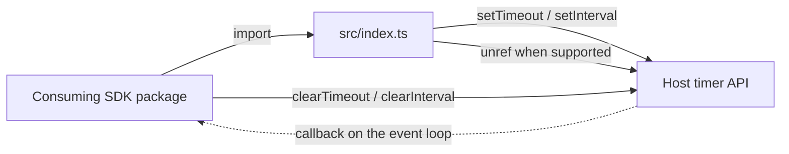

<!-- sdd-generated-metadata
doc_kind: standing-doc
generated_from: architecture@0.3.0
generated_by: claude-code
approved_by: pending
updated_at: 2026-09-28T05:34:36Z
validation_status: pass
-->

# @webex/common-timers architecture

Canonical architecture for the `@webex/common-timers` package. This document owns the facts that span
the package as a whole — what it is, what it publishes, what it depends on, and the platform and
release boundaries it sits inside. Behavior belongs to the owning module specification and is linked,
not repeated.

Related context: [specification registry](specs/README.md) ·
[repository agent instructions](../AGENTS.md)

## Applicability

| Condition ID                         | Status     | Evidence or reason                                                                                              | Owned section                       |
| ------------------------------------ | ---------- | ----------------------------------------------------------------------------------------------------------------- | ----------------------------------- |
| `repo.owns_datastore`                | N/A        | No migrations, ORM configuration, schema file, or connection string exists                                        | Repository data and schema          |
| `repo.holds_client_state`            | N/A        | No store or shared state model; the only state is one private field per `Timer` instance                          | Client state model                  |
| `repo.components_interact`           | N/A        | The package is a single module with a single source file; there is no second component to interact with           | Dependency and interaction topology |
| `repo.domain_data_across_components` | N/A        | No domain entities exist; callbacks and durations are opaque values the package never inspects                    | Object and data ownership           |
| `repo.caches_data`                   | N/A        | No cache client, memoization, or bounded store                                                                    | Caching catalog                     |
| `repo.observability_convention`      | N/A        | No logger, metric, trace, or audit call; the package emits nothing observable                                     | Observability patterns              |
| `repo.deploys_to_infra`              | N/A        | No container, manifest, or cloud configuration; the package is published to a registry, not deployed              | Runtime and infrastructure          |
| `repo.shared_base_libs`              | Applicable | Build, lint, and test behavior are inherited from workspace-internal `@webex/*-legacy` packages                   | Shared and base libraries           |
| `repo.is_monorepo`                   | N/A        | The documented scope is one package; workspace-wide package mapping is owned outside it                           | Package map and dependencies        |
| `repo.multi_platform`                | Applicable | The `unref` capability check, the `process` browser shim, and the browserify transform encode a Node/browser split | Platform matrix                     |
| `repo.published_package`             | Applicable | `package.json` declares `main`, `devMain`, and `deploy:npm`                                                       | Release and versioning              |
| `repo.embedded_in_host`              | N/A        | Consumed as a dependency; no mount contract, plugin manifest, or widget registration                              | Host integration and theming        |
| `repo.exposes_commands_or_artifacts` | N/A        | No CLI, generator, or repository-owned command surface; the published build output is covered by Release and versioning | Commands and generated artifacts |
| `repo.cross_repo_deps_material`      | N/A        | The package declares no runtime dependencies, so nothing external can affect its behavior or delivery             | Cross-repository topology           |
| `repo.security_arch_warranted`       | N/A        | No identity, token, secret, encryption, or trust boundary; the posture is recorded under Cross-cutting architecture | Security architecture              |

## Design overview

`@webex/common-timers` exists to solve one problem for every other package in the Webex JS SDK: a
pending timer must never be the reason a Node process refuses to exit.

Node's `setTimeout` and `setInterval` return a `Timeout` object that counts toward process liveness
until it fires or is cleared. An SDK that schedules retries, heartbeats, and batch flushes therefore
keeps a host CLI or test run alive long after the caller's work is done. Node's answer is
`Timeout.unref()`, and this package's answer is to make calling it unforgettable: the SDK imports
`safeSetTimeout` and `safeSetInterval` instead of the globals, and the `unref` call is built in.

That decision shapes everything else. Because browsers return a plain number with no `unref` method,
the wrappers feature-detect the method on the returned handle rather than branching on the platform —
so one module, one build, and no bundler shim serve both targets, at the cost of a
`number | NodeJS.Timeout` return type that every consumer has to accept.

A third export, `Timer`, sits on top. It is the one abstraction the free functions cannot express: a
deadline a caller can push back repeatedly and then retire, with a guarded `init → running → done`
lifecycle that throws rather than silently ignoring an invalid call. It arms itself through
`safeSetTimeout`, so a managed timer inherits the same process-exit safety.

The package is 117 lines in one file with zero runtime dependencies. Its architectural weight is
entirely in what it promises to the eleven workspace packages that consume it, not in its internal
structure.

## Resource inventory and responsibilities

| Resource               | Kind    | Responsibility                                                                                          | Owner                      | Source         | Detailed specification |
| ---------------------- | ------- | --------------------------------------------------------------------------------------------------------- | -------------------------- | -------------- | ---------------------- |
| `@webex/common-timers` | Package | Publish the SDK's timer vocabulary to npm and to the surrounding workspace                              | Cisco Webex for Developers | `package.json` | `src/docs/README.md`   |
| `src`                  | Module  | The timer primitives themselves: both scheduling wrappers, the `unref` capability check, and the `Timer` lifecycle | Cisco Webex for Developers | `src/index.ts` | [`src/docs/README.md`](../src/docs/README.md) |

## Interaction and execution flows

The package has no internal interactions to diagram — one module, one file. The architecturally
meaningful flow is the one that crosses its boundary: a consuming SDK package calls in, the module
calls the host runtime, and the host calls the consumer's callback back directly.

| From                  | To                    | Interaction or transport         | Purpose                                                                       | Failure or compatibility behavior                                                                            |
| --------------------- | --------------------- | -------------------------------- | ------------------------------------------------------------------------------- | ------------------------------------------------------------------------------------------------------------ |
| Consuming SDK package | `src`                 | Static import, synchronous call  | Schedule deferred or repeating work, or bound a request with a resettable deadline | `Timer` throws synchronously on an invalid lifecycle call; the free functions have no rejected path          |
| `src`                 | Host timer API        | Direct call to the runtime global | Create the timer and release it from process liveness                          | Platform errors propagate unchanged. A missing `unref` is skipped silently, leaving the platform default      |
| Host timer API        | Consuming SDK package | Event-loop callback              | Deliver the scheduled callback                                                 | A Node process may exit before the delay elapses, in which case the callback is never invoked at all          |
| Consuming SDK package | Host timer API        | Direct call to the runtime global | Cancel a timer using the returned handle                                       | The package exports no clear function; cancellation uses the platform's own `clearTimeout` / `clearInterval`  |

## Dependency topology

| Dependency                              | Type     | Used by | Purpose                                                                   | Version, failure, or fallback policy                                                                       |
| --------------------------------------- | -------- | ------- | --------------------------------------------------------------------------- | ---------------------------------------------------------------------------------------------------------- |
| Host timer API                          | External | `src`   | `setTimeout`, `setInterval`, and `clearTimeout` — the primitives being wrapped | No fallback and no polyfill. Whatever the runtime throws propagates to the caller unchanged                 |
| `Timeout.unref()` (Node-only extension) | External | `src`   | Release a pending timer from process liveness                             | Feature-detected on the handle. Absent in browsers, where the branch is skipped and the platform default applies |
| `@webex/babel-config-legacy`            | Internal | build   | Transpilation configuration                                               | `workspace:*`; development only, never shipped in the published artifact                                    |
| `@webex/eslint-config-legacy`           | Internal | lint    | Lint rules                                                                | `workspace:*`; development only                                                                             |
| `@webex/jest-config-legacy`             | Internal | test    | Unit-test configuration                                                   | `workspace:*`; development only                                                                             |
| `@webex/legacy-tools`                   | Internal | build   | The `webex-legacy-tools` build and test runner                            | `workspace:*`; development only                                                                             |

There are **no runtime dependencies**: `package.json` declares only `devDependencies`. That removes
every cycle, ordering constraint, and third-party single point of failure from this package — the
only thing it can depend on at runtime is the host itself. Exact versions live in
[`package.json`](../package.json).

## Public and consumer surfaces

| Surface                | Type | Owner | Consumers                                                                                                                                                                  | Compatibility policy                                                                                                                                    | Source         |
| ---------------------- | ---- | ----- | ---------------------------------------------------------------------------------------------------------------------------------------------------------------------------- | --------------------------------------------------------------------------------------------------------------------------------------------------------- | -------------- |
| `common-timers-sdk`    | SDK  | `src` | Declared by `internal-plugin-mercury`, `internal-plugin-metrics`, `internal-plugin-device`, `internal-plugin-encryption`, `internal-plugin-avatar`, `internal-plugin-dss`, `internal-plugin-ai-assistant`, `internal-plugin-scheduler`, `webex-core`, and `calling`; additionally imported, without being declared, by `plugin-meetings` | Published npm surface: `safeSetTimeout`, `safeSetInterval`, and `Timer`. Stable under the workspace's shared semantic version; the wrapper signatures track the platform's own | `package.json` |

`common-timers-sdk` is the package's only contract. Its canonical native source is the package entry
point declared by `main` and `devMain` in [`package.json`](../package.json); per-export detail,
including the parameter and return types, lives in the owning module specification's `Public surface`
and `Export stability` sections at [`src/docs/README.md`](../src/docs/README.md). This page indexes
the contract; it does not restate the declarations.

The declared and importing consumer sets differ in both directions, which matters for impact
analysis: `internal-plugin-scheduler` declares the dependency without importing it, and
`plugin-meetings` imports it without declaring it. A dependency-graph query over `package.json`
files alone therefore both over- and under-states the blast radius of a surface change. The module
specification records the per-export breakdown.

The package consumes one external contract, `host-timer-api` — the runtime's own
`setTimeout`/`setInterval`/`clearTimeout` plus the Node `Timeout.unref()` extension. It is external
and unversioned by this repository; its consumption is recorded in the module spec's `Dependencies`.

## Cross-cutting architecture

### Security

- **Trust boundaries and identity flow:** none. The package has no identity, no authentication, and
  no trust boundary. It never reads configuration, never touches the network, and never inspects the
  callback or duration a caller passes it.
- **Sensitive surfaces and data classes:** none. No data of any classification transits the package;
  arguments are forwarded to the host scheduler and never stored, logged, or serialized.
- **Encryption and secret boundaries:** not applicable. Nothing is persisted or transmitted.

The security-relevant property of this package is a liveness one, not a confidentiality one: because
every timer is unref-ed, the package can cause scheduled work to be silently dropped at process exit.
Consumers that require a callback to run before shutdown must hold the process open themselves.

### Observability and operations

- **Logging and correlation:** none. The package emits no log line, and deliberately takes no logger
  dependency — a timer primitive called from ten packages would produce noise with no correlation
  context of its own. Consumers log around their own timer usage.
- **Metrics, traces, and audit signals:** none emitted or consumed.
- **Ownership and operational entry points:** the package is maintained by Cisco Webex for Developers
  as part of the Webex JS SDK workspace; it has no dashboard, alert, or runbook of its own because it
  has no runtime deployment. Failures surface inside the consuming package.

### Quality attributes

The measurable expectations that fit a dependency-free utility package of this size:

| Attribute                 | Expectation                                                                                                               | Evidence                                    |
| ------------------------- | ---------------------------------------------------------------------------------------------------------------------------- | ------------------------------------------- |
| Footprint                 | Zero runtime dependencies; the published artifact is one transpiled module                                                | `package.json`                              |
| Platform compatibility    | The same build runs on Node `>=18` and in a browser, with no conditional export or bundler shim                            | `package.json`, `src/index.ts`, `process`   |
| Process-exit safety       | No timer created through this package extends process lifetime                                                            | `src/index.ts`                              |
| Lifecycle correctness     | Every invalid `Timer` transition is rejected rather than ignored; all six rejection branches are covered by unit tests     | `test/unit/spec/index.ts`                   |
| Process-exit verification | The `unref` contract is asserted directly on both the Node and the handle-without-unref branch, and mutation-checked      | `test/unit/spec/index.ts`, `test/unit/spec/characterization.ts` |
| Test verification         | 41 unit cases across two suites, all passing. No coverage threshold gates the package — coverage collection is disabled in its jest config | `test/unit/spec/index.ts`, `test/unit/spec/characterization.ts`, `jest.config.js` |

Process-exit safety is the attribute that most needed proving, and it now is: a characterization
baseline pins the boundary and the `unref` assertions were mutation-checked, so removing the call
from the source turns them red. Per-requirement evidence and the one remaining negative-case gap are
recorded in the module specification's `Verification` section.

## Shared and base libraries

Every build, lint, and test behavior in this package is inherited. The package contributes three
two-line configuration files that do nothing but re-export the shared configuration.

| Library                       | Inherited responsibility                                                       | Consumers                   | Version floor | Compatibility rule                                                                        |
| ----------------------------- | -------------------------------------------------------------------------------- | --------------------------- | ------------- | ------------------------------------------------------------------------------------------ |
| `@webex/babel-config-legacy`  | Transpilation targets and plugins, re-exported verbatim by `babel.config.js`   | Build                       | `workspace:*` | Pinned to the workspace; a change to the shared config changes this package's output       |
| `@webex/eslint-config-legacy` | All lint rules, extended by `.eslintrc.js` with `root: true` and nothing else   | `test:style`                | `workspace:*` | Pinned to the workspace; this package adds no local rule or override                       |
| `@webex/jest-config-legacy`   | Unit-test runner configuration, re-exported verbatim by `jest.config.js`        | `test:unit`                 | `workspace:*` | Pinned to the workspace. It sets `collectCoverage: false`, which is why no gate applies here |
| `@webex/legacy-tools`         | The `webex-legacy-tools` build and test CLI invoked by the package scripts      | `build:src`, `test:unit`    | `workspace:*` | Pinned to the workspace; command flags are owned there, not here                           |

The practical consequence for a contributor: there is no package-local knob. Changing how this
package builds, lints, or tests means changing the shared workspace configuration.

## Platform matrix

The package targets Node and the browser from one source file and one build. The split is a single
runtime capability check, not a build-time branch.

| Platform | Shared versus platform-specific boundary                                                                                          | Entry or build                                                           | Support and compatibility constraints                                                                                             |
| -------- | ----------------------------------------------------------------------------------------------------------------------------------- | ------------------------------------------------------------------------ | ----------------------------------------------------------------------------------------------------------------------------------- |
| Node     | Fully shared. The handle is a `Timeout` object exposing `unref`, so the capability check succeeds and the timer is released from process liveness | `dist/index.js` via `main`, built by `build:src`                         | Requires Node `>=18` per `engines`. Scheduled callbacks may be dropped at process exit — that is the intended behavior             |
| Browser  | Fully shared. The handle is a number with no `unref`, so the check fails and the platform default applies                         | Same module; the browserify transform resolves the `process` shim to `{browser: true}` | No separate bundle, no `browser` field in `package.json`, and no polyfill. Behavior degrades to plain `setTimeout`/`setInterval` |

Because the two platforms return different handle types, the exported return type is the union
`number | NodeJS.Timeout`. That union is the visible cost of the single-build decision, and it is
part of the published contract rather than an implementation detail.

## Release and versioning

| Artifact               | Publish target | Versioning rule                                                                                                 | Deprecation window                                                                      | Changelog or migration obligation                                                              |
| ---------------------- | -------------- | ------------------------------------------------------------------------------------------------------------------- | --------------------------------------------------------------------------------------- | ------------------------------------------------------------------------------------------------ |
| `@webex/common-timers` | npm            | Published by `deploy:npm`. Version numbers are assigned by the workspace release pipeline, not declared in this package's `package.json` | Governed by the workspace release process; the package declares none of its own         | Changelog generation is owned at the workspace root. This package ships no `CHANGELOG.md`      |

The published artifact is `dist/index.js`, produced by `build:src`. In-workspace consumers resolve
`devMain` (`src/index.ts`) instead, so a change to the source is visible to sibling packages without
a publish. A breaking change to any of the three exports is a breaking change for eleven workspace
packages plus external npm consumers; the module specification's `Export stability` section records
what specifically is promised, including that the `Timer` rejection message wording is asserted by
the unit suite.

## Domain language

| Term             | Repository-specific meaning                                                                                                                     | Authoritative source |
| ---------------- | ------------------------------------------------------------------------------------------------------------------------------------------------- | -------------------- |
| unref            | Asking a Node timer handle to stop counting toward process liveness, so a pending timer cannot prevent the process from exiting                 | `src/index.ts`       |
| safe             | In `safeSetTimeout` / `safeSetInterval`, specifically "safe against wedging a process open" — it implies nothing about error handling or types  | `README.md`          |
| handle           | The value the host scheduler returns: a `Timeout` object in Node, a number in a browser. The package returns it unchanged after unref-ing it     | `src/index.ts`       |
| arm              | Move a `Timer` from `init` to `running` by scheduling its callback. Only `start()` arms a timer                                                 | `src/index.ts`       |
| reset            | Clear a running timer and re-arm it for the **full** original timeout. It is an idle deadline, not a pause or a resume                          | `src/index.ts`       |
| done             | The terminal `Timer` state, reached by either expiry or cancellation. It is not recoverable and the two causes are indistinguishable            | `src/index.ts`       |

## References and maintenance

- Decisions: [adr/](adr/)
- Instantiated specifications and routing: [specs/README.md](specs/README.md)
- Module specification: [`src/docs/README.md`](../src/docs/README.md)
- Getting started: [getting-started.md](getting-started.md)
- Update this document in the same change that alters the package's published surface, its
  dependency posture, its platform support, or its release boundary. A change confined to timer
  behavior belongs in the module specification instead.
