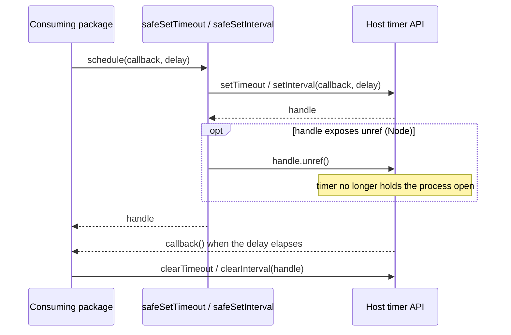
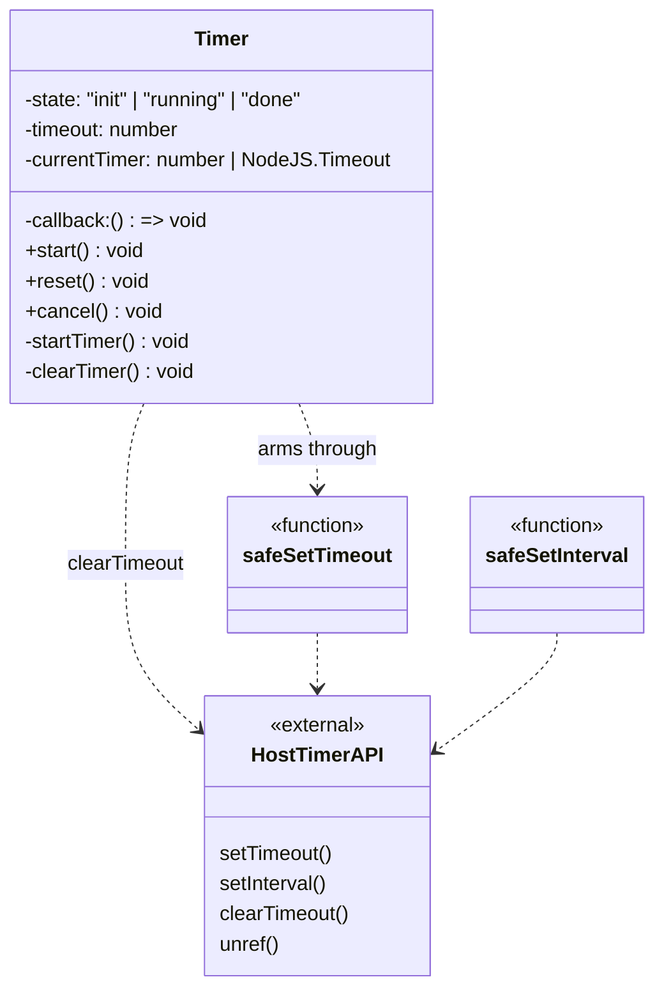
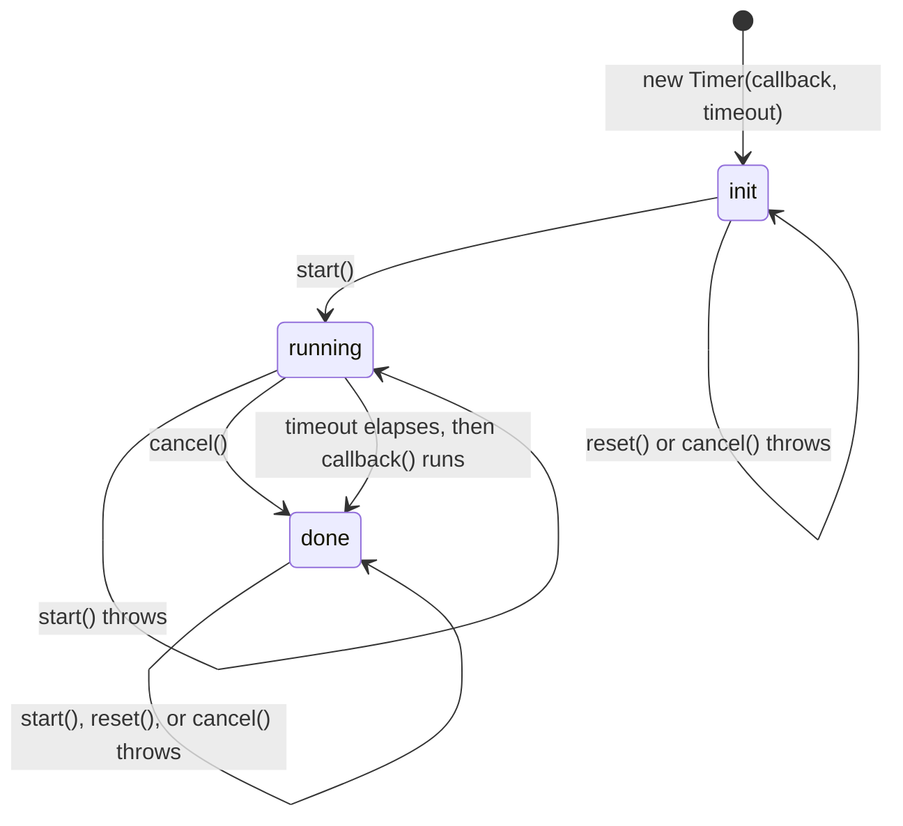

<!-- sdd-generated-metadata
doc_kind: module-spec
generated_from: module-spec@0.3.0
generated_by: claude-code
approved_by: pending
updated_at: 2026-09-28T05:34:36Z
validation_status: pass
-->

# common-timers package surface

This source-local document at `src/docs/README.md` owns the stable specification for the
**`@webex/common-timers` package surface**: the two scheduling wrappers that stop a pending timer
from holding a Node process open, and the `Timer` class that adds a guarded, restartable one-shot
lifecycle on top of them.

The whole package is one file. There is no sub-module, no network call, and no persisted state.

Related context: [repository architecture](../../docs/architecture.md) ·
[documentation index](../../docs/index.md) · [agent instructions](../../AGENTS.md) ·
[specification registry](../../docs/specs/README.md)

## Metadata

| Field             | Value                                                                                   |
| ----------------- | --------------------------------------------------------------------------------------- |
| Owner             | Cisco Webex for Developers                                                                |
| Source path       | `src`                                                                                     |
| Resource kind     | Package surface module                                                                    |
| Status            | Active                                                                                    |
| Last verified     | 2026-09-28 at `bc61c78ba5`                                                                |
| Module id         | `src`                                                                                     |
| Parent spec       | —                                                                                         |
| Doc kind          | Module spec                                                                               |
| Coverage score    | Field coverage 100% assessed 2026-09-24; 14 of 14 mandatory fields present, critical fields 9 of 9. Test coverage is **not** closed: the `unref` contract carries no automated assertion and this module has no characterization baseline |
| Validation status | stale; last assessed 2026-09-28 by validator `codex` against a test suite that has since been withdrawn from this change. Revalidation is required before promotion. The constructor timeout behaviour remains accepted-and-deferred as specified under [Pitfalls and constraints](#pitfalls-and-constraints) |

## Applicability

| Condition ID                         | Status     | Evidence or reason                                                                                          | Owned section                 |
| ------------------------------------ | ---------- | ------------------------------------------------------------------------------------------------------------- | ----------------------------- |
| `module.has_tiers`                   | N/A        | The package declares no tier, SLO, or tiered review rule in `package.json`                                    | Tier                          |
| `module.has_ui`                      | N/A        | No components, templates, or styles; the module renders nothing                                               | UI use-case flow              |
| `module.crosses_service_boundaries`  | N/A        | No HTTP, socket, RPC, or queue client in `src/index.ts`; every call stays inside the process                  | Cross-boundary use-case flow  |
| `module.holds_client_state`          | N/A        | No store and no shared state model; the only state is one private field per Timer, owned by State machine   | Client state model            |
| `module.enforces_domain_rules`       | N/A        | No domain entities; callbacks and durations are opaque values the module never inspects                       | Business rules and invariants |
| `module.is_concurrent_async`         | Applicable | Every export schedules a callback onto the host event loop; `test/unit/spec/index.ts` must fake time to observe it | Concurrency and reactive flow |
| `module.owns_persistence`            | N/A        | Nothing is written to any store, file, or schema                                                              | Data, schema, and migration   |
| `module.stateful_transitions`        | Applicable | `src/index.ts` implements the init to running to done lifecycle with a terminal state and rejected transitions              | State machine                 |
| `module.exposes_wire_protocol`       | N/A        | No serialization, frame, or binary format                                                                     | Protocol and wire format      |
| `module.ui_multi_screen`             | N/A        | Gated by module.has_ui, which is N/A                                                                        | UI flow                       |
| `module.large_data_model`            | N/A        | Gated by module.owns_persistence, which is N/A                                                              | Data model                    |
| `module.returns_caller_errors`       | Applicable | The start, reset, and cancel methods each throw on an invalid transition in `src/index.ts`                          | Caller-visible failure modes  |
| `module.module_specific_conventions` | N/A        | `.eslintrc.js` only extends the shared workspace config; no rule is local to this module                      | Module-specific rules         |
| `module.published_package`           | Applicable | `package.json` declares the main, devMain, and deploy:npm fields                                                   | Export stability              |
| `module.embedded_in_host`            | N/A        | Consumed as a dependency; no mount contract, plugin manifest, or widget registration                          | Host integration and theming  |
| `module.has_design_tradeoff`         | Applicable | Unconditional unref-ing, in `src/index.ts`, is the package's reason to exist and it changes process-exit semantics for every caller  | Key design trade-off          |
| `module.has_submodules`              | N/A        | No other module path is a direct child of the src module                                                               | Sub-modules                   |

## Evidence register

| Evidence                    | What it establishes                                                                                          |
| --------------------------- | -------------------------------------------------------------------------------------------------------------- |
| `src/index.ts`              | The complete export surface, the `unref` capability check, the `Timer` lifecycle, and every guard clause      |
| `package.json`              | Published entry points, the absence of runtime dependencies, the Node floor, and every command                |
| `README.md`                 | The stated purpose of the wrappers and the documented consumer-facing usage shape                             |
| `process`                   | The browser shim consumed by the browserify transform, showing the package is built for both platforms        |
| `test/unit/spec/index.ts`   | Callback delivery, interval repetition, and all nine `Timer` lifecycle branches including every rejected transition |
| `jest.config.js`            | The resolved unit-test configuration, including that coverage collection is disabled for this package         |
| `.eslintrc.js`              | That lint behavior is inherited wholesale from the shared workspace config                                    |

## Purpose and boundary

- **Responsibility:** own the package's entire timer vocabulary — how a scheduled callback is
  created, what handle the caller gets back, whether that handle keeps the host process alive, and
  what lifecycle rules a managed timer enforces.
- **In scope:** the exported surface of `src/index.ts`; the `unref` capability check applied to both
  wrappers; the `Timer` lifecycle, its guard clauses, and the error messages they throw; the return
  type union that every consumer sees.
- **Out of scope:** cancelling a timer. The module exports no `safeClearTimeout` or
  `safeClearInterval`; callers pass the returned handle to the platform's own `clearTimeout` or
  `clearInterval`. Also out of scope: retry policy, backoff schedules, deadline propagation, and
  anything that decides *when* a timeout should fire — those belong to the consuming packages.
- **Consumers:** eleven workspace packages, and the declared set and the importing set are not the
  same. Ten declare the dependency in their own `package.json`: `@webex/internal-plugin-mercury`,
  `@webex/internal-plugin-metrics`, `@webex/internal-plugin-device`,
  `@webex/internal-plugin-encryption`, `@webex/internal-plugin-avatar`,
  `@webex/internal-plugin-dss`, `@webex/internal-plugin-ai-assistant`,
  `@webex/internal-plugin-scheduler`, `@webex/webex-core`, and `@webex/calling` (which lives at
  `packages/calling`, not under `packages/@webex`). Two of those pairings are worth knowing before
  changing anything here:
  - `@webex/internal-plugin-scheduler` declares the dependency but has no production import of it.
  - `@webex/plugin-meetings` is the reverse: `src/meeting/index.ts` imports both wrappers, but its
    `package.json` does not declare `@webex/common-timers`. It is a real consumer resolving through
    workspace hoisting, so a breaking change reaches it even though no manifest records the edge.

  The `Timer` class has two consumers — `@webex/internal-plugin-dss` and
  `@webex/internal-plugin-ai-assistant` — both using it to bound a request that is answered by a
  stream of events.

## Structure and key files

| Path                      | Responsibility                                                                                                                   |
| ------------------------- | ---------------------------------------------------------------------------------------------------------------------------------- |
| `src/index.ts`            | The entire module. Declares `safeSetTimeout`, `safeSetInterval`, and `Timer`; there is no other source file                      |
| `package.json`            | Declares `main` (`dist/index.js`), `devMain` (`src/index.ts`), the Node `>=18` floor, and the build/test/lint/publish commands    |
| `process`                 | A one-line browser shim (`{browser: true}`) resolved by the browserify transform when the package is bundled for a browser        |
| `test/unit/spec/index.ts` | The unit suite; mirrors `src/` one-to-one, as every package in this workspace does                                                |

## Public surface

| Surface            | Consumer                                                                | Compatibility commitment                                                                                                              | Source          |
| ------------------ | ----------------------------------------------------------------------- | --------------------------------------------------------------------------------------------------------------------------------------- | --------------- |
| `safeSetTimeout`   | avatar, device, encryption, mercury, metrics, webex-core, plugin-meetings, calling | Accepts exactly the parameters of the platform `setTimeout` and returns its handle. The handle is unref-ed where the platform supports it | `src/index.ts`  |
| `safeSetInterval`  | metrics, plugin-meetings                                                | Accepts exactly the parameters of the platform `setInterval` and returns its handle, unref-ed where supported                          | `src/index.ts`  |
| `Timer`            | dss, ai-assistant                                                       | Constructor takes `(callback: () => void, timeout: number)`. `start`, `reset`, and `cancel` are the only methods, and each throws rather than silently ignoring an invalid call | `src/index.ts`  |

Exact declarations live in [`src/index.ts`](../index.ts), including the parameter tuple each wrapper
derives from the platform function it wraps and the `number | NodeJS.Timeout` return union. This
section routes to that declaration rather than restating it, so the source stays the single contract
surface.

## Dependencies

| Dependency                              | Why it is required                                                                                                  | Failure behavior                                                                                                                             |
| --------------------------------------- | --------------------------------------------------------------------------------------------------------------------- | ------------------------------------------------------------------------------------------------------------------------------------------ |
| Host timer API (`host-timer-api`)       | Provides `setTimeout`, `setInterval`, and `clearTimeout`. The module is a thin layer over these and has no fallback  | Propagates. Anything the platform throws — an out-of-range delay, an exhausted timer table — surfaces unchanged to the caller                 |
| `Timeout.unref()` (Node-only extension) | Lets a pending timer stop holding the process open, which is the package's entire purpose                           | Silently skipped. Both wrappers test for the method before calling it, so a browser handle without `unref` takes the platform default behavior |

The package declares **no runtime dependencies**; `package.json` lists only `devDependencies`. Build,
lint, and test behavior are inherited from the workspace-internal `@webex/babel-config-legacy`,
`@webex/eslint-config-legacy`, `@webex/jest-config-legacy`, and `@webex/legacy-tools` packages, none
of which ship in the published artifact.

## Requirements

| ID        | WHAT                                                                                                                       | WHY                                                                                                                                       | Source evidence | Test or example evidence  | Assumptions or gaps                                                                             | Confidence |
| --------- | -------------------------------------------------------------------------------------------------------------------------- | ------------------------------------------------------------------------------------------------------------------------------------------- | --------------- | ------------------------- | ------------------------------------------------------------------------------------------------- | ---------- |
| `MOD-001` | `safeSetTimeout` forwards its arguments unchanged to the platform `setTimeout` and returns that call's handle               | Consumers pass the handle straight to `clearTimeout`; returning anything else would break every cancellation site                          | `src/index.ts`  | `test/unit/spec/index.ts` | Partial. Callback delivery and the returned handle are asserted; trailing-argument forwarding is not | Present    |
| `MOD-002` | `safeSetTimeout` calls `unref()` on the returned handle whenever that method exists                                        | A pending timeout must not keep a Node process alive after the SDK's work is done — this is the package's stated reason to exist           | `src/index.ts`  | none                      | Uncovered. No automated assertion that `unref()` is called, and none that a handle without `unref` is returned untouched. Supported by code reading only | Weak       |
| `MOD-003` | `safeSetInterval` forwards its arguments unchanged to the platform `setInterval` and returns that call's handle             | Same cancellation contract as `MOD-001`, using `clearInterval`                                                                            | `src/index.ts`  | `test/unit/spec/index.ts` | Partial. Repetition and the returned handle are asserted; trailing-argument forwarding is not        | Present    |
| `MOD-004` | `safeSetInterval` calls `unref()` on the returned handle whenever that method exists                                       | A repeating interval is the worst case for a wedged process, because it never stops on its own                                            | `src/index.ts`  | none                      | Uncovered. Same gap as `MOD-002`, on the interval branch                                            | Weak       |
| `MOD-005` | Constructing a `Timer` schedules nothing; the timer is created in `init` and only `start()` arms it                        | Consumers build the timer inside a promise executor before wiring listeners, and must not race a callback that fires during setup          | `src/index.ts`  | `test/unit/spec/index.ts` | none                                                                                               | Present    |
| `MOD-006` | `start()` arms the timer and moves it to `running`; calling it from any other state throws                                 | A second `start()` would leak the first handle and fire the callback twice, which neither consumer can tolerate                            | `src/index.ts`  | `test/unit/spec/index.ts` | none                                                                                               | Present    |
| `MOD-007` | `reset()` clears the pending timer and re-arms it for the full original timeout, leaving the state `running`               | This is how both consumers implement an idle deadline: every inbound event pushes the deadline out by a whole timeout, not by the remainder | `src/index.ts`  | `test/unit/spec/index.ts` | none                                                                                               | Present    |
| `MOD-008` | `cancel()` clears the pending timer and makes the state `done`                                                             | A cancelled timer must be indistinguishable from an expired one, so a later `start` or `reset` is rejected the same way                    | `src/index.ts`  | `test/unit/spec/index.ts` | none                                                                                               | Present    |
| `MOD-009` | On expiry the timer moves to `done` **before** the caller's callback runs                                                  | The callback frequently tears down the surrounding operation; if it re-entered `reset()` the timer must already be terminal                | `src/index.ts`  | none                      | Uncovered. No test calls `start()` or `reset()` from inside the expiry callback. Supported by code reading only | Weak       |
| `MOD-010` | `done` is terminal: no method moves a timer out of it, and every method called on it throws                                | A `Timer` is single-use by contract; consumers create a new one rather than recycling                                                     | `src/index.ts`  | `test/unit/spec/index.ts` | none                                                                                               | Present    |
| `MOD-011` | Each rejection message names the operation and the state that rejected it, for example `Can't reset the timer when it's in done state` | Consumers surface these strings in logs; the unit suite matches them by regular expression, so the wording is part of the contract         | `src/index.ts`  | `test/unit/spec/index.ts` | none                                                                                               | Present    |
| `MOD-012` | `Timer` arms itself through `safeSetTimeout`, so a managed timer inherits the same non-blocking process semantics          | A consumer must not have to choose between lifecycle safety and process-exit safety                                                       | `src/index.ts`  | none                      | Uncovered. No test captures the handle `Timer` schedules, so the inherited `unref` behaviour rests on code reading | Weak       |

## Design overview

The module is deliberately two layers thin.

The **lower layer** is a pair of free functions that do one thing each: call the platform scheduler,
then ask the returned handle to stop counting toward process liveness. The capability check is
written as `if (timer.unref)` rather than as a platform test, so the same compiled code runs in Node,
where the handle is a `Timeout` object carrying `unref`, and in a browser, where it is a plain number
that does not. Nothing else about the platform is inspected, and no polyfill is installed.

The **upper layer** is `Timer`, which adds exactly one idea the free functions cannot express: a
timeout that a caller may push back repeatedly and then retire. It holds three private fields — the
lifecycle `state`, the readonly `timeout` and `callback`, and the current platform handle — and
routes every public method through the two private helpers `startTimer` and `clearTimer`. The
callback the class stores is not the caller's function but a wrapper that marks the timer `done`
first; that ordering is what makes `done` reliable from inside the callback itself.

Both layers own their state entirely within one `Timer` instance or one call. There is no module
level state, no registry of live timers, and no cleanup hook, which is why the module can be
imported by ten packages without coordination.

## Data flow and sequence coverage

The call style is **in-process synchronous function calls**. The only asynchrony is the host event
loop delivering a scheduled callback. Nothing is serialized, no boundary is crossed, and no call can
fail partway.

The module has two operation groups. They do not share a diagram: the first is stateless and cannot
reject a call, while the second is stateful, has a terminal state, and rejects invalid transitions.

| Operation group                                     | Entry and outcome                                                                                           | Diagram or evidence                                     | Failure and recovery coverage                                                                                                  |
| --------------------------------------------------- | ------------------------------------------------------------------------------------------------------------- | ------------------------------------------------------- | ------------------------------------------------------------------------------------------------------------------------------ |
| Fire-and-forget scheduling (`safeSetTimeout`, `safeSetInterval`) | Caller schedules a callback and receives a handle; the callback runs on the event loop until the caller clears the handle | Sequence diagram below; `src/index.ts`                  | No rejected path exists. The only branch is whether `unref` is present on the handle, shown as an `opt`                        |
| Managed timer lifecycle (`Timer`)                   | Caller constructs, arms, optionally re-arms, then either cancels or lets the timer expire                    | Sequence diagram below, the State machine section, and `src/index.ts` | Every invalid transition throws synchronously; shown as the `alt` branch. Expiry and cancellation both terminate at `done`      |

**Operation group 1 — fire-and-forget scheduling.**



**Operation group 2 — managed timer lifecycle.**

```mermaid
sequenceDiagram
  participant Caller as dss / ai-assistant
  participant Timer as Timer
  participant Wrapper as safeSetTimeout
  participant Host as Host timer API
  Caller->>Timer: new Timer(callback, timeout)
  Note over Timer: state = init; nothing scheduled
  Caller->>Timer: start()
  alt state is not init
    Timer-->>Caller: throw "Can't start the timer when it's in <state> state"
  else state is init
    Timer->>Wrapper: safeSetTimeout(wrapped, timeout)
    Wrapper->>Host: setTimeout + unref
    Host-->>Timer: handle
    Note over Timer: state = running
  end
  loop each inbound event before expiry
    Caller->>Timer: reset()
    Timer->>Host: clearTimeout(handle)
    Timer->>Wrapper: safeSetTimeout(wrapped, timeout)
    Note over Timer: state stays running; full timeout restarts
  end
  alt caller finishes first
    Caller->>Timer: cancel()
    Timer->>Host: clearTimeout(handle)
    Note over Timer: state = done; callback never runs
  else timeout elapses
    Host-->>Timer: wrapped()
    Note over Timer: state = done set before the caller callback runs
    Timer-->>Caller: callback()
  end
```

## Class and component relationships

`Timer` composes the free function rather than extending anything. There is no inheritance, no
interface, and no injection point in the module.



## Use cases and flows

| Use case | Actor or caller                                   | Primary steps and outcome                                                                                                                                     | Failure or boundary behavior                                                                                                   | Evidence                                    |
| -------- | ------------------------------------------------- | --------------------------------------------------------------------------------------------------------------------------------------------------------------- | ------------------------------------------------------------------------------------------------------------------------------ | ------------------------------------------- |
| `UC-001` | Any SDK package scheduling deferred work          | Call `safeSetTimeout(fn, ms)`, keep the handle, let the callback run. A Node process may exit before the delay elapses and the callback is simply never invoked | No rejected path. The caller cannot rely on the callback firing at shutdown                                                    | `src/index.ts`, `test/unit/spec/index.ts`   |
| `UC-002` | A package running periodic work, such as metrics batching | Call `safeSetInterval(fn, ms)`, keep the handle, clear it when the owning component is torn down                                                               | The interval never stops on its own; failing to clear it leaks a repeating callback for the lifetime of the page or process     | `src/index.ts`, `test/unit/spec/index.ts`   |
| `UC-003` | `internal-plugin-dss` / `internal-plugin-ai-assistant` bounding a streamed response | Construct a `Timer` with the request timeout inside the promise executor, `start()` it, call `reset()` on every inbound chunk, and `cancel()` once the stream reports it is finished | If the timer expires first, its callback removes the event listener and rejects the promise, so no later `reset()` can reach the now-terminal timer | `src/index.ts`, `test/unit/spec/index.ts`   |
| `UC-004` | A consumer retiring a timer early                 | Call `cancel()` while `running`; the pending callback is cleared and the timer becomes terminal                                                                | A second `cancel()`, or a `cancel()` before `start()`, throws synchronously                                                    | `src/index.ts`, `test/unit/spec/index.ts`   |

## Concurrency and reactive flow

- **Execution model:** single-threaded host event loop. The module creates no worker, thread, or
  subscription; it only hands callbacks to the platform scheduler and gets them back later.
- **Ordering guarantees:** exactly the platform's own. Callbacks scheduled with a shorter delay are
  delivered first; the module adds no queue and reorders nothing. A `Timer` guarantees that at most
  one of its callbacks is ever pending, because `reset` clears the previous handle before creating
  the next one.
- **Idempotency and retry:** none, by design. `safeSetTimeout` and `safeSetInterval` create a new
  timer on every call, and `Timer` rejects a repeated `start` or `cancel` rather than treating it as
  a no-op. Retry belongs to the caller.
- **Shared-state protection:** not required. Each `Timer` owns its fields privately and the runtime
  is single-threaded, so no lock, serialization, or immutability discipline applies.
- **Blocking restrictions:** the caller's callback runs on the event loop, so blocking work inside it
  stalls every other timer in the process. For an expiring `Timer` the state has already moved to
  `done` before the callback is entered, so a long-running callback cannot leave the timer in an
  inconsistent state.

## State machine

A `Timer` has three states. `init` and `running` accept exactly one set of transitions each, and
`done` is terminal — every method called on a `done` timer throws.



| From      | Trigger           | Guard                | To        | Rejected when                                                              |
| --------- | ----------------- | -------------------- | --------- | -------------------------------------------------------------------------- |
| `init`    | `start()`         | state is `init`      | `running` | Called on a `running` or `done` timer                                      |
| `running` | `reset()`         | state is `running`   | `running` | Called on an `init` or `done` timer                                        |
| `running` | `cancel()`        | state is `running`   | `done`    | Called on an `init` or `done` timer                                        |
| `running` | timeout elapses   | none                 | `done`    | Not rejectable; the transition happens before the caller's callback is run |

There is no accessor for the current state. A consumer that cannot prove which state a timer is in
must track the lifecycle itself; see [Pitfalls and constraints](#pitfalls-and-constraints).

## Caller-visible failure modes

| Condition                                       | Signal or result                                                     | Caller behavior                                                                                       | Retry or recovery                                                                 | Evidence                                    |
| ----------------------------------------------- | -------------------------------------------------------------------- | ------------------------------------------------------------------------------------------------------- | --------------------------------------------------------------------------------- | ------------------------------------------- |
| `start()` on a `running` timer                  | Throws `Error: Can't start the timer when it's in running state`      | Synchronous throw at the call site; inside a promise executor this rejects the surrounding promise      | Not recoverable on the same instance — the timer is already armed                 | `src/index.ts`, `test/unit/spec/index.ts`   |
| `start()` on a `done` timer                     | Throws `Error: Can't start the timer when it's in done state`         | Same                                                                                                    | Construct a new `Timer`; `done` is terminal                                       | `src/index.ts`, `test/unit/spec/index.ts`   |
| `reset()` before `start()`                      | Throws `Error: Can't reset the timer when it's in init state`         | Same                                                                                                    | Call `start()` first                                                              | `src/index.ts`, `test/unit/spec/index.ts`   |
| `reset()` after expiry or `cancel()`            | Throws `Error: Can't reset the timer when it's in done state`         | Same. This is the reachable one in production: an inbound event arriving after the deadline             | The consumer must stop listening inside the expiry callback so this cannot be hit | `src/index.ts`, `test/unit/spec/index.ts`   |
| `cancel()` before `start()`                     | Throws `Error: Can't cancel the timer when it's in init state`        | Same                                                                                                    | Only cancel a timer that was started                                              | `src/index.ts`, `test/unit/spec/index.ts`   |
| `cancel()` twice, or after expiry               | Throws `Error: Can't cancel the timer when it's in done state`        | Same                                                                                                    | Cancel once; a `done` timer needs no cancellation                                 | `src/index.ts`, `test/unit/spec/index.ts`   |
| Platform rejects the schedule request           | Whatever the host throws, propagated unchanged                        | The wrappers add no try/catch, so the platform error surfaces at the call site                          | Owned by the caller                                                               | `src/index.ts`                              |

The two free functions have **no** failure mode of their own. They never throw, never return
`undefined`, and never swallow a platform error.

## Pitfalls and constraints

- **The `Timer` constructor validates nothing, and an absent duration fails misleadingly.**
  `undefined`, `null`, `0`, a negative number, and `NaN` all produce a timer that fires in about a
  millisecond; only a numeric string such as `'5000'` is coerced correctly. This is an asymmetry —
  the class rejects every invalid state transition with a precise message but accepts any duration
  silently. It is reachable in practice: both `Timer` consumers read `config.requestTimeout`, and
  plugin configuration is merged in a way that preserves a caller-supplied `null` rather than
  falling back to the default, so a `null` from JSON or remote configuration makes every request
  reject on its deadline immediately. The resulting error names a timeout while the real cause is a
  missing configuration value, which points diagnosis away from the fault. Validate the duration at
  the call site until the constructor does. Triaged 2026-09-24 as fix-separately. Not pinned by any
  test; evidence is `src/index.ts`, which performs no duration validation.
- **A pending timer will not keep the process alive.** This is the point of the package, and it is
  also the trap: in a short-lived Node script or a test harness, a `safeSetTimeout` callback may
  simply never run because nothing else held the event loop open. Code that genuinely needs to block
  exit must hold the process open some other way, not by scheduling a timer. Evidence: `src/index.ts`.
- **`reset()` on an expired timer throws, and there is no way to ask whether it is safe.** The class
  exposes no state accessor, so a consumer cannot test before calling. Both production consumers
  avoid this by removing their event listener inside the expiry callback, which is why the throw is
  not observed in practice — but any new consumer that resets a timer from a handler it did not tear
  down will crash rather than no-op. Evidence: `src/index.ts`, `test/unit/spec/index.ts`.
- **A `Timer` is single-use.** `done` is terminal for both cancellation and expiry, so a consumer
  that wants to reuse a deadline must construct a new instance. Evidence: `src/index.ts`.
- **`reset()` restores the full timeout, not the remaining time.** It is an idle deadline, not a
  pause. Evidence: `src/index.ts`, `test/unit/spec/index.ts`.
- **The return type is a union.** `safeSetTimeout` and `safeSetInterval` are typed
  `number | NodeJS.Timeout`, so a TypeScript consumer cannot store the handle in a `number` field
  without narrowing. Passing it straight to `clearTimeout` or `clearInterval` does typecheck.
  Evidence: `src/index.ts`.
- **The package exports no clear function.** Cancelling is the caller's job using the platform's own
  `clearTimeout` or `clearInterval`; there is no `safeClearTimeout`. Evidence: `src/index.ts`.
- **`yarn workspace @webex/common-timers test` cannot succeed.** The `test` script chains
  `test:integration` and `test:browser`, and this package declares neither. Use the individual
  `test:style` and `test:unit` commands. Evidence: `package.json`.

## Export stability

| Export or entry point | Consumer                                                    | Stability | Versioning and deprecation rule                                                                                                          | Declaration or API report |
| --------------------- | ----------------------------------------------------------- | --------- | -------------------------------------------------------------------------------------------------------------------------------------------- | ------------------------- |
| `safeSetTimeout`      | Eight workspace packages, one of them undeclared            | Stable    | Published under the workspace's shared semantic version. Its signature is tied to the platform `setTimeout`, so it changes only if that does | `src/index.ts`            |
| `safeSetInterval`     | `internal-plugin-metrics`, `plugin-meetings`                | Stable    | Same                                                                                                                                      | `src/index.ts`            |
| `Timer`               | `internal-plugin-dss`, `internal-plugin-ai-assistant`       | Stable    | The three method names, the constructor shape, and the rejected-transition behavior are the contract. The thrown message wording is asserted by the unit suite and should be treated as part of it | `src/index.ts`            |
| `dist/index.js`       | npm consumers                                               | Stable    | `main` for published builds; `devMain` points at `src/index.ts` for in-workspace development. Built by `build:src`                       | `package.json`            |

The package ships no `browser` field and no separate browser bundle. The same module serves both
platforms because the only platform-specific behavior — `unref` — is feature-detected at runtime.

## Key design trade-off

| Chosen trade-off                                                                       | Preserved invariant or benefit                                                                                                        | Cost or limitation                                                                                                                                                                | Decision evidence          |
| -------------------------------------------------------------------------------------- | ----------------------------------------------------------------------------------------------------------------------------------------- | ------------------------------------------------------------------------------------------------------------------------------------------------------------------------------- | -------------------------- |
| Unref every timer unconditionally, with no opt-out                                     | An SDK consumer's Node process, CLI, or test run always exits when its own work is done, no matter how many SDK timers are still pending | A caller can never use these wrappers to *hold* the process open, and a pending callback may be dropped at exit. There is no flag to request the platform default                | `src/index.ts`, `README.md` |
| Feature-detect `unref` on the handle rather than branching on the platform             | One module, one build, and no bundler shim for browsers, where the handle is a bare number                                             | The Node and browser paths cannot be distinguished by type, which is why the return type is the `number | NodeJS.Timeout` union every consumer has to accept                      | `src/index.ts`, `process`   |
| Make `Timer` throw on an invalid transition instead of ignoring it                     | A double-`start` or post-expiry `reset` surfaces immediately instead of leaking a handle or firing a callback twice                    | Consumers must either prove the state or accept a throw, and the class gives them no accessor to check with                                                                       | `src/index.ts`, `test/unit/spec/index.ts` |
| Mark the timer `done` before invoking the caller's callback                            | A callback that tears down its own operation always observes a terminal timer, so re-entrancy is impossible                            | The caller cannot distinguish "expired" from "cancelled" inside the callback, because both arrive as `done`                                                                       | `src/index.ts`              |

## Verification

| Requirement or invariant                          | Test level | Positive evidence                                    | Negative or boundary evidence                                                    | Gap                                                                                       |
| ------------------------------------------------- | ---------- | ---------------------------------------------------- | -------------------------------------------------------------------------------- | ------------------------------------------------------------------------------------------- |
| `MOD-001` timeout callback delivery and handle    | Unit       | `test/unit/spec/index.ts` — the callback fires once when the timer expires, and the handle is accepted by `clearTimeout` | none                                                                             | Trailing-argument forwarding is not asserted |
| `MOD-002` timeout handle is unref-ed              | Unit       | none                                                 | none                                                                             | Uncovered. No assertion that `unref()` is called, and none for the handle-without-unref branch |
| `MOD-003` interval repetition and handle          | Unit       | `test/unit/spec/index.ts` — the callback fires twice across two ticks, and the handle is accepted by `clearInterval` | none                                                                             | Repetition is asserted at two ticks only; no long-run or clear-mid-flight case, and trailing-argument forwarding is not asserted |
| `MOD-004` interval handle is unref-ed             | Unit       | none                                                 | none                                                                             | Uncovered. Same gap as `MOD-002`, on the interval branch |
| `MOD-005` construction schedules nothing          | Unit       | `test/unit/spec/index.ts`                            | `test/unit/spec/index.ts` — reset and cancel before start both throw | none                                                                                        |
| `MOD-006` `start()` arms once                     | Unit       | `test/unit/spec/index.ts`                            | `test/unit/spec/index.ts` — throws from running, from done after cancel, and from done after expiry | none                                                             |
| `MOD-007` `reset()` restores the full timeout     | Unit       | `test/unit/spec/index.ts` — advances 500ms, resets, then proves the callback needs another full 1000ms | `test/unit/spec/index.ts` — throws from init and from done | none                                                                                        |
| `MOD-008` `cancel()` clears and terminates        | Unit       | `test/unit/spec/index.ts`                            | `test/unit/spec/index.ts` — throws from init and on a second cancel | none                                                                                        |
| `MOD-009` state is `done` before the callback runs | Unit       | none                                                 | none                                                                             | Uncovered. No test re-enters the timer from inside the expiry callback |
| `MOD-010` `done` is terminal                      | Unit       | `test/unit/spec/index.ts` — all three methods rejected from done | same                                                             | none                                                                                        |
| `MOD-011` rejection messages name the state       | Unit       | `test/unit/spec/index.ts` — every assertion matches the message by regular expression | same                                             | none                                                                                        |
| `MOD-012` `Timer` inherits the unref behavior     | Unit       | none                                                 | none                                                                             | Uncovered. No case captures the handle `Timer` schedules, and none constructs a `Timer` against a handle with no `unref` method |

**Test routing.** `yarn workspace @webex/common-timers test:unit` runs one jest suite — 13 cases in
total, all passing as of 2026-10-05. The package declares no integration or browser tier, and
coverage collection is disabled for it by the resolved `jest.config.js`, so no coverage threshold
gates this module.

| Suite | Role |
| ----- | ---- |
| `test/unit/spec/index.ts` | Intended behaviour: timeout callback delivery, interval repetition, and every `Timer` lifecycle transition including all six rejected ones. Pre-existing suite; not authored by this specification change |

**The suite exercises the built artifact, not the source.** It imports the package by name, which
resolves through `main` to `dist/`. A green run after a source change proves nothing until
`yarn workspace @webex/common-timers build:src` has been run. Evidence: the `@webex/common-timers`
import in `test/unit/spec/index.ts` and the `main` field in `package.json`.

**Overall gap.** Coverage is materially incomplete, and the gaps are concentrated on the behaviour
this package exists for. `MOD-002`, `MOD-004`, `MOD-009` and `MOD-012` have no automated evidence at
all and are scored Weak; `MOD-001` and `MOD-003` are only partly covered. Nothing asserts that
`unref()` is ever called, so the package's entire reason to exist — that a pending timer will not
hold a Node process open — currently rests on reading `src/index.ts` rather than on a test. A
regression that dropped the `unref` call would not turn this suite red.

What *is* well covered is the `Timer` state machine: all six rejected transitions, the full-timeout
reset semantics, and the exact rejection wording are asserted by the pre-existing suite.

This module has no characterization baseline. The `Timer` constructor's missing duration validation
is therefore specified but unpinned: it was triaged on 2026-09-24 as fix-separately, and the
caller-facing hazard is recorded under [Pitfalls and constraints](#pitfalls-and-constraints), but no
executable case holds the behaviour in place. Adding validation is a breaking change and belongs in
its own change with its own requirement and review.

Closing these gaps — `unref` assertions on both platform branches, argument forwarding, re-entrancy
from the expiry callback, and a characterization baseline — is tracked as follow-up work and is a
precondition for promoting this module beyond its current coverage state.
