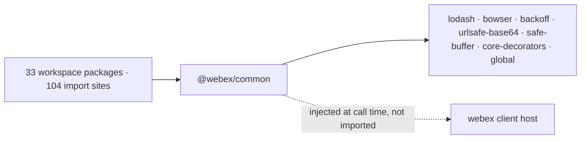
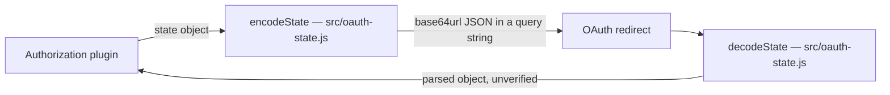

<!-- sdd-generated-metadata
doc_kind: standing-doc
generated_from: architecture@0.3.0
generated_by: claude-code
approved_by: pending
updated_at: 2026-09-21T08:58:59Z
validation_status: pass-with-warnings
-->

# @webex/common architecture

Canonical repository-wide architecture. This document owns facts that span the package as a whole.
Link to the owning module, ADR, or native contract instead of duplicating owner-local detail.

Related context: [specification registry](specs/README.md) ·
[repository agent instructions](../AGENTS.md)

## Applicability

| Condition ID                         | Status     | Evidence or reason | Owned section                       |
| ------------------------------------ | ---------- | ------------------ | ----------------------------------- |
| `repo.owns_datastore`                | N/A        | no ORM, migration, schema, or DB client in `src`; the seven runtime dependencies are all third-party utilities | Repository data and schema |
| `repo.holds_client_state`            | N/A        | no state-management library in `src`; the only mutation of caller state is `src/event-envelope.js` writing to the host object it is given | Client state model |
| `repo.components_interact`           | N/A        | one module; there are no sibling resources to interact | Dependency and interaction topology |
| `repo.domain_data_across_components` | N/A        | one module; no domain data spans resources | Object and data ownership |
| `repo.caches_data`                   | Applicable | `src/one-flight.js` in-flight store; `src/browser-detection.js` memoised parser | Caching catalog |
| `repo.observability_convention`      | N/A        | no logger, metrics client, or console call in `src` | Observability patterns |
| `repo.deploys_to_infra`              | N/A        | no Dockerfile, compose file, k8s manifest, or IaC under the package | Runtime and infrastructure |
| `repo.shared_base_libs`              | Applicable | `package.json` devDependencies pin four workspace toolchain packages | Shared and base libraries |
| `repo.is_monorepo`                   | N/A        | this SDD root is one package with one build; the enclosing workspace is out of scope | Package map and dependencies |
| `repo.multi_platform`                | Applicable | `package.json` browser field remaps `src/in-browser/node.js` to `src/in-browser/browser.js` | Platform matrix |
| `repo.published_package`             | Applicable | `package.json` declares `main` and a publish script; not private | Release and versioning |
| `repo.embedded_in_host`              | N/A        | no plugin manifest, web-component export, or micro-frontend config | Host integration and theming |
| `repo.exposes_commands_or_artifacts` | Applicable | `package.json` scripts emit `dist` | Commands and generated artifacts |
| `repo.cross_repo_deps_material`      | Applicable | 33 workspace packages depend on this one across 104 import sites | Cross-repository topology |
| `repo.security_arch_warranted`       | Applicable | `src/oauth-state.js` encodes OAuth redirect state including CSRF state | Security architecture |

## Design overview

`@webex/common` holds helpers that more than one Webex JS SDK plugin needs and that depend on no
other Webex package. That inclusion rule is the whole architecture: it is what lets the package sit
beneath every plugin without creating a dependency cycle.

Verified: `src` contains no `@webex/` import. The seven runtime dependencies (`backoff`, `bowser`,
`core-decorators`, `global`, `lodash`, `safe-buffer`, `urlsafe-base64`) are all third-party.

The shape is deliberately flat. There is no internal layering and no shared runtime object — the
package is a barrel over independent single-purpose files. Two organising ideas recur: method
decorators applied through lodash `wrap`, and module-level in-memory stores keyed so that entries
are collected with their owning instance.

## Resource inventory and responsibilities

| Resource | Kind    | Responsibility          | Owner          | Source   | Detailed specification |
| -------- | ------- | ----------------------- | -------------- | -------- | ---------------------- |
| `@webex/common` | package | Zero-Webex-dependency helpers shared by multiple SDK plugins | @webex/web-client, @webex/web-sdk | `src/index.js` | `src/docs/README.md` |

## Interaction and execution flows

This package is a leaf of the dependency graph and a hub of the consumer graph. It initiates no
transport of its own; where it needs host services, the caller injects a client.

| From       | To         | Interaction or transport | Purpose  | Failure or compatibility behavior |
| ---------- | ---------- | ------------------------ | -------- | --------------------------------- |
| SDK plugins | `@webex/common` | ES import from the package root | Shared helpers | Additive barrel changes are safe; removals break up to 104 import sites |
| `@webex/common` | third-party libraries | ES import | Backoff, UA parsing, base64url, decorators | Hard dependencies; absence is a load-time failure |
| `@webex/common` | webex client host | Method call on an injected object | Identity lookup and cluster resolution | No timeout or retry here; both belong to the host. Identity failure currently resolves `undefined` — see the module spec |

## Dependency topology

| Dependency | Type     | Used by    | Purpose | Version, failure, or fallback policy |
| ---------- | -------- | ---------- | ------- | ------------------------------------ |
| `lodash` | External | `src/one-flight.js`, `src/retry.js`, `src/while-in-flight.js`, `src/events.js`, `src/browser-detection.js` | `wrap`, `memoize`, `defaults`, `isArray`, `isFunction` | Version pinned in `package.json`; hard dependency |
| `backoff` | External | `src/retry.js` | Exponential retry strategy | Hard dependency |
| `bowser` | External | `src/browser-detection.js` | User-agent parsing | Parse failure returns an object carrying `error` rather than throwing |
| `urlsafe-base64` | External | `src/base64.js` | base64url encode/decode/validate | Hard dependency |
| `safe-buffer` | External | `src/base64.js` | Buffer construction | Hard dependency |
| `core-decorators` | External | `src/deprecated.js` | Deprecation decorator | Loaded only outside production builds |
| `global` | External | `src/browser-detection.js` | `window` access with a Node shim | Hard dependency |
| webex client host | Peer | `src/event-envelope.js`, `src/uuid-utils.js` | Identity and cluster services | Not resolved by this package; supplied by the caller |

No dependency cycles exist: `src` imports no `@webex/` package, which is the ordering constraint
that keeps this package installable beneath every plugin. Exact versions live in `package.json`.

## Public and consumer surfaces

| Surface | Type | Owner      | Consumers   | Compatibility policy | Source |
| ------- | ---- | ---------- | ----------- | -------------------- | ------ |
| `webex-common-js-api` | SDK | `@webex/common` | 33 workspace packages; external npm consumers | README documents 6 of 39 exports as externally supported; the rest is internal-consumer surface, still breaking across 104 import sites | `package.json` |
| `hydra-id-format` | File | `@webex/common` | Any consumer that stores or compares Hydra ids | Unversioned and persisted, therefore effectively frozen | `src/uuid-utils.js` |
| `webex-client-host` | RPC | external (`@webex/webex-core`) | consumed, not provided | Requires `people.get`, `internal.me`, `internal.services.getClusterId` | external |

No HTTP surface is served, so no OpenAPI document applies. `.sdd/manifest.json`
`contract_catalog` is authoritative for these ids.

## Cross-cutting architecture

### Security

- Trust boundaries and identity flow: the package sits entirely inside the caller's trust boundary.
  It holds no credentials and opens no connections. Identity reaches it only as an injected client.
- Sensitive surfaces and data classes: OAuth redirect state, including CSRF state, passes through
  `src/oauth-state.js`. Email addresses are matched by `src/patterns.js`.
- Encryption and secret boundaries: none. The package performs encoding, not encryption.

### Observability and operations

- Logging and correlation: none. The package emits no logs and depends on no logger, by design —
  a library at the bottom of the graph must not impose a logging choice on 33 consumers.
- Metrics, traces, and audit signals: none.
- Ownership and operational entry points: @webex/web-client and @webex/web-sdk own the package;
  there is no runtime to operate.

### Quality attributes

As a published SDK package the measurable boundaries are footprint and compatibility, not SLOs:

- Seven runtime dependencies, none Webex-owned. Adding one affects every consumer's bundle.
- Dual Node and browser support; the browser build must stay in step with `src/in-browser`.
- Node `>=16` floor, per `package.json` engines.
- Test evidence is the weak axis: 8 of 25 source files have a dedicated unit spec.

## Caching catalog

| Cache  | Owner      | Backend   | Contents | TTL or bound | Invalidation trigger | Failure behavior |
| ------ | ---------- | --------- | -------- | ------------ | -------------------- | ---------------- |
| In-flight promise store | `src/one-flight.js` | nested WeakMap/Map/Map | Pending promises keyed by instance, decorator target, and method name | Bounded by instance lifetime; the WeakMap root lets entries be collected with the instance | Entry deleted when the promise settles, unless `cacheSuccesses`/`cacheFailures` is set | Cache miss re-invokes the method |
| Browser detection memo | `src/browser-detection.js` | lodash `memoize` Map | Parsed user-agent objects keyed by UA string | Unbounded; never evicted | None | Falls back to an `os`-based object when no user agent is reachable |

## Shared and base libraries

| Library | Inherited responsibility | Consumers | Version floor | Compatibility rule |
| ------- | ------------------------ | --------- | ------------- | ------------------ |
| `@webex/babel-config-legacy` | Babel configuration | this package via `babel.config.js` | `workspace:*` | Tracks the workspace toolchain |
| `@webex/eslint-config-legacy` | Lint rules | this package via `.eslintrc.js` | `workspace:*` | Local config sets `root: true`, so nothing above this package is inherited |
| `@webex/jest-config-legacy` | Jest configuration | this package via `jest.config.js` | `workspace:*` | Tracks the workspace toolchain |
| `@webex/legacy-tools` | Build and test runner | `package.json` scripts | `workspace:*` | Tracks the workspace toolchain |

These are development-time only. None is a runtime dependency, which preserves the inclusion rule.

## Platform matrix

| Platform | Shared versus platform-specific boundary | Entry or build | Support and compatibility constraints |
| -------- | ---------------------------------------- | -------------- | ------------------------------------- |
| Node | Everything except the in-browser flag is shared | `src/in-browser/node.js` resolves the flag to `false` | Node `>=16` per `package.json` engines |
| Browser | Same shared code; only the flag differs | Bundler rewrites the import to `src/in-browser/browser.js` via the `package.json` browser field | Depends on the bundler honouring the browser field; `inBrowser` is a build-time constant, not a runtime probe |

`src/browser-detection.js` degrades independently of this switch: it returns an `os`-based object
when no user agent is reachable, so it is safe under Node without the browser build.

## Release and versioning

| Artifact | Publish target | Versioning rule | Deprecation window | Changelog or migration obligation |
| -------- | -------------- | --------------- | ------------------ | --------------------------------- |
| `@webex/common` npm package | npm, via the package publish script | Released centrally with the SDK by the Webex Publisher automation; versions are not managed in this package | Not declared in-package | The monorepo root CHANGELOG is the release record; a Hydra or OAuth state encoding change additionally requires a migration plan because consumers persist both |

## Commands and generated artifacts

| Command or artifact | Owner | Inputs | Output or side effect | Compatibility boundary |
| ------------------- | ----- | ------ | --------------------- | ---------------------- |
| `yarn workspace @webex/common build:src` | `package.json` | `src` | Writes `dist` as JavaScript plus source maps | No `.d.ts` is emitted despite the `-ts` flag, because there are no TypeScript sources |
| `yarn workspace @webex/common test:unit` | `package.json` | `test/unit/spec` | Jest run | Covers 8 of 25 source files |
| `yarn workspace @webex/common test:style` | `package.json` | `src` | eslint run | Uses the package-local config; Markdown under `src` is ignored |
| `dist` | build | `src` | Published artifact referenced by `package.json` `main` | Generated; never edit by hand |

The package's aggregate `test` script is not usable: it chains two scripts that are not defined.

## Cross-repository topology

| Repository or external system | Relationship | Exchanged contract or artifact | Owner | Sequencing constraint |
| ----------------------------- | ------------ | ------------------------------ | ----- | --------------------- |
| webex-js-sdk workspace packages (33 of them) | Consumes | `webex-common-js-api` barrel | respective plugin teams | This package must build before its consumers; it must never depend on them |
| `@webex/webex-core` | Provides | `webex-client-host` runtime contract | @webex/web-sdk | Injected at call time, so there is no build-order constraint |
| npm registry | Provides | Published package for external consumers | Cisco Webex | Published centrally with the SDK release |

## Security architecture

The package holds no credentials, opens no connections, and performs no authorization. Its
security relevance is confined to one surface: OAuth redirect state encoding.

`src/oauth-state.js` serialises to JSON and encodes as base64url. This is **transport encoding
only**: there is no signature, MAC, or encryption, so a decoded state object is attacker-influenced
input. Callers that rely on the state parameter for CSRF protection must compare it against a value
they stored themselves; they must not trust its contents because it round-tripped. `decodeState`
throws on malformed input, which callers must handle.

`src/patterns.js` supplies the shared email and UUID validation regexes used at input boundaries
across the SDK. The authoritative security policy lives with the workspace, not here.

## Domain language

| Term   | Repository-specific meaning | Authoritative source |
| ------ | --------------------------- | -------------------- |
| Hydra id | Public identifier: base64url of a `ciscospark://` URI encoding cluster, type, and internal UUID | `src/uuid-utils.js` |
| Cluster | Region holding a resource. The internal US cluster and its integration variant both normalise to `us` for backwards compatibility | `src/constants.js` |
| In flight | A promise returned by a decorated method that has not yet settled; the unit of de-duplication | `src/one-flight.js` |
| Envelope | Webhook-shaped wrapper placed around an SDK socket event so consumers see one event shape | `src/event-envelope.js` |
| Barrel | `src/index.js`, the single module re-exporting the package's public surface | `src/index.js` |

## References and maintenance

- Decisions: [adr/](adr/)
- Instantiated specifications and routing: [specs/README.md](specs/README.md)
- Module specification: [`src/docs/README.md`](../src/docs/README.md)
- Repository rules and patterns: [repository agent instructions](../AGENTS.md)
- Update this document in the same change that alters repository boundaries, resource ownership,
  cross-resource interaction, or cross-cutting architecture.
