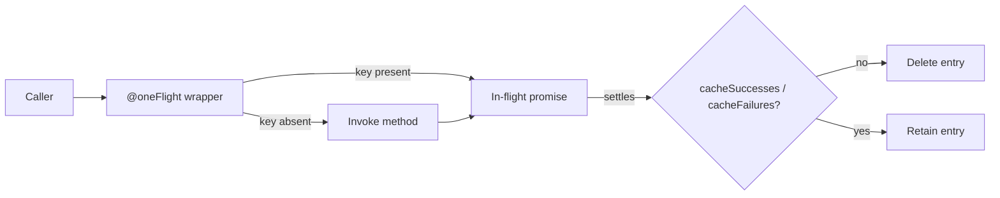
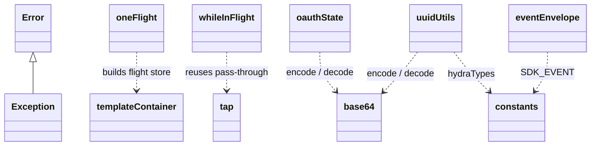

<!-- sdd-generated-metadata
doc_kind: module-spec
generated_from: module-spec@0.3.0
generated_by: claude-code
approved_by: pending
updated_at: 2026-09-21T08:58:59Z
validation_status: pass-with-warnings
-->

# @webex/common

This source-local document at `src/docs/README.md` owns the stable specification for
**@webex/common**. Ground every claim in repository evidence and link to the
[repository architecture](../../docs/architecture.md) instead of repeating broader facts.

Related context: [documentation index](../../docs/index.md) ·
[repository agent instructions](../../AGENTS.md)

## Metadata

| Field         | Value                                                        |
| ------------- | ------------------------------------------------------------ |
| Owner         | @webex/web-client, @webex/web-sdk (monorepo .github/CODEOWNERS line 8) |
| Source path   | `src`                                                        |
| Resource kind | Published npm package (shared helper library)                |
| Status        | Active                                                       |
| Last verified | 2026-09-21 at `b46e941f29`                                        |
| Module id     | `src`                                                        |
| Parent spec   | —                                                            |
| Doc kind      | Module spec                                                  |
| Coverage score | Partial — 100% of the public surface enumerated, assessed 2026-09-21 |
| Validation status | pass-with-warnings — Codex validator, 2026-09-21; 2 important findings |

## Applicability

| Condition ID                         | Status     | Evidence or reason | Owned section                 |
| ------------------------------------ | ---------- | ------------------ | ----------------------------- |
| `module.has_tiers`                   | N/A        | monorepo .github/CODEOWNERS line 8 assigns owners by path but declares no tier, SLO, or tiered review rule | Tier |
| `module.has_ui`                      | N/A        | no component, template, stylesheet, or UI framework import in src/ | UI use-case flow |
| `module.crosses_service_boundaries`  | Applicable | `src/event-envelope.js` lines 49 calls webex.people.get('me'); `src/uuid-utils.js` lines 132 calls webex.internal.services.getClusterId() | Cross-boundary use-case flow |
| `module.holds_client_state`          | N/A        | no state-management library; `src/event-envelope.js` lines 50 writes webex.internal.me on the **host** object, which the host owns | Client state model |
| `module.enforces_domain_rules`       | Applicable | `src/check-required.js` lines 10, `src/capped-debounce.js` lines 16-28, `src/uuid-utils.js` lines 11,27 | Business rules and invariants |
| `module.is_concurrent_async`         | Applicable | `src/one-flight.js`, `src/while-in-flight.js`, `src/retry.js`, `src/defer.js`, `src/tap.js` | Concurrency and reactive flow |
| `module.owns_persistence`            | N/A        | no ORM, migration, schema, or DAO in src/ | Data, schema, and migration |
| `module.stateful_transitions`        | N/A        | no lifecycle enum or state machine | State machine |
| `module.exposes_wire_protocol`       | Applicable | `src/uuid-utils.js` lines 31,34 emit a base64url ciscospark:// identifier format consumers decode | Protocol and wire format |
| `module.ui_multi_screen`             | N/A        | no UI | UI flow |
| `module.large_data_model`            | N/A        | `src/constants.js` is a flat constant map; no entities | Data model |
| `module.returns_caller_errors`       | Applicable | `src/exception.js` base class plus throw sites listed under Caller-visible failure modes | Caller-visible failure modes |
| `module.module_specific_conventions` | Applicable | `.eslintrc.js` (root: true), `jest.config.js`, `process`, `package.json` browser field | Module-specific rules |
| `module.published_package`           | Applicable | `package.json` main, deploy:npm, not private | Export stability |
| `module.embedded_in_host`            | N/A        | no plugin manifest or web-component export | Host integration and theming |
| `module.has_design_tradeoff`         | Applicable | owner-confirmed trade-offs in `src/tap.js`, `src/deprecated.js`, `src/one-flight.js` | Key design trade-off |
| `module.has_submodules`              | N/A        | one module; computed by scripts/module_tree.py | Sub-modules |

## Evidence register

| Evidence         | What it establishes |
| ---------------- | ------------------- |
| `src/index.js` | The public surface: 39 named exports forming the package barrel |
| `package.json` | Published npm package; `main: dist/index.js`; browser field remaps `in-browser/node.js` to `in-browser/browser.js`; Node `>=16` |
| monorepo .github/CODEOWNERS line 8 (outside this SDD root) | Ownership by @webex/web-client and @webex/web-sdk |
| `test/unit/spec/common.js` | Entry point of the 8 unit specs, covering base64, retry, browser detection, capped debounce, exception, oauth state, one flight, template container, while in flight |
| `src/index.js` | Barrel contains no @webex/* import; a repo-wide grep over src/ confirms the module takes no runtime dependency on another Webex package — the basis of its inclusion rule |
| `package.json` | Declares the published surface; 33 workspace manifests depend on it across 104 import sites — the blast radius for any surface change |
| `README.md` | Owner-designated reference for the externally supported subset of the surface |
| `src/index.js` | Justifies the `Public surface` template extension `Complete export inventory`: the template's Public surface table carries one row per compatibility commitment, but the barrel exports 39 symbols across 22 files, so the export-to-file mapping has no canonical home in the template. The extension is a subsection of Public surface, not a parallel section, and states only the defining file and role of each export |

## Purpose and boundary

- **Responsibility:** zero-Webex-dependency helpers that more than one Webex JS SDK plugin needs.
- **In scope:** promise and decorator plumbing, base64url encoding, Hydra identifier construction,
  environment detection, shared regular expressions, the `Exception` base class, and the
  ampersand-state adapter.
- **Out of scope:** anything that would require importing another `@webex/*` package at runtime.
  This is the inclusion rule the owner confirmed, and src/ currently satisfies it with no
  exceptions. A helper that needs a Webex package belongs in that package or above it.
- **Consumers:** 33 workspace packages across 104 import sites, plus external npm consumers of the
  six utilities documented in `README.md`.

## Structure and key files

| Path     | Responsibility                     |
| -------- | ---------------------------------- |
| `src/index.js` | The barrel. Authoritative list of the 39-symbol public surface |
| `src/one-flight.js` | `oneFlight` decorator: de-duplicates concurrent calls to a method |
| `src/while-in-flight.js` | `whileInFlight` decorator: toggles a boolean on the target for the duration of a promise |
| `src/retry.js` | `retry` decorator over `backoff`, with progress-event re-emission |
| `src/capped-debounce.js` | Debounce that also fires after a call count, not only a delay |
| `src/defer.js` | `Defer`: promise with externalised `resolve`/`reject` |
| `src/tap.js` | Side-effect injection into a promise chain |
| `src/resolve-with.js` | Replace a chain's resolution value |
| `src/exception.js` | `Exception` base error class with `parse`/`defaultMessage` overrides |
| `src/base64.js` | base64url encode/decode/validate over `urlsafe-base64` |
| `src/uuid-utils.js` | Hydra identifier construction and deconstruction |
| `src/oauth-state.js` | OAuth redirect state encode/decode |
| `src/events.js` | `proxyEvents`, `transferEvents` |
| `src/event-envelope.js` | Webhook-shaped envelope around SDK socket events |
| `src/browser-detection.js` | Memoised `bowser` wrapper with a Node fallback |
| src/in-browser/ | Build-time browser/node boolean, selected by the browser field |
| `src/template-container.js` | `make(...)` factory for multi-keyed Map/WeakMap/Set containers |
| `src/make-state-datatype.js` | ampersand-state child datatype adapter |
| `src/patterns.js` | Shared compiled regular expressions |
| `src/constants.js` | `SDK_EVENT`, `hydraTypes`, `deviceType`, cluster names |
| `src/check-required.js` | Required-property guard |
| `src/isBuffer.js` | Buffer predicate |

## Public surface

| Surface  | Consumer   | Compatibility commitment | Source   |
| -------- | ---------- | ------------------------ | -------- |
| `cappedDebounce`, `Defer`, `deprecated`, `Exception`, `oneFlight`, `tap` | External npm consumers and SDK plugins | Externally supported subset, per the owner-designated reference README.md | `src/index.js` |
| The other 33 barrel exports, itemised in the inventory below | 33 workspace packages | Internal-consumer surface. Not documented for external use, but a change is still breaking across 104 import sites | `src/index.js` |
| ciscospark:// Hydra identifier encoding | Any consumer that stores or compares Hydra ids | Format is effectively frozen; a change invalidates persisted ids | `src/uuid-utils.js` |

### Complete export inventory

All 39 symbols re-exported by `src/index.js`, with their defining file.

| Export | Defining file | Summary |
| --- | --- | --- |
| `base64` | `src/base64.js` | Namespace object: `fromBase64url`, `toBase64Url`, `encode`, `decode`, `validate` |
| `isBuffer` | `src/isBuffer.js` | Buffer predicate via `constructor.isBuffer` |
| `cappedDebounce` | `src/capped-debounce.js` | Debounce bounded by delay, `maxWait`, and `maxCalls` |
| `checkRequired` | `src/check-required.js` | Throws on any listed key whose value is falsy |
| `Defer` | `src/defer.js` | Promise with externalised `resolve`/`reject` |
| `makeStateDataType` | `src/make-state-datatype.js` | ampersand-state child datatype adapter |
| `make` | `src/template-container.js` | Factory for multi-keyed Map/WeakMap/Set containers |
| `oneFlight` | `src/one-flight.js` | Decorator de-duplicating concurrent calls |
| `patterns` | `src/patterns.js` | Compiled regexes: `email`, `containsEmails`, `uuid`, `containsMTID`, `execEmail`, `execUuid` |
| `encodeState` | `src/oauth-state.js` | JSON to base64url for OAuth redirect transport |
| `decodeState` | `src/oauth-state.js` | Inverse of `encodeState` |
| `proxyEvents` | `src/events.js` | Copies `on`/`once` from an emitter onto a proxy |
| `transferEvents` | `src/events.js` | Re-emits named events from a source onto a drain |
| `createEventEnvelope` | `src/event-envelope.js` | Webhook-shaped envelope around an SDK event. See MOD-011 |
| `ensureMyIdIsAvailable` | `src/event-envelope.js` | Caches `webex.internal.me` after one identity fetch |
| `resolveWith` | `src/resolve-with.js` | Replaces a promise chain's resolution value |
| `retry` | `src/retry.js` | Decorator retrying with exponential backoff |
| `tap` | `src/tap.js` | Side-effect injection that never alters or breaks the chain |
| `whileInFlight` | `src/while-in-flight.js` | Sets a boolean on the target while a promise is pending |
| `Exception` | `src/exception.js` | Base error class. Subclass it; there is no `extend` static |
| `deprecated` | `src/deprecated.js` | Deprecation decorator; inert in production |
| `inBrowser` | `src/in-browser/index.js` | Build-time boolean selected by the package browser field |
| `deviceType` | `src/constants.js` | `PROVISIONAL`, `WEB` |
| `hydraTypes` | `src/constants.js` | Hydra resource type constants |
| `SDK_EVENT` | `src/constants.js` | Internal and external event vocabulary |
| `INTERNAL_US_CLUSTER_NAME` | `src/constants.js` | `urn:TEAM:us-east-2_a`; normalises to cluster `us` |
| `INTERNAL_US_INTEGRATION_CLUSTER_NAME` | `src/constants.js` | `urn:TEAM:us-east-1_int13`; normalises to cluster `us` |
| `BrowserDetection` | `src/browser-detection.js` | Memoised bowser parser with an os-based Node fallback |
| `getBrowserSerial` | `src/browser-detection.js` | Raw bowser parser, or an object carrying `error` when the user agent is unreachable |
| `constructHydraId` | `src/uuid-utils.js` | Encodes type, id, and cluster into a Hydra id |
| `deconstructHydraId` | `src/uuid-utils.js` | Decodes a Hydra id into `{id, type, cluster}` |
| `buildHydraMessageId` | `src/uuid-utils.js` | `constructHydraId` specialised to `MESSAGE` |
| `buildHydraPersonId` | `src/uuid-utils.js` | Specialised to `PEOPLE`; cluster is always `us` |
| `buildHydraRoomId` | `src/uuid-utils.js` | Specialised to `ROOM` |
| `buildHydraOrgId` | `src/uuid-utils.js` | Specialised to `ORGANIZATION`; cluster is always `us` |
| `buildHydraMembershipId` | `src/uuid-utils.js` | Encodes `personUUID:spaceUUID` as a `MEMBERSHIP` id |
| `getHydraRoomType` | `src/uuid-utils.js` | Maps conversation tags to `direct` or `group` |
| `getHydraClusterString` | `src/uuid-utils.js` | Resolves a host cluster id to a Hydra cluster string; throws below three parts |
| `getHydraFiles` | `src/uuid-utils.js` | Builds content URLs for an activity's files; ids depend on file order |

See `contract_catalog` in `.sdd/manifest.json` for the registered contract ids.

## Dependencies

| Dependency            | Why it is required | Failure behavior                    |
| --------------------- | ------------------ | ----------------------------------- |
| `lodash` | `wrap` for decorators, `memoize`, `defaults`, `isArray`, `isFunction` | Hard dependency; absence is a load-time failure |
| `backoff` | Exponential retry strategy in `src/retry.js` | Hard dependency |
| `bowser` | User-agent parsing in `src/browser-detection.js` | Hard dependency; parse failure returns an error-bearing object rather than throwing (`src/browser-detection.js` lines 8-14) |
| `urlsafe-base64`, `safe-buffer` | base64url encoding in `src/base64.js` | Hard dependency |
| `core-decorators` | `deprecated` decorator | Hard dependency in non-production builds only (`src/deprecated.js` lines 16) |
| `global` | `window` access in `src/browser-detection.js` | Hard dependency; provides the Node shim |
| Injected `webex` client (external contract `webex-client-host`) | `src/event-envelope.js` and `src/uuid-utils.js` lines 132 need `webex.people.get`, webex.internal.me, `webex.internal.services.getClusterId` | Not resolved by this package; supplied by the caller. See failure modes below |

## Requirements

| ID        | WHAT                                           | WHY                            | Source evidence | Test or example evidence            | Assumptions or gaps | Confidence                        |
| --------- | ---------------------------------------------- | ------------------------------ | --------------- | ----------------------------------- | ------------------- | --------------------------------- |
| `MOD-001` | The package imports no @webex/* module at runtime | It is the bottom of the workspace dependency graph; a Webex import would create a cycle for its 33 consumers | `src/index.js` | none found | No automated check enforces this | Present |
| `MOD-002` | `oneFlight` returns the in-progress promise for concurrent calls with the same key, and evicts the entry once it settles unless `cacheSuccesses`/`cacheFailures` is set | De-duplicates redundant work without becoming an unbounded cache | `src/one-flight.js` lines 52-73 | `test/unit/spec/one-flight.js` | — | Present |
| `MOD-003` | `tap` passes the original value through and never rejects, even when its callback throws | Debug instrumentation must not alter or break the chain it observes | `src/tap.js` lines 18-24 | none found | No test pins the swallow behaviour | Present |
| `MOD-004` | `cappedDebounce` fires after the wait elapses, after `maxWait`, or after `maxCalls` calls, whichever comes first, and requires all three options | Bounds worst-case latency as well as call rate | `src/capped-debounce.js` | `test/unit/spec/capped-debounce.js` | — | Present |
| `MOD-005` | `Exception` subclasses derive their message from `parse` or `defaultMessage`, resolving through the prototype chain | Lets error families share formatting without re-implementing `Error` | `src/exception.js` lines 19-36 | `test/unit/spec/exception.js` | — | Present |
| `MOD-006` | Hydra ids are base64url of `ciscospark://<cluster>/<TYPE>/<id>`; `PEOPLE` and `ORGANIZATION` always use cluster `us` | Backwards compatibility with previously issued identifiers | `src/uuid-utils.js` lines 28-34 | none found | No test covers Hydra construction | Present |
| `MOD-007` | `encodeState`/`decodeState` round-trip a JSON object through base64url for OAuth redirect transport | Query strings cannot carry raw JSON safely | `src/oauth-state.js` | `test/unit/spec/oauth-state.js` | — | Present |
| `MOD-008` | `inBrowser` resolves to `false` under Node and `true` in bundled browser builds, via the browser field | Lets consumers branch without a runtime probe | `src/in-browser/index.js` | none found | Depends on the bundler honouring the field | Present |
| `MOD-009` | `deprecated` is a no-op decorator when `NODE_ENV === 'production'` | Keeps deprecation noise and `core-decorators` cost out of production builds | `src/deprecated.js` lines 16 | none found | — | Present |
| `MOD-010` | `retry` re-emits `progress`, `upload-progress`, and `download-progress` from the wrapped promise and exposes `.on` | Long-running retried operations must stay observable across attempts | `src/retry.js` lines 76-80,105-109 | none found | No test covers retry progress | Present |
| `MOD-011` | `createEventEnvelope` **resolves with `undefined`** when identity lookup fails, instead of rejecting | Not intended. Recorded because callers depend on the current behaviour. See F-6 | `src/event-envelope.js` lines 33-38 | none found | Known defect; fixing it is a breaking change for callers that tolerate `undefined` | Approved unknown |

## Design overview

The module is a flat barrel over independent single-purpose files; there is no internal layering and
no shared runtime object. Two organising ideas recur.

**Decorators over wrappers.** `oneFlight`, `whileInFlight`, `retry`, and `deprecated` are method
decorators applied through lodash `wrap`. `oneFlight` and `retry` each support both bare
(`@oneFlight`) and configured (`@oneFlight({...})`) forms by checking `params.length === 3`
(`src/one-flight.js` lines 27, `src/retry.js` lines 51). Both also assign `target[prop]` directly when the
target is a plain object without a prototype, to stay compatible with ampersand-state class
definitions (`src/one-flight.js` lines 79-82, `src/retry.js` lines 117-120).

**Module-level state.** `oneFlight` keeps a process-lifetime `WeakMap→Map→Map` container of in-flight
promises keyed by instance, decorator target, and method name (`src/one-flight.js` lines 10-14). The
`WeakMap` root means entries are collected with their instance. `browser-detection.js` memoises its
parser per user-agent string (`src/browser-detection.js` lines 47); that cache is keyed by argument and is
never evicted.

## Data flow and sequence coverage

| Operation group | Entry and outcome | Diagram or evidence | Failure and recovery coverage |
| --------------- | ----------------- | ------------------- | ----------------------------- |
| Call de-duplication | `@oneFlight` method call returns either a fresh or an in-flight promise | `src/one-flight.js` lines 44-75 | On rejection the entry is deleted and the rejection re-thrown unless `cacheFailures` |
| Retry with backoff | Decorated method retried up to `maxAttempts` with exponential delay | `src/retry.js` lines 63-112 | Final failure rejects with the last error; a falsy error is replaced by a synthetic `Error` (`src/retry.js` lines 87-89) |
| Identifier encoding | UUID plus type plus cluster to a Hydra id and back | `src/uuid-utils.js` | `constructHydraId` throws when `type` or `id` is missing, or `type` is not a string |
| Event envelope | `createEventEnvelope(webex, resource)` to an envelope object | `src/event-envelope.js` | **Defective** — see F-6 below |

## Class and component relationships

## Use cases and flows

| Use case | Actor or caller | Primary steps and outcome     | Failure or boundary behavior | Evidence                  |
| -------- | --------------- | ----------------------------- | ---------------------------- | ------------------------- |
| `UC-001` | SDK plugin | Decorate a fetch method with `@oneFlight`; concurrent callers share one request | Rejection evicts the entry so the next call retries | `src/one-flight.js`, `test/unit/spec/one-flight.js` |
| `UC-002` | SDK plugin | Convert an internal UUID to a public Hydra id for an API response | Missing `type`/`id` throws `parameter is required` | `src/uuid-utils.js` |
| `UC-003` | Authorization plugin | Encode CSRF/state into an OAuth redirect and decode it on return | Malformed input throws from `JSON.parse` | `src/oauth-state.js`, `test/unit/spec/oauth-state.js` |
| `UC-004` | SDK plugin | Set a busy flag for the duration of an async operation with `@whileInFlight` | Flag is cleared on both fulfilment and rejection | `src/while-in-flight.js`, `test/unit/spec/while-in-flight.js` |

### Cross-boundary use-case flow

`createEventEnvelope` and `getHydraClusterString` do not own a transport; they call methods on an
injected `webex` client (external contract `webex-client-host`).

- **Boundary:** the host SDK client, not a socket or HTTP client owned here.
- **Transport:** whatever the host uses. This module imports no HTTP client.
- **Ordering:** `ensureMyIdIsAvailable` must resolve before envelope fields are read
  (`src/event-envelope.js` lines 14-20). It short-circuits when webex.internal.me is already set
  (`src/event-envelope.js` lines 45), so at most one identity fetch occurs per client instance.
- **Timeout and retry:** none here. Both are the host client's responsibility.
- **Recovery:** currently defective — see F-6 and `MOD-011`.
- **Cluster resolution:** `getHydraClusterString` throws when the host returns a cluster string with
  fewer than three colon-separated parts (`src/uuid-utils.js` lines 141-143).

## Business rules and invariants

| ID        | Invariant                            | WHY         | Enforcement source | Test evidence |
| --------- | ------------------------------------ | ----------- | ------------------ | ------------- |
| `INV-001` | `PEOPLE` and `ORGANIZATION` Hydra ids always encode cluster `us` | Backwards compatibility with ids issued before clustering | `src/uuid-utils.js` lines 29-32 | none found |
| `INV-002` | `cappedDebounce` requires `fn`, `wait`, `options.maxWait`, and `options.maxCalls`; each missing value throws | A partially configured debounce silently loses its cap | `src/capped-debounce.js` lines 16-28 | `test/unit/spec/capped-debounce.js` |
| `INV-003` | `makeStateDataType` requires both `Constructor` and `name` | An unnamed datatype cannot be registered with ampersand-state | `src/make-state-datatype.js` lines 25-27 | none found |
| `INV-004` | `checkRequired` throws on any key whose value is falsy, not merely absent | Callers rely on it to reject empty strings and zero | `src/check-required.js` lines 10-14 | none found |
| `INV-005` | The internal US cluster and its integration variant both normalise to `us` | Preserves pre-cluster id compatibility | `src/uuid-utils.js` lines 134-139, `src/constants.js` | none found |

## Concurrency and reactive flow

- **Execution model:** promise-based; no threads, workers, or subscriptions. Timers are used by
  `src/capped-debounce.js`.
- **Ordering guarantees:** `oneFlight` guarantees that concurrent callers sharing a key observe the
  same promise instance. No ordering guarantee exists across different keys.
- **Idempotency and retry:** `retry` owns attempt counting; the decorated method must be safe to
  re-invoke. `oneFlight` keys are `<method name>` plus an optional `keyFactory(...args)` suffix
  (`src/one-flight.js` lines 47-50) — a `keyFactory` that ignores a distinguishing argument will collapse
  calls that should stay separate.
- **Shared-state protection:** the `oneFlight` store is keyed by instance through a `WeakMap`, so
  instances do not contend. There is no lock; the module is single-threaded by assumption.
- **Blocking restrictions:** `whileInFlight` requires the wrapped method to return a promise — it
  calls `.then` on the result unconditionally (`src/while-in-flight.js` lines 22-24), so a synchronous
  return raises a `TypeError`.

## Protocol and wire format

| Message or frame | Version | Producer or serializer | Consumer or parser | Compatibility and ordering rule |
| ---------------- | ------- | ---------------------- | ------------------ | ------------------------------- |
| Hydra id: base64url of `ciscospark://<cluster>/<TYPE>/<id>` | unversioned | `src/uuid-utils.js` lines 28-34 | `src/uuid-utils.js` lines 47-57 | No version marker exists, so the format cannot be changed without invalidating persisted ids |
| Hydra content URL: `https://api.ciscospark.com/v1/contents/<id>` | unversioned | `src/uuid-utils.js` lines 184 | external API | Host is hardcoded at `src/uuid-utils.js` lines 9 |
| Membership id: `<personUUID>:<spaceUUID>` inside the Hydra payload | unversioned | `src/uuid-utils.js` lines 117 | `deconstructHydraId` returns the joined pair as `id` | The colon pair is not split on decode |
| OAuth state: base64url of `JSON.stringify(state)` | unversioned | `src/oauth-state.js` lines 12 | `src/oauth-state.js` lines 22 | Round-trip only; no schema is enforced |

`deconstructHydraId` reads the payload back-to-front with `pop()` (`src/uuid-utils.js` lines 50-56), so
it tolerates extra leading segments but silently returns `undefined` fields for a short payload.

## Caller-visible failure modes

| Condition   | Signal or result | Caller behavior | Retry or recovery | Evidence |
| ----------- | ---------------- | --------------- | ----------------- | -------- |
| Required property missing or falsy | `Error: missing required property <key> from <object>` | Fix the call | None | `src/check-required.js` lines 12 |
| `cappedDebounce` misconfigured | `Error` naming the missing option | Fix the call | None | `src/capped-debounce.js` lines 16-28 |
| `constructHydraId` missing `type`/`id` | `Error: parameter is required` | Fix the call | None | `src/uuid-utils.js` lines 11 |
| `constructHydraId` non-string `type` | `Error: "type" must be a string` | Fix the call | None | `src/uuid-utils.js` lines 27 |
| Cluster string has fewer than three parts | `Error: Unable to determine cluster for convo: <url>` | Treat as unresolvable | None | `src/uuid-utils.js` lines 142 |
| `makeStateDataType` missing argument | `Error: missing parameter for makeStateDataType` | Fix the call | None | `src/make-state-datatype.js` lines 26 |
| Container cannot determine an insert method | `TypeError: Could not determine how to insert into the specified container` | Pass a supported container type | None | `src/template-container.js` |
| `retry` exhausts attempts | Rejects with the last error, or a synthetic `Error` when the cause was falsy | Handle the rejection | Retry already applied | `src/retry.js` lines 87-89 |
| User agent unreadable | `{error: 'unable to access window.navigator.userAgent'}` — resolved, not thrown | Inspect `.error` | None | `src/browser-detection.js` lines 8-14, `src/constants.js` |
| Identity lookup fails in `createEventEnvelope` | **Resolves `undefined`** and emits an unhandled rejection | Callers must currently null-check | None | `src/event-envelope.js` lines 33-38 — defect F-6 |
| A `tap` callback throws | Swallowed; the chain continues with the original value | None required | Not applicable | `src/tap.js` lines 22 |

## Pitfalls and constraints

- `Exception` has **no** `extend` static. `README.md` shows `Exception.extend('MyError')`, which does
  not exist and has zero call sites. Subclass instead: `class MyError extends Exception {}`, as
  `packages/@webex/webex-core/src/lib/storage/errors.js` lines 10 and `test/unit/spec/exception.js` lines 14 do.
- `tap` never rejects. Do not use it for validation — a throwing callback is silently discarded.
- `deprecated` disappears in production builds; do not rely on it for runtime enforcement.
- `oneFlight` is not a cache by default. Passing `cacheSuccesses` makes it one, with no expiry.
- `whileInFlight` requires a promise-returning method.
- Hydra ids are unversioned and persisted by consumers; treat the encoding as frozen.
- `src/uuid-utils.js` lines 9 hardcodes `https://api.ciscospark.com/v1`; it is not configurable per
  environment.
- The barrel is flat, so adding an export is cheap but removing or renaming one breaks up to 104
  import sites across 33 packages.

## Module-specific rules

- **Do:** keep src/ free of `@webex/*` runtime imports. This is the module's inclusion rule and the
  reason it can sit beneath every plugin. No automated check enforces it.
- **Do:** add new exports to `src/index.js`; consumers import only from the package root.
- **Do:** honour the local `.eslintrc.js` (root: true), which stops config inheritance from the
  monorepo above this package.
- **Do not:** add a Node-only or browser-only import outside src/in-browser/ without extending the
  browser field in `package.json`; the package is consumed in both runtimes.
- **Do not:** change the Hydra encoding or the OAuth state encoding without a migration plan.

## Export stability

| Export or entry point | Consumer   | Stability | Versioning and deprecation rule | Declaration or API report |
| --------------------- | ---------- | --------- | ------------------------------- | ------------------------- |
| `cappedDebounce`, `Defer`, `deprecated`, `Exception`, `oneFlight`, `tap` | External npm and SDK plugins | Supported | Documented in README.md; treat as semver-public | `package.json` |
| The remaining 33 barrel exports | 33 workspace packages | Internal-consumer | Undocumented externally, but breaking across 104 internal import sites | `src/index.js` |
| `dist/in-browser/node.js` to `dist/in-browser/browser.js` remap | Bundlers | Supported | Must stay in step with src/in-browser/ | `package.json` |
| No .d.ts is emitted | TypeScript consumers | Not provided | build:src passes -ts but there are no TypeScript sources, so dist/ contains .js and .js.map only | `package.json` |

## Key design trade-off

| Chosen trade-off | Preserved invariant or benefit | Cost or limitation | Decision evidence |
| ---------------- | ------------------------------ | ------------------ | ----------------- |
| `tap` swallows callback errors | Debug instrumentation can never break the chain it observes | Genuine bugs inside a `tap` callback vanish silently | `src/tap.js` lines 18-24; owner-confirmed |
| `deprecated` compiles out in production | No warning noise or decorator cost in shipped builds | Deprecated calls are invisible in the environment that matters most | `src/deprecated.js` lines 16; owner-confirmed |
| `oneFlight` de-duplicates but does not memoize | Bounded memory; no stale results | Callers wanting caching must opt in, and then get no expiry | `src/one-flight.js` lines 60-71; owner-confirmed |
| No runtime `@webex/*` dependency | The package can sit beneath every plugin without cycles | Webex-specific logic such as the Hydra helpers lives here despite being domain code | src/; owner-confirmed inclusion rule |

## Verification

| Requirement or invariant | Test level | Positive evidence | Negative or boundary evidence | Gap                    |
| ------------------------ | ---------- | ----------------- | ----------------------------- | ---------------------- |
| `MOD-002` | Unit | `test/unit/spec/one-flight.js` | same file | — |
| `MOD-004`, `INV-002` | Unit | `test/unit/spec/capped-debounce.js` | same file | — |
| `MOD-005` | Unit | `test/unit/spec/exception.js` | same file | — |
| `MOD-007` | Unit | `test/unit/spec/oauth-state.js` | same file | — |
| `MOD-003` | — | none found | none found | `tap` error-swallowing is unpinned |
| `MOD-006`, `INV-001`, `INV-005` | — | none found | none found | No test covers Hydra id construction, cluster normalisation, or `deconstructHydraId` |
| `MOD-010` | — | none found | none found | `retry` progress re-emission untested; `test/unit/spec/common.js` asserts only that `retry` is defined |
| `MOD-011` | — | none found | none found | The `createEventEnvelope` failure path is untested, which is how F-6 survived |
| `MOD-008` | — | none found | none found | `inBrowser` resolution is build-time and unverified by tests |
| `INV-003`, `INV-004` | — | none found | none found | No test for `makeStateDataType` or `checkRequired` guards |

**Coverage gaps.** 8 of 25 source files have a dedicated unit spec. `src/uuid-utils.js` is the
largest untested file and carries the frozen, externally persisted Hydra format — the highest-risk
gap here. Before modifying any untested file, pin current behaviour with a characterization test.

**Known defect.** `MOD-011` / F-6 records that `createEventEnvelope` resolves `undefined` instead of
rejecting (`src/event-envelope.js` lines 33-38). This specification pins the current behaviour; it does
not endorse it. Fixing it changes an observable contract and needs its own change.

**Build gap.** `package.json` `test` chains `test:integration` and `test:browser`; neither script is
defined and neither directory exists, so the aggregate `test` script always fails after the unit
tier passes.
Use `yarn workspace @webex/common test:unit` instead.
