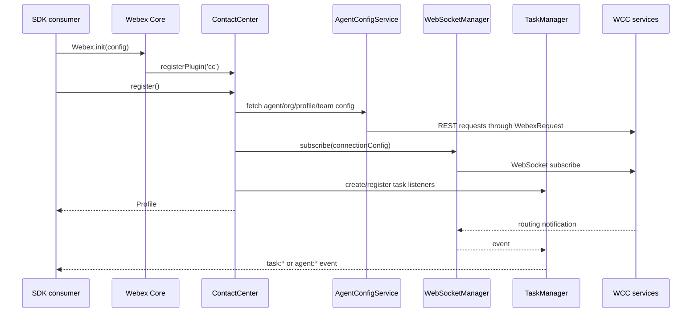

# ARCHITECTURE - @webex/contact-center

> Start here after [AGENTS.md](../AGENTS.md) and [SPEC_INDEX.md](SPEC_INDEX.md). Module detail lives in source-local specs.

## Design Overview
`@webex/contact-center` is a Webex JS SDK package that embeds a Contact Center plugin into Webex Core. Consumers enter through package exports in `src/index.ts` and through the registered `webex.cc` facade in `src/cc.ts`.

The package is intentionally a client-side orchestration layer. It owns runtime state, task collections, WebSocket connections, pending AQM request correlation, cache entries, metrics queues, and Web Calling mappings. It does not own WCC data persistence, schema migrations, or backend domain storage.

The architecture keeps public consumer operations in `ContactCenter`, splits WCC route construction into service modules, centralizes realtime/request mechanics under `src/services/core/`, and routes task-specific state transitions through `TaskManager` and `Task`.

## Component Inventory & Responsibilities
| Component | Responsibility | Docs |
|---|---|---|
| `src/` | Package exports, plugin registration, `ContactCenter` public facade, bootstrap config | [contact-center-plugin-spec.md](../src/ai-docs/contact-center-plugin-spec.md) |
| `src/services/agent/` | AQM-backed agent session operations and agent event types | [agent-session-spec.md](../src/services/agent/ai-docs/agent-session-spec.md) |
| `src/services/task/` | Task object behavior, task event hydration, contact controls, dialer/campaign routes, generated handoff summary helpers/events | [task-lifecycle-spec.md](../src/services/task/ai-docs/task-lifecycle-spec.md) |
| `src/services/core/` | Webex request wrapper, AQM correlation, WebSocket subscription, keepalive, connection recovery, error utilities | [realtime-request-core-spec.md](../src/services/core/ai-docs/realtime-request-core-spec.md) |
| `src/services/config/` and lookup files | User/org/profile/team/aux-code config and paginated lookup APIs | [configuration-lookup-apis-spec.md](../src/services/config/ai-docs/configuration-lookup-apis-spec.md) |
| `src/services/WebCallingService.ts` | Web Calling registration, call control, and call-to-task mapping | [web-calling-spec.md](../src/services/ai-docs/web-calling-spec.md) |
| `src/services/ApiAiAssistant.ts` | AI Assistant events for transcripts and generated handoff summaries plus historic transcript retrieval | [ai-assistant-spec.md](../src/services/ai-docs/ai-assistant-spec.md) |
| `src/metrics/`, `src/logger-proxy.ts` | Metrics event submission, taxonomy, timing, common fields, logging proxy | [metrics-observability-spec.md](../src/metrics/ai-docs/metrics-observability-spec.md) |

## Component Interaction
```mermaid
flowchart TD
  SDK[SDK consumer] --> CC[ContactCenter facade]
  WebexCore[Webex Core] --> CC
  CC --> Services[Services singleton]
  Services --> Agent[Agent routes]
  Services --> Contact[Contact task routes]
  Services --> Dialer[Dialer routes]
  Services --> AQM[AqmReqs]
  Services --> WS[WebSocketManager]
  CC --> Config[AgentConfigService]
  CC --> Lookups[AddressBook / EntryPoint / Queue]
  CC --> TM[TaskManager]
  TM --> Task[Task instances]
  Task --> Contact
  Task --> AI[ApiAIAssistant]
  Task --> Calling[WebCallingService]
  CC --> AI[ApiAIAssistant]
  CC --> Metrics[MetricsManager]
  AQM --> WS
  WS --> WCCWS[WCC WebSocket]
  Config --> WCCREST[WCC REST]
  Lookups --> WCCREST
  AI --> WCCREST
  Calling --> CallingSDK[@webex/calling]
```

`ContactCenter.register()` initializes profile/config state, services, WebSocket subscriptions, TaskManager, Web Calling, AI Assistant, lookup facades, and metrics. Agent and task operations usually issue a WCC request and wait for corresponding realtime notification through `AqmReqs`. Task lifecycle events hydrate or update `Task` instances and emit SDK events to consumers.

## Init & Call Flow


Failure paths include WCC REST request rejection, WebSocket welcome timeout, connection-lost events, AQM notification timeout, Web Calling registration timeout, and agent relogin failure. Those are detailed in module specs.

## Dependencies
| Dependency | Type | How used | Failure / version handling |
|---|---|---|---|
| `@webex/webex-core` | internal workspace peer | plugin host, credentials, request/services plumbing | workspace dependency; public facade fails if host credentials/services are unavailable |
| `@webex/calling` | internal workspace dependency | browser calling registration and media call control | `WebCallingService` rejects registration timeout and cleans call state |
| `@webex/internal-plugin-metrics` | internal workspace dependency | behavioral, operational, and business metric submission | `MetricsManager` queues pending events until metrics instance exists |
| `@webex/internal-plugin-support` | internal workspace dependency | diagnostic log upload | `WebexRequest.uploadLogs()` wraps submitLogs response/error |
| `@webex/plugin-logger` | internal workspace dependency | package logging through logger proxy | SECURITY rules forbid token/header logging |
| `@webex/internal-plugin-mercury` | internal workspace dependency | SDK realtime context | workspace dependency; WCC realtime uses package WebSocketManager |
| WCC API gateway | external service | WCC REST resources for config, AQM, lookup, AI Assistant, outdial | request errors are normalized and surfaced to callers |
| WCC WebSocket | external service | realtime routing/task/agent notifications and request correlation | keepalive worker, welcome timeout, reconnect/relogin paths |
| Browser APIs | runtime | WebSocket, Worker, Blob, URL, navigator.onLine, MediaStream, crypto.randomUUID | tests mock browser/runtime APIs; callers must run in supported browser-like context for media |

## State Model
| State | Owner | Trigger | Notes |
|---|---|---|---|
| Agent profile/config | `ContactCenter`, `AgentConfigService` | `register()`, `updateAgentProfile()` | in-memory; source is WCC config resources |
| WebSocket connection state | `WebSocketManager`, `ConnectionService` | subscribe, welcome, close, keepalive, network status | in-memory and event-driven |
| Pending AQM requests | `AqmReqs` | route request until success/failure/cancel/timeout notification | keyed by bind data; cleared on settle |
| Task collection | `TaskManager` | WCC task notifications and realtime transcript events | in-memory map of active `Task` objects |
| Task object data | `Task` | task event updates, handoff summary events, and reconcileData | preserves nested fields when partial updates omit them |
| AI feature flags | `ApiAIAssistant` | config load and optional feature enablement events | gates generated handoff summary requests and transcript behavior |
| Page lookup cache | `PageCache` | AddressBook, EntryPoint, Queue page fetches | in-memory, 5 minute default TTL |
| Web Calling task mapping | `WebCallingService` | call events and task operations | maps call id to task id in memory |
| Metrics pending queues | `MetricsManager` | event submit before metrics instance exists | flushed when metrics becomes available |

## Cross-Cutting Concerns
- Security: credentials come from Webex SDK credentials; WCC requests use SDK request plumbing; raw Authorization headers are masked before logging; org/agent/task identifiers are diagnostic data and must not be expanded beyond existing conventions.
- Observability: package code uses LoggerProxy and MetricsManager. Important operations emit success/failure metric pairs and include tracking fields from AQM responses where available.

## Footprint & Compatibility
This is a published SDK package. Backward compatibility applies to package exports, `webex.cc` methods, event enums, TypeScript types, and documented runtime behavior. Breaking changes require a versioning and consumer migration plan.

## Dependency / Interaction Topology
| From | To | Kind | Purpose |
|---|---|---|---|
| `src/index.ts` | Webex Core | registration | installs `cc` plugin |
| `src/cc.ts` | `Services` | call/composition | creates WCC route clients and WebSocket managers |
| `src/cc.ts` | `AgentConfigService` | call | builds runtime profile/config |
| `src/cc.ts` | `TaskManager` | call/event | owns task event subscription and task collection |
| `Task` | `routingContact` / `aqmDialer` | call | performs task operations through AQM |
| `Task` | `ApiAIAssistant` | call | sends generated handoff summary request/response events |
| `AqmReqs` | `WebSocketManager` | event | resolves request promises from realtime notifications |
| `WebSocketManager` | WCC WebSocket | network | subscribes and receives routing events |
| `WebexRequest` | WCC REST | network | service/resource HTTP calls |
| `WebCallingService` | `@webex/calling` | call/event | registers line and controls media calls |
| `MetricsManager` | internal metrics plugin | call | submits telemetry |

## Object / Data Ownership
| Domain object | System-of-record | Read/write by this package |
|---|---|---|
| Agent profile, team, aux code, org metadata | WCC backend | read and compose into in-memory Profile |
| Task/contact interaction | WCC backend and realtime events | read, update through AQM operations, cache active task object, emit summary payloads |
| Generated handoff summary | AI Assistant/WCC backend | request/respond through AI Assistant event API; pass backend payload through task events |
| Address book entries, entry points, queues | WCC backend | read with in-memory page cache |
| Web Calling call | Calling SDK / WebRTC runtime | mapped to Contact Center task id |
| Metrics events | internal metrics plugin/backend | created/submitted by package |

## Caching Catalog
| Cache | Backend | What it holds | TTL | Invalidation trigger |
|---|---|---|---|---|
| `PageCache<T>` | in-memory `Map` | paginated lookup responses keyed by org/page/pageSize/search/filter/attributes/sort | 5 minutes default | time expiry, `clearCache()`, cache size handling |
| Task collection | in-memory object/map in TaskManager | active task instances by task id | event-driven | task end, wrapup, cleanup, disconnect/removal events |
| Pending metrics queues | arrays in MetricsManager singleton | event payloads waiting for metrics plugin instance | until flush | metrics instance availability and submit attempt |
| AQM pending requests | objects in `AqmReqs` | promise resolvers keyed by notification bind | until settle/timeout | success, failure, cancel, or timeout notification |

## Observability Patterns
- Logging: use `LoggerProxy` or module logger; never log raw credentials or Authorization values.
- Metrics: use `MetricsManager` and constants from `src/metrics/constants.ts`; preserve success/failure event pairs and timed duration handling.
- Diagnostics: log upload runs through `WebexRequest.uploadLogs()` and the internal support plugin.

## Shared / Base Libraries
| Library | What every module inherits | Version floor |
|---|---|---|
| `@webex/legacy-tools` | build/test conventions and package command shape | workspace dependency |
| `@webex/babel-config-legacy` | Babel TypeScript/env build behavior | workspace dependency |
| `@webex/jest-config-legacy` | Jest defaults | workspace dependency |
| `@webex/eslint-config-legacy` | TypeScript lint conventions | workspace dependency |
| TypeScript | declaration output and public type surface | package dev dependency `4.9.5` |

## Package Map & Inter-Package Dependencies
The repository root is a Yarn workspace with packages under `packages/@webex/*`. This package is one workspace member and depends on workspace packages including `@webex/calling`, `@webex/internal-plugin-metrics`, `@webex/internal-plugin-support`, `@webex/plugin-authorization`, `@webex/plugin-logger`, and `@webex/webex-core`.

## Release & Versioning
- Publish target: package script `deploy:npm` runs `yarn npm publish`.
- Public package entry: `dist/webex.js`; type entry: `dist/types/index.d.ts`.
- Compatibility applies to exports in `src/index.ts`, generated declaration output, event names, and documented method behavior.

## Host Integration & Theming
The host is Webex Core, not a UI theme provider. `src/index.ts` registers `ContactCenter` as the `cc` plugin. Consumers access it as `webex.cc` after Webex SDK initialization and readiness.

## Cross-Repo Dependency Graph
- Internal same workspace: Webex Core, Calling, Metrics, Support, Logger, Authorization, Mercury.
- External services: WCC API gateway REST resources, WCC WebSocket, AI Assistant URLs discovered from WCC config.
- External read-only references: README and generated TypeDoc; exact behavior remains in code/tests.

## Security Architecture
Trust boundary is between SDK consumer/browser runtime and WCC services. Credentials are provided by Webex SDK credentials and used through SDK request plumbing. WCC WebSocket subscription uses service-discovered endpoints and conditionally sends `X-ORGANIZATION-ID` only for integration environments. AQM requests and notifications include tracking identifiers; logs must mask Authorization header values and avoid widening sensitive payload logging.

## Architecture Reference Links
| Reference | Location | When to read |
|---|---|---|
| Architecture decisions | [adr/](adr/) | before changing major design tradeoffs |
| Patterns | [patterns/contact-center-patterns.md](patterns/contact-center-patterns.md) | before adding similar code |
| Enforceable rules | [RULES.md](RULES.md) and [rules/typescript.md](rules/typescript.md) | before implementation |

## WS6 References
| Artifact | Relevance | Link |
|---|---|---|
| None discovered during bootstrap | No local authoritative WS6 doc was found in package scope | N/A |
