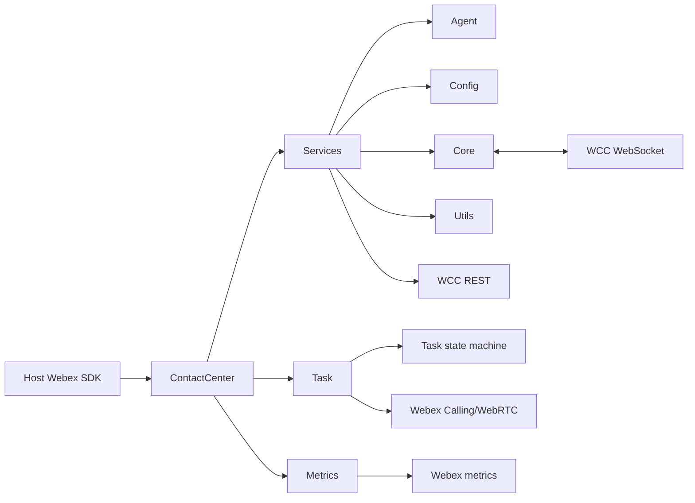
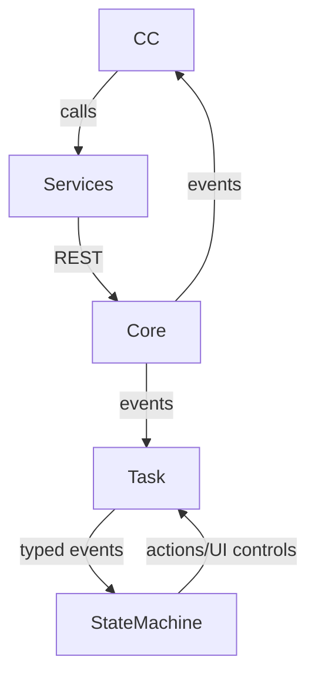

# ARCHITECTURE — @webex/contact-center

> Start here → root [`AGENTS.md`](../AGENTS.md) · router [`SPEC_INDEX.md`](SPEC_INDEX.md). Per-module detail lives in source-local specifications.

## Design Overview

The package is a host-embedded SDK plugin. `ContactCenter` owns the public façade and composes services for configuration, agent requests, tasks/calling, data lookup, realtime events, transport, and metrics. Remote Webex services own durable domain data.

Two interaction styles are deliberate: direct REST for immediate data/configuration responses, and AQM HTTP initiation followed by correlated WebSocket completion for event-driven agent/task operations. Typed events and XState isolate consumers from raw backend messages.

## Component Inventory & Responsibilities

| Component | Responsibility (one line) | Docs |
|---|---|---|
| `src` | Own the published Webex Contact Center SDK plugin surface, registration lifecycle, public method delegation, and application-facing event routing. | `ai-docs/contact-center-spec.md` |
| `src/metrics` | Own timing, taxonomy, queuing, payload preparation, and submission for Contact Center behavioral, operational, and business telemetry. | `src/metrics/ai-docs/metrics-spec.md` |
| `src/services` | Own composition and bootstrap order for backend request, realtime, data, and WebRTC service collaborators. | `src/services/ai-docs/services-spec.md` |
| `src/services/agent` | Own agent login, logout, state-change, buddy-agent, device-update, and silent-relogin request contracts. | `src/services/agent/ai-docs/agent-spec.md` |
| `src/services/config` | Own retrieval and aggregation of remote organization, agent, team, profile, auxiliary-code, dial-plan, and feature configuration. | `src/services/config/ai-docs/config-spec.md` |
| `src/services/core` | Own authenticated HTTP, realtime WebSocket lifecycle, AQM request correlation, reconnect/keepalive behavior, and shared error normalization. | `src/services/core/ai-docs/core-spec.md` |
| `src/services/task` | Own task creation, media-specific behavior, call-control operations, lifecycle orchestration, task events, and integration with the task state machine. | `src/services/task/ai-docs/task-spec.md` |
| `src/services/task/state-machine` | Own deterministic task lifecycle states, transition guards/actions, typed internal events, and state-derived UI-control availability. | `src/services/task/state-machine/ai-docs/task-state-machine-spec.md` |
| `src/utils` | Own shared pagination contracts and the bounded in-memory page cache used by Contact Center data services. | `src/utils/ai-docs/utils-spec.md` |

## Component Interaction

Public calls enter through `src/cc.ts`; direct REST returns through WebexRequest, while AQM operations resolve after matching WebSocket notifications. TaskManager converts backend events to task/state-machine events.

## Execution & Flow

Registration initializes WebexRequest, Services, MetricsManager, WebCallingService, TaskManager, and data services in evidence-backed order. The plugin subscribes to realtime messages, obtains the remote agent profile, routes agent/task events, and tears down listeners/connections on deregistration.

## Dependencies

| Dependency | Type (internal / external / peer) | How used | Failure / version handling |
|---|---|---|---|
| `@webex/webex-core` | external / peer | Runtime package dependency | Workspace/declared version; errors propagate through owning module |
| `@webex/calling` | external / peer | Runtime package dependency | Workspace/declared version; errors propagate through owning module |
| `@webex/internal-plugin-metrics` | external / peer | Runtime package dependency | Workspace/declared version; errors propagate through owning module |
| `@webex/internal-plugin-mercury` | external / peer | Runtime package dependency | Workspace/declared version; errors propagate through owning module |
| `wcc-api-gateway` | external Webex service | Service-catalog identifier resolved through the host Webex SDK; not an npm package dependency | Host service-catalog availability; routing errors propagate through the owning module |

### State Model

- ContactCenter retains agent profile, task collections, WebSocket/reconnect flags, metrics queues/timers, page-cache entries, and task actors in memory.
- Remote systems remain authoritative for agent/task/configuration records.

## Cross-Cutting Concerns

- **Security:** host-provided credentials and service routing; no tokens/secrets in source or logs; validate public inputs.
- **Observability:** LoggerProxy context/tracking ids plus MetricsManager success/failure/duration signals and diagnostic log upload.

## Non-Functional Posture

Package compatibility and event-loop safety are primary: published exports/types are semver-sensitive, telemetry is non-blocking, listeners are cleaned up, and reconnect/timeouts are explicit.

## Dependency / Interaction Topology

| From | To | Kind (call / event) | Purpose |
|---|---|---|---|
| ContactCenter | Services | call | Backend/config/agent composition |
| WebSocketManager | ContactCenter/TaskManager/AqmReqs | event | Realtime routing and request completion |
| Task | Task state machine | call/event | Validate lifecycle transitions and emit task events |
| Data services | PageCache | call | Bounded pagination reuse |

## Object / Data Ownership

| Domain object | System-of-record (owning component) | Read by |
|---|---|---|
| Agent/Profile | Remote WCC services; Config aggregates a local view | ContactCenter, Agent, Task |
| Task/Interaction | Remote WCC services; Task owns client representation | ContactCenter consumers |
| Metric event | Metrics module until submission; remote metrics backend after submit | Observability systems |
| Cached page | Utils PageCache (ephemeral only) | AddressBook, Queue |

## Caching Catalog

| Cache | Backend | What it holds | TTL | Invalidation trigger |
|---|---|---|---|---|
| PageCache | in-memory Map | simple paginated data-service pages | 5 minutes | expiry or explicit clear; parameterized queries bypass |

## Observability Patterns

- **Logging:** LoggerProxy with module/method and tracking/interaction identifiers; no credentials or sensitive payloads.
- **Metrics:** METRIC_EVENT_NAMES plus behavioral taxonomy and `WXCC_SDK_` operational/business names.
- **Audit:** no local audit store; remote services own operational records.

## Infrastructure Matrix

| Category | In use | Notes |
|---|---|---|
| Datastores | Remote WCC-owned stores | Package owns no durable store. |
| Messaging / streaming | WebSocket notification and RTD streams | Used for realtime events and AQM completion. |
| Cloud / platform services | Webex service catalog, WCC APIs, Calling/WebRTC, metrics | Host SDK supplies credentials/routing. |

## Shared / Base Libraries

| Library | What every module inherits from it | Version floor |
|---|---|---|
| `@webex/webex-core` | plugin host, request/service routing | workspace version |
| `@webex/calling` | browser calling and line/call objects | workspace version |
| LoggerProxy/MetricsManager | package logging and telemetry conventions | package-local |

## Package Map & Inter-Package Dependencies

- Workspace glob: root `package.json` `workspaces`; this scoped package is public and consumes internal/public sibling packages.
- `@webex/contact-center` depends on core, calling, metrics, mercury, support, authorization, and logger workspace packages; releases use the repository's synchronized package tooling.

## Release & Versioning

- Published through the package's npm publish script to the configured registry. Public exports and declarations follow semver; breaking changes require a major-version consumer transition and changelog entry.

## Host Integration & Theming

- Registered as WebexPlugin child `cc`; the host supplies credentials, configuration, request routing, logger, internal plugins, and lifecycle. The package renders no UI or theme.

## Cross-Repo Dependency Graph

- **Internal:** sibling `@webex/*` workspace packages supply host, calling, telemetry, authorization, logging, and mercury capabilities.
- **External services:** WCC REST/WebSocket/RTD and Webex metrics backends.
- **External read-only:** GitHub/PR history may support rationale; code/tests remain the behavioral referee.

## Security Architecture

The host Webex SDK establishes identity and injects authenticated service routing. Trust boundaries occur at exported SDK input, REST request construction, WebSocket parsing/event mapping, log upload, and metrics submission. Transport security is provided by host-resolved HTTPS/WSS services; durable encryption is remote-service owned.

---
→ Per-module design: `SPEC_INDEX.md`.

## Architecture Reference Links

| Reference | Location | When to read |
|---|---|---|
| Architecture decisions | `adr/` | Durable design choices and supersession |
| Repo patterns | `patterns/` | Existing TypeScript, event, and testing conventions |
| Enforceable rules | `RULES.md` | Constraints for every change |

## WS6 References

| WS6 artifact | Relevance to this repo | Link |
|---|---|---|
| None routed during onboarding | No separate WS6 artifact was provided. | N/A |
