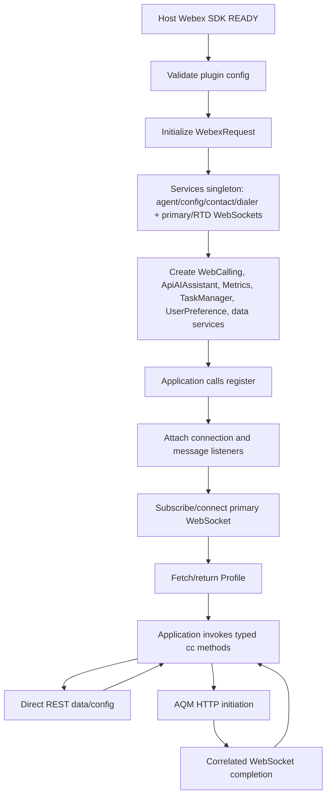
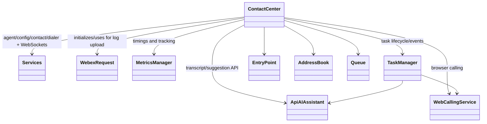

# Contact Center — SPEC

> Start here → root [`AGENTS.md`](../AGENTS.md) · router [`SPEC_INDEX.md`](SPEC_INDEX.md) · system [`ARCHITECTURE.md`](ARCHITECTURE.md). This is the module's canonical specification.

## Metadata

| Field | Value |
|---|---|
| Module id | `contact-center` |
| Source path(s) | `src` |
| Doc kind | Module spec |
| Coverage score | Partial (manifest-authoritative); 15/15 required document fields present |
| Generated from | `module-spec` @ SDLC template library `0.2.1` |
| generated_by / approved_by / updated_at | Codex generator / developer-approved follow-up review remediation / 2026-08-21 |
| Validation status | Follow-up validation passed (independent Claude fallback, 2026-07-21); 1 existing test-coverage gap; coverage remains Partial |

## Evidence Rules
Every requirement cites stable source and test file paths. Code/tests are the behavioral referee; routed source text supplies explicit intent and rationale. Missing or contradictory evidence blocks promotion.

## Source Material Register
| Source material | Scope | Decision | Detail location or disposition |
|---|---|---|---|
| Reviewed prior module guides and architecture material | overview / architecture / API / tests | used and code-checked | Content is placed by meaning throughout this specification; exact routing remains in the manifest. |

## Overview
Contact Center is one of nine confirmed Contact Center SDK modules. Own the published Webex Contact Center SDK plugin surface, registration lifecycle, public method delegation, and application-facing event routing. Existing reviewed documentation is migrated by meaning and code/tests remain the behavioral referee.

The `@webex/contact-center` package is a Webex SDK plugin that provides a TypeScript/JavaScript API for building Contact Center agent applications. It enables:

- **Agent Session Management**: Register, login, logout, state changes

- **Task Handling**: Inbound/outbound calls, chat, transfers, conferences

- **Real-time Events**: WebSocket-based notifications for agent and task events

- **Browser-based Calling**: WebRTC integration for browser softphone

- **Metrics & Diagnostics**: Built-in telemetry and log upload

- **Answer on Webex**: Accept, Decline, Mute, and DTMF for voice offers when the agent uses Webex App desktop calling (`enableWxBetterTogether`).

## Purpose / Responsibility
Own the published Webex Contact Center SDK plugin surface, registration lifecycle, public method delegation, and application-facing event routing.

## Stack
TypeScript 5.4, WebexPlugin, Node EventEmitter, WebSocket/WebRTC integrations, Jest 27, Yarn 3.4.1.

## Folder / Package Structure
```text
src/
├── index.ts                         package exports and plugin registration
├── cc.ts                            ContactCenter façade and lifecycle orchestration
├── types.ts                         package-level public contracts
├── metrics/                         telemetry manager and taxonomy
├── services/                        transport, agent, config, data, and calling collaborators
│   ├── UserPreference.ts            user-preference CRUD REST client
│   └── task/                        task objects, manager, media implementations, state machine
└── utils/PageCache.ts               shared pagination cache
```

## Key Files (source of truth)
| File | Holds |
|---|---|
| `src/index.ts` | Authoritative Contact Center implementation or contract source. |
| `src/cc.ts` | Authoritative Contact Center implementation or contract source. |
| `src/types.ts` | Authoritative Contact Center implementation or contract source. |
| `src/constants.ts` | Authoritative Contact Center implementation or contract source. |
| `src/config.ts` | Authoritative Contact Center implementation or contract source. |
| `src/services/UserPreference.ts` | User-preference CRUD implementation exposed through `cc.userPreference`. |
| `src/services/task/dialer.ts` | Preview-campaign AQM request implementations. |
| `src/services/task/types.ts` | `PreviewContactPayload`, `DropConferenceParticipantPayload`, `TaskResponse`, and task contract types. |

## Public Surface
| Contract ID | Type | Surface | Purpose | Compatibility / deprecation | Schema / detail link | Root index |
|---|---|---|---|---|---|---|
| `contact-center.surface` | SDK / event / internal API | Published `@webex/contact-center` exports and the `ContactCenter` (`cc`) WebexPlugin API. | Stable module consumption boundary. | Additive changes by default; breaking package exports require a major-version transition. | `src/index.ts` | `CONTRACTS.md` |
| `contact-center.consult-transfer-lists` | SDK data API | Existing `getQueues` and `getEntryPoints` methods, their existing search/response types, and full `ContactServiceQueue` / `EntryPointRecord` rows. | Provide consult/transfer telephony defaults without adding a parallel list API or projected destination model. | Behavioral default correction; explicit existing filter/sort/profile inputs remain overrides and full record types remain the response contract. | `src/cc.ts`, `src/services/Queue.ts`, `src/services/EntryPoint.ts`, `src/types.ts` | `CONTRACTS.md` |
| `contact-center.consult-transfer-controls` | SDK task control API | Ordered `TaskUIControls.consultTransferDestinations` arrays using the existing destination values. | Give all Task consumers the same ordered, action-specific destination visibility without a second policy call. | Additive public field; consumers may hide SDK-allowed categories but must not enable omitted categories. | `src/cc.ts`, `src/services/task/types.ts`, `src/services/task/state-machine/uiControlsComputer.ts`, `src/index.ts` | `CONTRACTS.md` |
| `contact-center.user-preference` | SDK data API | Exported `UserPreference`, `cc.userPreference`, and user-preference request/response types. | Read and mutate user preferences through authenticated REST operations. | Additive public API; removals or signature changes are breaking. | `src/services/UserPreference.ts`, `src/services/config/types.ts` | `CONTRACTS.md` |
| `contact-center.preview-campaign` | SDK task API | `acceptPreviewContact`, `skipPreviewContact`, `removePreviewContact`. | Resolve campaign preview reservations through typed AQM operations. | Additive public API; removals or signature changes are breaking. | `src/cc.ts`, `src/services/task/dialer.ts`, `src/services/task/types.ts` | `CONTRACTS.md` |
| `contact-center.conference-participant-drop` | SDK task API | Exported `DropConferenceParticipantPayload` and `ITask.dropConferenceParticipant`. | Remove a conference participant through the media-specific task implementation and correlated AQM completion. | Additive public API; removals or signature changes are breaking. | `src/index.ts`, `src/services/task/types.ts`, `src/services/task/voice/Voice.ts` | `CONTRACTS.md` |

Compatibility notes:
- Do not remove or reinterpret exported symbols/events without a documented consumer migration.

## Requires (dependencies)
- Webex SDK host/plugin lifecycle
- Contact Center REST and WebSocket backends
- Services, TaskManager, MetricsManager, WebCallingService, UserPreference, and data-service modules

## Requirements
| ID | WHAT | WHY | Source Evidence | Test / Example Evidence | Assumptions / Gaps | Confidence |
|---|---|---|---|---|---|---|
| CONTACT_CENTER-R-001 | Construct the service graph once after the host Webex SDK emits READY, before `register()` is invoked. | Collaborators require initialized host request, logger, and plugin configuration state. | `src/cc.ts` | `test/unit/spec/cc.ts` | None; source and test evidence rechecked during the 2026-07-09 remediation; independent document revalidation pending. | PRESENT |
| CONTACT_CENTER-R-002 | `register()` must attach connection/message listeners, connect the primary WebSocket, and return the fetched Profile or rethrow a logged failure. | Applications need an explicit readiness boundary and must never observe a synthetic successful registration. | `src/cc.ts` | `test/unit/spec/cc.ts` | None; source and test evidence rechecked during the 2026-07-09 remediation; independent document revalidation pending. | PRESENT |
| CONTACT_CENTER-R-003 | Delegate agent, task, data, user-preference, preview-campaign, AI-assistant, calling, and telemetry behavior to their owning collaborators while preserving typed package methods and events. Existing `getQueues` and `getEntryPoints` delegate to their services with unchanged signatures and full-record responses; the services own consult/transfer telephony filter, profile-view, ordering, and cache defaults while honoring explicit existing-parameter overrides. Before preview delegation, reject disabled skip/remove actions from task campaign flags. | A thin stable façade avoids parallel consumer APIs while service-owned defaults keep ordinary widget calls consistent and preserve an override path for other consumers. | `src/cc.ts`, `src/types.ts`, `src/services/Queue.ts`, `src/services/EntryPoint.ts`, `src/services/UserPreference.ts`, `src/services/task/dialer.ts` | `test/unit/spec/cc.ts`, `test/unit/spec/services/Queue.ts`, `test/unit/spec/services/EntryPoint.ts`, `test/unit/spec/services/UserPreference.ts`, `test/unit/spec/services/task/dialer.ts` | Public preview delegation is covered; the `campaignPreviewSkipDisabled` and `campaignPreviewRemoveDisabled` early-exit guards lack direct unit coverage. Independent review identified this gap on 2026-07-15. | PRESENT |
| CONTACT_CENTER-R-004 | `deregister()` must remove registered listeners, stop applicable host/calling resources, close primary and RTD WebSockets, clear agent configuration, and surface cleanup failures. | Listener or connection leaks create duplicate events and stale authenticated sessions in long-lived hosts. | `src/cc.ts` | `test/unit/spec/cc.ts` | None; source and test evidence rechecked during the 2026-07-09 remediation; independent document revalidation pending. | PRESENT |
| CONTACT_CENTER-R-005 | On `connectionLost`, ContactCenter must own recovery policy and invoke private `silentRelogin()` only when automated relogin is allowed. | ConnectionService reports transport state; only ContactCenter has agent profile and policy context for authentication recovery. | `src/cc.ts` | `test/unit/spec/cc.ts` | None; source and test evidence rechecked during the 2026-07-09 remediation; independent document revalidation pending. | PRESENT |

## Design Overview
`ContactCenter` is the package façade and lifecycle owner. Its constructor waits for the host Webex SDK `READY` event, validates plugin configuration, initializes `WebexRequest`, obtains the singleton `Services` graph, and constructs calling, AI-assistant, metrics, task-management, `UserPreference`, and data-service collaborators. `register()` is deliberately narrower: it attaches runtime listeners and establishes the primary Contact Center WebSocket subscription.

Direct data/configuration and user-preference operations return authenticated REST responses. Enabled agent/task AQM operations, including preview-campaign accept/skip/remove, send authenticated HTTP requests but resolve or reject only after a matching WebSocket notification. Before delegating preview skip/remove, ContactCenter checks the task's campaign-disable flags and throws locally when the corresponding flag is `'true'`. TaskManager converts backend task events into Task instances and typed state-machine events. ContactCenter maps package-facing events through WebexPlugin `trigger` or its internal EventEmitter according to the published contract.

Inbound primary-WebSocket messages are mapped through `handleWebsocketMessage`, which emits only event names on the typed `CC_EVENTS`/`AGENT_EVENTS` allow-list. A server-controlled `eventData.data.type` that is not a known allow-listed constant is ignored and never emitted as an application event name.

Durable agent, task, and configuration records remain remote-system owned. The package owns only in-memory profile/task/listener/cache/connection state.

### wxApp Better Together (WXCC-6026)

Contract id: `contact-center.wxapp-answer` ([CONTRACTS.md](./CONTRACTS.md)). Task telephony routing, UI controls, and mute events are specified in [task-spec.md](../src/services/task/ai-docs/task-spec.md). Service collaborators: [services-spec.md](../src/services/ai-docs/services-spec.md).

- **Init flag:** `webex.init({ cc: { enableWxBetterTogether: boolean } })` — default `false`. When `true`, ContactCenter enables wxApp telephony routing on tasks after supported station login. **Compatible with `allowMultiLogin: true`** (multiple SDK sessions may receive offers; wxApp telephony is routed per active task instance). **Phase 1 is init-only** — to change the flag after SDK init, re-init with updated config.
- **Read API:** `cc.isWxBetterTogetherEnabled()` returns the current init flag value.
- **Phase 2 (internal/private):** `setManageWebexCallingInWxcc(enabled)` remains as a private implementation for future runtime toggle; hosts must not call it in Phase 1.
- **Post-login hooks:** `ensureWxAppPostStationLogin()` runs after successful `stationLogin()` and after `silentRelogin()` on socket reconnect. When the init flag is ON, it publishes usersub `true`, connects Mercury/device for mute sync, and backfills mute state on active tasks. Failures roll back wxApp config and release partial Mercury/device resources without failing station login. When OFF, it force-publishes usersub `false` (clears stale suppression after page refresh) and tears down wxApp Mercury resources.
- **Teardown:** `deregister()`, station logout, and wxApp teardown paths call `teardownWxAppLocalState()` — publish usersub `false`, unsubscribe Mercury, release CC-owned device/Mercury connections, and reset **session runtime** state (usersub active flag, Mercury subscriptions, task-manager wxApp routing) so stale session flags do not apply on relogin. The host init flag (`enableWxBetterTogether`) is **not** cleared on station logout — it persists until `deregister()` or re-init per Phase 1 contract. Local cleanup runs even when usersub publish fails.
- **Host telephony surface:** Hosts call unified `task.accept()`, `task.decline()`, `task.toggleMute({ muted? })`, and `task.transmitDtmf({ dtmf })`; SDK `Voice` routes wxApp legs internally when the flag is active. Shared-line `lineOwnerId` defaults from the wxApp agent participant when omitted.

Evidence: `src/cc.ts`, `src/config.ts`, `src/services/WebexCrossClientService.ts`, `src/services/WxAppTelephonyMercurySync.ts`, `test/unit/spec/cc.ts`.

## Data Flow


## Sequence Diagram(s)
Sequence coverage:

| Operation group | Diagram | Failure / recovery coverage |
|---|---|---|
| READY-time bootstrap | Bootstrap | Invalid configuration or collaborator initialization rejects readiness-dependent use. |
| Registration | Register | Connection/subscription failure is logged, metrics record failure, logs upload, and the error is rethrown. |
| Deregistration | Deregister | Cleanup failure is measured, logged, and rethrown; no synthetic success. |
| Connection recovery | Recovery | ConnectionService emits state; ContactCenter chooses silent relogin or preserves failure state. |

### Bootstrap

```mermaid
sequenceDiagram
  participant Host as Host Webex SDK
  participant CC as ContactCenter
  participant S as Services
  participant TM as TaskManager
  Host-->>CC: READY
  CC->>CC: validatePluginConfig()
  alt configuration valid
    CC->>CC: WebexRequest.getInstance(webex)
    CC->>S: Services.getInstance(webex, connectionConfig)
    CC->>CC: create WebCallingService + ApiAIAssistant + MetricsManager
    CC->>TM: getTaskManager(aiAssistant, contact, calling, primaryWS, rtdWS)
    CC->>CC: create EntryPoint + AddressBook + Queue; initialize LoggerProxy
  else invalid configuration or initialization failure
    CC-->>Host: readiness-dependent use rejects
  end
```

### Register

```mermaid
sequenceDiagram
  participant App
  participant CC as ContactCenter
  participant WS as Primary WebSocketManager
  participant Cfg as AgentConfigService
  participant Agent as Services.agent
  participant Metrics
  App->>CC: register()
  CC->>CC: setupEventListeners(); listen for WS messages
  CC->>Metrics: time register success/failure
  CC->>WS: initWebSocket({body, resource: SUBSCRIBE_API})
  WS-->>CC: Welcome data containing agentId
  CC->>Cfg: getAgentConfig(orgId, agentId)
  alt profile fetched
    Cfg-->>CC: Profile
    CC->>CC: set TaskManager/config/AI flags
    opt applicable AI feature enabled
      CC->>CC: start RTD WebSocket; log but contain RTD failure
    end
    opt browser calling applicable
      CC->>CC: mercury.connect(); log but contain failure
    end
    opt allowAutomatedRelogin
      CC->>Agent: reload()
      Agent-->>CC: relogin result, AGENT_NOT_FOUND, or error
    end
    CC->>Metrics: track registration success
    CC-->>App: Profile
  else primary subscription/profile/relogin failure
    CC->>Metrics: track registration failure
    CC->>CC: uploadLogs(correlationId)
    CC-->>App: throw error
  end
```

### Deregister

```mermaid
sequenceDiagram
  participant App
  participant CC as ContactCenter
  participant Host as Mercury/device
  participant WS as Primary + RTD WebSockets
  App->>CC: deregister()
  CC->>CC: remove TaskManager/message/connection listeners
  opt browser calling resources active
    CC->>Host: disconnect Mercury; unregister device
  end
  CC->>WS: close(false, reason)
  CC->>CC: agentConfig = null
  alt cleanup succeeds
    CC-->>App: void
  else cleanup fails
    CC-->>App: throw error
  end
```

### Recovery

```mermaid
sequenceDiagram
  participant CS as ConnectionService
  participant CC as ContactCenter
  participant Agent as Services.agent
  CS-->>CC: connectionLost(details)
  CC->>CC: handleConnectionLost(details)
  alt allowAutomatedRelogin
    CC->>CC: silentRelogin()
    CC->>Agent: reload()
    alt relogin succeeds
      Agent-->>CC: relogin result; update agent config/device state
    else AGENT_NOT_FOUND
      Agent-->>CC: handled silently
    else other failure
      Agent--xCC: throw detailed error
    end
  else disabled
    CC->>CC: make no relogin call; retain reported transport state
  end
```

## Class / Component Relationships


## Use Cases
- **UC-1 Host bootstrap:** after host READY, initialize the complete collaborator graph exactly once. Evidence: `src/cc.ts`, `test/unit/spec/cc.ts`.
- **UC-2 Register:** attach listeners and establish the primary WebSocket subscription before returning Profile. Evidence: `src/cc.ts`, `test/unit/spec/cc.ts`.
- **UC-3 Delegate SDK operations:** validate/map public inputs, call the owning collaborator, track metrics, and return or emit typed results. Evidence: `src/cc.ts`, `src/index.ts`, `test/unit/spec/cc.ts`.
- **UC-4 Recover connection:** consume ConnectionService state and conditionally reload the agent session through ContactCenter policy. Evidence: `src/cc.ts`, `test/unit/spec/cc.ts`.
- **UC-5 Deregister:** remove the same listener identities, shut down applicable host/WebSocket resources, and clear in-memory profile state. Evidence: `src/cc.ts`, `test/unit/spec/cc.ts`.

## State Model
ContactCenter retains in-memory `agentConfig`, collaborator references, event listeners, task collections through TaskManager, and connection/recovery state. Remote Webex services remain authoritative for agent, task, and organization data. Registration establishes runtime connectivity but does not imply station login; deregistration tears down SDK resources but does not itself perform station logout.

## Business Rules & Invariants
- Collaborators are initialized after host READY and before their use; `register()` must not be documented as their constructor boundary. Evidence: `src/cc.ts`.
- AQM promises complete only from correlated WebSocket success/failure or timeout, not from HTTP acknowledgement. Evidence: `src/services/core/aqm-reqs.ts`.
- `skipPreviewContact` checks `campaignPreviewSkipDisabled` and `removePreviewContact` checks `campaignPreviewRemoveDisabled` on the matching task. When the applicable value is `'true'`, ContactCenter throws before initiating an HTTP or WebSocket-correlated AQM operation; `acceptPreviewContact` has no equivalent pre-guard. Evidence: `src/cc.ts`.
- `handleWebsocketMessage` only re-emits event names that belong to the typed `CC_EVENTS`/`AGENT_EVENTS` allow-list; an untrusted `eventData.data.type` outside that allow-list is not emitted as an event name. Evidence: `src/cc.ts`.
- ContactCenter owns automated relogin policy; ConnectionService owns transport-state detection/emission. Evidence: `src/cc.ts`, `src/services/core/websocket/connection-service.ts`.
- Deregistration does not station-logout the agent. Evidence: `src/cc.ts`.
- Published methods/types/events remain semver-sensitive through `src/index.ts`.

## Concurrency & Reactive Flow
READY initialization, REST promises, AQM WebSocket correlation, TaskManager events, calling events, and connection timers execute asynchronously. Listener cleanup must use the registered function identity. Message listeners are independent: AqmReqs correlates pending requests, ContactCenter maps package events, TaskManager owns task lifecycle, and ConnectionService tracks liveness/reconnect state.

## State Machine

```mermaid
stateDiagram-v2
  [*] --> AwaitingHostReady
  AwaitingHostReady --> Initialized: host READY + collaborators created
  Initialized --> Registering: register()
  Registering --> Registered: WebSocket/profile success
  Registering --> Initialized: registration failure
  Registered --> Recovering: connectionLost
  Recovering --> Registered: reconnect/relogin succeeds
  Recovering --> Registered: relogin disabled; transport state reported
  Registered --> Deregistering: deregister()
  Deregistering --> Initialized: listeners/resources cleared
  Deregistering --> Registered: cleanup throws before completion
```


## Protocol / Wire Format
Authenticated REST initiates direct data/config operations and AQM agent/task operations. For AQM, the HTTP response is acknowledgement only; `notifSuccess.bind`/`notifFail.bind` match WebSocket payloads that settle the promise. The primary WebSocket carries Contact Center notifications; the RTD WebSocket carries transcript/suggestion traffic. Payload and event names are owned by `src/types.ts`, `src/services/config/types.ts`, `src/services/agent/types.ts`, and `src/services/task/types.ts`.

## Error Handling & Failure Modes
| Condition | Signal (error/code/result) | Caller recovery |
|---|---|---|
| Dependency rejection | Typed/rethrown error or failure event | Inspect structured details, preserve tracking id, and retry only when the operation is safe. |
| Timeout or missing async completion | Timeout/recovery state | Follow the module-specific recovery path; never synthesize success. |

## Pitfalls
- READY-time construction and `register()` are different lifecycle boundaries; moving collaborator creation into `register()` can duplicate listeners and use uninitialized host services.
- AQM HTTP responses are acknowledgements, not operation completion; only a correlated WebSocket notification or timeout settles the operation.
- Listener cleanup must use the same bound function identities registered during setup or repeated register/deregister cycles will leak handlers.

## Module Do's / Don'ts
- DO construct the collaborator graph only after host READY and keep registration focused on listeners, subscription, and profile retrieval.
- DO route agent recovery decisions through ContactCenter because it owns profile/config policy.
- DON'T synthesize successful register/deregister results after a dependency or cleanup failure.
- DON'T let transport services call `silentRelogin()` directly.

## Export Stability
The npm export/type-declaration surface is semver-sensitive. Additive optional types are compatible; removals, renames, or semantic changes require a major-version migration and changelog entry.

## Host Integration & Theming
The module registers as `cc` through the Webex SDK plugin system and depends on host-provided Webex credentials, configuration, request routing, and lifecycle events. It renders no UI and defines no theme contract.

## Key Design Trade-off
- A single plugin surface centralizes compatibility and event routing, while specialized modules retain implementation ownership; this costs careful bootstrap and cleanup ordering.

## Test-Case Strategy (module)
`test/unit/spec/cc.ts` is the characterization baseline. Cover READY-time construction, registration success/failure, listener identity, existing queue/entry-point method delegation, WebSocket event mapping, preview-campaign operations (including disabled skip/remove pre-guards), automated-relogin enabled/disabled branches, browser-calling conditions, and deregistration cleanup/error paths. Use Queue and EntryPoint service tests for default policy and explicit existing-parameter overrides, `test/unit/spec/services/UserPreference.ts` for user-preference CRUD, and `test/unit/spec/services/task/dialer.ts` for preview AQM request contracts. Preserve the package-wide 85% branch/function/line/statement threshold.

| Requirement | Existing evidence | Required revalidation |
|---|---|---|
| CONTACT_CENTER-R-001 | `test/unit/spec/cc.ts` | READY-time ownership and initialization order |
| CONTACT_CENTER-R-002 | `test/unit/spec/cc.ts` | register success/failure and log-upload path |
| CONTACT_CENTER-R-003 | `test/unit/spec/cc.ts`, `test/unit/spec/services/UserPreference.ts`, `test/unit/spec/services/task/dialer.ts` | Add direct tests proving disabled skip/remove flags throw before dialer invocation; revalidate typed delegation, user-preference CRUD, preview-campaign AQM operations, and event routing. |
| CONTACT_CENTER-R-004 | `test/unit/spec/cc.ts` | listener/resource cleanup and error propagation |
| CONTACT_CENTER-R-005 | `test/unit/spec/cc.ts` | relogin policy ownership |

## Traceability
- Repo architecture: `ARCHITECTURE.md` · Registry: `SPEC_INDEX.md`
- Coverage state and contracts baseline: `../.sdd/manifest.json`
