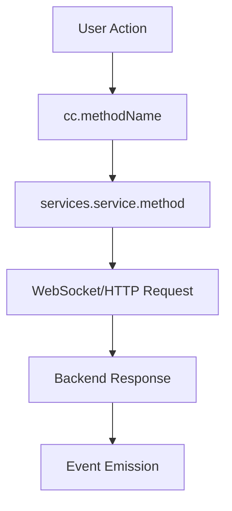
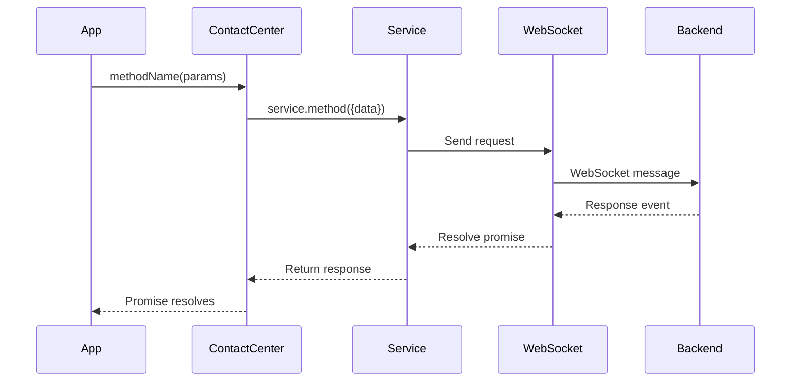
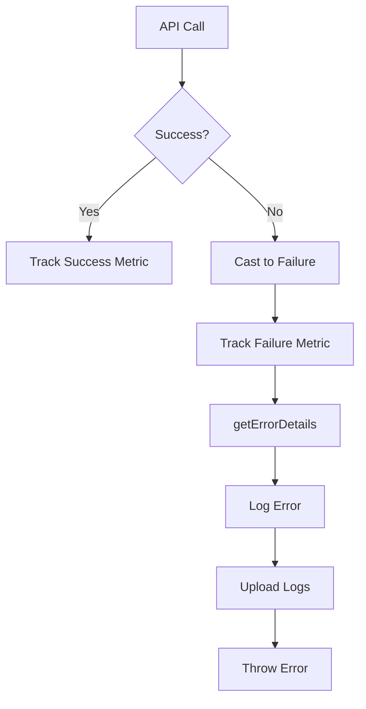
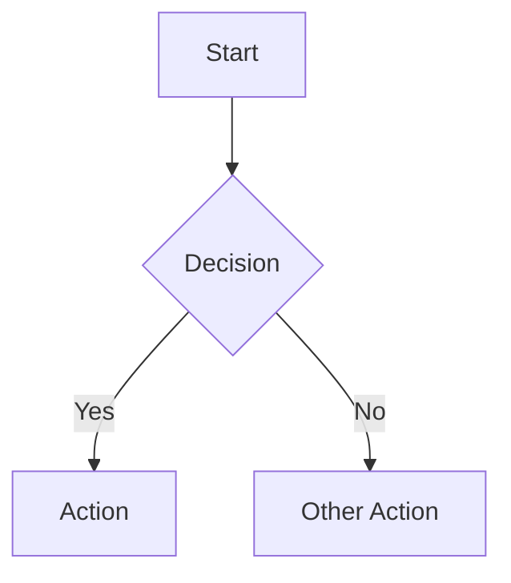
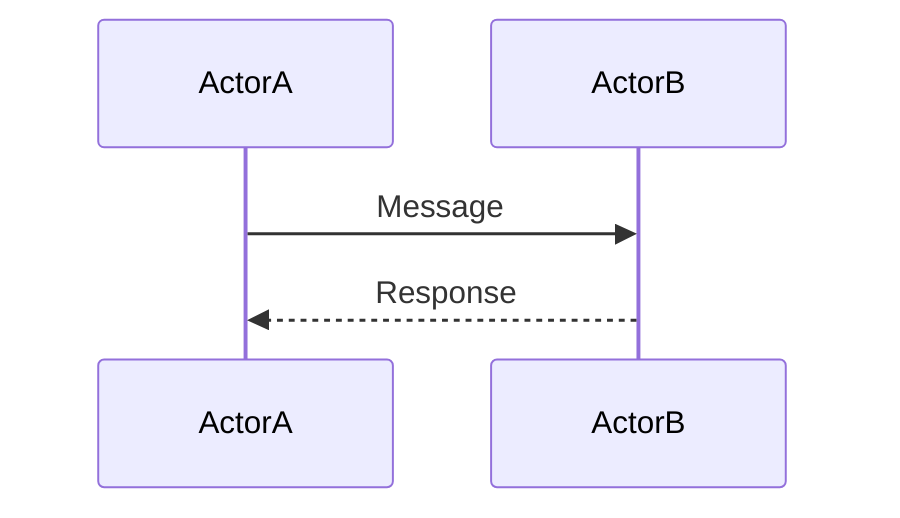
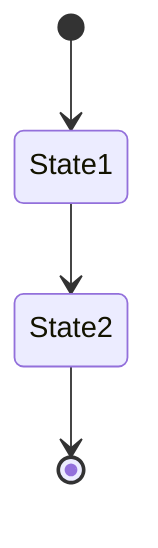
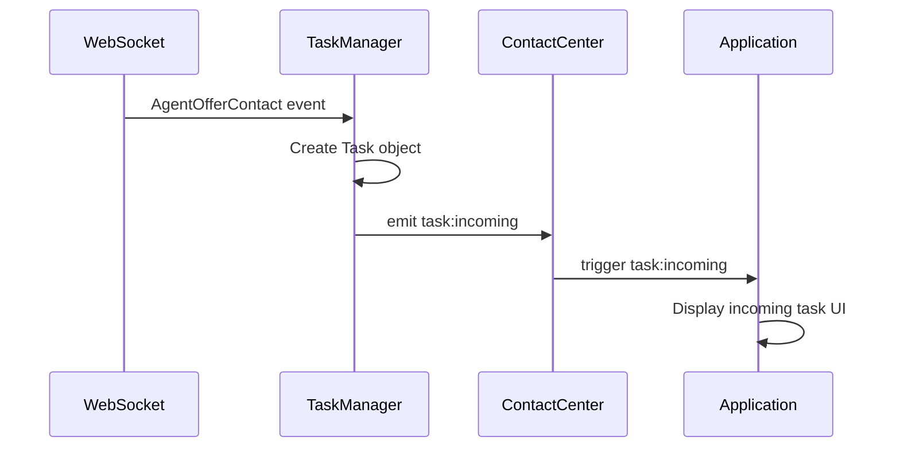

# Create ARCHITECTURE.md Template

> **Purpose**: Template for generating service-level ARCHITECTURE.md files with technical deep-dives.

---

## Pre-Generation Questions

Answer before writing:

1. **Component Overview**: What are the main components/classes?
2. **File Structure**: How are files organized?
3. **Data Flow**: How does data move through the system?
4. **Integration Points**: How does this integrate with other services?
5. **Key Sequences**: What are the important operation sequences?
6. **Troubleshooting**: What are common issues and solutions?

---

## ARCHITECTURE.md Structure

```markdown
# [Service Name] - Architecture

> **Purpose**: Technical documentation for the [service name] component.

---

## Component Overview

| Component | File | Responsibility |
|-----------|------|----------------|
| `ClassName` | `path/to/file.ts` | What it does |
| `ClassName2` | `path/to/file2.ts` | What it does |

---

## File Structure

> **Note:** The file structure listing typically belongs in the service's `AGENTS.md` (usage documentation), not in `ARCHITECTURE.md`. Include it here only if you need to reference specific files in the architecture discussion. Otherwise, link to the AGENTS.md file structure section.

```
services/[name]/
├── index.ts          # Main service export
├── types.ts          # Type definitions
├── constants.ts      # Constants
└── ai-docs/
    ├── AGENTS.md     # Usage documentation (file structure lives here)
    └── ARCHITECTURE.md # This file
```

---

## Data Flow



---

## Sequence Diagrams

### [Operation Name]



---

## Key Patterns

### [Pattern Name]

Description of the pattern and why it's used.

```typescript
// Code example
```

---

## Integration Points

### With [Component]

How this service integrates with other components.

### With WebSocket

How WebSocket events are handled.

### With Metrics

What metrics are tracked.

---

## State Management

### Lifecycle States

```
[State 1] → [State 2] → [State 3]
     ↑                      ↓
     └──────────────────────┘
```

### State Transitions

| From | To | Trigger |
|------|-----|---------|
| State1 | State2 | Action |

---

## Error Handling

### Error Types

| Error | Cause | Resolution |
|-------|-------|------------|
| `REASON_CODE` | Why it happens | How to fix |

### Error Flow



---

## Troubleshooting

### [Issue]: [Symptom]

**Cause**: Why this happens

**Solution**: How to fix

**Example**:
```typescript
// Code showing the fix
```

---

## Related Files

- [Main implementation](../../path/to/file.ts)
- [Types](../../path/to/types.ts)
- [Tests](../../../../test/unit/spec/path/to/file.ts)
```

---

## Content Guidelines

### Component Overview
- List main classes/functions
- Include file paths
- Brief responsibility description

### Diagrams
- Use Mermaid for all diagrams
- Keep diagrams focused (not too complex)
- Include legends if needed

### Sequence Diagrams
- Show key operations
- Include error paths for critical flows
- Label all participants clearly

### Troubleshooting
- Document real issues encountered
- Provide concrete solutions
- Include code examples

---

## Mermaid Diagram Guidelines

### Flowchart


### Sequence


### State


---

## Validation Checklist

- [ ] All components listed with files
- [ ] Data flow diagram included
- [ ] Key sequence diagrams present
- [ ] Error handling documented
- [ ] Troubleshooting section has real issues
- [ ] Mermaid diagrams render correctly
- [ ] Links to source files included

---

## Example: Task Service ARCHITECTURE.md

```markdown
# Task Service - Architecture

> Technical documentation for task lifecycle management.

---

## Component Overview

| Component | File | Responsibility |
|-----------|------|----------------|
| `TaskManager` | `task/TaskManager.ts` | Task lifecycle coordination |
| `contact` | `task/contact.ts` | Task operations (hold, transfer) |
| `dialer` | `task/dialer.ts` | Outbound call initiation |
| `AutoWrapup` | `task/AutoWrapup.ts` | Auto wrapup timer |

---

## Sequence: Incoming Task



---

## Troubleshooting

### Issue: Task events not received

**Cause**: TaskManager listeners not registered

**Solution**: Ensure register() is called before login
```
