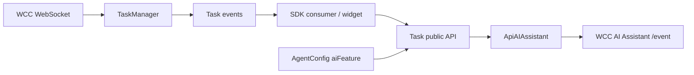
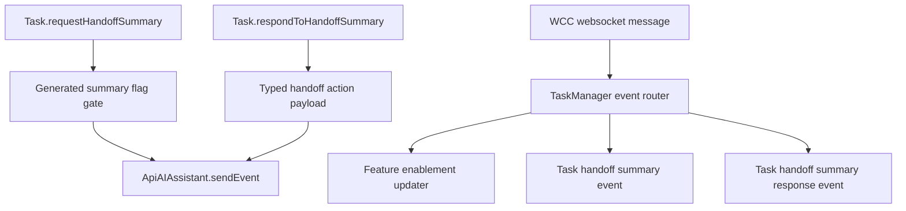
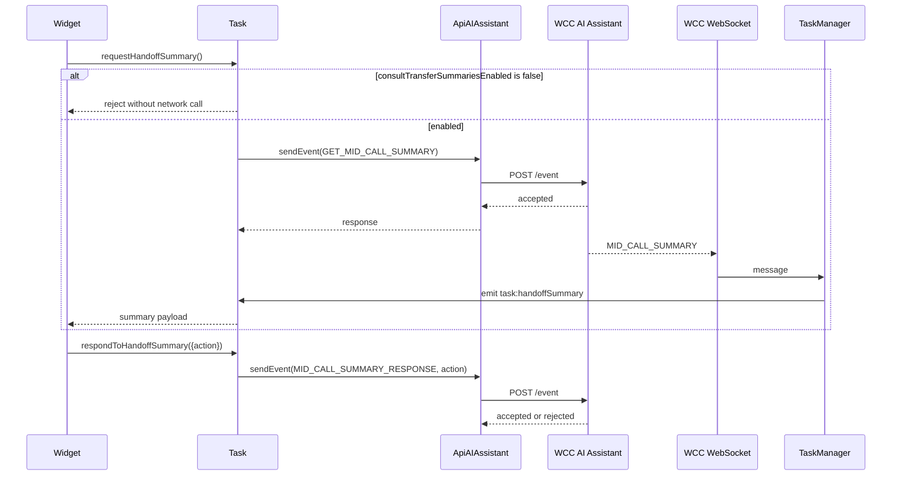

# Feature Design - Agent Handoff Summary events and public APIs

> Serves the spec [`feature-spec.md`](../spec/feature-spec.md); feeds decomposition [`../tasks/`](../tasks/) and test plan [`test-strategy.md`](../test-strategy.md).

## Metadata
| Field | Value |
|---|---|
| Feature / ticket key | `cai-7974-agent-handoff-summary` / `CAI-7974` |
| Title | Agent Handoff Summary events and public APIs |
| Feature Spec | `../spec/feature-spec.md` |
| Status | soft-committed |
| Change class | `contract-affecting` |
| created_by / approved_by / date | Codex generator / user chat approval / 2026-06-30 |
| Generated from | `feature-design` @ SDLC template library `0.2.0` |

## Executive Summary
This design adds a package-local handoff summary slice to `@webex/contact-center`: `Task` exposes request/response helpers, `ApiAIAssistant` carries the AI Assistant `/event` calls, and `TaskManager` routes WCC handoff summary websocket events to SDK task events. The implementation is additive and flag-gated by `generatedSummaries.consultTransferSummariesEnabled` (R-1..R-7).

## Scenario -> Design Map
| Requirement / scenario | Design element that satisfies it |
|---|---|
| R-1 request summary helper | `Task.requestHandoffSummary()` -> `ApiAIAssistant.sendEvent(GET_MID_CALL_SUMMARY)` |
| R-2 response helper | `Task.respondToHandoffSummary()` -> `ApiAIAssistant.sendEvent(MID_CALL_SUMMARY_RESPONSE)` |
| R-3 flag gate | `Task.isHandoffSummaryEnabled()` checks `apiAIAssistant.aiFeature.generatedSummaries.consultTransferSummariesEnabled` |
| R-4 `MID_CALL_SUMMARY` routing | `TaskManager.registerTaskListeners()` maps backend event to `TASK_EVENTS.TASK_HANDOFF_SUMMARY` |
| R-5 subsequent-agent response routing | `TaskManager.registerTaskListeners()` maps backend event to `TASK_EVENTS.TASK_HANDOFF_SUMMARY_RESPONSE` |
| R-6 `FEATURE_ENABLEMENT` | `TaskManager.handleHandoffSummaryFeatureEnablement()` updates AI feature flags when boolean state is present |
| R-7 docs/types | `src/services/task/types.ts`, `src/types.ts`, module specs, and root contracts docs |

# Feature Architecture

## System Context

Inside this package: task helpers, task events, AI Assistant transport usage, feature-flag checks, and websocket routing. Outside this package: backend summary generation, backend schema ownership, and widget UI rendering.

## Functional-Block Decomposition

| Block | Responsibility | New or existing | Touches module(s) |
|---|---|---|---|
| Task handoff helper block | Public request/response methods and flag checks | new | `src/services/task/index.ts`, `src/services/task/types.ts` |
| AI Assistant event transport | Builds `/event` body and sends through Webex request | existing extended | `src/services/ApiAiAssistant.ts`, `src/types.ts` |
| Websocket handoff router | Maps backend handoff events to task events | existing extended | `src/services/task/TaskManager.ts`, `src/services/config/types.ts` |
| Public event/type catalog | Names SDK events/actions/payloads | existing extended | `src/services/task/types.ts`, `src/index.ts` |

## Object-Model Changes
| Object / entity | New / changed / removed | Fields / shape change | Owning module |
|---|---|---|---|
| `HandoffSummaryAction` | new | `'CANCEL' | 'CONSULT' | 'TRANSFER'` | `src/services/task/types.ts` |
| `HandoffSummaryRequestPayload` | new | optional `interactionId`, optional generic `eventData` | `src/services/task/types.ts` |
| `HandoffSummaryResponsePayload` | new | required `action`, optional `interactionId`, optional generic `eventData` | `src/services/task/types.ts` |
| `HandoffSummaryPayload` | new | generic payload pass-through with optional `interactionId`/`data` | `src/services/task/types.ts` |
| `AIAssistantEventAction` | new | transcript or handoff action union | `src/types.ts` |
| `AIFeatureFlags.generatedSummaries.consultTransferSummariesEnabled` | existing | reused as boolean gate | `src/services/config/types.ts` |

## Design Decisions & Rationale
- **D-1 Keep backend payloads generic:** use `Record<string, unknown>` pass-through for summary payload details - **why:** CAI-7974 names events but does not provide a machine-readable schema.
- **D-2 Put public helpers on `Task`:** request/response operations belong to the active interaction object - **why:** consumers already perform consult/transfer actions on `Task`.
- **D-3 Reuse `ApiAIAssistant.sendEvent`:** generalize its optional event data instead of adding another transport method - **why:** PR #4794 already established `/event` URL mapping, metrics, and error handling.
- **D-4 Emit both semantic SDK events and raw backend event names:** new `TASK_EVENTS.*` names give stable SDK semantics while existing raw event re-emission stays compatible - **why:** current TaskManager emits backend event names after task handling.

## Alternatives Explored
| Alternative | Pros | Cons | Why not chosen |
|---|---|---|---|
| Add a separate handoff summary service | Isolates code | Duplicates AI Assistant URL mapping, metrics, and errors | Existing `ApiAIAssistant` is the intended reusable service. |
| Require exact backend summary schema now | Stronger compile-time shape | Contract not present in Jira/source | Would invent fields; use generic pass-through until backend schema exists. |
| Expose only raw websocket events | Minimal code | Consumers still need direct transport knowledge for requests/responses | Ticket asks for public APIs/helpers. |

## Dependencies & Assumptions
- **Assumes:** `ApiAIAssistant.aiFeature` is set during registration from agent config, as existing code does in `src/cc.ts`.
- **Assumes:** Backend sends one of `interactionId`, `conversationId`, or nested `data.conversationId` so TaskManager can find the task.
- **Depends on:** WCC AI Assistant supporting `GET_MID_CALL_SUMMARY` and `MID_CALL_SUMMARY_RESPONSE`.

## Architecture Views
- **Logical view:** covered by Functional-Block Decomposition.
- **Deployment view:** N/A - this is an SDK package change shipped in the existing package.
- **Data-flow view:** covered by System Context and Sequence Diagrams.

## Feature-Toggle Strategy
| Toggle | Gates | Behavior when OFF | Default | Owner | Removal trigger |
|---|---|---|---|---|---|
| `generatedSummaries.consultTransferSummariesEnabled` | `Task.requestHandoffSummary()` | reject without sending AI Assistant event | disabled unless true | WCC config/backend | no planned removal |
| `FEATURE_ENABLEMENT` | optional runtime update to generated summary flag | no effect when payload lacks a boolean | backend controlled | WCC backend | no planned removal |

## Impacted Services / Modules & Task Split

### Contact Center SDK handoff summary
- **Deployment target:** `@webex/contact-center` package in `webex/webex-js-sdk`.
- **Epic:** `tasks/sdk-handoff-summary/epic.md`.
- **Changes:**
  - Extend task public API and task event enum.
  - Generalize AI Assistant event payloads.
  - Add websocket routing for handoff summary events.
  - Update tests and SDD docs.

## Service Impact Matrix
| Service / module | Changes? | What changes (or why not) | Owner |
|---|---|---|---|
| `src/services/task/` | yes | public helpers, payload/action types, task events, websocket routing | CCSDK |
| `src/services/ApiAiAssistant.ts` | yes | optional action and generic event data for `/event` helper | CCSDK |
| `src/services/config/` | yes | adds consumed event names and uses existing generated summary flag | CCSDK |
| `src/metrics/` | no | existing AI Assistant send-event metrics reused | CCSDK |
| WCC AI Assistant backend | no package code | must support named events and payloads | WCC backend |
| Widget UI | no package code | consumes new helpers/events | Widget owner |

## Interface & Contract Definitions
| Interface | Producer | Consumer(s) | Change type | Contract doc | Schema / API source | Compatibility / deprecation |
|---|---|---|---|---|---|---|
| Task handoff summary helpers/events | `@webex/contact-center` | SDK consumers/widgets | new | `contracts/handoff-summary-task-api.md` | `src/services/task/index.ts`; `src/services/task/types.ts` | additive/minor |
| AI Assistant `/event` handoff usage | `ApiAIAssistant` | WCC AI Assistant service | modify | `contracts/ai-assistant-handoff-event.md` | `src/services/ApiAiAssistant.ts` | additive; transcript behavior preserved |

> Per-interface contract documents live in `contracts/*.md`.

## Protocol / Wire-Format Design
- Websocket event names consumed: `MID_CALL_SUMMARY`, `MID_CALL_SUMMARY_RESPONSE_SUBSEQUENT_AGENT`, and optional `FEATURE_ENABLEMENT`.
- AI Assistant event names sent: `GET_MID_CALL_SUMMARY` and `MID_CALL_SUMMARY_RESPONSE`.
- Exact backend payload fields are backend-owned and not present in this repo; SDK passes payload objects through and only reads interaction id and optional enablement boolean.

## HA & Failure-Condition Matrix
| Failure condition | Probability | Impact | Mitigation / fallback |
|---|---|---|---|
| Feature flag false/missing | medium | helper cannot request summary | reject before network call; consumer can hide/disable UI. |
| AI Assistant base URL unavailable | low | request/response helper fails | reuse existing detailed error path. |
| Backend summary websocket arrives before task exists | low | no task event emitted | log task-not-found behavior consistent with current realtime handling. |
| Backend payload schema changes | medium | typed fields unavailable | payload is pass-through generic; only interaction-id extraction is SDK-owned. |

## Sequence Diagrams
Sequence coverage:

| Operation group | Diagram | Failure / recovery coverage |
|---|---|---|
| Request and receive handoff summary | Handoff summary request flow | disabled flag and transport failure branches |
| Respond to handoff summary | Handoff summary response flow | transport failure branch |
| Runtime enablement | Feature enablement update flow | malformed/no-boolean branch |

## Rollout / Migration Interlock
| Step / wave | What ships | Depends on | Toggle state | Owner |
|---|---|---|---|---|
| 1 | SDK additive helpers/events and docs | none | backend/config controls flag | CCSDK |
| 2 | Backend sends enablement and summary events | backend readiness | enable only for ready tenants/agents | WCC backend |
| 3 | Widget adopts helpers/events | SDK release available | enable per rollout | Widget owner |

## Test Strategy
Full plan: `../test-strategy.md`. Key scenarios: enabled/disabled helper behavior, response action send, websocket summary event routing, enablement update, existing transcript regression.

## Design Coverage Summary
| Concern | In-scope / N/A / Out-of-scope | Where addressed |
|---|---|---|
| System context | In-scope | System Context |
| Functional decomposition | In-scope | Functional-Block Decomposition |
| Object model | In-scope | Object-Model Changes |
| Alternatives | In-scope | Alternatives Explored |
| Feature toggle | In-scope | Feature-Toggle Strategy |
| Scale | N/A | not perf-critical |
| Service impact | In-scope | Service Impact Matrix |
| Interfaces / contracts | In-scope | Interface & Contract Definitions |
| Data model | N/A | no owned datastore/schema |
| Security / RBAC | N/A | no new authn/authz surface; existing Webex request auth reused |
| HA / failure | In-scope | HA & Failure-Condition Matrix |
| Rollout / migration | In-scope | Rollout / Migration Interlock |
| Test strategy | In-scope | Test Strategy |

## Reviewer Sign-Off
| Role | Reviewer | Status | Date |
|---|---|---|---|
| Architect | CCSDK architect | pending | 2026-06-30 |
| Tech Lead | CCSDK maintainer | pending | 2026-06-30 |
| Product | CAI-7974 owner | pending | 2026-06-30 |
| UX | Widget owner | pending | 2026-06-30 |
| QA | CCSDK QA | pending | 2026-06-30 |
| Delivery / SRE | N/A | N/A - SDK package only | 2026-06-30 |

## References / Traceability
- Feature Spec: `../spec/feature-spec.md`
- Repo architecture: `../../../ai-docs/ARCHITECTURE.md`
- Per-interface contracts: `contracts/*.md`
- Test strategy: `../test-strategy.md`
- Coverage / contracts baseline: package SDD baseline.
