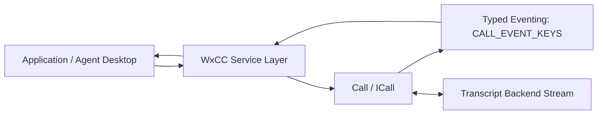
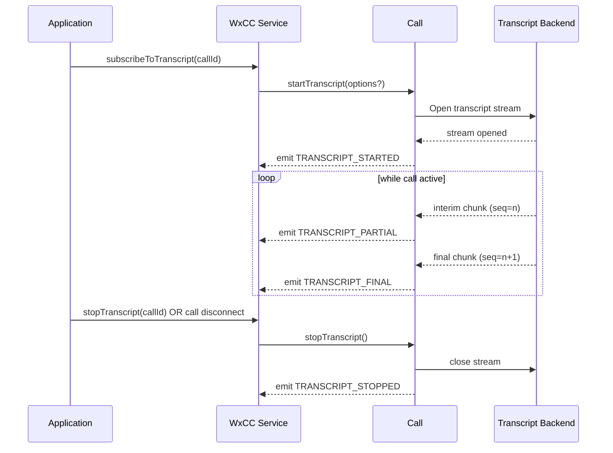
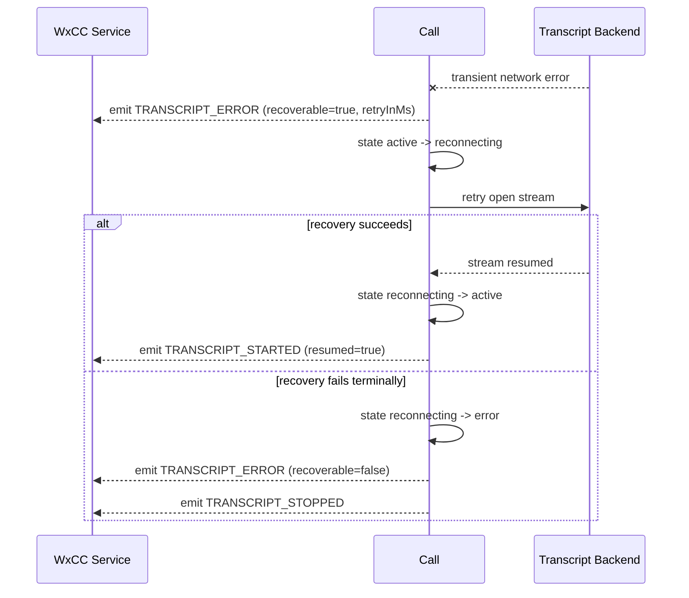
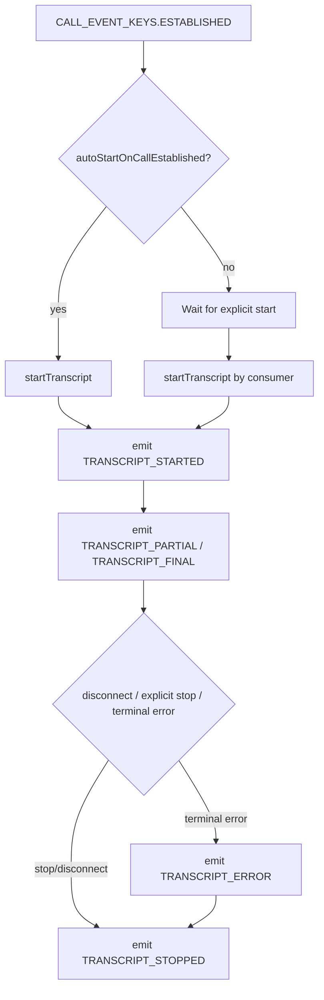
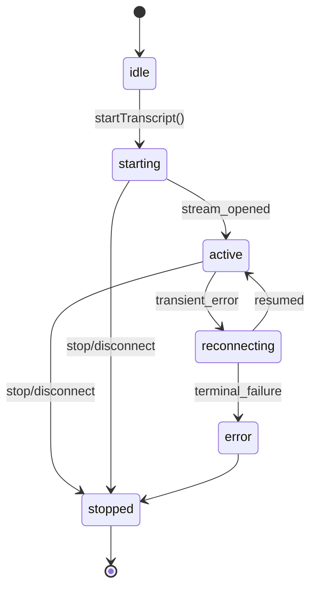

# Real-Time Transcripts — Architecture Addendum

**Feature:** Real-time transcript streaming for active calls  
**Companion Spec:** `real-time-transcripts-DISCOVERY.md`  
**Primary Reference:** [SPIKE Discovery: Real Time Transcripts using WxCC-SDK](https://confluence-eng-gpk2.cisco.com/conf/spaces/WSDK/pages/790253498/SPIKE+Discovery+Real+Time+Transcripts+using+WxCC-SDK)

---

## 1) Scope of This Addendum

This file focuses on architecture and runtime behavior only:

- event flow
- lifecycle sequencing
- error/recovery transitions
- integration boundaries (`@webex/calling` <-> WxCC consumer)

For API and payload contracts, use `real-time-transcripts-DISCOVERY.md`.

---

## 2) Component Boundaries

---

## 3) Lifecycle Sequence

### 3.1 Start + Stream + Stop

### 3.2 Error and Recovery

---

## 4) Event Flow Contract (Runtime)

---

## 5) State Model

---

## 6) Integration Notes for WxCC Consumer

- Prefer subscribing via typed SDK events instead of raw backend payload parsing.
- Treat `TRANSCRIPT_PARTIAL` as replaceable; treat `TRANSCRIPT_FINAL` as immutable.
- Use `(callId, sequence)` for dedupe and ordering.
- Preserve `recoverable` and `retryInMs` from `TRANSCRIPT_ERROR` for UX hints.

---

## 7) Edge Cases to Validate

1. Call ends while transcript stream is reconnecting.
2. Duplicate transcript sequence from backend replay.
3. Late partial arrives after final for same segment.
4. Transfer/handoff scenario where call context changes.
5. Consumer unsubscribes before stream close ack.

---

## 8) Traceability

- Public/API contract: `real-time-transcripts-DISCOVERY.md`
- Package-level architecture: `packages/calling/src/ai-docs/ARCHITECTURE.md`
- Package-level routing/spec guide: `packages/calling/src/ai-docs/AGENTS.md`
