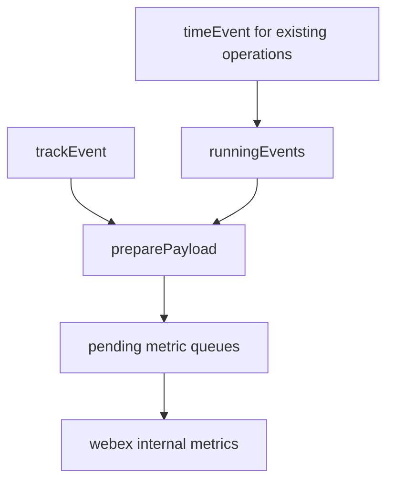
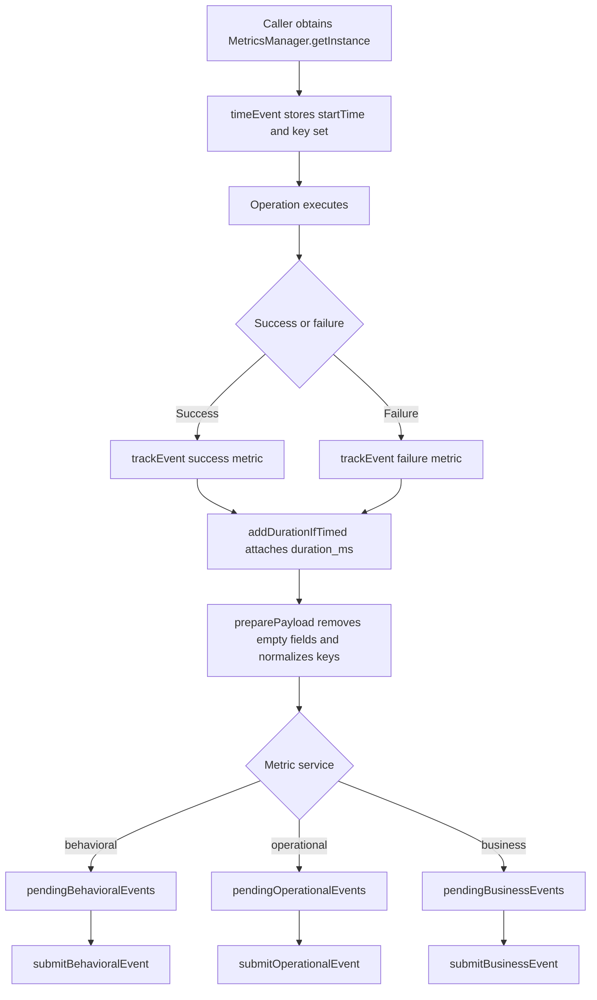
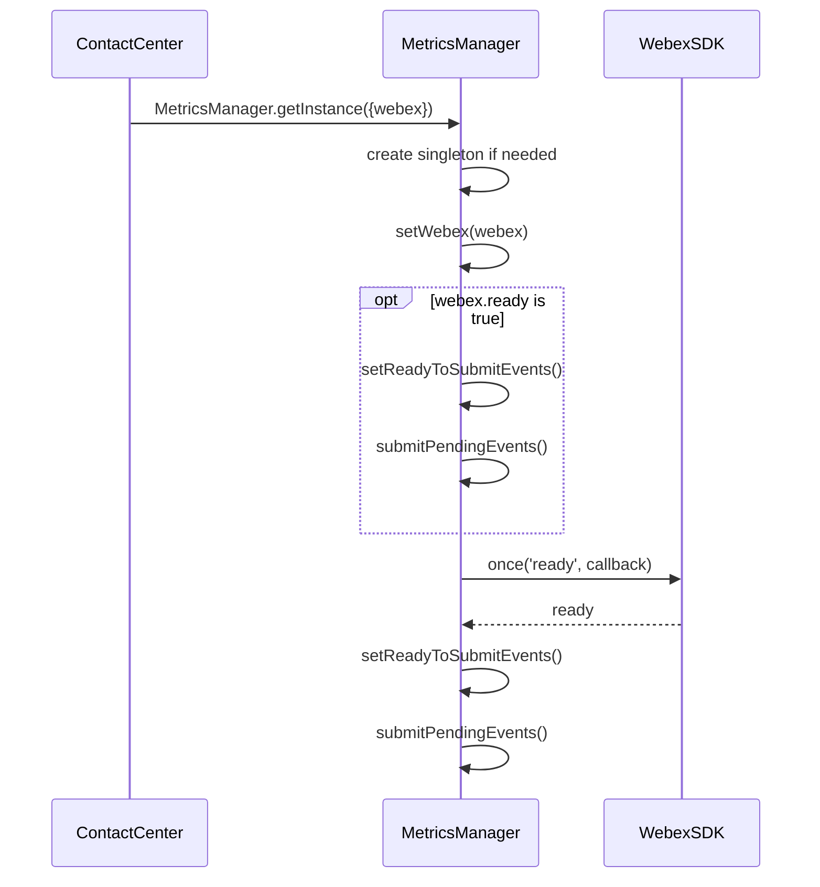
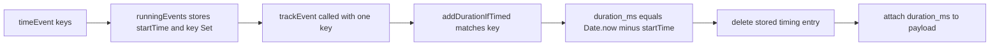
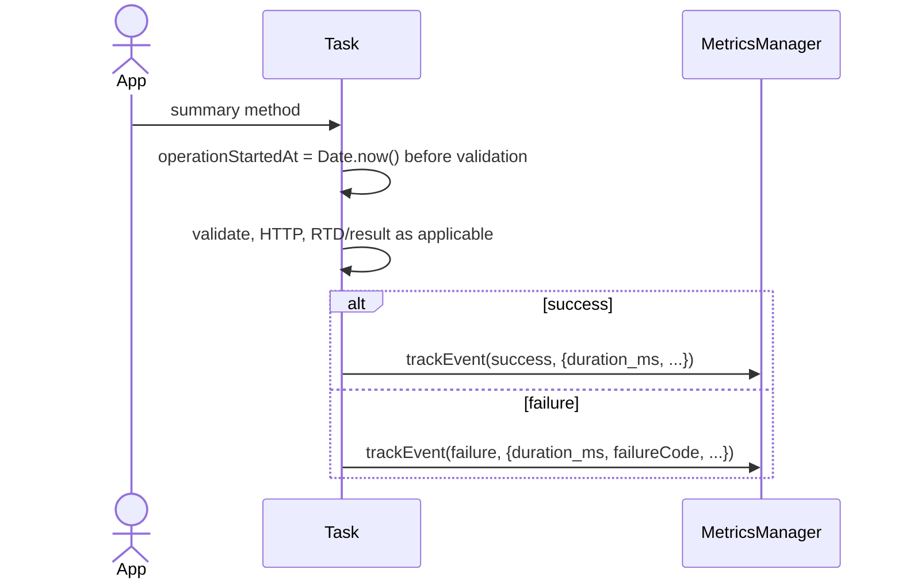

# Metrics Module - Architecture

> **Purpose**: Technical documentation for the metrics collection, batching,
> timing, payload preparation, and submission system within the Contact Center
> SDK.

---

## Component Overview

| Component | File | Responsibility |
| --- | --- | --- |
| `MetricsManager` | `MetricsManager.ts` | Singleton that manages event queuing, timing, payload preparation, and submission |
| `BehavioralEventTaxonomy` | `behavioral-events.ts` | Maps metric event names to structured taxonomy for behavioral analytics |
| `METRIC_EVENT_NAMES` | `constants.ts` | Canonical constant object of tracked metric event names |

## File Structure

```text
src/metrics/
|-- MetricsManager.ts       # Singleton metrics manager
|-- behavioral-events.ts    # Behavioral event taxonomy mapping
|-- constants.ts            # METRIC_EVENT_NAMES constants
`-- ai-docs/
    |-- AGENTS.md           # Usage documentation
    `-- ARCHITECTURE.md     # This file
```

## Singleton Pattern

`MetricsManager` uses a private constructor with a static `getInstance`
factory. The Webex SDK instance is bound once through `getInstance({webex})`;
subsequent callers retrieve the same manager with `getInstance()`.

```typescript
const metrics = MetricsManager.getInstance({webex});
const sameMetrics = MetricsManager.getInstance();

MetricsManager.resetInstance(); // tests only
```

- `setWebex(...)` marks the manager ready immediately when `webex.ready` is already true.
- `setWebex(...)` also registers a `webex.once('ready', ...)` callback for queued startup events.
- `resetInstance()` clears the singleton so tests can start from a clean manager.

## MetricsManager Overview

`MetricsManager` is a singleton that queues and submits behavioral,
operational, and business metrics. Existing Contact Center operations may use
the `timeEvent(...)` plus `trackEvent(...)` pattern, where `timeEvent(...)`
stores start time by metric key and `trackEvent(...)` attaches `duration_ms`.



## Event Submission Flow



## Initialization And Readiness



## Event Queuing And Submission

MetricsManager maintains three independent queues:

| Queue | Type | Submitted via | Name transform | Extra metadata |
| --- | --- | --- | --- | --- |
| `pendingBehavioralEvents` | behavioral | `webex.internal.newMetrics.submitBehavioralEvent` | taxonomy fields from `behavioral-events.ts` | none |
| `pendingOperationalEvents` | operational | `webex.internal.newMetrics.submitOperationalEvent` | `WXCC_SDK_` prefix plus uppercase, underscore-normalized metric name | none |
| `pendingBusinessEvents` | business | `webex.internal.newMetrics.submitBusinessEvent` | same as operational | `metadata: {appType: 'wxcc_sdk'}` |

Submission guards:

- `readyToSubmitEvents` is false until the Webex SDK is ready.
- `submittingEvents` prevents concurrent queue flushes.
- `metricsDisabled` drops new metrics and clears pending queues when enabled.

## Timing Pattern



Standard callers time both terminal names before the operation. Whichever
terminal metric is tracked consumes the shared duration.

```typescript
const metrics = MetricsManager.getInstance();

metrics.timeEvent([
  METRIC_EVENT_NAMES.STATION_LOGIN_SUCCESS,
  METRIC_EVENT_NAMES.STATION_LOGIN_FAILED,
]);

metrics.trackEvent(
  METRIC_EVENT_NAMES.STATION_LOGIN_SUCCESS,
  {...MetricsManager.getCommonTrackingFieldForAQMResponse(response)},
  ['behavioral', 'operational', 'business']
);
```

## Payload Preparation

`preparePayload(...)` runs before submission:

1. Removes values that are `undefined`, `null`, `''`, arrays, or empty objects.
2. Converts payload keys with spaces to underscore-separated names.
3. Adds `tabHidden: document.hidden` in browser environments.

## Behavioral Event Taxonomy

Behavioral metric names map to `BehavioralEventTaxonomy`:

```typescript
type BehavioralEventTaxonomy = {
  product: MetricEventProduct;
  agent: MetricEventAgent;
  target: string;
  verb: MetricEventVerb;
};
```

The final behavioral event is represented as `{product}.{agent}.{target}.{verb}`.
The mapping is defined in `behavioral-events.ts` and read through
`getEventTaxonomy(name)`.

Events without behavioral taxonomy, including `WEBSOCKET_DEREGISTER_SUCCESS`,
`WEBSOCKET_DEREGISTER_FAIL`, `WEBSOCKET_EVENT_RECEIVED`, `AI_ASSISTANT_*`, and
`AI_SUMMARY_*`, must be sent only to services they actually own. AI summary
uses operational metrics explicitly.

## Common Tracking Field Extraction

`MetricsManager.getCommonTrackingFieldForAQMResponse(response)` extracts
`agentId`, `agentSessionId`, `teamId`, `siteId`, `orgId`, `eventType`,
`trackingId`, and `notifTrackingId`.

`MetricsManager.getCommonTrackingFieldForAQMResponseFailed(failureResponse)`
extracts `agentId`, `trackingId`, `notifTrackingId`, `orgId`, `failureType`,
`failureReason`, and `reasonCode`.

## AI Summary Timing Architecture

AI summary operations do not use the singleton timing store. Task captures
`operationStartedAt = Date.now()` as the first public-method action before any
validation, configuration check, or correlation lookup. It then passes a
calculated `duration_ms` in the one final `trackEvent(...)`.



This keeps overlapping invocations independent. An overlap failure emits its own
bounded metric with `AI_SUMMARY_REQUEST_ALREADY_PENDING` before the accepted
first request's later final metric, without restarting or consuming the first
request's duration.

## AI Summary Metric Ownership

| Owner | Metrics |
| --- | --- |
| `Task` | `AI_SUMMARY_POST_CALL_REQUEST_SUCCESS`, `AI_SUMMARY_POST_CALL_REQUEST_FAILED`, `AI_SUMMARY_MID_CALL_REQUEST_SUCCESS`, `AI_SUMMARY_MID_CALL_REQUEST_FAILED`, `AI_SUMMARY_POST_CALL_RESPONSE_SUCCESS`, `AI_SUMMARY_POST_CALL_RESPONSE_FAILED`, `AI_SUMMARY_MID_CALL_RESPONSE_SUCCESS`, `AI_SUMMARY_MID_CALL_RESPONSE_FAILED` |
| `TaskManager` | `AI_SUMMARY_FEATURE_ENABLEMENT_RECEIVED`, `AI_SUMMARY_INBOUND_EVENT_DROPPED` |
| `ApiAIAssistant` | No Task operation metric ownership; adapter tests prove bounded transport and privacy. |
| `AISummaryCoordinator` | No operation metric ownership; receiver expiry reports through the TaskManager callback. |

Request success is withheld until both the HTTP acknowledgement and matching RTD
result fulfill. Response success is recorded when bounded HTTP acknowledgement
fulfills because responses have no RTD result.

## Contract Boundary

This architecture owns timing isolation and metric producer ownership. Exact
AI-summary event names, bounded failure/drop codes, success conditions, and
payload privacy rules are canonical in
[Metrics And Privacy](../../../../../../ai-summary.md#metrics-and-privacy).
All emitted identifiers must be declared in `metrics/constants.ts`.


## Privacy Boundary

MetricsManager receives only upstream-sanitized, bounded AI-summary metadata.
The complete allowed and forbidden field sets live in the canonical
[Metrics And Privacy contract](../../../../../../ai-summary.md#metrics-and-privacy).


## Error Handling Strategy

MetricsManager does not throw to metric callers:

- Invalid metric services are logged through `LoggerProxy.error`.
- Empty `timeEvent` key arrays are logged and ignored.
- Disabled metrics silently drop new events.
- Queues retain events until readiness and the submit lock prevents overlapping flushes.

## Verification

The focused Jest suites assert metric ownership, duration isolation, and privacy:

- `test/unit/spec/services/task/Task.ts`
- `test/unit/spec/services/task/TaskManager.ts`
- `test/unit/spec/services/ApiAiAssistant.ts`
- `test/unit/spec/cc.ts`
