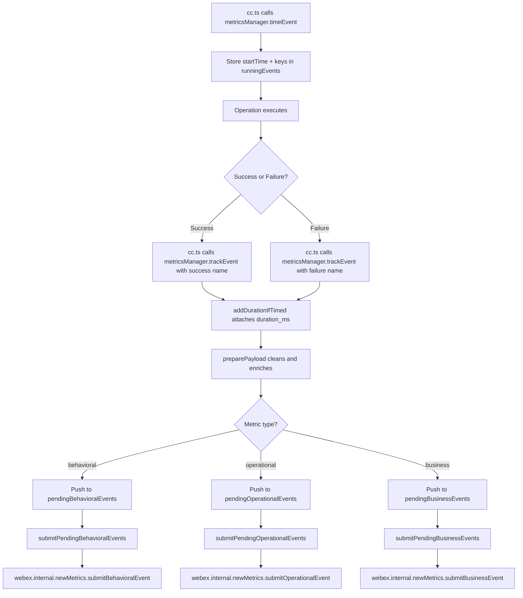
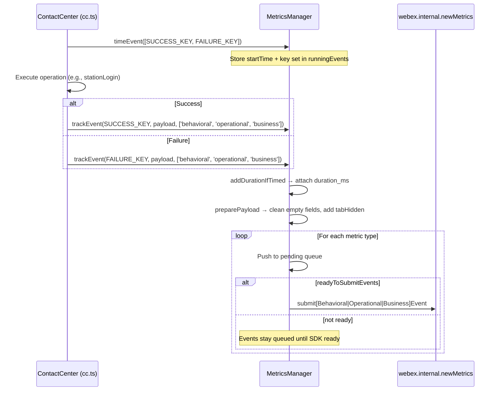
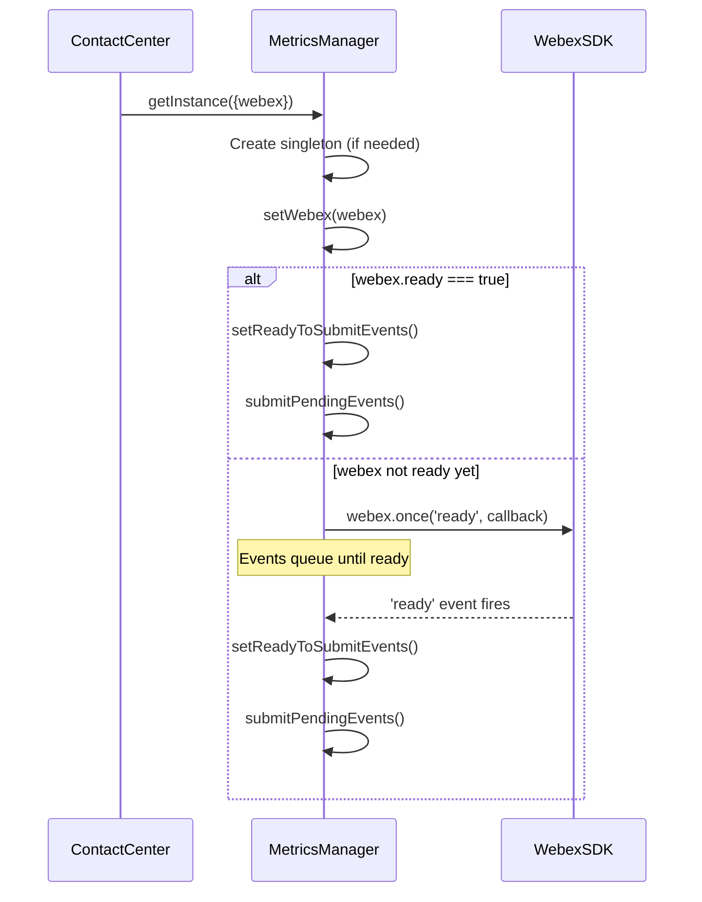
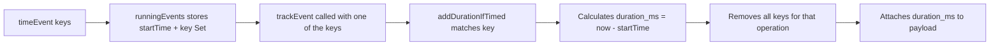

# Metrics Module - Architecture

> **Purpose**: Technical documentation for the metrics collection, batching, and submission system within the Contact Center SDK.

---

## Component Overview

| Component                | File                    | Responsibility                                                                 |
| ------------------------ | ----------------------- | ------------------------------------------------------------------------------ |
| `MetricsManager`         | `MetricsManager.ts`     | Singleton that manages event queuing, timing, payload preparation, and submission |
| `BehavioralEventTaxonomy`| `behavioral-events.ts`  | Maps metric event names to structured taxonomy for behavioral analytics         |
| `METRIC_EVENT_NAMES`     | `constants.ts`          | Canonical constant object of all tracked metric event names                     |

---

## File Structure

```
src/metrics/
├── MetricsManager.ts       # Singleton metrics manager
├── behavioral-events.ts    # Behavioral event taxonomy mapping
├── constants.ts            # METRIC_EVENT_NAMES constants
└── ai-docs/
    ├── AGENTS.md           # Usage documentation
    └── ARCHITECTURE.md     # This file
```

---

## Singleton Pattern

`MetricsManager` uses a private constructor with a static `getInstance` factory:

```typescript
// MetricsManager.ts
export default class MetricsManager {
  private static instance: MetricsManager;
  private constructor() {}

  public static getInstance(options?: {webex: WebexSDK}): MetricsManager {
    if (!MetricsManager.instance) {
      MetricsManager.instance = new MetricsManager();
    }
    if (!MetricsManager.instance.webex && options?.webex) {
      MetricsManager.instance.setWebex(options.webex);
    }
    return MetricsManager.instance;
  }
}
```

The Webex SDK instance is set once via `setWebex()`, which listens for the `ready` event before flushing pending queues.

---

## Data Flow

### Event Submission Flow



---

## Sequence Diagrams

### Track Event with Timing



### Initialization and Readiness



---

## Behavioral Event Taxonomy

Each metric event name maps to a `BehavioralEventTaxonomy` with four fields:

```typescript
type BehavioralEventTaxonomy = {
  product: MetricEventProduct;  // Always PRODUCT_NAME ('wxcc_sdk')
  agent: MetricEventAgent;      // 'user' or 'service'
  target: string;               // e.g., 'station_login', 'task_accept'
  verb: MetricEventVerb;        // 'complete' for success, 'fail' for failure
};
```

The final behavioral event name is constructed as: `{product}.{agent}.{target}.{verb}`

Example: `wxcc_sdk.user.station_login.complete`

The mapping is defined in `behavioral-events.ts` via `eventTaxonomyMap` and accessed through `getEventTaxonomy(name)`.

---

## Event Queuing and Submission

### Three Parallel Queues

MetricsManager maintains three independent pending event queues:

| Queue                       | Type         | Submitted Via                                      |
| --------------------------- | ------------ | -------------------------------------------------- |
| `pendingBehavioralEvents`   | behavioral   | `webex.internal.newMetrics.submitBehavioralEvent`   |
| `pendingOperationalEvents`  | operational  | `webex.internal.newMetrics.submitOperationalEvent`  |
| `pendingBusinessEvents`     | business     | `webex.internal.newMetrics.submitBusinessEvent`     |

### Submission Guards

- **readyToSubmitEvents**: Set to `true` only after `webex.once('ready')` fires. Events queue until then.
- **submittingEvents**: Lock flag to prevent concurrent `submitPendingEvents()` calls.
- **metricsDisabled**: When `true`, all `track*` methods return early and `clearPendingEvents()` empties all queues.

---

## Timing Pattern (`timeEvent` / `trackEvent`)



Usage pattern from `cc.ts`:

```typescript
// Before operation
this.metricsManager.timeEvent([
  METRIC_EVENT_NAMES.STATION_LOGIN_SUCCESS,
  METRIC_EVENT_NAMES.STATION_LOGIN_FAILED,
]);

// On success
this.metricsManager.trackEvent(
  METRIC_EVENT_NAMES.STATION_LOGIN_SUCCESS,
  { ...MetricsManager.getCommonTrackingFieldForAQMResponse(resp) },
  ['behavioral', 'operational', 'business']
);

// On failure
this.metricsManager.trackEvent(
  METRIC_EVENT_NAMES.STATION_LOGIN_FAILED,
  { ...MetricsManager.getCommonTrackingFieldForAQMResponseFailed(failure) },
  ['behavioral', 'operational', 'business']
);
```

---

## Payload Preparation

`preparePayload()` processes every event payload before submission:

1. **Removes empty/null/undefined fields** — strips keys with `undefined`, `null`, `''`, any arrays, or empty objects
2. **Converts spaces to underscores** — `spacesToUnderscore()` applied to all key names
3. **Adds common metadata** — appends `tabHidden: document.hidden` in browser environments

---

## Error Handling Strategy

MetricsManager does not throw errors to callers. Instead:

- Invalid metric types are logged via `LoggerProxy.error`
- Empty `timeEvent` key arrays are logged and ignored
- Disabled state (`metricsDisabled`) silently drops events
- The `submittingEvents` lock prevents race conditions during concurrent submissions

---

## Common Tracking Field Extraction

Two static helpers extract standardized fields from AQM responses for metric payloads:

### `getCommonTrackingFieldForAQMResponse(response)`

Extracts: `agentId`, `agentSessionId`, `teamId`, `siteId`, `orgId`, `eventType`, `trackingId`, `notifTrackingId`

### `getCommonTrackingFieldForAQMResponseFailed(failureResponse)`

Extracts: `agentId`, `trackingId`, `notifTrackingId`, `orgId`, `failureType`, `failureReason`, `reasonCode`

---

## Metric Event Names

All event names are defined in `constants.ts` as `METRIC_EVENT_NAMES`. Events follow a `{Domain} {Action} {Success|Failed}` naming convention:

| Category          | Success Event                          | Failure Event                          |
| ----------------- | -------------------------------------- | -------------------------------------- |
| Agent Login       | `STATION_LOGIN_SUCCESS`                | `STATION_LOGIN_FAILED`                 |
| Agent Logout      | `STATION_LOGOUT_SUCCESS`               | `STATION_LOGOUT_FAILED`                |
| Agent Relogin     | `STATION_RELOGIN_SUCCESS`              | `STATION_RELOGIN_FAILED`               |
| State Change      | `AGENT_STATE_CHANGE_SUCCESS`           | `AGENT_STATE_CHANGE_FAILED`            |
| Buddy Agents      | `FETCH_BUDDY_AGENTS_SUCCESS`           | `FETCH_BUDDY_AGENTS_FAILED`            |
| WebSocket         | `WEBSOCKET_REGISTER_SUCCESS`           | `WEBSOCKET_REGISTER_FAILED`            |
| Task Accept       | `TASK_ACCEPT_SUCCESS`                  | `TASK_ACCEPT_FAILED`                   |
| Task Hold         | `TASK_HOLD_SUCCESS`                    | `TASK_HOLD_FAILED`                     |
| Task Transfer     | `TASK_TRANSFER_SUCCESS`                | `TASK_TRANSFER_FAILED`                 |
| Task Conference   | `TASK_CONFERENCE_START_SUCCESS`        | `TASK_CONFERENCE_START_FAILED`         |
| Outdial           | `TASK_OUTDIAL_SUCCESS`                 | `TASK_OUTDIAL_FAILED`                  |
| EntryPoint        | `ENTRYPOINT_FETCH_SUCCESS`             | `ENTRYPOINT_FETCH_FAILED`              |
| AddressBook       | `ADDRESSBOOK_FETCH_SUCCESS`            | `ADDRESSBOOK_FETCH_FAILED`             |
| Queue             | `QUEUE_FETCH_SUCCESS`                  | `QUEUE_FETCH_FAILED`                   |

Special events (no success/failure pair): `AGENT_RONA`, `AGENT_CONTACT_ASSIGN_FAILED`, `AGENT_INVITE_FAILED`, `WEBSOCKET_EVENT_RECEIVED`

---

## Troubleshooting

### Issue: Metrics not being submitted

**Cause**: Webex SDK not yet ready when `trackEvent` is called

**Solution**: Events are automatically queued in `pending*Events` arrays and flushed once `webex.once('ready')` fires. Verify the SDK is initializing correctly.

### Issue: Duration not attached to metric

**Cause**: `timeEvent` was not called before `trackEvent`, or the event name does not match any key in `runningEvents`

**Solution**: Ensure `timeEvent([SUCCESS_KEY, FAILURE_KEY])` is called before the operation, and that the exact `METRIC_EVENT_NAMES` constant is used in both calls.

### Issue: Metrics silently dropped

**Cause**: `metricsDisabled` is set to `true`

**Solution**: Check if `setMetricsDisabled(true)` was called. This clears all pending queues and causes all `track*` methods to return early.

---

## Related Files

- [MetricsManager.ts](../MetricsManager.ts) — Singleton metrics manager
- [behavioral-events.ts](../behavioral-events.ts) — Event taxonomy mapping
- [constants.ts](../constants.ts) — METRIC_EVENT_NAMES definitions
- [cc.ts](../../cc.ts) — Main plugin class (primary consumer)
- [constants.ts](../../constants.ts) — PRODUCT_NAME used in event prefixing
