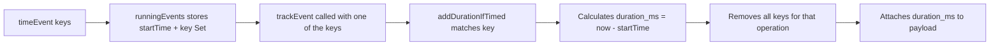
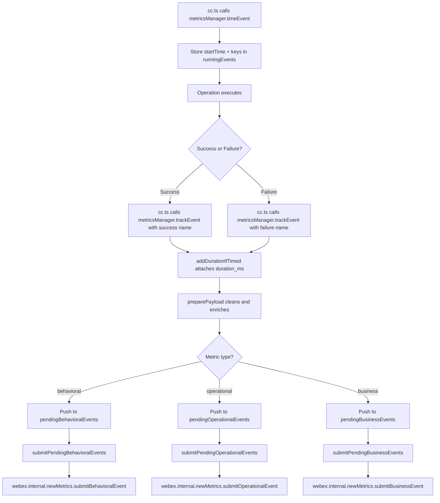
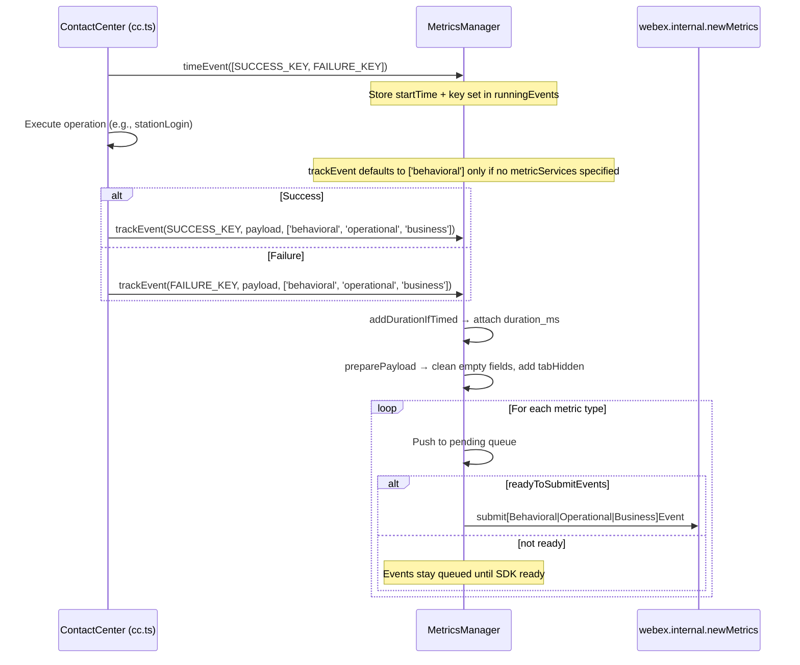
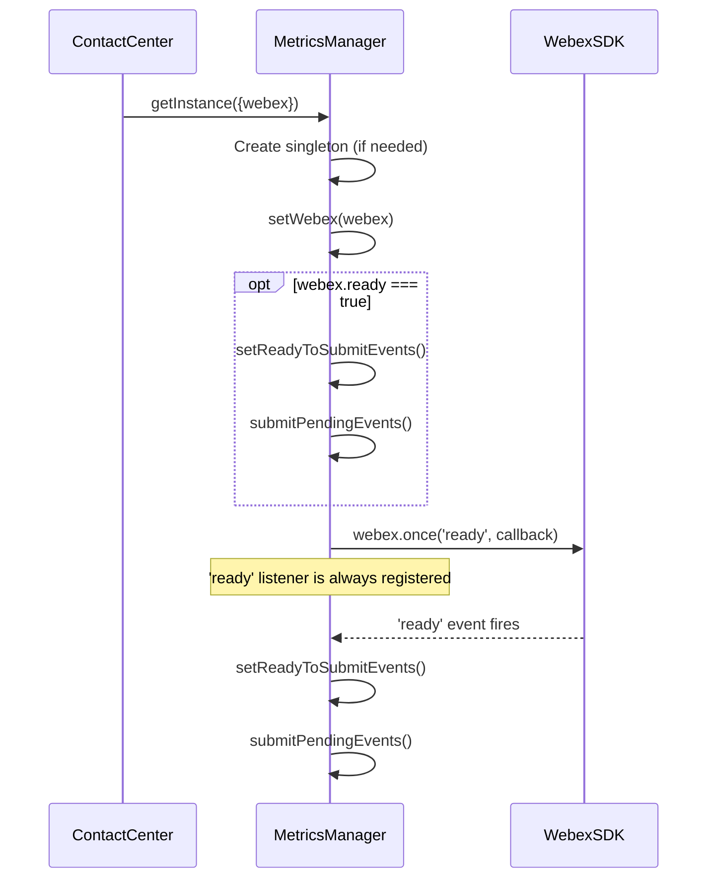
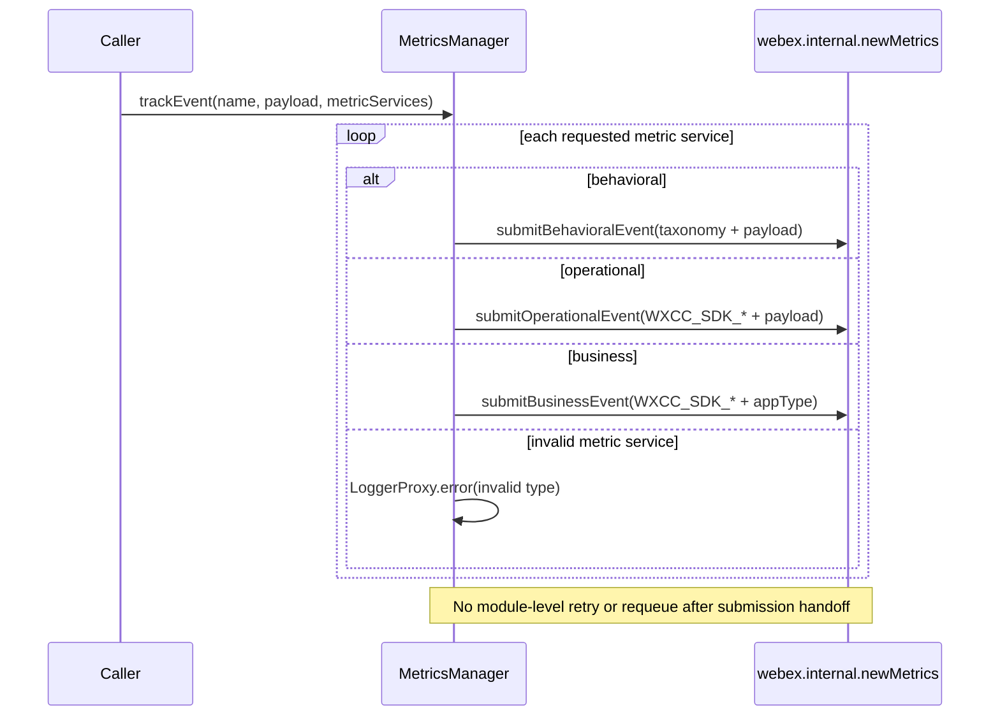
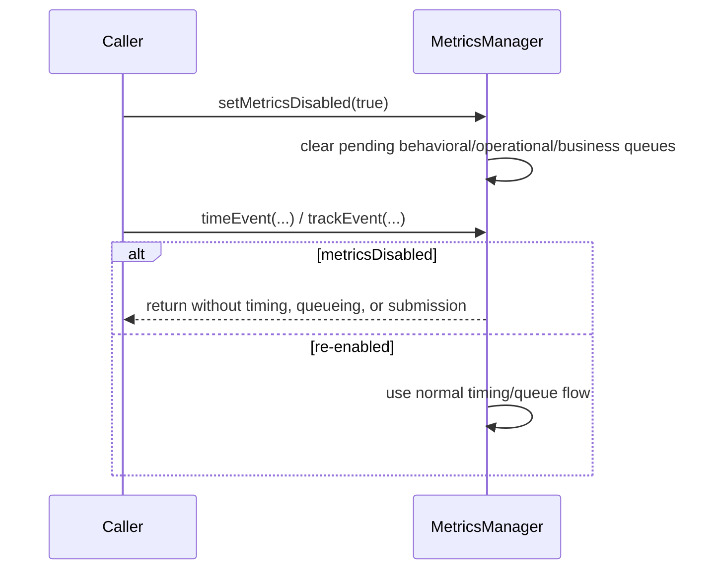
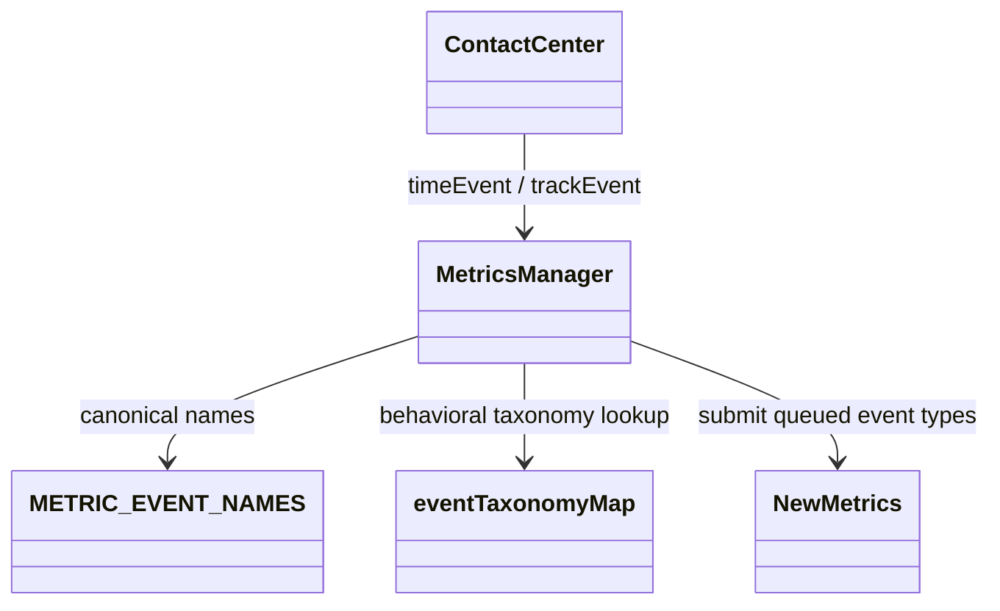
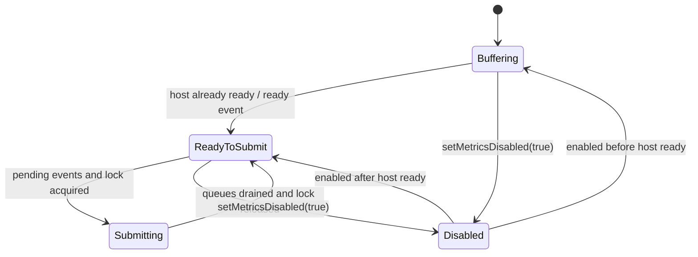

# Metrics — SPEC

> Start here → root [`AGENTS.md`](../../../AGENTS.md) · router [`SPEC_INDEX.md`](../../../ai-docs/SPEC_INDEX.md) · system [`ARCHITECTURE.md`](../../../ai-docs/ARCHITECTURE.md). This is the module's canonical specification.

## Metadata

| Field | Value |
|---|---|
| Module id | `metrics` |
| Source path(s) | `src/metrics` |
| Doc kind | Module spec |
| Coverage score | Partial (manifest-authoritative); 15/15 required document fields present |
| Generated from | `module-spec` @ SDLC template library `0.2.1` |
| generated_by / approved_by / updated_at | Codex generator / developer-approved follow-up review remediation / 2026-07-21 |
| Validation status | Follow-up validation passed (independent Claude fallback, 2026-07-21); coverage remains Partial |

## Evidence Rules
Every requirement cites stable source and test file paths. Code/tests are the behavioral referee; routed source text supplies explicit intent and rationale. Missing or contradictory evidence blocks promotion.

## Source Material Register
| Source material | Scope | Decision | Detail location or disposition |
|---|---|---|---|
| Reviewed prior module guides and architecture material | overview / architecture / API / tests | used and code-checked | Content is placed by meaning throughout this specification; exact routing remains in the manifest. |

## Overview
Metrics is one of nine confirmed Contact Center SDK modules. Own timing, taxonomy, queuing, payload preparation, and submission for Contact Center behavioral, operational, and business telemetry. Existing reviewed documentation is migrated by meaning and code/tests remain the behavioral referee.

- **Singleton Pattern**: Single `MetricsManager` instance shared across the entire SDK

- **Three Metric Types**: Behavioral (user actions), operational (system events), business (business-level analytics)

- **Event Timing**: `timeEvent` + `trackEvent` pattern automatically calculates `duration_ms`

- **Queued Submission**: Events are queued until the Webex SDK is ready, then submitted in order

- **Behavioral Taxonomy**: Structured `product.agent.target.verb` naming convention for behavioral events

- **Payload Preparation**: Automatic cleanup of empty fields, space-to-underscore conversion, and `tabHidden` metadata

- **AQM Response Helpers**: Static methods to extract common tracking fields from AQM responses

## Purpose / Responsibility
Own timing, taxonomy, queuing, payload preparation, and submission for Contact Center behavioral, operational, and business telemetry.

## Stack
TypeScript 5.4 singleton service, Webex internal metrics APIs, LoggerProxy, Jest 27.

## Folder / Package Structure
```text
src/metrics/
├── MetricsManager.ts
├── behavioral-events.ts
├── constants.ts
```

```text
src/metrics/
├── MetricsManager.ts       # Singleton metrics manager
├── behavioral-events.ts    # Behavioral event taxonomy mapping
├── constants.ts            # METRIC_EVENT_NAMES constants
└── ai-docs/
    ├── AGENTS.md           # Usage documentation (see PR #4762)
    └── ARCHITECTURE.md     # Preserved legacy, noncanonical architecture guide
```

## Key Files (source of truth)
| File | Holds |
|---|---|
| `src/metrics/MetricsManager.ts` | Authoritative Metrics implementation or contract source. |
| `src/metrics/behavioral-events.ts` | Authoritative Metrics implementation or contract source. |
| `src/metrics/constants.ts` | Authoritative Metrics implementation or contract source. |

## Public Surface
| Contract ID | Type | Surface | Purpose | Compatibility / deprecation | Schema / detail link | Root index |
|---|---|---|---|---|---|---|
| `metrics.surface` | SDK / event / internal API | Internal `MetricsManager` singleton, metric event constants, taxonomy lookup, timing, and tracking helpers. | Stable module consumption boundary. | Additive changes by default; breaking package exports require a major-version transition. | `src/metrics/MetricsManager.ts` | `../../../ai-docs/CONTRACTS.md` |

Compatibility notes:
- Do not remove or reinterpret exported symbols/events without a documented consumer migration.

Returns the singleton instance. On first call with `{webex}`, binds to the Webex SDK and begins listening for the `ready` event.

**Parameters**:

- `options` (object, optional): `{webex: WebexSDK}` - The Webex SDK instance

**Returns**: `MetricsManager`

**Example**:

```typescript
// During initialization (called internally by cc.register())
const metrics = MetricsManager.getInstance({webex});

// Subsequent calls (no webex needed)
const metrics = MetricsManager.getInstance();
```

Starts a timer for one or more event keys. When a matching `trackEvent` / `trackBehavioralEvent` / `trackOperationalEvent` / `trackBusinessEvent` is called, `duration_ms` is automatically added to the payload.

**Parameters**:

- `keys` (string | string[]): One or more `METRIC_EVENT_NAMES` values. The first key is the tracking key; all keys in the array will resolve the same timer.

**Returns**: `void`

**Example**:

```typescript
// Single key
metrics.timeEvent(METRIC_EVENT_NAMES.STATION_LOGIN_SUCCESS);

// Multiple keys (success/failure share one timer)
metrics.timeEvent([
  METRIC_EVENT_NAMES.STATION_LOGIN_SUCCESS,
  METRIC_EVENT_NAMES.STATION_LOGIN_FAILED,
]);
```

Tracks an event across one or more metric services.

**Parameters**:

- `name` (METRIC_EVENT_NAMES): The event name constant

- `payload` (EventPayload, optional): Key-value pairs of event data

- `metricServices` (MetricsType[], optional): Array of `'behavioral'` | `'operational'` | `'business'` (default: `['behavioral']`)

**Returns**: `void`

**Example**:

```typescript
// Behavioral only (default)
metrics.trackEvent(METRIC_EVENT_NAMES.STATION_LOGIN_SUCCESS, {agentId: '123'});

// Multiple services
metrics.trackEvent(
  METRIC_EVENT_NAMES.TASK_ACCEPT_SUCCESS,
  {interactionId: 'abc'},
  ['behavioral', 'operational']
);
```

Tracks a single behavioral event. Looks up the event taxonomy from `behavioral-events.ts` and submits via `webex.internal.newMetrics.submitBehavioralEvent`.

**Parameters**:

- `name` (METRIC_EVENT_NAMES): The event name

- `options` (EventPayload, optional): Additional payload data

**Returns**: `void`

Tracks a single operational event. Prefixes the event name with `WXCC_SDK_` and submits via `webex.internal.newMetrics.submitOperationalEvent`.

**Parameters**:

- `name` (METRIC_EVENT_NAMES): The event name

- `options` (EventPayload, optional): Additional payload data

**Returns**: `void`

Tracks a single business event. Prefixes the event name with `WXCC_SDK_` and submits via `webex.internal.newMetrics.submitBusinessEvent` with `appType: 'wxcc_sdk'`.

**Parameters**:

- `name` (METRIC_EVENT_NAMES): The event name

- `options` (EventPayload, optional): Additional payload data

**Returns**: `void`

Enables or disables metrics collection. When disabled, all pending events are cleared and new events are dropped.

**Parameters**:

- `disabled` (boolean): `true` to disable, `false` to enable

**Returns**: `void`

Static helper that extracts common tracking fields from an AQM success response.

**Parameters**:

- `response` (any): The AQM response object

**Returns**: `Record<string, any>` with fields: `agentId`, `agentSessionId`, `teamId`, `siteId`, `orgId`, `eventType`, `trackingId`, `notifTrackingId`

**Example**:

```typescript
const fields = MetricsManager.getCommonTrackingFieldForAQMResponse(aqmResponse);
metrics.trackEvent(METRIC_EVENT_NAMES.TASK_ACCEPT_SUCCESS, {
  ...fields,
  interactionId: task.interactionId,
});
```

Resets the singleton instance. Used for testing only.

**Returns**: `void`

All event names are defined in `METRIC_EVENT_NAMES` (`constants.ts`). Events follow a `<Category> <Action> <Result>` pattern.

| Constant | Value | Description |
|---|---|---|
| `STATION_LOGIN_SUCCESS` | `'Station Login Success'` | Agent station login succeeded |
| `STATION_LOGIN_FAILED` | `'Station Login Failed'` | Agent station login failed |
| `STATION_LOGOUT_SUCCESS` | `'Station Logout Success'` | Agent station logout succeeded |
| `STATION_LOGOUT_FAILED` | `'Station Logout Failed'` | Agent station logout failed |
| `STATION_RELOGIN_SUCCESS` | `'Station Relogin Success'` | Silent relogin succeeded |
| `STATION_RELOGIN_FAILED` | `'Station Relogin Failed'` | Silent relogin failed |
| `AGENT_STATE_CHANGE_SUCCESS` | `'Agent State Change Success'` | State change succeeded |
| `AGENT_STATE_CHANGE_FAILED` | `'Agent State Change Failed'` | State change failed |
| `FETCH_BUDDY_AGENTS_SUCCESS` | `'Fetch Buddy Agents Success'` | Buddy agents fetch succeeded |
| `FETCH_BUDDY_AGENTS_FAILED` | `'Fetch Buddy Agents Failed'` | Buddy agents fetch failed |
| `AGENT_RONA` | `'Agent RONA'` | Agent Ring-On-No-Answer triggered |
| `AGENT_CONTACT_ASSIGN_FAILED` | `'Agent Contact Assign Failed'` | Contact assignment failed |
| `AGENT_INVITE_FAILED` | `'Agent Invite Failed'` | Agent invite failed |
| `AGENT_DEVICE_TYPE_UPDATE_SUCCESS` | `'Agent Device Type Update Success'` | Device type update succeeded |
| `AGENT_DEVICE_TYPE_UPDATE_FAILED` | `'Agent Device Type Update Failed'` | Device type update failed |
| `TASK_ACCEPT_SUCCESS` / `FAILED` | `'Task Accept ...'` | Task accept result |
| `TASK_DECLINE_SUCCESS` / `FAILED` | `'Task Decline ...'` | Task decline result |
| `TASK_END_SUCCESS` / `FAILED` | `'Task End ...'` | Task end result |
| `TASK_WRAPUP_SUCCESS` / `FAILED` | `'Task Wrapup ...'` | Task wrapup result |
| `TASK_HOLD_SUCCESS` / `FAILED` | `'Task Hold ...'` | Task hold result |
| `TASK_RESUME_SUCCESS` / `FAILED` | `'Task Resume ...'` | Task resume result |
| `TASK_CONSULT_START_SUCCESS` / `FAILED` | `'Task Consult Start ...'` | Consult start result |
| `TASK_CONSULT_END_SUCCESS` / `FAILED` | `'Task Consult End ...'` | Consult end result |
| `TASK_TRANSFER_SUCCESS` / `FAILED` | `'Task Transfer ...'` | Transfer result |
| `TASK_PAUSE_RECORDING_SUCCESS` / `FAILED` | `'Task Pause Recording ...'` | Pause recording result |
| `TASK_RESUME_RECORDING_SUCCESS` / `FAILED` | `'Task Resume Recording ...'` | Resume recording result |
| `TASK_ACCEPT_CONSULT_SUCCESS` / `FAILED` | `'Task Accept Consult ...'` | Accept consult result |
| `TASK_AUTO_ANSWER_SUCCESS` / `FAILED` | `'Task Auto Answer ...'` | Auto-answer result |
| `TASK_OUTDIAL_SUCCESS` / `FAILED` | `'Task Outdial ...'` | Outdial result |
| `TASK_CONFERENCE_START_SUCCESS` / `FAILED` | `'Task Conference Start ...'` | Conference start result |
| `TASK_CONFERENCE_END_SUCCESS` / `FAILED` | `'Task Conference End ...'` | Conference end result |
| `TASK_CONFERENCE_TRANSFER_SUCCESS` / `FAILED` | `'Task Conference Transfer ...'` | Conference transfer result |
| `TASK_CONFERENCE_EXIT_SUCCESS` / `FAILED` | `'Task Conference Exit ...'` | Conference exit result |
| `TASK_SWITCH_CALL_SUCCESS` / `FAILED` | `'Task Switch Call ...'` | Switch call result |
| `WEBSOCKET_REGISTER_SUCCESS` / `FAILED` | `'Websocket Register ...'` | WebSocket registration result |
| `WEBSOCKET_DEREGISTER_SUCCESS` / `FAIL` | `'Websocket Deregister ...'` | WebSocket deregistration result |
| `WEBSOCKET_EVENT_RECEIVED` | `'Websocket Event Received'` | WebSocket event received |
| `UPLOAD_LOGS_SUCCESS` / `FAILED` | `'Upload Logs ...'` | Log upload result |
| `ENTRYPOINT_FETCH_SUCCESS` / `FAILED` | `'Entrypoint Fetch ...'` | Entry point fetch result |
| `ADDRESSBOOK_FETCH_SUCCESS` / `FAILED` | `'AddressBook Fetch ...'` | Address book fetch result |
| `QUEUE_FETCH_SUCCESS` / `FAILED` | `'Queue Fetch ...'` | Queue fetch result |
| `OUTDIAL_ANI_EP_FETCH_SUCCESS` / `FAILED` | `'Outdial ANI Entries Fetch ...'` | Outdial ANI entries fetch result |

All event names are defined in `constants.ts` as `METRIC_EVENT_NAMES`. Events follow a `{Domain} {Action} {Success|Failed}` naming convention:

| Category               | Success Event                          | Failure Event                          |
|---|---|---|
| Station Login          | `STATION_LOGIN_SUCCESS`                | `STATION_LOGIN_FAILED`                 |
| Station Logout         | `STATION_LOGOUT_SUCCESS`               | `STATION_LOGOUT_FAILED`                |
| Station Relogin        | `STATION_RELOGIN_SUCCESS`              | `STATION_RELOGIN_FAILED`               |
| State Change           | `AGENT_STATE_CHANGE_SUCCESS`           | `AGENT_STATE_CHANGE_FAILED`            |
| Buddy Agents           | `FETCH_BUDDY_AGENTS_SUCCESS`           | `FETCH_BUDDY_AGENTS_FAILED`            |
| WebSocket Register     | `WEBSOCKET_REGISTER_SUCCESS`           | `WEBSOCKET_REGISTER_FAILED`            |
| Task Accept            | `TASK_ACCEPT_SUCCESS`                  | `TASK_ACCEPT_FAILED`                   |
| Task Decline           | `TASK_DECLINE_SUCCESS`                 | `TASK_DECLINE_FAILED`                  |
| Task End               | `TASK_END_SUCCESS`                     | `TASK_END_FAILED`                      |
| Task Wrapup            | `TASK_WRAPUP_SUCCESS`                  | `TASK_WRAPUP_FAILED`                   |
| Task Hold              | `TASK_HOLD_SUCCESS`                    | `TASK_HOLD_FAILED`                     |
| Task Resume            | `TASK_RESUME_SUCCESS`                  | `TASK_RESUME_FAILED`                   |
| Task Consult Start     | `TASK_CONSULT_START_SUCCESS`           | `TASK_CONSULT_START_FAILED`            |
| Task Consult End       | `TASK_CONSULT_END_SUCCESS`             | `TASK_CONSULT_END_FAILED`              |
| Task Transfer          | `TASK_TRANSFER_SUCCESS`                | `TASK_TRANSFER_FAILED`                 |
| Task Resume Recording  | `TASK_RESUME_RECORDING_SUCCESS`        | `TASK_RESUME_RECORDING_FAILED`         |
| Task Pause Recording   | `TASK_PAUSE_RECORDING_SUCCESS`         | `TASK_PAUSE_RECORDING_FAILED`          |
| Task Accept Consult    | `TASK_ACCEPT_CONSULT_SUCCESS`          | `TASK_ACCEPT_CONSULT_FAILED`           |
| Task Auto Answer       | `TASK_AUTO_ANSWER_SUCCESS`             | `TASK_AUTO_ANSWER_FAILED`              |
| Conference Start       | `TASK_CONFERENCE_START_SUCCESS`        | `TASK_CONFERENCE_START_FAILED`         |
| Conference End         | `TASK_CONFERENCE_END_SUCCESS`          | `TASK_CONFERENCE_END_FAILED`           |
| Conference Transfer    | `TASK_CONFERENCE_TRANSFER_SUCCESS`     | `TASK_CONFERENCE_TRANSFER_FAILED`      |
| Conference Exit        | `TASK_CONFERENCE_EXIT_SUCCESS`         | `TASK_CONFERENCE_EXIT_FAILED`          |
| Switch Call            | `TASK_SWITCH_CALL_SUCCESS`             | `TASK_SWITCH_CALL_FAILED`              |
| Outdial                | `TASK_OUTDIAL_SUCCESS`                 | `TASK_OUTDIAL_FAILED`                  |
| Upload Logs            | `UPLOAD_LOGS_SUCCESS`                  | `UPLOAD_LOGS_FAILED`                   |
| WebSocket Deregister   | `WEBSOCKET_DEREGISTER_SUCCESS`         | `WEBSOCKET_DEREGISTER_FAIL`            |
| Device Type Update     | `AGENT_DEVICE_TYPE_UPDATE_SUCCESS`     | `AGENT_DEVICE_TYPE_UPDATE_FAILED`      |
| EntryPoint             | `ENTRYPOINT_FETCH_SUCCESS`             | `ENTRYPOINT_FETCH_FAILED`              |
| AddressBook            | `ADDRESSBOOK_FETCH_SUCCESS`            | `ADDRESSBOOK_FETCH_FAILED`             |
| Queue                  | `QUEUE_FETCH_SUCCESS`                  | `QUEUE_FETCH_FAILED`                   |
| Outdial ANI Entries    | `OUTDIAL_ANI_EP_FETCH_SUCCESS`         | `OUTDIAL_ANI_EP_FETCH_FAILED`          |

Special events (no success/failure pair):

- `AGENT_RONA` — has behavioral taxonomy (`service.agent_rona.set`)

- `AGENT_CONTACT_ASSIGN_FAILED` — has behavioral taxonomy (`service.agent_contact_assign.fail`)

- `AGENT_INVITE_FAILED` — has behavioral taxonomy (`service.agent_invite.fail`)

- `WEBSOCKET_EVENT_RECEIVED` — **no** behavioral taxonomy (not in `eventTaxonomyMap`)

Of the 80 defined metric names, 71 have behavioral taxonomy and 9 do not. Events **without** an `eventTaxonomyMap` entry are the six `AI_ASSISTANT_*` names plus `WEBSOCKET_DEREGISTER_SUCCESS`, `WEBSOCKET_DEREGISTER_FAIL`, and `WEBSOCKET_EVENT_RECEIVED`.

### Complete METRIC_EVENT_NAMES catalog

This table contains all 80 names from `src/metrics/constants.ts`; taxonomy presence is checked against `src/metrics/behavioral-events.ts`: 71 mapped and 9 unmapped.

| Constant | Emitted name | Behavioral taxonomy? |
|---|---|---|
| `STATION_LOGIN_SUCCESS` | `Station Login Success` | yes |
| `STATION_LOGIN_FAILED` | `Station Login Failed` | yes |
| `STATION_LOGOUT_SUCCESS` | `Station Logout Success` | yes |
| `STATION_LOGOUT_FAILED` | `Station Logout Failed` | yes |
| `STATION_RELOGIN_SUCCESS` | `Station Relogin Success` | yes |
| `STATION_RELOGIN_FAILED` | `Station Relogin Failed` | yes |
| `AGENT_STATE_CHANGE_SUCCESS` | `Agent State Change Success` | yes |
| `AGENT_STATE_CHANGE_FAILED` | `Agent State Change Failed` | yes |
| `FETCH_BUDDY_AGENTS_SUCCESS` | `Fetch Buddy Agents Success` | yes |
| `FETCH_BUDDY_AGENTS_FAILED` | `Fetch Buddy Agents Failed` | yes |
| `WEBSOCKET_REGISTER_SUCCESS` | `Websocket Register Success` | yes |
| `WEBSOCKET_REGISTER_FAILED` | `Websocket Register Failed` | yes |
| `AGENT_RONA` | `Agent RONA` | yes |
| `AGENT_CONTACT_ASSIGN_FAILED` | `Agent Contact Assign Failed` | yes |
| `AGENT_INVITE_FAILED` | `Agent Invite Failed` | yes |
| `TASK_ACCEPT_SUCCESS` | `Task Accept Success` | yes |
| `TASK_ACCEPT_FAILED` | `Task Accept Failed` | yes |
| `TASK_DECLINE_SUCCESS` | `Task Decline Success` | yes |
| `TASK_DECLINE_FAILED` | `Task Decline Failed` | yes |
| `TASK_END_SUCCESS` | `Task End Success` | yes |
| `TASK_END_FAILED` | `Task End Failed` | yes |
| `TASK_WRAPUP_SUCCESS` | `Task Wrapup Success` | yes |
| `TASK_WRAPUP_FAILED` | `Task Wrapup Failed` | yes |
| `TASK_HOLD_SUCCESS` | `Task Hold Success` | yes |
| `TASK_HOLD_FAILED` | `Task Hold Failed` | yes |
| `TASK_RESUME_SUCCESS` | `Task Resume Success` | yes |
| `TASK_RESUME_FAILED` | `Task Resume Failed` | yes |
| `TASK_CONSULT_START_SUCCESS` | `Task Consult Start Success` | yes |
| `TASK_CONSULT_START_FAILED` | `Task Consult Start Failed` | yes |
| `TASK_CONSULT_END_SUCCESS` | `Task Consult End Success` | yes |
| `TASK_CONSULT_END_FAILED` | `Task Consult End Failed` | yes |
| `TASK_TRANSFER_SUCCESS` | `Task Transfer Success` | yes |
| `TASK_TRANSFER_FAILED` | `Task Transfer Failed` | yes |
| `TASK_RESUME_RECORDING_SUCCESS` | `Task Resume Recording Success` | yes |
| `TASK_RESUME_RECORDING_FAILED` | `Task Resume Recording Failed` | yes |
| `TASK_PAUSE_RECORDING_SUCCESS` | `Task Pause Recording Success` | yes |
| `TASK_PAUSE_RECORDING_FAILED` | `Task Pause Recording Failed` | yes |
| `TASK_ACCEPT_CONSULT_SUCCESS` | `Task Accept Consult Success` | yes |
| `TASK_ACCEPT_CONSULT_FAILED` | `Task Accept Consult Failed` | yes |
| `TASK_AUTO_ANSWER_SUCCESS` | `Task Auto Answer Success` | yes |
| `TASK_AUTO_ANSWER_FAILED` | `Task Auto Answer Failed` | yes |
| `TASK_CONFERENCE_START_SUCCESS` | `Task Conference Start Success` | yes |
| `TASK_CONFERENCE_START_FAILED` | `Task Conference Start Failed` | yes |
| `TASK_CONFERENCE_END_SUCCESS` | `Task Conference End Success` | yes |
| `TASK_CONFERENCE_END_FAILED` | `Task Conference End Failed` | yes |
| `TASK_CONFERENCE_TRANSFER_SUCCESS` | `Task Conference Transfer Success` | yes |
| `TASK_CONFERENCE_TRANSFER_FAILED` | `Task Conference Transfer Failed` | yes |
| `TASK_CONFERENCE_EXIT_SUCCESS` | `Task Conference Exit Success` | yes |
| `TASK_CONFERENCE_EXIT_FAILED` | `Task Conference Exit Failed` | yes |
| `TASK_SWITCH_CALL_SUCCESS` | `Task Switch Call Success` | yes |
| `TASK_SWITCH_CALL_FAILED` | `Task Switch Call Failed` | yes |
| `TASK_OUTDIAL_SUCCESS` | `Task Outdial Success` | yes |
| `TASK_OUTDIAL_FAILED` | `Task Outdial Failed` | yes |
| `UPLOAD_LOGS_SUCCESS` | `Upload Logs Success` | yes |
| `UPLOAD_LOGS_FAILED` | `Upload Logs Failed` | yes |
| `WEBSOCKET_DEREGISTER_SUCCESS` | `Websocket Deregister Success` | no |
| `WEBSOCKET_DEREGISTER_FAIL` | `Websocket Deregister Failed` | no |
| `AGENT_DEVICE_TYPE_UPDATE_SUCCESS` | `Agent Device Type Update Success` | yes |
| `AGENT_DEVICE_TYPE_UPDATE_FAILED` | `Agent Device Type Update Failed` | yes |
| `WEBSOCKET_EVENT_RECEIVED` | `Websocket Event Received` | no |
| `ENTRYPOINT_FETCH_SUCCESS` | `Entrypoint Fetch Success` | yes |
| `ENTRYPOINT_FETCH_FAILED` | `Entrypoint Fetch Failed` | yes |
| `ADDRESSBOOK_FETCH_SUCCESS` | `AddressBook Fetch Success` | yes |
| `ADDRESSBOOK_FETCH_FAILED` | `AddressBook Fetch Failed` | yes |
| `QUEUE_FETCH_SUCCESS` | `Queue Fetch Success` | yes |
| `QUEUE_FETCH_FAILED` | `Queue Fetch Failed` | yes |
| `OUTDIAL_ANI_EP_FETCH_SUCCESS` | `Outdial ANI Entries Fetch Success` | yes |
| `OUTDIAL_ANI_EP_FETCH_FAILED` | `Outdial ANI Entries Fetch Failed` | yes |
| `CAMPAIGN_PREVIEW_ACCEPT_SUCCESS` | `Campaign Preview Accept Success` | yes |
| `CAMPAIGN_PREVIEW_ACCEPT_FAILED` | `Campaign Preview Accept Failed` | yes |
| `CAMPAIGN_PREVIEW_SKIP_SUCCESS` | `Campaign Preview Skip Success` | yes |
| `CAMPAIGN_PREVIEW_SKIP_FAILED` | `Campaign Preview Skip Failed` | yes |
| `CAMPAIGN_PREVIEW_REMOVE_SUCCESS` | `Campaign Preview Remove Success` | yes |
| `CAMPAIGN_PREVIEW_REMOVE_FAILED` | `Campaign Preview Remove Failed` | yes |
| `AI_ASSISTANT_SEND_EVENT_SUCCESS` | `AI Assistant Send Event Success` | no |
| `AI_ASSISTANT_SEND_EVENT_FAILED` | `AI Assistant Send Event Failed` | no |
| `AI_ASSISTANT_GET_SUGGESTED_RESPONSE_SUCCESS` | `AI Assistant Get Suggested Response Success` | no |
| `AI_ASSISTANT_GET_SUGGESTED_RESPONSE_FAILED` | `AI Assistant Get Suggested Response Failed` | no |
| `AI_ASSISTANT_FETCH_HISTORIC_TRANSCRIPTS_SUCCESS` | `AI Assistant Fetch Historic Transcripts Success` | no |
| `AI_ASSISTANT_FETCH_HISTORIC_TRANSCRIPTS_FAILED` | `AI Assistant Fetch Historic Transcripts Failed` | no |

Defined names without an `eventTaxonomyMap` entry: `AI_ASSISTANT_FETCH_HISTORIC_TRANSCRIPTS_FAILED`, `AI_ASSISTANT_FETCH_HISTORIC_TRANSCRIPTS_SUCCESS`, `AI_ASSISTANT_GET_SUGGESTED_RESPONSE_FAILED`, `AI_ASSISTANT_GET_SUGGESTED_RESPONSE_SUCCESS`, `AI_ASSISTANT_SEND_EVENT_FAILED`, `AI_ASSISTANT_SEND_EVENT_SUCCESS`, `WEBSOCKET_DEREGISTER_FAIL`, `WEBSOCKET_DEREGISTER_SUCCESS`, `WEBSOCKET_EVENT_RECEIVED`.

## Requires (dependencies)
- `webex.internal.newMetrics` submission APIs
- Webex ready lifecycle
- LoggerProxy and browser visibility metadata

- **`@webex/internal-plugin-metrics`**: Provides `webex.internal.newMetrics` for actual metric submission (`submitBehavioralEvent`, `submitOperationalEvent`, `submitBusinessEvent`)

- **`LoggerProxy`**: Used for error logging within the metrics module

- **`Failure` type** (from `services/core/GlobalTypes`): Used in `getCommonTrackingFieldForAQMResponseFailed`

- **`PRODUCT_NAME`** (from `constants.ts`): Set to `'wxcc_sdk'`, used as the product identifier in behavioral taxonomy and as prefix for operational/business event names

## Requirements
| ID | WHAT | WHY | Source Evidence | Test / Example Evidence | Assumptions / Gaps | Confidence |
|---|---|---|---|---|---|---|
| METRICS-R-001 | Track only names defined by METRIC_EVENT_NAMES and keep the canonical catalog synchronized with the const object. | Telemetry queries and dashboards depend on exact stable event names. | `src/metrics/constants.ts` | `test/unit/spec/metrics/MetricsManager.ts` | None; source and test evidence rechecked during the 2026-07-09 remediation; independent document revalidation pending. | PRESENT |
| METRICS-R-002 | Map behavioral events through eventTaxonomyMap and explicitly identify defined names without taxonomy. | Undefined taxonomy must not be mistaken for an emitted or classified behavioral event. | `src/metrics/behavioral-events.ts` | `test/unit/spec/metrics/behavioral-events.ts` | None; source and test evidence rechecked during the 2026-07-09 remediation; independent document revalidation pending. | PRESENT |
| METRICS-R-003 | When metrics are disabled, clear pending events and make `timeEvent` plus all tracking methods return without recording/submitting. | Telemetry must never block or alter product behavior and disablement must be comprehensive. | `src/metrics/MetricsManager.ts` | `test/unit/spec/metrics/MetricsManager.ts` | None; source and test evidence rechecked during the 2026-07-09 remediation; independent document revalidation pending. | PRESENT |
| METRICS-R-004 | Queue submissions until the host SDK is ready and flush through the correct behavioral/operational/business service. | Early lifecycle telemetry must not be lost solely because the host is not ready. | `src/metrics/MetricsManager.ts` | `test/unit/spec/metrics/MetricsManager.ts` | None; source and test evidence rechecked during the 2026-07-09 remediation; independent document revalidation pending. | PRESENT |
| METRICS-R-005 | Submit through the host SDK's `webex.internal.newMetrics` client without storing credentials or implementing authorization policy in MetricsManager. | Host-owned authentication keeps telemetry credential handling outside the Contact Center metrics module. | `src/metrics/MetricsManager.ts` | `test/unit/spec/metrics/MetricsManager.ts` | None; authentication is inherited and credential ownership is explicitly N/A. | PRESENT |

## Design Overview
Metrics separates its stable consumption boundary from collaborators so ownership and failure behavior stay explicit. Telemetry is deliberately non-blocking and queue-backed so product behavior never waits for metrics; failures are logged rather than propagated.

> **Purpose**: Track behavioral, operational, and business metrics for Contact Center SDK operations using a singleton `MetricsManager`. Provides event timing, payload preparation, batching, and submission to the Webex metrics backend.

Each behavioral event maps to a structured taxonomy in `behavioral-events.ts`:

```text
{product}.{agent}.{target}.{verb}
```

- **product**: Always `'wxcc_sdk'` (from `PRODUCT_NAME`)

- **agent**: `'user'` for user-initiated actions, `'service'` for system-generated events

- **target**: Snake_case description of the action (e.g., `'station_login'`, `'task_accept'`)

- **verb**: `'complete'` for success, `'fail'` for failure, `'set'` for RONA events

**Example**: `STATION_LOGIN_SUCCESS` maps to `wxcc_sdk.user.station_login.complete`

> **Note**: The following events do **not** have behavioral taxonomy mappings in `behavioral-events.ts`:
> - `AI_ASSISTANT_SEND_EVENT_SUCCESS`
> - `AI_ASSISTANT_SEND_EVENT_FAILED`
> - `AI_ASSISTANT_GET_SUGGESTED_RESPONSE_SUCCESS`
> - `AI_ASSISTANT_GET_SUGGESTED_RESPONSE_FAILED`
> - `AI_ASSISTANT_FETCH_HISTORIC_TRANSCRIPTS_SUCCESS`
> - `AI_ASSISTANT_FETCH_HISTORIC_TRANSCRIPTS_FAILED`
> - `WEBSOCKET_DEREGISTER_SUCCESS`
> - `WEBSOCKET_DEREGISTER_FAIL`
> - `WEBSOCKET_EVENT_RECEIVED`
>
> Calling `trackBehavioralEvent` with these event names will push an event with an `undefined` taxonomy.

> **Purpose**: Technical documentation for the metrics collection, batching, and submission system within the Contact Center SDK.

Each metric event name maps to a `BehavioralEventTaxonomy` with four fields:

```typescript
type BehavioralEventTaxonomy = {
  product: MetricEventProduct;  // Always PRODUCT_NAME ('wxcc_sdk')
  agent: MetricEventAgent;      // 'user' or 'service'
  target: string;               // e.g., 'station_login', 'task_accept'
  verb: MetricEventVerb;        // 'complete' for success, 'fail' for failure
};
```

The final behavioral event name is constructed as: `{product}.{agent}.{target}.{verb}`

Example: `wxcc_sdk.user.station_login.complete`

The mapping is defined in `behavioral-events.ts` via `eventTaxonomyMap` and accessed through `getEventTaxonomy(name)`.



Usage pattern from `cc.ts`:

```typescript
// Before operation
this.metricsManager.timeEvent([
  METRIC_EVENT_NAMES.STATION_LOGIN_SUCCESS,
  METRIC_EVENT_NAMES.STATION_LOGIN_FAILED,
]);

// On success
this.metricsManager.trackEvent(
  METRIC_EVENT_NAMES.STATION_LOGIN_SUCCESS,
  { ...MetricsManager.getCommonTrackingFieldForAQMResponse(resp) },
  ['behavioral', 'operational', 'business']
);

// On failure
this.metricsManager.trackEvent(
  METRIC_EVENT_NAMES.STATION_LOGIN_FAILED,
  { ...MetricsManager.getCommonTrackingFieldForAQMResponseFailed(failure) },
  ['behavioral', 'operational', 'business']
);
```

Two static helpers extract standardized fields from AQM responses for metric payloads:

Extracts: `agentId`, `agentSessionId`, `teamId`, `siteId`, `orgId`, `eventType`, `trackingId`, `notifTrackingId`

## Data Flow


## Sequence Diagram(s)
Sequence coverage:

| Operation group | Diagram | Failure / recovery coverage |
|---|---|---|
| Time and track an event | Timing and tracking | Success/failure keys share one timer; missing timing data leaves the payload untimed. |
| Queue until SDK readiness | SDK readiness | A not-ready SDK retains events; READY drains them through the configured metrics service. |
| Submit behavioral/operational/business events | Category submission | The module does not retry or requeue after handing an event to `newMetrics`. |
| Disable metrics | Disablement | Pending queues are cleared and future timing/tracking calls return immediately. |

### Timing and tracking



### SDK readiness



### Category submission



### Disablement



## Class / Component Relationships


| Component                | File                    | Responsibility                                                                 |
|---|---|---|
| `MetricsManager`         | `MetricsManager.ts`     | Singleton that manages event queuing, timing, payload preparation, and submission |
| `BehavioralEventTaxonomy`| `behavioral-events.ts`  | Maps metric event names to structured taxonomy for behavioral analytics         |
| `METRIC_EVENT_NAMES`     | `constants.ts`          | Canonical constant object of all tracked metric event names                     |

`MetricsManager` uses a private constructor with a static `getInstance` factory:

```typescript
// MetricsManager.ts
export default class MetricsManager {
  private static instance: MetricsManager;
  private constructor() {}

  public static getInstance(options?: {webex: WebexSDK}): MetricsManager {
    if (!MetricsManager.instance) {
      MetricsManager.instance = new MetricsManager();
    }
    if (!MetricsManager.instance.webex && options?.webex) {
      MetricsManager.instance.setWebex(options.webex);
    }
    return MetricsManager.instance;
  }

  public static resetInstance() {
    MetricsManager.instance = undefined;
  }
}
```

- The Webex SDK instance is set once via `setWebex()`, which listens for the `ready` event before flushing pending queues.

- `resetInstance()` sets the singleton to `undefined`, allowing a fresh instance to be created. Primarily used in tests.

## Use Cases
- **UC-1 Time and track an event:** `timeEvent` records the start against success/failure keys and `trackEvent` attaches `duration_ms` before preparing and queuing the payload. Evidence: `src/metrics/MetricsManager.ts`, `test/unit/spec/metrics/MetricsManager.ts`.
- **UC-2 Queue until SDK readiness:** events remain in the behavioral/operational/business pending queues until the host is ready, then the ready callback drains them. Evidence: `src/metrics/MetricsManager.ts`, `test/unit/spec/metrics/MetricsManager.ts`.
- **UC-3 Submit event categories:** each requested metric service uses its matching `webex.internal.newMetrics` submission method; taxonomy is applied only where `eventTaxonomyMap` contains the name. Evidence: `src/metrics/MetricsManager.ts`, `src/metrics/behavioral-events.ts`, `test/unit/spec/metrics/MetricsManager.ts`.

```typescript
import MetricsManager from '../metrics/MetricsManager';
import {METRIC_EVENT_NAMES} from '../metrics/constants';

// Get the singleton instance (webex is set during the ContactCenter READY callback)
const metrics = MetricsManager.getInstance();

// Time an operation, then track its result
metrics.timeEvent(METRIC_EVENT_NAMES.STATION_LOGIN_SUCCESS);
// ... perform the operation ...
metrics.trackEvent(METRIC_EVENT_NAMES.STATION_LOGIN_SUCCESS, {agentId: '123'});
```

The standard pattern used throughout the Contact Center SDK:

```typescript
const metrics = MetricsManager.getInstance();

// 1. Start timing before the operation
metrics.timeEvent([
  METRIC_EVENT_NAMES.STATION_LOGIN_SUCCESS,
  METRIC_EVENT_NAMES.STATION_LOGIN_FAILED,
]);

try {
  const response = await performLogin(params);

  // 2a. Track success (duration_ms auto-added)
  metrics.trackEvent(METRIC_EVENT_NAMES.STATION_LOGIN_SUCCESS, {
    ...MetricsManager.getCommonTrackingFieldForAQMResponse(response),
  });
} catch (error) {
  // 2b. Track failure (duration_ms auto-added)
  metrics.trackEvent(METRIC_EVENT_NAMES.STATION_LOGIN_FAILED, {
    ...MetricsManager.getCommonTrackingFieldForAQMResponseFailed(error),
  });
}
```

## State Model
MetricsManager holds three pending queues, running timing entries, a readiness flag, a submission lock, and an independent disabled flag. Host READY enables draining; disabling metrics prevents both timing and tracking and clears pending events through the configured disable path.

`preparePayload()` processes every event payload before submission:

1. **Removes empty/null/undefined fields** — strips keys with `undefined`, `null`, `''`, any arrays, or empty objects

2. **Converts spaces to underscores** — `spacesToUnderscore()` applied to all key names

3. **Adds common metadata** — appends `tabHidden: document.hidden` in browser environments

## Business Rules & Invariants
- `timeEvent` and every tracking method return immediately while metrics are disabled.
- Only names present in `eventTaxonomyMap` receive behavioral taxonomy; 71 of 80 names are mapped and the six AI Assistant plus three WebSocket names are intentionally catalogued as unmapped.
- `submittingEvents` prevents overlapping queue-drain executions.
- Authentication is inherited from the host Webex SDK's metrics client; MetricsManager owns no credentials, tokens, or authorization policy.

## Concurrency & Reactive Flow
- Queue insertion is synchronous. Submission is gated by host readiness and the submission lock; each metric type drains through its own host method without propagating telemetry failures to product callers.

MetricsManager maintains three independent pending event queues:

| Queue                       | Type         | Submitted Via                                      | Name Transform                                  | Extra Metadata                   |
|---|---|---|---|---|
| `pendingBehavioralEvents`   | behavioral   | `webex.internal.newMetrics.submitBehavioralEvent`   | Taxonomy-based (`{product}.{agent}.{target}.{verb}`) | None                             |
| `pendingOperationalEvents`  | operational  | `webex.internal.newMetrics.submitOperationalEvent`  | `WXCC_SDK_` prefix + uppercase (e.g. `WXCC_SDK_STATION_LOGIN_SUCCESS`) | None                             |
| `pendingBusinessEvents`     | business     | `webex.internal.newMetrics.submitBusinessEvent`     | `WXCC_SDK_` prefix + uppercase (same as operational) | `metadata: {appType: 'wxcc_sdk'}` |

## State Machine


- **readyToSubmitEvents**: Set to `true` only after `webex.once('ready')` fires. Events queue until then.

- **submittingEvents**: Lock flag to prevent concurrent `submitPendingEvents()` calls.

- **metricsDisabled**: When `true`, `timeEvent` and all `track*` methods return early, and `clearPendingEvents()` empties all queues.

## Pitfalls
- `METRIC_EVENT_NAMES` and `eventTaxonomyMap` are different inventories: nine defined names intentionally have no behavioral taxonomy.
- `setMetricsDisabled(true)` clears pending queues but does not create a delivery receipt; callers must not infer that previously submitted events were accepted.
- Submission helpers hand events to `webex.internal.newMetrics` without a module-level retry/requeue policy, so telemetry must remain non-blocking and non-authoritative.

Static helper that extracts common tracking fields from an AQM failure response.

**Parameters**:

- `failureResponse` (Failure): The AQM failure response object

**Returns**: `Record<string, any>` with fields: `agentId`, `trackingId`, `notifTrackingId`, `orgId`, `failureType`, `failureReason`, `reasonCode`

MetricsManager is designed to be non-blocking. Metric failures do not propagate to callers:

- If `webex` is not yet ready, events are queued in `pendingBehavioralEvents`, `pendingOperationalEvents`, or `pendingBusinessEvents`

- Once `webex.ready` fires, all pending events are flushed

- If metrics are disabled via `setMetricsDisabled(true)`, all track methods silently return

- Invalid metric types log an error via `LoggerProxy` but do not throw

MetricsManager does not throw errors to callers. Instead:

- Invalid metric types are logged via `LoggerProxy.error`

- Empty `timeEvent` key arrays are logged and ignored

- Disabled state (`metricsDisabled`) prevents both timing and tracking and silently drops new events

- The `submittingEvents` lock prevents race conditions during concurrent submissions

Extracts: `agentId`, `trackingId`, `notifTrackingId`, `orgId`, `failureType`, `failureReason`, `reasonCode`

**Cause**: Webex SDK not yet ready when `trackEvent` is called

**Solution**: Events are automatically queued in `pending*Events` arrays and flushed once `webex.once('ready')` fires. Verify the SDK is initializing correctly.

**Cause**: `timeEvent` was not called before `trackEvent`, or the event name does not match any key in `runningEvents`

**Solution**: Ensure `timeEvent([SUCCESS_KEY, FAILURE_KEY])` is called before the operation, and that the exact `METRIC_EVENT_NAMES` constant is used in both calls.

**Cause**: `metricsDisabled` is set to `true`

**Solution**: Check if `setMetricsDisabled(true)` was called. This clears all pending queues and causes all `track*` methods to return early.

## Module Do's / Don'ts
- DO use `METRIC_EVENT_NAMES` and the matching category submitter instead of constructing event names manually.
- DO keep timing success/failure keys together so either outcome clears the same running timer.
- DON'T add a behavioral taxonomy entry unless the backend taxonomy contract exists.
- DON'T make product behavior depend on metrics delivery.

## Key Design Trade-off
- Telemetry is deliberately non-blocking and queue-backed so product behavior never waits for metrics; failures are logged rather than propagated.

## Test-Case Strategy (module)
Use `test/unit/spec/metrics/MetricsManager.ts` for readiness queues, timing/tracking, disabled behavior, submission categories, and failures. Use `test/unit/spec/metrics/behavioral-events.ts` to reconcile every taxonomy-backed name. Mechanically compare the complete constant catalog with taxonomy keys so newly defined events cannot disappear from the spec.

| Behavior / Requirement | Existing test evidence | Gap |
|---|---|---|
| `METRICS-R-001` | `test/unit/spec/metrics/MetricsManager.ts` | Add a catalog parity assertion if constants change. |
| `METRICS-R-002` | `test/unit/spec/metrics/behavioral-events.ts` | Keep explicit coverage for all nine unmapped names. |
| `METRICS-R-003` | `test/unit/spec/metrics/MetricsManager.ts` | None. |
| `METRICS-R-004` | `test/unit/spec/metrics/MetricsManager.ts` | None. |
| `METRICS-R-005` | `test/unit/spec/metrics/MetricsManager.ts` | Authentication ownership is verified indirectly through the host metrics client. |

## Traceability
- Repo architecture: `../../../ai-docs/ARCHITECTURE.md` · Registry: `../../../ai-docs/SPEC_INDEX.md`
- Coverage state and contracts baseline: `../../../.sdd/manifest.json`

- [`MetricsManager.ts`](../MetricsManager.ts) - Singleton metrics manager implementation

- [`behavioral-events.ts`](../behavioral-events.ts) - Event taxonomy mapping

- [`constants.ts`](../constants.ts) - `METRIC_EVENT_NAMES` definitions

- [`../../constants.ts`](../../constants.ts) - `PRODUCT_NAME` constant

- [`services/core/GlobalTypes.ts`](../../services/core/GlobalTypes.ts) - `Failure` type definition

- [MetricsManager.ts](../MetricsManager.ts) — Singleton metrics manager

- [behavioral-events.ts](../behavioral-events.ts) — Event taxonomy mapping

- [constants.ts](../constants.ts) — METRIC_EVENT_NAMES definitions

- [cc.ts](../../cc.ts) — Main plugin class (primary consumer)

- [constants.ts](../../constants.ts) — PRODUCT_NAME used in event prefixing
