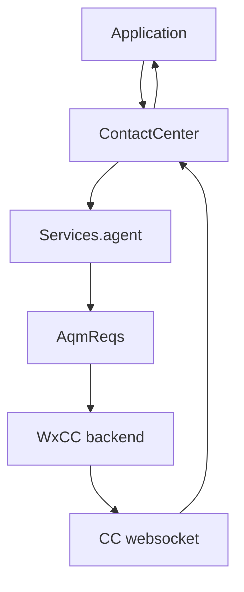
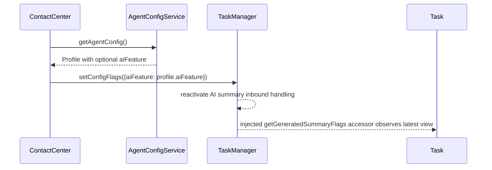
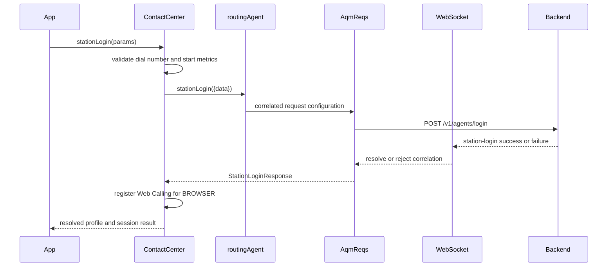

# Agent Service Architecture

> **Legacy/reference-only.** Canonical SDD: [`agent-spec.md`](agent-spec.md). Use the package [manifest](../../../../.sdd/manifest.json) and [`SPEC_INDEX.md`](../../../../ai-docs/SPEC_INDEX.md) for routing; code and tests remain the behavioral referee.

> **Purpose**: Technical documentation for agent lifecycle operations.

## Existing Agent Flow



The agent service remains the owner of station login/logout, state changes,
buddy-agent lookup, and reload. AI summary work does not introduce new agent
REST endpoints or public agent methods.

## Profile To TaskManager Flag Flow



The generated-summary leaves are independent:

- `wrapUpSummariesEnabled`
- `consultTransferSummariesEnabled`

Both are read with optional chaining and strict `=== true` checks. Missing
profile branches are disabled, not exceptional.

## Realtime Predicate

ContactCenter opens RTD for AI summary only when the profile enables at least
one summary feature through the strict leaf checks. Transcript and suggested
response predicates remain separate. A profile with both summary flags disabled
must still allow existing non-summary workflows to operate.

## Register, Reconnect, Deregister

At session boundaries, ContactCenter delegates summary cleanup to TaskManager:

- start of every `register()` attempt, including a fresh register without prior
  deregister
- before connection re-establishment profile application
- unconditional `deregister()` cleanup `finally`

Cleanup rejects pending post-call and mid-call request Promises with
`AI_SUMMARY_REQUEST_CANCELLED`, clears timers and summary state, and deactivates
inbound summary handling. Late in-flight HTTP acknowledgements are consumed and
cannot recreate state, resettle removed resolvers, emit a second final metric,
or produce an unhandled rejection.

After cleanup, a classified summary frame is a bounded `sdk-deregistered`
inbound-drop metric only. The following `setConfigFlags(...)` call reactivates a
clean lifecycle.

## Metrics And Privacy

Agent lifecycle metrics continue to use existing agent patterns. AI summary
feature forwarding and lifecycle cleanup must not log or tag summary text,
section keys or values, Adaptive Card bodies, agent names, raw payloads, or
arbitrary exception text.

## Related Files

- `packages/@webex/contact-center/src/cc.ts`
- `packages/@webex/contact-center/src/services/agent/types.ts`
- `packages/@webex/contact-center/src/services/config/types.ts`
- `packages/@webex/contact-center/src/services/task/TaskManager.ts`

## Existing Agent-Service Architecture

The AI-summary path is one branch of the established agent lifecycle architecture. The existing
ownership boundaries remain:

| Component | File | Responsibility |
| --- | --- | --- |
| `ContactCenter` | `src/cc.ts` | Public agent APIs, lifecycle, event forwarding, and metrics |
| `routingAgent` | `services/agent/index.ts` | AQM request definitions for login, logout, state, buddies, and reload |
| `Services` | `services/index.ts` | Shared service singleton and routing composition |
| `AqmReqs` | `services/core/aqm-reqs.ts` | HTTP submission correlated with WebSocket notifications |

`services/agent/index.ts` is a factory over `AqmReqs`. Each operation defines its endpoint, host,
request body, success notification binding, failure binding, and error transformer. Response promises
are completed by matching WebSocket notifications rather than by treating the initial HTTP response
as the final agent result.

### Station-login sequence



### State and event flow

`cc.setAgentState()` records the paired state-change metric, delegates to
`services.agent.stateChange`, and waits for the correlated backend notification. The public
`agent:stateChange` event can also represent updates not initiated by the current caller, so it is not
an acknowledgement for an arbitrary outstanding request.

`cc.handleWebsocketMessage()` maps backend agent events onto the public event surface. On login
success it converts `channelsMap` arrays into multimedia-profile counts:

```typescript
mmProfile = {
  chat: channelsMap.chat.length,
  email: channelsMap.email.length,
  social: channelsMap.social.length,
  telephony: channelsMap.telephony.length,
};
```

The AI-summary feature frame follows the separate RTD path documented above and joins the public
surface only after TaskManager validation.

### Silent relogin

When automatic relogin is enabled, a recovered connection invokes `services.agent.reload`, refreshes
the retained profile, restores Web Calling state, and may request Available when the previous
state-change reason was `agent-wss-disconnect`. `AGENT_NOT_FOUND` is handled as the bounded
non-recoverable relogin case; other failures propagate.

### Existing metrics and troubleshooting

Login, logout, and state-change operations retain their behavioral, business, and operational
success/failure metrics. Buddy-agent retrieval retains its operational metrics. AI-summary metrics do
not replace or rename those existing events.

- `DUPLICATE_LOCATION`: log out the competing session or use another extension.
- State-change failure: finish an active transition/task, wait for stabilization, then retry.
- Silent relogin disabled: configure `cc.allowAutomatedRelogin` before registration.

Additional implementation references are `services/agent/types.ts`, `services/core/aqm-reqs.ts`, and
`test/unit/spec/cc.ts`.
