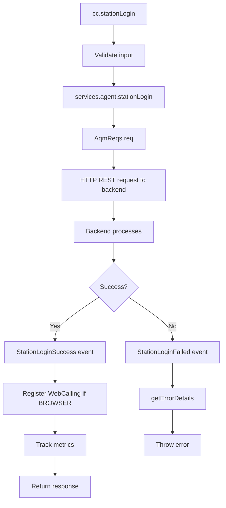
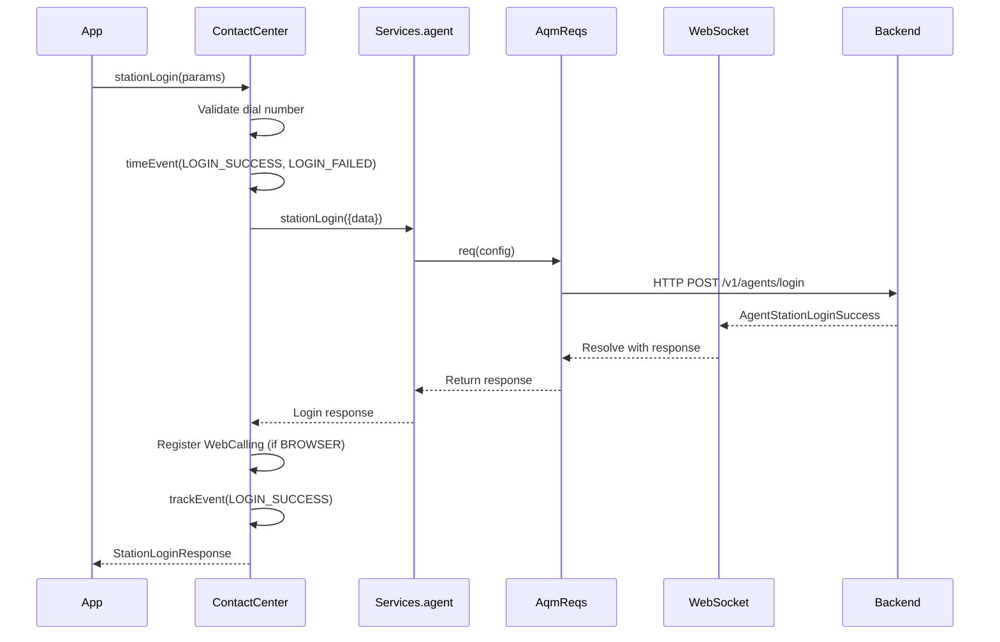
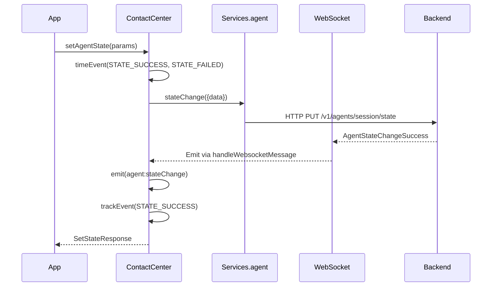
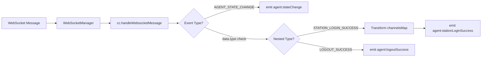
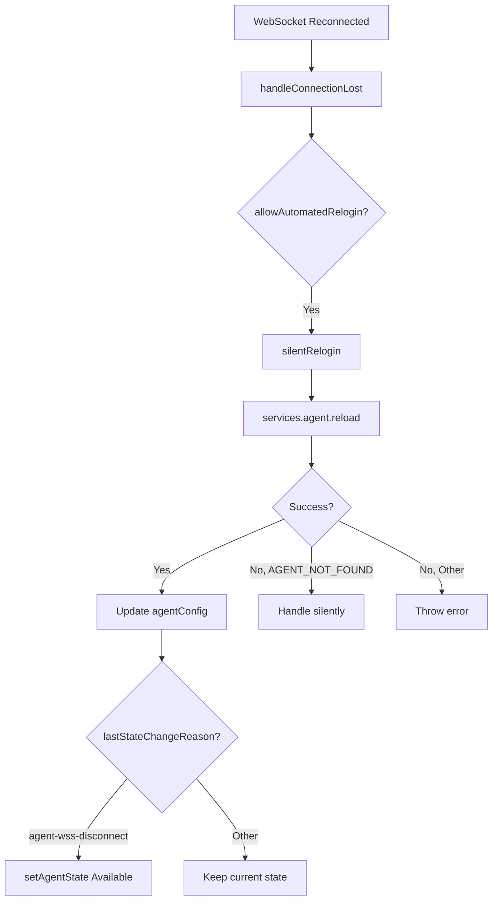

# Agent Service - Architecture

> **Purpose**: Technical documentation for agent lifecycle operations.

---

## Component Overview

| Component       | File                        | Responsibility                                                  |
| --------------- | --------------------------- | --------------------------------------------------------------- |
| `ContactCenter` | `src/cc.ts`                 | Plugin class exposing agent methods                             |
| `routingAgent`  | `services/agent/index.ts`   | AQM request definitions                                         |
| `Services`      | `services/index.ts`         | Service singleton with agent service                            |
| `AqmReqs`       | `services/core/aqm-reqs.ts` | HTTP requests to backend; responses via WebSocket notifications |

---

## File Structure

```
services/agent/
├── index.ts          # Agent service factory
├── types.ts          # Agent types and events
└── ai-docs/
    ├── AGENTS.md     # Usage documentation
    └── ARCHITECTURE.md # This file
```

---

## Service Factory Pattern

The agent service uses a factory pattern:

```typescript
// services/agent/index.ts
export default function routingAgent(routing: AqmReqs) {
  return {
    stationLogin: routing.req((p: {data: UserStationLogin}) => ({
      url: '/v1/agents/login',
      host: WCC_API_GATEWAY,
      data: p.data,
      notifSuccess: {
        bind: {type: CC_EVENTS.AGENT_STATION_LOGIN, ...},
        msg: {} as StationLoginSuccess,
      },
      notifFail: {...},
    })),
    logout: routing.req((p: {data: Logout}) => ({...})),
    stateChange: routing.req((p: {data: StateChange}) => ({...})),
    buddyAgents: routing.req((p: {data: BuddyAgents}) => ({...})),
    reload: routing.reqEmpty(() => ({...})),
  };
}
```

---

## Data Flow

### Station Login Flow



---

## Sequence Diagrams

### Station Login



### State Change



---

## Request Configuration

Each agent method defines:

```typescript
{
  url: '/v1/agents/...',      // API endpoint
  host: WCC_API_GATEWAY,      // Base URL
  data: p.data,               // Request payload
  method: HTTP_METHODS.POST,  // HTTP method (POST if data present, GET otherwise)
  err: errorHandler,          // Error transformer
  notifSuccess: {
    bind: {
      type: CC_EVENTS.SUCCESS_TYPE,
      data: {type: CC_EVENTS.SUCCESS_TYPE},
    },
    msg: {} as SuccessType,   // Response type hint
  },
  notifFail: {
    bind: {
      type: CC_EVENTS.FAIL_TYPE,
      data: {type: CC_EVENTS.FAIL_TYPE},
    },
    errId: 'Service.aqm.agent.method',
  },
}
```

---

## Event Flow

### WebSocket to Application



### ChannelsMap Transformation

The login success event transforms `channelsMap` to `mmProfile`:

```typescript
// Incoming
channelsMap: {
  chat: ['channel-1', 'channel-2'],
  email: ['channel-3'],
  telephony: ['channel-4'],
}

// Transformed
mmProfile: {
  chat: 2,      // Length of arrays
  email: 1,
  social: 0,
  telephony: 1,
}
```

---

## Silent Relogin

Automatic relogin on WebSocket reconnection:



---

## Error Handling

### Login Error Details

For `stationLogin`, special error handling extracts field-specific messages:

```typescript
// Utils.ts - getStationLoginErrorData
const errorCodeMessageMap = {
  DUPLICATE_LOCATION: {
    message: 'This extension is already in use',
    fieldName: loginOption,
  },
  INVALID_DIAL_NUMBER: {
    message: 'Enter a valid US dial number...',
    fieldName: loginOption,
  },
};
```

---

## Metrics Tracking

| Metric                       | Type                              | When Tracked             |
| ---------------------------- | --------------------------------- | ------------------------ |
| `STATION_LOGIN_SUCCESS`      | behavioral, business, operational | Login succeeds           |
| `STATION_LOGIN_FAILED`       | behavioral, business, operational | Login fails              |
| `STATION_LOGOUT_SUCCESS`     | behavioral, business, operational | Logout succeeds          |
| `STATION_LOGOUT_FAILED`      | behavioral, business, operational | Logout fails             |
| `AGENT_STATE_CHANGE_SUCCESS` | behavioral, business, operational | State change succeeds    |
| `AGENT_STATE_CHANGE_FAILED`  | behavioral, business, operational | State change fails       |
| `FETCH_BUDDY_AGENTS_SUCCESS` | operational                       | Buddy agents fetched     |
| `FETCH_BUDDY_AGENTS_FAILED`  | operational                       | Buddy agents fetch fails |

---

## Troubleshooting

### Issue: Login fails with DUPLICATE_LOCATION

**Cause**: Extension/DN already in use by another session

**Solution**:

1. Logout from other session
2. Use different extension
3. Contact admin if stuck

### Issue: State change fails

**Cause**: Agent may be in a call or transitioning state

**Solution**:
1. Complete current interaction
2. Wait for state to stabilize
3. Retry state change

### Issue: Silent relogin not working

**Cause**: `allowAutomatedRelogin` config not set

**Solution**:
```typescript
const webex = Webex.init({
  config: {
    cc: {
      allowAutomatedRelogin: true,
    },
  },
});
```

---

## Related Files

- [cc.ts](../../../cc.ts) - Main plugin
- [agent/index.ts](../index.ts) - Service implementation
- [agent/types.ts](../types.ts) - Type definitions
- [cc.ts test](../../../../test/unit/spec/cc.ts) - Test file
