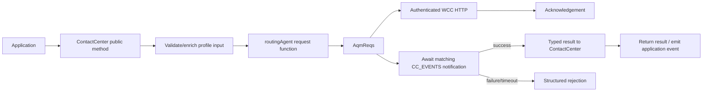
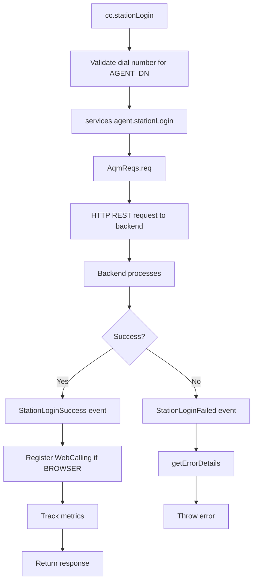
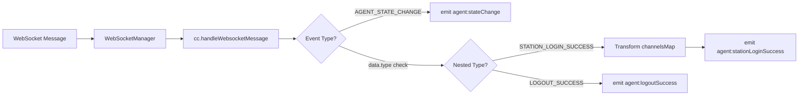
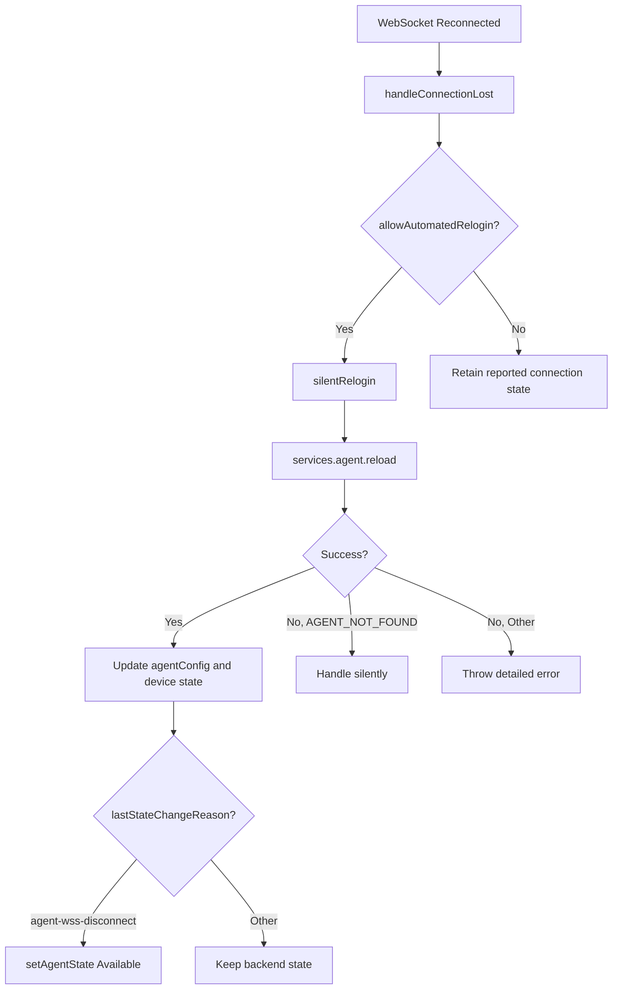
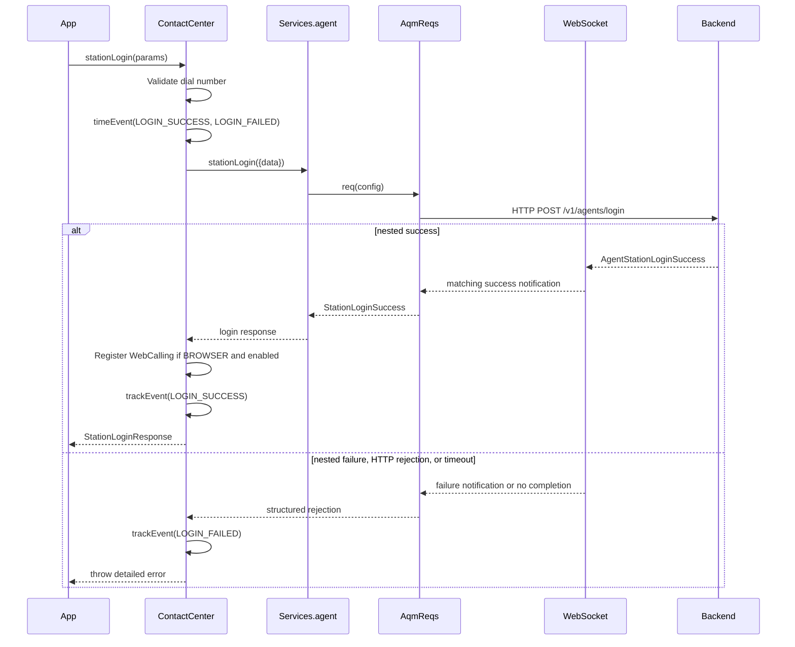
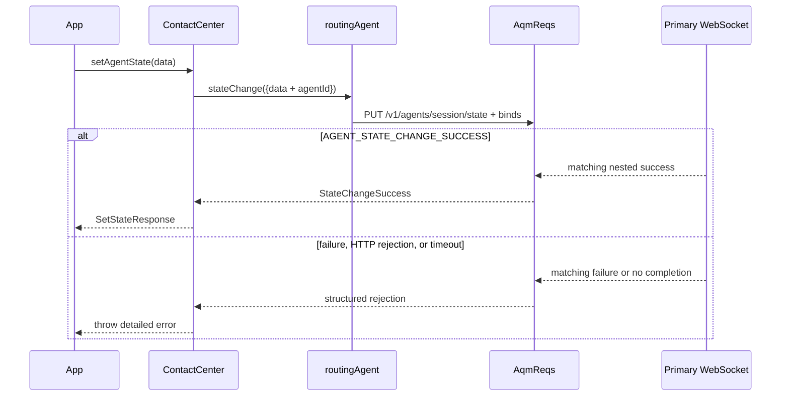
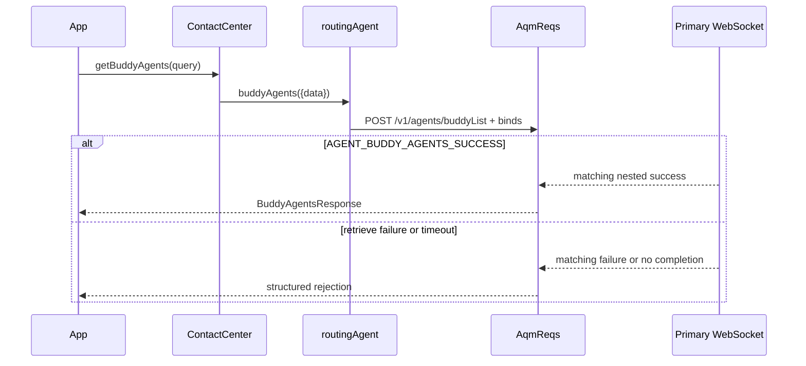
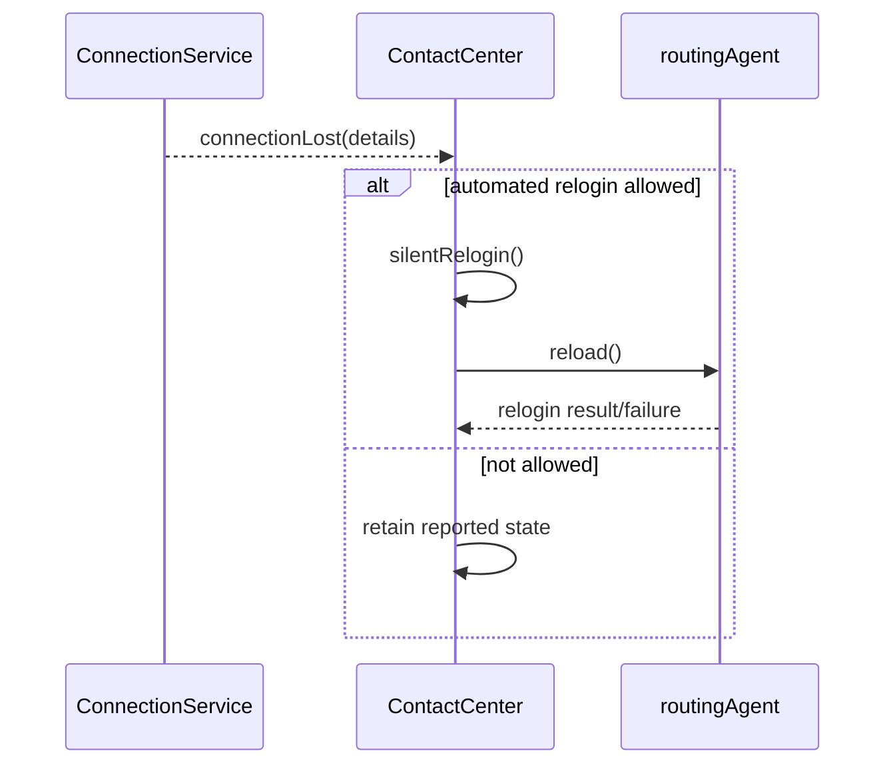
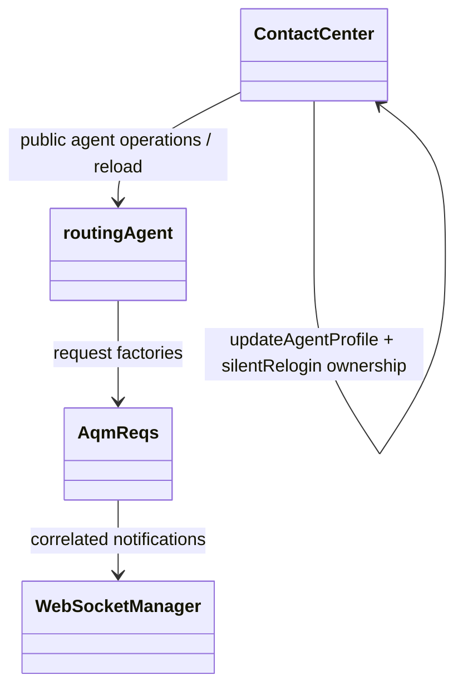

# Agent — SPEC

> Start here → root [`AGENTS.md`](../../../../AGENTS.md) · router [`SPEC_INDEX.md`](../../../../ai-docs/SPEC_INDEX.md) · system [`ARCHITECTURE.md`](../../../../ai-docs/ARCHITECTURE.md). This is the module's canonical specification.

## Metadata

| Field | Value |
|---|---|
| Module id | `agent` |
| Source path(s) | `src/services/agent` |
| Doc kind | Module spec |
| Coverage score | Partial (manifest-authoritative); 15/15 required document fields present |
| Generated from | `module-spec` @ SDLC template library `0.2.1` |
| generated_by / approved_by / updated_at | Codex generator / developer-approved review remediation / 2026-07-15 |
| Validation status | Pass with warnings for PR #5088 remediation scope (claude-code, 2026-07-15): 0 blocking; 1 important test-coverage gap; module coverage remains Partial |

## Evidence Rules
Every requirement cites stable source and test file paths. Code/tests are the behavioral referee; routed source text supplies explicit intent and rationale. Missing or contradictory evidence blocks promotion.

## Source Material Register
| Source material | Scope | Decision | Detail location or disposition |
|---|---|---|---|
| Reviewed prior module guides and architecture material | overview / architecture / API / tests | used and code-checked | Content is placed by meaning throughout this specification; exact routing remains in the manifest. |

## Overview
Agent owns the `routingAgent(AqmReqs)` request factory for station login, station logout, agent-state change, buddy-agent lookup, and agent-session reload. ContactCenter exposes the application-facing methods/events and owns profile/device updates plus recovery policy.

The factory initiates authenticated HTTP requests and supplies `CC_EVENTS` success/failure binds to AqmReqs. Public response aliases such as `StationLoginResponse`, `StationLogoutResponse`, `BuddyAgentsResponse`, and `SetStateResponse` are package-level contracts in `src/types.ts`; routing payload/notification types remain in `src/services/agent/types.ts`.

## Purpose / Responsibility
Own AQM request definitions for station login/logout, state change, buddy-agent queries, and reload. Device/profile update and automated relogin orchestration belong to ContactCenter.

## Stack
TypeScript 5.4 AQM request factory, REST initiation, WebSocket completion events, Jest 27.

## Folder / Package Structure
```text
src/services/agent/
├── index.ts
├── types.ts
```

```text
services/agent/
├── index.ts          # Agent service factory
├── types.ts          # Agent types and events
└── ai-docs/
    ├── AGENTS.md     # Usage documentation
    └── ARCHITECTURE.md # Preserved legacy migration source (non-canonical)
```

## Key Files (source of truth)
| File | Holds |
|---|---|
| `src/services/agent/index.ts` | Authoritative Agent implementation or contract source. |
| `src/services/agent/types.ts` | Authoritative Agent implementation or contract source. |
| `src/cc.ts` | Authoritative Agent implementation or contract source. |

## Public Surface
| Contract | Owner | Real surface | Source |
|---|---|---|---|
| `routingAgent` | Agent | exported factory `(routing: AqmReqs) => {reload, logout, stationLogin, stateChange, buddyAgents}` | `src/services/agent/index.ts`, `src/index.ts` |
| ContactCenter agent methods | Contact Center | `stationLogin`, `stationLogout`, `setAgentState`, `getBuddyAgents` | `src/cc.ts`, `src/types.ts` |
| Profile/device update | Contact Center | `updateAgentProfile(AgentProfileUpdate)`; not a routingAgent method | `src/cc.ts`, `src/types.ts` |
| Automated relogin | Contact Center | private `silentRelogin()` invokes `services.agent.reload()` | `src/cc.ts` |
| Routing notification types | Agent | `Logout`, `StateChange`, `StationLoginSuccess`, `BuddyAgentsSuccess`, `ReloginSuccess`, and related contracts | `src/services/agent/types.ts` |
| Public response aliases | Package | `StationLoginResponse`, `StationLogoutResponse`, `BuddyAgentsResponse`, `SetStateResponse`, `UpdateDeviceTypeResponse` | `src/types.ts`, `src/index.ts` |

Key nested WebSocket binds use the actual outer/data constants, for example `CC_EVENTS.AGENT_STATION_LOGIN` with `data.type = CC_EVENTS.AGENT_STATION_LOGIN_SUCCESS` or `CC_EVENTS.AGENT_STATION_LOGIN_FAILED`. See root `CONTRACTS.md` for the package export index.

## Requires (dependencies)
- AqmReqs and WCC API gateway
- Correlated WebSocket success/failure notifications
- Registered ContactCenter profile and connection state

- Requires `cc.register()` to be called first

- Agent profile must be fetched before login

- WebRTC (BROWSER option) requires mercury connection

## Requirements
| ID | WHAT | WHY | Source Evidence | Test / Example Evidence | Assumptions / Gaps | Confidence |
|---|---|---|---|---|---|---|
| AGENT-R-001 | routingAgent station login/logout must use the documented WCC endpoints and settle on their nested `CC_EVENTS` success/failure notifications. | The backend operation is asynchronous and HTTP acknowledgement is not final agent state. | `src/services/agent/index.ts` | `test/unit/spec/services/agent/index.ts` | None; source and test evidence rechecked during the 2026-07-09 remediation; independent document revalidation pending. | PRESENT |
| AGENT-R-002 | State change must use PUT `/v1/agents/session/state` and preserve typed success/failure binds. | Agent availability drives routing eligibility and must not be inferred from request acknowledgement. | `src/services/agent/index.ts` | `test/unit/spec/services/agent/index.ts` | None; source and test evidence rechecked during the 2026-07-09 remediation; independent document revalidation pending. | PRESENT |
| AGENT-R-003 | Buddy-agent lookup must preserve its typed request and correlated response contract. | Consult/transfer selection depends on backend-filtered availability. | `src/services/agent/index.ts` | `test/unit/spec/services/agent/index.ts` | None; source and test evidence rechecked during the 2026-07-09 remediation; independent document revalidation pending. | PRESENT |
| AGENT-R-004 | The agent factory exposes `reload`, while ContactCenter alone decides when automated relogin is permitted. | Transport recovery lacks the profile/policy context required to mutate an agent session safely. | `src/cc.ts` | `test/unit/spec/cc.ts` | None; source and test evidence rechecked during the 2026-07-09 remediation; independent document revalidation pending. | PRESENT |
| AGENT-R-005 | Device/profile update must be documented as `ContactCenter.updateAgentProfile`, not as an agent-factory method. | Calling a non-existent `routingAgent.deviceUpdate` would fail at runtime. | `src/cc.ts` | `test/unit/spec/cc.ts` | None; source and test evidence rechecked during the 2026-07-09 remediation; independent document revalidation pending. | PRESENT |

## Design Overview
`routingAgent` is a pure AQM factory. It receives an initialized AqmReqs instance and returns five request functions: `reload`, `logout`, `stationLogin`, `stateChange`, and `buddyAgents`. Each request config declares the endpoint/payload plus exact `CC_EVENTS` notification binds.

ContactCenter validates and enriches public inputs, starts metrics, delegates to the factory, performs browser-calling work when required, and maps backend notifications to application-facing events. `updateAgentProfile()` and private `silentRelogin()` are ContactCenter methods; the latter calls `services.agent.reload()` only after package-level recovery policy permits it.

## Data Flow


Recovery is separate: ConnectionService emits state → ContactCenter evaluates `allowAutomatedRelogin` → ContactCenter calls private `silentRelogin()` → `services.agent.reload()` uses the agent factory.

### Station-login orchestration detail



### WebSocket-to-application event mapping



### Silent-relogin decision flow



## Sequence Diagram(s)
Sequence coverage:

| Operation group | Diagram | Failure / recovery coverage |
|---|---|---|
| Station login | Station login | Validation, nested failure notification, HTTP rejection, and timeout throw. |
| Station logout | Station logout | Nested failure/timeout rejects and calling deregistration occurs only after success. |
| State change | State change | PUT failure notification/timeout returns a structured rejection. |
| Buddy agents | Buddy-agent lookup | Correlated retrieval failure/timeout rejects. |
| Reload | Recovery reload | ContactCenter gates reload; relogin failure or disabled policy preserves failure state. |

### Station login



### Station logout

```mermaid
sequenceDiagram
  participant App
  participant CC as ContactCenter
  participant Agent as routingAgent
  participant AQM as AqmReqs
  participant WS as Primary WebSocket
  App->>CC: stationLogout({logoutReason})
  CC->>Agent: logout({data})
  Agent->>AQM: POST /v1/agents/logout + nested binds
  alt AGENT_LOGOUT_SUCCESS
    WS-->>AQM: matching nested success
    AQM-->>CC: LogoutSuccess
    CC->>CC: track success; deregister WebCalling line
    CC-->>App: StationLogoutResponse
  else failure, HTTP rejection, or timeout
    WS-->>AQM: matching failure or no completion
    CC->>CC: track failure
    CC-->>App: throw detailed error
  end
```

### State change



### Buddy-agent lookup



### Recovery reload



## Class / Component Relationships


## Use Cases
- **UC-1 Station login/logout:** validate public input in ContactCenter, initiate through routingAgent, settle from nested WebSocket notification. Evidence: `src/cc.ts`, `src/services/agent/index.ts`, `test/unit/spec/services/agent/index.ts`.
- **UC-2 State change:** PUT the state payload and return the correlated typed response. Evidence: `src/services/agent/index.ts`, `test/unit/spec/services/agent/index.ts`.
- **UC-3 Buddy-agent query:** retrieve backend-filtered candidates for consult/transfer. Evidence: `src/services/agent/index.ts`, `test/unit/spec/services/agent/index.ts`.
- **UC-4 Recovery reload:** ContactCenter decides whether to invoke private relogin and the factory's `reload`. Evidence: `src/cc.ts`, `test/unit/spec/cc.ts`.
- **UC-5 Device/profile update:** ContactCenter owns `updateAgentProfile`; the agent factory has no device-update method. Evidence: `src/cc.ts`, `test/unit/spec/cc.ts`.

## Business Rules & Invariants
- Agent must preserve its typed public/event contracts and must not invent backend states or responses. Enforced in `src/services/agent/index.ts`.

Change agent state (Available/Idle).

**Parameters**:

- `state` ('Available' | 'Idle'): New state

- `auxCodeId` (string): Auxiliary code ID

- `lastStateChangeReason` (string, optional): Reason for change

- `agentId` (string, optional): Agent ID (defaults to current agent)

**Returns**: `Promise<SetStateResponse>`

**Example**:

```typescript
// Go Available
await cc.setAgentState({
  state: 'Available',
  auxCodeId: '0',
});

// Go to Idle with specific code
await cc.setAgentState({
  state: 'Idle',
  auxCodeId: 'break-code-123',
  lastStateChangeReason: 'Coffee break',
});
```

The `AgentState` type (`'Available' | 'Idle' | 'RONA' | string`) is extensible -- the `string` union member allows backend-defined states beyond the known values listed below.

| State | SubStatus | Description |
|---|---|---|
| LoggedIn | Available | Ready to receive tasks |
| LoggedIn | Idle | On break or not ready (uses aux code for sub-reason) |
| RONA | - | Rang but no answer; agent failed to accept offered task |
| LoggedOut | - | Not logged in |
| LoggedIn | *(custom)* | Additional org-specific states defined via aux codes |

> **Note**: `AgentState` is a union with `string`, so consumers should handle unknown state values gracefully rather than exhaustively matching only the known literals.

## Concurrency & Reactive Flow
- Async operations must remain non-blocking; listener/queue/actor ordering and cleanup rules in the preserved source content are contractual.

## Protocol / Wire Format
- Request, response, and event payload ownership is anchored in `src/services/agent/index.ts`. HTTP initiates backend work where applicable; WebSocket messages provide realtime events and, for AQM flows, correlated completion.

For example, station login defines the real outer and nested event binds:

```typescript
{
  url: '/v1/agents/login',
  host: WCC_API_GATEWAY,
  data: p.data,
  err: (e) => new Err.Details('Service.aqm.agent.stationLogin', {/* response fields */}),
  notifSuccess: {
    bind: {
      type: CC_EVENTS.AGENT_STATION_LOGIN,
      data: {type: CC_EVENTS.AGENT_STATION_LOGIN_SUCCESS},
    },
    msg: {} as Agent.StationLoginSuccess,
  },
  notifFail: {
    bind: {
      type: CC_EVENTS.AGENT_STATION_LOGIN,
      data: {type: CC_EVENTS.AGENT_STATION_LOGIN_FAILED},
    },
    errId: 'Service.aqm.agent.stationLoginFailed',
  },
}
```

## Error Handling & Failure Modes
| Condition | Signal (error/code/result) | Caller recovery |
|---|---|---|
| Dependency rejection | Typed/rethrown error or failure event | Inspect structured details, preserve tracking id, and retry only when the operation is safe. |
| Timeout or missing async completion | Timeout/recovery state | Follow the module-specific recovery path; never synthesize success. |

```typescript
try {
  await cc.stationLogin(params);
} catch (error) {
  console.error('Login failed:', error.message);
  // Access error details
  if (error.data) {
    console.error('Field:', error.data.fieldName);
    console.error('Message:', error.data.message);
  }
}
```

| Reason | Description |
|---|---|
| `DUPLICATE_LOCATION` | Extension/DN already in use |
| `INVALID_DIAL_NUMBER` | Invalid phone number format |
| `AGENT_NOT_FOUND` | Agent doesn't exist (silent relogin) |

For `stationLogin`, special error handling extracts field-specific messages:

```typescript
// src/services/core/Utils.ts - getStationLoginErrorData
const errorCodeMessageMap = {
  DUPLICATE_LOCATION: {
    message: 'This extension is already in use',
    fieldName: loginOption,
  },
  INVALID_DIAL_NUMBER: {
    message: 'Enter a valid US dial number...',
    fieldName: loginOption,
  },
};
```

**Cause**: Extension/DN already in use by another session

**Solution**:

1. Logout from other session

2. Use different extension

3. Contact admin if stuck

**Cause**: Agent may be in a call or transitioning state

**Solution**:

1. Complete current interaction

2. Wait for state to stabilize

3. Retry state change

**Cause**: `allowAutomatedRelogin` config not set

**Solution**:

```typescript
const webex = Webex.init({
  config: {
    cc: {
      allowAutomatedRelogin: true,
    },
  },
});
```

## Pitfalls
- Station login/logout and state-change binds match both the outer event type and nested `data.type`; flattening either bind can settle the wrong request.
- `routingAgent` has exactly five request functions and no `deviceUpdate`; profile/device changes belong to ContactCenter.
- ConnectionService reports transport state, but ContactCenter alone decides whether `silentRelogin()` is allowed and whether `AGENT_NOT_FOUND` is handled silently.

## Module Do's / Don'ts
- DO keep HTTP endpoint/method and WebSocket success/failure binds in the same routing factory definition.
- DO keep browser-calling registration/deregistration in ContactCenter around successful station operations.
- DON'T resolve an agent operation from HTTP acknowledgement.
- DON'T move automated relogin policy into the agent factory or ConnectionService.

## Key Design Trade-off
- HTTP initiates each operation while the correlated WebSocket notification is the completion signal, matching backend semantics at the cost of timeout/correlation complexity.

## Test-Case Strategy (module)
Use `test/unit/spec/services/agent/index.ts` for factory endpoint/bind/payload contracts and `test/unit/spec/cc.ts` for public validation, metrics, calling, updateAgentProfile, and recovery ownership. Cover success, nested failure, HTTP rejection, and timeout without inventing a `deviceUpdate` factory method.

| Behavior / Requirement | Existing test evidence | Gap |
|---|---|---|
| `AGENT-R-001` | `test/unit/spec/services/agent/index.ts`, `test/unit/spec/cc.ts` | None. |
| `AGENT-R-002` | `test/unit/spec/services/agent/index.ts`, `test/unit/spec/cc.ts` | None. |
| `AGENT-R-003` | `test/unit/spec/services/agent/index.ts` | None. |
| `AGENT-R-004` | `test/unit/spec/cc.ts` | None. |
| `AGENT-R-005` | `test/unit/spec/cc.ts` | Keep a negative assertion that `routingAgent.deviceUpdate` is absent. |

## Traceability
- Repo architecture: `../../../../ai-docs/ARCHITECTURE.md` · Registry: `../../../../ai-docs/SPEC_INDEX.md`
- Coverage state and contracts baseline: `../../../../.sdd/manifest.json`

- [`cc.ts`](../../../cc.ts) - Main plugin implementation

- [`types.ts`](../types.ts) - Type definitions

- [cc.ts](../../../cc.ts) - Main plugin

- [agent/index.ts](../index.ts) - Service implementation

- [agent/types.ts](../types.ts) - Type definitions

- [cc.ts test](../../../../test/unit/spec/cc.ts) - Test file
