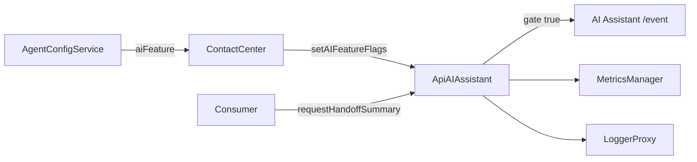

# AI Assistant - overview

> Deep design: [`ai-assistant-spec.md`](./ai-assistant-spec.md).

## Metadata
| Field | Value |
|---|---|
| Module id | `ai-assistant` |
| Source path(s) | `src/services/ApiAiAssistant.ts`, `src/types.ts`, `src/services/config/index.ts`, `src/metrics/constants.ts` |
| Doc kind | Module overview / HLD |
| Updated at | 2026-06-25 |

## Purpose / Responsibility
`ApiAIAssistant` owns Contact Center SDK calls to the AI Assistant backend. It provides:

- a generic event transport for AI Assistant custom events;
- historic transcript retrieval when real-time transcripts are enabled;
- the Task 1 handoff-summary request gate and event send path.

The service does not fetch its own feature flags. `ContactCenter` loads `agentConfig.aiFeature` through `AgentConfigService` during registration and injects those flags into `ApiAIAssistant` with `setAIFeatureFlags`.

## Key Files
| File | Holds |
|---|---|
| `src/services/ApiAiAssistant.ts` | AI Assistant base URL resolution, event transport, transcript fetch, handoff summary request gate. |
| `src/services/config/index.ts` | AI feature flag fetch and fail-closed fallback during agent config aggregation. |
| `src/types.ts` | AI Assistant event/action enums and handoff summary request/result types. |
| `src/metrics/constants.ts` | Operational metric names for AI Assistant event and handoff summary request outcomes. |

## Public Surface
`ApiAIAssistant` is exported from `src/index.ts`. The handoff summary request accepts `{agentId, interactionId}` and returns either:

- `{enabled: false, reason: CONSULT_TRANSFER_SUMMARIES_DISABLED}` when the gate is disabled or unavailable;
- `{enabled: true, response}` when the AI Assistant event request succeeds.

## Feature Gate
The handoff summary request is enabled only when:

```ts
agentConfig.aiFeature?.generatedSummaries?.consultTransferSummariesEnabled === true
```

Any other value, including missing config, missing `generatedSummaries`, or failed AI feature fetch, disables the request and prevents any `/event` call.

## Runtime Flow


## Non-Goals
- This module does not route WebSocket summary responses.
- This module does not add public `Task` or `Voice` helper APIs.
- This module does not log or metric generated summary body text.
