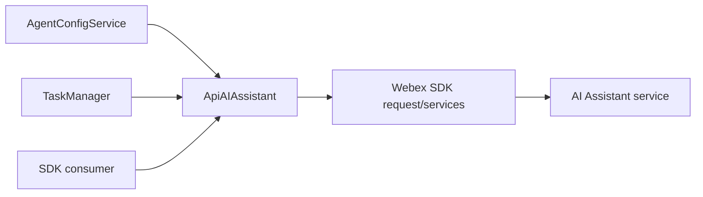
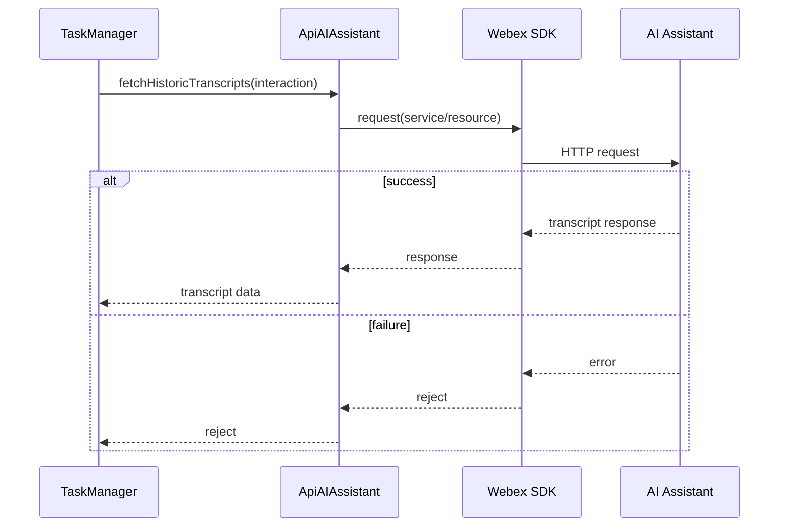
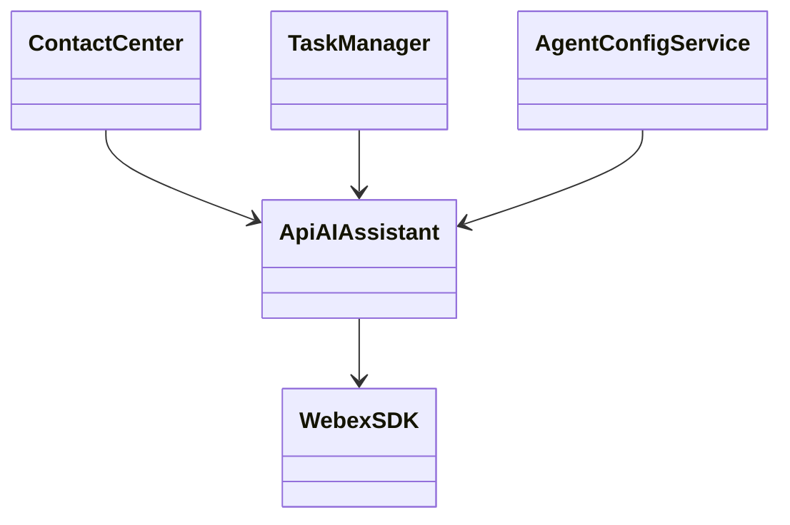

# AI Assistant - SPEC

> Canonical spec for `src/services/ApiAiAssistant.ts`. Router: [SPEC_INDEX.md](../../../ai-docs/SPEC_INDEX.md).

## Metadata
| Field | Value |
|---|---|
| Module id | `ai-assistant` |
| Source path(s) | `src/services/ApiAiAssistant.ts`; `src/services/config/types.ts`; `src/services/task/TaskManager.ts` |
| Doc kind | Module spec |
| Coverage score | 81%; bootstrap coverage review |
| Generated from | `module-spec` @ SDLC template library `0.2.0` |
| generated_by / approved_by / updated_at | Codex / user questionnaire / 2026-06-30 |
| Validation status | local conformance pass; independent validator not-run |

## Evidence Rules
Requirements cite source/test files. AI Assistant backend schema is external and represented only by local request/response types.

## Source Material Register
| Source doc | Scope | Decision | Detail location or disposition |
|---|---|---|---|
| None found | none | none | N/A |

## Overview
`ApiAIAssistant` wraps AI Assistant service calls for sending events and fetching historic transcripts. It receives AI feature flags/config from Contact Center config, resolves service base URL through Webex SDK services, and is used by task flows for transcript and generated handoff summary behavior.

## Purpose / Responsibility
Own client-side AI Assistant request construction and feature-flag-aware service URL behavior.

## Stack
TypeScript service over Webex SDK request/services; Jest tests in `test/unit/spec/services/ApiAiAssistant.ts`.

## Folder / Package Structure
```text
src/services/ApiAiAssistant.ts # AI feature flags, base URL, sendEvent, historic transcripts
```

## Key Files
| File | Holds |
|---|---|
| `src/services/ApiAiAssistant.ts` | AI Assistant service class |
| `src/services/config/types.ts` | AI feature flag types |
| `src/services/task/TaskManager.ts` | transcript trigger integration |
| `test/unit/spec/services/ApiAiAssistant.ts` | AI Assistant tests |

## Public Surface
| Contract ID | Type | Surface | Purpose | Compatibility / deprecation | Schema / detail link | Root index |
|---|---|---|---|---|---|---|
| `ai.service` | SDK class export | `ApiAIAssistant` | AI Assistant helper | exported from package | `src/services/ApiAiAssistant.ts` | `../../../ai-docs/CONTRACTS.md` |
| `ai.flags` | method | `setAIFeatureFlags(aiFeature)` | set AI feature config | behavior-visible | `src/services/ApiAiAssistant.ts` | `../../../ai-docs/CONTRACTS.md` |
| `ai.sendEvent` | method | `sendEvent(agentId, interactionId, eventType, eventName, action?, eventData?)` | send transcript and handoff summary AI events | public helper; optional action/eventData are additive | `src/services/ApiAiAssistant.ts`; `../../../features/cai-7974-agent-handoff-summary/design/contracts/ai-assistant-handoff-event.md` | `../../../ai-docs/CONTRACTS.md` |
| `ai.fetchHistoricTranscripts` | method | `fetchHistoricTranscripts(...)` | retrieve historic transcript data | public helper | `src/services/ApiAiAssistant.ts` | `../../../ai-docs/CONTRACTS.md` |

## Requires
- Webex SDK request/services.
- AI Assistant URL/config from WCC config.
- Agent, session, task, or interaction identifiers supplied by caller/task manager.

## Requirements
| ID | WHAT | WHY | Source Evidence | Test / Example Evidence | Assumptions / Gaps | Confidence |
|---|---|---|---|---|---|---|
| AIA-R-001 | The service must store AI feature flags/config through `setAIFeatureFlags`. | Base URL and feature behavior depend on WCC config. | `src/services/ApiAiAssistant.ts`; `src/services/config/types.ts` | `test/unit/spec/services/ApiAiAssistant.ts` | exact flag schema external | PRESENT |
| AIA-R-002 | `sendEvent()` must build and send AI Assistant event requests through Webex SDK request plumbing. | Consumers and task flows need event delivery to AI Assistant backend. | `src/services/ApiAiAssistant.ts` | `test/unit/spec/services/ApiAiAssistant.ts` | backend schema external | PRESENT |
| AIA-R-003 | `fetchHistoricTranscripts()` must call the configured AI Assistant transcript resource and return caller-visible errors. | Transcript retrieval is user-visible and failure must not be swallowed. | `src/services/ApiAiAssistant.ts`; `src/services/task/TaskManager.ts` | `test/unit/spec/services/ApiAiAssistant.ts`; `test/unit/spec/services/task/TaskManager.ts` | backend schema external | PRESENT |
| AIA-R-004 | TaskManager may request realtime/historic transcript behavior only from mapped task events and interaction ids. | Avoids incorrect AI calls for unrelated task events. | `src/services/task/TaskManager.ts`; `src/services/ApiAiAssistant.ts` | `test/unit/spec/services/task/TaskManager.ts` | none | PRESENT |
| AIA-R-005 | `sendEvent()` must allow request events without an action and must merge backend-owned `eventData` into `eventDetails.data`. | Handoff summary request events do not require `START`/`STOP`, while response events carry `CANCEL`/`CONSULT`/`TRANSFER` and optional backend details. | `src/services/ApiAiAssistant.ts`; `src/types.ts`; `src/services/task/index.ts` | `test/unit/spec/services/ApiAiAssistant.ts`; `test/unit/spec/services/task/index.ts` | backend handoff summary schema external | PRESENT |

## Design Overview
The AI Assistant service is intentionally small. It keeps backend URL/feature configuration local and exposes request methods without pushing AI endpoint knowledge into TaskManager or ContactCenter.

## Data Flow


## Sequence Diagrams
| Operation group | Diagram | Failure / recovery coverage |
|---|---|---|
| transcript fetch | task/consumer to AI backend | request failure |



## Class / Component Relationships


## Use Cases
- UC-1 Configure AI Assistant: ContactCenter/config calls `setAIFeatureFlags`. Evidence: `src/services/ApiAiAssistant.ts`, `src/services/config/types.ts`.
- UC-2 Send AI event: consumer/task flow calls `sendEvent`. Evidence: `src/services/ApiAiAssistant.ts`.
- UC-3 Fetch transcripts: TaskManager triggers transcript fetch for mapped event/interaction. Evidence: `src/services/task/TaskManager.ts`.
- UC-4 Handoff summary events: Task calls `sendEvent()` with `GET_MID_CALL_SUMMARY` or `MID_CALL_SUMMARY_RESPONSE`; action is omitted for request and present for responses. Evidence: `src/services/task/index.ts`, `src/services/ApiAiAssistant.ts`.

## State Model
- Service stores AI feature flag/config state in memory.
- No transcripts are persisted by the package.

## Business Rules & Invariants
- Do not hardcode AI backend URLs when config/service discovery provides them.
- Do not request transcripts without a valid interaction id.
- Do not swallow backend request errors.

## Concurrency & Reactive Flow
- Transcript requests are asynchronous and may be triggered by task events.
- Callers must handle rejection; module must not block task event processing indefinitely.

## Protocol / Wire Format
- AI Assistant REST payloads are owned by `ApiAiAssistant.ts` local request construction and remote backend contract. `sendEvent()` always includes `interactionId` and `actionTimeStamp`, includes `action` only when supplied, and merges optional `eventData` into `eventDetails.data`.

## Error Handling & Failure Modes
| Condition | Signal | Caller recovery |
|---|---|---|
| feature config missing | request construction/base URL failure | wait for register/config completion |
| backend request fails | rejected promise | retry only when user flow permits |
| missing interaction id | no request or error | verify task event mapping |
| request event has no action | action omitted from payload | expected for `GET_MID_CALL_SUMMARY` |

## Pitfalls
- Do not move AI URL logic into TaskManager.
- Do not log transcript payloads unless existing diagnostics explicitly allow it.
- Do not assume AI feature flags are always enabled.

## Key Design Trade-off
- A small dedicated service avoids leaking AI endpoint details into task handling. The cost is another service dependency that must be configured during registration.

## Test-Case Strategy
Tests should cover feature flag setting, base URL selection, request construction, success/failure responses, and TaskManager transcript trigger integration.

| Behavior / Requirement | Existing test evidence | Gap |
|---|---|---|
| AIA-R-001 to AIA-R-003 | `test/unit/spec/services/ApiAiAssistant.ts` | backend schema external |
| AIA-R-004 | `test/unit/spec/services/task/TaskManager.ts` | none |
| AIA-R-005 | `test/unit/spec/services/ApiAiAssistant.ts`; `test/unit/spec/services/task/index.ts` | backend handoff schema external |

## Traceability
- Repo architecture: `../../../ai-docs/ARCHITECTURE.md`
- Registry: `../../../ai-docs/SPEC_INDEX.md`
- Coverage state and contracts baseline: package SDD baseline.
