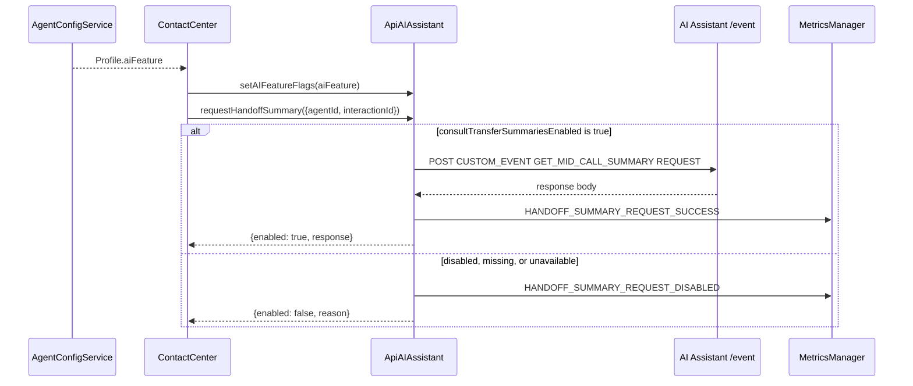

# AI Assistant - SPEC

> Overview: [`ai-assistant-overview.md`](./ai-assistant-overview.md).

## Metadata
| Field | Value |
|---|---|
| Module id | `ai-assistant` |
| Source path(s) | `src/services/ApiAiAssistant.ts`, `src/types.ts`, `src/services/config/index.ts`, `src/metrics/constants.ts` |
| Doc kind | Module spec / LLD |
| Updated at | 2026-06-25 |

## Design Overview
`ApiAIAssistant` is a thin service wrapper over the AI Assistant HTTP APIs. It resolves the AI Assistant base URL from the configured WCC API gateway host, sends typed event payloads through `/event`, fetches historic transcripts through `/transcripts/list`, and owns the enable-gated handoff summary request path.

The handoff summary flow intentionally fails closed. The SDK must not call AI Assistant for handoff summaries unless `generatedSummaries.consultTransferSummariesEnabled` is exactly `true`.

## Requirements
| ID | WHAT | WHY | Source Evidence | Test Evidence |
|---|---|---|---|---|
| AIA-R-001 | Resolve the AI Assistant base URL from the WCC API gateway host and fail if no mapping exists. | AI Assistant endpoints are environment-specific. | `ApiAiAssistant.getBaseUrl` | `ApiAiAssistant` unit test for unknown host failure. |
| AIA-R-002 | `sendEvent` must POST an authenticated `/event` request with `agentId`, `orgId`, `eventType`, `eventName`, `interactionId`, `action`, and `actionTimeStamp`. | AI Assistant custom events require this transport contract. | `ApiAIAssistant.sendEvent` | `should send transcript start event successfully`; handoff summary enabled test. |
| AIA-R-003 | Handoff summary requests must be disabled unless `consultTransferSummariesEnabled === true`. | Missing or false feature config must not trigger generated-summary requests. | `isHandoffSummaryEnabled`, `requestHandoffSummary` | Disabled gate and missing gate tests. |
| AIA-R-004 | Enabled handoff summary requests must send `CUSTOM_EVENT` / `GET_MID_CALL_SUMMARY` / `REQUEST`. | Backend uses the mid-call summary event contract for handoff summaries. | `requestHandoffSummary` | Enabled handoff summary test. |
| AIA-R-005 | Failure metrics and logs must not include summary body text or raw error messages. | Generated summaries can contain sensitive conversation content. | `getSanitizedError`, failure branch in `requestHandoffSummary` | Sanitized failure test. |
| AIA-R-006 | Agent config aggregation must continue with AI features disabled when the AI feature API is unavailable. | Registration should not fail just because optional AI feature resources are unavailable. | `AgentConfigService.getAgentConfig` AI feature catch fallback | Config fail-closed test. |

## Handoff Summary Data Flow


## Event Payload
Enabled handoff summary requests use the generic event transport:

```json
{
  "eventType": "CUSTOM_EVENT",
  "eventName": "GET_MID_CALL_SUMMARY",
  "eventDetails": {
    "data": {
      "interactionId": "<interaction-id>",
      "action": "REQUEST",
      "actionTimeStamp": "<epoch-ms-string>"
    }
  }
}
```

`agentId` and `orgId` are included at the top level of the request body.

## Metrics
| Metric | When emitted |
|---|---|
| `AI_ASSISTANT_SEND_EVENT_SUCCESS` | Generic `/event` request succeeds. |
| `AI_ASSISTANT_SEND_EVENT_FAILED` | Generic `/event` request fails. |
| `AI_ASSISTANT_HANDOFF_SUMMARY_REQUEST_SUCCESS` | Enabled handoff summary request succeeds. |
| `AI_ASSISTANT_HANDOFF_SUMMARY_REQUEST_FAILED` | Enabled handoff summary request fails. |
| `AI_ASSISTANT_HANDOFF_SUMMARY_REQUEST_DISABLED` | Gate is disabled or unavailable. |

All handoff summary metrics are operational metrics.

## Error Handling
| Condition | Behavior |
|---|---|
| Missing WCC gateway mapping | Throw detailed `getBaseUrl` error. |
| `consultTransferSummariesEnabled` is missing or false | Do not call `/event`; return disabled result. |
| AI feature API fails during config aggregation | Use `{data: []}` so `Profile.aiFeature` is absent and downstream gates fail closed. |
| `/event` request fails | Emit sanitized failure metric/log context and rethrow the detailed send-event error. |

## Test Strategy
Focused unit coverage lives in:

- `test/unit/spec/services/ApiAiAssistant.ts`
- `test/unit/spec/services/config/index.ts`

Required coverage for this feature:

- enabled gate sends `GET_MID_CALL_SUMMARY` with `REQUEST`;
- false gate prevents AI Assistant calls;
- missing gate prevents AI Assistant calls;
- event failures emit sanitized metrics/logs;
- config aggregation fails closed when the AI feature API rejects.

## Boundaries
This spec covers Task 1 only. WebSocket summary response routing and public `Task`/`Voice` helper APIs belong to later tasks and should be documented separately when implemented.
