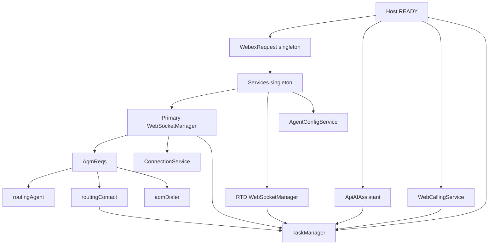
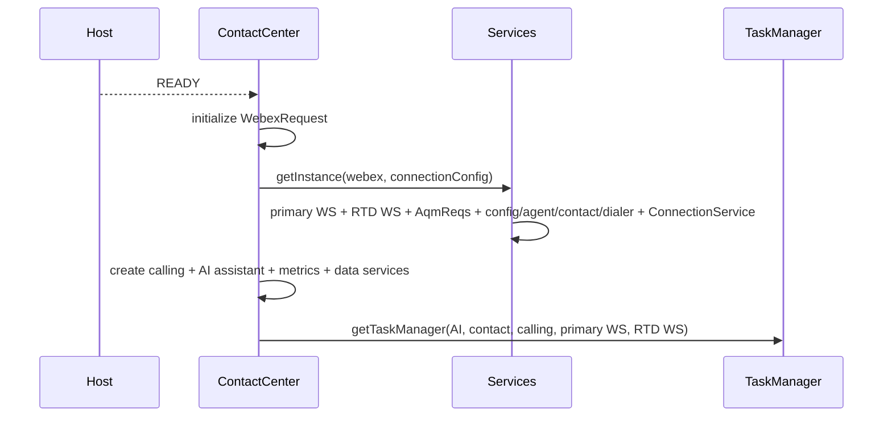
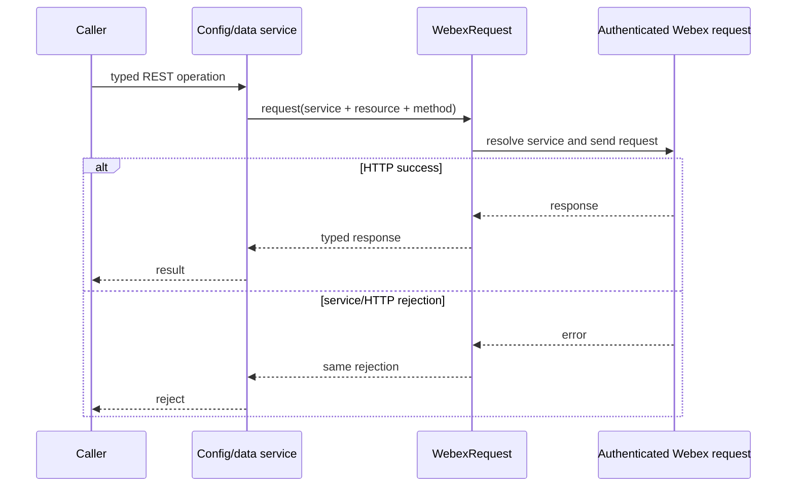
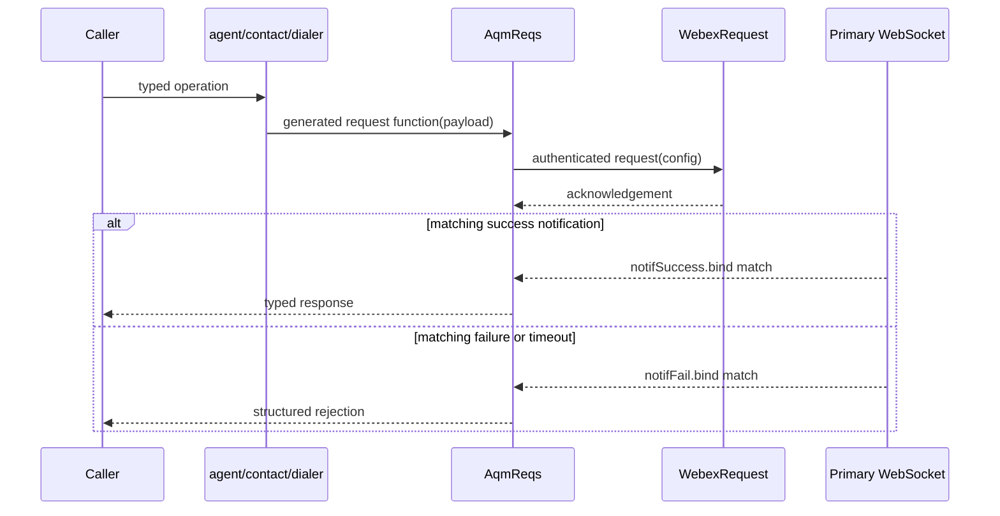
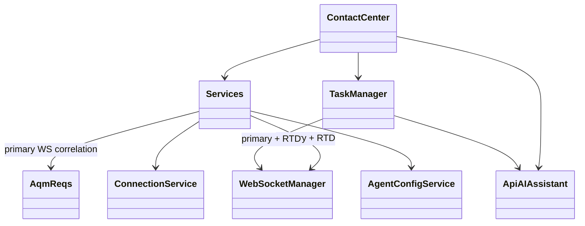
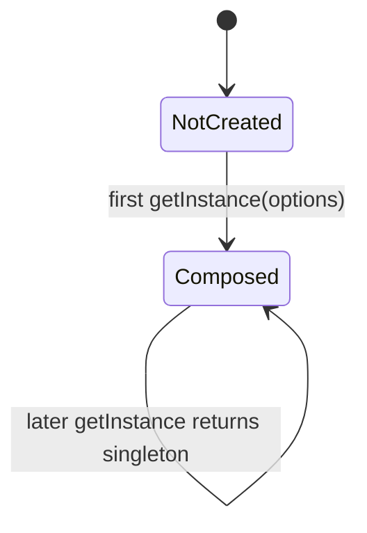

# Services — SPEC

> Start here → root [`AGENTS.md`](../../../AGENTS.md) · router [`SPEC_INDEX.md`](../../../ai-docs/SPEC_INDEX.md) · system [`ARCHITECTURE.md`](../../../ai-docs/ARCHITECTURE.md). This is the module's canonical specification.

## Metadata

| Field | Value |
|---|---|
| Module id | `services` |
| Source path(s) | `src/services` |
| Doc kind | Module spec |
| Coverage score | 100% assessed 2026-07-09; 15/15 mandatory fields present; test evidence and gaps mapped by requirement |
| Generated from | `module-spec` @ SDLC template library `0.2.1` |
| generated_by / approved_by / updated_at | Codex generator / developer-approved conformance and fidelity remediation / 2026-07-09 |
| Validation status | not-run for current revision; independent validator claude-code required after 2026-07-09 remediation; prior 2026-07-07 PASS is superseded by these edits |

## Evidence Rules
Every requirement cites stable source and test file paths. Code/tests are the behavioral referee; routed source text supplies explicit intent and rationale. Missing or contradictory evidence blocks promotion.

## Source Material Register
| Source material | Scope | Decision | Detail location or disposition |
|---|---|---|---|
| Reviewed prior module guides and architecture material | overview / architecture / API / tests | used and code-checked | Content is placed by meaning throughout this specification; exact routing remains in the manifest. |

## Overview
Services is one of nine confirmed Contact Center SDK modules. Own composition and bootstrap order for backend request, realtime, data, and WebRTC service collaborators. Existing reviewed documentation is migrated by meaning and code/tests remain the behavioral referee.

The `src/services/` directory is the service layer of the `@webex/contact-center` SDK. It sits between the public plugin class (`cc.ts`) and the backend APIs/WebSocket. Every backend interaction — HTTP requests, WebSocket messages, agent operations, task lifecycle, configuration fetching — flows through this layer.

- Understanding service composition and which service owns which responsibility

- Determining the correct instantiation/bootstrap order for services

- Tracing request flow from `cc.ts` through services to the backend

- Choosing between AqmReqs and direct REST patterns for a new method

- Adding a new data service (AddressBook/Queue/EntryPoint pattern)

- Adding a new AqmReqs method to agent, task, or dialer factories

- Routing to the correct service-level docs for task/agent/config/core changes

- Clarifying what the Services singleton creates vs what `cc.ts` creates

| Capability | Owner | Description |
|---|---|---|
| **Service Singleton** | [`index.ts`](../index.ts) | Central `Services` class that instantiates and provides access to all service modules via `Services.getInstance()` |
| **Agent Operations** | [`agent/`](../agent/index.ts) | Station login/logout, state changes, buddy agents — uses AqmReqs factory pattern |
| **Task Management** | [`task/`](../task/TaskManager.ts) | Task lifecycle (accept, hold, transfer, conference, wrapup), Task state machine, contact operations, outbound dialing |
| **Configuration** | [`config/`](../config/index.ts) | Agent profile aggregation from 8+ API endpoints, org settings, teams, aux codes, dial plans |
| **Core Infrastructure** | [`core/`](../core/WebexRequest.ts) | HTTP requests (`WebexRequest`), WebSocket management (`WebSocketManager`), connection lifecycle (`ConnectionService`), AQM request/response correlation (`AqmReqs`), error handling (`Utils`, `Err`) |
| **Data Services** | [`AddressBook.ts`](../AddressBook.ts), [`Queue.ts`](../Queue.ts), [`EntryPoint.ts`](../EntryPoint.ts) | Standalone REST-based data services with pagination and caching for address books, queues, and entry points |
| **Utilities** | [`src/utils/PageCache.ts`](../../utils/PageCache.ts) | Shared `PageCache<T>` generic class for pagination caching, plus `BaseSearchParams`, `PaginatedResponse`, and `PaginationMeta` types used by all data services |
| **WebRTC Calling** | [`WebCallingService.ts`](../WebCallingService.ts) | Browser-based voice calling via `@webex/calling`, line registration, call answer/mute/decline |

Each service folder contains its own `ai-docs/` with detailed documentation. **Always load the relevant service docs before making changes.**

| Service | Scope / Keywords | AGENTS.md | ARCHITECTURE.md |
|---|---|---|---|
| **Agent** | login, logout, state change, buddy agents, station, RONA | [`agent/ai-docs/agent-spec.md`](../agent/ai-docs/agent-spec.md) | [`agent/ai-docs/agent-spec.md`](../agent/ai-docs/agent-spec.md) |
| **Task** | task, hold, transfer, conference, wrapup, outdial, consult, accept, decline, state machine, XState, task states, guards, actions | [`task/ai-docs/task-spec.md`](../task/ai-docs/task-spec.md) | [`task/ai-docs/task-spec.md`](../task/ai-docs/task-spec.md) |
| **Config** | profile, register, teams, aux codes, desktop profile, org settings, dial plan | [`config/ai-docs/config-spec.md`](../config/ai-docs/config-spec.md) | [`config/ai-docs/config-spec.md`](../config/ai-docs/config-spec.md) |
| **Core** | websocket, HTTP, connection, reconnect, aqm, utils, errors, keepalive | [`core/ai-docs/core-spec.md`](../core/ai-docs/core-spec.md) | [`core/ai-docs/core-spec.md`](../core/ai-docs/core-spec.md) |

> **Note**: The task state machine (`task/state-machine/`) is part of the Task service, not a separate service. Its dedicated docs live at [`task/state-machine/ai-docs/task-state-machine-spec.md`](../task/state-machine/ai-docs/task-state-machine-spec.md) and [`ARCHITECTURE.md`](../task/state-machine/ai-docs/task-state-machine-spec.md). Load these when working on state transitions, guards, or actions.

**Data services** (AddressBook, Queue, EntryPoint) do not have dedicated ai-docs. Read their source files directly — they follow shared REST/pagination/caching patterns documented in [`ai-docs/patterns/typescript-patterns.md`](../../../ai-docs/patterns/typescript-patterns.md).

**WebCallingService** also has no dedicated ai-docs, but it follows a different pattern: EventEmitter-based call lifecycle orchestration around `@webex/calling` (`createClient`, line registration/deregistration, `ICall` events), `callTaskMap` tracking, and async registration flows with timeout handling. Read [`WebCallingService.ts`](../WebCallingService.ts) directly when changing browser calling behavior.

The `ContactCenter` plugin class (`cc.ts`) is the **only public entry point**. It delegates all backend work to the services layer:

```text
ContactCenter (cc.ts) — public API surface
│
├── WebexRequest.getInstance({webex})     ← initialized FIRST (singleton)
├── Services.getInstance({webex, connectionConfig}) ← initialized SECOND (singleton)
│   │
│   ├── webSocketManager                  ← primary Contact Center WebSocket transport
│   ├── rtdWebSocketManager               ← separate RTD/transcription WebSocket transport
│   ├── AqmReqs                           ← HTTP request + WebSocket notification correlation
│   ├── ConnectionService                 ← WebSocket lifecycle, reconnection, keepalive
│   ├── AgentConfigService (config)       ← profile aggregation via REST APIs
│   ├── routingAgent (agent)              ← agent operations via AqmReqs factory
│   ├── routingContact (contact)          ← task/contact operations via AqmReqs factory
│   └── aqmDialer (dialer)               ← outbound dialing via AqmReqs factory
│
├── TaskManager                           ← task lifecycle, created in the Webex READY callback
├── WebCallingService                     ← WebRTC calling, created in READY (line registration remains conditional)
├── ApiAIAssistant                        ← AI transcript/suggestion API, created in READY
├── AddressBook                           ← REST data service, created in READY
├── EntryPoint                            ← REST data service, created in READY
├── Queue                                 ← REST data service, created in READY
└── MetricsManager.getInstance({webex})   ← telemetry singleton
```

## Purpose / Responsibility
Own composition and bootstrap order for backend request, realtime, data, and WebRTC service collaborators.

## Stack
TypeScript 5.4, singleton composition, REST/WebSocket/AQM integrations, @webex/calling, Jest 27.

## Folder / Package Structure
```text
src/services/
├── AddressBook.ts
├── ApiAiAssistant.ts
├── EntryPoint.ts
├── Queue.ts
├── WebCallingService.ts
├── agent/
├── config/
├── constants.ts
├── core/
├── index.ts
├── task/
```

```text
src/services/
├── index.ts                    # Services singleton — composes all services
├── constants.ts                # Shared constants (gateway id, API paths, WebRTC domains/prefixes, timeout, method-name constants)
├── ai-docs/
│   └── AGENTS.md               # Preserved legacy migration source (non-canonical)
│
├── agent/                      # Agent operations service
│   ├── index.ts                # routingAgent factory — stationLogin, stateChange, logout, buddyAgents
│   ├── types.ts                # Agent types: StateChange, Logout, AGENT_EVENTS, LoginOption
│   └── ai-docs/                # Agent-specific documentation
│       ├── AGENTS.md
│       └── ARCHITECTURE.md
│
├── task/                       # Task management service
│   ├── TaskManager.ts          # Task lifecycle manager — creates/destroys Task instances
│   ├── Task.ts                 # Individual task — hold, transfer, conference, wrapup
│   ├── TaskFactory.ts          # Creates Task with config flags
│   ├── contact.ts              # routingContact factory — task operations via AqmReqs
│   ├── dialer.ts               # aqmDialer factory — outbound dialing
│   ├── AutoWrapup.ts           # Auto wrapup timer handler
│   ├── TaskUtils.ts            # Task utility functions
│   ├── taskDataNormalizer.ts   # Normalizes task data from events
│   ├── types.ts                # Task types: ITask, TASK_EVENTS, TaskResponse
│   ├── constants.ts            # Task constants
│   ├── voice/                  # Voice-specific task handling
│   │   ├── Voice.ts            # Voice task operations
│   │   └── WebRTC.ts           # WebRTC-specific voice operations
│   ├── digital/                # Digital channel task handling
│   │   └── Digital.ts          # Digital task operations
│   ├── state-machine/          # XState-based task state machine
│   │   ├── TaskStateMachine.ts # State machine definition
│   │   ├── index.ts            # Barrel export for state machine public API
│   │   ├── constants.ts        # TaskState, TaskEvent enums
│   │   ├── types.ts            # TaskContext type
│   │   ├── guards.ts           # State transition guards
│   │   ├── actions.ts          # State transition actions
│   │   ├── uiControlsComputer.ts # Computes UI controls from state
│   │   └── ai-docs/            # State machine documentation
│   │       ├── AGENTS.md
│   │       └── ARCHITECTURE.md
│   └── ai-docs/                # Task-specific documentation
│       ├── AGENTS.md
│       └── ARCHITECTURE.md
│
├── config/                     # Configuration service
│   ├── index.ts                # AgentConfigService — getAgentConfig(), profile aggregation
│   ├── Util.ts                 # parseAgentConfigs, getFilterAuxCodes, helper functions
│   ├── types.ts                # CC_EVENTS, Profile, CC_AGENT_EVENTS, CC_TASK_EVENTS
│   ├── constants.ts            # endPointMap (API URL builders), pagination defaults
│   └── ai-docs/                # Config-specific documentation
│       ├── AGENTS.md
│       └── ARCHITECTURE.md
│
├── core/                       # Core infrastructure
│   ├── WebexRequest.ts         # HTTP client singleton — request(), uploadLogs()
│   ├── aqm-reqs.ts             # AqmReqs — HTTP request + WebSocket notification correlation
│   ├── Utils.ts                # getErrorDetails, generateTaskErrorObject, isValidDialNumber
│   ├── Err.ts                  # Err.Details error class with structured metadata
│   ├── GlobalTypes.ts          # Msg<T>, Failure, AugmentedError, TaskError
│   ├── types.ts                # Req, Conf, Res types for AqmReqs
│   ├── constants.ts            # Core constants
│   ├── websocket/
│   │   ├── WebSocketManager.ts # WebSocket connection handler
│   │   ├── connection-service.ts # Connection lifecycle, reconnection, keepalive
│   │   └── types.ts            # WebSocket types
│   └── ai-docs/                # Core-specific documentation
│       ├── AGENTS.md
│       └── ARCHITECTURE.md
│
├── AddressBook.ts              # Address book entries — getEntries() with pagination/cache
├── EntryPoint.ts               # Entry points — getEntryPoints() with pagination/cache
├── Queue.ts                    # Queues — getQueues() with pagination/cache
└── WebCallingService.ts        # WebRTC calling — register/deregister line, answer/mute/decline
```

Note: The `src/utils/` folder (sibling to `src/services/`) contains shared utilities like [`PageCache.ts`](../../utils/PageCache.ts) which provides generic pagination caching with `BaseSearchParams`, `PaginatedResponse`, and `PaginationMeta` types used by all data services.

Use [`constants.ts`](../constants.ts) as the canonical source for service-level naming and routing constants:

- `WCC_API_GATEWAY` — service identifier used by `WebexRequest` calls

- `SUBSCRIBE_API`, `LOGIN_API`, `STATE_CHANGE_API` — common API path constants

- `WEB_RTC_PREFIX` — path prefix for WebRTC-related endpoints

- `WEBSOCKET_EVENT_TIMEOUT` — defined as `20000` ms in `src/services/constants.ts` but not used by AqmReqs; active AQM correlation defaults to Core's `TIMEOUT_REQ = 20000`

- `DEFAULT_RTMS_DOMAIN`, `WCC_CALLING_RTMS_DOMAIN` — RTMS/WebRTC domain constants

- `METHODS` — method name constants used by `WebCallingService`

## Key Files (source of truth)
| File | Holds |
|---|---|
| `src/services/index.ts` | Authoritative Services implementation or contract source. |
| `src/services/constants.ts` | Authoritative Services implementation or contract source. |
| `src/services/AddressBook.ts` | Authoritative Services implementation or contract source. |
| `src/services/EntryPoint.ts` | Authoritative Services implementation or contract source. |
| `src/services/Queue.ts` | Authoritative Services implementation or contract source. |
| `src/services/WebCallingService.ts` | Authoritative Services implementation or contract source. |

## Public Surface
| Contract ID | Type | Surface | Purpose | Compatibility / deprecation | Schema / detail link | Root index |
|---|---|---|---|---|---|---|
| `services.surface` | SDK / event / internal API | Internal `Services.getInstance()` composition root plus data-service and calling collaborators consumed by `ContactCenter`. | Stable module consumption boundary. | Additive changes by default; breaking package exports require a major-version transition. | `src/services/index.ts` | `../../../ai-docs/CONTRACTS.md` |

Compatibility notes:
- Do not remove or reinterpret exported symbols/events without a documented consumer migration.

## Requires (dependencies)
- Host Webex SDK READY lifecycle and authenticated request facilities.
- `WebexRequest` initialized by ContactCenter before `Services.getInstance()`.
- WCC REST endpoints plus primary Contact Center and RTD WebSocket transports.
- `ApiAIAssistant`, `WebCallingService`, `MetricsManager`, TaskManager, and PageCache-consuming data services constructed by ContactCenter.
- `@webex/calling` for browser calling.

```text
ContactCenter READY callback
├── WebexRequest.getInstance(webex)
├── Services.getInstance(webex, connectionConfig)
│   ├── webSocketManager + rtdWebSocketManager
│   ├── AqmReqs(primary WebSocket)
│   ├── config + agent + contact + dialer
│   └── ConnectionService(primary WebSocket)
├── WebCallingService + ApiAIAssistant + MetricsManager
├── TaskManager(ApiAIAssistant, contact, calling, primary WS, RTD WS)
└── AddressBook + EntryPoint + Queue
```

## Requirements
| ID | WHAT | WHY | Source Evidence | Test / Example Evidence | Assumptions / Gaps | Confidence |
|---|---|---|---|---|---|---|
| SERVICES-R-001 | Build the Services singleton with agent/config/contact/dialer, two WebSocket managers, AqmReqs, and ConnectionService after WebexRequest is initialized. | Every AQM and transport collaborator depends on one shared authenticated host and primary message stream. | `src/services/index.ts` | `test/unit/spec/cc.ts` | None; source and test evidence rechecked during the 2026-07-09 remediation; independent document revalidation pending. | PRESENT |
| SERVICES-R-002 | Keep direct REST services separate from AQM request factories. | Direct data/config calls complete from HTTP while AQM operations require correlated WebSocket completion. | `src/services/index.ts` | `test/unit/spec/services/AddressBook.ts` | None; source and test evidence rechecked during the 2026-07-09 remediation; independent document revalidation pending. | PRESENT |
| SERVICES-R-003 | Construct TaskManager and non-Services collaborators in ContactCenter's READY callback, not in `register()`. | Registration is a connection boundary; changing construction timing can duplicate listeners or access uninitialized host services. | `src/cc.ts` | `test/unit/spec/cc.ts` | None; source and test evidence rechecked during the 2026-07-09 remediation; independent document revalidation pending. | PRESENT |
| SERVICES-R-004 | Pass ApiAIAssistant, contact routing, WebCallingService, primary WebSocket, and RTD WebSocket into TaskManager. | Voice, task, transcript, and suggestion behavior depend on the complete collaborator set. | `src/cc.ts` | `test/unit/spec/services/task/TaskManager.ts` | None; source and test evidence rechecked during the 2026-07-09 remediation; independent document revalidation pending. | PRESENT |
| SERVICES-R-005 | Inherit authenticated request identity from the host Webex SDK through Core/WebexRequest; Services must not store, parse, or refresh credentials. | One host-owned authentication boundary avoids duplicate token handling and credential leakage across composed services. | `src/services/index.ts`, `src/services/core/WebexRequest.ts` | `test/unit/spec/services/core/WebexRequest.ts` | None; authentication ownership is explicit. | PRESENT |
| SERVICES-R-006 | Treat Services composition as unconditionally created by the ContactCenter READY callback; Services owns no rollout or feature-flag decision. | Capability flags belong to the consuming config/task/calling collaborators, so the composition root must not silently gate construction. | `src/services/index.ts`, `src/cc.ts` | `test/unit/spec/cc.ts` | None; rollout applicability is explicitly N/A for Services. | PRESENT |

## Design Overview
`Services` is a singleton composition root for transport-facing capabilities only. It constructs two `WebSocketManager` instances (primary Contact Center and RTD), creates `AqmReqs` on the primary manager, then creates config, agent, contact, dialer, and ConnectionService collaborators.

ContactCenter owns the broader READY-time graph: WebCallingService, ApiAIAssistant, MetricsManager, TaskManager, EntryPoint, AddressBook, and Queue. TaskManager receives ApiAIAssistant, contact routing, calling, and both WebSocket managers. None of these collaborators is created by `register()`; registration attaches runtime listeners and connects the primary socket after READY initialization.

AQM factories return functions whose HTTP request is initiation and whose promise settles on correlated primary-WebSocket notifications. Direct config/data services return authenticated REST responses.

## Data Flow


Direct REST: caller → AgentConfigService/AddressBook/EntryPoint/Queue → WebexRequest → response.

AQM: caller → routing factory → AqmReqs → WebexRequest HTTP acknowledgement → matching primary-WebSocket success/failure → promise settlement.

Realtime task/AI: primary or RTD WebSocket → TaskManager → Task/state machine → typed application event.

## Sequence Diagram(s)
Sequence coverage:

| Operation group | Diagram | Failure / recovery coverage |
|---|---|---|
| READY-time composition | READY composition | Invalid initialization prevents use of the incomplete graph. |
| Direct REST | Direct REST request | HTTP/service rejection is returned directly to the caller. |
| AQM | Correlated AQM operation | HTTP rejection, matching failure notification, and timeout reject the operation. |

### READY composition



### Direct REST request



### Correlated AQM operation



## Class / Component Relationships


## Use Cases
- **UC-1 Compose services:** create the transport/factory singleton once per SDK host. Evidence: `src/services/index.ts`, `test/unit/spec/cc.ts`.
- **UC-2 Direct REST:** configuration and data services return authenticated HTTP results directly. Evidence: `src/services/config/index.ts`, `test/unit/spec/services/config/index.ts`.
- **UC-3 AQM operation:** initiate HTTP and settle only on matching WebSocket notification or timeout. Evidence: `src/services/core/aqm-reqs.ts`, `test/unit/spec/services/core/aqm-reqs.ts`.
- **UC-4 Task/AI realtime:** TaskManager consumes primary and RTD streams with ApiAIAssistant/calling collaborators. Evidence: `src/services/task/TaskManager.ts`, `test/unit/spec/services/task/TaskManager.ts`.

## State Model
`Services` is a process-local singleton. Its first `getInstance({webex, connectionConfig})` call synchronously constructs the two WebSocket managers, AqmReqs-backed factories, config service, and ConnectionService; later calls return that same composed graph. Socket lifecycle and domain records are owned by the corresponding collaborators, not by a Services state machine.

## Business Rules & Invariants
- The first singleton construction fixes the host SDK and connection configuration for that Services instance.
- The primary WebSocket manager is used for AQM correlation and Contact Center events; the RTD manager remains a distinct TaskManager dependency.
- ApiAIAssistant and TaskManager are READY-time ContactCenter collaborators, not fields constructed by Services.
- Authentication is inherited from the host SDK through Core/WebexRequest; Services owns no credential lifecycle.
- Rollout applicability is N/A for the Services composition root: it is created at READY and does not evaluate a feature flag.

## Concurrency & Reactive Flow
- `getInstance` composition is synchronous in the JavaScript execution turn. Direct REST promises can proceed independently, while each AQM promise remains pending until its matching primary-WebSocket notification, HTTP failure, or timeout.

These three services share an identical pattern. Use any one as a reference when creating similar services:

| Aspect | Pattern |
|---|---|
| **Class structure** | Standalone class with `WebexRequest`, `WebexSDK`, `MetricsManager`, `PageCache` |
| **Constructor** | `constructor(webex: WebexSDK)` — gets singletons via `.getInstance()` |
| **HTTP calls** | `this.webexRequest.request({service: WCC_API_GATEWAY, resource, method: HTTP_METHODS.GET})` |
| **Endpoints** | Uses `endPointMap` functions from `config/constants.ts` to build URL paths |
| **Pagination** | Query params with `page`, `pageSize`; uses `PageCache` for caching |
| **Caching** | `PageCache<T>` — caches pages for simple pagination, bypasses cache for search/filter |
| **Metrics** | `timeEvent` on API call start, `trackEvent` on success/failure |
| **Logging** | `LoggerProxy` with `{module: 'ClassName', method: 'methodName'}` context |
| **Error handling** | try/catch with `LoggerProxy.error` + `metricsManager.trackEvent` for failures, then re-throw so callers receive the error |

Reference files:

- [`AddressBook.ts`](../AddressBook.ts) — includes `addressBookId` parameter

- [`Queue.ts`](../Queue.ts) — includes additional query params (sortBy, sortOrder, etc.)

- [`EntryPoint.ts`](../EntryPoint.ts) — simplest example

## State Machine


## Protocol / Wire Format
- Request, response, and event payload ownership is anchored in `src/services/index.ts`. HTTP initiates backend work where applicable; WebSocket messages provide realtime events and, for AQM flows, correlated completion.

## Error Handling & Failure Modes
| Condition | Signal (error/code/result) | Caller recovery |
|---|---|---|
| Dependency rejection | Typed/rethrown error or failure event | Inspect structured details, preserve tracking id, and retry only when the operation is safe. |
| Timeout or missing async completion | Timeout/recovery state | Follow the module-specific recovery path; never synthesize success. |

## Pitfalls
- Direct REST services complete from HTTP, while agent/contact/dialer AQM factories complete from correlated WebSocket notifications; treating them as the same transport model returns too early.
- The singleton must share one primary WebSocket with AqmReqs and a distinct RTD WebSocket with TaskManager; swapping or omitting either stream loses task or AI events.
- TaskManager and calling/AI/data collaborators are created by ContactCenter after READY, not by the Services constructor or `register()`.

## Module Do's / Don'ts
- DO initialize `WebexRequest` before obtaining the Services singleton.
- DO preserve separate primary and RTD WebSocket ownership when changing composition.
- DON'T wrap direct REST services in AqmReqs or treat HTTP acknowledgement as AQM completion.
- DON'T add feature-flag decisions to the Services composition root.

## Key Design Trade-off
- Two backend interaction patterns coexist: direct REST for immediate responses and AQM HTTP-plus-WebSocket correlation for asynchronous completion.

## Test-Case Strategy (module)
Unit tests mirror module paths under `test/unit/spec/services`. Preserve positive and negative paths, event ordering, timeout/recovery behavior, and the package's 85% global branch/function/line/statement threshold.

| Behavior / Requirement | Existing test evidence | Gap |
|---|---|---|
| `SERVICES-R-001` | `test/unit/spec/cc.ts` | Add a focused Services singleton composition test if constructor wiring changes. |
| `SERVICES-R-002` | `test/unit/spec/services/config/index.ts`, `test/unit/spec/services/core/aqm-reqs.ts` | Coverage is split across direct and AQM owners. |
| `SERVICES-R-003` | `test/unit/spec/cc.ts` | None. |
| `SERVICES-R-004` | `test/unit/spec/services/task/TaskManager.ts`, `test/unit/spec/cc.ts` | None. |
| `SERVICES-R-005` | `test/unit/spec/services/core/WebexRequest.ts` | None. |
| `SERVICES-R-006` | `test/unit/spec/cc.ts` | None. |

## Traceability
- Repo architecture: `../../../ai-docs/ARCHITECTURE.md` · Registry: `../../../ai-docs/SPEC_INDEX.md`
- Coverage state and contracts baseline: `../../../.sdd/manifest.json`

- [Root orchestrator AGENTS.md](../../../AGENTS.md) — task classification, critical rules, templates

- [ai-docs/RULES.md](../../../ai-docs/RULES.md) — coding standards

- [ai-docs/patterns/](../../../ai-docs/patterns/) — TypeScript, testing, and event patterns

- [types.ts](../../types.ts) — public type definitions

- [cc.ts](../../cc.ts) — main plugin class (public API surface)
