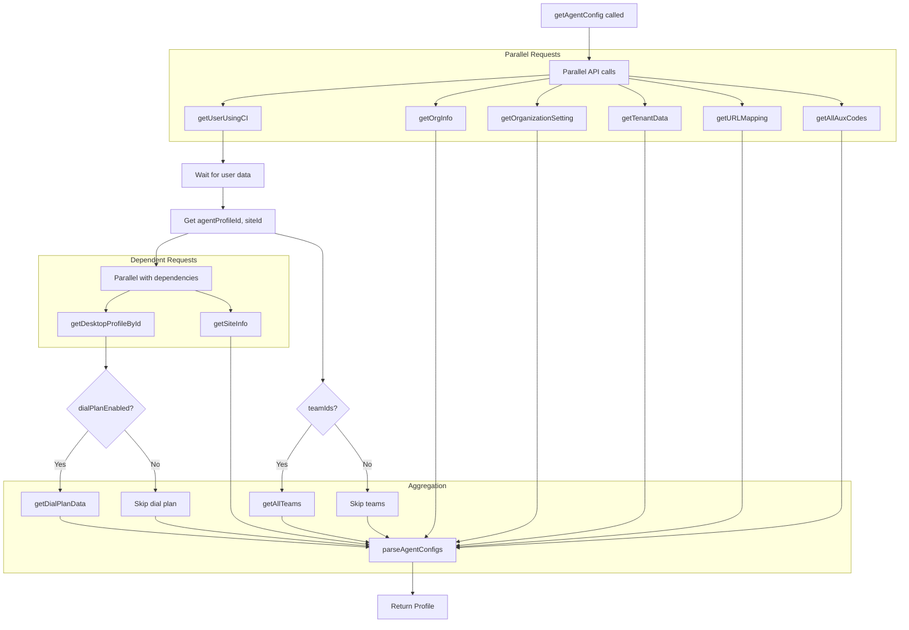
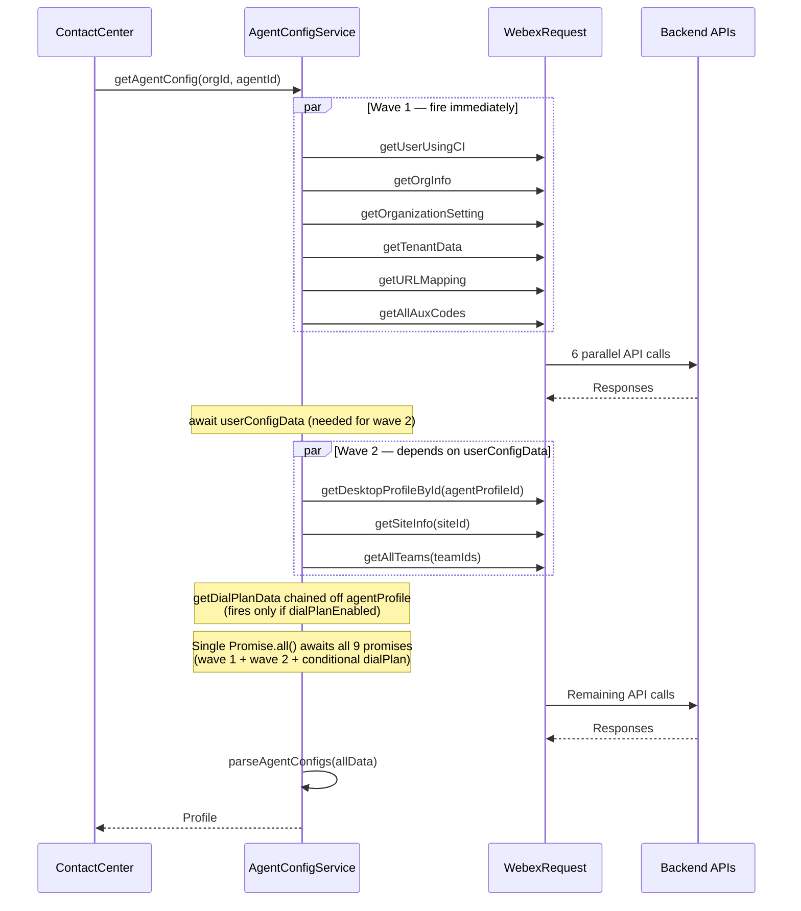

# Config Service - Architecture

> **Purpose**: Technical documentation for agent configuration aggregation.

---

## Component Overview

| Component | File | Responsibility |
|-----------|------|----------------|
| `AgentConfigService` | `config/index.ts` | Main config service class |
| `parseAgentConfigs` | `config/Util.ts` | Profile parsing/aggregation |
| `endPointMap` | `config/constants.ts` | API endpoint definitions |
| `types` | `config/types.ts` | Types, events, interfaces |

---

## Data Flow

### Profile Aggregation



---

## Sequence Diagram



---

## API Endpoints

Defined in `constants.ts`:

```typescript
export const endPointMap = {
  userByCI: (orgId: string, agentId: string) =>
    `organization/${orgId}/user/by-ci-user-id/${agentId}`,

  desktopProfile: (orgId: string, desktopProfileId: string) =>
    `organization/${orgId}/agent-profile/${desktopProfileId}`,

  multimediaProfile: (orgId: string, multimediaProfileId: string) =>
    `organization/${orgId}/multimedia-profile/${multimediaProfileId}`,

  listTeams: (orgId: string, page: number, pageSize: number, filter: string[]) =>
    `organization/${orgId}/v2/team?page=${page}&pageSize=${pageSize}${
      filter && filter.length > 0 ? `&filter=id=in=(${filter})` : ''
    }`,

  listAuxCodes: (orgId: string, page: number, pageSize: number, filter: string[], attributes: string[]) =>
    `organization/${orgId}/v2/auxiliary-code?page=${page}&pageSize=${pageSize}${
      filter && filter.length > 0 ? `&filter=id=in=(${filter})` : ''
    }&attributes=${attributes}`,

  orgInfo: (orgId: string) =>
    `organization/${orgId}`,

  orgSettings: (orgId: string) =>
    `organization/${orgId}/v2/organization-setting?agentView=true`,

  siteInfo: (orgId: string, siteId: string) =>
    `organization/${orgId}/site/${siteId}`,

  tenantData: (orgId: string) =>
    `organization/${orgId}/v2/tenant-configuration?agentView=true`,

  urlMapping: (orgId: string) =>
    `organization/${orgId}/v2/org-url-mapping?sort=name,ASC`,

  dialPlan: (orgId: string) =>
    `organization/${orgId}/dial-plan?agentView=true`,

  queueList: (orgId: string, queryParams: string) =>
    `/organization/${orgId}/v2/contact-service-queue?${queryParams}`,

  entryPointList: (orgId: string, queryParams: string) =>
    `/organization/${orgId}/v2/entry-point?${queryParams}`,

  addressBookEntries: (orgId: string, addressBookId: string, queryParams: string) =>
    `/organization/${orgId}/v2/address-book/${addressBookId}/entry?${queryParams}`,

  outdialAniEntries: (orgId: string, outdialANI: string, queryParams: string) =>
    `organization/${orgId}/v2/outdial-ani/${outdialANI}/entry${
      queryParams ? `?${queryParams}` : ''
    }`,
};
```

---

## Pagination Pattern

For endpoints with pagination (teams, aux codes):

```typescript
import {DEFAULT_PAGE} from './constants'; // DEFAULT_PAGE = 0

public async getAllTeams(orgId, pageSize, filter): Promise<TeamList[]> {
  let allTeams: TeamList[] = [];
  let page = DEFAULT_PAGE;
  
  // First request to get totalPages
  const firstResponse = await this.getListOfTeams(orgId, page, pageSize, filter);
  allTeams = allTeams.concat(firstResponse.data);
  const totalPages = firstResponse.meta.totalPages;
  
  // Parallel requests for remaining pages
  const requests = [];
  for (page = DEFAULT_PAGE + 1; page < totalPages; page += 1) {
    requests.push(this.getListOfTeams(orgId, page, pageSize, filter));
  }
  
  const responses = await Promise.all(requests);
  for (const response of responses) {
    allTeams = allTeams.concat(response.data);
  }
  
  return allTeams;
}
```

---

## Profile Parsing

`parseAgentConfigs` in Util.ts combines all data:

```typescript
function parseAgentConfigs(profileData: {
  userData: AgentResponse;
  teamData: Team[];          // BUG: declared as Team[] (teamId, teamName, desktopLayoutId) but receives TeamList[] (id, name, + 12 more fields) at runtime — incompatible types
  tenantData: TenantData;
  orgInfoData: OrgInfo;
  auxCodes: AuxCode[];
  orgSettingsData: OrgSettings;
  agentProfileData: DesktopProfileResponse;
  dialPlanData: DialPlanEntity[];
  urlMapping: URLMapping[];
  multimediaProfileId: string;
}): Profile {
  const { userData, teamData, tenantData, orgInfoData, auxCodes,
          orgSettingsData, agentProfileData, dialPlanData, urlMapping } = profileData;

  // Aux code filtering via getFilterAuxCodes():
  //   - checks auxCode.active
  //   - checks specificCodes access level (ALL → no filter, SPECIFIC → include list)
  //   - maps to Entity {id, name, isSystem, isDefault}
  const wrapupCodes = getFilterAuxCodes(auxCodes, WRAP_UP_CODE,
    agentProfileData.accessWrapUpCode === 'ALL' ? [] : agentProfileData.wrapUpCodes);
  const idleCodes = getFilterAuxCodes(auxCodes, IDLE_CODE,
    agentProfileData.accessIdleCode === 'ALL' ? [] : agentProfileData.idleCodes);

  // Hardcoded "Available" state always appended to idle codes
  idleCodes.push({ id: '0', name: 'Available', isSystem: false, isDefault: false });

  return {
    agentId: userData.ciUserId,          // NOTE: ciUserId, NOT userData.id
    analyserUserId: userData.id,          // userData.id is used here instead
    agentName: `${userData.firstName} ${userData.lastName}`,
    teams: teamData,                      // BUG: raw TeamList[] passed as Team[] — no mapping between incompatible types
    idleCodes,
    wrapupCodes,
    webRtcEnabled: orgSettingsData.webRtcEnabled,
    loginVoiceOptions: agentProfileData.loginVoiceOptions ?? [],
    enterpriseId: orgInfoData.tenantId,
    tenantTimezone: orgInfoData.timezone,
    multimediaProfileId: profileData.multimediaProfileId,
    // ... 30+ more fields — see Util.ts for full implementation
  };
}
```

---

## Error Handling

Each method follows consistent error handling:

```typescript
public async getUserUsingCI(orgId: string, agentId: string): Promise<AgentResponse> {
  LoggerProxy.info('Fetching user data using CI', {
    module: CONFIG_FILE_NAME,
    method: METHODS.GET_USER_USING_CI,
  });

  try {
    const resource = endPointMap.userByCI(orgId, agentId);
    const response = await this.webexReq.request({
      service: WCC_API_GATEWAY,
      resource,
      method: HTTP_METHODS.GET,
    });

    if (response.statusCode !== 200) {
      throw new Error(`API call failed with ${response.statusCode}`);
    }

    LoggerProxy.log('getUserUsingCI api success.', {
      module: CONFIG_FILE_NAME,
      method: METHODS.GET_USER_USING_CI,
    });

    return Promise.resolve(response.body);
  } catch (error) {
    LoggerProxy.error(`getUserUsingCI API call failed with ${error}`, {
      module: CONFIG_FILE_NAME,
      method: METHODS.GET_USER_USING_CI,
    });
    throw error;
  }
}
```

---

## Troubleshooting

### Issue: Profile incomplete

**Cause**: One of the parallel API calls failed

**Solution**: Check logs for specific API failure:
```typescript
// Look for error logs with module: CONFIG_FILE_NAME
LoggerProxy.error(`getAgentConfig call failed...`)
```

### Issue: Empty teams/aux codes

**Cause**: Pagination not completing

**Solution**: Check `totalPages` in first response and ensure all pages fetched

### Issue: WebRTC not enabled

**Cause**: `orgSettingsData.webRtcEnabled` is false

**Solution**: Check organization settings in admin portal

---

## Related Files

- [index.ts](../index.ts) - Service implementation
- [types.ts](../types.ts) - Type definitions
- [Util.ts](../Util.ts) - Parsing utilities
- [constants.ts](../constants.ts) - Endpoints and defaults
