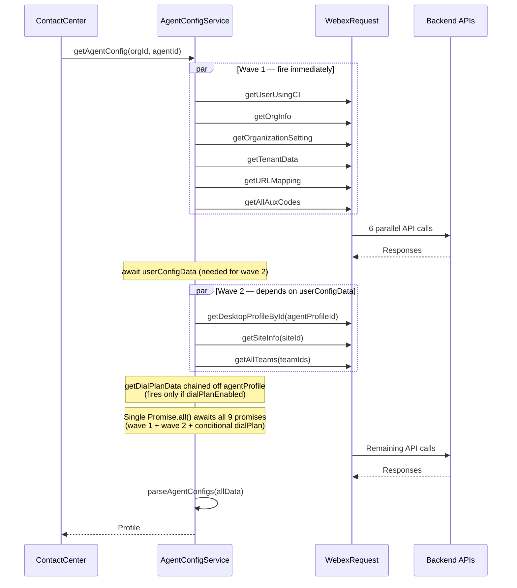

# Config Service - Architecture

> **Purpose**: Technical documentation for agent configuration aggregation.

---

## Component Overview

| Component | File | Responsibility |
|-----------|------|----------------|
| `AgentConfigService` | `config/index.ts` | Main config service class |
| `parseAgentConfigs` | `config/Util.ts` | Profile parsing/aggregation |
| `endPointMap` | `config/constants.ts` | API endpoint definitions |
| `types` | `config/types.ts` | Types, events, interfaces |

---

## Data Flow



---

## API Endpoints

The config service uses multiple API endpoints to fetch agent configuration data. These endpoints are defined in `constants.ts` and include:

- **Core user data**: User profile, agent settings, site information
- **Team & organization**: Team memberships, organization settings, tenant configuration
- **Auxiliary codes**: Idle codes and wrap-up codes with pagination
- **Communication settings**: Dial plans, URL mappings, multimedia profiles
- **Outbound features**: Queue lists, entry points, address books, outdial ANI entries

### Endpoint Definitions

All endpoints are relative to the WCC API Gateway base URL. Query parameters like `agentView=true` filter responses to agent-relevant data.

**Example Usage:**
```typescript
// Fetch user data
const resource = endPointMap.userByCI('org-123', 'agent-456');
// Result: "organization/org-123/user/by-ci-user-id/agent-456"

// Fetch teams with pagination and filtering
const resource = endPointMap.listTeams('org-123', 0, 100, ['team-1', 'team-2']);
// Result: "organization/org-123/v2/team?page=0&pageSize=100&filter=id=in=(team-1,team-2)"

// Fetch organization settings
const resource = endPointMap.orgSettings('org-123');
// Result: "organization/org-123/v2/organization-setting?agentView=true"
```

**Full Endpoint Map:**
```typescript
export const endPointMap = {
  userByCI: (orgId: string, agentId: string) =>
    `organization/${orgId}/user/by-ci-user-id/${agentId}`,

  desktopProfile: (orgId: string, desktopProfileId: string) =>
    `organization/${orgId}/agent-profile/${desktopProfileId}`,

  multimediaProfile: (orgId: string, multimediaProfileId: string) =>
    `organization/${orgId}/multimedia-profile/${multimediaProfileId}`,

  listTeams: (orgId: string, page: number, pageSize: number, filter: string[]) =>
    `organization/${orgId}/v2/team?page=${page}&pageSize=${pageSize}${
      filter && filter.length > 0 ? `&filter=id=in=(${filter})` : ''
    }`,

  listAuxCodes: (orgId: string, page: number, pageSize: number, filter: string[], attributes: string[]) =>
    `organization/${orgId}/v2/auxiliary-code?page=${page}&pageSize=${pageSize}${
      filter && filter.length > 0 ? `&filter=id=in=(${filter})` : ''
    }&attributes=${attributes}`,

  orgInfo: (orgId: string) =>
    `organization/${orgId}`,

  orgSettings: (orgId: string) =>
    `organization/${orgId}/v2/organization-setting?agentView=true`,

  siteInfo: (orgId: string, siteId: string) =>
    `organization/${orgId}/site/${siteId}`,

  tenantData: (orgId: string) =>
    `organization/${orgId}/v2/tenant-configuration?agentView=true`,

  urlMapping: (orgId: string) =>
    `organization/${orgId}/v2/org-url-mapping?sort=name,ASC`,

  dialPlan: (orgId: string) =>
    `organization/${orgId}/dial-plan?agentView=true`,

  queueList: (orgId: string, queryParams: string) =>
    `/organization/${orgId}/v2/contact-service-queue?${queryParams}`,

  entryPointList: (orgId: string, queryParams: string) =>
    `/organization/${orgId}/v2/entry-point?${queryParams}`,

  addressBookEntries: (orgId: string, addressBookId: string, queryParams: string) =>
    `/organization/${orgId}/v2/address-book/${addressBookId}/entry?${queryParams}`,

  outdialAniEntries: (orgId: string, outdialANI: string, queryParams: string) =>
    `organization/${orgId}/v2/outdial-ani/${outdialANI}/entry${
      queryParams ? `?${queryParams}` : ''
    }`,
};
```

---

## Pagination Pattern

For endpoints with pagination (teams, aux codes):

```typescript
import {DEFAULT_PAGE} from './constants'; // DEFAULT_PAGE = 0

public async getAllTeams(orgId, pageSize, filter): Promise<TeamList[]> {
  let allTeams: TeamList[] = [];
  let page = DEFAULT_PAGE;
  
  // First request to get totalPages
  const firstResponse = await this.getListOfTeams(orgId, page, pageSize, filter);
  allTeams = allTeams.concat(firstResponse.data);
  const totalPages = firstResponse.meta.totalPages;
  
  // Parallel requests for remaining pages
  const requests = [];
  for (page = DEFAULT_PAGE + 1; page < totalPages; page += 1) {
    requests.push(this.getListOfTeams(orgId, page, pageSize, filter));
  }
  
  const responses = await Promise.all(requests);
  for (const response of responses) {
    allTeams = allTeams.concat(response.data);
  }
  
  return allTeams;
}
```

---

## Profile Parsing

`parseAgentConfigs` in Util.ts combines all data into a unified `Profile` object. See [types.ts](../types.ts) for full type definitions.

### API Response Structures

The service fetches data from multiple APIs with these response structures:

| API Method | Response Type | Key Fields | Usage |
|------------|---------------|------------|-------|
| `getUserUsingCI` | `AgentResponse` | `ciUserId`, `id`, `firstName`, `lastName`, `email`, `teamIds`, `agentProfileId`, `siteId` | Primary agent identity and profile references |
| `getDesktopProfileById` | `DesktopProfileResponse` | `dialPlanEnabled`, `autoAnswer`, `accessWrapUpCode`, `wrapUpCodes`, `accessIdleCode`, `idleCodes`, `loginVoiceOptions` | Agent desktop settings and feature enablement |
| `getAllTeams` | `TeamList[]` | `id`, `name`, `type`, `channelMap` (+ 10 more fields) | Full team details with channel configurations |
| `getTenantData` | `TenantData` | `outdialEnabled`, `forceDefaultDn`, `privacyShieldVisible`, `timeoutDesktopInactivityEnabled` | Tenant-level feature flags |
| `getOrgInfo` | `OrgInfo` | `tenantId`, `timezone` | Organization metadata |
| `getAllAuxCodes` | `AuxCode[]` | `id`, `name`, `workTypeCode`, `active`, `isSystemCode`, `defaultCode` | Auxiliary codes for idle/wrap-up states |
| `getOrganizationSetting` | `OrgSettings` | `webRtcEnabled`, `maskSensitiveData`, `campaignManagerEnabled` | Organization-level feature flags |
| `getDialPlanData` | `DialPlanEntity[]` | `id`, `name`, `regularExpression`, `prefix`, `strippedChars` | Dial plan rules for outbound calling |
| `getURLMapping` | `URLMapping[]` | `name`, `url` | External service URL mappings |
| `getSiteInfo` | `SiteInfo` | Site-specific configuration | Site details |

These responses are parsed and aggregated into a single `Profile` object by the `parseAgentConfigs` function.

### Profile Aggregation Function

```typescript
// See full implementation in Util.ts
function parseAgentConfigs(profileData: {
  userData: AgentResponse;        // See types.ts:AgentResponse
  teamData: Team[];               // NOTE: Declared as Team[] (teamId, teamName) but receives TeamList[] (id, name, + 12 more fields) at runtime
  tenantData: TenantData;         // See types.ts:TenantData
  orgInfoData: OrgInfo;           // See types.ts:OrgInfo
  auxCodes: AuxCode[];            // See types.ts:AuxCode
  orgSettingsData: OrgSettings;   // See types.ts:OrgSettings
  agentProfileData: DesktopProfileResponse;  // See types.ts:DesktopProfileResponse
  dialPlanData: DialPlanEntity[]; // See types.ts:DialPlanEntity
  urlMapping: URLMapping[];       // See types.ts:URLMapping
  multimediaProfileId: string;
}): Profile {                     // See types.ts:Profile
  const { userData, teamData, tenantData, orgInfoData, auxCodes,
          orgSettingsData, agentProfileData, dialPlanData, urlMapping } = profileData;

  // Aux code filtering via getFilterAuxCodes():
  //   - checks auxCode.active
  //   - checks specificCodes access level (ALL → no filter, SPECIFIC → include list)
  //   - maps to Entity {id, name, isSystem, isDefault}
  const wrapupCodes = getFilterAuxCodes(auxCodes, WRAP_UP_CODE,
    agentProfileData.accessWrapUpCode === 'ALL' ? [] : agentProfileData.wrapUpCodes);
  const idleCodes = getFilterAuxCodes(auxCodes, IDLE_CODE,
    agentProfileData.accessIdleCode === 'ALL' ? [] : agentProfileData.idleCodes);

  // Hardcoded "Available" state always appended to idle codes
  idleCodes.push({ id: '0', name: 'Available', isSystem: false, isDefault: false });

  return {
    agentId: userData.ciUserId,          // NOTE: uses ciUserId for agent identification
    analyserUserId: userData.id,         // NOTE: userData.id is used for analytics/reporting
    agentName: `${userData.firstName} ${userData.lastName}`,
    teams: teamData,                     // NOTE: Raw TeamList[] passed directly without mapping
    idleCodes,                           // NOTE: Filtered via getFilterAuxCodes() + hardcoded "Available" state
    wrapupCodes,                         // NOTE: Filtered via getFilterAuxCodes()
    webRtcEnabled: orgSettingsData.webRtcEnabled,
    loginVoiceOptions: agentProfileData.loginVoiceOptions ?? [],
    enterpriseId: orgInfoData.tenantId,
    tenantTimezone: orgInfoData.timezone,
    multimediaProfileId: profileData.multimediaProfileId,
    // ... 30+ more fields — see Util.ts:184-258 for full implementation
  };
}
```

---

## Error Handling

Each method follows consistent error handling:

```typescript
public async getUserUsingCI(orgId: string, agentId: string): Promise<AgentResponse> {
  LoggerProxy.info('Fetching user data using CI', {
    module: CONFIG_FILE_NAME,
    method: METHODS.GET_USER_USING_CI,
  });

  try {
    const resource = endPointMap.userByCI(orgId, agentId);
    const response = await this.webexReq.request({
      service: WCC_API_GATEWAY,
      resource,
      method: HTTP_METHODS.GET,
    });

    if (response.statusCode !== 200) {
      throw new Error(`API call failed with ${response.statusCode}`);
    }

    LoggerProxy.log('getUserUsingCI api success.', {
      module: CONFIG_FILE_NAME,
      method: METHODS.GET_USER_USING_CI,
    });

    return Promise.resolve(response.body);
  } catch (error) {
    LoggerProxy.error(`getUserUsingCI API call failed with ${error}`, {
      module: CONFIG_FILE_NAME,
      method: METHODS.GET_USER_USING_CI,
    });
    throw error;
  }
}
```

---

## Troubleshooting

### Common Issues and Log Patterns

#### Issue: Profile incomplete or getAgentConfig fails

**Cause**: One of the parallel API calls failed (network error, 401/403/404/500 response)

**Log patterns to search for:**
```typescript
// General config failure
"getAgentConfig call failed"
"module": "config/index.ts", "method": "getAgentConfig"

// Specific API method failures
"getUserUsingCI API call failed"
"getDesktopProfileById API call failed"
"getAllTeams API call failed"
"getAllAuxCodes API call failed"

// Look for HTTP error codes
"API call failed with 401"  // Authentication
"API call failed with 403"  // Authorization
"API call failed with 404"  // Not found
"API call failed with 500"  // Server error
```

**Solution**:
1. Check logs for specific API that failed
2. Verify orgId and agentId are correct
3. Ensure authentication tokens are valid
4. Check network connectivity to WCC API Gateway

#### Issue: Empty teams or aux codes

**Cause**: Pagination not completing or filter parameters incorrect

**Log patterns:**
```typescript
"getAllTeams API call failed"
"getAllAuxCodes API call failed"
"method": "getListOfTeams"
"method": "getListOfAuxCodes"
```

**Solution**:
1. Check `totalPages` in first response
2. Verify filter array contains valid team/aux code IDs
3. Check if pageSize is appropriate (default: 100)
4. Ensure all pages are fetched in Promise.all()

#### Issue: WebRTC or other features not enabled

**Cause**: Organization or tenant settings have feature disabled

**Log patterns:**
```typescript
"getOrganizationSetting api success"
"getTenantData api success"
```

**Solution**:
1. Check `orgSettingsData.webRtcEnabled` in response
2. Check `tenantData.outdialEnabled` for outbound features
3. Verify feature is enabled in admin portal settings
4. Confirm agentProfileData has correct feature flags

#### Issue: Missing dial plan data

**Cause**: `dialPlanEnabled` is false in desktop profile

**Solution**:
1. Check `agentProfileData.dialPlanEnabled` value
2. Verify dial plans are assigned in agent profile configuration
3. Note: dial plan fetch only happens if `dialPlanEnabled === true`

#### Issue: Incorrect auxiliary code filtering

**Cause**: Access level set to 'SPECIFIC' but missing code IDs

**Log patterns:**
```typescript
"method": "getFilterAuxCodes"
```

**Solution**:
1. Check `agentProfileData.accessWrapUpCode` (should be 'ALL' or 'SPECIFIC')
2. Check `agentProfileData.accessIdleCode`
3. If 'SPECIFIC', verify `wrapUpCodes` and `idleCodes` arrays contain valid IDs
4. Ensure aux codes have `active: true` status
5. Note: "Available" state is always appended to idle codes

---

## Types and Events

The config service defines comprehensive TypeScript types for all data structures. See [types.ts](../types.ts) for complete definitions.

### Core Types

**Configuration Types:**
- `Profile` - Unified agent profile after aggregation
- `AgentResponse` - User data from userByCI endpoint
- `DesktopProfileResponse` - Agent desktop settings
- `TeamList` - Team data with full details (id, name, type, channelMap, etc.)
- `Team` - Simplified team reference (teamId, teamName, desktopLayoutId)
- `AuxCode` - Auxiliary code definition
- `Entity` - Filtered code entity (used for idle/wrapup codes in Profile)

**Organization Types:**
- `OrgInfo` - Organization metadata
- `OrgSettings` - Organization-level feature flags
- `TenantData` - Tenant configuration and feature enablement
- `SiteInfo` - Site-specific configuration

**Communication Types:**
- `DialPlanEntity` - Dial plan rule definition
- `URLMapping` - External service URL mapping
- `MultimediaProfile` - Multimedia profile configuration

**Note:** The config service itself does not emit events. For agent and task events, see the Agent and Task services. Event constants are defined in [types.ts](../types.ts) under `CC_AGENT_EVENTS` and `CC_TASK_EVENTS`.

---

## Related Files

- [index.ts](../index.ts) - Service implementation with all API methods
- [types.ts](../types.ts) - Complete type definitions and event constants
- [Util.ts](../Util.ts) - Profile parsing utilities (parseAgentConfigs, getFilterAuxCodes, etc.)
- [constants.ts](../constants.ts) - API endpoints, default values, and method names
