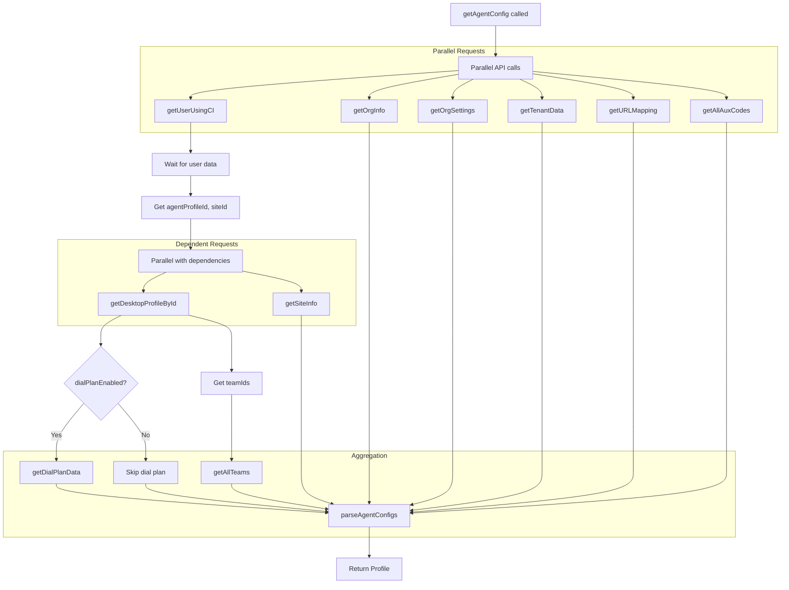
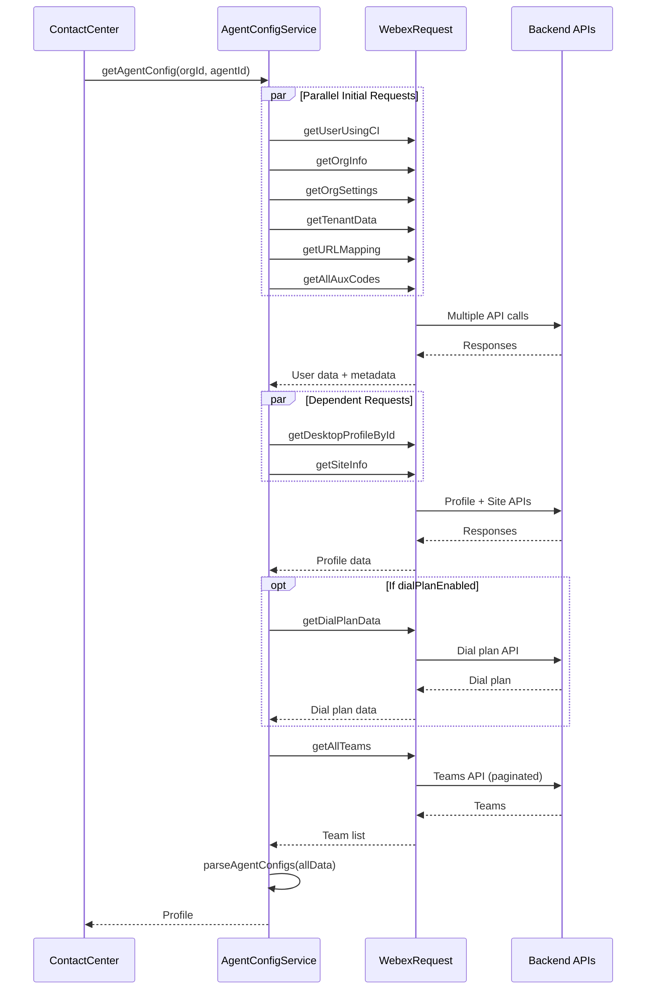

# Config Service - Architecture

> **Purpose**: Technical documentation for agent configuration aggregation.

---

## Component Overview

| Component | File | Responsibility |
|-----------|------|----------------|
| `AgentConfigService` | `config/index.ts` | Main config service class |
| `parseAgentConfigs` | `config/Util.ts` | Profile parsing/aggregation |
| `endPointMap` | `config/constants.ts` | API endpoint definitions |
| `types` | `config/types.ts` | Types, events, interfaces |

---

## File Structure

```
services/config/
├── index.ts          # AgentConfigService class
├── types.ts          # Profile, CC_EVENTS, types
├── constants.ts      # API endpoints, defaults
├── Util.ts           # parseAgentConfigs helper
└── ai-docs/
    ├── AGENTS.md     # Usage documentation
    └── ARCHITECTURE.md # This file
```

---

## Data Flow

### Profile Aggregation



---

## Sequence Diagram



---

## API Endpoints

Defined in `constants.ts`:

```typescript
export const endPointMap = {
  userByCI: (orgId, agentId) =>
    `organization/${orgId}/user/by-ci-user-id/${agentId}`,

  desktopProfile: (orgId, desktopProfileId) =>
    `organization/${orgId}/agent-profile/${desktopProfileId}`,

  multimediaProfile: (orgId, multimediaProfileId) =>
    `organization/${orgId}/multimedia-profile/${multimediaProfileId}`,

  listTeams: (orgId, page, pageSize, filter) =>
    `organization/${orgId}/v2/team?page=${page}&pageSize=${pageSize}${
      filter && filter.length > 0 ? `&filter=id=in=(${filter})` : ''
    }`,

  listAuxCodes: (orgId, page, pageSize, filter, attributes) =>
    `organization/${orgId}/v2/auxiliary-code?page=${page}&pageSize=${pageSize}${
      filter && filter.length > 0 ? `&filter=id=in=(${filter})` : ''
    }&attributes=${attributes}`,

  orgInfo: (orgId) =>
    `organization/${orgId}`,

  orgSettings: (orgId) =>
    `organization/${orgId}/v2/organization-setting?agentView=true`,

  siteInfo: (orgId, siteId) =>
    `organization/${orgId}/site/${siteId}`,

  tenantData: (orgId) =>
    `organization/${orgId}/v2/tenant-configuration?agentView=true`,

  urlMapping: (orgId) =>
    `organization/${orgId}/v2/org-url-mapping?sort=name,ASC`,

  dialPlan: (orgId) =>
    `organization/${orgId}/dial-plan?agentView=true`,

  queueList: (orgId, queryParams) =>
    `/organization/${orgId}/v2/contact-service-queue?${queryParams}`,

  entryPointList: (orgId, queryParams) =>
    `/organization/${orgId}/v2/entry-point?${queryParams}`,

  addressBookEntries: (orgId, addressBookId, queryParams) =>
    `/organization/${orgId}/v2/address-book/${addressBookId}/entry?${queryParams}`,

  outdialAniEntries: (orgId, outdialANI, queryParams) =>
    `organization/${orgId}/v2/outdial-ani/${outdialANI}/entry${
      queryParams ? `?${queryParams}` : ''
    }`,
};
```

---

## Pagination Pattern

For endpoints with pagination (teams, aux codes):

```typescript
public async getAllTeams(orgId, pageSize, filter): Promise<TeamList[]> {
  let allTeams: TeamList[] = [];
  let page = 0;
  
  // First request to get totalPages
  const firstResponse = await this.getListOfTeams(orgId, page, pageSize, filter);
  allTeams = allTeams.concat(firstResponse.data);
  const totalPages = firstResponse.meta.totalPages;
  
  // Parallel requests for remaining pages
  const requests = [];
  for (page = 1; page < totalPages; page++) {
    requests.push(this.getListOfTeams(orgId, page, pageSize, filter));
  }
  
  const responses = await Promise.all(requests);
  for (const response of responses) {
    allTeams = allTeams.concat(response.data);
  }
  
  return allTeams;
}
```

---

## Profile Parsing

`parseAgentConfigs` in Util.ts combines all data:

```typescript
export function parseAgentConfigs(data: ConfigData): Profile {
  const {
    userData,
    teamData,
    tenantData,
    orgInfoData,
    auxCodes,
    orgSettingsData,
    agentProfileData,
    dialPlanData,
    urlMapping,
    multimediaProfileId,
  } = data;
  
  // Build Profile object
  return {
    agentId: userData.id,
    agentName: `${userData.firstName} ${userData.lastName}`,
    teams: teamData.map(t => ({ teamId: t.id, teamName: t.name })),
    idleCodes: auxCodes.filter(c => c.workTypeCode === 'IDLE_CODE'),
    wrapupCodes: auxCodes.filter(c => c.workTypeCode === 'WRAP_UP_CODE'),
    webRtcEnabled: orgSettingsData.webRtcEnabled,
    loginVoiceOptions: agentProfileData.loginVoiceOptions,
    // ... many more fields
  };
}
```

---

## Event Constants

CC_EVENTS combines agent and task events:

```typescript
// CC_AGENT_EVENTS
export const CC_AGENT_EVENTS = {
  WELCOME: 'Welcome',
  AGENT_LOGOUT: 'Logout',
  AGENT_STATE_CHANGE: 'AgentStateChange',
  AGENT_STATION_LOGIN_SUCCESS: 'AgentStationLoginSuccess',
  // ... more
} as const;

// CC_TASK_EVENTS
export const CC_TASK_EVENTS = {
  AGENT_CONTACT: 'AgentContact',
  AGENT_OFFER_CONTACT: 'AgentOfferContact',
  CONTACT_ENDED: 'ContactEnded',
  // ... more
} as const;

// Combined
export const CC_EVENTS = {
  ...CC_AGENT_EVENTS,
  ...CC_TASK_EVENTS,
} as const;

// Type extraction
type Enum<T extends Record<string, unknown>> = T[keyof T];
export type CC_EVENTS = Enum<typeof CC_EVENTS>;
```

---

## Error Handling

Each method follows consistent error handling:

```typescript
public async getSomeData(orgId: string): Promise<SomeType> {
  LoggerProxy.info('Fetching data', {
    module: CONFIG_FILE_NAME,
    method: METHODS.GET_SOME_DATA,
  });
  
  try {
    const resource = endPointMap.someEndpoint(orgId);
    const response = await this.webexReq.request({
      service: WCC_API_GATEWAY,
      resource,
      method: HTTP_METHODS.GET,
    });
    
    if (response.statusCode !== 200) {
      throw new Error(`API call failed with ${response.statusCode}`);
    }
    
    LoggerProxy.log('API success', {
      module: CONFIG_FILE_NAME,
      method: METHODS.GET_SOME_DATA,
    });
    
    return response.body;
  } catch (error) {
    LoggerProxy.error(`API call failed: ${error}`, {
      module: CONFIG_FILE_NAME,
      method: METHODS.GET_SOME_DATA,
    });
    throw error;
  }
}
```

---

## Troubleshooting

### Issue: Profile incomplete

**Cause**: One of the parallel API calls failed

**Solution**: Check logs for specific API failure:
```typescript
// Look for error logs with module: CONFIG_FILE_NAME
LoggerProxy.error(`getAgentConfig call failed...`)
```

### Issue: Empty teams/aux codes

**Cause**: Pagination not completing

**Solution**: Check `totalPages` in first response and ensure all pages fetched

### Issue: WebRTC not enabled

**Cause**: `orgSettingsData.webRtcEnabled` is false

**Solution**: Check organization settings in admin portal

---

## Related Files

- [index.ts](../index.ts) - Service implementation
- [types.ts](../types.ts) - Type definitions
- [Util.ts](../Util.ts) - Parsing utilities
- [constants.ts](../constants.ts) - Endpoints and defaults
