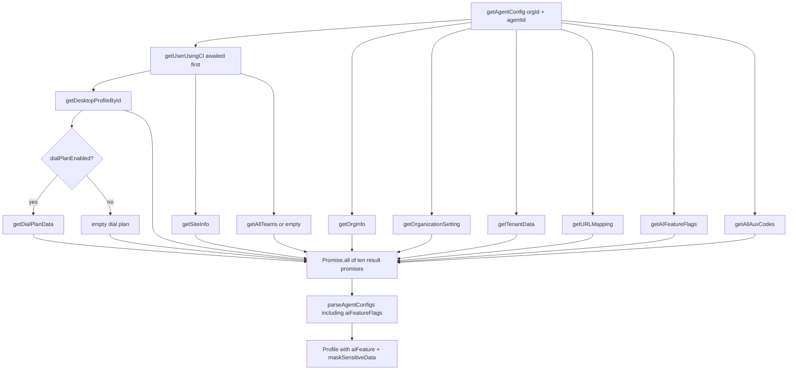
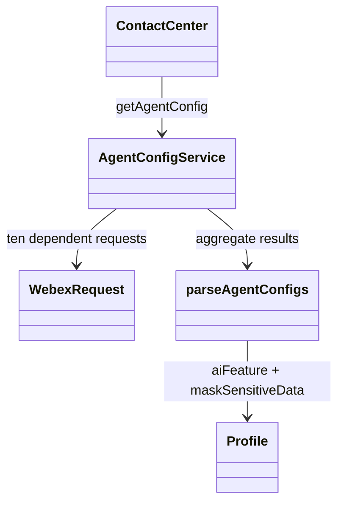

# Config — SPEC

> Start here → root [`AGENTS.md`](../../../../AGENTS.md) · router [`SPEC_INDEX.md`](../../../../ai-docs/SPEC_INDEX.md) · system [`ARCHITECTURE.md`](../../../../ai-docs/ARCHITECTURE.md). This is the module's canonical specification.

## Metadata

| Field | Value |
|---|---|
| Module id | `config` |
| Source path(s) | `src/services/config` |
| Doc kind | Module spec |
| Coverage score | Partial (manifest-authoritative); 15/15 required document fields present |
| Generated from | `module-spec` @ SDLC template library `0.2.1` |
| generated_by / approved_by / updated_at | Codex generator / developer-approved follow-up review remediation / 2026-07-21 |
| Validation status | Follow-up validation passed (independent Claude fallback, 2026-07-21); coverage remains Partial |

## Evidence Rules
Every requirement cites stable source and test file paths. Code/tests are the behavioral referee; routed source text supplies explicit intent and rationale. Missing or contradictory evidence blocks promotion.

## Source Material Register
| Source material | Scope | Decision | Detail location or disposition |
|---|---|---|---|
| Reviewed prior module guides and architecture material | overview / architecture / API / tests | used and code-checked | Content is placed by meaning throughout this specification; exact routing remains in the manifest. |

## Overview
Config is one of nine confirmed Contact Center SDK modules. Own retrieval and aggregation of remote organization, agent, team, profile, auxiliary-code, dial-plan, and feature configuration. Existing reviewed documentation is migrated by meaning and code/tests remain the behavioral referee.

The Config Service is an **internal service** that builds the comprehensive AgentProfile (`Profile` type) by:

1. Fetching user data

2. Fetching desktop profile

3. Fetching teams

4. Fetching aux codes (idle/wrapup codes)

5. Fetching organization settings

6. Aggregating all data into a single AgentProfile

The AgentProfile is the central configuration object required for an agent to operate within the contact center. It is built during the registration flow (`cc.register()`) and contains all the data an agent needs: identity, team assignments, dial plans, aux codes, login options, and feature flags. Once constructed, the AgentProfile is stored on the `ContactCenter` plugin instance as `this.agentConfig` and is used by other services (Agent, Task) throughout the session.

- **AgentProfile Aggregation**: Combines data from 8+ API endpoints

- **Aux Codes Fetching**: Gets all idle and wrapup codes with pagination

- **Team Data**: Retrieves agent's team assignments

- **Dial Plan**: Fetches number transformation rules

- **Outdial ANI**: Retrieves outbound caller ID options (standalone, publicly exposed via `cc.ts`)

- **Multimedia Profile**: Fetches channel capacity and blending config (standalone, not yet publicly exposed)

- **Paginated Data Access**: `getListOfTeams` and `getListOfAuxCodes` support custom pagination independent of profile building

## Purpose / Responsibility
Own retrieval and aggregation of remote organization, agent, team, profile, auxiliary-code, dial-plan, and feature configuration.

## Stack
TypeScript 5.4 REST client, Promise-based parallel aggregation, Jest 27.

## Folder / Package Structure
```text
src/services/config/
├── Util.ts
├── constants.ts
├── index.ts
├── types.ts
```

```text
services/config/
├── index.ts          # AgentConfigService class
├── types.ts          # Profile, CC_EVENTS, types
├── constants.ts      # API endpoints, defaults
├── Util.ts           # parseAgentConfigs helper
└── ai-docs/
    ├── AGENTS.md     # Usage documentation
    └── ARCHITECTURE.md # Preserved legacy migration source (non-canonical)
```

## Key Files (source of truth)
| File | Holds |
|---|---|
| `src/services/config/index.ts` | Authoritative Config implementation or contract source. |
| `src/services/config/Util.ts` | Authoritative Config implementation or contract source. |
| `src/services/config/types.ts` | Authoritative Config implementation or contract source. |
| `src/services/config/constants.ts` | Authoritative Config implementation or contract source. |

## Public Surface
| Surface | Contract | Source |
|---|---|---|
| `getAgentConfig(orgId, agentId)` | staged, all-or-nothing `Promise<Profile>` aggregation | `src/services/config/index.ts` |
| User/profile/site/team/aux-code fetches | typed REST methods including pagination helpers | `src/services/config/index.ts`, `src/services/config/types.ts` |
| `getAIFeatureFlags(orgId)` | `AIFeatureFlagsResponse` from `organization/{orgId}/v2/ai-feature?page=0&pageSize=100` | `src/services/config/index.ts`, `src/services/config/constants.ts` |
| `Profile.aiFeature` | optional first AI-feature row mapped by `parseAgentConfigs` | `src/services/config/Util.ts`, `src/services/config/types.ts` |
| Multimedia profile | `MultimediaProfileResponse` | `src/services/config/types.ts` |
| Organization masking | `OrgSettings.maskSensitiveData` | `src/services/config/types.ts`, `src/services/config/Util.ts` |
| Auxiliary-code list URL | includes `desktopProfileFilter=true` | `src/services/config/constants.ts` |
| Outdial ANI entries | public wrapper through ContactCenter | `src/services/config/index.ts`, `src/cc.ts` |

The service has no `TeamList.channelMap` contract. Exact package exports are indexed in root `CONTRACTS.md`.

## Requires (dependencies)
- WebexRequest
- WCC organization/profile/team/site/tenant APIs
- ContactCenter registration flow

## Requirements
| ID | WHAT | WHY | Source Evidence | Test / Example Evidence | Assumptions / Gaps | Confidence |
|---|---|---|---|---|---|---|
| CONFIG-R-001 | Fetch user config first, then aggregate ten dependent promises including AI feature flags, auxiliary codes, profile/site/team/dial-plan, organization, tenant, and URL data. | Dependent IDs and all-or-nothing consistency require staged orchestration. | `src/services/config/index.ts` | `test/unit/spec/services/config/index.ts` | None; source and test evidence rechecked during the 2026-07-09 remediation; independent document revalidation pending. | PRESENT |
| CONFIG-R-002 | Include `getAIFeatureFlags` response in `parseAgentConfigs` so `Profile.aiFeature` reflects `/v2/ai-feature`. | ApiAIAssistant behavior is gated by the remote organization feature contract. | `src/services/config/index.ts` | `test/unit/spec/services/config/index.ts` | None; source and test evidence rechecked during the 2026-07-09 remediation; independent document revalidation pending. | PRESENT |
| CONFIG-R-003 | Paginate teams and auxiliary codes until completion and include `desktopProfileFilter=true` for auxiliary-code requests. | A partial or unfiltered set yields invalid profile/team/auxiliary choices. | `src/services/config/constants.ts` | `test/unit/spec/services/config/index.ts` | None; source and test evidence rechecked during the 2026-07-09 remediation; independent document revalidation pending. | PRESENT |
| CONFIG-R-004 | Expose current response/field names: `MultimediaProfileResponse`, `OrgSettings.maskSensitiveData`, and real TeamList fields only. | Type-name drift causes invalid consumer code and incorrect privacy behavior. | `src/services/config/types.ts` | `test/unit/spec/services/config/index.ts` | None; source and test evidence rechecked during the 2026-07-09 remediation; independent document revalidation pending. | PRESENT |
| CONFIG-R-005 | Reject the entire profile aggregation when any required dependent request fails. | Consumers must never receive an internally inconsistent partial Profile. | `src/services/config/index.ts` | `test/unit/spec/services/config/index.ts` | None; source and test evidence rechecked during the 2026-07-09 remediation; independent document revalidation pending. | PRESENT |

## Design Overview
Config separates its stable consumption boundary from collaborators so ownership and failure behavior stay explicit. Profile creation is all-or-nothing across dependent API calls so consumers never receive internally inconsistent partial configuration.

> **Purpose**: Fetch and aggregate agent configuration data from multiple API endpoints to build the AgentProfile.
>
> **Scope Authority**: This is the authoritative documentation for the **Config** service scope. See [Root AGENTS.md](../../../../AGENTS.md) for the orchestrator and cross-scope rules.

```typescript
// Config service is used internally during the registration flow.
// Inside cc.ts → connectWebsocket(), after WebSocket connection is established:
const agentId = data.agentId;
const orgId = this.$webex.credentials.getOrgId();
this.agentConfig = await this.services.config.getAgentConfig(orgId, agentId);

// The returned AgentProfile contains all agent configuration:
LoggerProxy.info(`Agent ID: ${this.agentConfig.agentId}`, {
  module: 'cc',
  method: 'connectWebsocket',
});
LoggerProxy.info(`Teams: ${this.agentConfig.teams}`, {
  module: 'cc',
  method: 'connectWebsocket',
});
```

The AgentProfile is defined as the [`Profile`](../types.ts) type. This is not an exhaustive list — see [`types.ts`](../types.ts) for the full 50+ field definition. Key fields:

| Field | Type | Description |
|---|---|---|
| `agentId` | string | Unique agent identifier |
| `agentName` | string | Display name |
| `agentMailId` | string | Email address |
| `teams` | [`TeamList[]`](../types.ts) | Assigned teams (runtime data from `getAllTeams()` — `Profile` type declares `Team[]` but actual objects are `TeamList` with `id`, `name`, `teamType`, `siteId`, etc.) |
| `defaultDn` | string | Default dial number |
| `idleCodes` | [`Entity[]`](../types.ts) | Available idle codes |
| `wrapupCodes` | [`Entity[]`](../types.ts) | Available wrapup codes |
| `webRtcEnabled` | boolean | WebRTC calling enabled |
| `loginVoiceOptions` | [`LoginOption[]`](../types.ts) | Available login types |
| `dialPlan` | [`DialPlan`](../types.ts) | Number transformation rules |
| `isOutboundEnabledForAgent` | boolean | Outbound calling allowed |
| `outDialEp` | string | Outbound entry point ID |

The following diagram shows how `getAgentConfig` orchestrates multiple API calls and combines their results into the AgentProfile via `parseAgentConfigs()`:

```text
getUserUsingCI ────────────┐
                           │
getOrgInfo ────────────────┤
                           │
getOrganizationSetting ────┤
                           │
getTenantData ─────────────┤
                           │
getURLMapping ─────────────┼──► parseAgentConfigs() ──► AgentProfile
                           │
getAIFeatureFlags ─────────┤  (maps the first row to Profile.aiFeature)
                           │
getAllAuxCodes ─────────────┤
                           │
getDesktopProfileById ─────┤
                           │
getSiteInfo ───────────────┤  (computes multimediaProfileId)
                           │
getAllTeams ────────────────┤
                           │
getDialPlanData ───────────┘
```

Types used by the config service, all defined in [`types.ts`](../types.ts):

| Type | Description |
|---|---|
| `Profile` | Final aggregated agent config returned by `getAgentConfig()` |
| `AgentResponse` | Raw response from `getUserUsingCI()` — agent metadata, teamIds, siteId, agentProfileId |
| `DesktopProfileResponse` | Desktop profile settings — layout, dial plan, login options |
| `TeamList` | Team record from API — `id`, `name`, `teamType`, `siteId`, `multiMediaProfileId` |
| `ListTeamsResponse` | Paginated wrapper around `TeamList[]` with `meta` for pagination |
| `OrgInfo` | Organization info — `tenantId`, timezone |
| `OrgSettings` | Org feature flags — `webRtcEnabled`, `maskSensitiveData` |
| `TenantData` | Tenant-level config — inactivity timeout, `forceDefaultDn`, `outdialEnabled` |
| `SiteInfo` | Site config — `id`, `name`, `multimediaProfileId` |
| `URLMapping` | External URL mapping — `id`, `name`, `url` |
| `MultimediaProfileResponse` | Multimedia profile — channel capacities and settings |
| `AuxCode` | Auxiliary code record — `id`, `name`, `description`, `workTypeCode` |
| `ListAuxCodesResponse` | Paginated wrapper around `AuxCode[]` with `meta` |
| `DialPlanEntity` | Dial plan rule — regex pattern, prefix, strip digits |
| `Entity` | Basic entity info — `isSystem`, `name`, `id`, `description` |
| `WrapupData` | Wrap-up config — auto-wrapup settings, available wrapup codes |
| `OutdialAniParams` | Parameters for `getOutdialAniEntries()` — ANI ID, pagination, filtering |
| `Team` | Simplified team shape in `Profile` — `teamId`, `teamName`, `desktopLayoutId` |

```typescript
// In register() -> connectWebsocket()
const agentId = data.agentId;
const orgId = this.$webex.credentials.getOrgId();
this.agentConfig = await this.services.config.getAgentConfig(orgId, agentId);
```

> **Purpose**: Technical documentation for agent configuration aggregation.

For endpoints with pagination (teams, aux codes):

```typescript
import {DEFAULT_PAGE} from './constants'; // DEFAULT_PAGE = 0

public async getAllTeams(orgId, pageSize, filter): Promise<TeamList[]> {
  let allTeams: TeamList[] = [];
  let page = DEFAULT_PAGE;

  // First request to get totalPages
  const firstResponse = await this.getListOfTeams(orgId, page, pageSize, filter);
  allTeams = allTeams.concat(firstResponse.data);
  const totalPages = firstResponse.meta.totalPages;

  // Parallel requests for remaining pages
  const requests = [];
  for (page = DEFAULT_PAGE + 1; page < totalPages; page += 1) {
    requests.push(this.getListOfTeams(orgId, page, pageSize, filter));
  }

  const responses = await Promise.all(requests);
  for (const response of responses) {
    allTeams = allTeams.concat(response.data);
  }

  return allTeams;
}
```

`parseAgentConfigs` in Util.ts combines all data into a unified `Profile` object. See [types.ts](../types.ts) for full type definitions.

The service fetches data from multiple APIs with these response structures:

| API Method | Response Type | Key Fields | Usage |
|---|---|---|---|
| `getUserUsingCI` | `AgentResponse` | `ciUserId`, `id`, `firstName`, `lastName`, `email`, `teamIds`, `agentProfileId`, `siteId` | Primary agent identity and profile references |
| `getDesktopProfileById` | `DesktopProfileResponse` | `dialPlanEnabled`, `autoAnswer`, `accessWrapUpCode`, `wrapUpCodes`, `accessIdleCode`, `idleCodes`, `loginVoiceOptions` | Agent desktop settings and feature enablement |
| `getAllTeams` | `TeamList[]` | real `TeamList` fields from `src/services/config/types.ts` | Team identity, name, type, and site assignment; channel capacities belong to `MultimediaProfileResponse` |
| `getTenantData` | `TenantData` | `outdialEnabled`, `forceDefaultDn`, `privacyShieldVisible`, `timeoutDesktopInactivityEnabled` | Tenant-level feature flags |
| `getOrgInfo` | `OrgInfo` | `tenantId`, `timezone` | Organization metadata |
| `getAllAuxCodes` | `AuxCode[]` | `id`, `name`, `workTypeCode`, `active`, `isSystemCode`, `defaultCode` | Auxiliary codes for idle/wrap-up states |
| `getOrganizationSetting` | `OrgSettings` | `webRtcEnabled`, `maskSensitiveData`, `campaignManagerEnabled` | Organization-level feature flags |
| `getDialPlanData` | `DialPlanEntity[]` | `id`, `name`, `regularExpression`, `prefix`, `strippedChars` | Dial plan rules for outbound calling |
| `getURLMapping` | `URLMapping[]` | `name`, `url` | External service URL mappings |
| `getSiteInfo` | `SiteInfo` | Site-specific configuration | Site details |

These responses are parsed and aggregated into a single `Profile` object by the `parseAgentConfigs` function.

```typescript
// See full implementation in Util.ts
function parseAgentConfigs(profileData: {
  userData: AgentResponse;        // See types.ts:AgentResponse
  teamData: Team[];               // NOTE: Declared as Team[] (teamId, teamName) but receives TeamList[] (id, name, + 12 more fields) at runtime
  tenantData: TenantData;         // See types.ts:TenantData
  orgInfoData: OrgInfo;           // See types.ts:OrgInfo
  auxCodes: AuxCode[];            // See types.ts:AuxCode
  orgSettingsData: OrgSettings;   // See types.ts:OrgSettings
  agentProfileData: DesktopProfileResponse;  // See types.ts:DesktopProfileResponse
  dialPlanData: DialPlanEntity[]; // See types.ts:DialPlanEntity
  urlMapping: URLMapping[];       // See types.ts:URLMapping
  multimediaProfileId: string;
  aiFeatureFlags: AIFeatureFlagsResponse;
}): Profile {                     // See types.ts:Profile
  const { userData, teamData, tenantData, orgInfoData, auxCodes,
          orgSettingsData, agentProfileData, dialPlanData, urlMapping,
          aiFeatureFlags } = profileData;

  const aiFeature = aiFeatureFlags?.data?.length > 0
    ? aiFeatureFlags.data[0]
    : undefined;

  // Aux code filtering via getFilterAuxCodes():
  //   - checks auxCode.active
  //   - checks specificCodes access level (ALL → no filter, SPECIFIC → include list)
  //   - maps to Entity {id, name, isSystem, isDefault}
  const wrapupCodes = getFilterAuxCodes(auxCodes, WRAP_UP_CODE,
    agentProfileData.accessWrapUpCode === 'ALL' ? [] : agentProfileData.wrapUpCodes);
  const idleCodes = getFilterAuxCodes(auxCodes, IDLE_CODE,
    agentProfileData.accessIdleCode === 'ALL' ? [] : agentProfileData.idleCodes);

  // Hardcoded "Available" state always appended to idle codes
  idleCodes.push({ id: '0', name: 'Available', isSystem: false, isDefault: false });

  return {
    agentId: userData.ciUserId,          // NOTE: uses ciUserId for agent identification
    analyserUserId: userData.id,         // NOTE: userData.id is used for analytics/reporting
    agentName: `${userData.firstName} ${userData.lastName}`,
    teams: teamData,                     // NOTE: Raw TeamList[] passed directly without mapping
    idleCodes,                           // NOTE: Filtered via getFilterAuxCodes() + hardcoded "Available" state
    wrapupCodes,                         // NOTE: Filtered via getFilterAuxCodes()
    webRtcEnabled: orgSettingsData.webRtcEnabled,
    loginVoiceOptions: agentProfileData.loginVoiceOptions ?? [],
    enterpriseId: orgInfoData.tenantId,
    tenantTimezone: orgInfoData.timezone,
    multimediaProfileId: profileData.multimediaProfileId,
    aiFeature,
    // ... 30+ more fields — see Util.ts for full implementation
  };
}
```

## Data Flow


## Sequence Diagram(s)
Sequence coverage:

| Operation group | Diagram | Failure / recovery coverage |
|---|---|---|
| Profile aggregation and AI feature flags | Profile aggregation | Any required request rejection rejects `getAgentConfig`; no partial Profile is returned. |
| Team/aux-code pagination | Pagination | Continue until page metadata is exhausted; any page rejection rejects the operation. |

AI-feature retrieval shares the same actors, ordering, Promise aggregation, and all-or-nothing failure outcome as the other profile dependencies, so it is represented in the Profile aggregation diagram rather than duplicated.

### Profile aggregation

```mermaid
sequenceDiagram
  participant CC as ContactCenter
  participant Cfg as AgentConfigService
  participant API as WCC APIs
  participant Util as parseAgentConfigs
  CC->>Cfg: getAgentConfig(orgId, agentId)
  par requests started before user data resolves
    Cfg->>API: getUserUsingCI
    Cfg->>API: org info + org settings + tenant + URL mapping
    Cfg->>API: ai-feature flags + all aux codes
  end
  API-->>Cfg: user IDs/profile/site/team IDs
  par user-dependent requests
    Cfg->>API: desktop profile + site + teams
    Cfg->>API: conditional dial plan chained from desktop profile
  end
  Note over Cfg,API: Promise.all awaits 10 result promises in total
  alt all succeed
    API-->>Cfg: ten results
    Cfg->>Util: parseAgentConfigs(..., aiFeatureFlags)
    Util-->>CC: Profile including aiFeature
  else any fails
    Cfg-->>CC: throw; no partial Profile
  end
```

### Pagination

```mermaid
sequenceDiagram
  participant Caller
  participant Cfg as AgentConfigService
  participant WR as WebexRequest
  participant API as WCC API
  Caller->>Cfg: getAllTeams/getAllAuxCodes(orgId, pageSize, filters)
  Cfg->>WR: request page 0
  WR->>API: authenticated GET
  alt first page succeeds
    API-->>Cfg: page 0 data + meta.totalPages
    par remaining pages 1..totalPages-1
      Cfg->>WR: Promise.all(page requests)
      WR->>API: authenticated GETs
      API-->>Cfg: remaining page responses
    end
    alt every remaining page succeeds
      Cfg->>Cfg: concatenate responses in request order
      Cfg-->>Caller: complete accumulated list
    else any remaining page rejects
      Cfg-->>Caller: reject; do not return a partial list
    end
  else first page rejects
    Cfg-->>Caller: reject
  end
```

## Class / Component Relationships


| Component | File | Responsibility |
|---|---|---|
| `AgentConfigService` | `config/index.ts` | Main config service class |
| `parseAgentConfigs` | `config/Util.ts` | Profile parsing/aggregation |
| `endPointMap` | `config/constants.ts` | API endpoint definitions |
| `types` | `config/types.ts` | Types, events, interfaces |

## Use Cases
- **UC-1 Two-wave profile aggregation:** retrieve the user first, run ten dependent promises including AI feature flags, then parse one complete Profile or reject the whole operation. Evidence: `src/services/config/index.ts`, `src/services/config/Util.ts`, `test/unit/spec/services/config/index.ts`.
- **UC-2 Paginated teams/aux codes:** follow backend page metadata to completion; auxiliary-code requests include `desktopProfileFilter=true`. Evidence: `src/services/config/index.ts`, `test/unit/spec/services/config/index.ts`.
- **UC-3 Dial plan and URL mapping:** request dial-plan data only when the desktop profile enables it while always including URL mapping in profile aggregation. Evidence: `src/services/config/index.ts`, `test/unit/spec/services/config/index.ts`.
- **UC-4 Outdial ANI retrieval:** return the organization-scoped ANI list through authenticated WebexRequest and propagate failures without a partial substitute. Evidence: `src/services/config/index.ts`, `test/unit/spec/services/config/index.ts`.

## Business Rules & Invariants
- `getAgentConfig` rejects when any required dependent request rejects; it never returns a partial Profile.
- `Profile.aiFeature` is derived from the AI-feature response, and sensitive-data masking uses the real `maskSensitiveData` field.
- Team data has no `channelMap` contract; multimedia profile responses use `MultimediaProfileResponse`.

## Concurrency & Reactive Flow
- The initial user lookup supplies identifiers for a ten-promise `Promise.all`; pagination loops await pages in order and stop from returned metadata.

## Protocol / Wire Format
All Config operations are authenticated REST calls through WebexRequest. Important current routes include:

| Operation | Resource shape |
|---|---|
| AI feature flags | `organization/{orgId}/v2/ai-feature?page=0&pageSize=100` |
| Auxiliary codes | pagination/filter/attributes plus `desktopProfileFilter=true` |
| Multimedia profile | organization-scoped multimedia-profile resource |
| Dial plan | organization-scoped dial-plan resource when desktop profile enables it |

Exact resources live in `src/services/config/constants.ts`; response/profile fields live in `src/services/config/types.ts`.

## Error Handling & Failure Modes
| Condition | Signal (error/code/result) | Caller recovery |
|---|---|---|
| Dependency rejection | Typed/rethrown error or failure event | Inspect structured details, preserve tracking id, and retry only when the operation is safe. |
| Timeout or missing async completion | Timeout/recovery state | Follow the module-specific recovery path; never synthesize success. |

All API methods within the config service throw errors on failure. After `getUserUsingCI`, `getAgentConfig` awaits ten dependent requests via `Promise.all`: desktop profile, site, teams, conditional dial plan, organization info, organization settings, tenant data, URL mapping, AI feature flags, and all auxiliary codes. A failure in any required request, including `getAIFeatureFlags`, causes the entire AgentProfile fetch to fail. There is no partial profile — either all data is successfully fetched and aggregated, or the operation throws.

```typescript
try {
  const profile = await this.services.config.getAgentConfig(orgId, agentId);
} catch (error) {
  LoggerProxy.error(`Config fetch failed: ${error}`, {
    module: 'ConfigService',
    method: 'getAgentConfig',
  });
  throw error;
}
```

Each method follows consistent error handling:

```typescript
public async getUserUsingCI(orgId: string, agentId: string): Promise<AgentResponse> {
  LoggerProxy.info('Fetching user data using CI', {
    module: CONFIG_FILE_NAME,
    method: METHODS.GET_USER_USING_CI,
  });

  try {
    const resource = endPointMap.userByCI(orgId, agentId);
    const response = await this.webexReq.request({
      service: WCC_API_GATEWAY,
      resource,
      method: HTTP_METHODS.GET,
    });

    if (response.statusCode !== 200) {
      throw new Error(`API call failed with ${response.statusCode}`);
    }

    LoggerProxy.log('getUserUsingCI api success.', {
      module: CONFIG_FILE_NAME,
      method: METHODS.GET_USER_USING_CI,
    });

    return Promise.resolve(response.body);
  } catch (error) {
    LoggerProxy.error(`getUserUsingCI API call failed with ${error}`, {
      module: CONFIG_FILE_NAME,
      method: METHODS.GET_USER_USING_CI,
    });
    throw error;
  }
}
```

**Cause**: One of the parallel API calls failed (network error, 401/403/404/500 response)

**Log patterns to search for:**

```typescript
// General config failure
"getAgentConfig call failed"
"module": "config/index.ts", "method": "getAgentConfig"

// Specific API method failures
"getUserUsingCI API call failed"
"getDesktopProfileById API call failed"
"getAllTeams API call failed"
"getAllAuxCodes API call failed"

// Look for HTTP error codes
"API call failed with 401"  // Authentication
"API call failed with 403"  // Authorization
"API call failed with 404"  // Not found
"API call failed with 500"  // Server error
```

**Solution**:

1. Check logs for specific API that failed

2. Verify orgId and agentId are correct

3. Ensure authentication tokens are valid

4. Check network connectivity to WCC API Gateway

**Cause**: Pagination not completing or filter parameters incorrect

**Log patterns:**

```typescript
"getAllTeams API call failed"
"getAllAuxCodes API call failed"
"method": "getListOfTeams"
"method": "getListOfAuxCodes"
```

**Solution**:

1. Check `totalPages` in first response

2. Verify filter array contains valid team/aux code IDs

3. Check if pageSize is appropriate (default: 100)

4. Ensure all pages are fetched in Promise.all()

**Cause**: Organization or tenant settings have feature disabled

**Log patterns:**

```typescript
"getOrganizationSetting api success"
"getTenantData api success"
```

**Solution**:

1. Check `orgSettingsData.webRtcEnabled` in response

2. Check `tenantData.outdialEnabled` for outbound features

3. Verify feature is enabled in admin portal settings

4. Confirm agentProfileData has correct feature flags

**Cause**: `dialPlanEnabled` is false in desktop profile

**Solution**:

1. Check `agentProfileData.dialPlanEnabled` value

2. Verify dial plans are assigned in agent profile configuration

3. Note: dial plan fetch only happens if `dialPlanEnabled === true`

**Cause**: Access level set to 'SPECIFIC' but missing code IDs

**Log patterns:**

```typescript
"method": "getFilterAuxCodes"
```

**Solution**:

1. Check `agentProfileData.accessWrapUpCode` (should be 'ALL' or 'SPECIFIC')

2. Check `agentProfileData.accessIdleCode`

3. If 'SPECIFIC', verify `wrapUpCodes` and `idleCodes` arrays contain valid IDs

4. Ensure aux codes have `active: true` status

5. Note: "Available" state is always appended to idle codes

## Pitfalls
- `getUserUsingCI` must complete before profile/site/team-dependent requests are constructed, while the ten dependent promises remain all-or-nothing.
- AI feature flags are part of the ten-result aggregation and must be passed into `parseAgentConfigs`; omitting them silently removes `Profile.aiFeature`.
- Team responses do not own channel configuration, and auxiliary-code requests require `desktopProfileFilter=true` during profile construction.

## Module Do's / Don'ts
- DO preserve the user-first dependency boundary and the exact ten-promise result order.
- DO paginate team and auxiliary-code endpoints until their metadata indicates completion.
- DON'T return a partially assembled Profile after any required dependency fails.
- DON'T invent TeamList fields such as `channelMap` or omit `maskSensitiveData`/`aiFeature` mappings.

## Key Design Trade-off
- Profile creation is all-or-nothing across dependent API calls so consumers never receive internally inconsistent partial configuration.

## Test-Case Strategy (module)
`test/unit/spec/services/config/index.ts` must cover staged user-first orchestration, ten-promise aggregation, AI-feature mapping, conditional dial plan, pagination, auxiliary-code URL filtering, real response field names, and whole-profile rejection on any required failure.

| Behavior / Requirement | Existing test evidence | Gap |
|---|---|---|
| `CONFIG-R-001` | `test/unit/spec/services/config/index.ts` | None. |
| `CONFIG-R-002` | `test/unit/spec/services/config/index.ts` | None. |
| `CONFIG-R-003` | `test/unit/spec/services/config/index.ts` | None. |
| `CONFIG-R-004` | `test/unit/spec/services/config/index.ts` | None. |
| `CONFIG-R-005` | `test/unit/spec/services/config/index.ts` | Keep an explicit rejection assertion for each required dependency category. |

## Traceability
- Repo architecture: `../../../../ai-docs/ARCHITECTURE.md` · Registry: `../../../../ai-docs/SPEC_INDEX.md`
- Coverage state and contracts baseline: `../../../../.sdd/manifest.json`

- [Root AGENTS.md](../../../../AGENTS.md) - Orchestrator and cross-scope rules

- [types.ts](../types.ts) - Type definitions

- [Util.ts](../Util.ts) - AgentProfile parsing utilities

- [constants.ts](../constants.ts) - API endpoints

- [index.ts](../index.ts) - Service implementation with all API methods

- [types.ts](../types.ts) - Complete type definitions and event constants

- [Util.ts](../Util.ts) - Profile parsing utilities (parseAgentConfigs, getFilterAuxCodes, etc.)

- [constants.ts](../constants.ts) - API endpoints, default values, and method names
