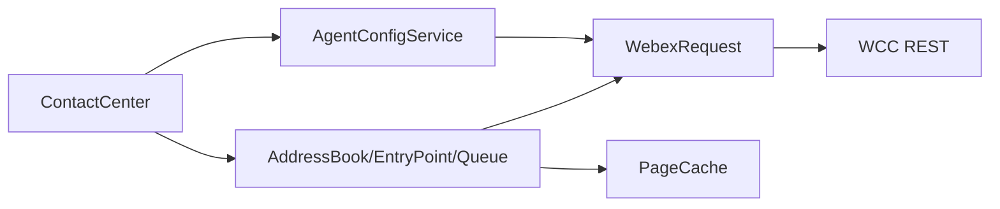
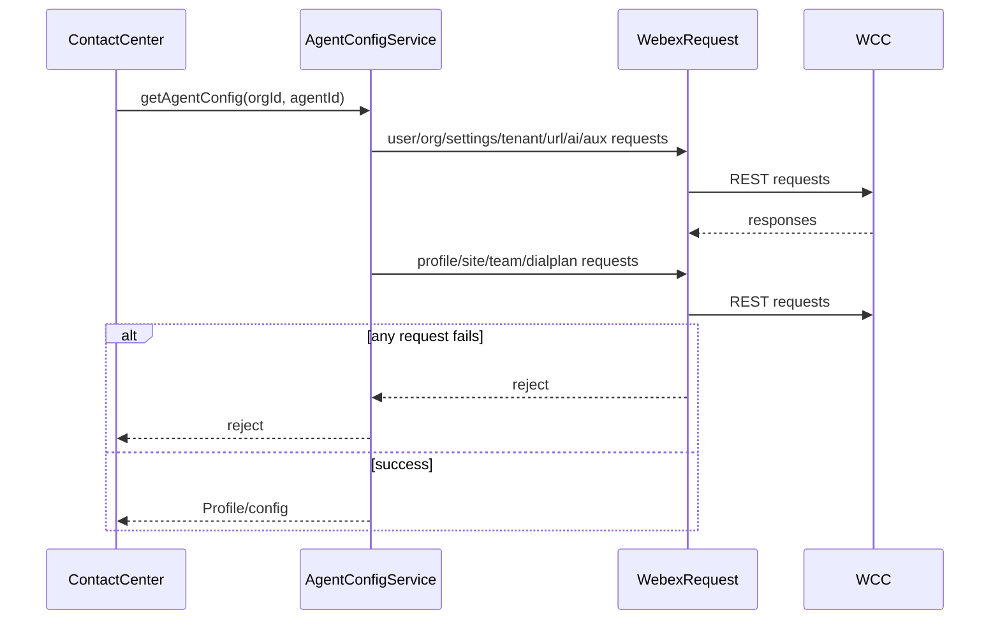
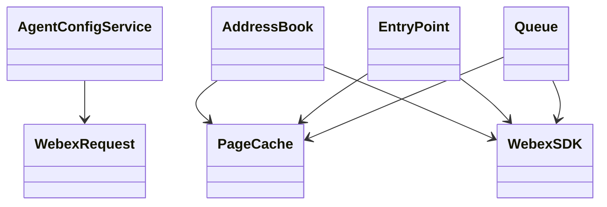

# Configuration And Lookup APIs - SPEC

> Canonical spec for `src/services/config/`, lookup service files, and `PageCache`. Router: [SPEC_INDEX.md](../../../../ai-docs/SPEC_INDEX.md).

## Metadata
| Field | Value |
|---|---|
| Module id | `configuration-lookup-apis` |
| Source path(s) | `src/services/config/`; `src/services/AddressBook.ts`; `src/services/EntryPoint.ts`; `src/services/Queue.ts`; `src/utils/PageCache.ts`; `src/cc.ts` |
| Doc kind | Module spec |
| Coverage score | 84%; bootstrap coverage review |
| Generated from | `module-spec` @ SDLC template library `0.2.0` |
| generated_by / approved_by / updated_at | Codex / user questionnaire / 2026-06-30 |
| Validation status | local conformance pass; independent validator not-run |

## Evidence Rules
Requirements cite source and tests by path. WCC response schemas are represented by local TypeScript types; no native schema file was found.

## Source Material Register
| Source doc | Scope | Decision | Detail location or disposition |
|---|---|---|---|
| `typedoc.md` | lookup examples | reference-only | public lookup methods indexed in `CONTRACTS.md` |

## Overview
This module gathers package configuration and lookup behavior. `AgentConfigService` fetches user, org, desktop profile, multimedia profile, site, team, aux-code, tenant, URL mapping, AI feature, dial plan, and outdial ANI data. `AddressBook`, `EntryPoint`, and `Queue` expose paginated lookup APIs. `PageCache` provides simple in-memory pagination caching used by lookup services.

The module reads remote WCC configuration and lookup data. It does not own or persist those records.

## Purpose / Responsibility
Own client-side retrieval, composition, and caching of WCC configuration and lookup data needed by Contact Center flows.

## Stack
TypeScript services over `WebexRequest`; Jest tests under `test/unit/spec/services/config/` and service lookup tests.

## Folder / Package Structure
```text
src/services/config/
|- index.ts       # AgentConfigService and WCC config fetches
|- Util.ts        # config parsing helpers
|- constants.ts   # config constants
`- types.ts       # config, events, and lookup types
src/services/
|- AddressBook.ts # address book paginated lookup
|- EntryPoint.ts  # entry point paginated lookup
`- Queue.ts       # queue paginated lookup
src/utils/PageCache.ts # reusable in-memory page cache
```

## Key Files
| File | Holds |
|---|---|
| `src/services/config/index.ts` | config fetch orchestration and endpoint calls |
| `src/services/config/types.ts` | Profile, events, config, and lookup types |
| `src/services/AddressBook.ts` | address book API |
| `src/services/EntryPoint.ts` | entry point API |
| `src/services/Queue.ts` | queue API |
| `src/utils/PageCache.ts` | pagination defaults, cache keys, TTL, cache operations |
| `test/unit/spec/services/config/index.ts` | config tests |
| `test/unit/spec/services/AddressBook.ts`; `EntryPoint.ts`; `Queue.ts` | lookup tests |

## Public Surface
| Contract ID | Type | Surface | Purpose | Compatibility / deprecation | Schema / detail link | Root index |
|---|---|---|---|---|---|---|
| `config.AgentConfigService` | internal class | config fetch methods | compose profile/config for registration | behavior-visible through `register()` | `src/services/config/index.ts` | `../../../../ai-docs/CONTRACTS.md` |
| `lookup.AddressBook` | SDK class | `getEntries(params)` | fetch address book entries | public export | `src/services/AddressBook.ts` | `../../../../ai-docs/CONTRACTS.md` |
| `lookup.EntryPoint` | facade/class | `getEntryPoints(params)` | fetch entry points | public facade through `ContactCenter` | `src/services/EntryPoint.ts`; `src/cc.ts` | `../../../../ai-docs/CONTRACTS.md` |
| `lookup.Queue` | facade/class | `getQueues(params)` | fetch queues | public facade through `ContactCenter` | `src/services/Queue.ts`; `src/cc.ts` | `../../../../ai-docs/CONTRACTS.md` |
| `config.outdialAni` | facade method | `getOutdialAniEntries(params)` | fetch outdial ANI entries | public facade | `src/services/config/index.ts`; `src/cc.ts` | `../../../../ai-docs/CONTRACTS.md` |
| `config.events` | event enums | `CC_EVENTS`, `CC_TASK_EVENTS`, `CC_AGENT_EVENTS` | WCC bridge event names, including transcript and handoff summary bridge events | compatibility-sensitive | `src/services/config/types.ts` | `../../../../ai-docs/CONTRACTS.md` |

## Requires
- `WebexRequest` and Webex credentials/org context.
- WCC API gateway resources for user config, org info/settings, tenant data, URL mapping, profiles, teams, aux codes, AI features, dial plan, outdial ANI, address book, entry points, and queues.
- Page/search/filter/sort inputs from SDK consumers.

## Requirements
| ID | WHAT | WHY | Source Evidence | Test / Example Evidence | Assumptions / Gaps | Confidence |
|---|---|---|---|---|---|---|
| CFG-R-001 | `AgentConfigService` must compose profile/config by fetching user, org, tenant, URL mapping, AI feature, aux codes, desktop profile, site, dial plan, team, and multimedia profile data as applicable. | `ContactCenter.register()` depends on a complete profile/config snapshot. | `src/services/config/index.ts`; `src/services/config/Util.ts`; `src/services/config/types.ts` | `test/unit/spec/services/config/index.ts` | WCC schema external | PRESENT |
| CFG-R-002 | Config list fetches must handle pagination for teams and aux codes where total pages are reported. | Agent profile setup needs full lists, not only first page. | `src/services/config/index.ts` | `test/unit/spec/services/config/index.ts` | backend page metadata external | PRESENT |
| CFG-R-003 | Outdial ANI entries must preserve query parameter support for page, pageSize, search, filter, and attributes. | Consumers need filtered ANI selection. | `src/services/config/index.ts`; `src/cc.ts` | `test/unit/spec/services/config/index.ts`; `test/unit/spec/cc.ts` | none | PRESENT |
| CFG-R-004 | AddressBook, EntryPoint, and Queue lookups must use PageCache keying that includes query-shaping parameters. | Prevents serving stale/wrong page data for different filters/searches. | `src/services/AddressBook.ts`; `src/services/EntryPoint.ts`; `src/services/Queue.ts`; `src/utils/PageCache.ts` | `test/unit/spec/services/AddressBook.ts`; `EntryPoint.ts`; `Queue.ts` | none | PRESENT |
| CFG-R-005 | PageCache must remain in-memory, TTL-bound, and non-durable. | The package does not own backend data or persistence. | `src/utils/PageCache.ts` | lookup tests | none | PRESENT |
| CFG-R-006 | Config event enums must remain stable because task and agent modules map WCC messages through them. | Event renames break consumers and TaskManager routing. | `src/services/config/types.ts`; `src/services/task/TaskManager.ts`; `src/services/agent/index.ts` | `test/unit/spec/services/task/TaskManager.ts`; `test/unit/spec/services/agent/index.ts` | none | PRESENT |
| CFG-R-007 | `CC_TASK_EVENTS` must include backend handoff summary bridge event names used by TaskManager: `MID_CALL_SUMMARY`, `MID_CALL_SUMMARY_RESPONSE_SUBSEQUENT_AGENT`, and optional `FEATURE_ENABLEMENT`. | Handoff summary websocket messages need stable enum keys before they can be routed to SDK task events. | `src/services/config/types.ts`; `src/services/task/TaskManager.ts` | `test/unit/spec/services/task/TaskManager.ts` | backend payload schema external | PRESENT |

## Design Overview
The module splits broad profile/config composition from individual lookup APIs. `AgentConfigService` is a sequential/concurrent orchestrator that fetches remote resources and parses a profile. Lookup classes focus on one resource each and share `PageCache` behavior.

This avoids a durable local model and keeps WCC as system-of-record.

## Data Flow


## Sequence Diagrams
| Operation group | Diagram | Failure / recovery coverage |
|---|---|---|
| register config load | multi-resource fetch | request failure |
| paginated lookup | cache then fetch | cache miss/expiry and request failure |



## Class / Component Relationships


## Use Cases
- UC-1 Register profile load: ContactCenter asks AgentConfigService for full config and profile. Evidence: `src/cc.ts`, `src/services/config/index.ts`.
- UC-2 Fetch entry points/queues: consumer calls facade method; lookup service checks cache and requests WCC when needed. Evidence: `src/cc.ts`, `src/services/EntryPoint.ts`, `src/services/Queue.ts`.
- UC-3 Fetch address book entries: consumer creates/uses AddressBook and calls `getEntries`. Evidence: `src/services/AddressBook.ts`.
- UC-4 Fetch outdial ANI: facade calls config service with query params. Evidence: `src/cc.ts`, `src/services/config/index.ts`.

## State Model
- `PageCache` holds cache entries with timestamp and paginated response data.
- `AgentConfigService` does not persist state beyond method-local composition.
- Lookup classes own their cache instance for the resource.

## Business Rules & Invariants
- WCC remains system-of-record for config and lookup data.
- Cache keys must include every query parameter that changes response identity.
- Cache TTL default is 5 minutes unless code changes the constant and tests/specs together.

## Concurrency & Reactive Flow
- AgentConfigService fetches independent config resources concurrently where code uses `Promise` composition.
- Pagination fan-out for teams/aux codes uses concurrent page requests after first page metadata.

## Protocol / Wire Format
- WCC REST resource paths are owned by endpoint maps in config/lookup implementation.
- SDK-facing config events are TypeScript enums in `config/types.ts`.

## Data Model
- Profile includes agent, team, profile, site, aux-code, dial-plan, tenant, URL, and feature-flag data assembled from WCC resources.
- Lookup responses are paginated response objects with metadata represented by local TypeScript types.

## Error Handling & Failure Modes
| Condition | Signal | Caller recovery |
|---|---|---|
| WCC config request fails | rejected promise | register should fail and surface error |
| page request fails | rejected promise | retry with same query after network/service check |
| stale cache | entry expires by TTL | fetch fresh page |
| wrong cache key | wrong data served | preserve key construction tests |

## Pitfalls
- Do not add a query parameter without adding it to cache key construction.
- Do not treat cached lookup data as authoritative after TTL.
- Do not invent local schema ownership for WCC config resources.

## Key Design Trade-off
- Simple in-memory page caching reduces repeated lookup calls without introducing durable state. It costs callers strong consistency until TTL expiry.

## Test-Case Strategy
Tests should cover config fetch composition, paginated list behavior, query string construction, cache hit/miss/expiry, and error propagation.

| Behavior / Requirement | Existing test evidence | Gap |
|---|---|---|
| CFG-R-001 to CFG-R-003 | `test/unit/spec/services/config/index.ts`; `test/unit/spec/cc.ts` | WCC schema variants external |
| CFG-R-004, CFG-R-005 | `test/unit/spec/services/AddressBook.ts`; `EntryPoint.ts`; `Queue.ts` | direct PageCache unit file not present |
| CFG-R-006 | `test/unit/spec/services/task/TaskManager.ts`; `test/unit/spec/services/agent/index.ts` | none |

## Traceability
- Repo architecture: `../../../../ai-docs/ARCHITECTURE.md`
- Registry: `../../../../ai-docs/SPEC_INDEX.md`
- Coverage state and contracts baseline: package SDD baseline.
