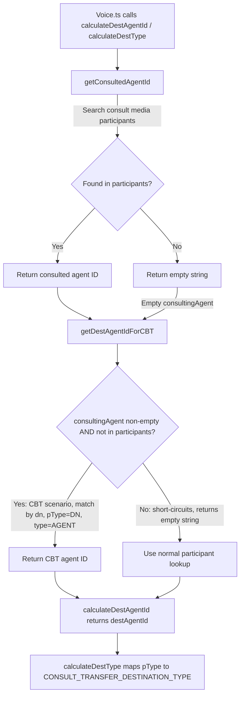

# Core Service - AI Agent Guide

> **This is the authoritative documentation for the Core service scope.** Core infrastructure components including WebSocket management, HTTP requests, error handling, and utilities. For task routing, critical rules, and cross-service patterns, see the [root orchestrator AGENTS.md](../../../AGENTS.md).

---

## Key Capabilities

The Core service provides the foundational infrastructure layer that all other services depend on:

- **WebSocket Communication**: Real-time bidirectional messaging with the contact center backend, including automatic reconnection and keepalive management
- **HTTP Request Handling**: Authenticated REST API calls to WCC API Gateway with built-in error handling and log upload support
- **AQM Request/Response Pattern**: A structured pattern used by the routing and contact layers to send HTTP requests to the contact center backend and correlate responses/failures via WebSocket notifications
- **Error Handling & Logging**: Standardized error extraction, logging via `LoggerProxy`, and log upload utilities that all services use for consistent error reporting

| Component | File | Description |
|-----------|------|-------------|
| `WebSocketManager` | [`WebSocketManager.ts`](../websocket/WebSocketManager.ts) | Manages the WebSocket connection lifecycle including initialization, message dispatch, and graceful shutdown. Emits `message` events for incoming data and `socketClose` when the connection drops while reconnect is allowed. |
| `ConnectionService` | [`connection-service.ts`](../websocket/connection-service.ts) | Orchestrates reconnection logic and keepalive heartbeats on top of `WebSocketManager`. Detects connection loss and triggers `silentRelogin()` to restore agent state transparently. |
| `WebexRequest` | [`WebexRequest.ts`](../WebexRequest.ts) | Singleton HTTP client that wraps authenticated requests to the WCC API Gateway. Handles service routing, response parsing, and provides a `uploadLogs` method for diagnostics. |
| `AqmReqs` | [`aqm-reqs.ts`](../aqm-reqs.ts) | Factory for creating request methods that send HTTP requests and wait for correlated WebSocket notifications (success or failure). Used by routing and task services to implement their API methods. |
| `Utils` | [`Utils.ts`](../Utils.ts) | Shared utility functions including error handling (`getErrorDetails()`, `generateTaskErrorObject()`, `createErrDetailsObject()`), consult/transfer destination resolution (`calculateDestAgentId()`, `calculateDestType()`, `buildConsultConferenceParamData()`, `deriveConsultTransferDestinationType()`), dial number validation (`isValidDialNumber()`), and station login error mapping (`getStationLoginErrorData()`). |
| `Err` | [`Err.ts`](../Err.ts) | Error class definitions. `Err.Details` carries structured error metadata (status, type, trackingId) for consistent error propagation. |
| `constants` | [`constants.ts`](../constants.ts) | Timeout values, interval durations, participant types, interaction states, and method name constants used throughout the core layer. Any new constants for core should be defined here. |

---

## File Structure

```
services/core/
├── aqm-reqs.ts           # AQM request handler
├── constants.ts          # Core constants
├── Err.ts                # Error classes
├── GlobalTypes.ts        # Failure, Msg<T>, etc.
├── types.ts              # Request/response types
├── Utils.ts              # Utility functions
├── WebexRequest.ts       # HTTP client
└── websocket/
    ├── WebSocketManager.ts    # Main WS handler
    ├── connection-service.ts  # Connection lifecycle
    ├── keepalive.worker.js    # Keepalive worker
    └── types.ts               # WS types
```

---


## WebSocketManager

`WebSocketManager` handles the raw WebSocket connection to the contact center backend. It is instantiated by the `Services` layer and used internally — other services interact with it through `ConnectionService`.

### Reference Usage

```typescript
// Initialize in Services
this.webSocketManager = new WebSocketManager({webex});

// Connect
const welcomeEvent = await webSocketManager.initWebSocket({
  body: connectionConfig,
});

// Listen for messages
webSocketManager.on('message', (event) => {
  const data = JSON.parse(event);
  // Handle event
});

// Close
webSocketManager.close(false, 'Reason');
```

### Events

| Event | Data | Description |
|-------|------|-------------|
| `message` | string (JSON) | WebSocket message received |
| `socketClose` | - | Socket closed while reconnect is allowed |

### Connection Lifecycle

`WebSocketManager` and `ConnectionService` work together to manage the full connection lifecycle. `WebSocketManager` owns the raw socket while `ConnectionService` adds reconnection intelligence and keepalive on top.

**Connection Flow:**

```
1. initWebSocket() called
2. ConnectionService listeners attached (`message`, `socketClose`) during construction
3. WebSocket connects to backend
4. Keepalive worker started on `onopen`
5. Welcome event received
6. Runtime messages/keepalive processed via existing listeners
```

**Reconnection Flow:**

```
1. Connection lost detected
2. ConnectionService emits 'connectionLost'
3. cc.handleConnectionLost() called
4. silentRelogin() attempted
5. On success: state restored
6. On AGENT_NOT_FOUND: handle silently
```

### Keepalive

A Web Worker ([`keepalive.worker.js`](../websocket/keepalive.worker.js)) runs alongside the WebSocket to detect connection loss and keep the socket alive. It starts on `onopen` and sends `{keepalive: 'true'}` to the backend every **4 seconds** (`KEEPALIVE_WORKER_INTERVAL`). The worker also monitors `navigator.onLine` — if the network goes offline and the socket doesn't close within **16 seconds** (`CLOSE_SOCKET_TIMEOUT`), it force-closes the socket.

On the receiving side, `ConnectionService.onPing()` listens for all WebSocket messages and resets two timers on each message:
- **`reconnectingTimer`** (8s / `WS_DISCONNECT_ALLOWED`) — if no message arrives within 8s, marks connection as lost
- **`restoreTimer`** (`lostConnectionRecoveryTimeout` from agent config) — if connection isn't restored within this window, marks restore as failed

When a keepalive response arrives after a lost-connection state, `ConnectionService` resets its flags and dispatches a recovery event. If the socket fully closes, `ConnectionService` retries `initWebSocket()` every **5 seconds** (`CONNECTIVITY_CHECK_INTERVAL`).

---

## WebexRequest

`WebexRequest` is a singleton HTTP client that all services use to make authenticated REST API calls to the contact center backend. It handles service URL resolution, request formatting, and response parsing.

### The `service` Property

The `service` field in request options is a **service identifier string** that the Webex SDK's internal service catalog (`this.webex.request()`) resolves to a base URL at runtime. All contact center API calls use:

```typescript
import {WCC_API_GATEWAY} from '../constants';
// WCC_API_GATEWAY = 'wcc-api-gateway'
```

This constant is defined in [`services/constants.ts`](../../constants.ts). The Webex SDK maps `'wcc-api-gateway'` to the appropriate contact center API gateway URL based on the environment. The `resource` is then appended as the path.

### Reference Usage

```typescript
// Get singleton
const webexReq = WebexRequest.getInstance({webex});

// Make request
const response = await webexReq.request({
  service: WCC_API_GATEWAY,  // resolved to base URL by Webex SDK
  resource: '/v1/endpoint',  // appended as path
  method: HTTP_METHODS.POST,
  body: { key: 'value' },   // optional request payload
});

// Upload logs
await webexReq.uploadLogs({
  correlationId: trackingId,
});
```

### Response Structure

```typescript
{
  statusCode: 200,
  body: { /* response data */ },
  headers: {
    trackingid: 'uuid',
  },
}
```

---

## AqmReqs

The AQM (Agent Queue Manager) layer provides a request/response pattern over HTTP + WebSocket. Services like **routing** and **contact** use `AqmReqs` to define API methods that:

1. Send an HTTP request to the contact center backend via `WebexRequest`
2. Wait for a correlated WebSocket notification indicating success or failure
3. Return the typed result or throw a structured error

This decouples the request initiation (HTTP) from the asynchronous result delivery (WebSocket), which matches the contact center backend's event-driven architecture.

### Reference Usage

```typescript
// Define request configuration
const serviceMethod = routing.req((p: {data: ParamType}) => ({
  url: '/v1/endpoint',
  host: WCC_API_GATEWAY,
  data: p.data,
  method: HTTP_METHODS.POST,
  err: errorHandler,
  notifSuccess: {
    bind: {type: CC_EVENTS.SUCCESS, data: {type: CC_EVENTS.SUCCESS}},
    msg: {} as SuccessType,
  },
  notifFail: {
    bind: {type: CC_EVENTS.FAIL, data: {type: CC_EVENTS.FAIL}},
    errId: 'Service.aqm.operation',
  },
}));

// Call method
const result = await serviceMethod({data: params});
```

---

## Error Handling Utilities

### `getErrorDetails()`

Standard error handler for SDK operations:

```typescript
import {getErrorDetails} from './services/core/Utils';

try {
  await operation();
} catch (error) {
  const {error: detailedError, reason} = getErrorDetails(
    error,
    'methodName',  // Method name for logging
    'ModuleName'   // Module name for logging
  );

  // getErrorDetails automatically:
  // 1. Logs the error
  // 2. Uploads logs (unless AGENT_NOT_FOUND in silentRelogin)
  // 3. Extracts reason from error.details
  // 4. Creates Error with reason as message
  // 5. Attaches err.data = {message, fieldName} (populated for stationLogin errors)

  throw detailedError;
}
```

### `generateTaskErrorObject()`

Error handler for task operations:

```typescript
import {generateTaskErrorObject} from './services/core/Utils';

try {
  await taskOperation();
} catch (error) {
  const taskError = generateTaskErrorObject(
    error,
    'transfer',
    'TaskModule'
  );

  // generateTaskErrorObject automatically:
  // 1. Logs the error with method, module, trackingId
  // 2. Uploads logs (always — no exceptions unlike getErrorDetails)
  // 3. Extracts errorMessage, errorType, errorData, reasonCode from error.details.msg
  // 4. Creates AugmentedError with .data containing:
  //    { message, errorType, errorData, reasonCode, trackingId }

  throw taskError;
}
```

---

## Validation Utilities

### `isValidDialNumber()`

Validates whether a given string matches a US/Canada dial number format. Used by `cc.ts` to validate dial numbers before station login.

```typescript
import {isValidDialNumber} from './services/core/Utils';

const isValid = isValidDialNumber('14155551234');
// Returns true for valid US/Canada numbers matching: 1[0-9]{3}[2-9][0-9]{6}
```

| Parameter | Type | Description |
|-----------|------|-------------|
| `input` | `string` | The dial number string to validate |
| **Returns** | `boolean` | `true` if the input matches the US/Canada dial number pattern |

### `getStationLoginErrorData()`

Maps station login failure error codes to user-facing messages and field names. Called internally by `getErrorDetails()` when `methodName` is `'stationLogin'`.

```typescript
// Called internally by getErrorDetails for stationLogin errors:
const errData = getStationLoginErrorData(failure, LoginOption.AGENT_DN);
// Returns { message: 'Dial number is in use...', fieldName: 'AGENT_DN' }
```

| Parameter | Type | Description |
|-----------|------|-------------|
| `failure` | `Failure` | The failure response from the backend |
| `loginOption` | `LoginOption` | The login option type (`EXTENSION` or `AGENT_DN`) |
| **Returns** | `{message: string, fieldName: string}` | User-facing error message and the field that caused the error |

**Error Code Mapping:**

| Error Code | LoginOption.EXTENSION Message | LoginOption.AGENT_DN Message |
|------------|-------------------------------|------------------------------|
| `DUPLICATE_LOCATION` | "This extension is already in use" | "Dial number is in use. Try a different one..." |
| `INVALID_DIAL_NUMBER` | "Enter a valid US dial number..." | "Enter a valid US dial number..." |
| *(other)* | "An error occurred while logging in to the station" | "An error occurred while logging in to the station" |

---

## Consult & Transfer Utilities

These utility functions handle destination resolution for consult, transfer, and conference operations. They are primarily consumed by [`Voice.ts`](../../task/voice/Voice.ts) to determine where consult transfers and conferences should be routed.

### Destination Resolution Flow



### `getConsultedAgentId()`

Finds the consulted agent by searching consult media participants (those with `mType === STATE_CONSULT`), excluding the current agent.

```typescript
import {getConsultedAgentId} from './services/core/Utils';

const consultedId = getConsultedAgentId(interaction.media, currentAgentId);
// Returns the other participant's ID from the consult media channel
```

| Parameter | Type | Description |
|-----------|------|-------------|
| `media` | `Interaction['media']` | The media object from the interaction |
| `agentId` | `string` | The current agent's ID to exclude from the search |
| **Returns** | `string` | The consulted participant ID, or empty string if none found |

### `getDestAgentIdForCBT()`

Handles Capacity Based Team (CBT) scenarios where the consulting agent is not directly listed in participants by key. CBT teams use capacity-based routing in Control Hub, which means the agent's participant key may differ from their `dn`. This function matches by dial number (`dn`) with `pType: 'DN'` and `type: 'AGENT'`.

```typescript
import {getDestAgentIdForCBT} from './services/core/Utils';

const cbtAgentId = getDestAgentIdForCBT(interaction, consultingAgentDn);
// Returns the participant key for the CBT agent, or empty string
```

| Parameter | Type | Description |
|-----------|------|-------------|
| `interaction` | `Interaction` | The full interaction object |
| `consultingAgent` | `string` | The consulting agent identifier (typically a dial number) |
| **Returns** | `string` | The destination agent ID for CBT scenarios, or empty string if not a CBT scenario |

### `calculateDestAgentId()`

Orchestrator function that combines `getConsultedAgentId()` and `getDestAgentIdForCBT()` to determine the final destination agent ID for consult operations. Handles CBT vs normal flow, and resolves EP-DN (entry point) participants to their `epId`.

```typescript
import {calculateDestAgentId} from './services/core/Utils';

// Used in Voice.ts for consult transfer
const destAgentId = calculateDestAgentId(interaction, currentAgentId);
```

| Parameter | Type | Description |
|-----------|------|-------------|
| `interaction` | `Interaction` | The full interaction object |
| `agentId` | `string` | The current agent's ID |
| **Returns** | `string` | The resolved destination agent ID |

**Resolution order:**
1. Find consulted agent via `getConsultedAgentId()`
2. Check CBT scenario via `getDestAgentIdForCBT()` — if found, return CBT ID
3. Look up participant directly — if `type === 'EP-DN'`, return `epId`
4. Otherwise return `participant.id`

### `calculateDestType()`

Determines the destination type for a consult transfer by resolving the participant's `pType` to a `CONSULT_TRANSFER_DESTINATION_TYPE` constant. Uses the same CBT fallback pattern as `calculateDestAgentId()`.

```typescript
import {calculateDestType} from './services/core/Utils';

const destType = calculateDestType(interaction, currentAgentId);
// Returns: 'dialNumber' | 'entryPoint' | 'agent' | other pType lowercase
```

| Parameter | Type | Description |
|-----------|------|-------------|
| `interaction` | `Interaction` | The full interaction object |
| `agentId` | `string` | The current agent's ID |
| **Returns** | `string` | The destination type mapped from participant `pType` |

**pType Mapping:**

| Participant `pType` | Returned Destination Type |
|---------------------|--------------------------|
| `'DN'` | `CONSULT_TRANSFER_DESTINATION_TYPE.DIALNUMBER` |
| `'EP-DN'` | `CONSULT_TRANSFER_DESTINATION_TYPE.ENTRYPOINT` |
| Other (e.g. `'Agent'`) | Lowercased `pType` value |
| Not found | `CONSULT_TRANSFER_DESTINATION_TYPE.AGENT` (default) |

### `buildConsultConferenceParamData()`

Builds normalized parameters for consult and conference API calls. Normalizes various `destinationType` string formats into canonical `DESTINATION_TYPE` constants.

```typescript
import {buildConsultConferenceParamData} from './services/core/Utils';

// Used in Voice.ts before making consult/conference API calls
const {interactionId, data} = buildConsultConferenceParamData(
  {destAgentId: 'agent-123', destinationType: 'DN', agentId: 'current-agent'},
  'interaction-456'
);
// data = { agentId: 'current-agent', to: 'agent-123', destinationType: 'dialNumber' }
```

| Parameter | Type | Description |
|-----------|------|-------------|
| `dataPassed` | `consultConferencePayloadData` | The payload data containing `destAgentId`, optional `destinationType`, and optional `agentId` |
| `interactionIdPassed` | `string` | The interaction ID |
| **Returns** | `{interactionId: string, data: ConsultConferenceData}` | Normalized parameters ready for the API call |

**destinationType Normalization:**

| Input Variations | Normalized To |
|------------------|---------------|
| `'DN'`, `'dialNumber'`, `'dial-number'` | `DESTINATION_TYPE.DIALNUMBER` |
| `'EP-DN'`, `'entryPoint'`, `'entry-point'` | `DESTINATION_TYPE.ENTRYPOINT` |
| `'QUEUE'`, `'queue'` | `DESTINATION_TYPE.QUEUE` |
| `'AGENT'`, `'agent'` | `DESTINATION_TYPE.AGENT` |
| *(not provided)* | `DESTINATION_TYPE.AGENT` (default) |

### `deriveConsultTransferDestinationType()`

Derives the consult transfer destination type from task data. Uses the same normalization pattern as `buildConsultConferenceParamData()` but reads from `TaskData.destinationType` and maps to `CONSULT_TRANSFER_DESTINATION_TYPE` constants.

```typescript
import {deriveConsultTransferDestinationType} from './services/core/Utils';

const destType = deriveConsultTransferDestinationType(taskData);
// Returns a CONSULT_TRANSFER_DESTINATION_TYPE value
```

| Parameter | Type | Description |
|-----------|------|-------------|
| `taskData` | `TaskData` | The task data containing destination information |
| **Returns** | `ConsultTransferDestinationType` | The derived destination type |

---

## Utils Consumer Map

Shows which modules import each utility function from [`Utils.ts`](../Utils.ts):

| Function | Imported By |
|----------|------------|
| `getErrorDetails` | [`cc.ts`](../../../cc.ts), [`Task.ts`](../../task/Task.ts), [`Digital.ts`](../../task/digital/Digital.ts), [`Voice.ts`](../../task/voice/Voice.ts), [`WebRTC.ts`](../../task/voice/WebRTC.ts) |
| `createErrDetailsObject` | [`agent/index.ts`](../../agent/index.ts) (aliased as `err`), [`contact.ts`](../../task/contact.ts) (aliased as `err`), [`dialer.ts`](../../task/dialer.ts) (aliased as `err`) |
| `generateTaskErrorObject` | Exported, not currently imported (available for task-specific error handling) |
| `isValidDialNumber` | [`cc.ts`](../../../cc.ts) |
| `buildConsultConferenceParamData` | [`Voice.ts`](../../task/voice/Voice.ts) |
| `calculateDestAgentId` | [`Voice.ts`](../../task/voice/Voice.ts) |
| `calculateDestType` | [`Voice.ts`](../../task/voice/Voice.ts) |
| `getStationLoginErrorData` | Exported, called only within Utils.ts by `getErrorDetails()` |
| `getConsultedAgentId` | Exported, called only within Utils.ts by `calculateDestAgentId()` and `calculateDestType()` |
| `getDestAgentIdForCBT` | Exported, called only within Utils.ts by `calculateDestAgentId()` and `calculateDestType()` |
| `deriveConsultTransferDestinationType` | Exported, not currently imported (available for consult transfer flows) |

---

## Type Definitions

### Msg\<T\>

Generic message wrapper used throughout the SDK. All WebSocket messages and AQM responses conform to this shape:

```typescript
export type Msg<T = any> = {
  type: string;       // Message/Event type identifier
  orgId: string;      // Organization identifier
  trackingId: string; // Unique tracking identifier
  data: T;            // Message/Event payload data
};

// Usage — the payload type goes into `data`
export type LoginSuccess = Msg<{
  agentId: string;
  status: string;
  // ...
}>;
// Resulting shape: { type, orgId, trackingId, data: { agentId, status, ... } }
```

### Failure

A specific `Msg<T>` for failure responses. Access error details via `failure.data`:

```typescript
export type Failure = Msg<{
  agentId: string;
  trackingId: string;
  reasonCode: number;
  orgId: string;
  reason: string;
}>;

// Usage in catch
const failure = error.details as Failure;
LoggerProxy.error(`Operation failed: ${failure.data?.reason}`, {
  module: 'MyService',
  method: 'myMethod',
  trackingId: failure?.trackingId,
});
```

### AugmentedError

Error interface with a flexible data field for additional context:

```typescript
export interface AugmentedError extends Error {
  data?: Record<string, any>;
}
```

---

## Error Classes

### Err.Details

```typescript
import * as Err from './Err';

const error = new Err.Details('Service.aqm.agent.login', {
  status: 401,
  type: 'UNAUTHORIZED',
  trackingId: 'uuid',
});
```

### createErrDetailsObject

```typescript
import {createErrDetailsObject} from './Utils';

const errDetails = createErrDetailsObject(webexRequestPayload);
// Returns Err.Details with trackingId and body
```

---

## Constants

All core-level constants (timeouts, intervals, participant types, method names) are defined in [`constants.ts`](../constants.ts). Any new constants for the core layer should be added there.

---

## Best Practices

### Always Use Error Utilities

```typescript
// Correct
const {error: detailedError} = getErrorDetails(error, method, module);
throw detailedError;

// Wrong - loses context
throw error;
```

### Check Response Status

```typescript
const response = await webexReq.request({...});

if (response.statusCode !== 200) {
  throw new Error(`API call failed with ${response.statusCode}`);
}
```

### Extract TrackingId

```typescript
const trackingId = response.headers?.trackingid ||
                   response.headers?.TrackingID;
```

---

## Related

- [Root Orchestrator AGENTS.md](../../../AGENTS.md) - Task routing, critical rules, cross-service patterns
- [WebSocketManager.ts](../websocket/WebSocketManager.ts)
- [WebexRequest.ts](../WebexRequest.ts)
- [Utils.ts](../Utils.ts)
- [GlobalTypes.ts](../GlobalTypes.ts)
