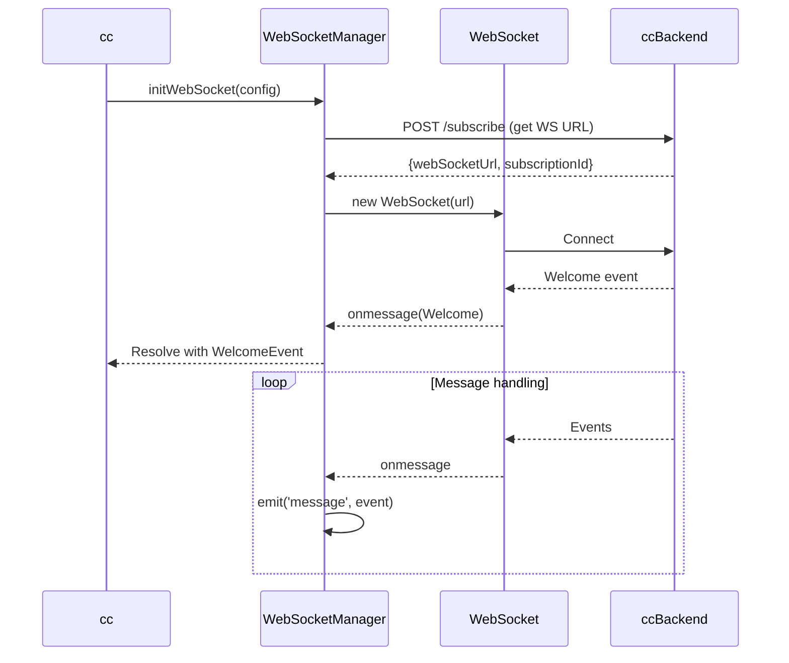
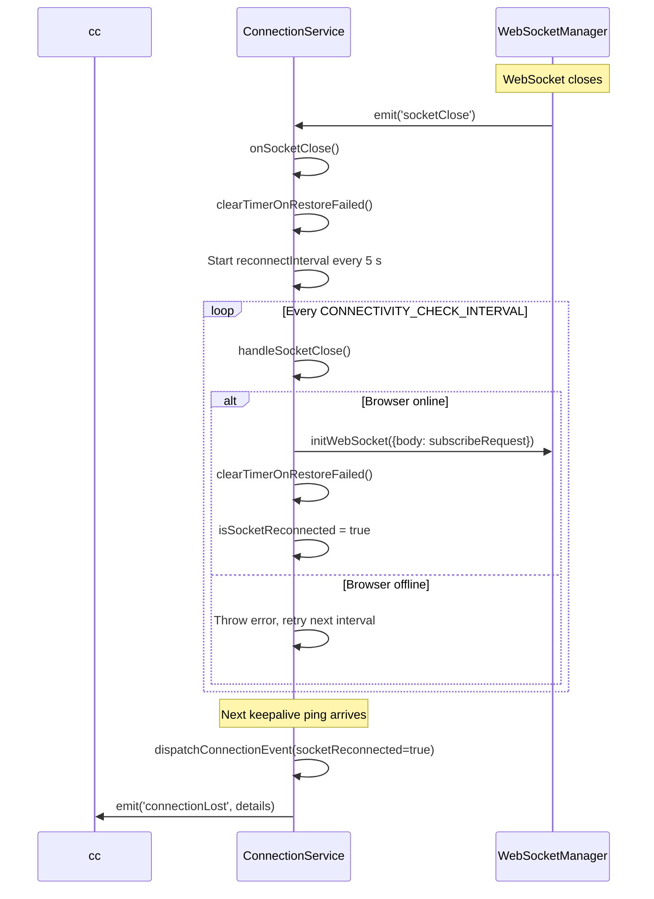
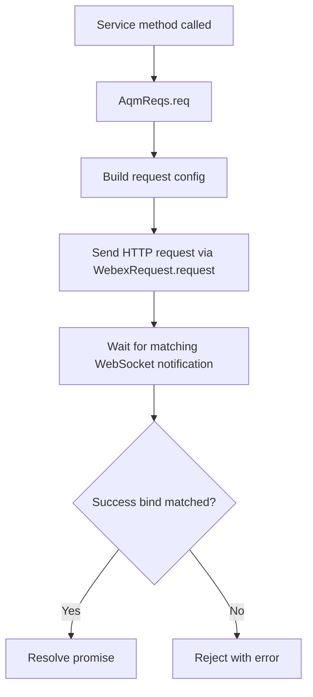
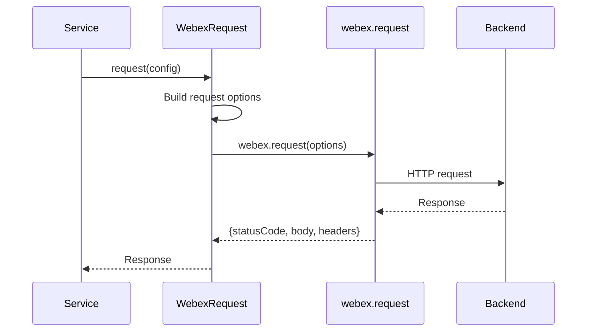
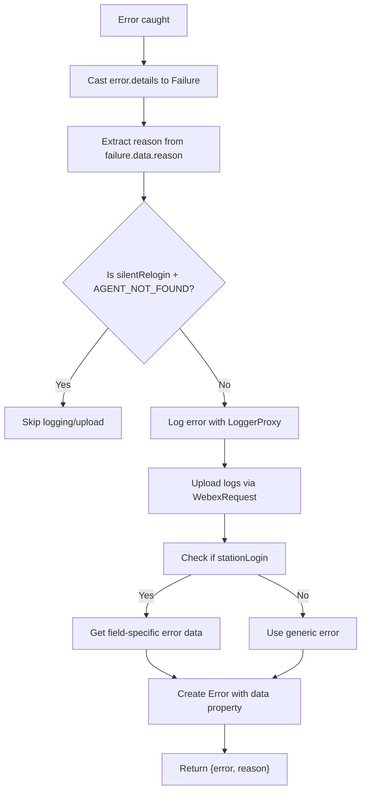

# Core Service - Architecture

> **Purpose**: Technical documentation for core infrastructure components.

---

## WebSocketManager

### Connection Sequence



---

## ConnectionService

Monitors WebSocket health via keepalive messages, detects disconnections, triggers reconnection attempts, and emits connection state events to the application layer. Extends `EventEmitter`.

### Constructor

```typescript
constructor(options: ConnectionServiceOptions)

type ConnectionServiceOptions = {
  webSocketManager: WebSocketManager;
  subscribeRequest: SubscribeRequest;
};
```

The constructor wires up two listeners on `WebSocketManager`:

- `'message'` → `onPing` (resets disconnect/restore timers on every incoming message)
- `'socketClose'` → `onSocketClose` (starts the reconnection interval)

### Key Constants

| Constant                           | Value     | Purpose                                      |
| ---------------------------------- | --------- | -------------------------------------------- |
| `LOST_CONNECTION_RECOVERY_TIMEOUT` | 50 000 ms | Max wait before declaring restore failed     |
| `WS_DISCONNECT_ALLOWED`            | 8 000 ms  | Grace period before flagging connection lost |
| `CONNECTIVITY_CHECK_INTERVAL`      | 5 000 ms  | Interval between reconnection attempts       |

### Methods

The only public method is `setConnectionProp`. All other methods are private implementation details — listed here for architectural understanding, not as extension points.

```typescript
export class ConnectionService extends EventEmitter {
  public setConnectionProp(prop: ConnectionProp): void;

  private setupEventListeners(): void;      // Wires 'message' and 'socketClose' listeners
  private onPing(event: any): void;          // Resets timers on every message, dispatches recovery events
  private onSocketClose(): void;             // Starts reconnect interval on socket close
  private handleSocketClose(): Promise<void>;// Attempts reconnection if browser is online
  private handleConnectionLost(): void;      // Flags connection as lost, dispatches event
  private handleRestoreFailed(): Promise<void>;      // Flags restore failed after timeout
  private clearTimerOnRestoreFailed(): Promise<void>;// Clears the reconnect interval
  private updateConnectionData(): void;      // Resets connection flags to clean state
  private dispatchConnectionEvent(socketReconnected?: boolean): void; // Emits 'connectionLost' event
}
```

### Reconnection Flow



### Events

```typescript
type ConnectionLostDetails = {
  isConnectionLost: boolean;
  isRestoreFailed: boolean;
  isSocketReconnected: boolean;
  isKeepAlive: boolean;
};

connectionService.on('connectionLost', (details: ConnectionLostDetails) => {
  if (details.isConnectionLost) {
    // Connection lost — waiting for recovery
  } else if (details.isRestoreFailed) {
    // Recovery timeout (50 s) exceeded
  } else if (details.isSocketReconnected) {
    // Socket successfully reconnected
  }
});
```

---

## AqmReqs Pattern

### Request/Response Flow



## WebexRequest

### Singleton Pattern

```typescript
class WebexRequest {
  private static instance: WebexRequest;
  private webex: WebexSDK;

  private constructor(options: {webex: WebexSDK}) {}

  public static getInstance(options?: {webex: WebexSDK}): WebexRequest {
    if (!WebexRequest.instance && options && options.webex) {
      WebexRequest.instance = new WebexRequest(options);
    }
    return WebexRequest.instance;
  }

  public async request(options: {
    service: string;
    resource: string;
    method: HTTP_METHODS;
    body?: RequestBody;
  }): Promise<IHttpResponse>;

  public async uploadLogs(metaData: LogsMetaData = {}): Promise<UploadLogsResponse>;
}

export default WebexRequest;
```

### Request Flow



---

## Keepalive Worker

### Purpose

Maintains WebSocket connection with periodic pings and monitors network status. Has a dual role:
1. **Keepalive**: Sends periodic messages to detect connection issues
2. **Network Monitoring**: Tracks online/offline transitions and forces socket closure if offline too long

### Implementation

> **Source**: [`keepalive.worker.js`](../websocket/keepalive.worker.js) — a Web Worker script embedded as a string and loaded via `Blob` + `URL.createObjectURL` in `WebSocketManager`.

#### Worker Message Contract

**Inbound (main thread → worker):**

| Message Type | Fields | Effect |
|---|---|---|
| `start` | `intervalDuration` (default 4000ms), `isSocketClosed`, `closeSocketTimeout` (default 5000ms) | Starts periodic keepalive interval and resets offline handler |
| `terminate` | — | Clears the keepalive interval and resets offline handler |

**Outbound (worker → main thread):**

| Message Type | Fields | Trigger |
|---|---|---|
| `keepalive` | `onlineStatus: boolean` | Every `intervalDuration` ms, and on browser online/offline events |
| `closeSocket` | — | When offline for longer than `closeSocketTimeout` and socket hasn't closed naturally |

#### Key Behavior

1. **Periodic ping**: Every `intervalDuration` ms, calls `checkNetworkStatus()` which posts a `keepalive` message with the current `navigator.onLine` status
2. **Offline detection**: When network goes offline, starts a `closeSocketTimeout` timer. If the socket hasn't closed naturally by then, posts `closeSocket` to force closure
3. **Online/offline listeners**: The worker also listens to browser `online`/`offline` events for immediate network change detection

---

## Error Handling

### Error Types

```typescript
// Msg - Generic message interface (GlobalTypes.ts:7-16)
export type Msg<T = any> = {
  type: string;
  orgId: string;
  trackingId: string;
  data: T;
};

// Failure - Backend error structure (GlobalTypes.ts:23-34)
// Built on Msg<T> with specific error data fields
export type Failure = Msg<{
  agentId: string;
  trackingId: string;
  reasonCode: number;
  orgId: string;
  reason: string;
}>;

// AugmentedError - Extended Error with flexible data field (GlobalTypes.ts:59-61)
export interface AugmentedError extends Error {
  data?: Record<string, any>;
}
```

### getErrorDetails Flow



### getErrorDetails

```typescript
export const getErrorDetails = (error: any, methodName: string, moduleName: string) => {
  let errData = {message: '', fieldName: ''};

  const failure = error.details as Failure;
  const reason = failure?.data?.reason ?? `Error while performing ${methodName}`;

  // Log error (unless AGENT_NOT_FOUND in silentRelogin)
  if (!(reason === 'AGENT_NOT_FOUND' && methodName === 'silentRelogin')) {
    LoggerProxy.error(`${methodName} failed with reason: ${reason}`, {
      module: moduleName,
      method: methodName,
      trackingId: failure?.trackingId,
    });

    // Upload logs
    WebexRequest.getInstance().uploadLogs({
      correlationId: failure?.trackingId,
    });
  }

  // For stationLogin, extract field-specific error data (message + fieldName)
  if (methodName === 'stationLogin') {
    errData = getStationLoginErrorData(failure, error.loginOption);
  }

  const err = new Error(reason);
  // @ts-ignore - custom property for backward compatibility
  err.data = errData;

  return {error: err, reason};
};
```

### generateTaskErrorObject

```typescript
export const generateTaskErrorObject = (
  error: any,
  methodName: string,
  moduleName: string
): AugmentedError => {
  const trackingId = error?.details?.trackingId || error?.trackingId || '';
  const errorMsg = error?.details?.msg;

  const errorMessage = errorMsg?.errorMessage || error.message || 'Error';
  const errorType = errorMsg?.errorType || error.name || 'Unknown Error';
  const errorData = errorMsg?.errorData || '';
  const reasonCode = errorMsg?.reasonCode || 0;

  LoggerProxy.error(`${methodName} failed: ${errorMessage} (${errorType})`, {
    module: moduleName,
    method: methodName,
    trackingId,
  });
  WebexRequest.getInstance().uploadLogs({correlationId: trackingId});

  const reason = `${errorType}: ${errorMessage}${errorData ? ` (${errorData})` : ''}`;
  const err: AugmentedError = new Error(reason);
  err.data = {
    message: errorMessage,
    errorType,
    errorData,
    reasonCode,
    trackingId,
  };

  return err;
};
```

---

## Troubleshooting

### Issue: WebSocket not connecting

**Cause**: Subscribe API failed or invalid URL

**Solution**: Check subscribe response and WebSocket URL

### Issue: Messages not received

**Cause**: Event listener not registered

**Solution**: Ensure `on('message', handler)` called before connect

### Issue: Connection drops frequently

**Cause**: Keepalive not enabled or network issues

**Solution**: Verify worker-driven keepalive is running after socket `onopen`, and check network/offline transitions

---

## Related Files

- [Root Orchestrator AGENTS.md](../../../../AGENTS.md) — Task routing, critical rules, cross-service patterns
- [Core AGENTS.md](./AGENTS.md) — Core service usage guide and modification patterns
- [WebSocketManager.ts](../websocket/WebSocketManager.ts) — WebSocket lifecycle, keepalive worker integration
- [ConnectionService.ts](../websocket/connection-service.ts) — Reconnection logic, connection state events
- [keepalive.worker.js](../websocket/keepalive.worker.js) — Web Worker for periodic keepalive and offline detection
- [WebexRequest.ts](../WebexRequest.ts) — Singleton HTTP request handler
- [Utils.ts](../Utils.ts) — `getErrorDetails` (line 88), `generateTaskErrorObject` (line 143), consult utilities
- [Err.ts](../Err.ts) — `Err.Message` and `Err.Details` error classes
- [aqm-reqs.ts](../aqm-reqs.ts) — AQM request/response pattern, WebSocket notification binding
- [GlobalTypes.ts](../GlobalTypes.ts) — `Msg`, `Failure`, `AugmentedError` type definitions
- [types.ts](../types.ts) — `Pending`, `Req`, `Conf`, `Res` types for AqmReqs
