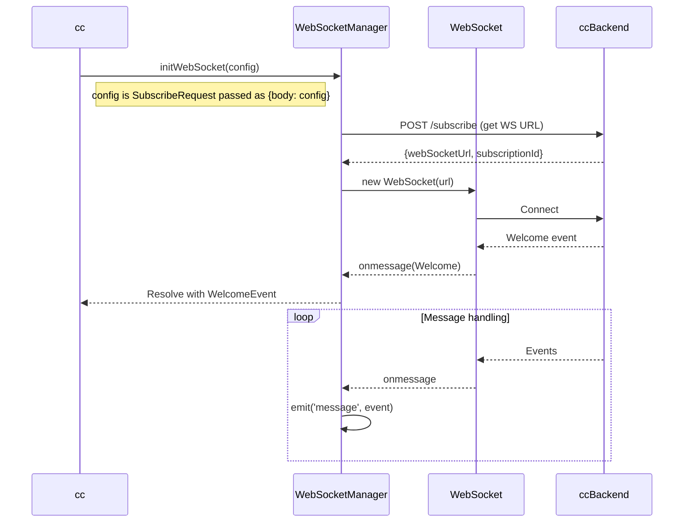
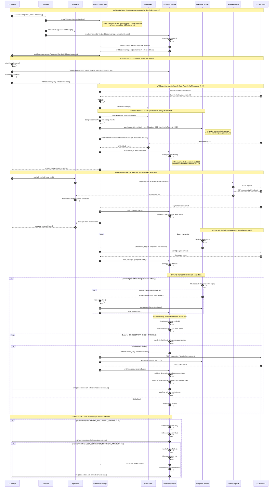
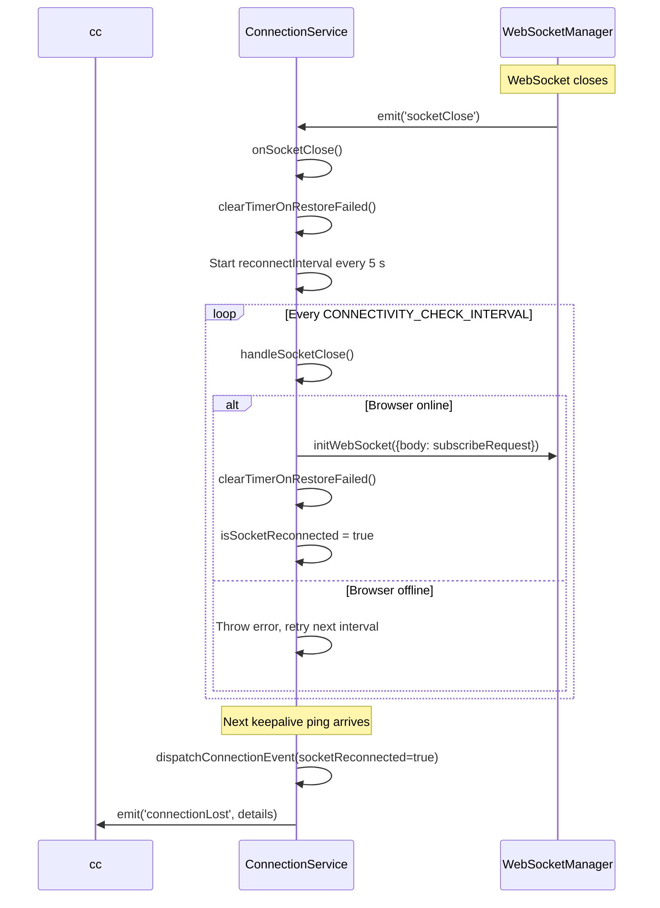
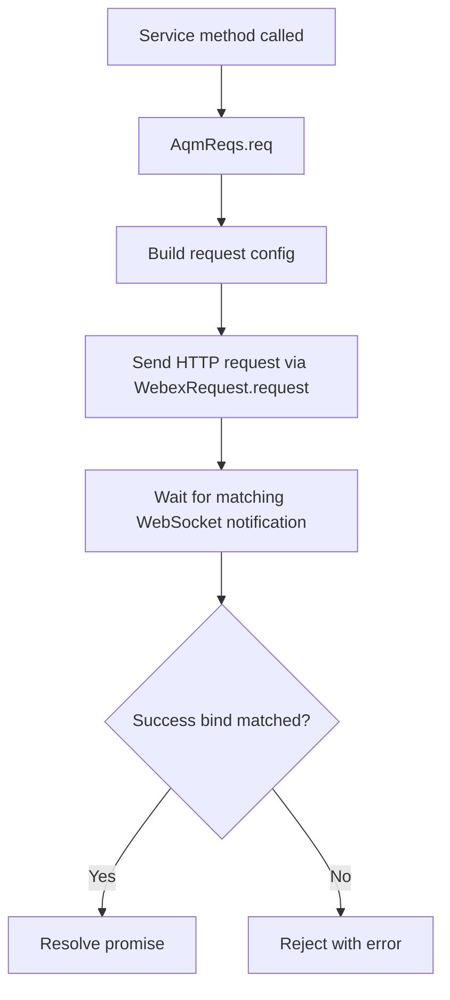
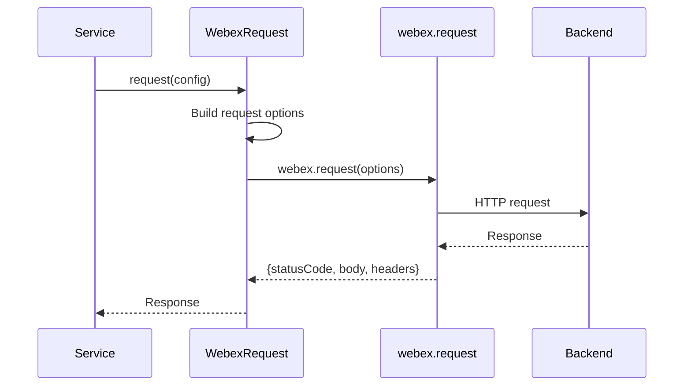
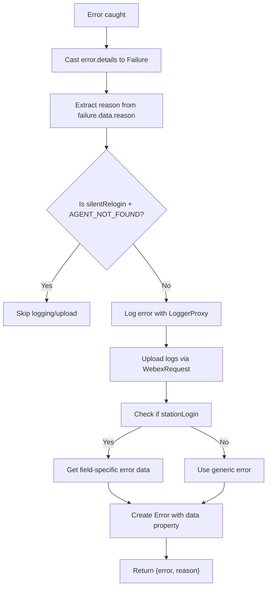

# Core Service - Architecture

> **Purpose**: Technical documentation for core infrastructure components.

---

## WebSocketManager

### Connection Sequence



Config reference:

- `initWebSocket(options: {body: SubscribeRequest})`: [src/services/core/websocket/WebSocketManager.ts](../websocket/WebSocketManager.ts)
- `SubscribeRequest` type: [src/types.ts](../../../types.ts)

### End-to-End Core Flow (Complete Picture)

This diagram shows the complete lifecycle from component instantiation through normal operation, including when and how each layer is created, engaged, and their method invocation sequences.



#### Component Instantiation Order

1. **WebSocketManager** ([src/services/core/websocket/WebSocketManager.ts:32-45](../websocket/WebSocketManager.ts#L32-L45)) - Creates keepalive worker (not started)
2. **AqmReqs** ([src/services/core/aqm-reqs.ts](../aqm-reqs.ts)) - Initialized with WebSocketManager reference
3. **Service layers** (config, agent, contact, dialer) - Created with AqmReqs reference
4. **ConnectionService** ([src/services/core/websocket/connection-service.ts:30-41](../websocket/connection-service.ts#L30-L41)) - Wires event listeners immediately

#### Key Method Invocations

**WebSocketManager.initWebSocket** (WebSocketManager.ts:47-61):

- `register()` → POST /subscribe → get WebSocket URL
- `connect()` → Create WebSocket → Setup handlers (onopen, onmessage, onclose, onerror)

**websocket.onopen** (WebSocketManager.ts:107-133):

- Send initial keepalive ping
- Wire `keepaliveWorker.onmessage` handler
- **Start keepalive worker** via `postMessage({type: 'start', intervalDuration: 4000, closeSocketTimeout: 5000})`

**ConnectionService.onPing** (connection-service.ts:92-118) - Called on every message:

- Clear existing timers (reconnectingTimer, restoreTimer)
- Handle connection recovery state transitions
- Schedule new timers: `setTimeout(handleConnectionLost, 8000)`, `setTimeout(handleRestoreFailed, 50000)`

**ConnectionService.onSocketClose** (connection-service.ts:135-141):

- Clear reconnect interval
- Start periodic reconnection attempts: `setInterval(handleSocketClose, 5000)`

**ConnectionService.handleSocketClose** (connection-service.ts:120-133):

- Check `navigator.onLine`
- If online: reinitialize WebSocket and set `isSocketReconnected = true`

---

## ConnectionService

Monitors WebSocket health via keepalive messages, detects disconnections, triggers reconnection attempts, and emits connection state events to the application layer. Extends `EventEmitter`.

### Constructor

```typescript
constructor(options: ConnectionServiceOptions)

type ConnectionServiceOptions = {
  webSocketManager: WebSocketManager;
  subscribeRequest: SubscribeRequest;
};
```

### Type References

- `SubscribeRequest`: [src/types.ts](../../../types.ts)
- `ConnectionProp`: [src/services/core/websocket/types.ts](../websocket/types.ts)
- `ConnectionServiceOptions`: [src/services/core/websocket/types.ts](../websocket/types.ts)
- `ConnectionLostDetails`: [src/services/core/websocket/types.ts](../websocket/types.ts)

The constructor wires up two listeners on `WebSocketManager`:

- `'message'` → `onPing` (resets disconnect/restore timers on every incoming message)
- `'socketClose'` → `onSocketClose` (starts the reconnection interval)

Code reference (`src/services/core/websocket/connection-service.ts`):

```typescript
private setupEventListeners() {
  this.webSocketManager.on('message', this.onPing.bind(this));
  this.webSocketManager.on('socketClose', this.onSocketClose.bind(this));
}
```

### Key Constants

| Constant                           | Value     | Purpose                                      |
| ---------------------------------- | --------- | -------------------------------------------- |
| `LOST_CONNECTION_RECOVERY_TIMEOUT` | 50 000 ms | Max wait before declaring restore failed     |
| `WS_DISCONNECT_ALLOWED`            | 8 000 ms  | Grace period before flagging connection lost |
| `CONNECTIVITY_CHECK_INTERVAL`      | 5 000 ms  | Interval between reconnection attempts       |

### Properties

| Property              | Type                             | Description                                                                                                  |
| --------------------- | -------------------------------- | ------------------------------------------------------------------------------------------------------------ |
| `connectionProp`      | `ConnectionProp`                 | Runtime configuration object (for example `lostConnectionRecoveryTimeout`) used by reconnect/restore timers. |
| `wsDisconnectAllowed` | `number`                         | Timeout window before `handleConnectionLost` is triggered when no ping/message is received.                  |
| `reconnectingTimer`   | `ReturnType<typeof setTimeout>`  | Per-message timeout that schedules lost-connection detection.                                                |
| `restoreTimer`        | `ReturnType<typeof setTimeout>`  | Timeout that marks restore failure if recovery does not complete in time.                                    |
| `reconnectInterval`   | `ReturnType<typeof setInterval>` | Periodic retry loop started after socket close to attempt reconnection.                                      |
| `isConnectionLost`    | `boolean`                        | Indicates that the connection has been marked as lost.                                                       |
| `isRestoreFailed`     | `boolean`                        | Indicates that recovery has exceeded the configured restore timeout.                                         |
| `isSocketReconnected` | `boolean`                        | Indicates that a reconnect attempt succeeded and socket is back.                                             |
| `isKeepAlive`         | `boolean`                        | Tracks whether the latest incoming message is a keepalive signal.                                            |
| `webSocketManager`    | `WebSocketManager`               | Core WebSocket dependency used for event subscription and re-initialization.                                 |
| `subscribeRequest`    | `SubscribeRequest`               | Cached subscribe payload reused during reconnect (`initWebSocket`).                                          |

### Methods

The only public method is `setConnectionProp`. All other methods are private implementation details and are documented for architectural understanding.

1. `setConnectionProp(prop: ConnectionProp): void` (public)

   - **Purpose**: Updates connection-level runtime settings used by timers (mainly recovery timeout behavior).
   - **Params**: `prop` - new connection config object.
   - **Returns**: `void`.
   - **Usage**: Called by higher layers when timeout behavior must be tuned after initialization.

2. `setupEventListeners(): void` (private)

   - **Purpose**: Wires `WebSocketManager` events to internal handlers (`'message' -> onPing`, `'socketClose' -> onSocketClose`).
   - **Params**: none.
   - **Returns**: `void`.
   - **Usage**: Invoked from the constructor once, during `ConnectionService` setup.

3. `onPing(event: any): void` (private)

   - **Purpose**: Handles every incoming socket message, resets timers, updates keepalive/recovery flags, and emits recovery events when state changes.
   - **Params**: `event` - raw message payload (JSON string) received from the socket event stream.
   - **Returns**: `void`.
   - **Usage**: Triggered automatically by the `'message'` listener.

4. `onSocketClose(): void` (private)

   - **Purpose**: Starts the reconnect interval when socket close is detected.
   - **Params**: none.
   - **Returns**: `void`.
   - **Usage**: Triggered automatically by the `'socketClose'` listener.

5. `handleSocketClose(): Promise<void>` (private)

   - **Purpose**: Performs one reconnect attempt; if browser is online, reinitializes WebSocket and marks socket as reconnected.
   - **Params**: none.
   - **Returns**: `Promise<void>` (rejects when browser is offline).
   - **Usage**: Called repeatedly from `onSocketClose` interval loop.

6. `handleConnectionLost(): void` (private)

   - **Purpose**: Marks the connection as lost and dispatches a connection status event.
   - **Params**: none.
   - **Returns**: `void`.
   - **Usage**: Scheduled by `onPing` via `reconnectingTimer` after inactivity.

7. `handleRestoreFailed(): Promise<void>` (private)

   - **Purpose**: Marks restore as failed, disables reconnect, emits failure state, and clears reconnect interval.
   - **Params**: none.
   - **Returns**: `Promise<void>`.
   - **Usage**: Scheduled by `onPing` via `restoreTimer`.

8. `clearTimerOnRestoreFailed(): Promise<void>` (private)

   - **Purpose**: Stops active reconnect interval to avoid duplicate retries.
   - **Params**: none.
   - **Returns**: `Promise<void>`.
   - **Usage**: Called from reconnect/failure paths whenever interval cleanup is needed.

9. `updateConnectionData(): void` (private)

   - **Purpose**: Resets transient connection flags (`isConnectionLost`, `isRestoreFailed`, `isSocketReconnected`) after recovery.
   - **Params**: none.
   - **Returns**: `void`.
   - **Usage**: Called inside `onPing` before dispatching recovered state.

10. `dispatchConnectionEvent(socketReconnected = false): void` (private)
    - **Purpose**: Builds `ConnectionLostDetails`, forwards it to `WebSocketManager.handleConnectionLost`, and emits `'connectionLost'`.
    - **Params**: `socketReconnected` - optional override used when reconnect is explicitly detected.
    - **Returns**: `void`.
    - **Usage**: Used by lost/recovered/restore-failed paths to publish uniform connection state.

### Reconnection Flow



### Events

```typescript
type ConnectionLostDetails = {
  isConnectionLost: boolean;
  isRestoreFailed: boolean;
  isSocketReconnected: boolean;
  isKeepAlive: boolean;
};

connectionService.on('connectionLost', (details: ConnectionLostDetails) => {
  if (details.isConnectionLost) {
    // Connection lost — waiting for recovery
  } else if (details.isRestoreFailed) {
    // Recovery timeout (50 s) exceeded
  } else if (details.isSocketReconnected) {
    // Socket successfully reconnected
  }
});
```

---

## AqmReqs Pattern

`AqmReqs` coordinates the Contact Center request lifecycle by sending an HTTP request and then waiting for the matching WebSocket response bind. This gives service methods a single promise-based API that resolves only when the backend confirms completion.

```typescript
import AqmReqs from '../aqm-reqs';

const aqmReqs = new AqmReqs();

const response = await aqmReqs.req({
  url: '/v1/agent/state',
  method: 'POST',
  body: {agentId: 'agent-123', state: 'AVAILABLE'},
  bind: {
    eventType: 'agent-state-change',
    matcher: (event) => event.agentId === 'agent-123',
  },
});

// `response` resolves after matching bind event arrives
```

### Request/Response Flow



## WebexRequest

### Singleton Pattern

```typescript
class WebexRequest {
  private static instance: WebexRequest;
  private webex: WebexSDK;

  private constructor(options: {webex: WebexSDK}) {}

  public static getInstance(options?: {webex: WebexSDK}): WebexRequest {
    if (!WebexRequest.instance && options && options.webex) {
      WebexRequest.instance = new WebexRequest(options);
    }
    return WebexRequest.instance;
  }

  public async request(options: {
    service: string; // Service key used by `webex.request` to resolve the target host
    resource: string; // API path within the service (for example: v1/notification/subscribe)
    method: HTTP_METHODS;
    body?: RequestBody;
  }): Promise<IHttpResponse>;

  public async uploadLogs(metaData: LogsMetaData = {}): Promise<UploadLogsResponse>;
}

export default WebexRequest;
```

Type references:

- `WebexSDK`: [src/types.ts](../../../types.ts)
- `HTTP_METHODS`: [src/types.ts](../../../types.ts)
- `RequestBody`: [src/types.ts](../../../types.ts)
- `IHttpResponse`: [src/types.ts](../../../types.ts)
- `LogsMetaData`: [src/types.ts](../../../types.ts)
- `UploadLogsResponse`: [src/types.ts](../../../types.ts)

### Request Flow



---

## Keepalive Worker

### Purpose

Maintains WebSocket connection with periodic pings and monitors network status. Has a dual role:

1. **Keepalive**: Sends periodic messages to detect connection issues
2. **Network Monitoring**: Tracks online/offline transitions and forces socket closure if offline too long

### Implementation

> **Source**: [`keepalive.worker.js`](../websocket/keepalive.worker.js) — a Web Worker script embedded as a string and loaded via `Blob` + `URL.createObjectURL` in `WebSocketManager`.

#### Worker Message Contract

**Inbound (main thread → worker):**

| Message Type | Fields                                                                                       | Effect                                                        |
| ------------ | -------------------------------------------------------------------------------------------- | ------------------------------------------------------------- |
| `start`      | `intervalDuration` (default 4000ms), `isSocketClosed`, `closeSocketTimeout` (default 5000ms) | Starts periodic keepalive interval and resets offline handler |
| `terminate`  | —                                                                                            | Clears the keepalive interval and resets offline handler      |

**Outbound (worker → main thread):**

| Message Type  | Fields                  | Trigger                                                                              |
| ------------- | ----------------------- | ------------------------------------------------------------------------------------ |
| `keepalive`   | `onlineStatus: boolean` | Every `intervalDuration` ms, and on browser online/offline events                    |
| `closeSocket` | —                       | When offline for longer than `closeSocketTimeout` and socket hasn't closed naturally |

#### Key Behavior

1. **Periodic ping**: Every `intervalDuration` ms, calls `checkNetworkStatus()` which posts a `keepalive` message with the current `navigator.onLine` status
2. **Offline detection**: When network goes offline, starts a `closeSocketTimeout` timer. If the socket hasn't closed naturally by then, posts `closeSocket` to force closure
3. **Online/offline listeners**: The worker also listens to browser `online`/`offline` events for immediate network change detection

---

## Error Handling

This section documents shared error helpers in `Utils.ts` that normalize errors, enrich them with context, and ensure consistent logging/upload behavior across services.

### Error Types

```typescript
// Msg - Generic message interface (GlobalTypes.ts:7-16)
export type Msg<T = any> = {
  type: string;
  orgId: string;
  trackingId: string;
  data: T;
};

// Failure - Backend error structure (GlobalTypes.ts:23-34)
// Built on Msg<T> with specific error data fields
export type Failure = Msg<{
  agentId: string;
  trackingId: string;
  reasonCode: number;
  orgId: string;
  reason: string;
}>;

// AugmentedError - Extended Error with flexible data field (GlobalTypes.ts:59-61)
export interface AugmentedError extends Error {
  data?: Record<string, any>;
}
```

### getErrorDetails Flow



### getErrorDetails

Use this helper for agent/config-style flows where backend failure payloads are transformed into a user-facing `Error` plus `reason`, with optional station-login field metadata.

```typescript
export const getErrorDetails = (error: any, methodName: string, moduleName: string) => {
  let errData = {message: '', fieldName: ''};

  const failure = error.details as Failure;
  const reason = failure?.data?.reason ?? `Error while performing ${methodName}`;

  // Log error (unless AGENT_NOT_FOUND in silentRelogin)
  if (!(reason === 'AGENT_NOT_FOUND' && methodName === 'silentRelogin')) {
    LoggerProxy.error(`${methodName} failed with reason: ${reason}`, {
      module: moduleName,
      method: methodName,
      trackingId: failure?.trackingId,
    });

    // Upload logs
    WebexRequest.getInstance().uploadLogs({
      correlationId: failure?.trackingId,
    });
  }

  // For stationLogin, extract field-specific error data (message + fieldName)
  if (methodName === 'stationLogin') {
    errData = getStationLoginErrorData(failure, error.loginOption);
  }

  const err = new Error(reason);
  // @ts-ignore - custom property for backward compatibility
  err.data = errData;

  return {error: err, reason};
};
```

### generateTaskErrorObject

Use this helper for task/interaction flows where richer task error metadata (`errorType`, `errorData`, `reasonCode`, `trackingId`) is required on the returned `AugmentedError`.

```typescript
export const generateTaskErrorObject = (
  error: any,
  methodName: string,
  moduleName: string
): AugmentedError => {
  const trackingId = error?.details?.trackingId || error?.trackingId || '';
  const errorMsg = error?.details?.msg;

  const errorMessage = errorMsg?.errorMessage || error.message || 'Error';
  const errorType = errorMsg?.errorType || error.name || 'Unknown Error';
  const errorData = errorMsg?.errorData || '';
  const reasonCode = errorMsg?.reasonCode || 0;

  LoggerProxy.error(`${methodName} failed: ${errorMessage} (${errorType})`, {
    module: moduleName,
    method: methodName,
    trackingId,
  });
  WebexRequest.getInstance().uploadLogs({correlationId: trackingId});

  const reason = `${errorType}: ${errorMessage}${errorData ? ` (${errorData})` : ''}`;
  const err: AugmentedError = new Error(reason);
  err.data = {
    message: errorMessage,
    errorType,
    errorData,
    reasonCode,
    trackingId,
  };

  return err;
};
```

### Usage Guidance

```typescript
// Use getErrorDetails for:
// - Agent service operations
// - Station login/logout flows
//
// Use generateTaskErrorObject for:
// - Task service operations
// - Interaction-related errors
```

---

## Troubleshooting

### Issue: WebSocket not connecting

**Cause**: Subscribe API failed or invalid URL

**Solution**: Check subscribe response and WebSocket URL

### Issue: Messages not received

**Cause**: Event listener not registered

**Solution**: Ensure `on('message', handler)` called before connect

### Issue: Connection drops frequently

**Cause**: Keepalive not enabled or network issues

**Solution**: Verify worker-driven keepalive is running after socket `onopen`, and check network/offline transitions

---

## Related Files

- [Root Orchestrator AGENTS.md](../../../../AGENTS.md) — Task routing, critical rules, cross-service patterns
- [Core AGENTS.md](./AGENTS.md) — Core service usage guide and modification patterns
- [WebSocketManager.ts](../websocket/WebSocketManager.ts) — WebSocket lifecycle, keepalive worker integration
- [ConnectionService.ts](../websocket/connection-service.ts) — Reconnection logic, connection state events
- [keepalive.worker.js](../websocket/keepalive.worker.js) — Web Worker for periodic keepalive and offline detection
- [WebexRequest.ts](../WebexRequest.ts) — Singleton HTTP request handler
- [Utils.ts](../Utils.ts) — `getErrorDetails` (line 88), `generateTaskErrorObject` (line 143), consult utilities
- [Err.ts](../Err.ts) — `Err.Message` and `Err.Details` error classes
- [aqm-reqs.ts](../aqm-reqs.ts) — AQM request/response pattern, WebSocket notification binding
- [GlobalTypes.ts](../GlobalTypes.ts) — `Msg`, `Failure`, `AugmentedError` type definitions
- [types.ts](../types.ts) — `Pending`, `Req`, `Conf`, `Res` types for AqmReqs
