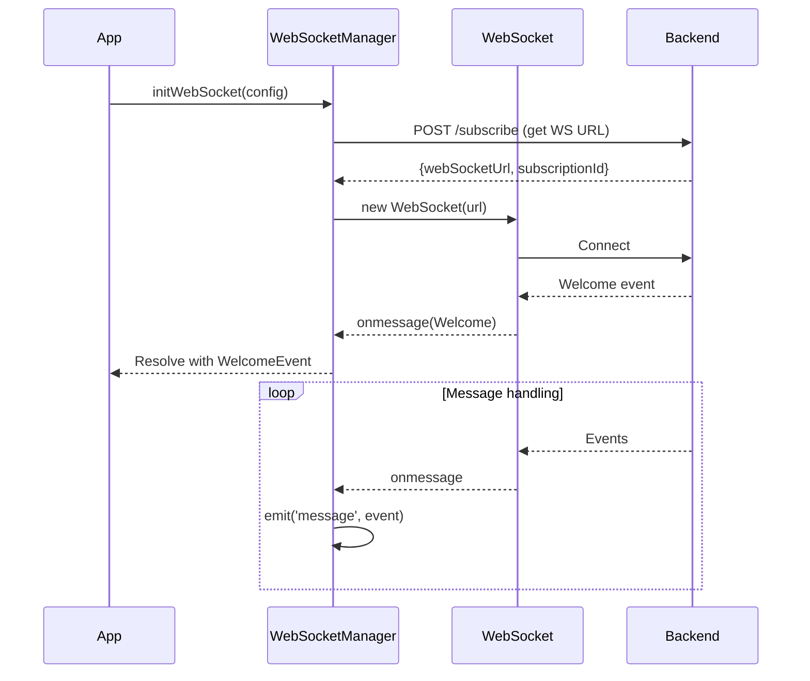
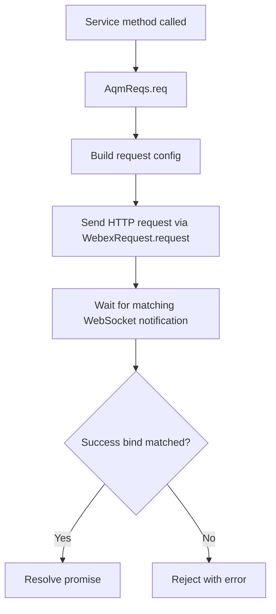
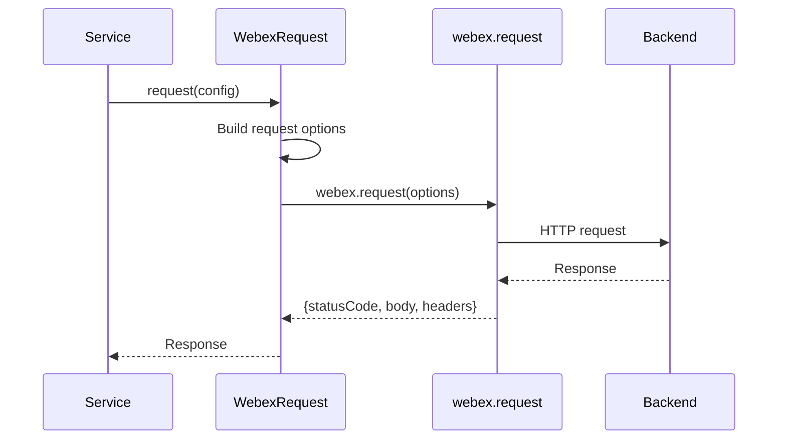

# Core Service - Architecture

> **Purpose**: Technical documentation for core infrastructure components.

---

## Component Overview

| Component | File | Responsibility |
|-----------|------|----------------|
| `WebSocketManager` | `websocket/WebSocketManager.ts` | WebSocket lifecycle |
| `ConnectionService` | `websocket/connection-service.ts` | Reconnection, keepalive |
| `WebexRequest` | `WebexRequest.ts` | HTTP request wrapper |
| `AqmReqs` | `aqm-reqs.ts` | Request-response pattern |
| `Utils` | `Utils.ts` | Error handling utilities |
| `Err` | `Err.ts` | Error class definitions |
| `GlobalTypes` | `GlobalTypes.ts` | Shared type definitions |

---

## File Structure

```
services/core/
├── aqm-reqs.ts           # AQM request handler
├── constants.ts          # Core constants
├── Err.ts                # Error classes
├── GlobalTypes.ts        # Failure, Msg<T>, etc.
├── types.ts              # Request/response types
├── Utils.ts              # Utility functions
├── WebexRequest.ts       # HTTP client
└── websocket/
    ├── WebSocketManager.ts    # Main WS handler
    ├── connection-service.ts  # Connection lifecycle
    ├── keepalive.worker.js    # Keepalive worker
    └── types.ts               # WS types
```

---

## WebSocketManager

### Class Structure

```typescript
export class WebSocketManager extends EventEmitter {
  private webex: WebexSDK;
  private websocket: WebSocket;
  private keepaliveWorker: Worker;
  
  constructor(options: {webex: WebexSDK}) { }
  
  async initWebSocket(config: {body: SubscribeRequest}): Promise<WelcomeEvent>
  close(reconnect: boolean, reason: string): void
  
  // Properties
  isSocketClosed: boolean
}
```

### Connection Sequence



---

## ConnectionService

### Responsibilities

1. Monitor connection state
2. Detect disconnections
3. Trigger reconnection
4. Emit connection events

### Events

```typescript
type ConnectionLostDetails = {
  isConnectionLost: boolean;
  isRestoreFailed: boolean;
  isSocketReconnected: boolean;
  isKeepAlive: boolean;
};

connectionService.on('connectionLost', (details: ConnectionLostDetails) => {
  if (details.isConnectionLost) {
    // Handle disconnect
  } else if (details.isSocketReconnected) {
    // Handle reconnect
  }
});
```

---

## AqmReqs Pattern

### Request/Response Flow



### Configuration Structure

```typescript
{
  url: '/v1/endpoint',      // API path
  host: WCC_API_GATEWAY,    // Base service
  data: payload,            // Request body
  method: HTTP_METHODS.POST, // HTTP method
  err: errorHandler,        // Error transformer
  notifSuccess: {
    bind: {
      type: CC_EVENTS.SUCCESS,
      data: {type: CC_EVENTS.SUCCESS},
    },
    msg: {} as ResponseType,
  },
  notifFail: {
    bind: {
      type: CC_EVENTS.FAIL,
      data: {type: CC_EVENTS.FAIL},
    },
    errId: 'Service.aqm.operation',
  },
}
```

---

## WebexRequest

### Singleton Pattern

```typescript
export default class WebexRequest {
  private static instance: WebexRequest;
  private webex: WebexSDK;
  
  private constructor(options: {webex: WebexSDK}) {}
  
  public static getInstance(options?: {webex: WebexSDK}): WebexRequest {
    if (!WebexRequest.instance && options?.webex) {
      WebexRequest.instance = new WebexRequest(options);
    }
    return WebexRequest.instance;
  }
  
  public async request(config: RequestConfig): Promise<Response>
  public async uploadLogs(options?: {correlationId?: string}): Promise<UploadResponse>
}
```

### Request Flow



---

## Error Handling

### getErrorDetails Flow

```mermaid
flowchart TD
    A[Error caught] --> B[Cast error.details to Failure]
    B --> C[Extract reason from failure.data.reason]
    C --> D{Is silentRelogin + AGENT_NOT_FOUND?}
    D -->|Yes| E[Skip logging/upload]
    D -->|No| F[Log error with LoggerProxy]
    F --> G[Upload logs via WebexRequest]
    G --> H[Check if stationLogin]
    H -->|Yes| I[Get field-specific error data]
    H -->|No| J[Use generic error]
    I --> K[Create Error with data property]
    J --> K
    K --> L[Return {error, reason}]
```

### Error Types

```typescript
// Failure - Backend error structure
type Failure = {
  type: string;
  orgId?: string;
  trackingId?: string;
  data?: {
    agentId?: string;
    reason?: string;
    reasonCode?: string | number;
  };
};

// AugmentedError - Extended Error with data
type AugmentedError = Error & {
  data?: {
    message?: string;
    errorType?: string;
    errorData?: string;
    reasonCode?: number;
    trackingId?: string;
  };
};
```

---

## Keepalive Worker

### Purpose

Maintains WebSocket connection with periodic pings.

### Implementation

```javascript
// keepalive.worker.js
let intervalId;

addEventListener('message', (event) => {
  if (event.data?.type === 'start') {
    intervalId = setInterval(() => {
      self.postMessage({type: 'keepalive', onlineStatus: navigator.onLine});
    }, event.data?.intervalDuration);
  }

  if (event.data?.type === 'terminate') {
    clearInterval(intervalId);
    // When offline timeout is reached and socket is still open:
    // self.postMessage({type: 'closeSocket'});
  }
});

// Main thread contract:
// postMessage({type: 'start', intervalDuration, isSocketClosed, closeSocketTimeout})
// postMessage({type: 'terminate'})
```

---

## Utility Functions

### getErrorDetails

```typescript
export const getErrorDetails = (
  error: any,
  methodName: string,
  moduleName: string
) => {
  const failure = error.details as Failure;
  const reason = failure?.data?.reason ?? `Error while performing ${methodName}`;
  
  // Log error (unless AGENT_NOT_FOUND in silentRelogin)
  if (!(reason === 'AGENT_NOT_FOUND' && methodName === 'silentRelogin')) {
    LoggerProxy.error(`${methodName} failed with reason: ${reason}`, {
      module: moduleName,
      method: methodName,
      trackingId: failure?.trackingId,
    });
    
    // Upload logs
    WebexRequest.getInstance().uploadLogs({
      correlationId: failure?.trackingId,
    });
  }
  
  const err = new Error(reason);
  err.data = errData;  // For stationLogin field-specific errors
  
  return {error: err, reason};
};
```

### generateTaskErrorObject

```typescript
export const generateTaskErrorObject = (
  error: any,
  methodName: string,
  moduleName: string
): AugmentedError => {
  const trackingId = error?.details?.trackingId || error?.trackingId || '';
  const errorMsg = error?.details?.msg;
  
  const errorMessage = errorMsg?.errorMessage || error.message || 'Error';
  const errorType = errorMsg?.errorType || error.name || 'Unknown Error';
  
  LoggerProxy.error(`${methodName} failed: ${errorMessage}`, {...});
  WebexRequest.getInstance().uploadLogs({correlationId: trackingId});
  
  const err: AugmentedError = new Error(`${errorType}: ${errorMessage}`);
  err.data = {
    message: errorMessage,
    errorType,
    reasonCode,
    trackingId,
  };
  
  return err;
};
```

---

## Troubleshooting

### Issue: WebSocket not connecting

**Cause**: Subscribe API failed or invalid URL

**Solution**: Check subscribe response and WebSocket URL

### Issue: Messages not received

**Cause**: Event listener not registered

**Solution**: Ensure `on('message', handler)` called before connect

### Issue: Connection drops frequently

**Cause**: Keepalive not enabled or network issues

**Solution**: Verify worker-driven keepalive is running after socket `onopen`, and check network/offline transitions

---

## Related Files

- [WebSocketManager.ts](../websocket/WebSocketManager.ts)
- [WebexRequest.ts](../WebexRequest.ts)
- [Utils.ts](../Utils.ts)
- [aqm-reqs.ts](../aqm-reqs.ts)
- [GlobalTypes.ts](../GlobalTypes.ts)
