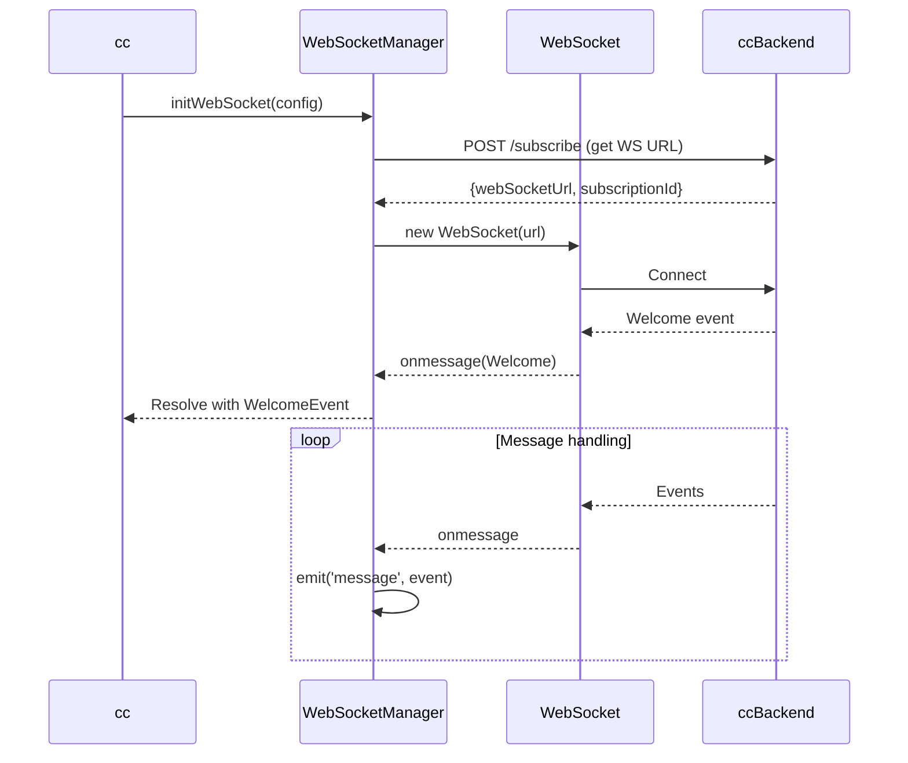
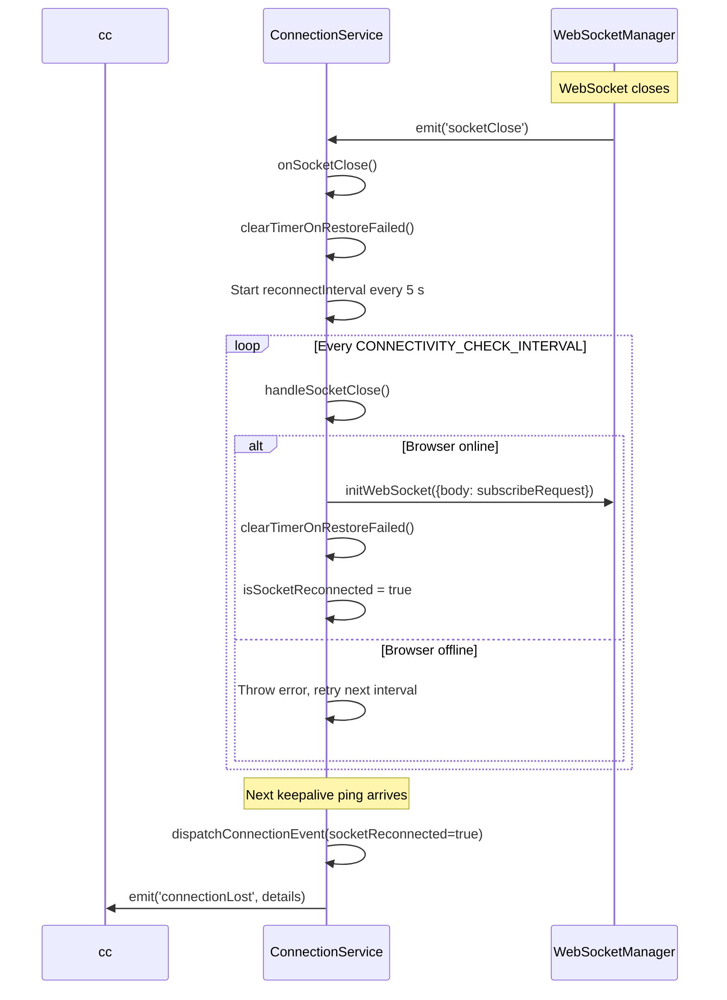
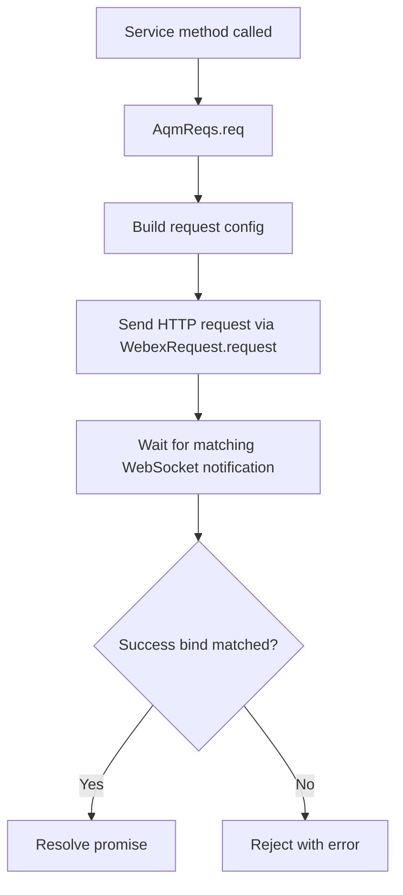
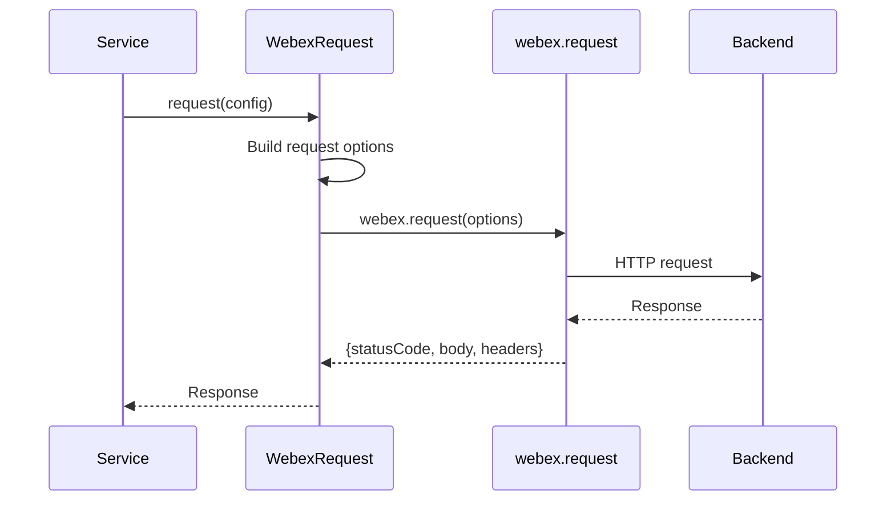
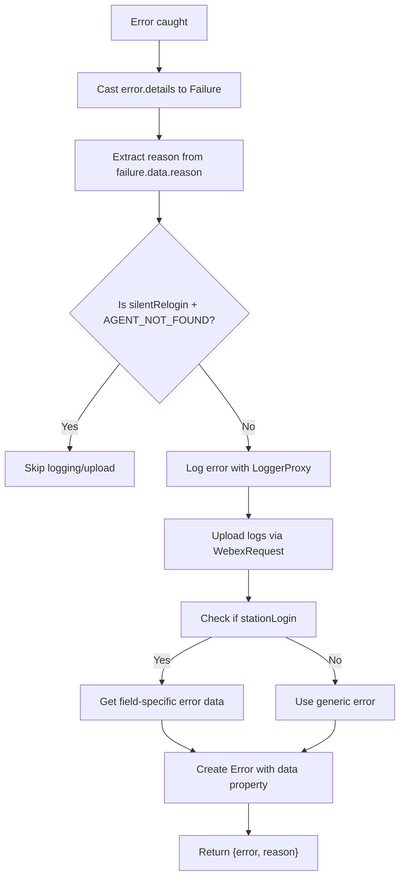

# Core Service - Architecture

> **Purpose**: Technical documentation for core infrastructure components.

---

## WebSocketManager

### Connection Sequence



---

## ConnectionService

Monitors WebSocket health via keepalive messages, detects disconnections, triggers reconnection attempts, and emits connection state events to the application layer. Extends `EventEmitter`.

### Constructor

```typescript
constructor(options: ConnectionServiceOptions)

type ConnectionServiceOptions = {
  webSocketManager: WebSocketManager;
  subscribeRequest: SubscribeRequest;
};
```

The constructor wires up two listeners on `WebSocketManager`:

- `'message'` → `onPing` (resets disconnect/restore timers on every incoming message)
- `'socketClose'` → `onSocketClose` (starts the reconnection interval)

### Key Constants

| Constant                           | Value     | Purpose                                      |
| ---------------------------------- | --------- | -------------------------------------------- |
| `LOST_CONNECTION_RECOVERY_TIMEOUT` | 50 000 ms | Max wait before declaring restore failed     |
| `WS_DISCONNECT_ALLOWED`            | 8 000 ms  | Grace period before flagging connection lost |
| `CONNECTIVITY_CHECK_INTERVAL`      | 5 000 ms  | Interval between reconnection attempts       |

### Methods

```typescript
export class ConnectionService extends EventEmitter {
  public setConnectionProp(prop: ConnectionProp): void;

  private setupEventListeners(): void;
  private onPing(event: any): void;
  private onSocketClose(): void;
  private handleSocketClose(): Promise<void>;
  private handleConnectionLost(): void;
  private handleRestoreFailed(): Promise<void>;
  private clearTimerOnRestoreFailed(): Promise<void>;
  private updateConnectionData(): void;
  private dispatchConnectionEvent(socketReconnected?: boolean): void;
}
```

### Reconnection Flow



### Events

```typescript
type ConnectionLostDetails = {
  isConnectionLost: boolean;
  isRestoreFailed: boolean;
  isSocketReconnected: boolean;
  isKeepAlive: boolean;
};

connectionService.on('connectionLost', (details: ConnectionLostDetails) => {
  if (details.isConnectionLost) {
    // Connection lost — waiting for recovery
  } else if (details.isRestoreFailed) {
    // Recovery timeout (50 s) exceeded
  } else if (details.isSocketReconnected) {
    // Socket successfully reconnected
  }
});
```

---

## AqmReqs Pattern

### Request/Response Flow



## WebexRequest

### Singleton Pattern

```typescript
export default class WebexRequest {
  private static instance: WebexRequest;
  private webex: WebexSDK;

  private constructor(options: {webex: WebexSDK}) {}

  public static getInstance(options?: {webex: WebexSDK}): WebexRequest {
    if (!WebexRequest.instance && options && options.webex) {
      WebexRequest.instance = new WebexRequest(options);
    }
    return WebexRequest.instance;
  }

  public async request(options: {
    service: string;
    resource: string;
    method: HTTP_METHODS;
    body?: RequestBody;
  }): Promise<IHttpResponse>;

  public async uploadLogs(metaData: LogsMetaData = {}): Promise<UploadLogsResponse>;
}
```

### Request Flow



---

## Keepalive Worker

### Purpose

Maintains WebSocket connection with periodic pings and monitors network status. Has a dual role:
1. **Keepalive**: Sends periodic messages to detect connection issues
2. **Network Monitoring**: Tracks online/offline transitions and forces socket closure if offline too long

### Implementation

```javascript
// keepalive.worker.js
let intervalId, intervalDuration, timeOutId, isSocketClosed, closeSocketTimeout;
let initialised = false;
let initiateWebSocketClosure = false;

const resetOfflineHandler = function () {
  if (timeOutId) {
    initialised = false;
    clearTimeout(timeOutId);
    timeOutId = null;
  }
};

const checkOnlineStatus = function () {
  return navigator.onLine;
};

// Checks network status and forces WebSocket closure if offline too long
const checkNetworkStatus = function () {
  const onlineStatus = checkOnlineStatus();
  postMessage({type: 'keepalive', onlineStatus}); // Includes onlineStatus in every message

  if (!onlineStatus && !initialised) {
    initialised = true;
    // Sets timeout - if socket doesn't close naturally, force it
    timeOutId = setTimeout(() => {
      if (!isSocketClosed) {
        initiateWebSocketClosure = true;
        postMessage({type: 'closeSocket'});
      }
    }, closeSocketTimeout);
  }

  if (onlineStatus && initialised) {
    initialised = false;
  }

  if (initiateWebSocketClosure) {
    initiateWebSocketClosure = false;
    clearTimeout(timeOutId);
    timeOutId = null;
  }
};

addEventListener('message', (event) => {
  if (event.data?.type === 'start') {
    intervalDuration = event.data?.intervalDuration || 4000;
    closeSocketTimeout = event.data?.closeSocketTimeout || 5000;
    intervalId = setInterval(
      (checkIfSocketClosed) => {
        checkNetworkStatus();
        isSocketClosed = checkIfSocketClosed;
      },
      intervalDuration,
      event.data?.isSocketClosed
    );
    resetOfflineHandler();
  }

  if (event.data?.type === 'terminate' && intervalId) {
    clearInterval(intervalId);
    intervalId = null;
    resetOfflineHandler();
  }
});

// Listen for browser online/offline events
self.addEventListener('online', () => {
  checkNetworkStatus();
});

self.addEventListener('offline', () => {
  checkNetworkStatus();
});

// Main thread contract:
// postMessage({type: 'start', intervalDuration, isSocketClosed, closeSocketTimeout})
// postMessage({type: 'terminate'})
```

---

## Error Handling

### Error Types

```typescript
// Msg - Generic message interface (GlobalTypes.ts:7-16)
export type Msg<T = any> = {
  type: string;
  orgId: string;
  trackingId: string;
  data: T;
};

// Failure - Backend error structure (GlobalTypes.ts:23-34)
// Built on Msg<T> with specific error data fields
export type Failure = Msg<{
  agentId: string;
  trackingId: string;
  reasonCode: number;
  orgId: string;
  reason: string;
}>;

// AugmentedError - Extended Error with flexible data field (GlobalTypes.ts:59-61)
export interface AugmentedError extends Error {
  data?: Record<string, any>;
}
```

### getErrorDetails Flow



### getErrorDetails

```typescript
export const getErrorDetails = (error: any, methodName: string, moduleName: string) => {
  const failure = error.details as Failure;
  const reason = failure?.data?.reason ?? `Error while performing ${methodName}`;

  // Log error (unless AGENT_NOT_FOUND in silentRelogin)
  if (!(reason === 'AGENT_NOT_FOUND' && methodName === 'silentRelogin')) {
    LoggerProxy.error(`${methodName} failed with reason: ${reason}`, {
      module: moduleName,
      method: methodName,
      trackingId: failure?.trackingId,
    });

    // Upload logs
    WebexRequest.getInstance().uploadLogs({
      correlationId: failure?.trackingId,
    });
  }

  const err = new Error(reason);
  err.data = errData; // For stationLogin field-specific errors

  return {error: err, reason};
};
```

### generateTaskErrorObject

```typescript
export const generateTaskErrorObject = (
  error: any,
  methodName: string,
  moduleName: string
): AugmentedError => {
  const trackingId = error?.details?.trackingId || error?.trackingId || '';
  const errorMsg = error?.details?.msg;

  const errorMessage = errorMsg?.errorMessage || error.message || 'Error';
  const errorType = errorMsg?.errorType || error.name || 'Unknown Error';
  const errorData = errorMsg?.errorData || '';
  const reasonCode = errorMsg?.reasonCode || 0;

  LoggerProxy.error(`${methodName} failed: ${errorMessage} (${errorType})`, {
    module: moduleName,
    method: methodName,
    trackingId,
  });
  WebexRequest.getInstance().uploadLogs({correlationId: trackingId});

  const reason = `${errorType}: ${errorMessage}${errorData ? ` (${errorData})` : ''}`;
  const err: AugmentedError = new Error(reason);
  err.data = {
    message: errorMessage,
    errorType,
    errorData,
    reasonCode,
    trackingId,
  };

  return err;
};
```

---

## Troubleshooting

### Issue: WebSocket not connecting

**Cause**: Subscribe API failed or invalid URL

**Solution**: Check subscribe response and WebSocket URL

### Issue: Messages not received

**Cause**: Event listener not registered

**Solution**: Ensure `on('message', handler)` called before connect

### Issue: Connection drops frequently

**Cause**: Keepalive not enabled or network issues

**Solution**: Verify worker-driven keepalive is running after socket `onopen`, and check network/offline transitions

---

## Related Files

- [Root Orchestrator AGENTS.md](../../../../AGENTS.md) - Task routing, critical rules, cross-service patterns
- [WebSocketManager.ts](../websocket/WebSocketManager.ts)
- [ConnectionService.ts](../websocket/connection-service.ts)
- [WebexRequest.ts](../WebexRequest.ts)
- [Utils.ts](../Utils.ts)
- [aqm-reqs.ts](../aqm-reqs.ts)
- [GlobalTypes.ts](../GlobalTypes.ts)
