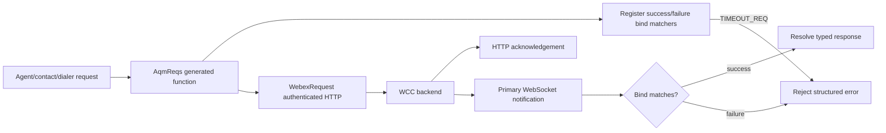
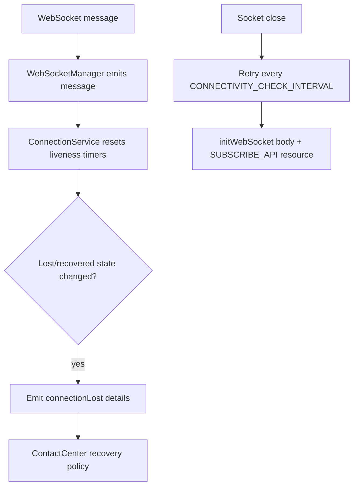
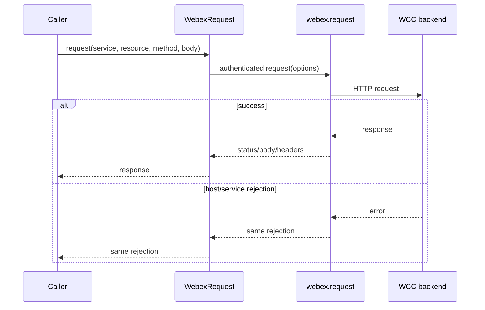
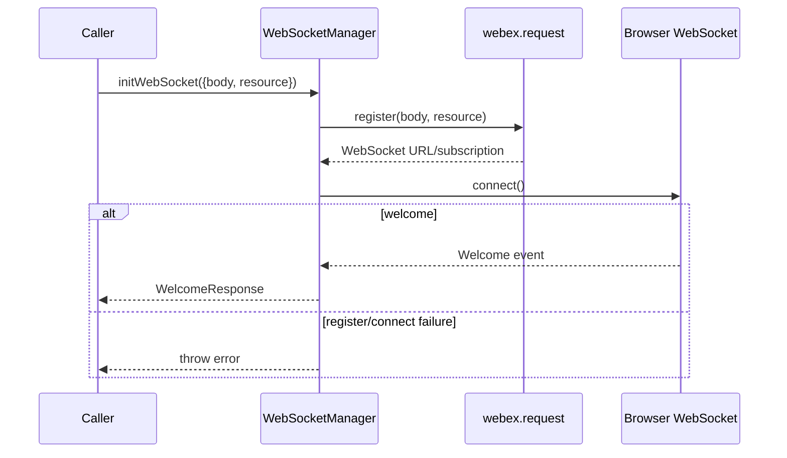
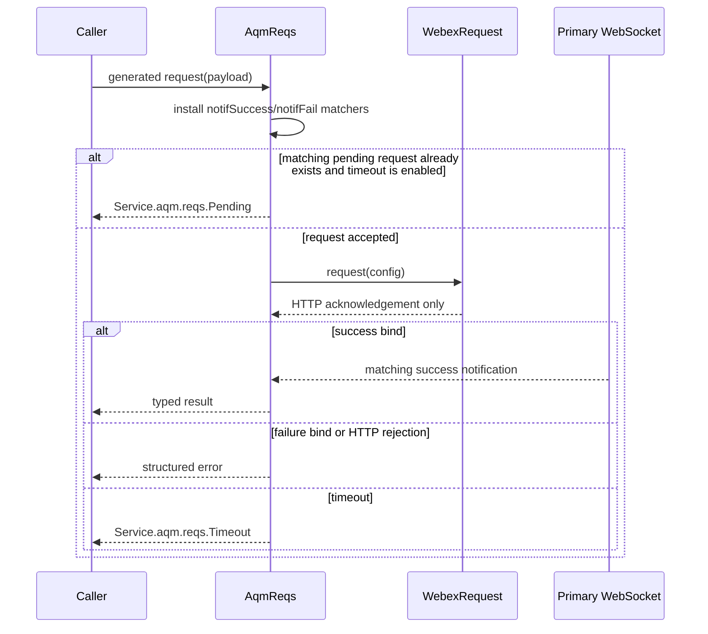
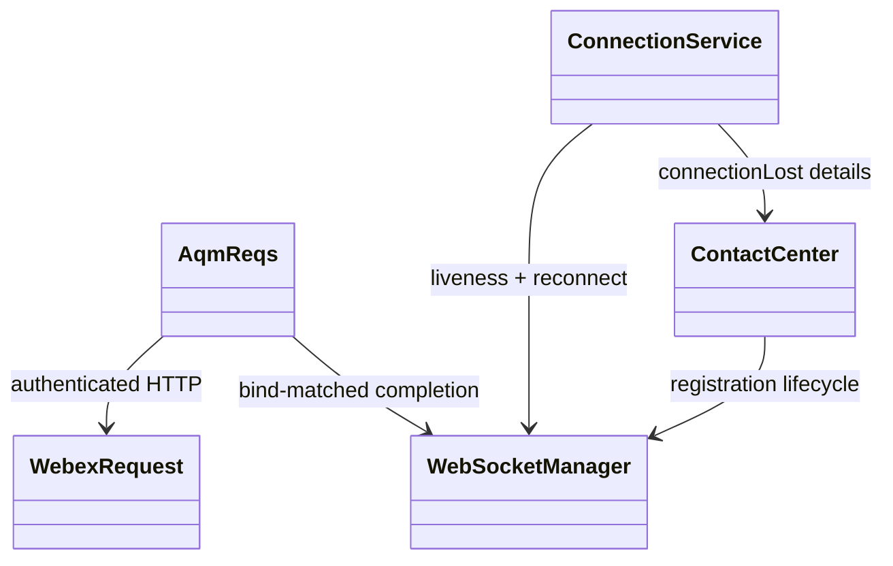
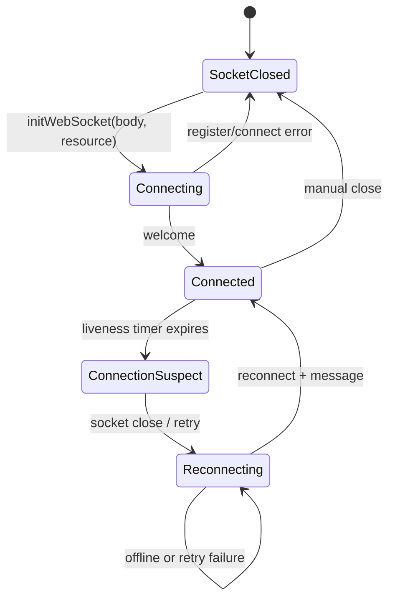
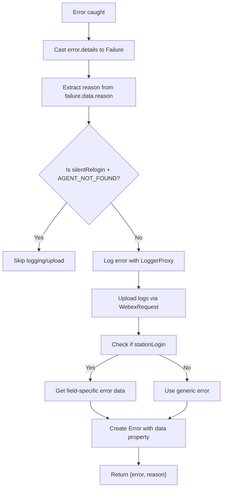

# Core — SPEC

> Start here → root [`AGENTS.md`](../../../../AGENTS.md) · router [`SPEC_INDEX.md`](../../../../ai-docs/SPEC_INDEX.md) · system [`ARCHITECTURE.md`](../../../../ai-docs/ARCHITECTURE.md). This is the module's canonical specification.

## Metadata

| Field | Value |
|---|---|
| Module id | `core` |
| Source path(s) | `src/services/core` |
| Doc kind | Module spec |
| Coverage score | Partial (manifest-authoritative); 15/15 required document fields present |
| Generated from | `module-spec` @ SDLC template library `0.2.1` |
| generated_by / approved_by / updated_at | Codex generator / developer-approved review remediation / 2026-07-15 |
| Validation status | Pass with warnings for PR #5088 remediation scope (claude-code, 2026-07-15): 0 blocking; 1 important test-coverage gap; module coverage remains Partial |

## Evidence Rules
Every requirement cites stable source and test file paths. Code/tests are the behavioral referee; routed source text supplies explicit intent and rationale. Missing or contradictory evidence blocks promotion.

## Source Material Register
| Source material | Scope | Decision | Detail location or disposition |
|---|---|---|---|
| Reviewed prior module guides and architecture material | overview / architecture / API / tests | used and code-checked | Content is placed by meaning throughout this specification; exact routing remains in the manifest. |

## Overview
Core is one of nine confirmed Contact Center SDK modules. Own authenticated HTTP, realtime WebSocket lifecycle, AQM request correlation, reconnect/keepalive behavior, and shared error normalization. Existing reviewed documentation is migrated by meaning and code/tests remain the behavioral referee.

The Core service provides the foundational infrastructure layer that all other services depend on:

- **WebSocket Communication**: Real-time bidirectional messaging with the contact center backend, including automatic reconnection and keepalive management

- **HTTP Request Handling**: Authenticated REST API calls to WCC API Gateway with built-in error handling and log upload support

- **AQM Request/Response Pattern**: A structured pattern used by the routing and contact layers to send HTTP requests to the contact center backend and correlate responses/failures via WebSocket notifications

- **Error Handling & Logging**: Standardized error extraction, logging via `LoggerProxy`, and log upload utilities that all services use for consistent error reporting

| Component | File | Description |
|---|---|---|
| `WebSocketManager` | [`WebSocketManager.ts`](../websocket/WebSocketManager.ts) | Manages the WebSocket connection lifecycle including initialization, message dispatch, and graceful shutdown. Emits `message` events for incoming data and `socketClose` when the connection drops while reconnect is allowed. |
| `ConnectionService` | [`connection-service.ts`](../websocket/connection-service.ts) | Orchestrates reconnection logic and keepalive heartbeats on top of `WebSocketManager`. Detects connection loss/recovery and emits `connectionLost` details; ContactCenter owns any `silentRelogin()` policy. |
| `WebexRequest` | [`WebexRequest.ts`](../WebexRequest.ts) | Singleton HTTP client that forwards service/resource/method/body options to the authenticated host request API and provides `uploadLogs` diagnostics. |
| `AqmReqs` | [`aqm-reqs.ts`](../aqm-reqs.ts) | Factory for creating request methods that send HTTP requests and wait for correlated WebSocket notifications (success or failure). Used by routing and task services to implement their API methods. |
| `Utils` | [`Utils.ts`](../Utils.ts) | Shared utility functions including `getErrorDetails()` for standardized error handling, `generateTaskErrorObject()` for task-specific errors, and `createErrDetailsObject()` for constructing error detail objects. |
| `Err` | [`Err.ts`](../Err.ts) | Error class definitions. `Err.Details` carries structured error metadata (status, type, trackingId) for consistent error propagation. |
| `constants` | [`constants.ts`](../constants.ts) | Timeout values, interval durations, participant types, interaction states, and method name constants used throughout the core layer. Any new constants for core should be defined here. |

## Purpose / Responsibility
Own authenticated HTTP, realtime WebSocket lifecycle, AQM request correlation, reconnect/keepalive behavior, and shared error normalization.

## Stack
TypeScript/JavaScript, WebSocket, Web Worker keepalive, EventEmitter, Webex request client, Jest 27.

## Folder / Package Structure
```text
src/services/core/
├── Err.ts
├── GlobalTypes.ts
├── Utils.ts
├── WebexRequest.ts
├── aqm-reqs.ts
├── constants.ts
├── types.ts
├── websocket/
```

```text
services/core/
├── aqm-reqs.ts           # AQM request handler
├── constants.ts          # Core constants
├── Err.ts                # Error classes
├── GlobalTypes.ts        # Failure, Msg<T>, etc.
├── types.ts              # Request/response types
├── Utils.ts              # Utility functions
├── WebexRequest.ts       # HTTP client
└── websocket/
    ├── WebSocketManager.ts    # Main WS handler
    ├── connection-service.ts  # Connection lifecycle
    ├── keepalive.worker.js    # Keepalive worker
    └── types.ts               # WS types
```

## Key Files (source of truth)
| File | Holds |
|---|---|
| `src/services/core/WebexRequest.ts` | Authoritative Core implementation or contract source. |
| `src/services/core/aqm-reqs.ts` | Authoritative Core implementation or contract source. |
| `src/services/core/Utils.ts` | Authoritative Core implementation or contract source. |
| `src/services/core/Err.ts` | Authoritative Core implementation or contract source. |
| `src/services/core/websocket/WebSocketManager.ts` | Authoritative Core implementation or contract source. |
| `src/services/core/websocket/connection-service.ts` | Authoritative Core implementation or contract source. |

## Public Surface
| Contract ID | Type | Surface | Purpose | Compatibility / deprecation | Schema / detail link | Root index |
|---|---|---|---|---|---|---|
| `core.surface` | SDK / event / internal API | Internal WebexRequest, WebSocketManager, ConnectionService, AqmReqs, and shared error/request types and helpers. | Stable module consumption boundary. | Additive changes by default; breaking package exports require a major-version transition. | `src/services/core/WebexRequest.ts` | `../../../../ai-docs/CONTRACTS.md` |

Compatibility notes:
- Do not remove or reinterpret exported symbols/events without a documented consumer migration.

| Event | Data | Description |
|---|---|---|
| `message` | string (JSON) | WebSocket message received |
| `socketClose` | - | Socket closed while reconnect is allowed |

Generic message wrapper used throughout the SDK. All WebSocket messages and AQM responses conform to this shape:

```typescript
export type Msg<T = any> = {
  type: string;       // Message/Event type identifier
  orgId: string;      // Organization identifier
  trackingId: string; // Unique tracking identifier
  data: T;            // Message/Event payload data
};

// Usage — the payload type goes into `data`
export type LoginSuccess = Msg<{
  agentId: string;
  status: string;
  // ...
}>;
// Resulting shape: { type, orgId, trackingId, data: { agentId, status, ... } }
```

### ConnectionService internal surface — not public contracts

The only public method in the following list is `setConnectionProp`. The remaining methods are private implementation details documented for ownership and maintenance; they are not public API contracts.

1. `setConnectionProp(prop: ConnectionProp): void` (public)

- **Purpose**: Updates connection-level runtime settings used by timers (mainly recovery timeout behavior).

- **Params**: `prop` - new connection config object.

- **Returns**: `void`.

- **Usage**: Called by higher layers when timeout behavior must be tuned after initialization.

2. `setupEventListeners(): void` (private)

- **Purpose**: Wires `WebSocketManager` events to internal handlers (`'message' -> onPing`, `'socketClose' -> onSocketClose`).

- **Params**: none.

- **Returns**: `void`.

- **Usage**: Invoked from the constructor once, during `ConnectionService` setup.

3. `onPing(event: any): void` (private)

- **Purpose**: Handles every incoming socket message, resets timers, updates keepalive/recovery flags, and emits recovery events when state changes.

- **Params**: `event` - raw message payload (JSON string) received from the socket event stream.

- **Returns**: `void`.

- **Usage**: Triggered automatically by the `'message'` listener.

4. `onSocketClose(): void` (private)

- **Purpose**: Starts the reconnect interval when socket close is detected.

- **Params**: none.

- **Returns**: `void`.

- **Usage**: Triggered automatically by the `'socketClose'` listener.

5. `handleSocketClose(): Promise<void>` (private)

- **Purpose**: Performs one reconnect attempt; if browser is online, reinitializes WebSocket and marks socket as reconnected.

- **Params**: none.

- **Returns**: `Promise<void>` (rejects when browser is offline).

- **Usage**: Called repeatedly from `onSocketClose` interval loop.

6. `handleConnectionLost(): void` (private)

- **Purpose**: Marks the connection as lost and dispatches a connection status event.

- **Params**: none.

- **Returns**: `void`.

- **Usage**: Scheduled by `onPing` via `reconnectingTimer` after inactivity.

7. `handleRestoreFailed(): Promise<void>` (private)

- **Purpose**: Marks restore as failed, disables reconnect, emits failure state, and clears reconnect interval.

- **Params**: none.

- **Returns**: `Promise<void>`.

- **Usage**: Scheduled by `onPing` via `restoreTimer`.

8. `clearTimerOnRestoreFailed(): Promise<void>` (private)

- **Purpose**: Stops active reconnect interval to avoid duplicate retries.

- **Params**: none.

- **Returns**: `Promise<void>`.

- **Usage**: Called from reconnect/failure paths whenever interval cleanup is needed.

9. `updateConnectionData(): void` (private)

- **Purpose**: Resets transient connection flags (`isConnectionLost`, `isRestoreFailed`, `isSocketReconnected`) after recovery.

- **Params**: none.

- **Returns**: `void`.

- **Usage**: Called inside `onPing` before dispatching recovered state.

10. `dispatchConnectionEvent(socketReconnected = false): void` (private)

- **Purpose**: Builds `ConnectionLostDetails`, forwards it to `WebSocketManager.handleConnectionLost`, and emits `'connectionLost'`.

- **Params**: `socketReconnected` - optional override used when reconnect is explicitly detected.

- **Returns**: `void`.

- **Usage**: Used by lost/recovered/restore-failed paths to publish uniform connection state.

```typescript
type ConnectionLostDetails = {
  isConnectionLost: boolean;
  isRestoreFailed: boolean;
  isSocketReconnected: boolean;
  isKeepAlive: boolean;
};

connectionService.on('connectionLost', (details: ConnectionLostDetails) => {
  if (details.isConnectionLost) {
    // Connection lost — waiting for recovery
  } else if (details.isRestoreFailed) {
    // Recovery timeout (50 s) exceeded
  } else if (details.isSocketReconnected) {
    // Socket successfully reconnected
  }
});
```

## Requires (dependencies)
- Webex SDK service catalog and authenticated request API
- Browser WebSocket, Worker, URL and network-status APIs
- LoggerProxy and log upload

## Requirements
| ID | WHAT | WHY | Source Evidence | Test / Example Evidence | Assumptions / Gaps | Confidence |
|---|---|---|---|---|---|---|
| CORE-R-001 | WebexRequest must delegate service/resource/method/body options to the authenticated host request API and return or reject with the host result unchanged. | All Contact Center REST clients share host-owned authentication and service routing without duplicating credential logic. | `src/services/core/WebexRequest.ts` | `test/unit/spec/services/core/WebexRequest.ts` | Authorization-header masking belongs to `AqmReqs` HTTP-failure handling, not `WebexRequest.request`. | PRESENT |
| CORE-R-002 | `initWebSocket` requires `{body: SubscribeRequest, resource: string}` and resolves only after WebSocket welcome or rejects on register/connect failure. | Subscription resource selection and readiness are required for a valid realtime session. | `src/services/core/websocket/WebSocketManager.ts` | `test/unit/spec/services/core/websocket/WebSocketManager.ts` | None; source and test evidence rechecked during the 2026-07-09 remediation; independent document revalidation pending. | PRESENT |
| CORE-R-003 | AqmReqs must be constructed with the primary WebSocket manager and settle generated request promises from `notifSuccess`/`notifFail` binds or `TIMEOUT_REQ`. | HTTP acknowledgement alone does not represent backend operation completion. | `src/services/core/aqm-reqs.ts` | `test/unit/spec/services/core/aqm-reqs.ts` | None; source and test evidence rechecked during the 2026-07-09 remediation; independent document revalidation pending. | PRESENT |
| CORE-R-004 | ConnectionService must emit transport-state details and retry `initWebSocket({body, resource})`; ContactCenter owns relogin policy. | Separating transport detection from agent recovery prevents Core from mutating package-level session state. | `src/services/core/websocket/connection-service.ts` | `test/unit/spec/services/core/websocket/connection-service.ts` | None; source and test evidence rechecked during the 2026-07-09 remediation; independent document revalidation pending. | PRESENT |
| CORE-R-005 | The keepalive worker must use the configured 4-second interval and 16-second close-socket timeout; AQM defaults to 20 seconds unless disabled/overridden. | Accurate timing is required for predictable recovery and request failure behavior. | `src/services/core/constants.ts` | `test/unit/spec/services/core/websocket/WebSocketManager.ts` | None; source and test evidence rechecked during the 2026-07-09 remediation; independent document revalidation pending. | PRESENT |
| CORE-R-006 | Treat Core timeout, keepalive, and recovery constants as fixed behavior controls, not rollout flags; Core owns no feature-gate evaluation. | Conflating operational constants with rollout policy could disable transport or correlation paths unexpectedly. | `src/services/core/constants.ts`, `src/services/index.ts` | `test/unit/spec/services/core/websocket/WebSocketManager.ts` | None; rollout applicability is explicitly N/A for Core. | PRESENT |

## Design Overview
Core separates four responsibilities:

1. `WebexRequest` wraps the authenticated host request API and service-catalog routing.
2. `WebSocketManager` registers a subscription using both `body` and `resource`, connects the socket, owns the keepalive worker, and emits raw messages/socket lifecycle events.
3. `AqmReqs` registers bind matchers on the primary WebSocket, sends HTTP through WebexRequest, and settles requests only from matching notifications, HTTP failure, or timeout.
4. `ConnectionService` observes message/socket liveness, emits connection-state details, and retries socket initialization. ContactCenter listens to those details and owns optional silent relogin.

```typescript
const aqmReqs = new AqmReqs(webSocketManager);
const setState = aqmReqs.req((p: {data: Agent.StateChange}) => ({
  host: WCC_API_GATEWAY,
  url: '/v1/agents/session/state',
  data: p.data,
  method: HTTP_METHODS.PUT,
  notifSuccess: {
    bind: {
      type: CC_EVENTS.AGENT_STATE_CHANGE,
      data: {type: CC_EVENTS.AGENT_STATE_CHANGE_SUCCESS},
    },
    msg: {} as Agent.StateChangeSuccess,
  },
  notifFail: {
    bind: {
      type: CC_EVENTS.AGENT_STATE_CHANGE,
      data: {type: CC_EVENTS.AGENT_STATE_CHANGE_FAILED},
    },
    errId: 'Service.aqm.agent.stateChange',
  },
}));
await setState({data: stateChangePayload});
```

`CLOSE_SOCKET_TIMEOUT` is 16000 ms. `CONNECTIVITY_CHECK_INTERVAL` drives reconnect attempts separately. `TIMEOUT_REQ` is the 20000 ms default AQM timeout; `WEBSOCKET_EVENT_TIMEOUT` is not the active AqmReqs default.

## Data Flow




## Sequence Diagram(s)
Sequence coverage:

| Operation group | Diagram | Failure / recovery coverage |
|---|---|---|
| Authenticated REST | WebexRequest | Host/service rejection is propagated unchanged; AQM applies its own error mapping separately. |
| WebSocket subscribe/connect | Subscribe and connect | Register/connect rejection and welcome resolution. |
| AQM operation | Correlated request | Duplicate pending request, HTTP failure, failure bind, and timeout reject. |
| Reconnect | Connection recovery | Offline attempts retry on the next interval; restored and restore-failed states are emitted to ContactCenter. |

### WebexRequest



### Subscribe and connect



### Correlated request



### Connection recovery

```mermaid
sequenceDiagram
  participant WSM as WebSocketManager
  participant CS as ConnectionService
  participant CC as ContactCenter
  WSM-->>CS: socketClose/message events
  CS->>CS: update timers and reconnect state
  alt browser online during retry interval
    CS->>WSM: initWebSocket({body: subscribeRequest, resource: SUBSCRIBE_API})
    WSM-->>CS: welcome/message
    CS-->>CC: connectionLost({isSocketReconnected: true})
    CC->>CC: decide whether to silentRelogin()
  else browser offline or reconnect fails
    CS->>CS: retain interval; retry on next CONNECTIVITY_CHECK_INTERVAL
    opt recovery timeout expires
      CS-->>CC: connectionLost({isRestoreFailed: true})
    end
  end
```

## Class / Component Relationships


## Use Cases
- **UC-1 Authenticated REST:** pass the service key and request options to the host and return its response or rejection unchanged. Evidence: `src/services/core/WebexRequest.ts`, `test/unit/spec/services/core/WebexRequest.ts`.
- **UC-2 Subscribe/connect:** register with `{body, resource}`, connect, and wait for welcome. Evidence: `src/services/core/websocket/WebSocketManager.ts`, `test/unit/spec/services/core/websocket/WebSocketManager.ts`.
- **UC-3 AQM correlation:** send HTTP but settle on matching notification/failure/timeout. Evidence: `src/services/core/aqm-reqs.ts`, `test/unit/spec/services/core/aqm-reqs.ts`.
- **UC-4 Reconnect:** retry socket initialization and emit state for ContactCenter-owned recovery. Evidence: `src/services/core/websocket/connection-service.ts`, `test/unit/spec/services/core/websocket/connection-service.ts`.

## State Model
WebSocketManager owns socket/welcome/worker state. AqmReqs owns pending success/failure/cancel bind maps until settlement or timeout. ConnectionService owns liveness/reconnect timers and flags, then emits state details. It does not own agent credentials, profile, or silent relogin.

## Business Rules & Invariants
- Core must preserve its typed public/event contracts and must not invent backend states or responses. Enforced in `src/services/core/WebexRequest.ts`.
- Rollout applicability is N/A for Core: keepalive, timeout, and reconnect constants control behavior, while Services constructs Core without a feature gate.

## Concurrency & Reactive Flow
The primary WebSocket fans messages to independent AqmReqs, ContactCenter, TaskManager, and ConnectionService listeners. AqmReqs clears all correlated bind entries on settlement. The keepalive worker posts status every 4000 ms and may request closure after 16000 ms offline; reconnect attempts use their separate interval. Listener registration/removal must preserve identity.

## State Machine


## Protocol / Wire Format
`WebSocketManager.initWebSocket` accepts `{body: SubscribeRequest, resource: string}`. Subscription uses the host Webex request API; AqmReqs operational HTTP uses the WebexRequest wrapper. AQM request configs carry `host`, `url`, optional `method`/`data`, `notifSuccess.bind`, optional `notifFail.bind`, optional cancel bind, and optional timeout. HTTP acknowledgement never substitutes for the matching WebSocket operation result.

## Error Handling & Failure Modes
| Condition | Signal (error/code/result) | Caller recovery |
|---|---|---|
| Dependency rejection | Typed/rethrown error or failure event | Inspect structured details, preserve tracking id, and retry only when the operation is safe. |
| Timeout or missing async completion | Timeout/recovery state | Follow the module-specific recovery path; never synthesize success. |

Standard error handler for SDK operations:

```typescript
import {getErrorDetails} from './services/core/Utils';

try {
  await operation();
} catch (error) {
  const {error: detailedError, reason} = getErrorDetails(
    error,
    'methodName',  // Method name for logging
    'ModuleName'   // Module name for logging
  );

  // getErrorDetails automatically:
  // 1. Logs the error
  // 2. Uploads logs (unless AGENT_NOT_FOUND in silentRelogin)
  // 3. Extracts reason from error.details
  // 4. Creates Error with reason as message

  throw detailedError;
}
```

Error handler for task operations:

```typescript
import {generateTaskErrorObject} from './services/core/Utils';

try {
  await taskOperation();
} catch (error) {
  const taskError = generateTaskErrorObject(
    error,
    'transfer',
    'TaskModule'
  );
  throw taskError;
}
```

A specific `Msg<T>` for failure responses. Access error details via `failure.data`:

```typescript
export type Failure = Msg<{
  agentId: string;
  trackingId: string;
  reasonCode: number;
  orgId: string;
  reason: string;
}>;

// Usage in catch
const failure = error.details as Failure;
LoggerProxy.error(`Operation failed: ${failure.data?.reason}`, {
  module: 'MyService',
  method: 'myMethod',
  trackingId: failure?.trackingId,
});
```

Error interface with a flexible data field for additional context:

```typescript
export interface AugmentedError extends Error {
  data?: Record<string, any>;
}
```

```typescript
import * as Err from './Err';

const error = new Err.Details('Service.aqm.agent.login', {
  status: 401,
  type: 'UNAUTHORIZED',
  trackingId: 'uuid',
});
```

```typescript
import {createErrDetailsObject} from './Utils';

const errDetails = createErrDetailsObject(webexRequestPayload);
// Returns Err.Details with trackingId and body
```

```typescript
// Correct
const {error: detailedError} = getErrorDetails(error, method, module);
throw detailedError;

// Wrong - loses context
throw error;
```

This section documents shared error helpers in `Utils.ts` that normalize errors, enrich them with context, and ensure consistent logging/upload behavior across services.

```typescript
// Msg - Generic message interface (GlobalTypes.ts)
export type Msg<T = any> = {
  type: string;
  orgId: string;
  trackingId: string;
  data: T;
};

// Failure - Backend error structure (GlobalTypes.ts)
// Built on Msg<T> with specific error data fields
export type Failure = Msg<{
  agentId: string;
  trackingId: string;
  reasonCode: number;
  orgId: string;
  reason: string;
}>;

// AugmentedError - Extended Error with flexible data field (GlobalTypes.ts)
export interface AugmentedError extends Error {
  data?: Record<string, any>;
}
```



Use this helper for agent/config-style flows where backend failure payloads are transformed into a user-facing `Error` plus `reason`, with optional station-login field metadata.

```typescript
export const getErrorDetails = (error: any, methodName: string, moduleName: string) => {
  let errData = {message: '', fieldName: ''};

  const failure = error.details as Failure;
  const reason = failure?.data?.reason ?? `Error while performing ${methodName}`;

  // Log error (unless AGENT_NOT_FOUND in silentRelogin)
  if (!(reason === 'AGENT_NOT_FOUND' && methodName === 'silentRelogin')) {
    LoggerProxy.error(`${methodName} failed with reason: ${reason}`, {
      module: moduleName,
      method: methodName,
      trackingId: failure?.trackingId,
    });

    // Upload logs
    WebexRequest.getInstance().uploadLogs({
      correlationId: failure?.trackingId,
    });
  }

  // For stationLogin, extract field-specific error data (message + fieldName)
  if (methodName === 'stationLogin') {
    errData = getStationLoginErrorData(failure, error.loginOption);
  }

  const err = new Error(reason);
  // @ts-ignore - custom property for backward compatibility
  err.data = errData;

  return {error: err, reason};
};
```

Use this helper for task/interaction flows where richer task error metadata (`errorType`, `errorData`, `reasonCode`, `trackingId`) is required on the returned `AugmentedError`.

```typescript
export const generateTaskErrorObject = (
  error: any,
  methodName: string,
  moduleName: string
): AugmentedError => {
  const trackingId = error?.details?.trackingId || error?.trackingId || '';
  const errorMsg = error?.details?.msg;

  const errorMessage = errorMsg?.errorMessage || error.message || 'Error';
  const errorType = errorMsg?.errorType || error.name || 'Unknown Error';
  const errorData = errorMsg?.errorData || '';
  const reasonCode = errorMsg?.reasonCode || 0;

  LoggerProxy.error(`${methodName} failed: ${errorMessage} (${errorType})`, {
    module: moduleName,
    method: methodName,
    trackingId,
  });
  WebexRequest.getInstance().uploadLogs({correlationId: trackingId});

  const reason = `${errorType}: ${errorMessage}${errorData ? ` (${errorData})` : ''}`;
  const err: AugmentedError = new Error(reason);
  err.data = {
    message: errorMessage,
    errorType,
    errorData,
    reasonCode,
    trackingId,
  };

  return err;
};
```

```typescript
// Use getErrorDetails for:
// - Agent service operations
// - Station login/logout flows
//
// Use generateTaskErrorObject for:
// - Task service operations
// - Interaction-related errors
```

**Cause**: Subscribe API failed or invalid URL

**Solution**: Check subscribe response and WebSocket URL

**Cause**: Event listener not registered

**Solution**: Ensure `on('message', handler)` called before connect

**Cause**: Keepalive not enabled or network issues

**Solution**: Verify worker-driven keepalive is running after socket `onopen`, and check network/offline transitions

## Pitfalls
- `initWebSocket` requires both `body` and `resource`; omitting `resource` registers against no durable subscription endpoint.
- AqmReqs installs notification binds before HTTP and never resolves from acknowledgement; duplicate binds, timeout, and cleanup ordering are correctness-critical.
- Keepalive closure (16 seconds), lost-connection detection (8 seconds), reconnect interval (5 seconds), and recovery timeout (50 seconds) are separate controls and must not be conflated.

## Module Do's / Don'ts
- DO keep authentication and service resolution in the host Webex request layer; `WebexRequest.request` is a thin delegating wrapper.
- DO mask authorization headers in the `AqmReqs` HTTP-error/timeout paths before those details are logged or surfaced.
- DO clear success/failure/cancel bind entries together when an AQM request settles.
- DON'T move silent-relogin policy into ConnectionService; it emits transport state only.
- DON'T treat timeout constants as feature flags or reuse one timer for another lifecycle purpose.

```typescript
const response = await webexReq.request({...});

if (response.statusCode !== 200) {
  throw new Error(`API call failed with ${response.statusCode}`);
}
```

```typescript
const trackingId = response.headers?.trackingid ||
                   response.headers?.TrackingID;
```

## Key Design Trade-off
- Request initiation stays HTTP while completion can arrive asynchronously over WebSocket; explicit timers and correlation preserve backend fidelity but increase lifecycle complexity.

## Test-Case Strategy (module)
Unit tests mirror module paths under `test/unit/spec/services/core`. Preserve positive and negative paths, event ordering, timeout/recovery behavior, and the package's 85% global branch/function/line/statement threshold.

| Behavior / Requirement | Existing test evidence | Gap |
|---|---|---|
| `CORE-R-001` | `test/unit/spec/services/core/WebexRequest.ts` | None. |
| `CORE-R-002` | `test/unit/spec/services/core/websocket/WebSocketManager.ts` | None. |
| `CORE-R-003` | `test/unit/spec/services/core/aqm-reqs.ts` | None. |
| `CORE-R-004` | `test/unit/spec/services/core/websocket/connection-service.ts` | None. |
| `CORE-R-005` | `test/unit/spec/services/core/websocket/WebSocketManager.ts` | Keep timer-value assertions synchronized with constants. |
| `CORE-R-006` | `test/unit/spec/services/core/websocket/WebSocketManager.ts` | Feature-gate absence is verified from construction/source rather than a dedicated negative test. |

## Traceability
- Repo architecture: `../../../../ai-docs/ARCHITECTURE.md` · Registry: `../../../../ai-docs/SPEC_INDEX.md`
- Coverage state and contracts baseline: `../../../../.sdd/manifest.json`

- [Root Orchestrator AGENTS.md](../../../../AGENTS.md) - Task routing, critical rules, cross-service patterns

- [WebSocketManager.ts](../websocket/WebSocketManager.ts)

- [WebexRequest.ts](../WebexRequest.ts)

- [Utils.ts](../Utils.ts)

- [GlobalTypes.ts](../GlobalTypes.ts)

- [Root Orchestrator AGENTS.md](../../../../AGENTS.md) — Task routing, critical rules, cross-service patterns

- [WebSocketManager.ts](../websocket/WebSocketManager.ts) — WebSocket lifecycle, keepalive worker integration

- [connection-service.ts](../websocket/connection-service.ts) — Reconnection logic, connection state events

- [keepalive.worker.js](../websocket/keepalive.worker.js) — Web Worker for periodic keepalive and offline detection

- [WebexRequest.ts](../WebexRequest.ts) — Singleton HTTP request handler

- [Utils.ts](../Utils.ts) — `getErrorDetails`, `generateTaskErrorObject`, consult utilities

- [Err.ts](../Err.ts) — `Err.Message` and `Err.Details` error classes

- [aqm-reqs.ts](../aqm-reqs.ts) — AQM request/response pattern, WebSocket notification binding

- [GlobalTypes.ts](../GlobalTypes.ts) — `Msg`, `Failure`, `AugmentedError` type definitions

- [types.ts](../types.ts) — `Pending`, `Req`, `Conf`, `Res` types for AqmReqs
