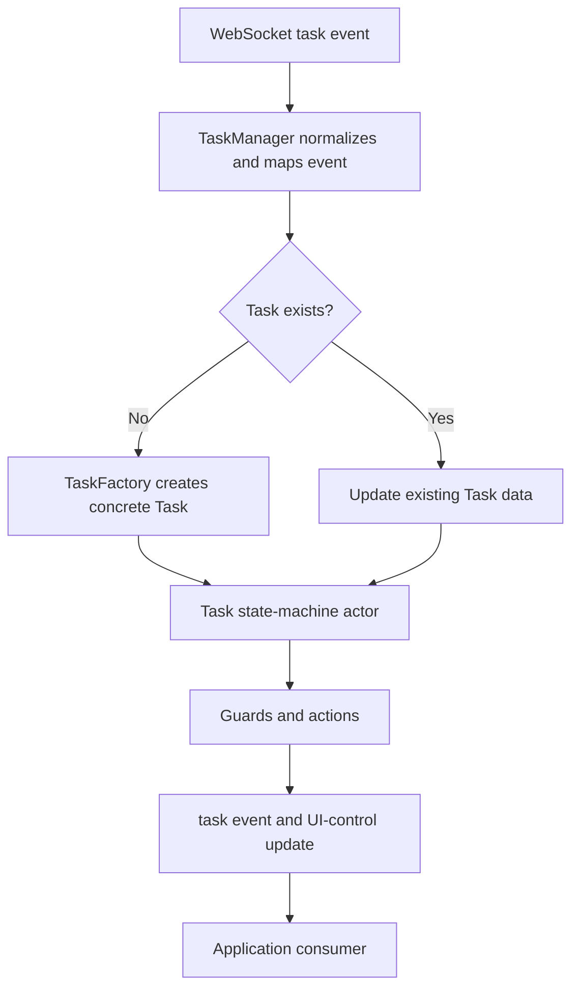

# Task Service - AI Agent Guide

> **Legacy/reference-only.** Canonical SDD: [`task-spec.md`](task-spec.md). Use the package [manifest](../../../../.sdd/manifest.json) and [`SPEC_INDEX.md`](../../../../ai-docs/SPEC_INDEX.md) for routing; code and tests remain the behavioral referee.

## Purpose

Manage task lifecycle, task-scoped public APIs, and task event delivery for the
Contact Center SDK. Task code remains the owner of AQM task operations; AI
summary request/response methods are additive and compose the AI Assistant
adapter plus the package-internal summary coordinator.

## Source Files

- `Task.ts`: base task implementation, public Task methods, state-machine
  integration, AI summary request/response validation and metrics.
- `TaskManager.ts`: task registry, websocket-to-task lifecycle routing, RTD AI
  frame parsing, summary coordinator ownership, feature forwarding, and cleanup.
- `AISummaryCoordinator.ts`: pending summary requests, receiving-agent buffers,
  feature-enable snapshots, and timers.
- `TaskUtils.ts`: task state helpers plus AI summary correlation helpers.
- `types.ts`: `ITask`, task data types, public summary payloads, and internal
  coordinator contracts. The mid-call response payload is a discriminated union
  on `summaryReceived`: `MidCallReceivedResponse` (`summaryReceived: true`,
  states `DEFAULT | EXCLUDED | IGNORED | MID_CALL_CANCELLED`) and
  `MidCallUnavailableResponse` (`summaryReceived: false`, states
  `NOT_RECEIVED | MID_CALL_CANCELLED | IGNORED`).
- `constants.ts`: task API method names and package-internal summary timeout
  aliases.
- `TaskFactory.ts`: media-channel task construction. It does not know about AI
  summary injection; TaskManager configures each created task immediately after
  factory creation.

## Core Task Responsibilities

- Create and update task instances for telephony and digital interactions.
- Drive task state transitions through the state machine.
- Delegate AQM operations such as accept, hold, end, wrap-up, consult, and
  transfer through `contact.ts`.
- Emit established `task:*` events without changing existing payloads.
- Keep TaskManager as the registry and lifecycle owner; Task must not import
  TaskManager or config services.

## AI Summary Implementation Rules

Public signatures and literals live in code and are the source of truth:
`services/task/types.ts` for the payload/response types and `TASK_EVENTS`,
`constants.ts` for `AI_SUMMARY_ERROR_CODES` and the timeout constants,
`services/config/types.ts` for `CC_AI_SUMMARY_EVENTS`. Correlation, gating,
response branches, and timers are documented in
[ARCHITECTURE.md — AI Summary](./ARCHITECTURE.md#ai-summary-flows); metrics and
privacy in [metrics/ai-docs/AGENTS.md](../../../metrics/ai-docs/AGENTS.md#ai-summary-events).

Keep this guide limited to task-layer implementation boundaries:

- TaskManager injects `ApiAIAssistant`, `AISummaryRequestCoordinator`, and the
  current generated-summary flags accessor through `configureAISummary(...)`
  before listener setup or registry insertion.
- Task owns public request/response validation and final operation metrics; it
  must not import TaskManager or configuration services. For mid-call response
  validation, `summaryReceived: false` is accepted when `state` is one of
  `NOT_RECEIVED`, `MID_CALL_CANCELLED`, or `IGNORED`; `summaryReceived: true`
  accepts `DEFAULT`, `EXCLUDED`, `IGNORED`, or `MID_CALL_CANCELLED`.
- Register pending requests before HTTP. Use the returned owner/token identity
  only for exact transport cleanup; lifecycle cleanup settles live requests.
- Use `getAISummaryCorrelation(...)` for caller-facing validation and
  `tryGetAISummaryCorrelation(...)` while scanning registry/lifecycle state.
- Preserve request-time post-call response context across task-registry cleanup.
- Receiving-agent delivery remains a read-only TaskManager/coordinator path.
- Never put summary content, human-authored keys, card bodies, agent names, raw
  payloads, or arbitrary transport failures into logs or metrics.

Focused task tests live in `test/unit/spec/services/task/Task.ts`,
`TaskManager.ts`, `TaskUtils.ts`, and `AISummaryCoordinator.ts`.

## Existing Task-Layer Reference

AI-summary APIs extend the task layer without replacing its call-control, media, state-machine, or
wrap-up contracts.

### File ownership

| Path | Responsibility |
| --- | --- |
| `Task.ts` | Base task data, event surface, shared APIs, and state-machine actor |
| `TaskManager.ts` | Registry, WebSocket lifecycle orchestration, creation, hydration, and cleanup |
| `TaskFactory.ts` | Selects WebRTC, Voice, or Digital implementations |
| `contact.ts` | AQM call-control request definitions |
| `dialer.ts` | Outbound-dial request definition |
| `voice/Voice.ts` / `voice/WebRTC.ts` | Telephony and browser-media behavior |
| `digital/Digital.ts` | Digital-task behavior |
| `AutoWrapup.ts` | Automatic wrap-up timer behavior |
| `state-machine/` | XState transitions, guards, actions, and UI-control computation |

### Task construction and lifecycle

The hierarchy is `Task` → `Voice` → `WebRTC`, with `Digital` extending `Task` separately.
`TaskFactory` chooses the concrete class from the media channel and Web Calling login option.
Every production Task constructs and starts the task state-machine actor; TaskManager maps backend
events to `TaskEvent` payloads and sends those payloads to the Task.

Call-control methods delegate to `contact.ts` or `dialer.ts`; the resulting backend notification
drives the corresponding state transition. Do not bypass the state machine by emitting lifecycle
events directly in production code or composed lifecycle tests.

### Existing public task events

The `cc` object publishes `task:incoming`, `task:hydrate`, and `task:merged`. Individual tasks publish
the detailed lifecycle surface, including `task:featureEnablement` (AI summary feature flags for this
task — preferred over the cc-level `cc:featureEnablement` so consumers do not need an interactionId
→ flags map), and:

- assignment, media, unassignment, offer-contact, and offer-consult events;
- hold, resume, end, rejection, wrap-up, and wrapped-up events;
- consult-created, consulting, consult-accepted, and consult-end events;
- conference and participant lifecycle events;
- recording, switch-call, outdial-failure, and UI-control update events; and
- the internal `task:cleanup` signal consumed by TaskManager.

`REAL_TIME_TRANSCRIPTION` and `SUGGESTED_RESPONSE` remain existing AI Assistant task events and are
independent of the new summary request/response contracts.

### Existing public APIs

| API | Purpose | Result |
| --- | --- | --- |
| `cc.startOutdial(destination, origin)` | Initiate outbound calling; the Task arrives asynchronously | `Promise<TaskResponse>` |
| `task.accept()` | Accept an offered task | `Promise<TaskResponse>` |
| `task.hold(mediaResourceId?)` / `task.resume(mediaResourceId?)` | Control hold state | `Promise<TaskResponse>` |
| `task.end()` | End the active task | `Promise<TaskResponse>` |
| `task.wrapup({wrapUpReason, auxCodeId})` | Complete wrap-up | `Promise<TaskResponse>` |
| `task.transfer({to, destinationType})` | Transfer to an agent, queue, or dial number | `Promise<TaskResponse>` |
| `task.consult({to, destinationType})` | Start a consultation | `Promise<TaskResponse>` |
| `task.endConsult(payload?)` | End a consultation without transfer | `Promise<TaskResponse>` |

Applications should listen for task creation instead of treating the `startOutdial()` AQM response as
an `ITask` instance.

### Media, errors, and auto wrap-up

Supported task channels include telephony, chat, email, social, SMS, Facebook, and WhatsApp. Concrete
classes expose only operations valid for their channel. Call-control failures reject with structured
error data and must not be converted into successful state transitions.

When auto wrap-up is enabled by the agent profile, `AutoWrapup` owns the timer and Task emits
`task:wrappedup` after completion. AI-summary timers are separately owned by `AISummaryCoordinator`
and must not alter or reuse the auto-wrap-up timer.

Related details remain in [ARCHITECTURE.md](ARCHITECTURE.md),
`../state-machine/ai-docs/AGENTS.md`, and `../state-machine/ai-docs/ARCHITECTURE.md`.
