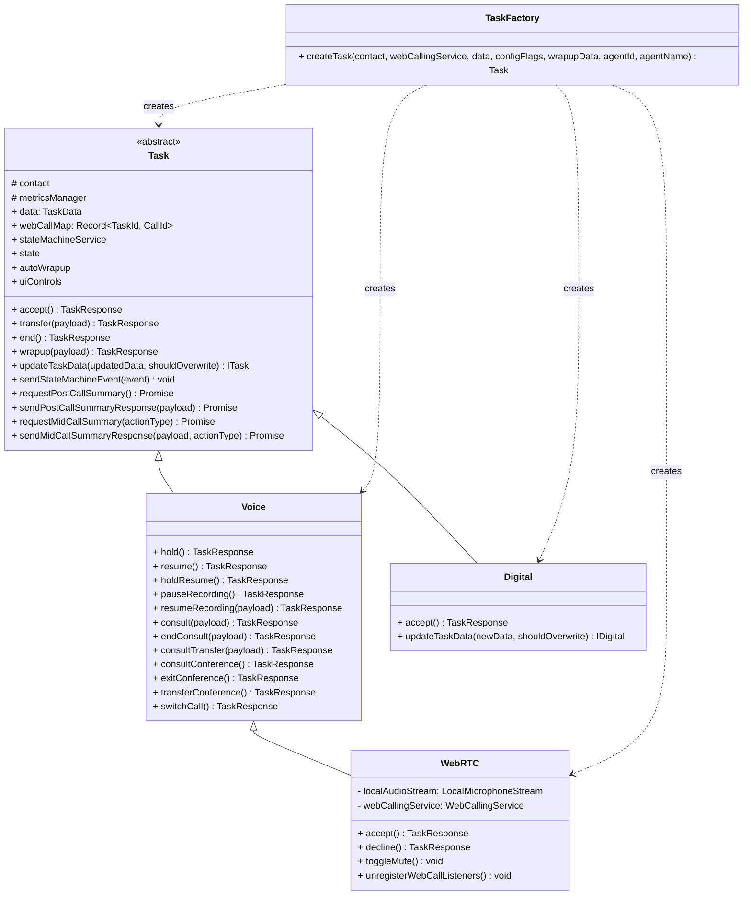
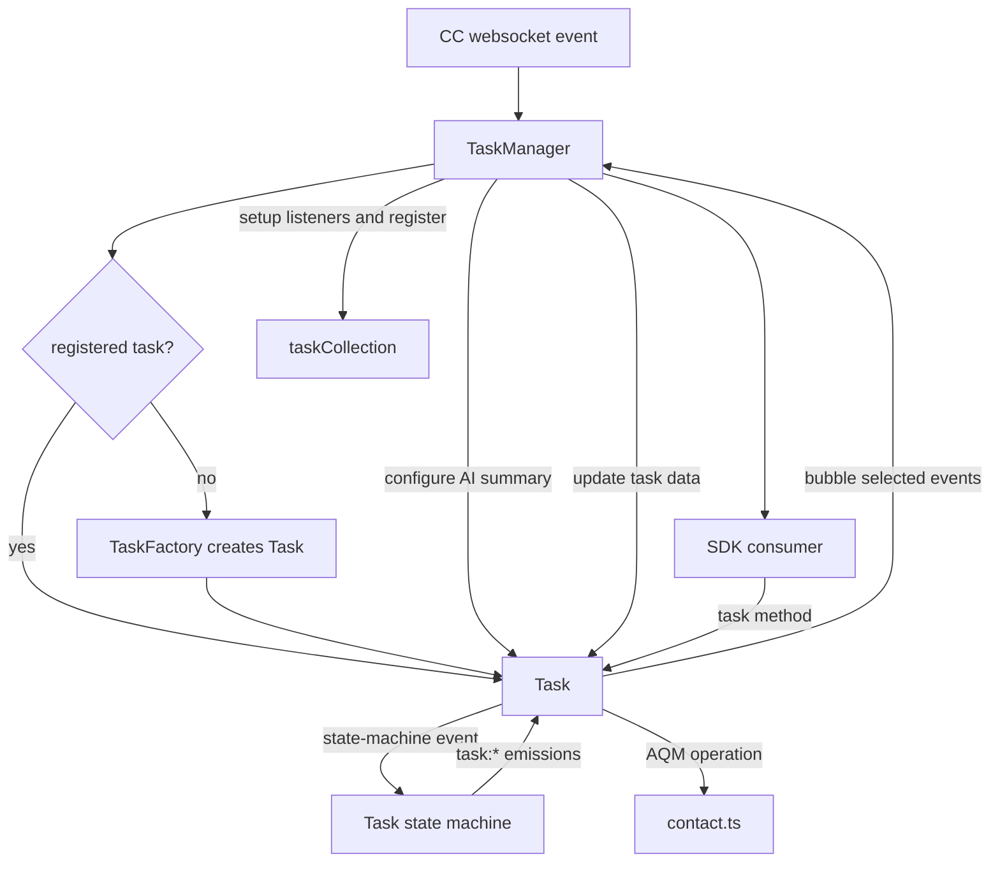
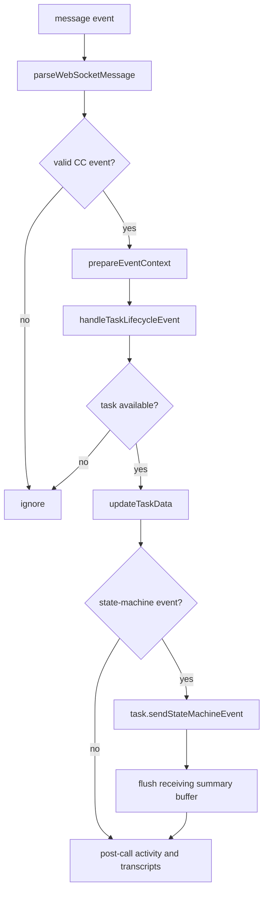
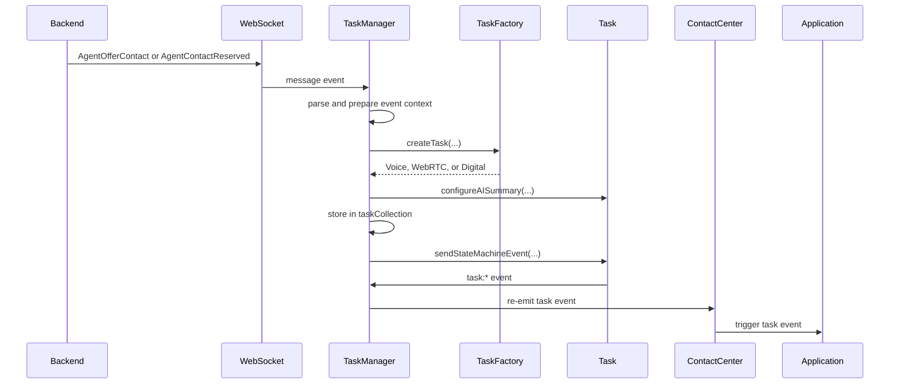
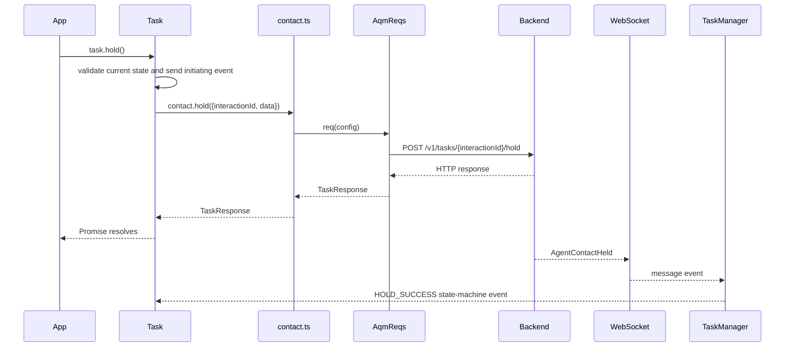
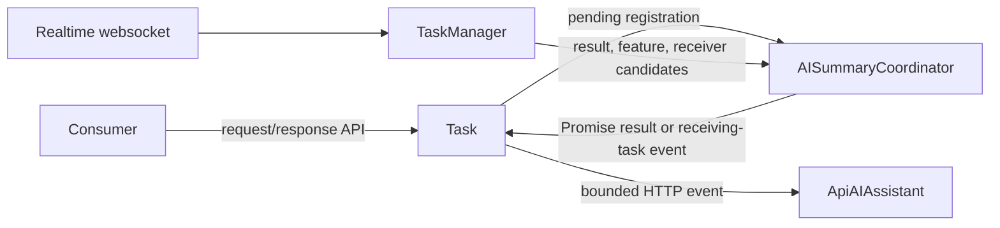
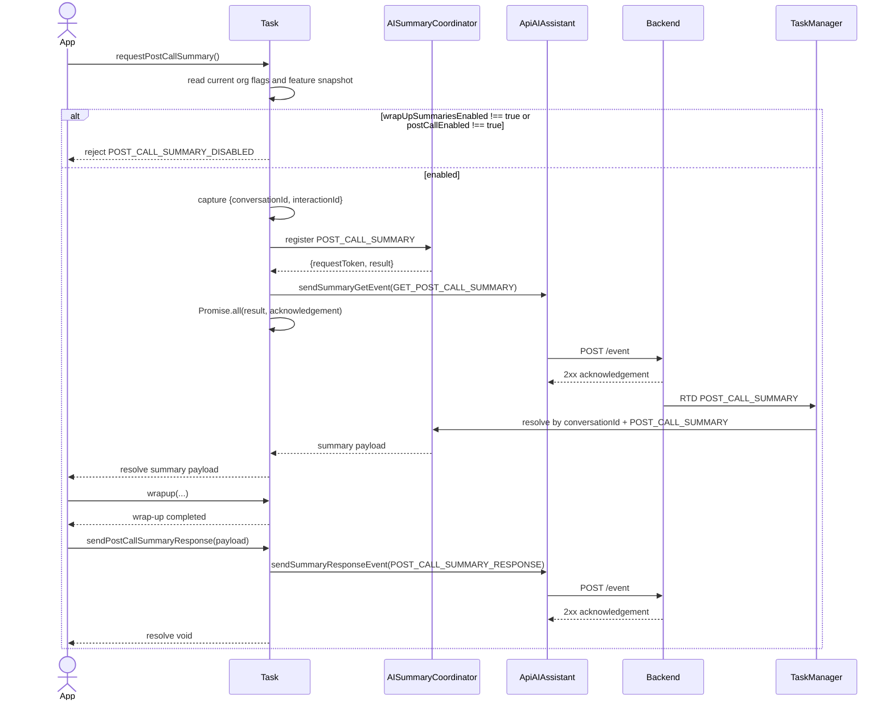
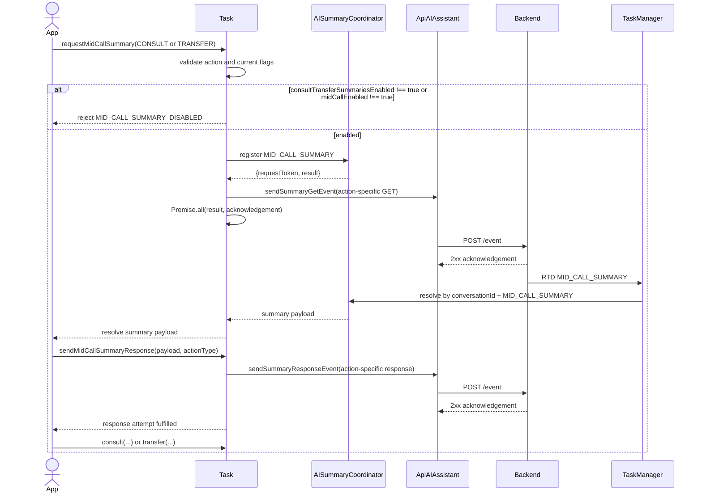
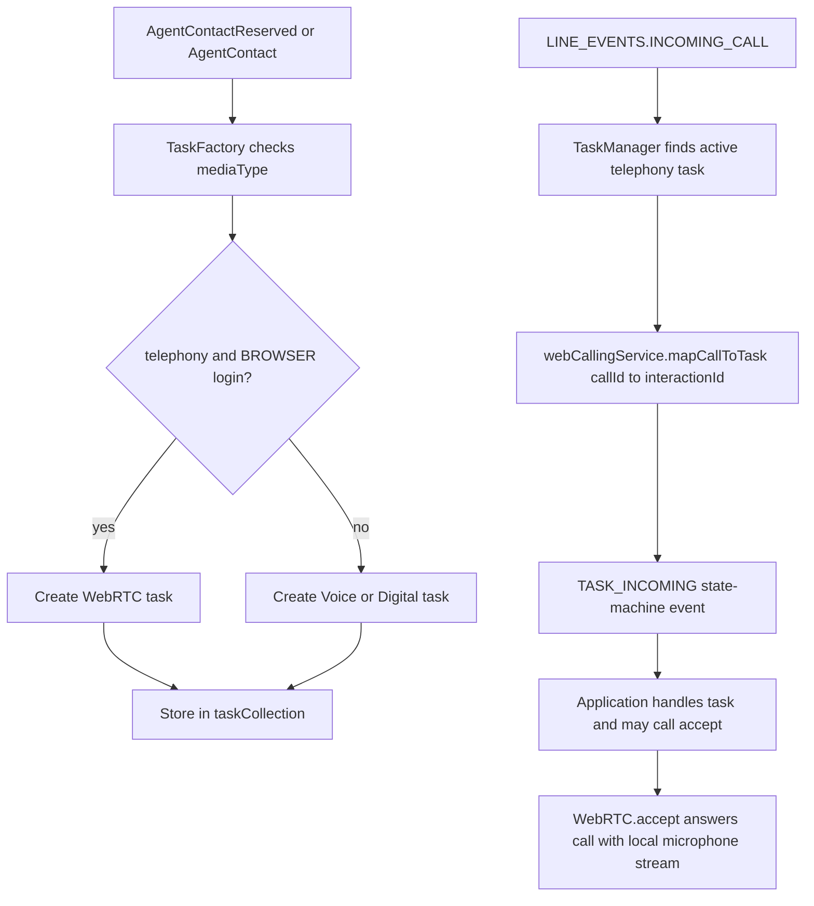

# Task Service - Architecture

> **Legacy/reference-only.** Canonical SDD: [`task-spec.md`](task-spec.md). Use the package [manifest](../../../../.sdd/manifest.json) and [`SPEC_INDEX.md`](../../../../ai-docs/SPEC_INDEX.md) for routing; code and tests remain the behavioral referee.

> **Purpose**: Technical architecture for Contact Center task lifecycle management, task operations, realtime task event routing, WebRTC call association, auto wrap-up, and additive AI summary flows.

## Component Overview

| Component | File | Responsibility |
| --- | --- | --- |
| `TaskManager` | [TaskManager.ts](../TaskManager.ts) | Singleton registry and lifecycle coordinator for websocket task events, task creation, WebRTC call mapping, RTD routing, AI summary coordinator ownership, and cleanup. |
| `Task` | [Task.ts](../Task.ts) | Abstract task base class for public operations, state-machine integration, auto wrap-up setup, AI summary validation, request/response composition, and operation metrics. |
| `Voice` | [voice/Voice.ts](../voice/Voice.ts) | Telephony task operations for hold/resume, recording controls, consult, transfer, conference, and switch-call behavior. |
| `WebRTC` | [voice/WebRTC.ts](../voice/WebRTC.ts) | Browser-based voice task that binds calling media events to task events and answers or declines through `WebCallingService`. |
| `Digital` | [digital/Digital.ts](../digital/Digital.ts) | Digital task implementation for accept and task data refresh. |
| `TaskFactory` | [TaskFactory.ts](../TaskFactory.ts) | Media-aware task construction for telephony, browser WebRTC, chat, email, and social channels. |
| `routingContact` | [contact.ts](../contact.ts) | AQM request surface for task call control, consult, transfer, conference, wrap-up, and cancellation operations. |
| `AutoWrapup` | [AutoWrapup.ts](../AutoWrapup.ts) | Timer wrapper used by `Task` to execute configured default wrap-up after the configured interval. |
| `TaskUtils` | [TaskUtils.ts](../TaskUtils.ts) | Shared task-state, participant, auto-answer, consult, campaign preview, and AI summary correlation helpers. |
| `state-machine` | [state-machine/ai-docs/ARCHITECTURE.md](../state-machine/ai-docs/ARCHITECTURE.md) | Task state transitions, guards, actions, cleanup events, and UI control derivation. |

## Task Module Design Overview

### `Task` (abstract)

`Task` owns the stable public task interface. It stores `data`, `webCallMap`,
`stateMachineService`, the latest state snapshot, current UI controls, optional
`autoWrapup`, wrap-up data, and the injected AI summary adapter/coordinator
runtime. It never imports `TaskManager`; `TaskManager` injects AI summary
dependencies with `configureAISummary(...)` immediately after task creation.

Core methods:

- `accept(): Promise<TaskResponse>` is abstract and is implemented by supported subclasses.
- Unsupported voice-specific defaults throw through `unsupportedMethodError(...)`:
  `decline`, `pauseRecording`, `resumeRecording`, `consult`, `endConsult`,
  `consultTransfer`, `consultConference`, `exitConference`,
  `transferConference`, `switchCall`, `toggleMute`, `hold`, `resume`, and
  `holdResume`.
- Shared AQM operations are implemented in the base class: `transfer`, `end`,
  and `wrapup`.
- State integration is exposed through `sendStateMachineEvent(...)`,
  `updateTaskData(...)`, and the `uiControls` getter.
- Timer cleanup is exposed through `cancelAutoWrapupTimer()`.
- AI summary APIs are additive: `requestPostCallSummary`,
  `sendPostCallSummaryResponse`, `requestMidCallSummary`, and
  `sendMidCallSummaryResponse`.

### `Voice`

`Voice` extends `Task` for telephony tasks. It delegates `hold()` and
`resume()` through `holdResume()` so local state, server media hold state, and
state-machine transitions stay consistent. It implements recording controls,
consult start/end, consult accept, consult transfer, consult conference,
conference exit, conference transfer, and switch-call operations through
`routingContact(...)`.

### `WebRTC`

`WebRTC` extends `Voice` when the media channel is telephony and the agent login
option is `BROWSER`. It registers a `CALL_EVENT_KEYS.REMOTE_MEDIA` listener and
emits `TASK_EVENTS.TASK_MEDIA` with the media track. `accept()` gets microphone
audio, wraps it in `LocalMicrophoneStream`, and calls
`webCallingService.answerCall(...)`; `decline()` calls
`webCallingService.declineCall(...)` and unregisters the media listener.

### `Digital`

`Digital` extends `Task` for chat, email, and social channels. It implements
`accept()` through `contact.accept(...)` and reuses the base task data
reconciliation and UI-control computation.

### `TaskFactory`

`TaskFactory.createTask(...)` chooses the concrete task type from
`data.interaction.mediaType` and `webCallingService.loginOption`:

- telephony + `BROWSER` login creates `WebRTC`
- telephony + non-browser login creates `Voice`
- chat, email, and social create `Digital`
- unknown media types throw

Voice tasks receive end/end-consult and recording flags from config and task
payload data. AI summary dependencies are intentionally not part of
`TaskFactory`; `TaskManager` configures them after construction.

### Task Class Hierarchy Diagram



## Standard Task Flow



Existing lifecycle and AQM behavior remains the core contract. AI summary
support is additive and does not change state-machine event names or task
operation transport.

## TaskManager Pattern

`TaskManager` is a singleton obtained through `TaskManager.getTaskManager(...)`.
It holds the websocket managers, `WebCallingService`, the `routingContact`
request surface, config flags, wrap-up data, current agent ID, metrics manager,
and one `AISummaryCoordinator`.

Its responsibilities are:

1. Listen for Contact Center websocket task messages.
2. Create or rehydrate `Task` instances through `TaskFactory`.
3. Keep `taskCollection` synchronized by interaction ID.
4. Route CC events into task state-machine events.
5. Re-emit selected task events to `webex.cc` consumers.
6. Map browser WebRTC calls to tasks.
7. Route realtime transcript, suggested-response, and AI summary RTD frames.
8. Clear task, WebRTC, auto wrap-up, and AI summary state on lifecycle cleanup.

## State Machine Layer

`Task` delegates lifecycle transitions and UI control derivation to the state
machine:

- transition graph: [state-machine/TaskStateMachine.ts](../state-machine/TaskStateMachine.ts)
- transition conditions: [state-machine/guards.ts](../state-machine/guards.ts)
- context mutation and integration hooks: [state-machine/actions.ts](../state-machine/actions.ts)
- UI control derivation: [state-machine/uiControlsComputer.ts](../state-machine/uiControlsComputer.ts)

Use [state-machine/ai-docs/AGENTS.md](../state-machine/ai-docs/AGENTS.md) and
[state-machine/ai-docs/ARCHITECTURE.md](../state-machine/ai-docs/ARCHITECTURE.md)
for state-machine-specific implementation guidance.

Active lifecycle and intermediate states include `IDLE`, `OFFERED`,
`CONNECTED`, `HOLD_INITIATING`, `HELD`, `RESUME_INITIATING`,
`CONSULT_INITIATING`, `CONSULTING`, `CONF_INITIATING`, `CONFERENCING`,
`WRAPPING_UP`, `COMPLETED`, and `TERMINATED`.

## Task Collection

`TaskManager` maintains `taskCollection: Record<TaskId, ITask>` as the active
task registry. The primary key is the task `interactionId`:

```typescript
private taskCollection: Record<TaskId, ITask> = {};

this.taskCollection[payload.interactionId] = task;
const task = this.taskCollection[interactionId];
```

Collection behavior:

- `AGENT_CONTACT_RESERVED`, `AGENT_CONTACT`, campaign preview reservation, and
  contact merge paths create a task when none exists.
- Campaign preview assigned events can arrive with a new interaction ID; the
  registry falls back to `reservationInteractionId`, re-keys the task, and
  removes the reservation key.
- `updateTaskData(...)` deep-merges incoming task data, preserves selected
  consulting context from the state-machine snapshot, stores the task under the
  latest interaction ID, recomputes UI controls, and retains matching feature
  enablement state.
- `removeTaskFromCollection(...)` cancels auto wrap-up, deletes the interaction
  ID key, clears owner AI summary state, flushes receiving-agent buffers for the
  conversation, and clears feature state only when no registered task still owns
  the feature interaction ID.
- `getTask(taskId)` returns the live registry value and `getAllTasks()` returns a
  shallow copy.

## WebSocket Event Handling

`registerTaskListeners()` installs the main Contact Center websocket message
handler. The staged pipeline is:



Pipeline details:

- `parseWebSocketMessage(...)` drops keepalives, parses JSON, and normalizes
  backend task payloads.
- `prepareEventContext(...)` validates the event type against known
  `CC_EVENTS`, resolves the task, performs reservation re-keying, adjusts
  transfer wrap-up metadata, and maps the CC event to a state-machine event.
- `handleTaskLifecycleEvent(...)` creates, updates, merges, or removes tasks for
  lifecycle events while leaving state transitions to the task state machine.
- `updateTaskData(...)` runs before the state-machine event is sent so consumers
  see the latest task payload.
- State-machine actions emit established `task:*` events. `TaskManager` bubbles
  selected events such as incoming, hydrate, multi-login hydrate, campaign
  preview reservation, and merge to SDK consumers.
- `PARTICIPANT_POST_CALL_ACTIVITY` also emits `TASK_POST_CALL_ACTIVITY`.
- `requestRealTimeTranscripts(...)` sends transcript START/STOP actions through
  `ApiAIAssistant` for mapped CC events when realtime transcript flags are
  enabled.

### Incoming Task Flow



### Task Operation Flow



HTTP/AQM calls are the request transport. Websocket messages are the backend
notification channel that keeps task state and UI controls synchronized.

### RTD / AI Assistant Event Routing

`TaskManager.handleRealtimeWebsocketEvent(...)` handles messages from the
realtime subscription socket used by AI features. It parses JSON, logs bounded
diagnostics on parse or dispatch failure, and then dispatches one of two paths:

- AI summary frames with top-level `CC_AI_SUMMARY_EVENTS` are handled by
  `handleAISummaryEvent(...)`.
- Existing transcript and suggested-response frames are routed by conversation
  ID to the registered task and emitted on the task as
  `REAL_TIME_TRANSCRIPTION` or `SUGGESTED_RESPONSE`.

The legacy RTD branch intentionally emits only top-level `SUGGESTED_RESPONSE`
frames and ignores `SUGGESTED_RESPONSE_ACKNOWLEDGE` for public task emission.
TaskManager does not send acknowledgement frames through task events.
Suggested-response delivery remains separate from AI summary routing. If the
producer uses nested `data.type === 'SUGGESTION'` as the final marker, that
final-only filter belongs to the suggested-response producer contract feeding
this branch and must not be moved into AI summary routing.

AI summary RTD routing is stricter:

- `FEATURE_ENABLEMENT` is classified before payload validation; valid frames are
  counted, stored by top-level `interactionId`, and forwarded on both
  `AGENT_EVENTS.FEATURE_ENABLEMENT` (cc-level, kept for backward compatibility)
  and `TASK_EVENTS.TASK_FEATURE_ENABLEMENT` on the matching task object when
  the task is already registered. If the frame arrives before
  `AGENT_CONTACT_RESERVED` creates the task (orphan), it is stored; at task
  creation `retainFeatureEnablementForTask` clears the orphan timeout and
  `deliverFeatureEnablementToTask` emits `task:featureEnablement` exactly
  once on the newly created task. Delivery is called only from task creation
  paths, not from `updateTaskData`, so consumers receive at most one emission
  per task per enablement frame.
- `POST_CALL_SUMMARY` and `MID_CALL_SUMMARY` require non-empty
  `conversationId` plus known optional fields and resolve a pending request by
  `conversationId` and inbound type.
- `MID_CALL_SUMMARY_RESPONSE_SUBSEQUENT_AGENT` requires `conversationId` and is
  delivered only by the receiving-agent selector.
- Unknown AI-summary-like frames, malformed envelopes, invalid payloads,
  late/uncorrelated results, inactive SDK routing, ambiguous receivers, and
  expired receiver buffers emit bounded drop metrics without logging raw summary
  content.

## AI Summary Ownership And Data Flow



- `Task` owns caller validation, organization/interaction gating, retained
  post-call response context, and one final metric per public invocation.
  Mid-call response validation uses two internal state sets: the received branch
  (`summaryReceived: true`) accepts `DEFAULT`, `EXCLUDED`, `IGNORED`, and
  `MID_CALL_CANCELLED`; the unavailable branch (`summaryReceived: false`)
  accepts `NOT_RECEIVED`, `MID_CALL_CANCELLED`, and `IGNORED`.
- `TaskManager` owns task registry integration, realtime classification,
  feature-state keys, receiving-task candidate discovery, and lifecycle hooks.
- `AISummaryCoordinator` owns pending slots, exact owner/token cleanup, feature
  snapshots, receiving-agent buffers, and their timers.
- `ApiAIAssistant` owns the bounded transport envelope and safe transport errors.

Correlation, overlap, response, timeout, and cleanup rules are implemented in
`AISummaryCoordinator.ts` and `constants.ts`; metric and privacy rules are in
[metrics/ai-docs/AGENTS.md](../../../metrics/ai-docs/AGENTS.md#ai-summary-events).
The consumer-facing sequences are in [AI Summary Flows](#ai-summary-flows)
below; this section owns only module handoffs.


## AI Summary Flows

Consumer-facing sequences for the three implemented summary paths. There is no
public `task:postCallSummary` or initiator `task:midCallSummary` event in this
SDK slice — the initiating consumer receives the summary through the returned
Promise. Only the receiving-agent path is event-delivered.

### Post-Call



Wrap-up runs before the advisory summary response. A summary request rejection
must not block wrap-up.

**IGNORED branch** — when `postCallEnabled === true` but no summary was ever
requested (for example the feature flag arrived after wrapup began), the
application must send `sendPostCallSummaryResponse` with `state: 'IGNORED'`,
`summary: ''`, all counters at zero, and the actual `wrapUpCode` before
completing wrapup.

### Mid-Call Initiator (consult / transfer)



Handoff sequencing is advisory from the SDK's perspective: the application
attempts and awaits the summary response before independently invoking consult
or transfer, records a response failure, and still continues the handoff. Unit
tests prove event-name selection and bounded response settlement, not
cross-call ordering between public APIs.

**IGNORED branch** — when `midCallEnabled === true` but no summary was ever
requested, the application must send `sendMidCallSummaryResponse` with
`state: 'IGNORED'`, `summaryReceived: false`, `summary: ''`, and all counters at
zero before invoking the handoff. The SDK accepts `IGNORED` in the unavailable
branch (`summaryReceived: false`) alongside `NOT_RECEIVED` and
`MID_CALL_CANCELLED`.

### Mid-Call Receiver

`MID_CALL_SUMMARY_RESPONSE_SUBSEQUENT_AGENT` is a realtime double-envelope
frame. TaskManager validates it and forwards only the inner payload — the shared
`conversationId`, optional card metadata, language/resolution metadata, optional
`summaryText`, and optional timestamp — to the selected Task. This path has no
public SDK request method and no outbound response: no counters, no feedback, no
state, no `*_SUMMARY_RESPONSE` call.

```mermaid
flowchart LR
  Backend[api-ai-assistant]
  RTD[Realtime websocket]
  TM[TaskManager]
  Coord[AISummaryCoordinator]
  Task[Receiving Task]
  App[Consumer application]

  Backend -->|push subsequent-agent frame| RTD
  RTD --> TM
  TM -->|validated payload + selected tasks| Coord
  Coord -->|emit task:midCallSummaryForReceivingAgent| Task
  Task --> App
```



1. TaskManager validates the realtime double envelope and derives candidate
   conversation IDs with the shared correlation helper.
2. The coordinator delivers to one unique receiving-task leaf, buffers a
   zero-match payload on its original retention deadline, or drops an ambiguous
   match.
3. Task insertion, update, and removal re-evaluate buffered payloads; full SDK
   cleanup deactivates handling and clears buffers and timers.
4. Delivery emits `task:midCallSummaryForReceivingAgent`.

```typescript
task.on('task:midCallSummaryForReceivingAgent', (payload) => {
  renderReadOnlySummary(payload.adaptiveCard ?? payload.summaryText);
});
```

Treat `summaryText` as fallback display text and as sensitive content; it must
not be logged.


## WebRTC Integration

For browser login, task creation and incoming call handling are split:



`TaskManager.registerIncomingCallEvent()` listens for
`LINE_EVENTS.INCOMING_CALL`. `handleIncomingWebCall(...)` skips campaign preview
reservations, maps the incoming call ID to the current telephony task
interaction ID, stores the call, and sends `TASK_INCOMING` into the state
machine. `handleTaskCleanup(...)` unregisters WebRTC listeners and calls
`webCallingService.cleanUpCall()` for browser telephony tasks when cleanup is
triggered.

## Auto Wrapup

`Task.setupAutoWrapupTimer()` creates an `AutoWrapup` instance only when:

- `task.data.wrapUpRequired` is true
- no timer is already running on the task
- `wrapupData.wrapUpProps` is present
- `wrapUpProps.autoWrapup` is not false
- a default or first wrap-up reason exists
- `wrapUpProps.autoWrapupInterval` is positive

`AutoWrapup` stores the interval, start time, timer ID, and
`allowCancelAutoWrapup`. `start(onComplete)` clears an existing timer, records
the start time, and schedules the callback. `clear()` cancels the timer and
resets the start time. `getTimeLeft()`, `getTimeLeftSeconds()`, and
`isRunning()` expose timer state to consumers.

When the timer fires, `Task` calls `wrapup(...)` with the configured default
reason name and aux code ID. Explicit `wrapup(...)` and task removal both call
`cancelAutoWrapupTimer()` so a stale timer cannot complete an already-ended
task.

## Contact Service Operations

`routingContact(aqm)` returns task-scoped AQM request methods wired to
`TASK_API`, `TASK_MESSAGE_TYPE`, and `WCC_API_GATEWAY`.

| Operation | Endpoint suffix | Success event | Failure event |
| --- | --- | --- | --- |
| `accept` | `/accept` | `AGENT_CONTACT_ASSIGNED` | `AGENT_CONTACT_ASSIGN_FAILED` |
| `hold` | `/hold` | `AGENT_CONTACT_HELD` | `AGENT_CONTACT_HOLD_FAILED` |
| `unHold` | `/unhold` | `AGENT_CONTACT_UNHELD` | `AGENT_CONTACT_UNHOLD_FAILED` |
| `pauseRecording` | `/record/pause` | `CONTACT_RECORDING_PAUSED` | `CONTACT_RECORDING_PAUSE_FAILED` |
| `resumeRecording` | `/record/resume` | `CONTACT_RECORDING_RESUMED` | `CONTACT_RECORDING_RESUME_FAILED` |
| `consult` | `/consult` | `AGENT_CONSULT_CREATED` | `AGENT_CONSULT_FAILED` or `AGENT_CTQ_FAILED` |
| `consultEnd` | `/consult/end` | `AGENT_CTQ_CANCELLED`, `CONTACT_ENDED`, `AGENT_CONSULT_ENDED`, or `AGENT_CONSULT_CONFERENCE_ENDED` | `AGENT_CTQ_CANCEL_FAILED` or `AGENT_CONSULT_END_FAILED` |
| `consultAccept` | `/consult/accept` | `AGENT_CONSULTING` | `AGENT_CONTACT_ASSIGN_FAILED` |
| `blindTransfer` | `/transfer` | `AGENT_BLIND_TRANSFERRED` | `AGENT_BLIND_TRANSFER_FAILED` |
| `vteamTransfer` | `/transfer` | `AGENT_VTEAM_TRANSFERRED` | `AGENT_VTEAM_TRANSFER_FAILED` |
| `consultTransfer` | `/consult/transfer` | `AGENT_CONSULT_TRANSFERRED` or `AGENT_CONSULT_TRANSFERRING` | `AGENT_CONSULT_TRANSFER_FAILED` |
| `end` | `/end` | `AGENT_WRAPUP` | `AGENT_CONTACT_END_FAILED` |
| `wrapup` | `/wrapup` | `AGENT_WRAPPEDUP` | `AGENT_WRAPUP_FAILED` |
| `cancelTask` | `/end` | `CONTACT_ENDED` | `AGENT_CONTACT_END_FAILED` |
| `cancelCtq` | `/cancelCtq` | `AgentCtqCancelled` | `AgentCtqCancelFailed` |
| `consultConference` | `/consult/conference` | `AGENT_CONSULT_CONFERENCED` or `AGENT_CONSULT_CONFERENCING` | `AGENT_CONSULT_CONFERENCE_FAILED` |
| `exitConference` | `/conference/exit` | `PARTICIPANT_LEFT_CONFERENCE` | `PARTICIPANT_LEFT_CONFERENCE_FAILED` |
| `conferenceTransfer` | `/conference/transfer` | `PARTICIPANT_LEFT_CONFERENCE` | `AGENT_CONFERENCE_TRANSFER_FAILED` |

Queue consults set the AQM timeout to `disabled`; other consult destinations
use the default AQM request timeout. `Task.transfer(...)` chooses vTeam transfer
for queue destinations and blind transfer otherwise. While in consult flows,
`Voice` routes consult-specific transfer and conference operations through the
voice implementation.

## Task Utils

`TaskUtils` keeps shared task-data decisions out of `TaskManager`, `Task`,
`Voice`, and state-machine files.

Participant and call-state helpers:

- `getIsCustomerInCall(...)`
- `getConferenceParticipantsCount(...)`
- `getIsConferenceInProgress(...)`
- `getIsConsultInProgressForConferenceControls(...)`
- `getIsConsultedAgentForControls(...)`
- `getServerHoldStateForControls(...)`
- `isPrimary(...)`
- `isParticipantInMainInteraction(...)`
- `checkParticipantNotInInteraction(...)`

Consult, campaign, and auto-answer helpers:

- `isSecondaryAgent(...)`
- `isSecondaryEpDnAgent(...)`
- `isCampaignPreviewTask(...)`
- `isCampaignPreviewReservation(...)`
- `isAutoAnswerEnabled(...)`
- `isWebRTCCall(...)`
- `isDigitalOutbound(...)`
- `hasAgentInitiatedOutdial(...)`
- `shouldAutoAnswerTask(...)`
- `getConsultMediaResourceId(...)`

AI summary helpers:

- `tryGetAISummaryCorrelation(taskData)` returns `{conversationId,
  interactionId}` when both identifiers are available, using
  `interaction.mainInteractionId ?? interactionId` as the conversation ID.
- `getAISummaryCorrelation(taskData)` returns the same correlation or throws a
  bounded `AI_SUMMARY_CORRELATION_NOT_AVAILABLE` error for public Task summary
  validation.

TaskManager scans and lifecycle cleanup use `tryGetAISummaryCorrelation(...)`
so invalid registered tasks are skipped with bounded metadata. Task public
summary methods use `getAISummaryCorrelation(...)` because invalid outbound
correlation must reject the caller.

## Metrics Tracking

Classic task operations use the existing metrics pattern: call
`MetricsManager.timeEvent(...)` with the success/failure metric pair before the
AQM operation, then emit exactly one `trackEvent(...)` on success or failure.

| Area | Success metric | Failure metric |
| --- | --- | --- |
| Accept | `TASK_ACCEPT_SUCCESS` | `TASK_ACCEPT_FAILED` |
| Decline | `TASK_DECLINE_SUCCESS` | `TASK_DECLINE_FAILED` |
| End | `TASK_END_SUCCESS` | `TASK_END_FAILED` |
| Wrap-up | `TASK_WRAPUP_SUCCESS` | `TASK_WRAPUP_FAILED` |
| Hold | `TASK_HOLD_SUCCESS` | `TASK_HOLD_FAILED` |
| Resume | `TASK_RESUME_SUCCESS` | `TASK_RESUME_FAILED` |
| Consult start | `TASK_CONSULT_START_SUCCESS` | `TASK_CONSULT_START_FAILED` |
| Consult end | `TASK_CONSULT_END_SUCCESS` | `TASK_CONSULT_END_FAILED` |
| Transfer | `TASK_TRANSFER_SUCCESS` | `TASK_TRANSFER_FAILED` |
| Pause recording | `TASK_PAUSE_RECORDING_SUCCESS` | `TASK_PAUSE_RECORDING_FAILED` |
| Resume recording | `TASK_RESUME_RECORDING_SUCCESS` | `TASK_RESUME_RECORDING_FAILED` |
| Accept consult | `TASK_ACCEPT_CONSULT_SUCCESS` | `TASK_ACCEPT_CONSULT_FAILED` |
| Auto-answer | `TASK_AUTO_ANSWER_SUCCESS` | `TASK_AUTO_ANSWER_FAILED` |
| Outdial | `TASK_OUTDIAL_SUCCESS` | `TASK_OUTDIAL_FAILED` |
| Conference start | `TASK_CONFERENCE_START_SUCCESS` | `TASK_CONFERENCE_START_FAILED` |
| Conference end | `TASK_CONFERENCE_END_SUCCESS` | `TASK_CONFERENCE_END_FAILED` |
| Conference transfer | `TASK_CONFERENCE_TRANSFER_SUCCESS` | `TASK_CONFERENCE_TRANSFER_FAILED` |
| Conference exit | `TASK_CONFERENCE_EXIT_SUCCESS` | `TASK_CONFERENCE_EXIT_FAILED` |
| Switch call | `TASK_SWITCH_CALL_SUCCESS` | `TASK_SWITCH_CALL_FAILED` |

AI summary metrics are an explicit exception because public summary methods can
overlap on the same task and metric names. They do not use `timeEvent(...)`.

| Owner | Metrics |
| --- | --- |
| `Task` | `AI_SUMMARY_POST_CALL_REQUEST_SUCCESS`, `AI_SUMMARY_POST_CALL_REQUEST_FAILED`, `AI_SUMMARY_MID_CALL_REQUEST_SUCCESS`, `AI_SUMMARY_MID_CALL_REQUEST_FAILED`, `AI_SUMMARY_POST_CALL_RESPONSE_SUCCESS`, `AI_SUMMARY_POST_CALL_RESPONSE_FAILED`, `AI_SUMMARY_MID_CALL_RESPONSE_SUCCESS`, `AI_SUMMARY_MID_CALL_RESPONSE_FAILED` |
| `TaskManager` | `AI_SUMMARY_FEATURE_ENABLEMENT_RECEIVED`, `AI_SUMMARY_INBOUND_EVENT_DROPPED` |
| `ApiAIAssistant` | Adapter send-event, suggested-response, historic-transcript, and summary transport metrics outside Task operation ownership. |
| `AISummaryCoordinator` | No direct operation metric ownership; receiver expiry reports through TaskManager. |

## Metrics And Privacy Boundary

Classic call-control operations use MetricsManager's shared timing pattern.
AI-summary public operations instead supply method-local durations so concurrent
requests cannot share timer state. Task owns operation outcomes; TaskManager
owns receive/drop outcomes.

Request success is withheld until both the HTTP acknowledgement and the matching
RTD result fulfill; response success is recorded on bounded HTTP acknowledgement
alone, because responses have no RTD result. Failure metrics carry only a
bounded `failureCode`. Never tag summary text, human-authored section keys or
values, Adaptive Card bodies, agent names, raw envelopes or payloads, original
HTTP error messages, stacks, request options, response bodies, details, or
causes. Full event table and privacy boundary:
[metrics/ai-docs/AGENTS.md](../../../metrics/ai-docs/AGENTS.md#ai-summary-events).


## Troubleshooting

### Issue: `task:incoming` is not received

Check that `cc.register()` completed, `cc.stationLogin()` completed, the agent
is available, and `TaskManager` is listening to the Contact Center websocket.
For browser telephony, also confirm Mercury is connected and the incoming call
event is reaching `registerIncomingCallEvent()`.

### Issue: Task operations fail

Task operations are state-sensitive. Check `task.uiControls` before invoking a
method and inspect the latest task state-machine state if a control is disabled.
The HTTP request path is `Task` or `Voice` to `contact.ts` to `AqmReqs`; the
websocket event that follows is a notification and not the operation transport.

```typescript
if (task.uiControls.main.hold.isEnabled) {
  await task.hold();
}

// Consult-leg controls are exposed separately.
if (task.uiControls.consult.hold.isEnabled) {
  // Render or enable the consult-leg hold action.
}
```

### Issue: WebRTC call does not connect

Confirm browser login, Mercury connection, WebRTC enablement, and that
`LINE_EVENTS.INCOMING_CALL` was mapped with
`webCallingService.mapCallToTask(callId, interactionId)`. A campaign preview
reservation is intentionally skipped until the preview contact is accepted.

```typescript
await webex.internal.mercury.connect();
await cc.stationLogin({loginOption: 'BROWSER'});
```

### Issue: AI summary request never resolves

The request must pass organization flags, per-interaction feature enablement,
and correlation validation before registration. The coordinator registers by
`conversationId` and inbound type before HTTP, then waits for matching RTD. If
RTD never arrives, the public Promise rejects with the corresponding summary
timeout code; lifecycle cleanup rejects with `AI_SUMMARY_REQUEST_CANCELLED`.

### Issue: Receiving-agent mid-call summary is missing

Check the receiving payload `conversationId`, registered task correlations, and
parent/child interaction IDs. Zero matches are buffered temporarily. Multiple
leaves or ambiguous self-parent situations are dropped with
`AI_SUMMARY_INBOUND_EVENT_DROPPED` and `dropReason: 'ambiguous-receiver'`.

### Issue: AI summary metrics look duplicated or missing

Each public summary invocation should emit exactly one success or failure
operation metric from `Task`. TaskManager emits receive/drop metrics only.
Overlap failure metrics are expected to appear before the accepted request's
later success, timeout, cancellation, or transport failure metric.

## Related Files

- [cc.ts](../../../cc.ts) - Main Contact Center plugin that wires task and RTD events.
- [TaskManager.ts](../TaskManager.ts) - Task registry, websocket routing, AI summary receive path, and cleanup.
- [Task.ts](../Task.ts) - Base task operations, state-machine integration, AI summary outbound APIs, and metrics.
- [AISummaryCoordinator.ts](../AISummaryCoordinator.ts) - Pending summary requests, receiving-agent buffers, feature state, and timers.
- [TaskFactory.ts](../TaskFactory.ts) - Concrete task selection.
- [contact.ts](../contact.ts) - AQM task operation request definitions.
- [TaskUtils.ts](../TaskUtils.ts) - Shared task and AI summary helpers.
- [types.ts](../types.ts) - Task, event, AI summary, and coordinator types.
- [constants.ts](../constants.ts) - Task endpoint suffixes, method names, transcript event mapping, and AI summary timeout constants.
- [voice/Voice.ts](../voice/Voice.ts) - Telephony operation implementation.
- [voice/WebRTC.ts](../voice/WebRTC.ts) - Browser WebRTC task implementation.
- [digital/Digital.ts](../digital/Digital.ts) - Digital task implementation.
- [state-machine/ai-docs/AGENTS.md](../state-machine/ai-docs/AGENTS.md) - State-machine agent guide.
- [state-machine/ai-docs/ARCHITECTURE.md](../state-machine/ai-docs/ARCHITECTURE.md) - State-machine architecture.
- [metrics/ai-docs/AGENTS.md](../../../metrics/ai-docs/AGENTS.md) - Metrics usage rules, including the AI summary exception.
- [metrics/ai-docs/ARCHITECTURE.md](../../../metrics/ai-docs/ARCHITECTURE.md) - Metrics architecture and ownership.
- [AI Summary Flows](#ai-summary-flows) - Post-call, mid-call initiator, and receiving-agent sequences.
- [AISummaryCoordinator.ts](../AISummaryCoordinator.ts) - Request correlation, timers, receiver buffering, and feature snapshots.
- [ApiAiAssistant.ts](../../ApiAiAssistant.ts) - Summary get/response transport envelope.
