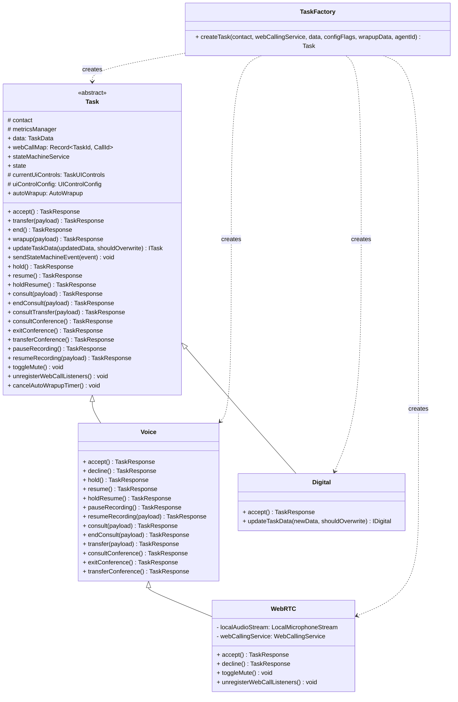
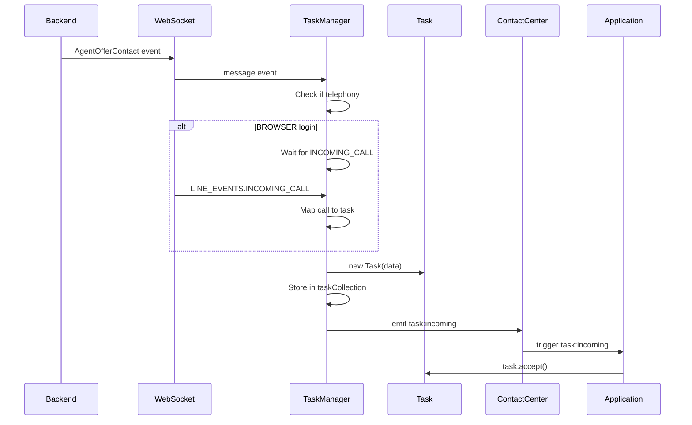
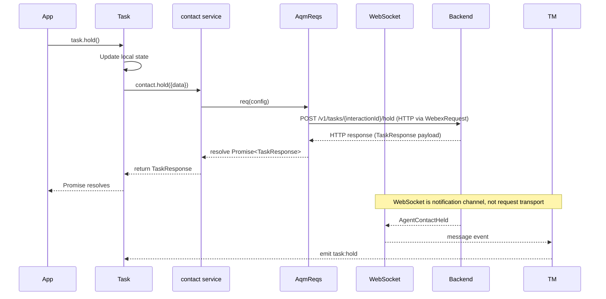
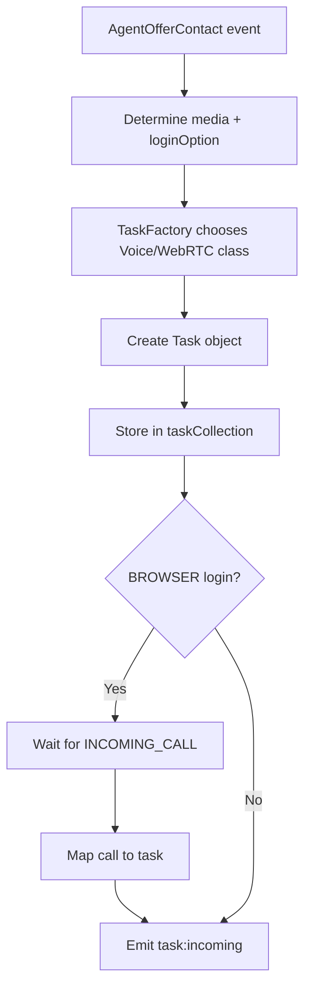

# Task Service - Architecture

> **Purpose**: Technical documentation for task lifecycle management.

---

## Component Overview

| Component            | File                         | Responsibility                                             |
| -------------------- | ---------------------------- | ---------------------------------------------------------- |
| `TaskManager`        | `task/TaskManager.ts`        | Task lifecycle coordination                                |
| `Task`               | `task/Task.ts`               | Individual task operations                                 |
| `contact`            | `task/contact.ts`            | AQM request definitions                                    |
| `dialer`             | `task/dialer.ts`             | Outbound call initiation                                   |
| `AutoWrapup`         | `task/AutoWrapup.ts`         | Auto wrapup timer                                          |
| `taskDataNormalizer` | `task/taskDataNormalizer.ts` | Normalizes backend task payloads                           |
| `TaskUtils`          | `task/TaskUtils.ts`          | Utility functions                                          |
| `state-machine`      | `task/state-machine/*`       | Task state transitions, guards, and UI control computation |

---

## Task Module Design Overview

### `Task` (abstract)

**File:** `Task.ts`

**Properties**

- `data: TaskData`
- `webCallMap: Record<TaskId, CallId>`
- `stateMachineService?: ActorRefFrom<TaskStateMachine>`
- `state?: SnapshotFrom<TaskStateMachine>`
- `autoWrapup?: AutoWrapup`
- `uiControls: TaskUIControls` (getter)

**Methods**

- `accept(): Promise<TaskResponse>` (abstract)
- `decline(): Promise<TaskResponse>` (default: unsupportedMethodError)
- `pauseRecording(): Promise<TaskResponse>` (default: unsupportedMethodError)
- `resumeRecording(resumeRecordingPayload: ResumeRecordingPayload): Promise<TaskResponse>` (default: unsupportedMethodError)
- `consult(consultPayload: ConsultPayload): Promise<TaskResponse>` (default: unsupportedMethodError)
- `endConsult(consultEndPayload?: ConsultEndPayload): Promise<TaskResponse>` (default: unsupportedMethodError)
- `consultTransfer(consultTransferPayload?: ConsultTransferPayLoad): Promise<TaskResponse>` (default: unsupportedMethodError)
- `consultConference(): Promise<TaskResponse>` (default: unsupportedMethodError)
- `exitConference(): Promise<TaskResponse>` (default: unsupportedMethodError)
- `transferConference(): Promise<TaskResponse>` (default: unsupportedMethodError)
- `switchCall(): Promise<TaskResponse>` (default: unsupportedMethodError)
- `toggleMute(): Promise<void>` (default: unsupportedMethodError)
- `unregisterWebCallListeners(): void` (default: no-op + log)
- `cancelAutoWrapupTimer(): void`
- `hold(mediaResourceId?: string): Promise<TaskResponse>` (default: unsupportedMethodError)
- `resume(mediaResourceId?: string): Promise<TaskResponse>` (default: unsupportedMethodError)
- `holdResume(): Promise<TaskResponse>` (default: unsupportedMethodError)
- `sendStateMachineEvent(event: TaskEventPayload): void`
- `updateTaskData(updatedData: TaskData, shouldOverwrite = false): ITask`
- `transfer(transferPayload: TransferPayLoad): Promise<TaskResponse>`
- `end(): Promise<TaskResponse>`
- `wrapup(wrapupPayload: WrapupPayLoad): Promise<TaskResponse>`

### `Voice`

**File:** `voice/Voice.ts`

**Notes**

- Extends `Task`.
- Provides `hold()` and `resume()` that delegate to `holdResume()`.
- Explicitly overrides `accept()` and `decline()` to throw `unsupportedMethodError`.
- `WebRTC` then overrides these methods with concrete implementations.

### `WebRTC`

**File:** `voice/WebRTC.ts`

**Notes**

- Extends `Voice`.
- Overrides `accept()` and `decline()` for WebRTC calls.
- Emits `TASK_EVENTS.TASK_MEDIA` on remote media (`CALL_EVENT_KEYS.REMOTE_MEDIA`).
- Overrides `unregisterWebCallListeners()`.

### `Digital`

**File:** `digital/Digital.ts`

**Notes**

- Extends `Task`.
- Implements `accept()`.
- Overrides `updateTaskData()` to refresh digital task data and UI controls.

### `TaskFactory`

**File:** `TaskFactory.ts`

**API**

- `createTask(contact, webCallingService, data, configFlags, wrapupData?, agentId?): Task`

**Behavior**

- Chooses `WebRTC` vs `Voice` for `MEDIA_CHANNEL.TELEPHONY` based on `webCallingService.loginOption`.
- Chooses `Digital` for `MEDIA_CHANNEL.CHAT`, `MEDIA_CHANNEL.EMAIL`, `MEDIA_CHANNEL.SOCIAL`.
- Throws `Error` for unknown media types.

### Task Class Hierarchy Diagram



---

## TaskManager Pattern

TaskManager is a singleton that:

1. Listens for WebSocket task events
2. Creates/manages Task objects
3. Routes events to appropriate tasks
4. Handles WebRTC call mapping

```typescript
// Singleton access
const taskManager = TaskManager.getTaskManager(contact, webCallingService, webSocketManager);
```

---

## AQM Request Modules

### `routingContact(aqm: AqmReqs)` (`contact.ts`)

Returns an object of AQM request methods wired to `TASK_API` and `TASK_MESSAGE_TYPE`.

**Methods**

- `accept`
- `hold`
- `unHold`
- `pauseRecording`
- `resumeRecording`
- `consult`
- `consultEnd`
- `consultAccept`
- `blindTransfer`
- `vteamTransfer`
- `consultTransfer`
- `end`
- `wrapup`
- `cancelTask`
- `cancelCtq`
- `consultConference`
- `exitConference`
- `conferenceTransfer`

**Notes**

- Uses `WCC_API_GATEWAY`.
- Consult with `DESTINATION_TYPE.QUEUE` uses `TIMEOUT_REQ` = `'disabled'` for the request timeout.

### `aqmDialer(aqm: AqmReqs)` (`dialer.ts`)

Returns an object of AQM request methods for outbound dialing.

**Methods**

- `startOutdial` (success: `CC_EVENTS.AGENT_OFFER_CONTACT`, failure: `CC_EVENTS.AGENT_OUTBOUND_FAILED`)

---

## Usage in Task Classes

### `Task` (`Task.ts`)

- Constructor accepts `contact: ReturnType<typeof routingContact>`.
- Uses:
  - `contact.vteamTransfer` / `contact.blindTransfer` in `transfer(...)`.
  - While in consulting state, `transfer(...)` internally routes through consult-transfer behavior.
  - `contact.end` in `end()`.
  - `contact.wrapup` in `wrapup(...)`.

### `Voice` (`voice/Voice.ts`)

Uses `contact` for:

- `hold`, `unHold`
- `pauseRecording`, `resumeRecording`
- `consult`, `consultEnd`, `consultTransfer`
- `consultConference`, `exitConference`, `conferenceTransfer`

### `Digital` (`digital/Digital.ts`)

Uses `contact.accept` in `accept()`.

---

## State Machine Layer

`Task` delegates lifecycle transitions and control-state derivation to the state machine:

- Transition graph: `state-machine/TaskStateMachine.ts`
- Transition conditions: `state-machine/guards.ts`
- Context mutation and integration hooks: `state-machine/actions.ts`
- UI control derivation: `state-machine/uiControlsComputer.ts`

For state-machine-specific implementation guidance, use:

- `../state-machine/ai-docs/AGENTS.md`
- `../state-machine/ai-docs/ARCHITECTURE.md`

### State Inventory (from `state-machine/constants.ts`)

- **Active lifecycle + intermediate states**:
  - `IDLE`, `OFFERED`, `CONNECTED`
  - `HOLD_INITIATING`, `HELD`, `RESUME_INITIATING`
  - `CONSULT_INITIATING`, `CONSULTING`, `CONF_INITIATING`
  - `CONFERENCING`, `WRAPPING_UP`, `COMPLETED`, `TERMINATED`
- **Future placeholders (defined, not currently implemented in transitions)**:
  - `CONSULT_INITIATED`, `CONSULT_COMPLETED`, `POST_CALL`, `PARKED`, `MONITORING`

---

## Event Flow

### Incoming Task Flow



### Task Operation Flow



---

## Task Collection

TaskManager maintains a map of active tasks:

```typescript
private taskCollection: Record<TaskId, ITask> = {};

// Tasks indexed by interactionId
this.taskCollection[interactionId] = task;

// Retrieve task
const task = this.taskCollection[interactionId];
```

---

## WebSocket Event Handling

TaskManager uses a staged pipeline in `registerTaskListeners()`:

```typescript
this.webSocketManager.on('message', (event) => {
  // 1) Parse and validate message
  const message = TaskManager.parseWebSocketMessage(event);
  if (!message) return;

  // 2) Build event context (task, payload, mapped state-machine event)
  const eventContext = this.prepareEventContext(message);
  if (!eventContext) return;

  // 3) Handle lifecycle changes (create/update/remove task)
  const actions = this.handleTaskLifecycleEvent(eventContext);
  const {task} = actions;
  if (!task) return;

  // 4) Keep task.data synchronized
  const {payload, stateMachineEvent} = eventContext;
  if (payload) this.updateTaskData(task, payload);

  // 5) Drive state machine (which emits TASK_EVENTS)
  if (stateMachineEvent) {
    task.sendStateMachineEvent(stateMachineEvent);
  }
});
```

### RTD / AI Assistant event routing

`TaskManager.handleRealtimeWebsocketEvent()` handles payloads arriving on the realtime subscription socket used for AI features. It:

1. Normalizes the websocket envelope (`payload.data` vs direct payload form)
2. Resolves the owning task via `conversationId`
3. Emits `REAL_TIME_TRANSCRIPTION` on the task for transcript payloads
4. Emits `SUGGESTED_RESPONSE` on the task only when the backend payload is a final suggestion (`data.type === 'SUGGESTION'`)
5. Ignores `SUGGESTED_RESPONSE_ACKNOWLEDGE` for public SDK emission

This keeps transcript and suggestion delivery aligned on the same per-task event surface.

---

## WebRTC Integration

For BROWSER login, TaskManager integrates with WebCalling:



### Call Mapping

```typescript
// WebCallingService maps call IDs to interaction IDs
this.webCallingService.mapCallToTask(callId, interactionId);

// Task uses call for media operations
this.webCallingService.answerCall(localAudioStream: LocalMicrophoneStream, taskId: string);
```

---

## Auto Wrapup

AutoWrapup handles automatic task completion:

```typescript
// AutoWrapup.ts
export default class AutoWrapup {
  private timer: ReturnType<typeof setTimeout> | null = null;
  private readonly interval: number;

  start(onComplete: () => void) {
    this.timer = setTimeout(onComplete, this.interval);
  }

  clear() {
    if (this.timer) {
      clearTimeout(this.timer);
      this.timer = null;
    }
  }

  getTimeLeft() {}
  isRunning() {}
  getTimeLeftSeconds() {}
}
```

---

## Contact Service Operations

Each task operation maps to an AQM request:

```typescript
// contact.ts
export default function routingContact(routing: AqmReqs) {
  return {
    accept: routing.req((p) => ({
      url: '/v1/tasks/.../accept',
      notifSuccess: { bind: { type: CC_EVENTS.AGENT_CONTACT_ASSIGNED }},
      notifFail: { bind: { type: CC_EVENTS.AGENT_CONTACT_ASSIGN_FAILED }},
    })),

    hold: routing.req((p) => ({...})),
    unHold: routing.req((p) => ({...})),
    consultAccept: routing.req((p) => ({...})),
    cancelTask: routing.req((p) => ({...})),
    cancelCtq: routing.req((p) => ({...})),
    end: routing.req((p) => ({...})),
    wrapup: routing.req((p) => ({...})),
    blindTransfer: routing.req((p) => ({...})),
    consult: routing.req((p) => ({...})),
    consultTransfer: routing.req((p) => ({...})),
    // ... more operations
  };
}
```

---

## Task Utils

Helper functions for task state analysis:

```typescript
// TaskUtils.ts

// Check if participant is in main interaction
isParticipantInMainInteraction(task, agentId);

// Check if conference is in progress
getIsConferenceInProgress(taskData);

// Check if agent is primary
isPrimary(task, agentId);

// Check if secondary EPDN agent
isSecondaryEpDnAgent(interaction);
```

---

## Metrics Tracking

| Metric                  | Type                 | When Tracked       |
| ----------------------- | -------------------- | ------------------ |
| `TASK_ACCEPT_SUCCESS`   | behavioral, business | Task accepted      |
| `TASK_HOLD_SUCCESS`     | operational          | Hold succeeded     |
| `TASK_END_SUCCESS`      | behavioral, business | Task ended         |
| `TASK_WRAPUP_SUCCESS`   | operational          | Wrapup completed   |
| `TASK_TRANSFER_SUCCESS` | behavioral, business | Transfer completed |
| `TASK_OUTDIAL_SUCCESS`  | behavioral, business | Outdial completed  |

---

## Troubleshooting

### Issue: task:incoming not received

**Cause**: Agent not available or TaskManager not initialized

**Solution**:

1. Ensure `cc.register()` completed
2. Ensure `cc.stationLogin()` completed
3. Ensure agent state is Available

### Issue: Task operations fail

**Cause**: Task state doesn't allow operation

**Solution**: Check task state before operation:

```typescript
if (task.uiControls.hold.isEnabled) {
  await task.hold();
}
```

### Issue: WebRTC call not connecting

**Cause**: Call not mapped to task

**Solution**: Ensure BROWSER login and mercury connected:

```typescript
await webex.internal.mercury.connect();
await cc.stationLogin({ loginOption: 'BROWSER', ... });
```

---

## Related Files

- [cc.ts](../../../cc.ts) - Main plugin
- [TaskManager.ts](../TaskManager.ts) - Manager
- [contact.ts](../contact.ts) - Contact operations
- [types.ts](../types.ts) - Type definitions
- [../state-machine/ai-docs/AGENTS.md](../state-machine/ai-docs/AGENTS.md) - State machine guide
- [../state-machine/ai-docs/ARCHITECTURE.md](../state-machine/ai-docs/ARCHITECTURE.md) - State machine architecture
