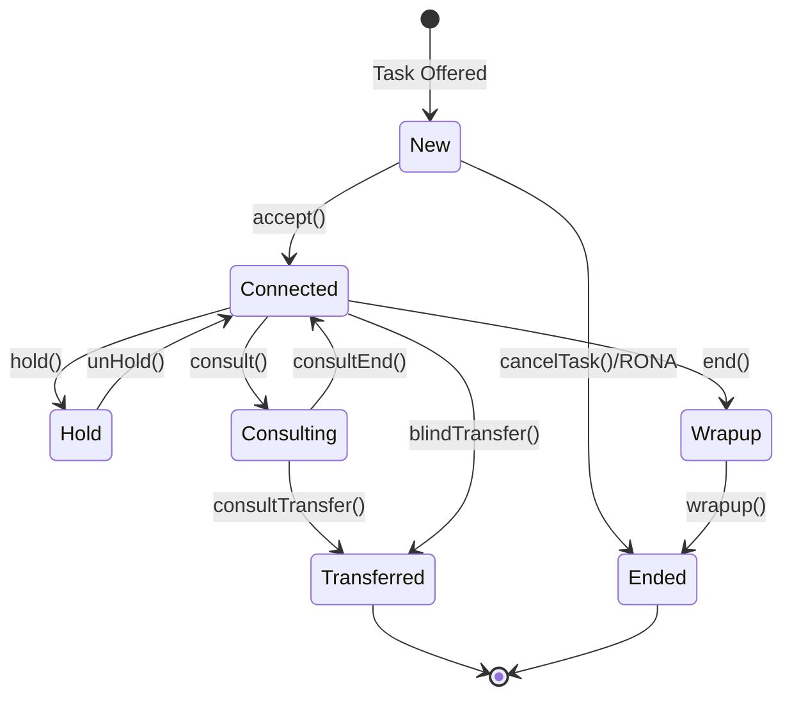
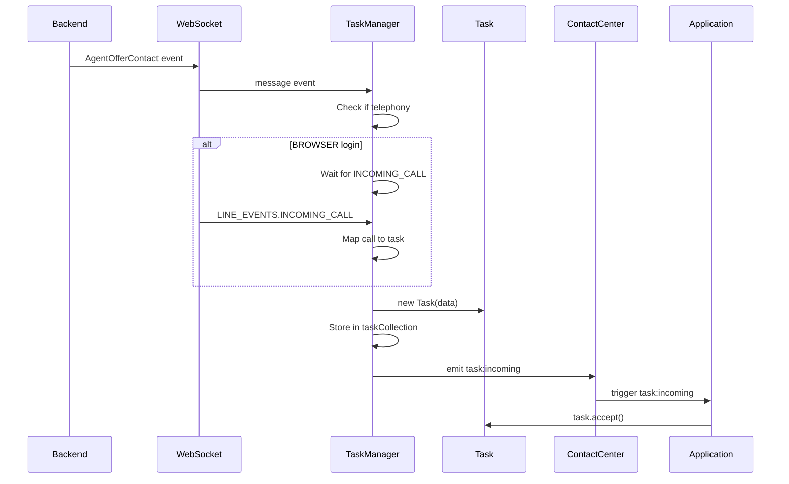
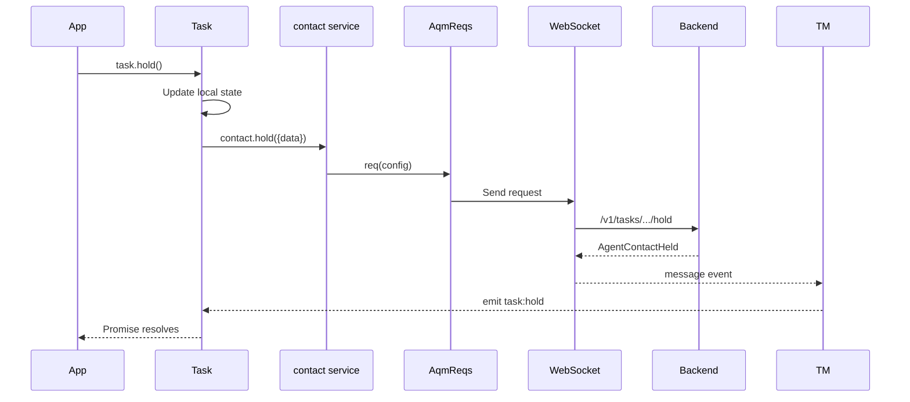
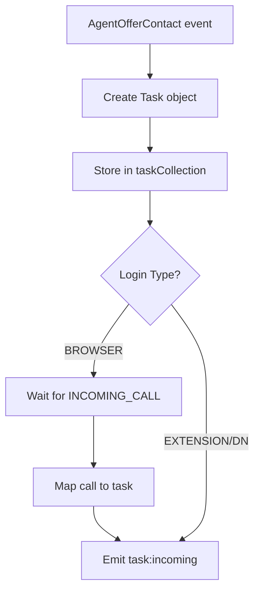

# Task Service - Architecture

> **Purpose**: Technical documentation for task lifecycle management.

---

## Component Overview

| Component | File | Responsibility |
|-----------|------|----------------|
| `TaskManager` | `task/TaskManager.ts` | Task lifecycle coordination |
| `Task` | `task/index.ts` | Individual task operations |
| `contact` | `task/contact.ts` | AQM request definitions |
| `dialer` | `task/dialer.ts` | Outbound call initiation |
| `AutoWrapup` | `task/AutoWrapup.ts` | Auto wrapup timer |
| `TaskUtils` | `task/TaskUtils.ts` | Utility functions |

---

## File Structure

```
services/task/
├── index.ts              # Task class (ITask implementation)
├── TaskManager.ts        # Singleton task manager
├── contact.ts            # Contact operations (AQM)
├── dialer.ts             # Outbound dialing (AQM)
├── AutoWrapup.ts         # Auto wrapup handler
├── TaskUtils.ts          # Helper functions
├── types.ts              # Task types and events
├── constants.ts          # Task constants
└── ai-docs/
    ├── AGENTS.md         # Usage documentation
    └── ARCHITECTURE.md   # This file
```

---

## Task Lifecycle



---

## TaskManager Pattern

TaskManager is a singleton that:
1. Listens for WebSocket task events
2. Creates/manages Task objects
3. Routes events to appropriate tasks
4. Handles WebRTC call mapping

```typescript
// Singleton access
const taskManager = TaskManager.getTaskManager(contact, webCallingService, webSocketManager);
```

---

## Event Flow

### Incoming Task Flow



### Task Operation Flow



---

## Task Collection

TaskManager maintains a map of active tasks:

```typescript
private taskCollection: Record<TaskId, ITask> = {};

// Tasks indexed by interactionId
this.taskCollection[interactionId] = task;

// Retrieve task
const task = this.taskCollection[interactionId];
```

---

## WebSocket Event Handling

TaskManager listens for CC_TASK_EVENTS and routes to tasks:

```typescript
this.webSocketManager.on('message', (event) => {
  const payload = JSON.parse(event);
  
  if (payload.data?.type) {
    if (Object.values(CC_TASK_EVENTS).includes(payload.data.type)) {
      const task = this.taskCollection[payload.data.interactionId];
      // Route event to task
    }
  }
  
  switch (payload.data.type) {
    case CC_EVENTS.AGENT_CONTACT:
      // Create or update task
      break;
    case CC_EVENTS.AGENT_OFFER_CONTACT:
      // Incoming task
      break;
    case CC_TASK_EVENTS.CONTACT_ENDED:
      // Task ended
      break;
    // ... more cases
  }
});
```

---

## WebRTC Integration

For BROWSER login, TaskManager integrates with WebCalling:



### Call Mapping

```typescript
// WebCallingService maps call IDs to interaction IDs
this.webCallingService.mapCallToTask(callId, interactionId);

// Task uses call for media operations
this.webCallingService.answer();
this.webCallingService.hold();
```

---

## Auto Wrapup

AutoWrapup handles automatic task completion:

```typescript
// AutoWrapup.ts
export default class AutoWrapup {
  private timer: NodeJS.Timeout;
  private duration: number;
  
  start(onComplete: () => void) {
    this.timer = setTimeout(onComplete, this.duration * 1000);
  }
  
  cancel() {
    clearTimeout(this.timer);
  }
  
  extend(additionalTime: number) {
    // Add time to existing timer
  }
}
```

---

## Contact Service Operations

Each task operation maps to an AQM request:

```typescript
// contact.ts
export default function routingContact(routing: AqmReqs) {
  return {
    accept: routing.req((p) => ({
      url: '/v1/tasks/.../accept',
      notifSuccess: { bind: { type: CC_EVENTS.AGENT_CONTACT_ASSIGNED }},
      notifFail: { bind: { type: CC_EVENTS.AGENT_CONTACT_ASSIGN_FAILED }},
    })),
    
    hold: routing.req((p) => ({...})),
    unHold: routing.req((p) => ({...})),
    end: routing.req((p) => ({...})),
    wrapup: routing.req((p) => ({...})),
    blindTransfer: routing.req((p) => ({...})),
    consult: routing.req((p) => ({...})),
    consultTransfer: routing.req((p) => ({...})),
    // ... more operations
  };
}
```

---

## Task Utils

Helper functions for task state analysis:

```typescript
// TaskUtils.ts

// Check if participant is in main interaction
isParticipantInMainInteraction(interaction, participantId);

// Check if conference is in progress
getIsConferenceInProgress(taskData);

// Check if agent is primary
isPrimary(taskData, agentId);

// Check if secondary EPDN agent
isSecondaryEpDnAgent(taskData, agentId);
```

---

## Metrics Tracking

| Metric | Type | When Tracked |
|--------|------|--------------|
| `TASK_INCOMING` | operational | Task offered |
| `TASK_ACCEPTED` | behavioral, business | Task accepted |
| `TASK_HOLD_SUCCESS` | operational | Hold succeeded |
| `TASK_ENDED` | behavioral, business | Task ended |
| `TASK_WRAPUP_SUCCESS` | operational | Wrapup completed |
| `TASK_TRANSFER_SUCCESS` | behavioral, business | Transfer completed |
| `TASK_OUTDIAL_SUCCESS` | behavioral, business | Outdial completed |

---

## Troubleshooting

### Issue: task:incoming not received

**Cause**: Agent not available or TaskManager not initialized

**Solution**:
1. Ensure `cc.register()` completed
2. Ensure `cc.stationLogin()` completed
3. Ensure agent state is Available

### Issue: Task operations fail

**Cause**: Task state doesn't allow operation

**Solution**: Check task state before operation:
```typescript
if (task.data.state === 'connected' && !task.data.isOnHold) {
  await task.hold();
}
```

### Issue: WebRTC call not connecting

**Cause**: Call not mapped to task

**Solution**: Ensure BROWSER login and mercury connected:
```typescript
await webex.internal.mercury.connect();
await cc.stationLogin({ loginOption: 'BROWSER', ... });
```

---

## Related Files

- [cc.ts](../../../cc.ts) - Main plugin
- [TaskManager.ts](../TaskManager.ts) - Manager
- [contact.ts](../contact.ts) - Contact operations
- [types.ts](../types.ts) - Type definitions
